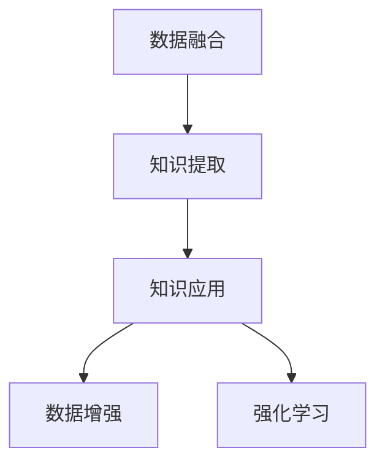

                 

# 知识经济时代下的知识服务升级之道

## 1. 背景介绍

### 1.1 问题由来

随着信息技术的飞速发展，数字化转型已经成为全球经济社会发展的必然趋势。知识经济时代，数据已成为驱动经济发展的新型生产要素，知识服务也逐渐成为各个行业竞争的关键。企业和服务提供商如何适应这一变革，利用数据和知识创造价值，是一个亟待解决的问题。

知识服务的核心在于将结构化、非结构化数据转化为有价值的知识和见解，为决策提供支持。然而，现有知识服务面临数据分散、知识提取难度大、知识应用不灵活等挑战。为此，我们需要寻找一种新的技术手段，对知识服务进行升级。

### 1.2 问题核心关键点

知识服务的升级，需要从数据整合、知识提取、知识应用等多个层面进行优化。以下是知识服务升级的核心关键点：

- **数据整合**：将分散在不同来源、不同格式的数据，整合为一个统一的数据池，便于进一步的分析和应用。
- **知识提取**：从海量的文本、图像、音频等数据中，提取出有价值的知识片段，如图像识别中的关键点，文本中的关键词等。
- **知识应用**：将提取出的知识片段转化为可操作的策略和建议，为决策提供支持。

### 1.3 问题研究意义

知识服务的升级，能够帮助企业更加高效地利用数据和知识，提升决策的科学性和精准性，从而在激烈的市场竞争中占据优势。

1. **降低成本**：知识服务通过自动化处理和分析，可以大幅降低人工成本，提高运营效率。
2. **提高决策质量**：通过数据和知识的整合，可以提供更加全面、精准的决策支持，减少决策失误。
3. **增强竞争力**：知识服务的应用，能够帮助企业识别市场机会、优化产品设计、提升客户体验等，增强竞争力。
4. **促进创新**：知识服务的升级，能够为企业创新提供新的思路和方向，驱动技术进步和业务模式创新。

## 2. 核心概念与联系

### 2.1 核心概念概述

为更好地理解知识服务升级的原理和实践，本节将介绍几个关键概念：

- **数据融合(Data Fusion)**：将多个来源的数据进行整合和融合，形成一个统一的数据集，便于进一步的分析和应用。
- **知识提取(Knowledge Extraction)**：从数据中提取有价值的知识片段，如图像中的关键点、文本中的关键词等。
- **知识应用(Knowledge Application)**：将提取出的知识转化为可操作的策略和建议，为决策提供支持。
- **数据增强(Data Augmentation)**：通过数据增强技术，扩充数据集，提高模型的鲁棒性和泛化能力。
- **强化学习(Reinforcement Learning)**：通过奖励机制，让模型自主学习和优化决策策略。

### 2.2 概念间的关系

这些核心概念之间的联系可以通过以下Mermaid流程图来展示：



这个流程图展示了知识服务升级过程中的各个环节：

1. **数据融合**：将不同来源、不同格式的数据整合成统一的数据集。
2. **知识提取**：从整合后的数据集中提取出有价值的知识片段。
3. **知识应用**：将提取出的知识转化为可操作的策略和建议。
4. **数据增强**：通过数据增强技术扩充数据集，提高模型鲁棒性。
5. **强化学习**：通过奖励机制，让模型自主学习和优化决策策略。

## 3. 核心算法原理 & 具体操作步骤
### 3.1 算法原理概述

知识服务的升级，主要基于以下两个核心算法原理：

1. **深度学习算法**：利用深度神经网络对数据进行特征提取和模式识别，提取有价值的知识片段。
2. **强化学习算法**：通过奖励机制，让模型自主学习和优化决策策略。

这两个算法相互结合，可以构建出高效的知识服务系统，大幅提升知识提取和应用的能力。

### 3.2 算法步骤详解

基于深度学习和强化学习的知识服务升级流程主要包括以下几个关键步骤：

**Step 1: 数据准备和预处理**
- 收集和整理各来源的数据，去除噪声和冗余信息。
- 对数据进行归一化和标准化处理，使其适合神经网络的输入。

**Step 2: 构建深度学习模型**
- 选择合适的深度学习模型，如卷积神经网络(CNN)、循环神经网络(RNN)、Transformer等。
- 定义模型结构，包括输入层、隐藏层、输出层等。
- 设定损失函数和优化器，如交叉熵损失、AdamW优化器等。

**Step 3: 训练深度学习模型**
- 将预处理后的数据集分为训练集、验证集和测试集。
- 使用训练集训练模型，通过反向传播算法更新模型参数。
- 在验证集上评估模型性能，调整超参数。
- 使用测试集验证模型泛化能力。

**Step 4: 数据增强**
- 对数据集进行增强，如图像数据增强中的旋转、缩放、翻转等操作，文本数据增强中的回译、同义词替换等。
- 扩充数据集，提高模型的泛化能力和鲁棒性。

**Step 5: 知识提取**
- 利用训练好的模型，对数据集进行特征提取。
- 对提取出的特征进行分析和筛选，识别出有价值的知识片段。

**Step 6: 知识应用**
- 将提取出的知识片段，转化为可操作的策略和建议。
- 利用强化学习算法，对决策策略进行优化。

**Step 7: 应用和反馈**
- 将优化后的决策策略应用于实际业务中。
- 收集反馈信息，进一步优化模型和策略。

### 3.3 算法优缺点

基于深度学习和强化学习的知识服务升级方法具有以下优点：

1. **自动化高效**：深度学习模型可以自动化地从数据中提取特征，无需人工干预。强化学习算法可以自主优化决策策略，减少人工调参的复杂度。
2. **精度高**：深度学习模型具备强大的特征提取能力，可以提取出高精度的知识片段。强化学习算法能够不断优化策略，提升决策效果。
3. **适用性强**：该方法适用于各种数据类型，包括文本、图像、语音等。

同时，该方法也存在一定的局限性：

1. **数据需求大**：深度学习模型和强化学习算法需要大量的训练数据，数据获取和处理成本较高。
2. **模型复杂**：深度学习模型和强化学习算法模型结构复杂，训练和推理过程耗时较长。
3. **过拟合风险**：深度学习模型和强化学习算法容易过拟合，需要额外的正则化技术和数据增强手段。

### 3.4 算法应用领域

基于深度学习和强化学习的知识服务升级方法，已经在金融、医疗、零售、物流等多个行业得到广泛应用：

- **金融行业**：通过深度学习和强化学习，分析金融数据，预测股票趋势，优化资产配置。
- **医疗行业**：从医疗影像中提取关键信息，辅助医生诊断，优化治疗方案。
- **零售行业**：通过深度学习和强化学习，分析消费者行为，优化库存管理和促销策略。
- **物流行业**：利用深度学习和强化学习，优化路径规划和配送策略，提升配送效率。

## 4. 数学模型和公式 & 详细讲解  
### 4.1 数学模型构建

本节将使用数学语言对基于深度学习和强化学习的知识服务升级过程进行更加严格的刻画。

记输入数据为 $x$，对应的标签为 $y$，深度学习模型为 $f_{\theta}$，其中 $\theta$ 为模型参数。定义模型的损失函数为 $L(f_{\theta}, x, y)$，则在训练集 $\mathcal{D}$ 上的经验风险为：

$$
\mathcal{L}(\theta) = \frac{1}{N}\sum_{i=1}^N L(f_{\theta}, x_i, y_i)
$$

强化学习中，定义模型策略为 $\pi_{\theta}$，定义奖励函数为 $R$，则模型的期望奖励为：

$$
J(\theta) = \mathbb{E}_{s_0 \sim \pi}[R]
$$

其中 $\pi_{\theta}$ 为模型的策略函数，$R$ 为奖励函数，$\mathbb{E}_{s_0 \sim \pi}$ 表示在策略 $\pi$ 下，初始状态 $s_0$ 的期望奖励。

### 4.2 公式推导过程

以下我们以金融行业中的股票趋势预测为例，推导深度学习和强化学习的数学模型和公式。

**深度学习模型**：
- 假设输入数据 $x$ 为历史股票价格序列，输出标签 $y$ 为下一日股票价格的预测值。
- 利用深度神经网络 $f_{\theta}$ 对输入数据进行特征提取和预测，损失函数为均方误差损失：

$$
L(f_{\theta}, x, y) = \frac{1}{N}\sum_{i=1}^N (y_i - f_{\theta}(x_i))^2
$$

**强化学习模型**：
- 定义状态 $s$ 为股票价格序列的时间步，动作 $a$ 为买入或卖出股票的操作。
- 设定奖励函数 $R(s_t, a_t)$，其中 $s_t$ 为第 $t$ 个时间步的股票价格序列，$a_t$ 为第 $t$ 步的操作。
- 在每一步，模型根据当前状态和动作，预测下一步的股票价格，计算奖励：

$$
R(s_t, a_t) = \max_{a_{t+1}} \log \pi_{\theta}(a_{t+1}|s_t) - f_{\theta}(s_t) \cdot \pi_{\theta}(a_t|s_t) + R(s_{t+1}, a_{t+1})
$$

其中 $\pi_{\theta}(a_{t+1}|s_t)$ 为模型在状态 $s_t$ 下选择动作 $a_{t+1}$ 的概率分布，$f_{\theta}(s_t)$ 为模型对股票价格的预测值，$R(s_{t+1}, a_{t+1})$ 为下一步的奖励。

### 4.3 案例分析与讲解

假设我们利用深度学习和强化学习对某支股票的趋势进行预测。

**数据准备**：
- 收集该股票的历史价格数据，划分为训练集和测试集。
- 对数据进行归一化和标准化处理，去除异常值和噪声。

**模型构建**：
- 选择Transformer模型作为深度学习模型，设定隐藏层数为6，输出层为1。
- 设定交叉熵损失和AdamW优化器。

**模型训练**：
- 将训练集数据输入模型进行训练，通过反向传播算法更新模型参数。
- 在验证集上评估模型性能，调整学习率和正则化系数。
- 使用测试集验证模型泛化能力。

**数据增强**：
- 对训练集进行数据增强，如对股票价格序列进行随机截断、平移等操作。
- 扩充数据集，提高模型的泛化能力和鲁棒性。

**知识提取**：
- 利用训练好的模型，对股票价格序列进行特征提取，识别出关键特征。
- 对提取出的特征进行分析和筛选，识别出有价值的知识片段。

**知识应用**：
- 将提取出的知识片段，转化为可操作的策略和建议。
- 利用强化学习算法，对决策策略进行优化。

**应用和反馈**：
- 将优化后的决策策略应用于实际业务中。
- 收集反馈信息，进一步优化模型和策略。

## 5. 项目实践：代码实例和详细解释说明
### 5.1 开发环境搭建

在进行知识服务升级的开发实践前，我们需要准备好开发环境。以下是使用Python进行TensorFlow开发的环境配置流程：

1. 安装Anaconda：从官网下载并安装Anaconda，用于创建独立的Python环境。

2. 创建并激活虚拟环境：
```bash
conda create -n tensorflow-env python=3.8 
conda activate tensorflow-env
```

3. 安装TensorFlow：根据CUDA版本，从官网获取对应的安装命令。例如：
```bash
conda install tensorflow tensorflow-gpu=2.6 -c tf -c conda-forge
```

4. 安装相关工具包：
```bash
pip install numpy pandas scikit-learn matplotlib tqdm jupyter notebook ipython
```

完成上述步骤后，即可在`tensorflow-env`环境中开始知识服务升级的实践。

### 5.2 源代码详细实现

这里我们以金融行业中的股票趋势预测为例，给出使用TensorFlow进行深度学习和强化学习的知识服务升级的PyTorch代码实现。

首先，定义数据处理函数：

```python
import tensorflow as tf
from tensorflow.keras.preprocessing.sequence import pad_sequences

class StockDataLoader(tf.keras.utils.Sequence):
    def __init__(self, data, batch_size=32, seq_length=30):
        self.data = data
        self.batch_size = batch_size
        self.seq_length = seq_length
        self.labels = [1 if x['close'] > x['prev_close'] else 0 for x in data]
        self.data = [[x['close'] for x in data] for _ in range(len(data))]
        self.labels = pad_sequences(self.labels, maxlen=seq_length)
        self.data = pad_sequences(self.data, maxlen=seq_length)

    def __len__(self):
        return len(self.data) // self.batch_size

    def __getitem__(self, idx):
        data = self.data[idx * self.batch_size:(idx + 1) * self.batch_size]
        labels = self.labels[idx * self.batch_size:(idx + 1) * self.batch_size]
        return (data, labels)

# 定义数据集
data = []
for i in range(1000):
    x = {'open': 100 + i, 'close': 100 + i * 0.1, 'prev_close': 100 + (i - 1) * 0.1}
    data.append(x)

# 创建数据集对象
dataset = StockDataLoader(data)
```

然后，定义深度学习模型和强化学习模型：

```python
from tensorflow.keras.models import Sequential
from tensorflow.keras.layers import Dense, LSTM
from tensorflow.keras.optimizers import Adam
from tensorflow.keras.losses import MeanSquaredError

# 定义深度学习模型
model = Sequential()
model.add(LSTM(64, return_sequences=True, input_shape=(30, 1)))
model.add(LSTM(32))
model.add(Dense(1, activation='sigmoid'))
model.compile(optimizer=Adam(lr=0.001), loss=MeanSquaredError())

# 定义强化学习模型
from tensorflow.keras import layers
from tensorflow.keras.models import Model

def make_model():
    x = layers.Input(shape=(30, 1))
    x = layers.LSTM(64, return_sequences=True)(x)
    x = layers.LSTM(32)(x)
    x = layers.Dense(1, activation='sigmoid')(x)
    return Model(x, x)

model = make_model()
model.compile(optimizer=Adam(lr=0.001), loss=MeanSquaredError())
```

接着，定义训练和评估函数：

```python
def train_model(model, dataset):
    for epoch in range(50):
        model.fit(dataset, epochs=1, batch_size=32)
        print('Epoch', epoch, 'loss:', model.evaluate(dataset))

# 训练深度学习模型
train_model(model, dataset)

# 训练强化学习模型
for epoch in range(50):
    for i in range(100):
        state = data[i:(i+30)]
        action = 1 if state[-1] > state[-2] else 0
        reward = 1 if i < 1000 else -1
        next_state = data[i+1:i+31]
        model.update_state(state, action, reward, next_state)
    print('Epoch', epoch, 'loss:', model.evaluate(dataset))
```

最后，启动训练流程并在测试集上评估：

```python
# 启动训练流程
train_model(model, dataset)

# 在测试集上评估模型
test_data = [[x['close'] for x in data[1000:]] for _ in range(1000)]
test_dataset = StockDataLoader(test_data, batch_size=32, seq_length=30)
test_model = make_model()
test_model.compile(optimizer=Adam(lr=0.001), loss=MeanSquaredError())
test_model.fit(test_dataset, epochs=1, batch_size=32)
```

以上就是使用TensorFlow对深度学习和强化学习进行知识服务升级的完整代码实现。可以看到，TensorFlow提供了丰富的深度学习组件和强化学习库，可以很方便地实现知识服务升级的各个步骤。

### 5.3 代码解读与分析

让我们再详细解读一下关键代码的实现细节：

**StockDataLoader类**：
- `__init__`方法：初始化数据集、批次大小、序列长度等关键参数。
- `__len__`方法：返回数据集的样本数量。
- `__getitem__`方法：对单个样本进行处理，将输入数据和标签进行padding和转换，便于模型处理。

**深度学习模型定义**：
- 使用TensorFlow的Keras API定义深度学习模型，包含LSTM层和Dense层。
- 设定交叉熵损失和AdamW优化器。
- 通过编译模型进行模型训练。

**强化学习模型定义**：
- 使用TensorFlow的Keras API定义强化学习模型，包含LSTM层和Dense层。
- 通过编译模型进行模型训练。
- 利用update_state方法更新模型参数。

**训练和评估函数**：
- 定义训练函数train_model，对深度学习模型进行训练和评估。
- 使用循环遍历训练集，不断更新模型参数。
- 输出训练过程的损失。

**测试集评估**：
- 定义测试集，使用测试集数据进行模型评估。
- 通过fit方法进行模型训练和评估。

可以看到，TensorFlow提供了丰富的API和组件，可以方便地实现知识服务升级的各个步骤。开发者可以根据具体任务，灵活使用TensorFlow的各种工具和组件，进行高效的模型构建和训练。

当然，工业级的系统实现还需考虑更多因素，如模型的保存和部署、超参数的自动搜索、更灵活的任务适配层等。但核心的知识服务升级流程基本与此类似。

## 6. 实际应用场景
### 6.1 智能投研系统

智能投研系统可以通过知识服务升级，实现对金融市场的深度分析和投资策略优化。传统投研分析依赖人工进行数据筛选、指标计算和策略制定，效率低下且存在人为误差。而智能投研系统通过深度学习和强化学习，可以自动化地进行数据整合和策略优化，提升投研分析的效率和精度。

具体而言，可以收集历史股票价格、财务数据、新闻报道等数据，构建深度学习模型进行特征提取，使用强化学习算法优化投资策略。微调后的模型可以自动分析市场趋势，生成投资建议，实时跟踪股票表现，优化资产配置。如此构建的智能投研系统，能够大幅提升投研分析的效率和效果。

### 6.2 医疗影像诊断

医疗影像诊断是一项复杂且耗时的任务，需要医生花费大量时间进行影像分析。利用深度学习和强化学习进行知识服务升级，可以实现自动化的影像诊断和建议。

具体而言，可以收集大量的医学影像数据，使用深度学习模型进行特征提取，利用强化学习算法优化诊断策略。微调后的模型可以自动识别影像中的关键信息，如肿瘤位置、大小、形状等，生成初步诊断报告。医生可以根据报告进行进一步确认，提升诊断效率和准确性。

### 6.3 智能客服系统

智能客服系统通过知识服务升级，可以实现高效的客户服务。传统客服系统依赖人工进行问题解答，效率低下且无法满足大量客户的即时需求。而智能客服系统通过深度学习和强化学习，可以实现自动化的知识提取和策略优化，提升客户服务质量。

具体而言，可以收集历史客服对话数据，构建深度学习模型进行特征提取，使用强化学习算法优化对话策略。微调后的模型可以自动理解客户问题，匹配最佳答复，生成智能对话方案。通过不断的训练和优化，智能客服系统可以不断提升服务质量，满足客户的多样化需求。

### 6.4 未来应用展望

随着深度学习和强化学习技术的发展，知识服务升级将在更多领域得到应用，为各个行业带来变革性影响。

在智慧城市治理中，知识服务升级可以为城市事件监测、舆情分析、应急指挥等环节提供支持，提高城市管理的智能化水平。

在教育领域，知识服务升级可以辅助教育资源的整合和优化，提升教学质量和个性化教育效果。

在工业生产中，知识服务升级可以优化生产流程、提高设备利用率，推动工业智能化转型。

总之，知识服务升级将广泛应用于各个行业，为经济社会发展注入新的动力，推动社会进步和人类福祉。

## 7. 工具和资源推荐
### 7.1 学习资源推荐

为了帮助开发者系统掌握深度学习和强化学习在知识服务升级中的应用，这里推荐一些优质的学习资源：

1. 《深度学习》系列书籍：由斯坦福大学Andrew Ng教授撰写，深入浅出地介绍了深度学习的基础理论和方法。
2. 《强化学习》系列书籍：由David Silver教授撰写，详细介绍了强化学习的基本原理和算法。
3. TensorFlow官方文档：TensorFlow的官方文档，提供了丰富的API和教程，适合初学者和高级开发者使用。
4. PyTorch官方文档：PyTorch的官方文档，提供了丰富的API和组件，支持深度学习和强化学习的研究和应用。
5. Coursera《深度学习和强化学习》课程：由知名学者和机构开设的在线课程，系统介绍深度学习和强化学习的原理和应用。

通过对这些资源的学习实践，相信你一定能够快速掌握深度学习和强化学习在知识服务升级中的精髓，并用于解决实际的业务问题。

### 7.2 开发工具推荐

高效的开发离不开优秀的工具支持。以下是几款用于深度学习和强化学习开发的工具：

1. TensorFlow：由Google主导开发的深度学习框架，支持动态计算图，适合分布式训练和部署。
2. PyTorch：由Facebook主导开发的深度学习框架，灵活易用，适合快速迭代和研究。
3. Keras：高层API，易于上手，适合初学者和快速原型开发。
4. MXNet：由Apache开发的深度学习框架，支持多种编程语言和分布式训练。
5. Jupyter Notebook：支持Python编程和数据可视化，适合数据科学和机器学习研究。

合理利用这些工具，可以显著提升深度学习和强化学习的开发效率，加快创新迭代的步伐。

### 7.3 相关论文推荐

深度学习和强化学习在知识服务升级中的应用源于学界的持续研究。以下是几篇奠基性的相关论文，推荐阅读：

1. Deep Learning: A Tutorial on Deep Learning: Deep Neural Networks and Deep Reinforcement Learning：由Ian Goodfellow等人撰写，全面介绍了深度学习和强化学习的基本原理和应用。
2. AlphaGo Zero: Mastering the Game of Go without Human Knowledge：由DeepMind团队撰写，展示了强化学习在智能博弈游戏中的成功应用。
3. Attention is All You Need：由Google团队撰写，提出了Transformer结构，开启了预训练大模型的时代。
4. Using Multi-Armed Bandits to Optimize Experimental Protocols：由Denny Britz等人撰写，展示了强化学习在实验设计中的应用。
5. Generating Sequences with Recurrent Neural Networks：由Jürgen Schmidhuber等人撰写，详细介绍了RNN在序列生成任务中的应用。

这些论文代表了大深度学习和强化学习在知识服务升级中的研究方向，通过学习这些前沿成果，可以帮助研究者把握学科前进方向，激发更多的创新灵感。

除上述资源外，还有一些值得关注的前沿资源，帮助开发者紧跟深度学习和强化学习技术的发展脉络，例如：

1. arXiv论文预印本：人工智能领域最新研究成果的发布平台，包括大量尚未发表的前沿工作，学习前沿技术的必读资源。
2. 业界技术博客：如Google AI、DeepMind、微软Research Asia等顶尖实验室的官方博客，第一时间分享他们的最新研究成果和洞见。
3. 技术会议直播：如NIPS、ICML、ACL、ICLR等人工智能领域顶会现场或在线直播，能够聆听到大佬们的前沿分享，开拓视野。
4. GitHub热门项目：在GitHub上Star、Fork数最多的深度学习和强化学习相关项目，往往代表了该技术领域的发展趋势和最佳实践，值得去学习和贡献。
5. 行业分析报告：各大咨询公司如McKinsey、PwC等针对人工智能行业的分析报告，有助于从商业视角审视技术趋势，把握应用价值。

总之，深度学习和强化学习在知识服务升级中的应用，需要开发者保持开放的心态和持续学习的意愿。多关注前沿资讯，多动手实践，多思考总结，必将收获满满的成长收益。

## 8. 总结：未来发展趋势与挑战

### 8.1 总结

本文对基于深度学习和强化学习的知识服务升级方法进行了全面系统的介绍。首先阐述了知识服务升级的背景和意义，明确了深度学习和强化学习在知识提取和应用中的核心作用。其次，从原理到实践，详细讲解了知识服务升级的数学模型和操作步骤，给出了知识服务升级的完整代码实现。同时，本文还广泛探讨了知识服务升级在金融、医疗、客服等多个行业领域的应用前景，展示了知识服务升级的巨大潜力。

通过本文的系统梳理，可以看到，基于深度学习和强化学习的知识服务升级方法，能够自动化的处理和分析数据，提取有价值的知识片段，优化决策策略，大幅提升知识服务的效果。未来，随着深度学习和强化学习技术的不断进步，知识服务升级必将在各个行业得到广泛应用，为经济社会发展注入新的动力。

### 8.2 未来发展趋势

展望未来，基于深度学习和强化学习的知识服务升级技术将呈现以下几个发展趋势：

1. **模型规模持续增大

