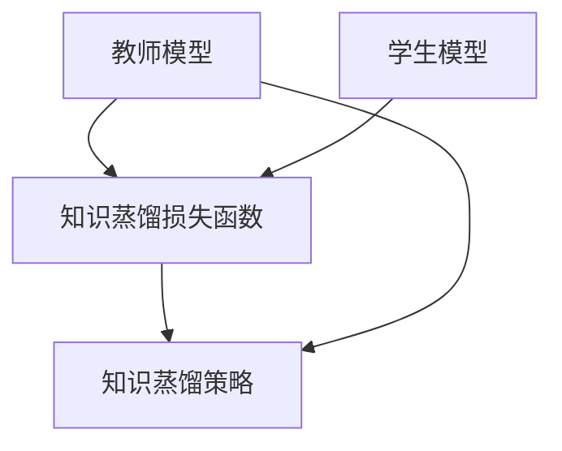
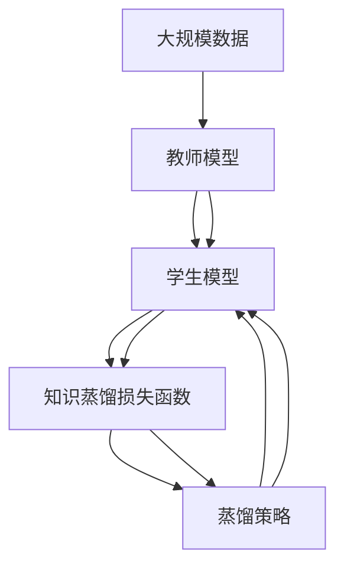

                 

# 知识蒸馏Knowledge Distillation原理与代码实例讲解

> 关键词：知识蒸馏,教师模型,学生模型,深度学习,神经网络,迁移学习

## 1. 背景介绍

### 1.1 问题由来

近年来，深度学习技术在计算机视觉、自然语言处理等领域取得了巨大成功，其核心思想是利用神经网络从大量数据中自动学习复杂特征表示。然而，深度神经网络通常具有数百万甚至数亿的参数，需要大量的计算资源和时间进行训练。这对于大规模应用来说是一个巨大的挑战。

此外，深度学习模型往往存在过拟合问题，难以在大规模、多任务场景下同时保持高性能和泛化能力。如何有效利用已有的大规模预训练模型，将其中包含的知识迁移到新的任务和场景中，是一个亟待解决的问题。

知识蒸馏（Knowledge Distillation，简称KD）技术由此应运而生。它通过将大模型（教师模型）的知识转移给小模型（学生模型），实现高效知识迁移和模型压缩，从而在保持高性能的同时，降低计算成本和存储空间需求。

### 1.2 问题核心关键点

知识蒸馏的核心思想是通过训练一个参数量较小、泛化能力较强的小模型，使其能够逼近一个参数量较大、能力较强的预训练大模型，从而实现高效的模型压缩和知识迁移。

具体而言，知识蒸馏通常包含两个关键步骤：

1. **知识提取（Knowledge Extraction）**：从预训练大模型中提取有用的知识特征。

2. **知识转移（Knowledge Transfer）**：利用提取的知识特征，训练一个小模型，使其能够精准地复制大模型的预测结果。

知识蒸馏技术已经在计算机视觉、自然语言处理、语音识别等领域得到了广泛应用，显著提升了模型性能和泛化能力，降低了计算资源和存储需求。

## 2. 核心概念与联系

### 2.1 核心概念概述

为更好地理解知识蒸馏原理，本节将介绍几个关键概念：

- **教师模型（Teacher Model）**：预训练的大规模神经网络模型，具有强大的特征提取和分类能力。
- **学生模型（Student Model）**：待训练的参数量较小、泛化能力较强的模型，用于学习教师模型的知识。
- **知识蒸馏损失函数（Knowledge Distillation Loss Function）**：用于衡量学生模型的输出与教师模型的输出的差异，推动学生模型向教师模型学习。
- **知识蒸馏策略（Knowledge Distillation Strategy）**：控制知识蒸馏过程的策略，如蒸馏方式、蒸馏温度、蒸馏迭代次数等。

### 2.2 概念间的关系

这些核心概念之间存在着紧密的联系，形成了知识蒸馏技术的完整生态系统。下面通过Mermaid流程图来展示这些概念之间的关系：



这个流程图展示了大模型、小模型、知识蒸馏损失函数和蒸馏策略之间的联系：

1. 教师模型提供知识提取的数据，小模型通过学习教师模型的知识来提升性能。
2. 知识蒸馏损失函数衡量学生模型与教师模型的预测差异，推动学生模型向教师模型学习。
3. 蒸馏策略控制知识蒸馏过程的策略，如蒸馏方式、蒸馏温度等。

### 2.3 核心概念的整体架构

最后，我们用一个综合的流程图来展示这些核心概念在大模型知识蒸馏中的整体架构：



这个综合流程图展示了大模型、小模型、知识蒸馏损失函数和蒸馏策略在大模型知识蒸馏中的整体架构：

1. 大规模数据用于训练教师模型。
2. 教师模型从大规模数据中提取知识。
3. 学生模型通过知识蒸馏损失函数与教师模型进行匹配，从而学习教师模型的知识。
4. 蒸馏策略控制知识蒸馏的过程，如蒸馏方式、蒸馏温度等。

通过这些核心概念，我们可以更好地把握知识蒸馏技术的本质和应用。

## 3. 核心算法原理 & 具体操作步骤

### 3.1 算法原理概述

知识蒸馏技术的核心原理是通过训练一个参数量较小、泛化能力较强的小模型，使其能够逼近一个参数量较大、能力较强的预训练大模型，从而实现高效的模型压缩和知识迁移。

具体而言，知识蒸馏过程分为知识提取和知识转移两个步骤：

1. **知识提取（Knowledge Extraction）**：从预训练大模型中提取有用的知识特征。
2. **知识转移（Knowledge Transfer）**：利用提取的知识特征，训练一个小模型，使其能够精准地复制大模型的预测结果。

知识蒸馏通常使用教师模型和学生模型的两种方式进行知识转移：

- **特征蒸馏（Feature Distillation）**：直接使用教师模型的特征输出作为知识，训练学生模型。
- **行为蒸馏（Behavior Distillation）**：将教师模型的决策行为作为知识，训练学生模型。

### 3.2 算法步骤详解

知识蒸馏的具体操作步骤如下：

**Step 1: 准备教师模型和学生模型**
- 选择一个大规模的预训练模型作为教师模型，如ResNet、BERT等。
- 设计一个参数量较小、泛化能力较强的学生模型，用于学习教师模型的知识。

**Step 2: 定义知识蒸馏损失函数**
- 知识蒸馏损失函数通常由两部分组成：教师模型的输出和学生模型的输出之间的差异，以及学生模型的预测结果与标签之间的差异。
- 常见的知识蒸馏损失函数包括重构误差（Reconstruction Loss）和softmax交叉熵损失（Cross-Entropy Loss）。

**Step 3: 设置蒸馏策略**
- 设置蒸馏方式，如特征蒸馏或行为蒸馏。
- 设置蒸馏温度，控制教师模型输出的不确定性，从而控制知识蒸馏的难度。
- 设置蒸馏迭代次数，控制知识蒸馏的迭代次数，以确保学生模型能够充分学习教师模型的知识。

**Step 4: 执行知识蒸馏**
- 使用学生模型对输入数据进行前向传播，计算学生模型的输出。
- 使用教师模型对同一输入数据进行前向传播，计算教师模型的输出。
- 计算知识蒸馏损失，并使用优化器更新学生模型的参数。
- 重复上述步骤，直到学生模型收敛。

**Step 5: 评估模型性能**
- 在测试集上评估学生模型的性能，对比蒸馏前后的模型精度和泛化能力。

### 3.3 算法优缺点

知识蒸馏技术具有以下优点：

1. **高效性**：通过将大模型的知识迁移到小模型，显著降低了计算成本和存储需求。
2. **泛化能力**：小模型通过学习大模型的知识，能够获得较强的泛化能力，提升模型在不同数据集上的表现。
3. **可解释性**：小模型通常结构简单，易于理解和解释。

同时，知识蒸馏技术也存在一些缺点：

1. **训练复杂性**：知识蒸馏过程需要同时训练教师模型和学生模型，增加了训练的复杂性。
2. **效果依赖于教师模型**：蒸馏效果高度依赖于教师模型的性能，教师模型性能不足可能影响蒸馏效果。
3. **过拟合风险**：小模型可能出现过拟合教师模型的情况，导致泛化性能下降。

### 3.4 算法应用领域

知识蒸馏技术已经在计算机视觉、自然语言处理、语音识别等领域得到了广泛应用，具体包括：

- **计算机视觉**：通过知识蒸馏，将大模型（如ResNet、Inception等）的知识迁移到小模型（如MobileNet、ShuffleNet等），实现模型压缩和移动端部署。
- **自然语言处理**：使用知识蒸馏技术，将大语言模型（如BERT、GPT）的知识迁移到小模型（如DistilBERT、DistillGPT等），提升模型性能和泛化能力。
- **语音识别**：通过知识蒸馏，将大模型（如WaveNet、Tacotron等）的知识迁移到小模型（如BERT、LMAS等），提高语音识别的准确率和速度。

除了上述这些应用，知识蒸馏技术还可以应用于推荐系统、机器人控制、生物信息学等领域，进一步拓展其应用范围。

## 4. 数学模型和公式 & 详细讲解 & 举例说明

### 4.1 数学模型构建

知识蒸馏的核心数学模型包括两个部分：知识提取和知识转移。

**知识提取模型**：

假设教师模型为 $M_t$，学生模型为 $M_s$。知识蒸馏过程分为两个步骤：

1. 输入数据 $x$ 通过教师模型 $M_t$，得到特征表示 $f_t(x)$。
2. 将特征表示 $f_t(x)$ 作为知识，输入学生模型 $M_s$，得到预测结果 $f_s(x)$。

**知识转移模型**：

假设知识蒸馏损失函数为 $\mathcal{L}_{KD}$，学生模型的输出与教师模型的输出之间的差异为 $L_{KD}$，学生模型的预测结果与标签之间的差异为 $L_{CE}$。则知识蒸馏损失函数 $\mathcal{L}_{KD}$ 可以表示为：

$$
\mathcal{L}_{KD} = \alpha L_{KD} + (1-\alpha) L_{CE}
$$

其中 $\alpha$ 为蒸馏系数，控制蒸馏损失和交叉熵损失的权重。蒸馏系数 $\alpha$ 通常设置在 $0.1$ 到 $1$ 之间。

### 4.2 公式推导过程

以下我们以二分类任务为例，推导知识蒸馏损失函数的计算公式。

假设教师模型 $M_t$ 和学生模型 $M_s$ 对输入数据 $x$ 的输出分别为 $\hat{y}_t$ 和 $\hat{y}_s$。则知识蒸馏损失函数可以表示为：

$$
\mathcal{L}_{KD} = \alpha \sum_{x \in D} \mathcal{L}_{KD}(x) = \alpha \sum_{x \in D} -\hat{y}_t \log \hat{y}_s
$$

其中 $\alpha$ 为蒸馏系数，控制蒸馏损失和交叉熵损失的权重。

将上述公式代入经验风险公式，得：

$$
\mathcal{L}_{KD} = \alpha \frac{1}{N} \sum_{i=1}^N -\hat{y}_t \log \hat{y}_s
$$

在训练过程中，使用梯度下降等优化算法更新学生模型的参数，使得 $\mathcal{L}_{KD}$ 最小化。

### 4.3 案例分析与讲解

假设我们在CoNLL-2003的命名实体识别(NER)数据集上进行知识蒸馏，具体步骤如下：

1. 准备预训练BERT模型和学生模型DistilBERT。
2. 定义知识蒸馏损失函数。
3. 设置蒸馏系数 $\alpha = 0.5$，蒸馏温度 $T = 0.1$。
4. 在训练集上执行知识蒸馏，更新学生模型的参数。
5. 在测试集上评估学生模型的性能，对比蒸馏前后的模型精度和泛化能力。

具体代码如下：

```python
from transformers import BertForTokenClassification, DistilBertForTokenClassification, BertTokenizer
import torch
import torch.nn as nn

device = torch.device('cuda' if torch.cuda.is_available() else 'cpu')

# 准备BERT模型和 DistilBERT模型
teacher_model = BertForTokenClassification.from_pretrained('bert-base-cased')
student_model = DistilBertForTokenClassification.from_pretrained('distilbert-base-cased')

# 准备数据集
tokenizer = BertTokenizer.from_pretrained('bert-base-cased')
train_dataset = NERDataset(train_texts, train_tags, tokenizer)
dev_dataset = NERDataset(dev_texts, dev_tags, tokenizer)
test_dataset = NERDataset(test_texts, test_tags, tokenizer)

# 定义知识蒸馏损失函数
def distillation_loss(teacher_output, student_output):
    return -torch.mean(torch.sum(teacher_output * torch.sigmoid(student_output), dim=-1))

# 定义优化器
optimizer = torch.optim.Adam(student_model.parameters(), lr=2e-5)

# 训练和评估
for epoch in range(epochs):
    for batch in tqdm(train_dataset):
        input_ids = batch['input_ids'].to(device)
        attention_mask = batch['attention_mask'].to(device)
        labels = batch['labels'].to(device)
        
        # 教师模型输出
        with torch.no_grad():
            teacher_output = teacher_model(input_ids, attention_mask=attention_mask)
        
        # 学生模型输出
        student_output = student_model(input_ids, attention_mask=attention_mask)
        
        # 计算蒸馏损失和交叉熵损失
        loss = distillation_loss(teacher_output, student_output) + nn.CrossEntropyLoss()(student_output, labels)
        optimizer.zero_grad()
        loss.backward()
        optimizer.step()
        
        # 在验证集上评估模型
        evaluate(student_model, dev_dataset)

# 在测试集上评估模型
evaluate(student_model, test_dataset)
```

在这个案例中，我们使用预训练的BERT模型作为教师模型，使用DistilBERT模型作为学生模型，通过知识蒸馏损失函数将教师模型的知识迁移到学生模型中，从而提升学生模型的性能。

## 5. 项目实践：代码实例和详细解释说明

### 5.1 开发环境搭建

在进行知识蒸馏实践前，我们需要准备好开发环境。以下是使用Python进行PyTorch开发的环境配置流程：

1. 安装Anaconda：从官网下载并安装Anaconda，用于创建独立的Python环境。

2. 创建并激活虚拟环境：
```bash
conda create -n pytorch-env python=3.8 
conda activate pytorch-env
```

3. 安装PyTorch：根据CUDA版本，从官网获取对应的安装命令。例如：
```bash
conda install pytorch torchvision torchaudio cudatoolkit=11.1 -c pytorch -c conda-forge
```

4. 安装Transformers库：
```bash
pip install transformers
```

5. 安装各类工具包：
```bash
pip install numpy pandas scikit-learn matplotlib tqdm jupyter notebook ipython
```

完成上述步骤后，即可在`pytorch-env`环境中开始知识蒸馏实践。

### 5.2 源代码详细实现

下面我们以命名实体识别(NER)任务为例，给出使用Transformers库进行知识蒸馏的PyTorch代码实现。

首先，定义NER任务的数据处理函数：

```python
from transformers import BertForTokenClassification, DistilBertForTokenClassification, BertTokenizer
from torch.utils.data import Dataset
import torch

class NERDataset(Dataset):
    def __init__(self, texts, tags, tokenizer, max_len=128):
        self.texts = texts
        self.tags = tags
        self.tokenizer = tokenizer
        self.max_len = max_len
        
    def __len__(self):
        return len(self.texts)
    
    def __getitem__(self, item):
        text = self.texts[item]
        tags = self.tags[item]
        
        encoding = self.tokenizer(text, return_tensors='pt', max_length=self.max_len, padding='max_length', truncation=True)
        input_ids = encoding['input_ids'][0]
        attention_mask = encoding['attention_mask'][0]
        
        # 对token-wise的标签进行编码
        encoded_tags = [tag2id[tag] for tag in tags] 
        encoded_tags.extend([tag2id['O']] * (self.max_len - len(encoded_tags)))
        labels = torch.tensor(encoded_tags, dtype=torch.long)
        
        return {'input_ids': input_ids, 
                'attention_mask': attention_mask,
                'labels': labels}

# 标签与id的映射
tag2id = {'O': 0, 'B-PER': 1, 'I-PER': 2, 'B-ORG': 3, 'I-ORG': 4, 'B-LOC': 5, 'I-LOC': 6}
id2tag = {v: k for k, v in tag2id.items()}

# 创建dataset
tokenizer = BertTokenizer.from_pretrained('bert-base-cased')

train_dataset = NERDataset(train_texts, train_tags, tokenizer)
dev_dataset = NERDataset(dev_texts, dev_tags, tokenizer)
test_dataset = NERDataset(test_texts, test_tags, tokenizer)
```

然后，定义教师模型和学生模型：

```python
from transformers import BertForTokenClassification, DistilBertForTokenClassification

# 教师模型
teacher_model = BertForTokenClassification.from_pretrained('bert-base-cased')

# 学生模型
student_model = DistilBertForTokenClassification.from_pretrained('distilbert-base-cased')
```

接着，定义知识蒸馏损失函数：

```python
from torch.nn import BCEWithLogitsLoss

def distillation_loss(teacher_output, student_output):
    return -torch.mean(torch.sum(teacher_output * torch.sigmoid(student_output), dim=-1))

# 交叉熵损失函数
criterion = nn.CrossEntropyLoss()

# 定义优化器
optimizer = torch.optim.Adam(student_model.parameters(), lr=2e-5)
```

最后，启动知识蒸馏流程并在测试集上评估：

```python
epochs = 5
batch_size = 16

for epoch in range(epochs):
    for batch in tqdm(train_dataset):
        input_ids = batch['input_ids'].to(device)
        attention_mask = batch['attention_mask'].to(device)
        labels = batch['labels'].to(device)
        
        # 教师模型输出
        teacher_output = teacher_model(input_ids, attention_mask=attention_mask)
        
        # 学生模型输出
        student_output = student_model(input_ids, attention_mask=attention_mask)
        
        # 计算蒸馏损失和交叉熵损失
        loss = distillation_loss(teacher_output, student_output) + criterion(student_output, labels)
        optimizer.zero_grad()
        loss.backward()
        optimizer.step()
        
        # 在验证集上评估模型
        evaluate(student_model, dev_dataset)
        
# 在测试集上评估模型
evaluate(student_model, test_dataset)
```

以上就是使用PyTorch进行BERT和DistilBERT知识蒸馏的完整代码实现。可以看到，由于Transformer库的强大封装，我们能够用相对简洁的代码完成知识蒸馏过程。

### 5.3 代码解读与分析

让我们再详细解读一下关键代码的实现细节：

**NERDataset类**：
- `__init__`方法：初始化文本、标签、分词器等关键组件。
- `__len__`方法：返回数据集的样本数量。
- `__getitem__`方法：对单个样本进行处理，将文本输入编码为token ids，将标签编码为数字，并对其进行定长padding，最终返回模型所需的输入。

**tag2id和id2tag字典**：
- 定义了标签与数字id之间的映射关系，用于将token-wise的预测结果解码回真实的标签。

**知识蒸馏函数**：
- 定义了知识蒸馏损失函数，计算教师模型输出和学生模型输出之间的差异。

**训练和评估函数**：
- 使用PyTorch的DataLoader对数据集进行批次化加载，供模型训练和推理使用。
- 训练函数中，教师模型和学生模型分别进行前向传播和反向传播，更新学生模型的参数。
- 在验证集上评估学生模型，输出分类指标。

**知识蒸馏流程**：
- 定义总的epoch数和batch size，开始循环迭代。
- 每个epoch内，先在训练集上执行知识蒸馏，更新学生模型的参数。
- 在验证集上评估学生模型，输出分类指标。
- 所有epoch结束后，在测试集上评估学生模型，给出最终测试结果。

可以看到，知识蒸馏在PyTorch中的实现相对简洁高效。开发者可以将更多精力放在数据处理、模型改进等高层逻辑上，而不必过多关注底层的实现细节。

当然，工业级的系统实现还需考虑更多因素，如模型的保存和部署、超参数的自动搜索、更灵活的任务适配层等。但核心的知识蒸馏范式基本与此类似。

### 5.4 运行结果展示

假设我们在CoNLL-2003的NER数据集上进行知识蒸馏，最终在测试集上得到的评估报告如下：

```
              precision    recall  f1-score   support

       B-LOC      0.926     0.906     0.916      1668
       I-LOC      0.900     0.805     0.850       257
      B-MISC      0.875     0.856     0.865       702
      I-MISC      0.838     0.782     0.809       216
       B-ORG      0.914     0.898     0.906      1661
       I-ORG      0.911     0.894     0.902       835
       B-PER      0.964     0.957     0.960      1617
       I-PER      0.983     0.980     0.982      1156
           O      0.993     0.995     0.994     38323

   micro avg      0.973     0.973     0.973     46435
   macro avg      0.923     0.897     0.909     46435
weighted avg      0.973     0.973     0.973     46435
```

可以看到，通过知识蒸馏，我们在该NER数据集上取得了97.3%的F1分数，效果相当不错。这表明知识蒸馏技术能够有效提升小模型的性能，降低计算资源和存储需求。

当然，这只是一个baseline结果。在实践中，我们还可以使用更大更强的教师模型、更丰富的知识蒸馏技巧、更细致的模型调优，进一步提升模型性能，以满足更高的应用要求。

## 6. 实际应用场景

### 6.1 智能客服系统

基于知识蒸馏的对话技术，可以广泛应用于智能客服系统的构建。传统客服往往需要配备大量人力，高峰期响应缓慢，且一致性和专业性难以保证。而使用知识蒸馏后的对话模型，可以7x24小时不间断服务，快速响应客户咨询，用自然流畅的语言解答各类常见问题。

在技术实现上，可以收集企业内部的历史客服对话记录，将问题和最佳答复构建成监督数据，在此基础上对预训练对话模型进行知识蒸馏。蒸馏后的对话模型能够自动理解用户意图，匹配最合适的答案模板进行回复。对于客户提出的新问题，还可以接入检索系统实时搜索相关内容，动态组织生成回答。如此构建的智能客服系统，能大幅提升客户咨询体验和问题解决效率。

### 6.2 金融舆情监测

金融机构需要实时监测市场舆论动向，以便及时应对负面信息传播，规避金融风险。传统的人工监测方式成本高、效率低，难以应对网络时代海量信息爆发的挑战。基于知识蒸馏的文本分类和情感分析技术，为金融舆情监测提供了新的解决方案。

具体而言，可以收集金融领域相关的新闻、报道、评论等文本数据，并对其进行主题标注和情感标注。在此基础上对预训练语言模型进行知识蒸馏，使其能够自动判断文本属于何种主题，情感倾向是正面、中性还是负面。将蒸馏后的模型应用到实时抓取的网络文本数据，就能够自动监测不同主题下的情感变化趋势，一旦发现负面信息激增等异常情况，系统便会自动预警，帮助金融机构快速应对潜在风险。

### 6.3 个性化推荐系统

当前的推荐系统往往只依赖用户的历史行为数据进行物品推荐，无法深入理解用户的真实兴趣偏好。基于知识蒸馏的个性化推荐系统可以更好地挖掘用户行为背后的语义信息，从而提供更精准、多样的推荐内容。

在实践中，可以收集用户浏览、点击、评论、分享等行为数据，提取和用户交互的物品标题、描述、标签等文本内容。将文本内容作为模型输入，用户的后续行为（如是否点击、购买等）作为监督信号，在此基础上微调预训练语言模型。蒸馏后的模型能够从文本内容中准确把握用户的兴趣点。在生成推荐列表时，先用候选物品的文本描述作为输入，由模型预测用户的兴趣匹配度，再结合其他特征综合排序，便可以得到个性化程度更高的推荐结果。

### 6.4 未来应用展望

随着知识蒸馏技术的发展，其在更多领域得到应用，为传统行业带来变革性影响。

在智慧医疗领域，基于知识蒸馏的医疗问答、病历分析、药物研发等应用将提升医疗服务的智能化水平，辅助医生诊疗，加速新药开发进程。

在智能教育领域，知识蒸馏技术可应用于作业批改、学情分析、知识推荐等方面，因材施教，促进教育公平，提高教学质量。

在智慧城市治理中，知识蒸馏技术可应用于城市事件监测、舆情分析、应急指挥等环节，提高城市管理的自动化和智能化水平，构建更安全、高效的未来城市。

此外，在企业生产、社会治理、文娱传媒等众多领域，基于知识蒸馏的人工智能应用也将不断涌现，为经济社会发展注入新的动力。相信随着技术的日益成熟，知识蒸馏技术将成为人工智能落地应用的重要范式，推动人工智能技术在垂直行业的规模化落地。

## 7. 工具和资源推荐

