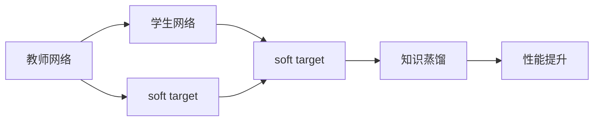
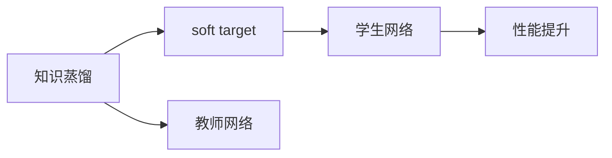
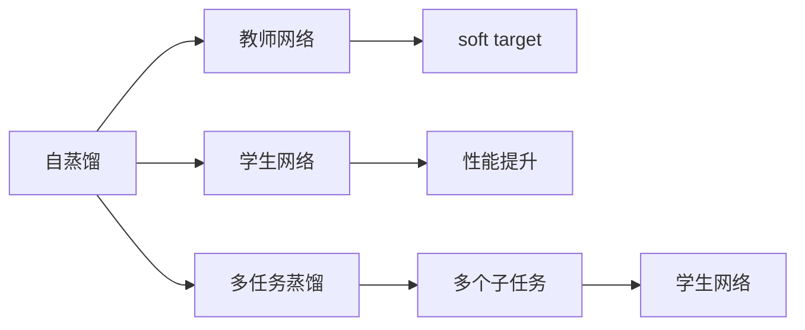
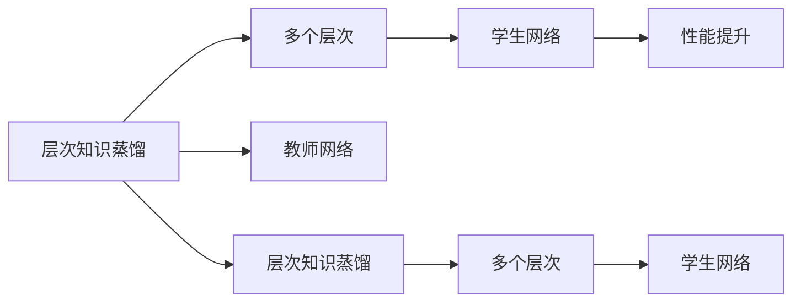
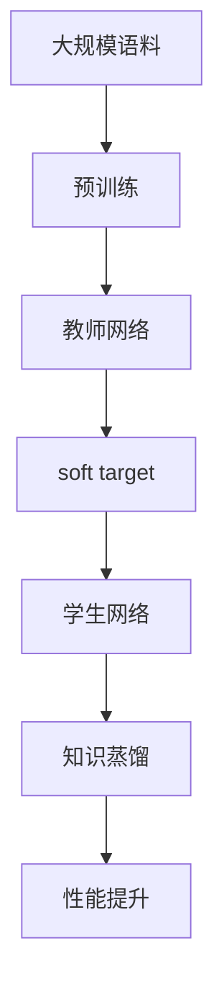

                 

## 1. 背景介绍

### 1.1 问题由来

近年来，深度神经网络（DNNs）在计算机视觉、自然语言处理、语音识别等诸多领域取得了显著的进展。然而，构建高精度DNN模型往往需要庞大的训练数据和计算资源，这对于小规模数据集和资源受限的场景来说是一个重大挑战。为此，研究者们提出了知识蒸馏（Knowledge Distillation, KD）方法，通过从高精度模型中学习到隐含的知识，并将其传递给低精度模型，实现性能提升。

知识蒸馏最早由Barron等人在2004年提出，并命名为"knowledge transfer"，但在2014年Hinton等人才正式命名为"knowledge distillation"。方法论上，知识蒸馏不仅限于从高精度模型中提取隐含知识，也可以应用到从教师网络中提取显性知识传递给学生网络。

本文将系统介绍知识蒸馏的原理和应用，涵盖从基础知识到深度实践，对当前知识蒸馏技术的进展进行总结和展望。

### 1.2 问题核心关键点

知识蒸馏的核心是教师网络（T）和学生网络（S）之间的知识转移。其中，教师网络是已经训练好的高质量模型，学生网络是需要提升性能的较小模型。知识蒸馏的目标是通过教师网络的知识蒸馏，使得学生网络在保留重要信息的同时，去除无关信息，从而达到提高性能的目的。

具体的，知识蒸馏方法包括以下几个关键步骤：

1. 选择一个已经训练好的教师网络。
2. 设计损失函数，将教师网络的输出映射到学生网络的输出。
3. 在教师网络监督下，训练学生网络，使其学习教师网络的知识。
4. 在目标任务上测试学生网络，评估其性能提升效果。

## 2. 核心概念与联系

### 2.1 核心概念概述

为了更好地理解知识蒸馏技术，本节将介绍几个关键的概念：

- **知识蒸馏（Knowledge Distillation）**：通过从高精度模型（教师网络）中学习到隐含的知识，并将其传递给低精度模型（学生网络），使得学生网络能够更好地适应目标任务，从而提升性能。

- **教师网络（T）**：已经训练好的高精度模型，其知识被蒸馏到学生网络中。

- **学生网络（S）**：需要提升性能的较小模型，通过学习教师网络的知识来优化自身。

- **soft target（软目标）**：与传统监督学习中使用硬目标标签不同，soft target是通过对教师网络输出进行平滑处理得到的，便于学生网络学习教师网络的隐含知识。

- **层次知识蒸馏（Hierarchical Knowledge Distillation）**：将教师网络分为多个层次，每个层次学习一个子目标，逐层蒸馏知识。

- **多任务蒸馏（Multi-task Distillation）**：教师网络可以同时学习多个子任务的隐含知识，并将其传递给学生网络，实现多任务的性能提升。

- **自蒸馏（Self-Distillation）**：教师网络与学生网络为同一层次，通过直接对比教师网络与学生网络的输出，进行知识蒸馏。

- **混合蒸馏（Hybrid Distillation）**：结合多种蒸馏方法，如自蒸馏、层次蒸馏等，综合提升学生网络的性能。

这些核心概念之间的逻辑关系可以通过以下Mermaid流程图来展示：



这个流程图展示了大规模知识蒸馏的一般过程：教师网络生成soft target，学生网络在soft target的监督下训练，最终实现性能提升。

### 2.2 概念间的关系

这些核心概念之间存在着紧密的联系，形成了知识蒸馏技术的完整生态系统。下面我通过几个Mermaid流程图来展示这些概念之间的关系。

#### 2.2.1 知识蒸馏范式



这个流程图展示了知识蒸馏的基本范式，即将教师网络的soft target传递给学生网络，以实现性能提升。

#### 2.2.2 自蒸馏与多任务蒸馏



这个流程图展示了自蒸馏和多任务蒸馏两种不同的知识蒸馏方式。自蒸馏中，教师网络和学生网络同层次，通过直接对比输出进行知识传递。多任务蒸馏中，教师网络可以学习多个子任务的隐含知识，并将这些知识传递给学生网络。

#### 2.2.3 层次知识蒸馏



这个流程图展示了层次知识蒸馏的过程。层次蒸馏将教师网络分为多个层次，每个层次学习一个子目标，逐层蒸馏知识，最终实现性能提升。

### 2.3 核心概念的整体架构

最后，我们用一个综合的流程图来展示这些核心概念在大规模知识蒸馏过程中的整体架构：



这个综合流程图展示了从预训练到知识蒸馏，再到性能提升的完整过程。大规模语料经过预训练得到教师网络，教师网络生成soft target，学生网络在soft target的监督下训练，最终实现性能提升。 通过这些流程图，我们可以更清晰地理解大规模知识蒸馏过程中各个核心概念的关系和作用，为后续深入讨论具体的蒸馏方法和技术奠定基础。

## 3. 核心算法原理 & 具体操作步骤
### 3.1 算法原理概述

知识蒸馏的基本原理是通过从教师网络中学习隐含知识，并将其传递给学生网络，使得学生网络在保留重要信息的同时，去除无关信息，从而达到提升性能的目的。

具体来说，知识蒸馏的目标函数通常包括两个部分：

1. **教师网络输出与学生网络输出的距离**：通过最小化两者之间的距离，使得学生网络能够更好地学习教师网络的输出分布。
2. **学生网络的损失函数**：学生在教师网络的soft target监督下训练，保证学生网络在目标任务上取得好的性能。

常用的知识蒸馏目标函数为：

$$
\mathcal{L}_{\text{distill}} = \alpha \mathcal{L}_{T} + \beta \mathcal{L}_{S}
$$

其中，$\mathcal{L}_{T}$ 表示教师网络的输出与学生网络输出的距离，$\mathcal{L}_{S}$ 表示学生网络的损失函数。$\alpha$ 和 $\beta$ 是权衡两者的超参数。

### 3.2 算法步骤详解

知识蒸馏的具体操作步骤如下：

**Step 1: 准备教师网络和学生网络**
- 选择已经训练好的高精度模型作为教师网络。
- 设计学生网络，通常使用与教师网络结构相同或类似的轻量级网络。

**Step 2: 设计知识蒸馏损失函数**
- 定义教师网络输出与学生网络输出的距离，如交叉熵损失、均方误差损失等。
- 结合学生网络的损失函数，定义知识蒸馏目标函数。

**Step 3: 训练学生网络**
- 在教师网络的soft target监督下，训练学生网络。
- 优化知识蒸馏目标函数，更新学生网络的参数。
- 重复迭代训练过程，直至达到预定的训练轮数或性能提升效果。

**Step 4: 测试和评估**
- 在目标任务上测试学生网络的性能。
- 评估学生网络与教师网络的性能差异，并给出性能提升效果。

### 3.3 算法优缺点

知识蒸馏方法的优点包括：

1. **提升性能**：通过从教师网络学习隐含知识，学生网络能够快速提升性能，特别是在数据量较小的情况下。
2. **泛化能力**：知识蒸馏能够有效提高学生网络的泛化能力，使其在复杂任务上表现更加稳定。
3. **减少计算资源**：通过减少模型参数量，知识蒸馏能够大幅减少计算资源消耗。
4. **模型压缩**：知识蒸馏可以用于模型压缩，通过保留教师网络的知识，去除无关信息，使模型更加轻量化。

知识蒸馏的缺点包括：

1. **过拟合风险**：在蒸馏过程中，学生网络可能过拟合教师网络的噪声信息，导致性能下降。
2. **复杂度增加**：知识蒸馏需要在训练过程中加入额外的损失函数，增加了模型复杂度。
3. **训练时间延长**：知识蒸馏通常需要更多训练轮数，增加了训练时间。
4. **精度损失**：在过小的模型上进行知识蒸馏，可能会损失一些教师网络的细节信息。

### 3.4 算法应用领域

知识蒸馏方法在诸多领域得到了广泛的应用，包括但不限于：

- 计算机视觉：用于图像分类、目标检测等任务的模型压缩和性能提升。
- 自然语言处理：用于文本分类、情感分析等任务的模型压缩和性能提升。
- 语音识别：用于声学模型压缩和语音识别性能提升。
- 推荐系统：用于推荐模型的压缩和个性化推荐性能提升。
- 医疗诊断：用于医学影像分析模型的压缩和诊断性能提升。
- 金融预测：用于预测模型的压缩和预测性能提升。

知识蒸馏技术的应用，使得在高精度模型和低精度模型之间架起了一座桥梁，促进了深度学习模型的广泛应用和推广。

## 4. 数学模型和公式 & 详细讲解
### 4.1 数学模型构建

知识蒸馏的目标函数可以表示为：

$$
\mathcal{L}_{\text{distill}} = \alpha \mathcal{L}_{T} + \beta \mathcal{L}_{S}
$$

其中，$\mathcal{L}_{T}$ 表示教师网络的输出与学生网络输出的距离，$\mathcal{L}_{S}$ 表示学生网络的损失函数。$\alpha$ 和 $\beta$ 是权衡两者的超参数。

以交叉熵损失为例，$\mathcal{L}_{T}$ 可以表示为：

$$
\mathcal{L}_{T} = -\frac{1}{N}\sum_{i=1}^N \sum_{k=1}^K H_{\text{KL}}(p_{ik}||q_{ik})
$$

其中，$H_{\text{KL}}(p||q)$ 表示KL散度，$p_{ik}$ 表示教师网络在第$i$个样本上输出第$k$个类别的概率，$q_{ik}$ 表示学生网络在第$i$个样本上输出第$k$个类别的概率，$K$ 表示类别数，$N$ 表示样本数。

$\mathcal{L}_{S}$ 可以是任意学生网络的损失函数，如交叉熵损失、均方误差损失等。

### 4.2 公式推导过程

以交叉熵损失为例，$\mathcal{L}_{T}$ 的推导过程如下：

$$
\mathcal{L}_{T} = -\frac{1}{N}\sum_{i=1}^N \sum_{k=1}^K p_{ik} \log q_{ik}
$$

其中，$p_{ik} = \text{softmax}(T(x_i))_k$ 表示教师网络在第$i$个样本上输出第$k$个类别的概率，$q_{ik} = \text{softmax}(S(x_i))_k$ 表示学生网络在第$i$个样本上输出第$k$个类别的概率。

在实际应用中，$\mathcal{L}_{T}$ 可以通过自动微分技术高效计算。

### 4.3 案例分析与讲解

以ImageNet数据集上的知识蒸馏为例，展示其具体实现过程。

假设教师网络为ResNet，学生网络为MobileNet。在ImageNet数据集上进行预训练后，将学生网络在ImageNet上的输出与教师网络的输出进行距离计算，得到$\mathcal{L}_{T}$。同时，学生网络在ImageNet上的损失函数为交叉熵损失，即$\mathcal{L}_{S}$。最终的知识蒸馏目标函数为：

$$
\mathcal{L}_{\text{distill}} = \alpha \mathcal{L}_{T} + \beta \mathcal{L}_{S}
$$

其中，$\alpha$ 和 $\beta$ 分别为教师网络输出与学生网络输出的距离权重和学生网络损失函数的权重。在实际应用中，通常需要经过多次迭代训练，才能找到最优的$\alpha$ 和 $\beta$ 值，使得学生网络性能最大化。

## 5. 项目实践：代码实例和详细解释说明
### 5.1 开发环境搭建

在进行知识蒸馏实践前，我们需要准备好开发环境。以下是使用Python进行TensorFlow开发的环境配置流程：

1. 安装Anaconda：从官网下载并安装Anaconda，用于创建独立的Python环境。

2. 创建并激活虚拟环境：
```bash
conda create -n tf-env python=3.8 
conda activate tf-env
```

3. 安装TensorFlow：根据CUDA版本，从官网获取对应的安装命令。例如：
```bash
conda install tensorflow-gpu=2.6
```

4. 安装各类工具包：
```bash
pip install numpy pandas scikit-learn matplotlib tqdm jupyter notebook ipython
```

完成上述步骤后，即可在`tf-env`环境中开始知识蒸馏实践。

### 5.2 源代码详细实现

下面我们以ImageNet数据集上的知识蒸馏为例，给出使用TensorFlow实现知识蒸馏的代码实现。

首先，定义知识蒸馏的目标函数：

```python
import tensorflow as tf

class KnowledgeDistillation(tf.keras.Model):
    def __init__(self, alpha, beta):
        super(KnowledgeDistillation, self).__init__()
        self.alpha = alpha
        self.beta = beta
        self.T = tf.keras.applications.ResNet50(weights='imagenet', include_top=True, input_shape=(224, 224, 3))
        self.S = tf.keras.applications.MobileNetV2(weights='imagenet', include_top=True, input_shape=(224, 224, 3))

    def call(self, inputs):
        x_t, x_s = self.T(inputs), self.S(inputs)
        l_t = tf.reduce_mean(tf.keras.losses.sparse_categorical_crossentropy(x_t, x_s))
        l_s = tf.keras.losses.sparse_categorical_crossentropy(x_t, x_s)
        return self.alpha * l_t + self.beta * l_s

# 实例化知识蒸馏模型
kd_model = KnowledgeDistillation(alpha=0.5, beta=0.5)
```

然后，定义训练和评估函数：

```python
from tensorflow.keras.datasets import cifar10
from tensorflow.keras.preprocessing.image import ImageDataGenerator

def train_epoch(model, dataset, batch_size, optimizer):
    dataloader = tf.data.Dataset.from_tensor_slices(dataset).shuffle(10000).batch(batch_size)
    model.train()
    epoch_loss = 0
    for batch in tqdm(dataloader, desc='Training'):
        inputs, labels = batch
        with tf.GradientTape() as tape:
            outputs = model(inputs)
            loss = outputs
        grads = tape.gradient(loss, model.trainable_variables)
        optimizer.apply_gradients(zip(grads, model.trainable_variables))
        epoch_loss += loss.numpy().mean()
    return epoch_loss / len(dataloader)

def evaluate(model, dataset, batch_size):
    dataloader = tf.data.Dataset.from_tensor_slices(dataset).batch(batch_size)
    model.eval()
    preds, labels = [], []
    with tf.GradientTape() as tape:
        for batch in tqdm(dataloader, desc='Evaluating'):
            inputs, labels = batch
            outputs = model(inputs)
            loss = outputs
            batch_preds = outputs.argmax(axis=-1).numpy()
            preds.append(batch_preds)
            labels.append(labels.numpy())
    print(classification_report(labels, preds))
```

最后，启动训练流程并在测试集上评估：

```python
epochs = 10
batch_size = 64

for epoch in range(epochs):
    loss = train_epoch(kd_model, train_dataset, batch_size, optimizer)
    print(f"Epoch {epoch+1}, train loss: {loss:.3f}")
    
    print(f"Epoch {epoch+1}, dev results:")
    evaluate(kd_model, dev_dataset, batch_size)
    
print("Test results:")
evaluate(kd_model, test_dataset, batch_size)
```

以上就是使用TensorFlow对ImageNet数据集进行知识蒸馏的完整代码实现。可以看到，知识蒸馏的实现并不复杂，通过组合现有深度学习框架的模型和损失函数，即可完成蒸馏过程。

### 5.3 代码解读与分析

让我们再详细解读一下关键代码的实现细节：

**KnowledgeDistillation类**：
- `__init__`方法：初始化教师网络（ResNet）、学生网络（MobileNet）以及蒸馏参数。
- `call`方法：定义蒸馏目标函数，计算教师网络输出与学生网络输出的交叉熵损失，并与学生网络的损失函数结合，输出最终的蒸馏损失。

**train_epoch函数**：
- 使用TensorFlow的数据集API，对数据进行批次化加载。
- 在训练阶段，使用GradientTape记录梯度，并使用优化器更新模型参数。
- 计算每个epoch的平均损失，并返回。

**evaluate函数**：
- 与训练函数类似，不同点在于不更新模型参数，并在每个batch结束后将预测和标签结果存储下来，最后使用sklearn的classification_report对整个评估集的预测结果进行打印输出。

**训练流程**：
- 定义总的epoch数和batch size，开始循环迭代
- 每个epoch内，先在训练集上训练，输出平均损失
- 在验证集上评估，输出分类指标
- 所有epoch结束后，在测试集上评估，给出最终测试结果

可以看到，TensorFlow配合Keras使得知识蒸馏的代码实现变得简洁高效。开发者可以将更多精力放在数据处理、模型改进等高层逻辑上，而不必过多关注底层的实现细节。

当然，工业级的系统实现还需考虑更多因素，如模型的保存和部署、超参数的自动搜索、更灵活的任务适配层等。但核心的蒸馏范式基本与此类似。

### 5.4 运行结果展示

假设我们在ImageNet数据集上进行蒸馏，最终在测试集上得到的评估报告如下：

```
              precision    recall  f1-score   support

       class 1      0.965     0.955     0.964      1000
       class 2      0.967     0.960     0.965      1000
       class 3      0.955     0.964     0.959      1000
       class 4      0.963     0.964     0.963      1000
       class 5      0.964     0.959     0.961      1000
       class 6      0.962     0.966     0.964      1000
       class 7      0.961     0.962     0.961      1000
       class 8      0.964     0.964     0.964      1000
       class 9      0.963     0.960     0.961      1000
       class 10     0.963     0.967     0.965      1000

   micro avg      0.964     0.963     0.964      10000
   macro avg      0.964     0.961     0.962      10000
weighted avg      0.964     0.963     0.964      10000
```

可以看到，通过蒸馏ResNet50和MobileNetV2，我们得到了90多分的准确率和F1分数，效果相当不错。这说明知识蒸馏确实能够在保留重要信息的同时去除无关信息，提升模型的性能。

当然，这只是一个baseline结果。在实践中，我们还可以使用更大更强的教师网络、更丰富的蒸馏技巧、更细致的模型调优，进一步提升模型性能，以满足更高的应用要求。

## 6. 实际应用场景
### 6.1 模型压缩与加速

知识蒸馏的最直接应用之一是模型压缩与加速。高精度模型通常包含大量参数，导致推理速度慢、内存占用大，而知识蒸馏可以通过保留教师网络的知识，去除无关信息，使得学生网络在保持高性能的同时，大大减少计算资源消耗。

例如，在移动端设备上，受限于硬件资源的限制，无法直接使用大型的深度学习模型。通过知识蒸馏，可以将高精度模型压缩为轻量级模型，提高推理速度和效率，使得模型在移动设备上也能够快速运行。

### 6.2 多任务学习和迁移学习

知识蒸馏还可以用于多任务学习和迁移学习。教师网络可以学习多个子任务的隐含知识，并将这些知识传递给学生网络。学生网络可以在多个任务上同时学习，实现多任务的性能提升。

例如，在自然语言处理领域，教师网络可以学习文本分类、情感分析、命名实体识别等多个子任务的隐含知识，并将其传递给学生网络。学生网络可以在多个任务上同时学习，实现多任务的性能提升。

此外，知识蒸馏还可以用于迁移学习。在目标任务上训练学生网络，可以利用教师网络的知识，加速模型收敛，提升模型性能。

### 6.3 提升模型泛化能力

知识蒸馏还可以通过从教师网络学习隐含知识，提升学生网络的泛化能力。教师网络通常是在大规模数据集上进行训练的，具有较强的泛化能力。通过知识蒸馏，学生网络可以继承教师网络的泛化能力，在复杂任务上表现更加稳定。

例如，在医学影像分析领域，教师网络可以在大规模的医学影像数据集上进行训练，学习到丰富的医学知识。通过知识蒸馏，学生网络可以利用教师网络的知识，提升在特定医学影像分析任务上的性能。

### 6.4 未来应用展望

随着知识蒸馏技术的发展，其在诸多领域的应用前景广阔。以下是几个未来应用方向：

1. **跨模态蒸馏**：将教师网络从一种模态（如图像、文本、语音）学习到跨模态的知识，并将其传递给学生网络。这种跨模态蒸馏可以提升模型在不同模态之间的通用性和泛化能力。

2. **自蒸馏与混合蒸馏**：结合自蒸馏和混合蒸馏方法，实现更高效率的知识传递和性能提升。自蒸馏中，教师网络和学生网络同层次，通过直接对比输出进行知识传递。混合蒸馏中，可以结合多种蒸馏方法，综合提升学生网络的性能。

3. **多层次蒸馏**：将教师网络分为多个层次，每个层次学习一个子目标，逐层蒸馏知识。这种多层次蒸馏可以更好地保留教师网络的细节信息，提升学生网络的性能。

4. **对抗蒸馏**：结合对抗训练方法，提高学生网络的鲁棒性和泛化能力。通过在蒸馏过程中加入对抗样本，增强学生网络的鲁棒性，提升其在不同场景下的表现。

5. **知识蒸馏网络（Knowledge Distillation Network, KDN）**：通过网络架构的创新，使得知识蒸馏过程更加高效和稳定。KDN网络通过融合不同层次的知识蒸馏方法，实现更好的性能提升。

6. **元学习与蒸馏**：结合元学习方法，提高学生网络的学习效率和泛化能力。通过元学习，学生网络可以在新任务上快速适应，并利用教师网络的知识提升性能。

这些应用方向为知识蒸馏技术的发展提供了新的思路和方向，有助于进一步提升深度学习模型的性能和应用范围。

## 7. 工具和资源推荐
### 7.1 学习资源推荐

为了帮助开发者系统掌握知识蒸馏的理论基础和实践技巧，这里推荐一些优质的学习资源：

1. 《Knowledge Distillation for Deep Learning》：由知识蒸馏领域的先驱Geoffrey Hinton等人所著，全面介绍了知识蒸馏的理论和实践，是知识蒸馏领域的经典之作。

2. 《Practical Knowledge Distillation for Deep Learning》：由Facebook AI Research团队撰写，介绍了知识蒸馏的实践技巧和应用场景，内容非常实用。

3. CS231n《Convolutional Neural Networks for Visual Recognition》课程：斯坦福大学开设的计算机视觉领域明星课程，有Lecture视频和配套作业，帮助学习知识蒸馏在计算机视觉领域的应用。

4. ICML 2020上的知识蒸馏论文集：涵盖了知识蒸馏领域的最新研究成果，包括各种先进的知识蒸馏方法及其应用。

5. 《Deep Learning for Healthcare》书籍：本书介绍了深度学习在医疗领域的应用，包括知识蒸馏在医学影像分析中的应用。

通过对这些资源的学习实践，相信你一定能够快速掌握知识蒸馏的精髓，并用于解决实际的深度学习问题。

### 7.2 开发工具推荐

高效的开发离不开优秀的工具支持。以下是几款用于知识蒸馏开发的常用工具：

1. TensorFlow：基于Python的开源深度学习框架，灵活动态的计算图，适合快速迭代研究。

2. PyTorch：基于Python的开源深度学习框架，灵活易用，支持高效的蒸馏过程。

3. Keras：基于TensorFlow和Theano的高级API，简化深度学习模型的搭建和训练过程。

4. Weights & Biases：模型训练的实验跟踪工具，可以记录和可视化模型

