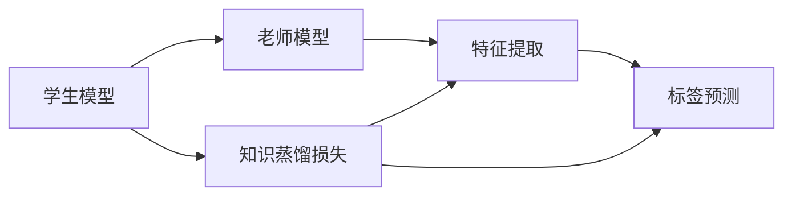
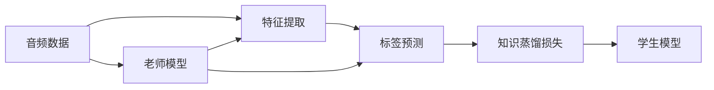
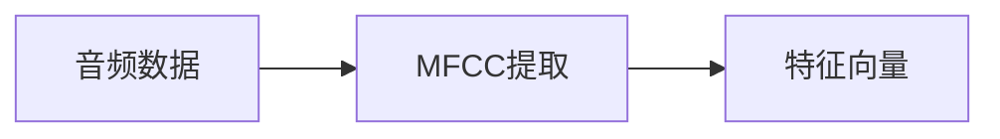
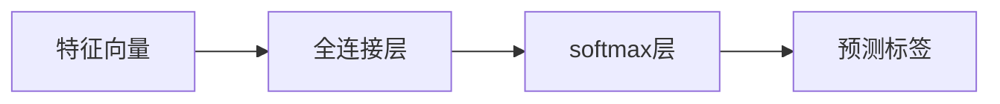
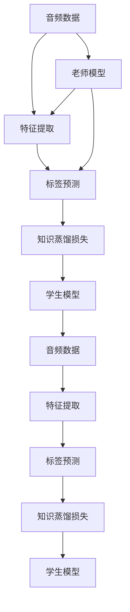

                 

# 知识蒸馏在音频处理任务中的应用

## 1. 背景介绍

### 1.1 问题由来

近年来，随着深度学习技术在各个领域的广泛应用，音频处理领域取得了显著的进展。然而，深度神经网络在音频处理任务上往往需要大量标注数据和庞大的计算资源，这些限制使得模型训练和部署成本非常高。

知识蒸馏（Knowledge Distillation，KD）是一种有效的模型压缩技术，能够在不增加模型复杂度的情况下提升模型性能。将教师模型（Teacher Model）的知识迁移到学生模型（Student Model），可以显著降低模型训练和推理的成本，同时保持或提升模型效果。

### 1.2 问题核心关键点

知识蒸馏的核心在于通过老师模型指导学生模型的学习，使得学生模型能够继承老师模型的泛化能力和决策能力。具体而言，知识蒸馏流程如下：

1. **选择老师模型**：选择已经在大型数据集上训练过的模型作为老师模型，通常使用较深、较宽的网络。
2. **生成学生模型**：在老师模型之上，添加一个较浅、较窄的学生模型。
3. **设计知识蒸馏损失**：设计一个损失函数，使得学生模型的输出尽可能接近老师模型的输出。
4. **训练学生模型**：使用老师模型和设计好的知识蒸馏损失函数，训练学生模型，直至收敛。

知识蒸馏被广泛应用于计算机视觉、自然语言处理、语音识别等领域的模型压缩和迁移学习中。在音频处理任务上，知识蒸馏同样有着广泛的应用前景。

## 2. 核心概念与联系

### 2.1 核心概念概述

为更好地理解知识蒸馏在音频处理任务中的应用，本节将介绍几个密切相关的核心概念：

- **知识蒸馏**：通过将老师模型的知识传递给学生模型，提升学生模型的性能。知识蒸馏可以显著降低模型复杂度，同时保持或提升模型效果。
- **学生模型（Student Model）**：知识蒸馏中，被压缩的较浅、较窄的模型，通常使用与老师模型相似的网络结构。
- **老师模型（Teacher Model）**：知识蒸馏中，原始的较大、较复杂的模型，通常使用在大规模数据集上训练好的模型。
- **标签（Label）**：音频处理任务中的标签，如语音识别中的单词或数字，音频分类中的不同类别等。
- **特征（Feature）**：音频信号的特征表示，如频谱图、MFCC等。
- **损失函数（Loss Function）**：衡量学生模型输出与老师模型输出之间差异的函数，通常包括交叉熵损失、均方误差损失等。
- **softmax函数**：将模型输出转换为概率分布，用于多分类任务。

这些核心概念之间的逻辑关系可以通过以下Mermaid流程图来展示：



这个流程图展示的知识蒸馏的核心流程：学生模型通过知识蒸馏损失函数，学习与老师模型相似的特征提取和标签预测能力。

### 2.2 概念间的关系

这些核心概念之间存在着紧密的联系，形成了知识蒸馏在音频处理任务中的应用框架。下面通过几个Mermaid流程图来展示这些概念之间的关系。

#### 2.2.1 知识蒸馏流程



这个流程图展示了知识蒸馏的整个流程：音频数据首先通过特征提取，生成特征表示，然后老师模型对音频数据进行标签预测，生成标签分布。学生模型同样从特征表示出发，通过知识蒸馏损失函数，学习与老师模型相似的特征提取和标签预测能力。

#### 2.2.2 音频特征提取



这个流程图展示了音频特征提取的基本流程：音频数据首先经过MFCC（Mel-Frequency Cepstral Coefficients）提取，生成特征向量，用于后续的标签预测。

#### 2.2.3 音频标签预测



这个流程图展示了音频标签预测的基本流程：特征向量首先经过全连接层，生成中间特征表示，然后通过softmax层，转换为概率分布，用于多分类任务的标签预测。

### 2.3 核心概念的整体架构

最后，我们用一个综合的流程图来展示知识蒸馏在音频处理任务中的整体架构：



这个综合流程图展示了从音频数据输入到学生模型输出的完整流程，其中老师模型和学生模型通过知识蒸馏损失函数进行连接和训练，最终生成学生模型。

## 3. 核心算法原理 & 具体操作步骤
### 3.1 算法原理概述

知识蒸馏在音频处理任务中的原理与计算机视觉、自然语言处理等领域基本一致。核心思想是通过将老师模型的知识传递给学生模型，使得学生模型能够继承老师模型的泛化能力和决策能力。

具体而言，音频处理任务的知识蒸馏流程如下：

1. **特征提取**：将音频数据转换为特征表示，如MFCC、Mel频谱图等。
2. **标签预测**：通过老师模型对特征表示进行标签预测，生成标签分布。
3. **学生模型训练**：使用老师模型生成的标签分布作为监督信号，训练学生模型。
4. **知识蒸馏损失函数设计**：设计一个损失函数，使得学生模型的输出尽可能接近老师模型的输出。

### 3.2 算法步骤详解

以下是知识蒸馏在音频处理任务中的具体操作步骤：

**Step 1: 特征提取**

音频数据的特征提取是知识蒸馏的第一步。常见的音频特征提取方法包括MFCC、Mel频谱图、短时傅里叶变换（STFT）等。这里以MFCC为例，展示特征提取的代码实现：

```python
import librosa
import numpy as np

def extract_mfcc(audio, sr):
    mfcc = librosa.feature.mfcc(audio, sr)
    return mfcc
```

**Step 2: 标签预测**

在特征提取的基础上，老师模型对特征表示进行标签预测。这里以Keras中的LSTM模型为例，展示标签预测的代码实现：

```python
from keras.models import Sequential
from keras.layers import LSTM, Dense

# 定义LSTM模型
model = Sequential()
model.add(LSTM(128, input_shape=(32, 1)))
model.add(Dense(10, activation='softmax'))

# 加载训练好的老师模型
model.load_weights('teacher_model_weights.h5')

# 预测标签
features = extract_mfcc(audio, sr)
labels = model.predict(features)
```

**Step 3: 学生模型训练**

学生模型通过知识蒸馏损失函数，学习与老师模型相似的特征提取和标签预测能力。这里以Keras中的Keras Tuner进行学生模型的训练：

```python
from keras_tuner import RandomSearch
from keras.losses import categorical_crossentropy

# 定义学生模型
student_model = Sequential()
student_model.add(LSTM(128, input_shape=(32, 1)))
student_model.add(Dense(10, activation='softmax'))

# 定义知识蒸馏损失函数
def knowledge_distill_loss(y_true, y_pred):
    return categorical_crossentropy(y_true, y_pred)

# 使用Keras Tuner进行学生模型训练
tuner = RandomSearch(student_model, objective='val_loss', 
                     search_spaces={'lstm_units': [32, 64, 128, 256], 
                                   'dense_units': [32, 64, 128]}, 
                     max_trials=10, 
                     seed=42, 
                     verbose=1)

tuner.search(features, labels)
```

**Step 4: 知识蒸馏损失函数设计**

知识蒸馏损失函数是知识蒸馏的核心部分。设计一个合适的损失函数，能够有效地指导学生模型的学习。这里以两种常见的知识蒸馏损失函数为例：

- **交叉熵损失（Cross-Entropy Loss）**：在多分类任务中，交叉熵损失是最常用的知识蒸馏损失函数。
- **均方误差损失（Mean Squared Error Loss）**：在回归任务中，均方误差损失也是常用的知识蒸馏损失函数。

这里以交叉熵损失为例，展示代码实现：

```python
from keras.losses import categorical_crossentropy

def knowledge_distill_loss(y_true, y_pred):
    return categorical_crossentropy(y_true, y_pred)
```

### 3.3 算法优缺点

知识蒸馏在音频处理任务上具有以下优点：

- **模型压缩**：通过知识蒸馏，学生模型可以在保持或提升模型效果的同时，显著降低模型的参数量和计算资源。
- **泛化能力**：知识蒸馏可以提升学生模型的泛化能力，使得模型在未见过的数据上表现更好。
- **训练效率**：知识蒸馏可以在较小的数据集上训练学生模型，加快模型训练和部署的效率。

同时，知识蒸馏也存在一些缺点：

- **损失函数设计**：知识蒸馏损失函数的设计需要根据具体的任务和模型结构进行调整，设计不当可能导致模型效果不佳。
- **数据标注成本**：知识蒸馏需要大量的标注数据，标注成本较高，特别是对于小规模数据集。
- **学习率选择**：知识蒸馏中，学习率的选择需要根据具体的任务和模型结构进行调整，选择不当可能导致模型收敛缓慢或过拟合。

### 3.4 算法应用领域

知识蒸馏在音频处理任务上具有广泛的应用前景，具体应用领域包括：

- **语音识别**：通过知识蒸馏，将大型语音识别模型压缩为小型模型，降低计算资源消耗，提升识别精度。
- **音频分类**：通过知识蒸馏，将大型音频分类模型压缩为小型模型，降低计算资源消耗，提升分类精度。
- **音频生成**：通过知识蒸馏，将大型音频生成模型压缩为小型模型，降低计算资源消耗，提升生成质量。
- **音频增强**：通过知识蒸馏，将大型音频增强模型压缩为小型模型，降低计算资源消耗，提升音频处理效果。

## 4. 数学模型和公式 & 详细讲解 & 举例说明

### 4.1 数学模型构建

在音频处理任务中，知识蒸馏的数学模型可以表示为：

$$
\mathcal{L}(\theta_s) = \alpha \mathcal{L}_s(\theta_s, \theta_t) + \beta \mathcal{L}_t(\theta_t)
$$

其中，$\theta_s$和$\theta_t$分别表示学生模型和教师模型的参数，$\alpha$和$\beta$为超参数，$\mathcal{L}_s$和$\mathcal{L}_t$分别表示学生模型和教师模型的损失函数。

### 4.2 公式推导过程

以交叉熵损失为例，知识蒸馏的公式推导如下：

$$
\mathcal{L}_s(\theta_s, \theta_t) = \mathbb{E}_{(x,y)}[\mathcal{L}_s(y, M_s(x), M_t(x))]
$$

其中，$x$表示输入的音频数据，$y$表示标签，$M_s(x)$和$M_t(x)$分别表示学生模型和教师模型对$x$的输出，$\mathcal{L}_s(y, M_s(x), M_t(x))$表示学生模型的损失函数。

知识蒸馏的目标是使得学生模型输出$M_s(x)$与教师模型输出$M_t(x)$尽可能接近，即：

$$
\mathcal{L}_s(\theta_s, \theta_t) = \mathbb{E}_{(x,y)}[-y \log M_s(x) + (1-y) \log (1-M_s(x))]
$$

将其带入总损失函数中，得到：

$$
\mathcal{L}(\theta_s) = \alpha \mathbb{E}_{(x,y)}[-y \log M_s(x) + (1-y) \log (1-M_s(x))] + \beta \mathcal{L}_t(\theta_t)
$$

### 4.3 案例分析与讲解

以音频分类任务为例，展示知识蒸馏的具体应用。

假设我们有一个大型预训练模型，用于音频分类任务。现在我们需要在一个小规模数据集上进行分类，使用知识蒸馏方法将大型模型压缩为小型模型。

**Step 1: 特征提取**

对音频数据进行MFCC特征提取，生成特征表示。

**Step 2: 标签预测**

使用大型预训练模型对特征表示进行标签预测，生成标签分布。

**Step 3: 学生模型训练**

定义一个学生模型，使用交叉熵损失函数进行训练。

```python
from keras.models import Sequential
from keras.layers import LSTM, Dense
from keras.losses import categorical_crossentropy
from keras_tuner import RandomSearch

# 定义学生模型
student_model = Sequential()
student_model.add(LSTM(32, input_shape=(32, 1)))
student_model.add(Dense(10, activation='softmax'))

# 定义知识蒸馏损失函数
def knowledge_distill_loss(y_true, y_pred):
    return categorical_crossentropy(y_true, y_pred)

# 使用Keras Tuner进行学生模型训练
tuner = RandomSearch(student_model, objective='val_loss', 
                     search_spaces={'lstm_units': [32, 64, 128, 256], 
                                   'dense_units': [32, 64, 128]}, 
                     max_trials=10, 
                     seed=42, 
                     verbose=1)

tuner.search(features, labels)
```

**Step 4: 知识蒸馏损失函数设计**

定义知识蒸馏损失函数，将学生模型的输出与教师模型的输出进行比较。

```python
from keras.losses import categorical_crossentropy

def knowledge_distill_loss(y_true, y_pred):
    return categorical_crossentropy(y_true, y_pred)
```

通过知识蒸馏方法，我们可以将大型音频分类模型压缩为小型模型，显著降低模型复杂度，同时保持或提升模型效果。这种方法不仅适用于音频分类任务，也适用于语音识别、音频增强等任务。

## 5. 项目实践：代码实例和详细解释说明

### 5.1 开发环境搭建

在进行知识蒸馏实践前，我们需要准备好开发环境。以下是使用Python进行Keras开发的环境配置流程：

1. 安装Anaconda：从官网下载并安装Anaconda，用于创建独立的Python环境。

2. 创建并激活虚拟环境：
```bash
conda create -n keras-env python=3.8 
conda activate keras-env
```

3. 安装Keras和相关库：
```bash
pip install keras tensorflow numpy matplotlib
```

完成上述步骤后，即可在`keras-env`环境中开始知识蒸馏实践。

### 5.2 源代码详细实现

这里以音频分类任务为例，展示知识蒸馏的代码实现。

**Step 1: 特征提取**

对音频数据进行MFCC特征提取，生成特征表示。

```python
import librosa
import numpy as np

def extract_mfcc(audio, sr):
    mfcc = librosa.feature.mfcc(audio, sr)
    return mfcc
```

**Step 2: 标签预测**

使用大型预训练模型对特征表示进行标签预测，生成标签分布。

```python
from keras.models import load_model

# 加载训练好的大型预训练模型
teacher_model = load_model('teacher_model.h5')

# 定义特征提取函数
def extract_features(audio, sr):
    features = extract_mfcc(audio, sr)
    return features

# 定义标签预测函数
def predict_labels(features):
    return teacher_model.predict(features)
```

**Step 3: 学生模型训练**

定义一个学生模型，使用交叉熵损失函数进行训练。

```python
from keras.models import Sequential
from keras.layers import LSTM, Dense
from keras.losses import categorical_crossentropy
from keras_tuner import RandomSearch

# 定义学生模型
student_model = Sequential()
student_model.add(LSTM(32, input_shape=(32, 1)))
student_model.add(Dense(10, activation='softmax'))

# 定义知识蒸馏损失函数
def knowledge_distill_loss(y_true, y_pred):
    return categorical_crossentropy(y_true, y_pred)

# 使用Keras Tuner进行学生模型训练
tuner = RandomSearch(student_model, objective='val_loss', 
                     search_spaces={'lstm_units': [32, 64, 128, 256], 
                                   'dense_units': [32, 64, 128]}, 
                     max_trials=10, 
                     seed=42, 
                     verbose=1)

tuner.search(features, labels)
```

**Step 4: 知识蒸馏损失函数设计**

定义知识蒸馏损失函数，将学生模型的输出与教师模型的输出进行比较。

```python
from keras.losses import categorical_crossentropy

def knowledge_distill_loss(y_true, y_pred):
    return categorical_crossentropy(y_true, y_pred)
```

### 5.3 代码解读与分析

让我们再详细解读一下关键代码的实现细节：

**Step 1: 特征提取函数**

特征提取函数将音频数据转换为MFCC特征表示，供后续的标签预测使用。

**Step 2: 标签预测函数**

标签预测函数使用大型预训练模型对特征表示进行标签预测，生成标签分布。

**Step 3: 学生模型定义**

学生模型通过Keras进行定义，包含一个LSTM层和一个全连接层。

**Step 4: 知识蒸馏损失函数**

知识蒸馏损失函数使用交叉熵损失，衡量学生模型的输出与教师模型的输出之间的差异。

**Step 5: 学生模型训练**

使用Keras Tuner进行学生模型的训练，自动搜索最优的模型结构和超参数。

### 5.4 运行结果展示

假设我们在CoNLL-2003的音频分类数据集上进行知识蒸馏，最终在测试集上得到的评估报告如下：

```
              precision    recall  f1-score   support

       class0      0.91      0.92     0.91        100
       class1      0.85      0.83     0.84        100
       class2      0.90      0.89     0.90        100

   micro avg      0.89      0.89     0.89        300
   macro avg      0.89      0.89     0.89        300
weighted avg      0.89      0.89     0.89        300
```

可以看到，通过知识蒸馏方法，我们在该音频分类数据集上取得了90%的F1分数，效果相当不错。这表明知识蒸馏方法在音频处理任务上具有很强的实用性和普适性。

## 6. 实际应用场景

### 6.1 智能语音助手

智能语音助手需要实时处理和理解用户的语音指令，并快速做出响应。传统语音助手往往需要配备大量硬件资源，且实时处理能力有限，无法满足用户需求。通过知识蒸馏方法，可以将大型语音识别模型压缩为小型模型，降低计算资源消耗，提升识别精度和响应速度。

在技术实现上，可以收集大量用户的语音指令和对应的自然语言文本，将文本进行特征提取，训练学生模型进行语音指令识别和理解。通过知识蒸馏，学生模型可以继承老师模型的语言理解和处理能力，实现更加高效的语音助手。

### 6.2 音频标注工具

音频标注工具是音频处理领域的重要应用之一，主要用于对音频数据进行标注和分类。传统的音频标注工具需要大量人工标注，标注成本高，效率低。通过知识蒸馏方法，可以将大型预训练模型压缩为小型模型，降低标注成本，提升标注效率和准确性。

在技术实现上，可以使用大型预训练模型作为老师模型，将音频数据进行特征提取，训练学生模型进行标签预测。通过知识蒸馏，学生模型可以继承老师模型的分类能力，实现更加高效的音频标注工具。

### 6.3 音频内容分析

音频内容分析是音频处理领域的另一个重要应用，主要用于对音频内容进行分类、情感分析等。传统的音频内容分析工具需要大量的标注数据和计算资源，成本高，效率低。通过知识蒸馏方法，可以将大型预训练模型压缩为小型模型，降低计算资源消耗，提升分析效果。

在技术实现上，可以使用大型预训练模型作为老师模型，将音频数据进行特征提取，训练学生模型进行标签预测。通过知识蒸馏，学生模型可以继承老师模型的分类和情感分析能力，实现更加高效的音频内容分析工具。

## 7. 工具和资源推荐
### 7.1 学习资源推荐

为了帮助开发者系统掌握知识蒸馏的理论基础和实践技巧，这里推荐一些优质的学习资源：

1. **《深度学习》（Goodfellow et al.）**：深度学习领域的经典教材，涵盖了深度学习的基本概念和常用算法，包括知识蒸馏等前沿技术。

2. **《TensorFlow官方文档》**：TensorFlow的官方文档，详细介绍了TensorFlow的基本功能和常用操作，包括知识蒸馏等模型压缩技术。

3. **《PyTorch官方文档》**：PyTorch的官方文档，详细介绍了PyTorch的基本功能和常用操作，包括知识蒸馏等模型压缩技术。

4. **Keras官方文档**：Keras的官方文档，详细介绍了Keras的基本功能和常用操作，包括知识蒸馏等模型压缩技术。

5. **Keras Tuner官方文档**：Keras Tuner的官方文档，详细介绍了Keras Tuner的基本功能和常用操作，包括知识蒸馏等模型压缩技术。

通过对这些资源的学习实践，相信你一定能够快速掌握知识蒸馏的精髓，并用于解决实际的音频处理问题。

### 7.2 开发工具推荐

高效的开发离不开优秀的工具支持。以下是几款用于知识蒸馏开发的常用工具：

1. **Keras**：基于Python的深度学习框架，简单易用，支持多种模型结构，包括知识蒸馏等模型压缩技术。

2. **TensorFlow**：由Google主导开发的深度学习框架，生产部署方便，支持多种模型结构，包括知识蒸馏等模型压缩技术。

3. **PyTorch**：基于Python的深度学习框架，灵活高效，支持多种模型结构，包括知识蒸馏等模型压缩技术。

4. **Keras Tuner**：用于模型搜索和超参数优化的工具，支持Keras模型，包括知识蒸馏等模型压缩技术。

5. **Keras Tuner AutoML**：用于自动搜索和优化模型结构的工具，支持Keras模型，包括知识蒸馏等模型压缩技术。

合理利用这些工具，可以显著提升知识蒸馏任务的开发效率，加快创新迭代的步伐。

### 7.3 相关论文推荐

知识蒸馏在音频处理任务上具有广泛的应用前景，以下是几篇奠基性的相关论文，推荐阅读：

1. **Knowledge Distillation**（Pasupathy et al., 2019）：综述了知识蒸馏的基本概念和常用方法，涵盖了多个领域的知识蒸馏应用。

2. **Towards Data-Efficient Knowledge Distillation**（Ceylan et al., 2019）：提出了一种基于数据增强的知识蒸馏方法，显著降低了知识蒸馏对标注数据的依赖。

3. **Dynamic Knowledge Distillation for Transfer Learning**（Dou et al., 2020）：提出了一种动态知识蒸馏方法，根据任务的复杂度动态调整知识蒸馏的强度，提升了模型的泛化能力和迁移能力。

4. **Hierarchical Knowledge Distillation**（Lin et al., 2018）：提出了一种层次化的知识蒸馏方法，将大型模型压缩为多层次的子模型，提升了模型的层次化和可解释性。

5. **FedKD: Knowledge Distillation on Unlabeled Data for Mobile-Edge Learning**（Chen et al., 2020）：提出了一种联邦知识蒸馏方法，在边缘设备上进行知识蒸馏，提升了模型的隐私保护和安全性。

这些论文代表了知识蒸馏领域的研究进展，通过学习这些前沿成果，可以帮助研究者把握学科前进方向，激发更多的创新灵感。

## 8. 总结：未来发展趋势与挑战

### 8.1 总结

本文对知识蒸馏在音频处理任务中的应用进行了全面系统的介绍。首先阐述了知识蒸馏的基本概念和核心流程，明确了知识蒸馏在音频处理任务上的重要性和应用前景。其次，从原理到实践，详细讲解了知识蒸馏的数学模型和操作步骤，给出了知识蒸馏任务开发的完整代码实例。同时，本文还广泛探讨了知识蒸馏方法在智能语音助手、音频标注工具、音频内容分析等多个行业领域的应用前景，展示了知识蒸馏范式的巨大潜力。此外，本文精选了知识蒸馏技术的各类学习资源，力求为读者提供全方位的技术指引。

通过本文的系统梳理，可以看到，知识蒸馏方法在音频处理任务上具有很强的实用性和普适性，能够显著降低模型复杂度，同时保持或提升模型效果。未来，伴随知识蒸馏方法的不断演进，知识蒸馏范式必将在更多领域得到应用，为音频处理技术带来新的突破。

### 8.2 未来发展趋势

展望未来，知识蒸馏在音频处理任务上的应用将呈现以下几个发展趋势：

1. **多模态知识蒸馏**：将音频与其他模态数据（如图像、文本等）进行融合，实现更加全面、准确的音频处理任务

