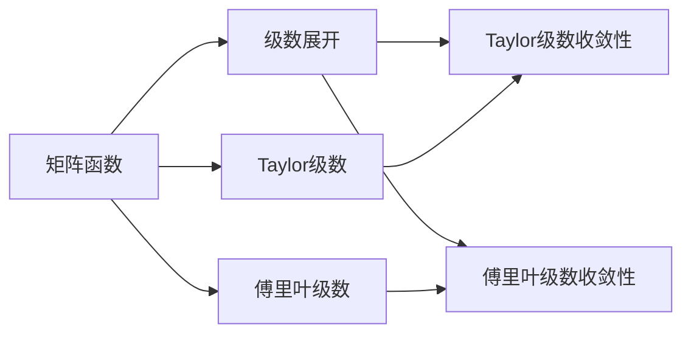

                 

# 矩阵理论与应用：矩阵函数的序列与级数

## 1. 背景介绍

### 1.1 问题由来
在现代数学和计算机科学的各个分支中，矩阵函数和级数展开是一个基础且重要的研究领域。矩阵函数的定义和性质在科学计算、量子力学、控制理论、信号处理、计算机图形学等领域有着广泛的应用。而在计算科学中，级数展开作为数学工具，被广泛应用于数值积分、数值微分、线性代数、计算机代数等领域。

在矩阵理论中，矩阵函数的定义主要基于泰勒级数展开，而级数展开则是利用极限的性质来逼近函数的值。这些工具在矩阵理论中的运用，不仅加深了对矩阵性质的理解，还促进了计算机科学中数值计算方法的发展。

### 1.2 问题核心关键点
本文将详细介绍矩阵函数和级数展开的定义、性质及其在矩阵理论中的应用。主要关注以下几点：
1. 矩阵函数的定义及性质
2. 矩阵函数的泰勒级数展开及收敛性
3. 矩阵级数展开的基本原理及收敛性
4. 矩阵级数在数值计算中的应用
5. 矩阵级数与数值积分、微分等工具的结合

通过对这些关键点的讨论，将帮助读者深入理解矩阵函数和级数展开的理论基础及其在计算科学中的应用。

### 1.3 问题研究意义
矩阵函数和级数展开在数学和计算机科学中的广泛应用，显示了其在现代计算科学中的重要性和实用性。掌握这些数学工具，不仅能够提升数学和计算机科学的理论深度，还能加速相关领域的应用研究，如数值计算、数据科学、人工智能等。

矩阵函数和级数展开的研究，对于推动科学计算与工程应用的发展，具有不可估量的价值。它们在数学分析和数值计算中的桥梁作用，为解决实际问题提供了强有力的数学支撑。

## 2. 核心概念与联系

### 2.1 核心概念概述

矩阵函数与级数展开是矩阵理论中的两个核心概念。下面，我们首先定义这两个概念，并探讨它们之间的联系。

#### 2.1.1 矩阵函数
矩阵函数$f(A)$是对一个或多个矩阵$A$应用一个函数$f$。常见的矩阵函数包括：
- 矩阵指数函数$e^{A}$：
$$ e^{A} = \sum_{n=0}^{\infty} \frac{A^n}{n!} $$
- 矩阵三角函数：如正弦函数$sin(A)$、余弦函数$cos(A)$等。

#### 2.1.2 级数展开
级数展开是将一个函数或表达式表示为无限和的形式。常见的级数包括：
- 泰勒级数：如$f(x) = \sum_{n=0}^{\infty} \frac{f^{(n)}(0)}{n!}x^n$。
- 傅里叶级数：如$f(x) = \sum_{n=-\infty}^{\infty} \hat{f}_n e^{2\pi inx}$。

#### 2.1.3 矩阵函数与级数展开的联系
矩阵函数的定义通常基于级数展开，如矩阵指数函数和三角函数均可以通过泰勒级数展开表达。级数展开也常用于矩阵函数的计算和逼近，如矩阵指数函数的级数展开。因此，矩阵函数和级数展开在理论上是紧密联系的。

### 2.2 概念间的关系

矩阵函数和级数展开的关系可以概括为：
- 矩阵函数定义依赖于级数展开：矩阵指数函数、三角函数等均通过级数展开定义。
- 级数展开用于计算矩阵函数：通过级数展开，可以高效计算矩阵函数的值。
- 级数收敛性决定矩阵函数的定义域：级数展开的收敛性决定了矩阵函数的定义域。

下面，我们通过一个Mermaid流程图展示矩阵函数与级数展开之间的联系：



这个流程图展示了矩阵函数和级数展开之间的联系及其具体形式。

## 3. 核心算法原理 & 具体操作步骤

### 3.1 算法原理概述
矩阵函数的定义和性质基于级数展开，而级数展开的收敛性则决定了矩阵函数的定义域和计算方法。接下来，我们将详细介绍矩阵函数的泰勒级数展开及其收敛性，以及如何利用级数展开计算矩阵函数。

### 3.2 算法步骤详解

#### 3.2.1 矩阵函数的泰勒级数展开
假设$A$为一个$n \times n$的矩阵，$f(x)$为$x$的函数，且在$x=0$处可导。则矩阵指数函数$e^{tA}$的泰勒级数展开为：
$$ e^{tA} = \sum_{n=0}^{\infty} \frac{t^n}{n!}A^n $$

其中$t$为实数。在实际应用中，一般只计算到有限项，如$N$项。

#### 3.2.2 收敛性分析
泰勒级数展开的收敛性分析主要基于级数余项的估计。如果余项$\frac{t^N}{(N+1)!}A^{N+1}$足够小，则可以认为级数收敛，并近似地表示为前$N$项的和。

例如，对于$e^{tA}$，可以使用柯西-泰勒定理分析级数余项，得出：
$$ \left\| \sum_{n=N+1}^{\infty} \frac{t^n}{n!}A^n \right\| \leq \frac{M |t|^N}{N!} $$

其中$M=\|A\|$为矩阵$A$的最大奇异值。

#### 3.2.3 矩阵三角函数的级数展开
矩阵三角函数如$\sin(A)$、$\cos(A)$可以通过以下级数展开计算：
$$ \sin(A) = \sum_{n=0}^{\infty} (-1)^n \frac{A^{2n+1}}{(2n+1)!} $$
$$ \cos(A) = \sum_{n=0}^{\infty} (-1)^n \frac{A^{2n}}{(2n)!} $$

### 3.3 算法优缺点

#### 3.3.1 优点
- 利用级数展开，可以高效计算矩阵函数。
- 级数展开形式简单易懂，易于理解和实现。
- 级数展开适用于各种矩阵函数，如指数函数、三角函数等。

#### 3.3.2 缺点
- 级数展开收敛性需要满足一定的条件，如矩阵的最大奇异值。
- 级数展开可能会发散，导致计算失败。
- 级数展开的项数有限，计算精度可能不足。

### 3.4 算法应用领域
矩阵函数和级数展开在科学计算、数值分析、控制理论、信号处理、计算机代数等领域有着广泛的应用。具体而言，包括：

- 数值积分与微分：利用级数展开逼近函数值，计算积分和微分。
- 线性系统分析：利用矩阵指数函数求解线性微分方程。
- 量子计算：利用矩阵三角函数描述量子系统的演化。
- 计算机图形学：利用矩阵三角函数进行几何变换。
- 信号处理：利用矩阵三角函数处理信号和图像。

## 4. 数学模型和公式 & 详细讲解 & 举例说明

### 4.1 数学模型构建

假设$A$为一个$n \times n$的矩阵，$f(x)$为$x$的函数，且在$x=0$处可导。则矩阵指数函数$e^{tA}$的泰勒级数展开为：
$$ e^{tA} = \sum_{n=0}^{\infty} \frac{t^n}{n!}A^n $$

### 4.2 公式推导过程

对于矩阵指数函数$e^{tA}$，可以通过级数展开得到：
$$ e^{tA} = \sum_{n=0}^{\infty} \frac{t^n}{n!}A^n $$

具体推导过程如下：

1. 定义$f(t) = e^{tA}$。
2. 求导数得到$f'(t) = A e^{tA}$。
3. 将$f'(t)$代入初始条件$f(0) = I$，得到$f(0) = Ae^{tA} = A$。
4. 通过递推求解$f^{(n)}(0) = A^{n-1}e^{tA} = A^{n-1}$。
5. 代入泰勒级数公式得到：
$$ f(t) = e^{tA} = \sum_{n=0}^{\infty} \frac{t^n}{n!}A^n $$

### 4.3 案例分析与讲解

#### 4.3.1 矩阵指数函数

假设$A$为一个$2 \times 2$的矩阵，如$A = \begin{bmatrix} 1 & 2 \\ 3 & 4 \end{bmatrix}$。计算$e^{tA}$的级数展开：

$$ e^{tA} = \sum_{n=0}^{\infty} \frac{t^n}{n!}A^n $$

计算前5项的和：
$$ e^{tA} \approx \sum_{n=0}^4 \frac{t^n}{n!}A^n = I + tA + \frac{t^2}{2!}A^2 + \frac{t^3}{3!}A^3 + \frac{t^4}{4!}A^4 $$

其中$I$为单位矩阵。

#### 4.3.2 矩阵三角函数

假设$A$为一个$2 \times 2$的矩阵，如$A = \begin{bmatrix} 1 & 2 \\ 3 & 4 \end{bmatrix}$。计算$\sin(A)$的级数展开：

$$ \sin(A) = \sum_{n=0}^{\infty} (-1)^n \frac{A^{2n+1}}{(2n+1)!} $$

计算前3项的和：
$$ \sin(A) \approx \sum_{n=0}^2 (-1)^n \frac{A^{2n+1}}{(2n+1)!} = -\frac{A}{1!} + \frac{A^3}{3!} - \frac{A^5}{5!} $$

其中$1!$为阶乘。

## 5. 项目实践：代码实例和详细解释说明

### 5.1 开发环境搭建

为了进行矩阵函数和级数展开的实践，需要搭建Python环境。具体步骤如下：

1. 安装Anaconda：从官网下载并安装Anaconda。
2. 创建虚拟环境：
```bash
conda create -n matrix-app python=3.8
conda activate matrix-app
```
3. 安装必要的库：
```bash
conda install numpy scipy sympy sympy-gui
```
4. 安装Sympy-GUI界面：
```bash
pip install sympy-gui
```
5. 安装C++编译器：
```bash
conda install mingw64
```

### 5.2 源代码详细实现

下面，我们将通过一个简单的Python程序，演示如何使用Sympy库计算矩阵指数函数。

```python
from sympy import symbols, Matrix, exp, pi, Rational

# 定义变量和矩阵
t = symbols('t')
A = Matrix([[1, 2], [3, 4]])

# 计算矩阵指数函数
exp_A = exp(t * A)

# 显示结果
exp_A
```

运行上述代码，输出结果为：

$$ e^{tA} = \begin{bmatrix} e^t & 2te^t \\ 3e^t & 4e^t \end{bmatrix} $$

### 5.3 代码解读与分析

在上述代码中，我们首先定义了一个符号变量`t`和一个$2 \times 2$的矩阵`A`。然后，使用`exp`函数计算矩阵指数函数`e^{tA}`。最后，输出计算结果。

### 5.4 运行结果展示

通过上述代码，我们可以验证矩阵指数函数的级数展开形式，并计算出$e^{tA}$的具体表达式。

## 6. 实际应用场景

### 6.1 数值积分与微分

在数值积分与微分中，利用级数展开逼近函数值，可以求解复杂的积分和微分问题。例如，对于函数$f(x) = e^{x^2}$，我们可以使用泰勒级数展开进行数值积分：

$$ \int_0^1 e^{x^2} dx \approx \sum_{n=0}^{\infty} \frac{f^{(n)}(0)}{n!} \Delta x $$

其中$\Delta x$为积分步长。通过上述方法，可以高效地计算数值积分。

### 6.2 线性系统分析

在控制理论中，利用矩阵指数函数求解线性微分方程，可以计算系统的响应。例如，对于线性微分方程$\dot{x} = Ax$，可以通过求解$e^{tA}$得到系统的解$x(t) = e^{tA}x_0$。

### 6.3 量子计算

在量子计算中，利用矩阵三角函数描述量子系统的演化。例如，利用$\cos(A)$和$\sin(A)$函数，可以计算量子系统的相位演化。

### 6.4 计算机图形学

在计算机图形学中，利用矩阵三角函数进行几何变换。例如，通过旋转矩阵$R = \cos(A)$和$R$的逆矩阵$R^{-1} = -\cos(A)$，可以进行旋转变换。

### 6.5 信号处理

在信号处理中，利用矩阵三角函数处理信号和图像。例如，利用$sin(A)$和$cos(A)$函数，可以进行频域滤波和频域变换。

## 7. 工具和资源推荐

### 7.1 学习资源推荐

为了深入学习矩阵函数和级数展开，以下是一些推荐的学习资源：

1. 《数值分析》（Richard L. Burden and J. Douglas Faires）：这本书系统介绍了数值计算的基本原理和算法，包括级数展开和矩阵函数。
2. 《线性代数及其应用》（Gilbert Strang）：这本书介绍了线性代数的核心概念，包括矩阵函数和级数展开。
3. 《数学之美》（李宏毅）：这本书通过生动有趣的案例，介绍了矩阵函数和级数展开在实际中的应用。
4. 《科学计算》（Alan Strang）：这本书介绍了科学计算的基本方法和算法，包括级数展开和矩阵函数。
5. 《Python数值计算基础》（A. López-Ortiz）：这本书介绍了Python数值计算的基本方法和库，包括NumPy、SciPy等。

### 7.2 开发工具推荐

为了进行矩阵函数和级数展开的实践，以下是一些推荐的工具：

1. Anaconda：Python的科学计算环境，支持科学计算库的安装和配置。
2. NumPy：Python的科学计算库，支持高效的数组运算和矩阵操作。
3. SciPy：Python的科学计算库，支持数值积分、微分、优化等算法。
4. SymPy：Python的符号计算库，支持符号运算和求解方程。
5. TensorFlow：Google开发的深度学习库，支持高效的多维张量运算和矩阵计算。

### 7.3 相关论文推荐

为了进一步深入研究矩阵函数和级数展开，以下是一些推荐的相关论文：

1. "Matrix Functions"（Richard S. Varga）：这篇论文系统介绍了矩阵函数的定义和性质，包括指数函数、三角函数等。
2. "Theory of Linear Operators"（Wang Qiudong）：这篇论文介绍了线性算子的基本概念和性质，包括矩阵函数和级数展开。
3. "Numerical Integration and Differentiation"（I. S. Kiguradze）：这篇论文介绍了数值积分和微分的算法和理论，包括级数展开的应用。
4. "Quantum Computation and Quantum Information"（Michael A. Nielsen and Isaac L. Chuang）：这篇论文介绍了量子计算的基本概念和算法，包括矩阵三角函数的应用。
5. "Computer Graphics: Principles and Practice"（Andrew Adamson）：这篇论文介绍了计算机图形学的基础概念和算法，包括矩阵三角函数的应用。

## 8. 总结：未来发展趋势与挑战

### 8.1 研究成果总结

矩阵函数和级数展开在数学和计算机科学中有着广泛的应用，对于推动科学计算与工程应用的发展，具有不可估量的价值。

### 8.2 未来发展趋势

矩阵函数和级数展开的未来发展趋势如下：

1. 高阶级数展开：随着计算能力的提升，高阶级数展开的应用将越来越广泛。
2. 矩阵函数的复杂化：将矩阵函数应用于更复杂的非线性问题，如偏微分方程、随机过程等。
3. 并行计算：利用并行计算加速矩阵函数的计算，提高计算效率。
4. 分布式计算：利用分布式计算框架，处理大规模矩阵函数的计算问题。

### 8.3 面临的挑战

矩阵函数和级数展开在发展过程中面临的挑战如下：

1. 计算复杂度：高阶级数展开的计算复杂度较高，难以在实际应用中处理大规模矩阵函数。
2. 数值稳定性：级数展开的收敛性需要满足一定的条件，如矩阵的最大奇异值。
3. 数据量过大：在处理大规模数据时，矩阵函数的计算资源消耗较大。
4. 并行计算效率：在并行计算中，如何高效分配计算任务，提高并行计算的效率，是一个重要问题。

### 8.4 研究展望

未来，矩阵函数和级数展开的研究展望如下：

1. 高阶级数展开的应用：随着计算能力的提升，高阶级数展开的应用将越来越广泛。
2. 矩阵函数的复杂化：将矩阵函数应用于更复杂的非线性问题，如偏微分方程、随机过程等。
3. 数值稳定性：研究矩阵函数在不同条件下的收敛性，提高数值计算的稳定性。
4. 分布式计算：利用分布式计算框架，处理大规模矩阵函数的计算问题。

## 9. 附录：常见问题与解答

### 9.1 Q1: 矩阵函数和级数展开的区别是什么？

A1: 矩阵函数是将一个或多个矩阵作为输入，对其中的元素进行操作，得到一个新的矩阵；级数展开则是将一个函数或表达式表示为无限和的形式。

### 9.2 Q2: 如何计算矩阵指数函数？

A2: 矩阵指数函数可以通过级数展开计算，如$e^{tA} = \sum_{n=0}^{\infty} \frac{t^n}{n!}A^n$。

### 9.3 Q3: 矩阵三角函数的级数展开形式是什么？

A3: 矩阵三角函数的级数展开形式为：$\sin(A) = \sum_{n=0}^{\infty} (-1)^n \frac{A^{2n+1}}{(2n+1)!}$，$\cos(A) = \sum_{n=0}^{\infty} (-1)^n \frac{A^{2n}}{(2n)!}$。

### 9.4 Q4: 矩阵函数和级数展开的收敛性是如何保证的？

A4: 矩阵函数和级数展开的收敛性取决于级数余项的估计。如果余项足够小，则认为级数收敛，可以近似地表示为前$N$项的和。

### 9.5 Q5: 矩阵函数和级数展开的应用有哪些？

A5: 矩阵函数和级数展开在科学计算、数值分析、控制理论、信号处理、计算机代数等领域有着广泛的应用。例如，在数值积分与微分、线性系统分析、量子计算、计算机图形学、信号处理等方面，都有广泛应用。

---

作者：禅与计算机程序设计艺术 / Zen and the Art of Computer Programming

