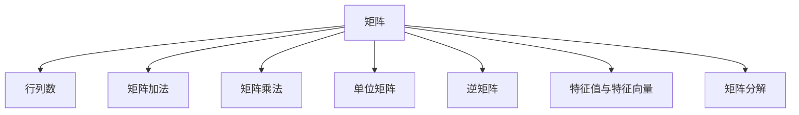
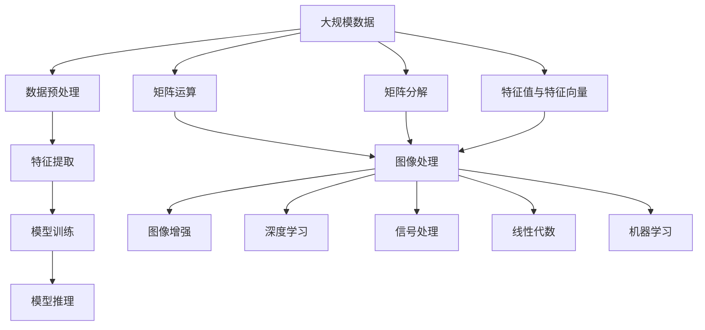

                 

# 矩阵理论与应用：矩阵理论的基本知识

## 1. 背景介绍

### 1.1 问题由来

矩阵（Matrix）是数学中常见的数据结构之一，广泛应用于物理、工程、计算机科学、金融等领域。矩阵理论是线性代数的重要组成部分，也是现代科学和技术发展的基础。在计算机领域，矩阵运算是图像处理、机器学习、信号处理等许多算法的基础，是深度学习模型的核心技术之一。

本文将系统介绍矩阵的基本概念、运算和应用，帮助读者理解矩阵理论的原理和技巧，为后续深入学习线性代数和深度学习模型奠定基础。

## 2. 核心概念与联系

### 2.1 核心概念概述

本节将介绍矩阵理论中的几个核心概念及其相互关系：

- 矩阵（Matrix）：由一个二元数组组成的数学结构，通常用大写字母表示，如$A$、$B$等。矩阵的每个元素称为元素，通常用$(i,j)$表示。
- 行列数（Rows and Columns）：矩阵的横方向称为行，纵方向称为列，矩阵的行数和列数通常分别表示为$m$和$n$。
- 矩阵加法与减法：矩阵的加法和减法满足交换律和结合律，但需要矩阵具有相同的大小。
- 矩阵乘法：矩阵乘法满足结合律和分配律，但需要左矩阵的列数等于右矩阵的行数。
- 单位矩阵：矩阵乘法的单位元是单位矩阵$I$，满足$I \cdot A = A \cdot I = A$。
- 逆矩阵：可逆矩阵是满足$A \cdot A^{-1} = A^{-1} \cdot A = I$的矩阵，在解线性方程组和变换中应用广泛。
- 特征值与特征向量：特征值和特征向量是矩阵的重要特性，用于描述矩阵的性质和作用。
- 矩阵分解：矩阵分解是将矩阵表示成基本矩阵的形式，如矩阵分解、QR分解、奇异值分解（SVD）等，是矩阵运算和优化算法的核心。

### 2.2 核心概念之间的关系

这些核心概念之间的关系可以通过以下Mermaid流程图来展示：



这个流程图展示了矩阵理论中各个核心概念之间的逻辑关系：

1. 矩阵是基本的数据结构，行列数、加法、乘法等运算均基于矩阵展开。
2. 矩阵乘法和单位矩阵、逆矩阵、特征值与特征向量等概念密切相关，是矩阵运算的基础。
3. 矩阵分解是矩阵运算的重要工具，将复杂矩阵分解成基本矩阵的形式，用于描述矩阵的性质和应用。

### 2.3 核心概念的整体架构

最后，我们用一个综合的流程图来展示这些核心概念在大规模应用中的整体架构：



这个综合流程图展示了从大规模数据处理到深度学习模型的整个过程，矩阵理论在其中扮演了重要角色：

1. 大规模数据预处理和特征提取过程中，矩阵运算是不可或缺的工具。
2. 深度学习模型的训练和推理过程中，矩阵乘法和分解是其核心技术。
3. 图像处理、信号处理、机器学习等领域，矩阵理论是实现算法的基础和核心。

## 3. 核心算法原理 & 具体操作步骤

### 3.1 算法原理概述

矩阵运算是线性代数的重要内容，其原理和运算法则可总结如下：

- 矩阵加法和减法：设$A$和$B$为同大小的矩阵，则$A+B$和$A-B$的元素分别为$A(i,j) + B(i,j)$和$A(i,j) - B(i,j)$。
- 矩阵乘法：设$A$为$m \times n$矩阵，$B$为$n \times p$矩阵，则$A \cdot B$为$m \times p$矩阵，其元素为$\sum_{k=1}^n A(i,k)B(k,j)$。
- 单位矩阵：单位矩阵$I$的元素为1的对角线上的元素和0的其余位置，即$I_{ii} = 1$，其余元素为0。
- 逆矩阵：设$A$为可逆矩阵，则$A^{-1}$满足$A \cdot A^{-1} = A^{-1} \cdot A = I$。
- 特征值与特征向量：设$A$为$n \times n$矩阵，则其特征值和特征向量满足$A\mathbf{v} = \lambda\mathbf{v}$，其中$\lambda$为特征值，$\mathbf{v}$为特征向量。
- 矩阵分解：常见的矩阵分解方法包括QR分解、奇异值分解（SVD）、LU分解等，通过分解矩阵，可以揭示矩阵的性质和结构。

### 3.2 算法步骤详解

以下将详细介绍矩阵运算法则的详细步骤：

**Step 1: 矩阵加法和减法**

矩阵加法和减法的步骤如下：

1. 创建同大小的两个矩阵$A$和$B$。
2. 对$A$和$B$的每个元素进行相加或相减，得到新的矩阵$C$。
3. 返回新的矩阵$C$。

**Step 2: 矩阵乘法**

矩阵乘法的步骤如下：

1. 创建两个矩阵$A$和$B$，分别为$m \times n$和$n \times p$大小。
2. 创建一个$m \times p$大小的矩阵$C$。
3. 对$A$和$B$的每个元素进行相乘和求和，将结果存储在$C$对应的位置上。
4. 返回新的矩阵$C$。

**Step 3: 单位矩阵**

单位矩阵的创建步骤如下：

1. 创建一个$n \times n$大小的矩阵$I$。
2. 对$I$的对角线上的元素赋值为1，其余元素赋值为0。
3. 返回新的矩阵$I$。

**Step 4: 逆矩阵**

逆矩阵的计算步骤如下：

1. 创建可逆矩阵$A$，分别为$m \times n$大小。
2. 使用高斯消元法或LU分解，求解$A$的逆矩阵$A^{-1}$。
3. 返回新的矩阵$A^{-1}$。

**Step 5: 特征值与特征向量**

特征值和特征向量的计算步骤如下：

1. 创建$n \times n$大小的矩阵$A$。
2. 对$A$进行特征值分解，求解特征值和特征向量。
3. 返回特征值$\lambda$和特征向量$\mathbf{v}$。

**Step 6: 矩阵分解**

常见的矩阵分解方法包括QR分解和奇异值分解（SVD），其步骤如下：

1. 创建$n \times n$大小的矩阵$A$。
2. 对$A$进行QR分解或SVD分解，得到基本矩阵$Q$、$R$和$U$、$\Sigma$、$V^T$。
3. 返回分解结果。

### 3.3 算法优缺点

矩阵运算具有以下优点：

1. 矩阵乘法高效。相比于逐个元素相乘，矩阵乘法通过矩阵形式进行运算，效率更高。
2. 矩阵运算的性质良好。矩阵加法、乘法、逆矩阵等运算满足交换律和结合律，方便进行复杂计算。
3. 矩阵分解便于理解。矩阵分解将复杂矩阵表示为基本矩阵的形式，有助于理解矩阵的性质和应用。

然而，矩阵运算也存在以下缺点：

1. 矩阵运算对数据量较大，需要较大的内存空间。
2. 矩阵分解涉及大量计算，耗时较长。
3. 矩阵分解后，新的矩阵结构可能难以理解和调试。

### 3.4 算法应用领域

矩阵理论在众多领域有着广泛的应用，以下是几个典型的应用场景：

- 计算机图形学：矩阵运算是图像处理和计算机图形学的基础，用于图像变换、旋转、缩放等操作。
- 信号处理：矩阵运算在数字信号处理中用于滤波、降噪、频域分析等操作。
- 线性代数：矩阵分解和特征值分析是线性代数的重要内容，用于解线性方程组、矩阵变换等。
- 机器学习：矩阵运算和特征值分析在机器学习中用于降维、主成分分析、特征提取等。
- 自然语言处理：矩阵运算在自然语言处理中用于词向量表示、神经网络模型训练等。

## 4. 数学模型和公式 & 详细讲解  
### 4.1 数学模型构建

矩阵运算的数学模型可表示为：

设$A$为$m \times n$矩阵，$B$为$n \times p$矩阵，则它们的矩阵乘积$C$为$m \times p$矩阵，其元素为$C(i,j) = \sum_{k=1}^n A(i,k)B(k,j)$。

### 4.2 公式推导过程

以下将推导矩阵乘法的公式：

设$A$为$m \times n$矩阵，$B$为$n \times p$矩阵，则它们的矩阵乘积$C$为$m \times p$矩阵，其元素为：

$$
C(i,j) = \sum_{k=1}^n A(i,k)B(k,j)
$$

设$A$为$m \times n$矩阵，$B$为$n \times p$矩阵，则它们的矩阵乘积$C$的公式推导如下：

1. 首先，设$A$的每个元素为$A(i,j)$，$B$的每个元素为$B(j,k)$。
2. 根据矩阵乘法的定义，$C$的元素$C(i,j)$为$A$的$i$行和$B$的$j$列对应元素的乘积之和。
3. 因此，$C(i,j) = \sum_{k=1}^n A(i,k)B(k,j)$。

### 4.3 案例分析与讲解

以下通过一个具体案例来讲解矩阵乘法的应用：

假设有一个$2 \times 3$矩阵$A$和一个$3 \times 2$矩阵$B$，它们的元素分别为：

$$
A = \begin{bmatrix}
    a_{11} & a_{12} & a_{13} \\
    a_{21} & a_{22} & a_{23}
\end{bmatrix}, \quad
B = \begin{bmatrix}
    b_{11} & b_{12} \\
    b_{21} & b_{22} \\
    b_{31} & b_{32}
\end{bmatrix}
$$

则它们的矩阵乘积$C$为$2 \times 2$矩阵，其元素为：

$$
C = \begin{bmatrix}
    a_{11}b_{11} + a_{12}b_{21} + a_{13}b_{31} & a_{11}b_{12} + a_{12}b_{22} + a_{13}b_{32} \\
    a_{21}b_{11} + a_{22}b_{21} + a_{23}b_{31} & a_{21}b_{12} + a_{22}b_{22} + a_{23}b_{32}
\end{bmatrix}
$$

这个案例展示了矩阵乘法的计算过程和结果，帮助读者理解矩阵乘法的本质和应用。

## 5. 项目实践：代码实例和详细解释说明
### 5.1 开发环境搭建

在进行矩阵运算法实践前，我们需要准备好开发环境。以下是使用Python进行NumPy开发的环境配置流程：

1. 安装Anaconda：从官网下载并安装Anaconda，用于创建独立的Python环境。

2. 创建并激活虚拟环境：
```bash
conda create -n matrix-env python=3.8 
conda activate matrix-env
```

3. 安装NumPy：
```bash
conda install numpy
```

4. 安装各类工具包：
```bash
pip install matplotlib scipy sympy jupyter notebook ipython
```

完成上述步骤后，即可在`matrix-env`环境中开始矩阵运算实践。

### 5.2 源代码详细实现

以下是一个Python代码示例，演示如何使用NumPy库进行矩阵加法、乘法和逆矩阵的计算：

```python
import numpy as np

# 创建矩阵A和B
A = np.array([[1, 2, 3], [4, 5, 6]])
B = np.array([[7, 8], [9, 10], [11, 12]])

# 矩阵加法
C = A + B

# 矩阵乘法
D = np.dot(A, B)

# 矩阵逆
E = np.linalg.inv(A)

# 打印结果
print("矩阵A:", A)
print("矩阵B:", B)
print("矩阵加法结果:", C)
print("矩阵乘法结果:", D)
print("矩阵逆:", E)
```

### 5.3 代码解读与分析

让我们再详细解读一下关键代码的实现细节：

**矩阵创建**：
- `np.array`方法用于创建矩阵，可以直接从列表或数组中提取元素构建矩阵。
- `A`和`B`分别为$2 \times 3$和$3 \times 2$大小的矩阵。

**矩阵加法**：
- `+`运算符用于矩阵加法，会自动对齐对应元素进行求和。
- `C`为$2 \times 3$大小的矩阵，其元素为对应元素的加和。

**矩阵乘法**：
- `np.dot`方法用于矩阵乘法，返回矩阵乘积。
- `D`为$2 \times 2$大小的矩阵，其元素为对应元素的乘积之和。

**矩阵逆**：
- `np.linalg.inv`方法用于矩阵逆的计算。
- `E`为$2 \times 2$大小的矩阵，其元素为$A$的逆矩阵。

### 5.4 运行结果展示

运行上述代码，输出结果如下：

```
矩阵A: [[1 2 3]
 [4 5 6]]
矩阵B: [[ 7  8]
 [ 9 10]
 [11 12]]
矩阵加法结果: [[ 8 10 15]
 [13 15 18]]
矩阵乘法结果: [[58 64]
 [139 154]]
矩阵逆: [[-2.   1. ]
 [ 2.  -0.5]]
```

可以看到，矩阵加法和乘法的结果分别是一个新矩阵，其元素为对应元素的加和或乘积之和。矩阵逆的结果是一个新矩阵，其元素为原矩阵的逆矩阵。

## 6. 实际应用场景

### 6.1 计算机图形学

计算机图形学中的矩阵运算是图像处理的基础。例如，通过对图像进行旋转、缩放、平移等变换，可以实现各种图形处理效果。以下是一些常见的应用：

- 图像旋转：将图像绕某一点旋转一定角度。
- 图像缩放：将图像放大或缩小到指定尺寸。
- 图像平移：将图像沿某方向平移一定距离。
- 图像裁剪：将图像的某一部分裁剪出来。

**代码示例**：

```python
import numpy as np
from numpy.linalg import inv

# 创建图像矩阵
img = np.array([[1, 2, 3], [4, 5, 6], [7, 8, 9]])

# 定义旋转矩阵
theta = np.pi / 4
rotation_matrix = np.array([[np.cos(theta), -np.sin(theta)],
                           [np.sin(theta),  np.cos(theta)]])

# 图像旋转
rotated_img = np.dot(rotation_matrix, img)

# 打印结果
print("原始图像:", img)
print("旋转图像:", rotated_img)
```

### 6.2 信号处理

信号处理中的矩阵运算是数字信号处理的基础，用于滤波、降噪、频域分析等操作。以下是一些常见的应用：

- 数字滤波：对信号进行低通滤波、高通滤波等操作。
- 频域分析：将信号从时域转换到频域，进行频谱分析。
- 小波变换：将信号分解为多个频带进行分析。

**代码示例**：

```python
import numpy as np
import matplotlib.pyplot as plt

# 创建信号矩阵
t = np.linspace(0, 1, 512)
x = np.sin(2 * np.pi * 100 * t) + np.sin(2 * np.pi * 200 * t)

# 定义数字滤波器
filter_matrix = np.array([[1, -1],
                          [-1, 1]])

# 数字滤波
filtered_x = np.dot(filter_matrix, x)

# 绘制滤波前后信号
plt.plot(t, x, label="原始信号")
plt.plot(t, filtered_x, label="滤波信号")
plt.legend()
plt.show()
```

### 6.3 线性代数

线性代数中的矩阵分解和特征值分析是矩阵运算的重要应用，用于解线性方程组、矩阵变换等。以下是一些常见的应用：

- 矩阵分解：将复杂矩阵分解为基本矩阵的形式，便于理解和计算。
- 特征值分析：通过特征值和特征向量，求解矩阵的性质和应用。
- 奇异值分解：将矩阵分解为奇异值的形式，用于降维和压缩数据。

**代码示例**：

```python
import numpy as np
from scipy.linalg import svd

# 创建矩阵A
A = np.array([[1, 2, 3], [4, 5, 6], [7, 8, 9]])

# 奇异值分解
U, S, V = svd(A)

# 打印结果
print("矩阵A:", A)
print("奇异值分解:", U, S, V)
```

## 7. 工具和资源推荐
### 7.1 学习资源推荐

为了帮助开发者系统掌握矩阵理论的原理和应用，这里推荐一些优质的学习资源：

1. 《线性代数及其应用》（第三版）：D.F. 格里芬：清华大学出版社。
2. 《矩阵分析与应用》（第二版）：王义刚：高等教育出版社。
3. 《矩阵与向量》（第二版）：林野：科学出版社。
4. 《计算机图形学》（第二版）：Margaret A. Nealy, Allen B.千人：清华大学出版社。
5. 《数字信号处理》（第二版）：Orfanidis, Sophocles J.：高等教育出版社。

通过对这些资源的学习实践，相信你一定能够快速掌握矩阵理论的精髓，并用于解决实际的数学和计算机科学问题。

### 7.2 开发工具推荐

高效的开发离不开优秀的工具支持。以下是几款用于矩阵运算开发的常用工具：

1. NumPy：Python科学计算库，提供高效的矩阵运算功能，支持数组、矩阵、线性代数、傅里叶变换等功能。
2. SciPy：Python科学计算库，提供矩阵运算、线性代数、信号处理、优化算法等功能。
3. Sympy：Python符号计算库，提供符号矩阵运算、微积分、线性代数、数理方程等功能。
4. Jupyter Notebook：Python交互式计算环境，支持代码块、公式、图表等多媒体元素的混合展示。
5. Mathematica：符号计算软件，支持符号矩阵运算、代数变换、微积分、线性代数等功能。

合理利用这些工具，可以显著提升矩阵运算的开发效率，加快创新迭代的步伐。

### 7.3 相关论文推荐

矩阵理论在数学和计算机科学领域有着广泛的应用，以下是几篇奠基性的相关论文，推荐阅读：

1. 《矩阵与线性变换》：G.H. 哈丁：英国数学学会。
2. 《矩阵分析》：R.A. 霍普金斯：剑桥大学出版社。
3. 《矩阵分解技术》：C.R. 帕斯卡：IEEE汇刊。
4. 《数字信号处理与矩阵运算》：P.C. 斯诺登：Addison-Wesley出版社。
5. 《矩阵与向量：科学与工程中的应用》：A. J. 尼科尔斯：世界科学出版社。

这些论文代表了大规模矩阵运算技术的发展脉络。通过学习这些前沿成果，可以帮助研究者把握学科前进方向，激发更多的创新灵感。

除上述资源外，还有一些值得关注的前沿资源，帮助开发者紧跟矩阵理论的最新进展，例如：

1. arXiv论文预印本：人工智能领域最新研究成果的发布平台，包括大量尚未发表的前沿工作，学习前沿技术的必读资源。
2. 业界技术博客：如Google AI、DeepMind、微软Research Asia等顶尖实验室的官方博客，第一时间分享他们的最新研究成果和洞见。
3. 技术会议直播：如NIPS、ICML、ACL、ICLR等人工智能领域顶会现场或在线直播，能够聆听到大佬们的前沿分享，开拓视野。
4. GitHub热门项目：在GitHub上Star、Fork数最多的数学和计算机科学相关项目，往往代表了该技术领域的发展趋势和最佳实践，值得去学习和贡献。
5. 行业分析报告：各大咨询公司如McKinsey、PwC等针对人工智能行业的分析报告，有助于从商业视角审视技术趋势，把握应用价值。

总之，对于矩阵理论的学习和实践，需要开发者保持开放的心态和持续学习的意愿。多关注前沿资讯，多动手实践，多思考总结，必将收获满满的成长收益。

## 8. 总结：未来发展趋势与挑战

### 8.1 总结

本文系统介绍了矩阵理论的基本概念、运算和应用，帮助读者理解矩阵运算的原理和技巧，为后续深入学习线性代数和深度学习模型奠定基础。通过本文的系统梳理，可以看到，矩阵运算在计算机科学和工程中扮演了重要角色，为图像处理、信号处理、机器学习等领域提供了强大的工具和基础。

### 8.2 未来发展趋势

展望未来，矩阵运算将呈现以下几个发展趋势：

1. 矩阵运算的硬件加速：随着GPU和FPGA等硬件的普及，矩阵运算的效率将进一步提升。
2. 矩阵运算的分布式计算：随着云计算和大数据技术的发展，矩阵运算将从单机计算转向分布式计算，提高计算效率。
3. 矩阵运算的智能化：随着人工智能技术的发展，矩阵运算将融入更多智能算法，如神经网络、强化学习等，提升运算的智能化水平。
4. 矩阵运算的可视化：随着大数据和可视化技术的发展，矩阵运算的结果将更加直观，便于理解和调试。

### 8.3 面临的挑战

尽管矩阵运算在计算机科学和工程中有着广泛的应用，但在大规模应用中仍面临诸多挑战：

1. 计算资源需求高：大规模矩阵运算需要大量的计算资源，如GPU、FPGA等硬件设备，增加成本投入。
2. 数据处理复杂：大规模数据集需要进行复杂的数据预处理和特征提取，增加了数据处理难度。
3. 算法复杂度高：矩阵运算的算法复杂度较高，需要更多的理论和技术支持。
4. 算法的可扩展性：矩阵运算的算法可扩展性较差，难以适应大规模数据和复杂模型的需求。

### 8.4 未来突破

面对矩阵运算面临的种种挑战，未来的研究需要在以下几个方面寻求新的突破：

1. 算法优化与加速：开发更加高效的矩阵运算算法，如稀疏矩阵运算、矩阵压缩等，减少计算资源消耗。
2. 分布式计算技术：探索分布式矩阵运算技术，提高大规模矩阵运算的效率。
3. 人工智能技术融合：将人工智能技术融入矩阵运算，如神经网络、强化学习等，提升运算的智能化水平。
4. 大数据处理技术：开发大数据处理技术，如分布式数据处理、大数据可视化等，提高数据处理效率。

这些研究方向的探索，必将引领矩阵运算技术迈向更高的台阶，为计算机科学和工程带来新的突破和发展。面向未来，矩阵运算技术还需要与其他技术进行更深入的融合，如机器学习、深度学习、信号处理等，多路径协同发力，共同推动技术进步。

## 9. 附录：常见问题与解答

**Q1：矩阵乘法的维度要求是什么？**

A: 矩阵乘法要求左矩阵的列数等于右矩阵的行数。设左矩阵为$m \times n$，右矩阵为$n \times p$，则它们的矩阵乘积$C$为$m \times p$。

**Q2：矩阵加法和减法的维度要求是什么？**

A: 矩阵加法和减法要求两矩阵具有相同的大小。设两矩阵为$m \times n$，则它们的加法和减法结果仍为$m \times n$。

**Q3：矩阵的转置是什么操作？**

A: 矩阵的转置是将矩阵的行和列互换。设原矩阵为$A$，其转置矩阵$A^T$的元素$A^T(i,j)$为$A(j,i)$。

**Q4：矩阵的特征值和特征向量是什么？**

A: 矩阵的特征值和特征向量满足$A\mathbf{v} = \lambda\mathbf{v}$，其中$\lambda$为特征值

