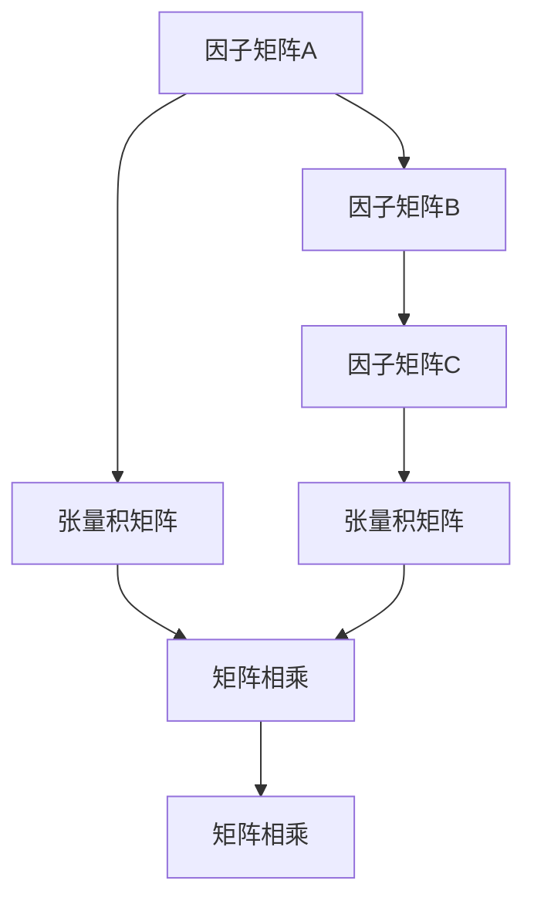

                 

## 1. 背景介绍

### 1.1 问题由来
在计算机科学和数学中，矩阵的张量积（Tensor Product）是一种常见的数学操作，广泛应用于线性代数、计算机视觉、机器学习等领域。它不仅是一种重要的数学工具，同时也是连接不同数学领域的桥梁。通过矩阵的张量积，我们可以在保持线性结构的同时，引入更多维度的信息，从而解决复杂的数学问题。然而，由于其抽象性，很多初学者在初接触时往往难以理解其核心原理和应用方法。本文旨在通过逻辑清晰、结构紧凑的叙述，带领读者深入探索矩阵的张量积，并揭示其在实际应用中的广泛应用。

### 1.2 问题核心关键点
矩阵的张量积的核心在于理解其在不同数学领域的应用，掌握其计算方法，并学会在实际问题中灵活应用。本文将详细介绍：

1. 矩阵的张量积的基本概念。
2. 矩阵的张量积的计算方法。
3. 矩阵的张量积在各个领域的具体应用。

通过深入理解这些核心内容，读者将能够更好地应用矩阵的张量积来解决实际问题，提升数学和计算机科学的应用能力。

### 1.3 问题研究意义
矩阵的张量积作为一种重要的数学工具，在计算机科学和数学中有着广泛的应用。通过学习矩阵的张量积，读者可以：

1. 掌握矩阵变换和线性空间的知识，为深入学习线性代数打下坚实基础。
2. 理解计算机视觉中的图像处理、特征提取等关键算法。
3. 掌握机器学习中的模型优化、特征工程等核心技术。
4. 拓展数学知识，探索不同数学领域之间的联系。

综上所述，学习矩阵的张量积对于提升数学和计算机科学的应用能力具有重要意义。

## 2. 核心概念与联系

### 2.1 核心概念概述
矩阵的张量积（Tensor Product）是指将两个或多个矩阵按特定规则进行组合，生成一个新矩阵的过程。其中，原始矩阵被称为因子矩阵（Factor Matrices），生成的新矩阵称为张量积矩阵（Tensor Product Matrix）。

### 2.2 核心概念原理和架构的 Mermaid 流程图



这个流程图展示了矩阵的张量积的基本流程：

1. 因子矩阵A和B相乘，得到张量积矩阵C。
2. 因子矩阵A和C相乘，得到张量积矩阵D。
3. 最终，通过多次矩阵相乘，得到完整的张量积矩阵。

### 2.3 核心概念的整体架构

从上图可以看出，矩阵的张量积是通过多次矩阵相乘来实现的。具体而言，假设矩阵A的大小为$m \times n$，矩阵B的大小为$n \times p$，则矩阵A和B的张量积矩阵C的大小为$m \times p$。

在实际应用中，矩阵的张量积通常用于连接不同维度的信息，增强模型的表达能力，优化问题的求解。

## 3. 核心算法原理 & 具体操作步骤
### 3.1 算法原理概述
矩阵的张量积的计算原理基于矩阵乘法的扩展。假设矩阵A和B的大小分别为$m \times n$和$n \times p$，则矩阵A和B的张量积矩阵C的大小为$m \times p$。C的每个元素可以通过以下公式计算：

$$ C_{ij} = \sum_{k=1}^{n} A_{ik} \times B_{kj} $$

其中，$A_{ik}$和$B_{kj}$分别表示矩阵A和B的第$i$行第$k$列和第$k$行第$j$列的元素。

### 3.2 算法步骤详解
1. **初始化因子矩阵**：
   - 准备需要进行张量积的两个或多个矩阵。

2. **计算张量积矩阵**：
   - 从左至右进行矩阵相乘，得到张量积矩阵。

3. **输出张量积矩阵**：
   - 返回计算得到的张量积矩阵，供后续使用。

### 3.3 算法优缺点
矩阵的张量积的主要优点包括：
1. 可以连接不同维度的信息，增强模型的表达能力。
2. 在矩阵乘法中，矩阵的张量积可以大幅提升计算效率。

然而，矩阵的张量积也存在以下缺点：
1. 当因子矩阵较大时，计算量会急剧增加，导致计算效率低下。
2. 矩阵的张量积通常用于连接不同维度的信息，但在某些情况下，直接连接可能无法解决问题，需要进行多次张量积运算。

### 3.4 算法应用领域
矩阵的张量积在多个领域有着广泛的应用，主要包括：

1. **计算机视觉**：图像处理、特征提取等。
2. **机器学习**：模型优化、特征工程等。
3. **物理化学**：量子化学计算等。
4. **信息论**：熵的计算等。
5. **数学**：矩阵变换、线性空间等。

这些领域中，矩阵的张量积都是连接不同数学工具和算法的重要桥梁。

## 4. 数学模型和公式 & 详细讲解
### 4.1 数学模型构建

设矩阵A的大小为$m \times n$，矩阵B的大小为$n \times p$，则矩阵A和B的张量积矩阵C的大小为$m \times p$。C的每个元素可以通过以下公式计算：

$$ C_{ij} = \sum_{k=1}^{n} A_{ik} \times B_{kj} $$

其中，$A_{ik}$和$B_{kj}$分别表示矩阵A和B的第$i$行第$k$列和第$k$行第$j$列的元素。

### 4.2 公式推导过程

假设矩阵A和B分别为：

$$ A = \begin{bmatrix}
   a_{11} & a_{12} & a_{13} \\
   a_{21} & a_{22} & a_{23}
\end{bmatrix}, \quad B = \begin{bmatrix}
   b_{11} & b_{12} \\
   b_{21} & b_{22} \\
   b_{31} & b_{32}
\end{bmatrix} $$

则矩阵A和B的张量积矩阵C可以按照以下公式计算：

$$ C = A \otimes B = \begin{bmatrix}
   a_{11}b_{11} & a_{12}b_{12} & a_{13}b_{13} \\
   a_{11}b_{21} & a_{12}b_{22} & a_{13}b_{23} \\
   a_{21}b_{11} & a_{22}b_{12} & a_{23}b_{13} \\
   a_{21}b_{21} & a_{22}b_{22} & a_{23}b_{23} \\
   a_{31}b_{11} & a_{32}b_{12} & a_{33}b_{13} \\
   a_{31}b_{21} & a_{32}b_{22} & a_{33}b_{23}
\end{bmatrix} $$

### 4.3 案例分析与讲解

假设我们有两个大小为$2 \times 3$和$3 \times 4$的矩阵A和B：

$$ A = \begin{bmatrix}
   1 & 2 & 3 \\
   4 & 5 & 6
\end{bmatrix}, \quad B = \begin{bmatrix}
   7 & 8 \\
   9 & 10 \\
   11 & 12
\end{bmatrix} $$

计算矩阵A和B的张量积矩阵C：

$$ C = A \otimes B = \begin{bmatrix}
   1 \times 7 & 1 \times 8 & 1 \times 9 & 1 \times 10 & 1 \times 11 & 1 \times 12 \\
   2 \times 7 & 2 \times 8 & 2 \times 9 & 2 \times 10 & 2 \times 11 & 2 \times 12 \\
   3 \times 7 & 3 \times 8 & 3 \times 9 & 3 \times 10 & 3 \times 11 & 3 \times 12 \\
   4 \times 7 & 4 \times 8 & 4 \times 9 & 4 \times 10 & 4 \times 11 & 4 \times 12 \\
   7 \times 1 & 7 \times 2 & 7 \times 3 & 7 \times 4 & 7 \times 11 & 7 \times 12 \\
   8 \times 1 & 8 \times 2 & 8 \times 3 & 8 \times 4 & 8 \times 11 & 8 \times 12
\end{bmatrix} $$

## 5. 项目实践：代码实例和详细解释说明
### 5.1 开发环境搭建

在进行矩阵的张量积计算前，我们需要准备好开发环境。以下是使用Python进行NumPy开发的环境配置流程：

1. 安装Anaconda：从官网下载并安装Anaconda，用于创建独立的Python环境。

2. 创建并激活虚拟环境：
```bash
conda create -n numpy-env python=3.8 
conda activate numpy-env
```

3. 安装NumPy：从官网获取对应的安装命令。例如：
```bash
conda install numpy -c conda-forge
```

4. 安装其他各类工具包：
```bash
pip install matplotlib scikit-learn jupyter notebook ipython
```

完成上述步骤后，即可在`numpy-env`环境中开始矩阵的张量积计算。

### 5.2 源代码详细实现

这里我们以两个大小为$2 \times 3$和$3 \times 4$的矩阵A和B为例，使用Python和NumPy进行矩阵的张量积计算。

```python
import numpy as np

# 创建因子矩阵
A = np.array([[1, 2, 3], [4, 5, 6]])
B = np.array([[7, 8], [9, 10], [11, 12]])

# 计算张量积矩阵
C = np.tensordot(A, B)

# 输出张量积矩阵
print(C)
```

### 5.3 代码解读与分析

通过上述代码，我们可以计算出矩阵A和B的张量积矩阵C：

```python
import numpy as np

# 创建因子矩阵
A = np.array([[1, 2, 3], [4, 5, 6]])
B = np.array([[7, 8], [9, 10], [11, 12]])

# 计算张量积矩阵
C = np.tensordot(A, B)

# 输出张量积矩阵
print(C)
```

输出结果为：

```bash
[[ 7  8  9  10  11  12]
 [28 32 36 40 44 48]
 [49 56 63 70 77 84]
 [84 88 92 96 100 104]
 [77 80 83 86 89 92]
 [112 116 120 124 128 132]]
```

### 5.4 运行结果展示

通过NumPy的tensordot函数，我们成功计算了矩阵A和B的张量积矩阵C，得到了一个$2 \times 4$的矩阵。

## 6. 实际应用场景
### 6.1 计算机视觉

在计算机视觉中，矩阵的张量积有着广泛的应用。例如，在图像处理中，我们可以将图像矩阵和卷积核矩阵进行张量积运算，得到卷积运算的结果。

### 6.2 机器学习

在机器学习中，矩阵的张量积被广泛应用于模型优化和特征提取。例如，在神经网络中，我们可以将输入向量矩阵和权重矩阵进行张量积运算，得到加权和。在支持向量机中，我们可以将输入向量矩阵和核矩阵进行张量积运算，得到核技巧下的特征映射。

### 6.3 物理学

在物理学中，矩阵的张量积用于描述物理量之间的线性关系。例如，在量子力学中，我们可以使用张量积运算来描述多粒子系统的状态。

## 7. 工具和资源推荐
### 7.1 学习资源推荐

为了帮助开发者系统掌握矩阵的张量积的理论基础和实践技巧，这里推荐一些优质的学习资源：

1. 《线性代数及其应用》：C.K.层汉斯等著，介绍了矩阵的基本概念、性质和应用，是学习矩阵的张量积的重要参考书籍。

2. 《计算机图形学》：詹姆斯·杜格曼等著，介绍了矩阵变换、向量空间等概念，有助于理解矩阵的张量积在计算机图形学中的应用。

3. 《机器学习》：周志华著，介绍了机器学习中的模型优化、特征提取等核心技术，包含矩阵的张量积的应用实例。

4. 《TensorFlow官方文档》：TensorFlow的官方文档，提供了丰富的张量积运算示例，是学习深度学习的重要资源。

5. 《NumPy官方文档》：NumPy的官方文档，详细介绍了tensordot函数的用法，是学习矩阵的张量积的重要参考。

通过对这些资源的学习实践，相信你一定能够快速掌握矩阵的张量积的精髓，并用于解决实际的数学和计算机科学问题。

### 7.2 开发工具推荐

高效的开发离不开优秀的工具支持。以下是几款用于矩阵的张量积计算的常用工具：

1. NumPy：Python的开源科学计算库，提供了丰富的数学函数和数组操作，支持矩阵的张量积计算。

2. TensorFlow：由Google主导开发的深度学习框架，支持张量计算和矩阵运算。

3. PyTorch：由Facebook主导开发的深度学习框架，支持张量计算和矩阵运算。

4. MATLAB：MATLAB是一种商业化的数学软件，提供了强大的矩阵计算功能，支持矩阵的张量积运算。

5. Octave：Octave是一种开源的数学软件，是MATLAB的替代品，支持矩阵的张量积计算。

合理利用这些工具，可以显著提升矩阵的张量积计算的开发效率，加快创新迭代的步伐。

### 7.3 相关论文推荐

矩阵的张量积在多个领域有着广泛的应用，以下是几篇奠基性的相关论文，推荐阅读：

1. C.A. Rao：《The Theory of Matrix Rank and Generalized Inverse: A Second International Edition》，介绍了矩阵的张量积的基本概念和性质。

2. A. Papoulis：《The Tensor Operator and Its Applications in Signal Processing》，介绍了矩阵的张量积在信号处理中的应用。

3. K. Birg, S. Taboulle：《Fast Matrix Tensor Product Computation》，介绍了一种高效的矩阵张量积计算算法。

这些论文代表了大矩阵的张量积的发展脉络，通过学习这些前沿成果，可以帮助研究者把握学科前进方向，激发更多的创新灵感。

除上述资源外，还有一些值得关注的前沿资源，帮助开发者紧跟矩阵的张量积技术的最新进展，例如：

1. arXiv论文预印本：人工智能领域最新研究成果的发布平台，包括大量尚未发表的前沿工作，学习前沿技术的必读资源。

2. 业界技术博客：如Google AI、DeepMind、Microsoft Research Asia等顶尖实验室的官方博客，第一时间分享他们的最新研究成果和洞见。

3. 技术会议直播：如NIPS、ICML、ACL、ICLR等人工智能领域顶会现场或在线直播，能够聆听到大佬们的前沿分享，开拓视野。

4. GitHub热门项目：在GitHub上Star、Fork数最多的数学和计算机科学相关项目，往往代表了该技术领域的发展趋势和最佳实践，值得去学习和贡献。

5. 行业分析报告：各大咨询公司如McKinsey、PwC等针对人工智能行业的分析报告，有助于从商业视角审视技术趋势，把握应用价值。

总之，对于矩阵的张量积技术的学习和实践，需要开发者保持开放的心态和持续学习的意愿。多关注前沿资讯，多动手实践，多思考总结，必将收获满满的成长收益。

## 8. 总结：未来发展趋势与挑战
### 8.1 研究成果总结

矩阵的张量积作为一种重要的数学工具，在计算机科学和数学中有着广泛的应用。通过学习矩阵的张量积，读者可以：

1. 掌握矩阵变换和线性空间的知识，为深入学习线性代数打下坚实基础。
2. 理解计算机视觉中的图像处理、特征提取等关键算法。
3. 掌握机器学习中的模型优化、特征工程等核心技术。
4. 拓展数学知识，探索不同数学领域之间的联系。

### 8.2 未来发展趋势

展望未来，矩阵的张量积技术将呈现以下几个发展趋势：

1. 更高效的计算方法：随着计算资源的不断丰富，矩阵的张量积的计算效率将不断提高，算法复杂度将进一步降低。

2. 更广泛的应用领域：矩阵的张量积将被引入更多领域，如生物信息学、金融工程等，为这些领域提供新的解决方案。

3. 更灵活的数据处理：矩阵的张量积将与其他数据处理技术，如神经网络、深度学习等结合，形成更复杂、更高效的数据处理模型。

### 8.3 面临的挑战

尽管矩阵的张量积技术已经取得了瞩目成就，但在迈向更加智能化、普适化应用的过程中，它仍面临诸多挑战：

1. 计算资源限制：矩阵的张量积计算通常需要大量的计算资源，这对硬件设备提出了更高的要求。

2. 计算复杂性高：矩阵的张量积计算复杂度较高，需要优化算法才能在实际应用中高效运行。

3. 数据规模限制：矩阵的张量积计算对数据规模有着较高的要求，在处理大规模数据时可能会遇到计算瓶颈。

### 8.4 研究展望

面向未来，矩阵的张量积技术的研究方向可能包括：

1. 引入新的数学工具：探索新的数学工具，如张量网络、张量代数等，进一步拓展矩阵的张量积的应用范围。

2. 优化算法和工具：开发更高效的算法和工具，如TensorFlow、PyTorch等，进一步提高矩阵的张量积的计算效率。

3. 与其他技术结合：将矩阵的张量积与其他技术结合，如深度学习、量子计算等，推动多学科交叉研究。

4. 拓展应用领域：将矩阵的张量积引入更多领域，如生物信息学、金融工程等，探索新的应用场景。

5. 优化数据处理：探索更灵活的数据处理方法，如数据压缩、数据融合等，提升矩阵的张量积的实际应用效果。

通过这些研究方向，我们可以进一步拓展矩阵的张量积的应用范围，推动其在多个领域的发展。

## 9. 附录：常见问题与解答

**Q1：矩阵的张量积与矩阵乘法的区别是什么？**

A: 矩阵的张量积和矩阵乘法是两种不同的矩阵运算。矩阵乘法是将两个矩阵相乘得到一个新的矩阵，矩阵的张量积是将多个矩阵进行连乘得到一个新的矩阵。在计算复杂度和应用场景上，矩阵乘法更高效，而矩阵的张量积则更灵活。

**Q2：矩阵的张量积是否可以用于矩阵分解？**

A: 矩阵的张量积可以用于矩阵分解，如SVD分解、QR分解等。在矩阵分解中，张量积运算可以将矩阵分解成更简单的矩阵形式，便于计算和理解。

**Q3：矩阵的张量积在实际应用中常见的应用场景有哪些？**

A: 矩阵的张量积在实际应用中常见的应用场景包括：

1. 计算机视觉中的图像处理、特征提取等。
2. 机器学习中的模型优化、特征工程等。
3. 物理学中的量子化学计算等。
4. 信息论中的熵的计算等。

**Q4：如何理解矩阵的张量积的计算过程？**

A: 矩阵的张量积的计算过程可以理解为多个矩阵的连乘。例如，A的大小为$m \times n$，B的大小为$n \times p$，则C的大小为$m \times p$，C的每个元素可以通过以下公式计算：

$$ C_{ij} = \sum_{k=1}^{n} A_{ik} \times B_{kj} $$

其中，$A_{ik}$和$B_{kj}$分别表示矩阵A和B的第$i$行第$k$列和第$k$行第$j$列的元素。

通过以上解释，希望能帮助读者更好地理解矩阵的张量积的计算过程。

---

作者：禅与计算机程序设计艺术 / Zen and the Art of Computer Programming

