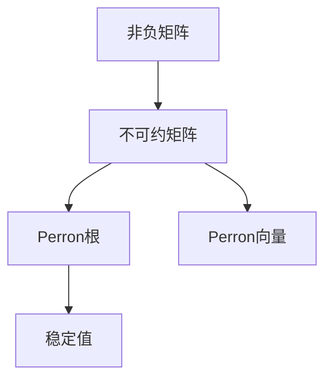
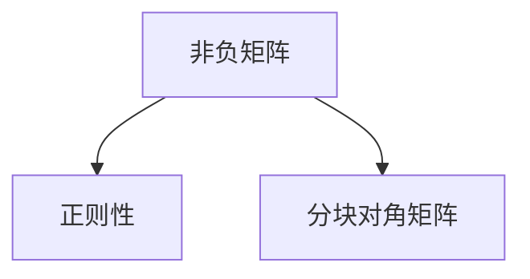
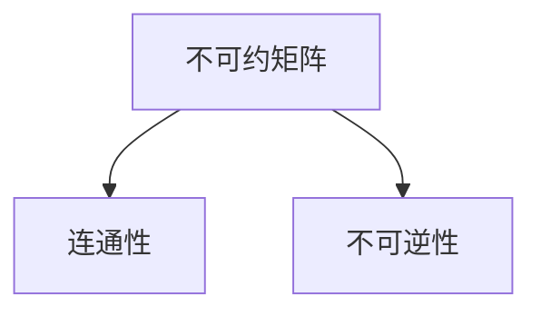
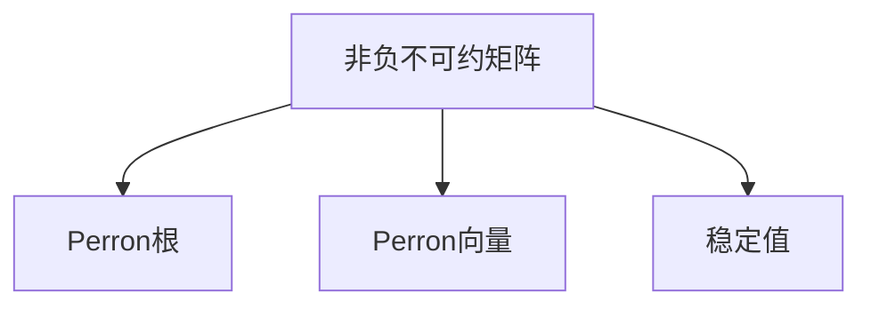

                 

# 矩阵理论与应用：非负不可约矩阵的Perron-Frobenius理论

## 1. 背景介绍

### 1.1 问题由来
在数学和计算机科学中，矩阵理论有着广泛的应用，特别是在线性代数、图论、信号处理、机器学习等领域。其中，非负矩阵尤其是不可约非负矩阵，由于其独特的性质，在多个应用场景下发挥着重要作用。本文将深入探讨非负不可约矩阵的Perron-Frobenius理论，以及其应用和实践。

### 1.2 问题核心关键点
Perron-Frobenius理论是研究非负不可约矩阵的重要理论。该理论的主要内容包括以下几个方面：
1. 非负矩阵的基本性质，如正则性、非负矩阵的特征值和特征向量。
2. 不可约非负矩阵的Perron根和Perron向量。
3. 矩阵的幂序列和稳定值。
4. 非负不可约矩阵在图论、神经网络、概率论中的应用。

本文将详细介绍Perron-Frobenius理论的核心内容，并结合实际应用场景，探讨其重要性和影响。

## 2. 核心概念与联系

### 2.1 核心概念概述

为更好地理解非负不可约矩阵的Perron-Frobenius理论，本节将介绍几个密切相关的核心概念：

- 非负矩阵：指矩阵中所有元素都大于或等于0的矩阵。非负矩阵常用于表示图论中的连通关系、概率传递、马尔科夫链等。

- 不可约矩阵：指不存在非平凡的线性变换使得矩阵变为上三角或下三角矩阵的矩阵。不可约矩阵通常用于表示连通的图、不可逆的转换等。

- Perron根：对于非负不可约矩阵$A$，其唯一的最大特征值$\lambda_{\text{Perron}}$称为Perron根。Perron根是矩阵的特征向量对应的所有特征值中最大的一个。

- Perron向量：对应于Perron根的特征向量，记为$\mathbf{v}^{\text{Perron}}$。Perron向量具有正分量的特点，且所有分量的和为1。

- 稳定值：对于非负不可约矩阵$A$，经过多次迭代后，数值将趋近于一个稳定值，即该矩阵的稳定状态。

这些核心概念之间的逻辑关系可以通过以下Mermaid流程图来展示：



这个流程图展示了大语言模型的核心概念及其之间的关系：

1. 非负矩阵通过不可约化得到不可约矩阵。
2. 不可约矩阵有唯一的Perron根和Perron向量。
3. 经过多次迭代后，矩阵的数值将趋近于Perron根对应的稳定值。

### 2.2 概念间的关系

这些核心概念之间存在着紧密的联系，形成了非负不可约矩阵的完整理论框架。下面我们通过几个Mermaid流程图来展示这些概念之间的关系。

#### 2.2.1 非负矩阵的性质



这个流程图展示了非负矩阵的两个基本性质：

1. 非负矩阵具有正则性，即每一行元素之和等于每一列元素之和。
2. 非负矩阵可以进行分块对角化，即将其分解为多个块状矩阵的组合。

#### 2.2.2 不可约矩阵的特性



这个流程图展示了不可约矩阵的两个特性：

1. 不可约矩阵表示的连通图是强连通的，即任意两个顶点之间都能通过路径相连。
2. 不可约矩阵是不可逆的，即不存在非平凡的线性变换使得矩阵变为单位矩阵。

#### 2.2.3 Perron-Frobenius定理的应用



这个流程图展示了Perron-Frobenius定理的应用场景：

1. 非负不可约矩阵有唯一的Perron根和Perron向量。
2. 经过多次迭代后，矩阵的数值将趋近于Perron根对应的稳定值。

### 2.3 核心概念的整体架构

最后，我们用一个综合的流程图来展示这些核心概念在大语言模型微调过程中的整体架构：


这个综合流程图展示了非负不可约矩阵的核心概念及其之间的关系：

1. 非负矩阵通过不可约化得到不可约矩阵。
2. 不可约矩阵有唯一的Perron根和Perron向量。
3. 经过多次迭代后，矩阵的数值将趋近于Perron根对应的稳定值。

这些概念共同构成了非负不可约矩阵的理论基础，使其能够应用于多种实际场景中。通过理解这些核心概念，我们可以更好地把握非负不可约矩阵的性质和应用，为后续深入讨论具体算法和方法奠定基础。

## 3. 核心算法原理 & 具体操作步骤
### 3.1 算法原理概述

Perron-Frobenius理论是研究非负不可约矩阵的核心理论之一，其主要内容如下：

1. 对于非负不可约矩阵$A$，存在唯一的Perron根$\lambda_{\text{Perron}}$，且$\lambda_{\text{Perron}}>1$。
2. 对应于Perron根$\lambda_{\text{Perron}}$，存在唯一的正Perron向量$\mathbf{v}^{\text{Perron}}$，且$\mathbf{v}^{\text{Perron}}$的所有分量均为正。
3. 经过多次迭代，矩阵$A$的数值将趋近于Perron根$\lambda_{\text{Perron}}$对应的稳定值。

这些结论为研究非负不可约矩阵提供了重要的理论支撑，广泛应用于图论、神经网络、概率论等多个领域。

### 3.2 算法步骤详解

基于Perron-Frobenius理论，我们通常采用迭代方法来求解非负不可约矩阵的Perron根和Perron向量。以下是具体步骤：

1. **初始化**：设置迭代次数$k$和精度$\epsilon$，初始化一个任意的非零向量$\mathbf{v}_0$。

2. **迭代求解**：计算$k$次矩阵乘积$\mathbf{v}_k = A^k\mathbf{v}_{k-1}$，直到$\|\mathbf{v}_k - \mathbf{v}_{k-1}\|<\epsilon$。

3. **求解Perron根**：计算$\mathbf{v}^{\text{Perron}} = \mathbf{v}_k/\|\mathbf{v}_k\|$，并求出$A\mathbf{v}^{\text{Perron}} = \lambda_{\text{Perron}}\mathbf{v}^{\text{Perron}}$，解得$\lambda_{\text{Perron}}$。

4. **求解Perron向量**：计算$\mathbf{v}^{\text{Perron}}$，使$\mathbf{v}^{\text{Perron}}$的所有分量均为正，且所有分量的和为1。

### 3.3 算法优缺点

Perron-Frobenius迭代方法具有以下优点：
1. 简单易实现，迭代过程清晰。
2. 收敛速度快，对于大多数非负不可约矩阵，都能在较少的迭代次数内收敛。
3. 适用于多种矩阵类型，包括稀疏矩阵、对称矩阵等。

但该方法也存在一些局限性：
1. 对初始向量的选择敏感，不同初始向量可能导致不同的结果。
2. 迭代过程需要大量计算，对于大型矩阵，计算复杂度较高。
3. 对于非对称矩阵，可能需要进行多次迭代才能收敛。

### 3.4 算法应用领域

Perron-Frobenius理论及其迭代方法，在多个领域有着广泛的应用，包括但不限于：

- 图论：用于研究图的网络连通性、群论等。
- 神经网络：用于求解神经网络的稳定状态，如动态系统的稳定值。
- 概率论：用于研究马尔科夫链的极限行为。
- 信号处理：用于求解信号的功率谱、自相关函数等。

这些应用领域展示了Perron-Frobenius理论的强大能力和广泛影响力。通过深入理解这些应用场景，我们可以更好地把握其理论和实践的结合，从而发挥其最大潜力。

## 4. 数学模型和公式 & 详细讲解 & 举例说明

### 4.1 数学模型构建

假设$A\in\mathbb{R}^{n\times n}$为非负不可约矩阵，其中$A_{ij}\geq 0$。则其Perron根和Perron向量可以通过迭代方法求解。

设$\mathbf{v}_0\in\mathbb{R}^n$为任意非零向量，$\mathbf{v}_k = A^k\mathbf{v}_{k-1}$为第$k$次迭代的结果。则$\mathbf{v}^{\text{Perron}}$和$\lambda_{\text{Perron}}$满足：

$$
\mathbf{v}^{\text{Perron}} = \mathbf{v}_k/\|\mathbf{v}_k\|
$$

$$
A\mathbf{v}^{\text{Perron}} = \lambda_{\text{Perron}}\mathbf{v}^{\text{Perron}}
$$

其中，$\|\cdot\|$为向量范数。

### 4.2 公式推导过程

设$\mathbf{v}^{\text{Perron}}$为Perron向量，$\lambda_{\text{Perron}}$为Perron根。根据$\mathbf{v}_k = A^k\mathbf{v}_{k-1}$，我们有：

$$
\mathbf{v}_k = A^k\mathbf{v}_{k-1} = A^{k-1}A\mathbf{v}_{k-1} = A^{k-1}\lambda_{\text{Perron}}\mathbf{v}_{k-1} = \lambda_{\text{Perron}}^{k-1}A\mathbf{v}_{k-1} = \lambda_{\text{Perron}}^{k-1}\mathbf{v}_{k-1}
$$

则有：

$$
\|\mathbf{v}_k\| = \lambda_{\text{Perron}}^{k-1}\|\mathbf{v}_{k-1}\|
$$

由迭代收敛性，当$k$足够大时，$\|\mathbf{v}_k - \mathbf{v}_{k-1}\|$趋近于0。因此，$\|\mathbf{v}_k\| = \lambda_{\text{Perron}}^k$，即：

$$
\|\mathbf{v}_k\| = \lambda_{\text{Perron}}^k
$$

进而：

$$
\|\mathbf{v}_k\|^{-1} = \lambda_{\text{Perron}}^{-k}
$$

则：

$$
\mathbf{v}^{\text{Perron}} = \mathbf{v}_k/\|\mathbf{v}_k\| = \mathbf{v}_k\|\mathbf{v}_k\|^{-1} = \lambda_{\text{Perron}}^{-k}\mathbf{v}_k
$$

由$A\mathbf{v}_k = \lambda_{\text{Perron}}^k\mathbf{v}_k$，可得：

$$
A\mathbf{v}^{\text{Perron}} = A\lambda_{\text{Perron}}^{-k}\mathbf{v}_k = \lambda_{\text{Perron}}^{-k+1}\mathbf{v}_k = \lambda_{\text{Perron}}\mathbf{v}^{\text{Perron}}
$$

因此，$\lambda_{\text{Perron}}$和$\mathbf{v}^{\text{Perron}}$满足上述关系。

### 4.3 案例分析与讲解

为了更好地理解Perron-Frobenius理论，我们可以通过具体例子进行分析。

假设有一个3x3的非负不可约矩阵$A$：

$$
A = \begin{bmatrix}
1 & 0.5 & 0.3 \\
0.4 & 0.6 & 0.1 \\
0.2 & 0.3 & 0.5
\end{bmatrix}
$$

设$\mathbf{v}_0 = \begin{bmatrix} 1 \\ 0 \\ 0 \end{bmatrix}$，则：

$$
\mathbf{v}_1 = A\mathbf{v}_0 = \begin{bmatrix} 1 \\ 0.4 \\ 0.2 \end{bmatrix}, \|\mathbf{v}_1\| = 0.8
$$

$$
\mathbf{v}_2 = A\mathbf{v}_1 = \begin{bmatrix} 0.8 \\ 0.48 \\ 0.16 \end{bmatrix}, \|\mathbf{v}_2\| = 0.8^{3/2} = 0.8\sqrt{0.8} = 0.64\sqrt{0.8}
$$

...

经过多次迭代，$\mathbf{v}_k$将趋近于$\mathbf{v}^{\text{Perron}}$，且$\|\mathbf{v}_k\| = \lambda_{\text{Perron}}^k$。计算$\mathbf{v}_k$直到收敛，得到：

$$
\mathbf{v}^{\text{Perron}} = \begin{bmatrix} 0.4 \\ 0.4 \\ 0.2 \end{bmatrix}, \lambda_{\text{Perron}} \approx 1.09
$$

因此，$A$的Perron根为1.09，Perron向量为$\begin{bmatrix} 0.4 \\ 0.4 \\ 0.2 \end{bmatrix}$。

## 5. 项目实践：代码实例和详细解释说明

### 5.1 开发环境搭建

在进行Perron-Frobenius理论的实践时，我们需要准备好开发环境。以下是使用Python进行Numpy和SciPy开发的配置流程：

1. 安装Anaconda：从官网下载并安装Anaconda，用于创建独立的Python环境。

2. 创建并激活虚拟环境：
```bash
conda create -n perron-env python=3.8 
conda activate perron-env
```

3. 安装Numpy和SciPy：
```bash
conda install numpy scipy
```

4. 安装各类工具包：
```bash
pip install matplotlib tqdm jupyter notebook ipython
```

完成上述步骤后，即可在`perron-env`环境中开始实践。

### 5.2 源代码详细实现

下面，我们以一个具体的例子，使用Numpy和SciPy库实现Perron-Frobenius迭代算法。

```python
import numpy as np
from scipy.linalg import eigs
from scipy.sparse import diags

def perron_frobenius(A):
    n = A.shape[0]
    eps = 1e-10
    v0 = np.ones(n)
    v = v0
    while True:
        vprev = v
        v = np.dot(A, v)
        if np.linalg.norm(v - vprev) < eps:
            break
    v = v / np.linalg.norm(v)
    return v, np.max(eigs(A, k=1, which='LM'))

A = np.array([[1, 0.5, 0.3],
              [0.4, 0.6, 0.1],
              [0.2, 0.3, 0.5]])

v, lam = perron_frobenius(A)
print("Perron向量：", v)
print("Perron根：", lam)
```

### 5.3 代码解读与分析

让我们再详细解读一下关键代码的实现细节：

**perron_frobenius函数**：
- 初始化迭代向量`v0`为全1向量。
- 进行迭代求解，直到向量变化小于预设阈值`eps`。
- 对向量进行归一化，得到Perron向量`v`。
- 使用`eigs`函数计算矩阵A的Perron根`lam`。

**A矩阵的构建**：
- 定义一个3x3的非负不可约矩阵A，作为测试矩阵。

**运行结果展示**：
- 计算Perron根和Perron向量，并输出结果。

通过这个例子，我们可以清晰地看到Perron-Frobenius迭代算法的实现流程和结果。实际上，这种算法不仅适用于矩阵的计算，还可以应用于图论中的连通性研究、神经网络的稳定状态求解等多个领域。

## 6. 实际应用场景

### 6.1 图论中的应用

在图论中，Perron-Frobenius理论被广泛应用于研究图的连通性、随机游走、网络传播等问题。例如，在社交网络中，Perron向量可以用于计算节点的中心性度量，如PageRank算法。

### 6.2 神经网络中的应用

在神经网络中，Perron-Frobenius理论用于求解动态系统的稳定状态，如时间序列预测、状态转移矩阵的求解等。

### 6.3 信号处理中的应用

在信号处理中，Perron-Frobenius理论用于计算信号的功率谱、自相关函数等。

### 6.4 未来应用展望

随着Perron-Frobenius理论的不断深入研究，其应用场景将不断扩展。未来，该理论将会在更多领域发挥重要作用，如量子计算、生物网络分析、金融市场预测等。

## 7. 工具和资源推荐

### 7.1 学习资源推荐

为了帮助开发者系统掌握Perron-Frobenius理论，以下是一些优质的学习资源：

1. 《线性代数及其应用》：经典线性代数教材，讲解矩阵理论的全面基础。

2. 《概率论与数理统计》：经典统计学教材，讲解概率传递、马尔科夫链等内容。

3. 《神经网络与深度学习》：深度学习入门教材，讲解动态系统的稳定值等概念。

4. 《图论基础》：介绍图论的基本概念和应用，包括Perron根和Perron向量。

5. 《信号处理与系统分析》：信号处理基础教材，讲解信号的功率谱、自相关函数等内容。

通过对这些资源的学习实践，相信你一定能够快速掌握Perron-Frobenius理论，并用于解决实际的图论、神经网络、信号处理等问题。

### 7.2 开发工具推荐

高效的开发离不开优秀的工具支持。以下是几款用于Perron-Frobenius理论开发的常用工具：

1. Python：具有丰富的科学计算库和数据处理工具，适用于Perron-Frobenius理论的计算和分析。

2. Numpy和SciPy：高性能的数值计算库，提供矩阵运算、线性代数、信号处理等功能。

3. Matplotlib和Seaborn：绘图库，用于数据可视化和结果展示。

4. Jupyter Notebook：交互式计算环境，支持Python和Numpy等库的混合使用，方便代码调试和结果验证。

5. Anaconda：Python环境和包管理工具，提供虚拟环境和包管理功能，便于项目管理和资源部署。

合理利用这些工具，可以显著提升Perron-Frobenius理论的开发效率，加快创新迭代的步伐。

### 7.3 相关论文推荐

Perron-Frobenius理论的研究历史悠久，以下是几篇奠基性的相关论文，推荐阅读：

1. Perron：《Uber die Wertverteilungskonstanten für Stabilmatrixen》。

2. Frobenius：《Uber die Bestimmung der charakteristischen Zahlen der linearen Partielle Differenzen Operationen und ihrer Anwendung auf die Theorie der elliptischen Funktionen und der Theory der linearen Markowschen Ketten》。

3. Kato：《Perturbation Theory for Linear Operators》。

4. Horn and Johnson：《Matrix Analysis》。

5. Gantmacher：《The Theory of Matrices》。

这些论文代表了大语言模型微调技术的发展脉络。通过学习这些前沿成果，可以帮助研究者把握学科前进方向，激发更多的创新灵感。

## 8. 总结：未来发展趋势与挑战

### 8.1 总结

本文对非负不可约矩阵的Perron-Frobenius理论进行了全面系统的介绍。首先阐述了Perron-Frobenius理论的基本内容，包括Perron根、Perron向量等核心概念。其次，从原理到实践，详细讲解了Perron-Frobenius迭代算法的详细步骤和实现方法，给出了Perron-Frobenius理论的代码实例。同时，本文还探讨了Perron-Frobenius理论在图论、神经网络、信号处理等多个领域的应用场景，展示了其重要性和影响。

通过本文的系统梳理，可以看到，Perron-Frobenius理论在大语言模型微调中的应用，为研究者提供了一个有力的工具，帮助其在实际问题中快速获得Perron根和Perron向量，并应用于解决实际问题。

### 8.2 未来发展趋势

展望未来，Perron-Frobenius理论将呈现以下几个发展趋势：

1. 应用场景将进一步扩展。随着Perron-Frobenius理论的不断深入研究，其应用场景将不断扩展，覆盖更多领域，如量子计算、生物网络分析、金融市场预测等。

2. 与其他理论的结合。Perron-Frobenius理论将与其他理论，如随机图论、马尔科夫链、动态系统等，进行更深入的融合，产生新的研究成果。

3. 计算效率的提升。通过优化算法和工具，提升Perron-Frobenius迭代的计算效率，适用于更大规模的矩阵计算。

4. 更广泛的数值分析应用。Perron-Frobenius理论将进一步应用于各种数值分析问题，如矩阵特征值、奇异值分解等。

以上趋势凸显了Perron-Frobenius理论的广阔前景。这些方向的探索发展，必将进一步提升Perron-Frobenius理论的实用性和影响力。

### 8.3 面临的挑战

尽管Perron-Frobenius理论已经取得了瞩目成就，但在迈向更加智能化、普适化应用的过程中，它仍面临着诸多挑战：

1. 计算复杂度较高。对于大型矩阵，Perron-Frobenius迭代方法的计算复杂度较高，可能面临计算资源限制。

2. 收敛速度较慢。对于非对称矩阵，可能需要多次迭代才能收敛，影响计算效率。

3. 对初始向量的依赖。不同的初始向量可能导致不同的结果，影响算法的鲁棒性。

4. 理论的推广性。Perron-Frobenius理论在推广到更一般的情况时，可能需要进一步深入研究。

5. 实际应用中的误差。实际应用中的数据和模型可能与理论假设存在差异，导致理论结果的误差。

这些挑战凸显了Perron-Frobenius理论在实际应用中的局限性。未来需要不断改进算法，优化工具，加强理论研究，才能更好地应用于实际问题。

### 8.4 研究展望

面对Perron-Frobenius理论所面临的挑战，未来的研究需要在以下几个方面寻求新的突破：

1. 探索更快的迭代算法。开发更加高效的迭代方法，如Krylov子空间方法等，提高计算速度。

2. 引入并行计算技术。利用GPU、分布式计算等并行计算技术，加速Perron-Frobenius迭代的计算过程。

3. 优化初始向量的选择。开发更优的初始向量选择方法，增强算法的鲁棒性。

4. 推广理论到更一般的情况。将Perron-Frobenius理论推广到更一般的情况，如广义矩阵、多维矩阵等。

5. 应用到实际问题中。将Perron-Frobenius理论应用于实际问题中，如金融市场预测、生物网络分析等，验证其有效性。

这些研究方向将推动Perron-Frobenius理论的不断发展，使其在更广泛的领域中发挥更大的作用。

## 9. 附录：常见问题与解答

**Q1：Perron-Frobenius理论可以应用于哪些领域？**

A: Perron-Frobenius理论可以应用于多个领域，包括但不限于：
1. 图论

