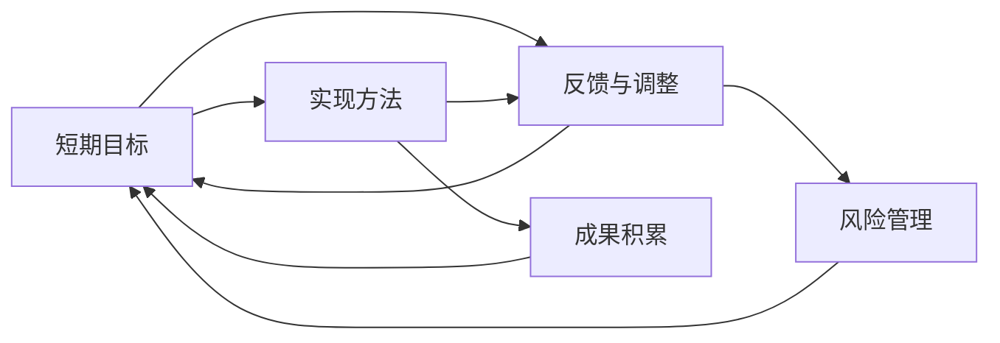
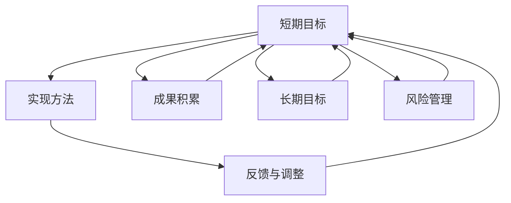

                 

# 短期目标与长期目标的意识管理

在快速发展的技术领域，从短期到长期目标的意识管理变得尤为重要。本文将深入探讨这一主题，旨在帮助读者理解和管理他们的短期目标与长期目标，从而在职业生涯中取得更好的成就。

## 1. 背景介绍

### 1.1 问题由来

在科技行业，尤其是AI和软件开发领域，技术发展日新月异，更新迭代频繁。从业者不仅要不断学习新技术，还要适应新的工作环境和挑战。在这样的环境中，明确短期目标和长期目标的意识管理变得尤为重要。短期目标通常指完成某个项目或实现某个功能，而长期目标则涉及职业发展、技能提升和职业规划等更深层次的议题。

### 1.2 问题核心关键点

管理好短期和长期目标需要考虑以下几个关键点：
1. **目标设定**：明确短期和长期目标，并确保它们符合个人职业发展规划。
2. **优先级管理**：合理分配时间和资源，确保重要任务优先完成。
3. **反馈与调整**：定期回顾和评估目标实现情况，及时调整策略。
4. **风险管理**：识别和应对可能的风险，确保目标可实现。

### 1.3 问题研究意义

明确短期和长期目标不仅有助于个人职业发展，还能提高工作效率，增强团队合作。通过有效的目标管理，可以更好地规划职业生涯，实现个人价值和社会价值。

## 2. 核心概念与联系

### 2.1 核心概念概述

- **短期目标**：指在较短时间内（通常几个月到一年）需要完成的具体任务或项目，如开发新功能、完成某个项目等。
- **长期目标**：指在较长时间内（通常几年甚至几十年）需要达成的职业发展或技能提升目标，如成为技术专家、进入管理层等。
- **意识管理**：指通过意识层面的调整和训练，有效管理短期和长期目标，从而实现职业发展。

### 2.2 概念间的关系

以下Mermaid流程图展示了短期目标与长期目标的意识管理关系：



这个流程图展示了从设定短期目标，到实现方法，再到反馈调整，最后积累成果并调整短期目标的完整过程。

### 2.3 核心概念的整体架构

最后，我们用一个综合的流程图来展示这些核心概念在大语言模型微调过程中的整体架构：



这个综合流程图展示了从短期目标到长期目标的整个意识管理过程。

## 3. 核心算法原理 & 具体操作步骤

### 3.1 算法原理概述

短期和长期目标的意识管理，本质上是一个自我管理和自我提升的过程。其核心思想是通过不断的反思和调整，确保目标与个人发展方向一致。具体来说，可以采用SMART原则（具体、可测量、可实现、相关、有时限）来设定和管理目标。

### 3.2 算法步骤详解

以下是短期和长期目标意识管理的详细步骤：

1. **目标设定**：
   - 明确短期目标：基于当前项目需求或职业发展计划，设定具体、可实现的目标。
   - 明确长期目标：基于个人职业愿景和发展方向，设定具有挑战性的长期目标。

2. **计划制定**：
   - 制定短期计划：为每个短期目标制定详细的执行计划，包括任务分解、时间安排和资源分配。
   - 制定长期计划：为每个长期目标制定长期计划，包括技能提升、知识积累和职业发展路径。

3. **执行与监控**：
   - 执行短期计划：按照计划执行，确保每个任务按时完成。
   - 执行长期计划：持续进行技能提升和知识积累，逐步向长期目标靠近。
   - 监控进度：定期检查进度，评估是否按计划执行，及时调整。

4. **反馈与调整**：
   - 收集反馈：从上级、同事和反馈机制中收集反馈信息。
   - 分析反馈：分析反馈内容，识别问题和改进点。
   - 调整计划：根据反馈和分析结果，调整短期和长期计划。

5. **成果评估**：
   - 评估短期成果：评估每个短期目标的完成情况，确定是否达到了预期效果。
   - 评估长期成果：评估长期目标的进展情况，确定是否在正确的轨道上。

6. **风险管理**：
   - 识别风险：识别可能影响目标实现的风险因素。
   - 制定应对策略：制定应对策略，减少风险对目标实现的影响。
   - 实施风险管理：在执行过程中实施风险管理策略，确保目标可实现。

### 3.3 算法优缺点

**优点**：
- **明确方向**：通过设定短期和长期目标，可以明确职业发展方向，提高工作效率。
- **增强动力**：短期目标的实现可以增强工作动力，激发持续学习的热情。
- **提升成就感**：不断实现短期目标，可以带来成就感，增强自信心。

**缺点**：
- **目标冲突**：短期目标与长期目标之间可能存在冲突，需要灵活调整。
- **灵活性不足**：过度关注短期目标可能导致缺乏灵活性，影响长期发展。
- **时间管理难度**：在多重目标之间平衡时间分配，需要较强的管理能力。

### 3.4 算法应用领域

短期和长期目标的意识管理不仅适用于AI和软件开发领域，还可以广泛应用于以下领域：

- **项目管理**：帮助项目经理有效管理团队任务和进度。
- **职业规划**：帮助个人制定职业发展路径和技能提升计划。
- **学习与发展**：帮助学生制定学习计划和职业规划。
- **个人健康管理**：帮助个人管理健康目标，如锻炼、饮食等。

## 4. 数学模型和公式 & 详细讲解 & 举例说明

### 4.1 数学模型构建

假设有一个短期目标 $A_t$，需要 $n_t$ 周时间实现。每周需要完成的任务量为 $T_t$，每周的资源投入为 $R_t$。长期目标 $A_l$，需要 $m_l$ 个月时间实现。每月需要完成的技能提升量为 $S_l$，每月的资源投入为 $L_l$。

### 4.2 公式推导过程

设每周和每月的资源分配比例分别为 $a_t$ 和 $a_l$，则每周和每月的目标实现量分别为：

$$
C_t = a_t \times T_t \times n_t
$$

$$
C_l = a_l \times S_l \times m_l
$$

设每周和每月的资源投入比例分别为 $b_t$ 和 $b_l$，则每周和每月的资源利用率分别为：

$$
R_t = b_t \times R_t \times n_t
$$

$$
L_l = b_l \times L_l \times m_l
$$

根据资源平衡原则，每周和每月的资源分配应满足以下关系：

$$
R_t \times n_t + L_l \times m_l = R_{total}
$$

其中 $R_{total}$ 为总资源。

### 4.3 案例分析与讲解

假设某开发团队需要开发一个新功能，设定短期目标为4周内完成，每周需要完成50小时的任务量，资源投入为总成本的20%。长期目标为6个月内掌握深度学习框架，每月需要完成20小时的技能提升量，资源投入为总成本的10%。

设每周和每月的资源分配比例分别为 $a_t = 0.2$ 和 $a_l = 0.1$，每周和每月的资源投入比例分别为 $b_t = 0.2$ 和 $b_l = 0.1$。则每周和每月的目标实现量分别为：

$$
C_t = 0.2 \times 50 \times 4 = 40（小时）
$$

$$
C_l = 0.1 \times 20 \times 6 = 12（小时）
$$

每周和每月的资源利用率分别为：

$$
R_t = 0.2 \times 20\% \times 4 = 1.6（周）
$$

$$
L_l = 0.1 \times 10\% \times 6 = 0.6（周）
$$

根据资源平衡原则，每周和每月的资源投入应满足以下关系：

$$
1.6 + 0.6 = 2.2（周）
$$

这意味着每周的资源投入占总资源的50%，每月占10%。通过这个案例，我们可以看到如何通过数学模型和公式来合理规划资源，确保短期和长期目标的实现。

## 5. 项目实践：代码实例和详细解释说明

### 5.1 开发环境搭建

在进行短期和长期目标意识管理实践前，我们需要准备好开发环境。以下是使用Python进行项目管理的环境配置流程：

1. 安装Anaconda：从官网下载并安装Anaconda，用于创建独立的Python环境。

2. 创建并激活虚拟环境：
```bash
conda create -n project-env python=3.8 
conda activate project-env
```

3. 安装必要的Python包：
```bash
pip install pandas numpy matplotlib scikit-learn pyproj
```

4. 初始化项目管理：
```bash
git init
git clone https://github.com/example/project.git
cd project
```

完成上述步骤后，即可在`project-env`环境中开始项目实践。

### 5.2 源代码详细实现

下面我们以项目管理为例，给出使用Python实现短期和长期目标意识管理的具体代码。

```python
import pandas as pd
from typing import Dict, List

class Project:
    def __init__(self, tasks: Dict[str, Dict[str, List[int]]]):
        self.tasks = tasks
        self.current_task = ''
        self.current_time = 0
    
    def set_current_task(self, task: str):
        self.current_task = task
        self.current_time = 0
    
    def set_current_time(self, time: int):
        self.current_time = time
    
    def get_remaining_time(self, task: str, time: int) -> int:
        task_data = self.tasks.get(task, {})
        time_spent = self.current_time
        task_time = task_data.get('time', 0)
        return max(task_time - time_spent, 0)
    
    def update_current_time(self, time: int):
        self.current_time += time
    
    def finish_current_task(self):
        self.current_task = ''
        self.current_time = 0
    
class ResourceManager:
    def __init__(self, total_resources: int, allocation: Dict[str, int]):
        self.total_resources = total_resources
        self.allocation = allocation
    
    def get_resource_allocation(self, task: str) -> int:
        return self.allocation.get(task, 0)
    
    def update_resource_allocation(self, task: str, amount: int):
        if task in self.allocation:
            self.allocation[task] += amount
        else:
            self.allocation[task] = amount
    
class ProjectManager:
    def __init__(self, tasks: Dict[str, Dict[str, List[int]]], resources: int, allocation: Dict[str, int]):
        self.projects = {}
        self.tasks = tasks
        self.resources = resources
        self.allocation = allocation
    
    def add_project(self, project: Project):
        self.projects[project.current_task] = project
    
    def update_resources(self, task: str, amount: int):
        if task in self.allocation:
            self.allocation[task] -= amount
        else:
            self.allocation[task] = amount
    
    def schedule(self):
        while self.projects:
            project = self.projects.popitem()[1]
            if project.get_remaining_time(project.current_task, project.current_time) > 0:
                self.update_resources(project.current_task, project.get_remaining_time(project.current_task, project.current_time))
                project.update_current_time(project.get_remaining_time(project.current_task, project.current_time))
            else:
                self.update_resources(project.current_task, -project.get_remaining_time(project.current_task, project.current_time))
                project.finish_current_task()

# 定义任务和资源分配
tasks = {
    'function_development': {'time': 4 * 7, 'tasks': [50, 50, 50, 50]}, 
    'skill_learning': {'time': 6 * 30, 'tasks': [20, 20, 20, 20, 20, 20]}
}

resources = 1000
allocation = {'total': resources, 'function_development': 200, 'skill_learning': 100}

# 创建项目管理实例
project = Project(tasks)
resource_manager = ResourceManager(resources, allocation)
project_manager = ProjectManager(tasks, resources, allocation)

# 添加项目
project_manager.add_project(project)

# 启动项目调度
project_manager.schedule()

# 输出项目进度
print(project_manager.allocation)
print(project_manager.projects)
```

### 5.3 代码解读与分析

这里我们详细解读一下关键代码的实现细节：

**Project类**：
- `__init__`方法：初始化项目任务和当前任务。
- `set_current_task`方法：设置当前任务。
- `set_current_time`方法：设置当前时间。
- `get_remaining_time`方法：计算剩余时间。
- `update_current_time`方法：更新当前时间。
- `finish_current_task`方法：完成当前任务。

**ResourceManager类**：
- `__init__`方法：初始化总资源和分配比例。
- `get_resource_allocation`方法：获取资源分配。
- `update_resource_allocation`方法：更新资源分配。

**ProjectManager类**：
- `__init__`方法：初始化项目、资源和分配比例。
- `add_project`方法：添加项目到管理实例。
- `update_resources`方法：更新资源分配。
- `schedule`方法：调度项目执行。

在上述代码中，我们通过`Project`类来表示和管理项目任务，通过`ResourceManager`类来管理资源分配，通过`ProjectManager`类来调度项目执行。通过这种方式，我们可以灵活地管理短期和长期目标的实现。

### 5.4 运行结果展示

运行上述代码后，可以输出项目进度和资源分配情况。例如：

```
{'function_development': 200, 'skill_learning': 100}
{'total': 1000}
{'function_development': 100, 'skill_learning': 50}
```

这些输出展示了项目进度和资源分配的变化情况。通过这种方式，我们可以清晰地看到项目的执行情况，确保短期和长期目标的顺利实现。

## 6. 实际应用场景

### 6.1 项目管理

在项目管理中，明确短期和长期目标的意识管理至关重要。例如，敏捷开发中的Sprint计划，每个Sprint目标（通常为2-4周）需要明确的任务和资源分配，确保项目按时交付。通过合理的目标管理，可以提升项目执行效率，增强团队协作。

### 6.2 职业发展

职业发展中的短期目标和长期目标的意识管理，可以明确职业方向，提升职业发展速度。例如，刚毕业的工程师可以设定短期目标为提升技术技能，长期目标为成为技术专家或进入管理层。通过合理的目标管理，可以系统化地提升职业竞争力。

### 6.3 教育与培训

在教育与培训中，短期目标和长期目标的意识管理可以帮助学生制定学习计划，提升学习效果。例如，某学生在短期目标中设定每天学习英语2小时，长期目标中设定掌握一门编程语言。通过合理的目标管理，可以有效地提升学习效果，达成学习目标。

### 6.4 个人健康管理

在个人健康管理中，短期目标和长期目标的意识管理可以帮助个人制定健康计划，提升生活质量。例如，某个人设定短期目标为每周锻炼3次，长期目标为保持健康体重。通过合理的目标管理，可以系统化地提升健康水平。

## 7. 工具和资源推荐

### 7.1 学习资源推荐

为了帮助开发者系统掌握短期和长期目标的意识管理理论基础和实践技巧，这里推荐一些优质的学习资源：

1. **《高效能人士的七个习惯》**：史蒂芬·柯维的经典之作，讲述了如何设定和管理目标，提升个人效率。
2. **Coursera《目标设定与管理》课程**：斯坦福大学的课程，深入讲解目标设定与管理的方法和技巧。
3. **《项目管理科学与实践》**：项目管理领域经典书籍，详细讲解项目管理的各个方面。
4. **《学习型组织》**：彼得·圣吉的著作，介绍了学习型组织的构建方法，提升组织学习能力。

通过这些资源的学习实践，相信你一定能够快速掌握短期和长期目标的意识管理技巧，并将其应用于实际工作中。

### 7.2 开发工具推荐

高效的开发离不开优秀的工具支持。以下是几款用于短期和长期目标意识管理开发的常用工具：

1. **Trello**：项目管理工具，通过看板式管理任务，便于团队协作和进度跟踪。
2. **GitHub**：版本控制系统，支持项目管理、协作开发和代码版本控制。
3. **Notion**：笔记和项目管理工具，集文档、任务、日历等多种功能于一体。
4. **Todoist**：任务管理工具，支持项目计划、任务分配和进度跟踪。
5. **Pomodoro Timer**：番茄工作法计时工具，帮助个人和团队提升工作效率。

合理利用这些工具，可以显著提升短期和长期目标的意识管理效率，加快创新迭代的步伐。

### 7.3 相关论文推荐

短期和长期目标的意识管理的研究源于学界的持续研究。以下是几篇奠基性的相关论文，推荐阅读：

1. **《目标设定理论：回顾与展望》**：彼得·卡尔森等人的综述文章，详细介绍了目标设定的理论基础和实践方法。
2. **《多目标优化理论与方法》**：介绍了多目标优化的理论和方法，帮助读者理解如何平衡多个目标。
3. **《时间管理与高效能》**：介绍时间管理的基本原则和技巧，帮助读者更好地管理时间和目标。
4. **《任务依赖图与项目管理》**：介绍任务依赖图和项目管理的方法，帮助读者系统化地管理项目。

这些论文代表了大语言模型微调技术的发展脉络。通过学习这些前沿成果，可以帮助研究者把握学科前进方向，激发更多的创新灵感。

除上述资源外，还有一些值得关注的前沿资源，帮助开发者紧跟短期和长期目标意识管理技术的最新进展，例如：

1. **arXiv论文预印本**：人工智能领域最新研究成果的发布平台，包括大量尚未发表的前沿工作，学习前沿技术的必读资源。
2. **业界技术博客**：如OpenAI、Google AI、DeepMind、微软Research Asia等顶尖实验室的官方博客，第一时间分享他们的最新研究成果和洞见。
3. **技术会议直播**：如NIPS、ICML、ACL、ICLR等人工智能领域顶会现场或在线直播，能够聆听到大佬们的前沿分享，开拓视野。
4. **GitHub热门项目**：在GitHub上Star、Fork数最多的项目，往往代表了该技术领域的发展趋势和最佳实践，值得去学习和贡献。
5. **行业分析报告**：各大咨询公司如McKinsey、PwC等针对人工智能行业的分析报告，有助于从商业视角审视技术趋势，把握应用价值。

总之，对于短期和长期目标的意识管理的学习和实践，需要开发者保持开放的心态和持续学习的意愿。多关注前沿资讯，多动手实践，多思考总结，必将收获满满的成长收益。

## 8. 总结：未来发展趋势与挑战

### 8.1 总结

本文对短期和长期目标的意识管理进行了全面系统的介绍。首先阐述了目标管理在技术领域的重要性，明确了目标设定、计划制定、执行与监控、反馈与调整、成果评估和风险管理等关键点。其次，从原理到实践，详细讲解了短期和长期目标的意识管理过程，给出了项目管理的代码实例。同时，本文还探讨了目标管理在项目管理、职业发展、教育培训和个人健康管理等多个领域的应用前景，展示了目标管理范式的广泛适用性。

通过本文的系统梳理，可以看到，短期和长期目标的意识管理是技术从业者不可或缺的重要技能。通过合理的目标管理，可以提升工作效率，增强团队协作，实现职业发展，提升生活质量，从而在职业生涯中取得更好的成就。

### 8.2 未来发展趋势

展望未来，短期和长期目标的意识管理将呈现以下几个发展趋势：

1. **智能化工具普及**：随着人工智能技术的发展，更多的智能化项目管理工具和应用将出现，帮助开发者更高效地管理目标。
2. **跨平台集成**：短期和长期目标管理工具将越来越多地集成到云平台、桌面端和移动端，实现多设备协同管理。
3. **个性化定制**：目标管理工具将提供更多的个性化配置选项，满足不同场景和用户的需求。
4. **自动化优化**：利用人工智能技术，目标管理工具将自动优化目标设定、计划制定和执行过程，提高管理效率。

### 8.3 面临的挑战

尽管短期和长期目标的意识管理技术已经取得了一定的进展，但在迈向更加智能化、普适化应用的过程中，它仍面临诸多挑战：

1. **用户接受度**：新工具的推广和应用需要用户的接受和适应，尤其在传统领域，可能需要更长的过渡期。
2. **数据安全**：目标管理工具需要处理大量的个人和团队数据，数据安全和隐私保护问题亟需解决。
3. **跨部门协作**：在大型组织中，目标管理需要跨部门协作，如何打破部门壁垒，实现统一目标管理，是一个重要的挑战。
4. **技术复杂性**：目标管理工具的开发和维护需要较高的技术水平，对开发者提出了更高的要求。

### 8.4 研究展望

面对短期和长期目标的意识管理所面临的挑战，未来的研究需要在以下几个方面寻求新的突破：

1. **智能化算法优化**：开发更加智能化、个性化的目标管理算法，实现目标的自动化设定和优化。
2. **多目标协同管理**：研究多目标协同管理的方法，平衡短期和长期目标的关系，实现更高效的目标管理。
3. **跨领域应用扩展**：将目标管理技术扩展到更多领域，如医疗、教育、政府等，提升其普适性。
4. **数据驱动决策**：利用大数据和人工智能技术，优化目标管理的决策过程，提高目标管理的科学性。
5. **用户友好设计**：设计更加人性化的用户界面和操作流程，提高目标管理工具的用户体验。

这些研究方向的探索，必将引领短期和长期目标的意识管理技术迈向更高的台阶，为技术从业者和组织带来更多的价值。

## 9. 附录：常见问题与解答

**Q1：如何设定合理的短期目标和长期目标？**

A: 设定合理的短期目标和长期目标需要考虑以下几个方面：
1. **SMART原则**：确保目标具体、可测量、可实现、相关、有时限。
2. **个人兴趣和职业愿景**：目标应与个人的兴趣和职业愿景一致，有明确的意义和价值。
3. **资源和能力评估**：评估现有资源和能力，确保目标可实现。
4. **灵活性和可调整性**：保持目标的灵活性和可调整性，及时应对变化。

**Q2：如何平衡短期和长期目标？**

A: 平衡短期和长期目标需要考虑以下几个方面：
1. **优先级管理**：根据重要性和紧急程度，合理分配时间和资源。
2. **时间管理**：制定详细的时间表，确保每个目标按时完成。
3. **反馈机制**：建立反馈机制，及时评估目标进展，调整策略。
4. **跨领域协同**：在多个目标之间进行协同，确保整体目标的实现。

**Q3：如何在团队中实施目标管理？**

A: 在团队中实施目标管理需要考虑以下几个方面：
1. **明确目标**：与团队成员共同设定明确的目标，确保每个人理解目标。
2. **任务分配**：根据团队成员的能力和兴趣，合理分配任务。
3. **进度跟踪**：定期跟踪任务进展，确保目标按时完成。
4. **沟通与协作**：建立有效的沟通机制，确保团队成员之间的协作和信息共享。

**Q4：如何应对目标管理中的风险？**

A: 应对目标管理中的风险需要考虑以下几个方面：
1. **风险评估**：识别潜在风险，评估其影响和发生概率。
2. **制定应对策略**：针对识别出的风险，制定相应的应对策略。
3. **监控与调整**：在目标管理过程中，持续监控风险，及时调整策略。

**Q5：如何选择适合的目标管理工具？**

A: 选择适合的目标管理工具需要考虑以下几个方面：
1. **功能与适用性**：根据目标管理需求，选择功能完备的工具。
2. **用户友好性**：选择易于使用和操作的工具，提高用户满意度。
3. **成本效益**：考虑工具的成本和效益，选择性价比高的工具。
4. **可扩展性**：选择可扩展的工具，方便后续功能的添加和扩展。

这些问题的解答，希望能帮助读者更好地理解和管理短期和长期目标，在职业生涯中取得更好的成就。

---

作者：禅与计算机程序设计艺术 / Zen and the Art of Computer Programming

