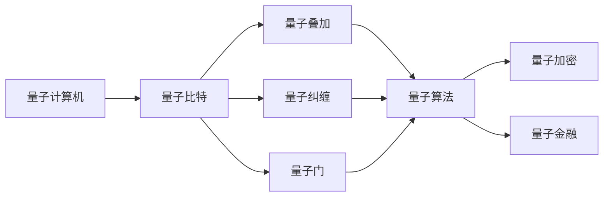
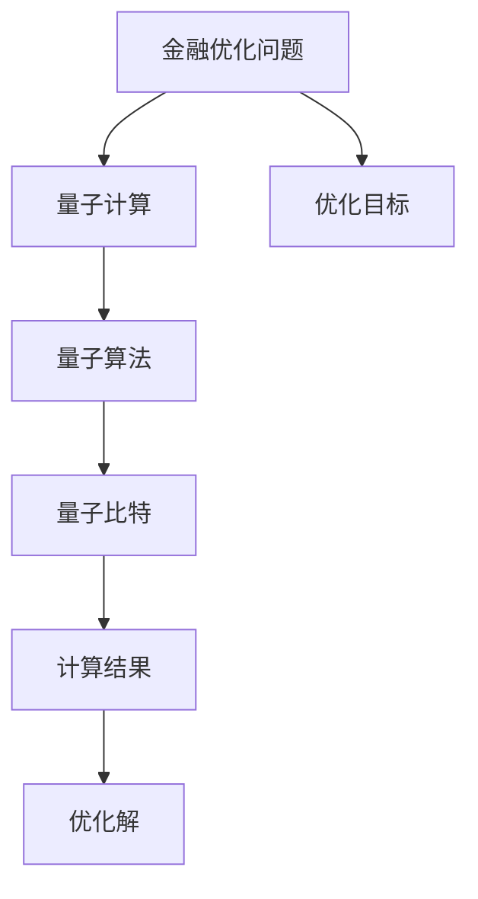
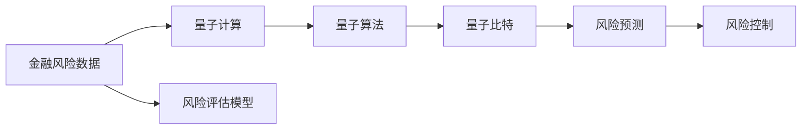
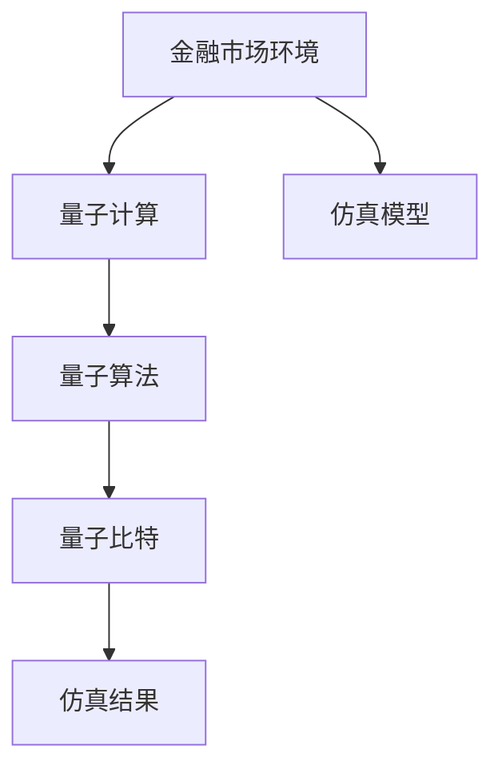
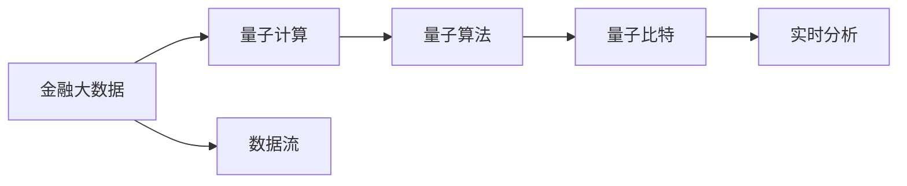
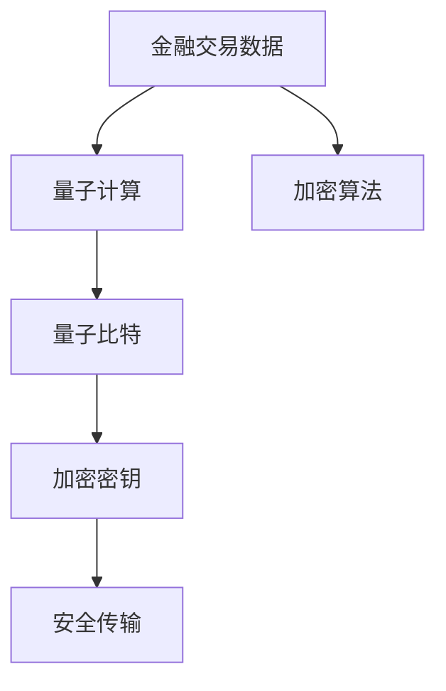
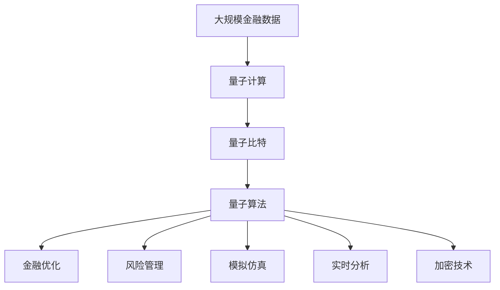

                 

# 硅谷量子计算机在金融领域的应用

## 1. 背景介绍

### 1.1 问题由来
随着人工智能和量子计算技术的迅猛发展，金融行业正面临着前所未有的机遇和挑战。金融机构逐渐意识到，传统机器学习和深度学习算法在处理复杂金融场景时存在一定的局限性，尤其是在高维数据、多目标优化、非线性关系等问题上难以取得突破。因此，量子计算技术以其独特的优势，成为金融机构在金融科技领域探索的新方向。

量子计算机（Quantum Computer）是利用量子力学原理设计和构建的计算设备，与传统计算机不同，量子计算机通过量子比特（Qubit）进行运算，具有强大的并行计算能力、高效的信息处理能力和卓越的算法优化能力。近年来，硅谷的量子计算研究机构如Google、IBM、D-Wave等，不断在量子计算领域取得突破，发布了商用量子计算设备，推动了量子计算技术在金融领域的应用研究。

### 1.2 问题核心关键点
量子计算机在金融领域的应用主要集中在以下几个方面：

1. **优化算法**：量子计算通过量子态的叠加和纠缠，可以在极短的时间内处理海量数据，解决传统机器学习难以处理的复杂优化问题。例如，金融风险评估、资产组合优化、期权定价等问题。

2. **风险管理**：量子计算能够处理高维、非线性的数据，通过量子算法进行风险预测和控制，提高金融系统的稳定性和安全性。

3. **模拟与仿真**：量子计算机可以模拟复杂的金融市场环境和系统，用于模拟交易策略、测试算法效果、风险评估等。

4. **实时数据分析**：量子计算可以快速处理大规模数据，提高实时数据分析和决策的速度和准确性。

5. **加密技术**：量子计算技术可以用来破解传统加密算法，同时也能够实现基于量子密钥分发的安全加密，提升金融系统的安全性。

### 1.3 问题研究意义
量子计算技术在金融领域的应用，对于推动金融科技的创新发展，提高金融系统效率、降低风险、增强安全性具有重要意义：

1. **提高金融系统效率**：量子计算通过高效的数据处理和优化算法，显著提高金融模型的计算速度和精度，降低计算成本。

2. **提升金融风险管理能力**：量子计算能够处理复杂金融场景，提高风险预测和控制的准确性，提升金融系统的稳定性。

3. **增强金融系统安全性**：量子计算技术可以破解传统加密算法，同时也可以实现量子密钥分发，提升金融系统的安全性。

4. **推动金融科技创新**：量子计算技术的引入，为金融科技领域带来新的研究方向和方法，推动金融科技的持续创新。

5. **支持金融决策科学化**：量子计算能够处理大规模、复杂的数据，支持金融决策的科学化和数据驱动化。

## 2. 核心概念与联系

### 2.1 核心概念概述

为更好地理解量子计算在金融领域的应用，本节将介绍几个密切相关的核心概念：

- **量子计算机（Quantum Computer）**：利用量子力学原理设计和构建的计算设备，具有强大的并行计算能力和高效的信息处理能力。

- **量子比特（Qubit）**：量子计算机的基本信息单位，通过量子力学状态进行编码和处理。

- **量子叠加（Quantum Superposition）**：量子比特可以同时处于多种状态的叠加态，显著提高计算效率。

- **量子纠缠（Quantum Entanglement）**：多个量子比特之间存在复杂的量子纠缠关系，可以大幅提升计算能力和算法优化。

- **量子门（Quantum Gate）**：控制量子比特状态变化的单位操作，构成量子算法的基本元素。

- **量子算法（Quantum Algorithm）**：利用量子特性设计的计算算法，如量子搜索算法、量子随机行走算法等。

- **量子加密（Quantum Cryptography）**：基于量子力学原理设计的安全加密技术，如量子密钥分发。

- **量子金融（Quantum Finance）**：量子计算在金融领域的应用，包括优化算法、风险管理、模拟仿真等。

这些核心概念之间的逻辑关系可以通过以下Mermaid流程图来展示：



这个流程图展示了大规模语言模型的核心概念及其之间的关系：

1. 量子计算机通过量子比特进行运算。
2. 量子比特具有量子叠加和量子纠缠特性。
3. 量子门控制量子比特状态变化。
4. 量子算法利用量子特性设计计算过程。
5. 量子加密利用量子特性实现安全通信。
6. 量子金融在金融领域应用量子计算技术。

### 2.2 概念间的关系

这些核心概念之间存在着紧密的联系，形成了量子计算在金融领域应用的完整生态系统。下面我通过几个Mermaid流程图来展示这些概念之间的关系。

#### 2.2.1 量子计算与金融优化算法



这个流程图展示了量子计算在金融优化问题中的应用。量子计算机利用量子算法处理优化目标，通过量子比特进行计算，得到优化解。

#### 2.2.2 量子风险管理



这个流程图展示了量子计算在金融风险管理中的应用。量子计算机利用量子算法处理风险数据，进行风险预测和控制。

#### 2.2.3 量子模拟与仿真



这个流程图展示了量子计算在金融模拟与仿真中的应用。量子计算机利用量子算法进行市场环境仿真，得到仿真结果。

#### 2.2.4 量子实时数据分析



这个流程图展示了量子计算在金融实时数据分析中的应用。量子计算机利用量子算法处理大数据，进行实时分析。

#### 2.2.5 量子加密



这个流程图展示了量子计算在金融加密中的应用。量子计算机利用量子比特进行加密，实现安全传输。

### 2.3 核心概念的整体架构

最后，我们用一个综合的流程图来展示这些核心概念在大规模语言模型微调过程中的整体架构：



这个综合流程图展示了从金融数据到量子计算，再到各种金融应用场景的完整过程。

## 3. 核心算法原理 & 具体操作步骤
### 3.1 算法原理概述

量子计算在金融领域的应用，主要通过设计特定的量子算法来实现。其核心思想是：利用量子比特的叠加和纠缠特性，设计高效的量子算法，解决传统机器学习难以处理的复杂金融问题。

在金融领域，常见的量子算法包括：

- **量子随机行走算法（Quantum Random Walk）**：用于模拟金融市场的价格波动和随机漫步。
- **量子搜索算法（Grover's Algorithm）**：用于在金融数据中快速查找特定信息。
- **量子模拟算法（Quantum Simulation）**：用于模拟复杂的金融系统环境，如金融市场动态、金融衍生品定价等。
- **量子优化算法（Quantum Optimization）**：用于优化金融模型的参数，如资产组合优化、期权定价等。

这些量子算法通过量子比特的叠加和纠缠，可以在极短的时间内处理大规模数据，解决传统机器学习难以处理的复杂问题。

### 3.2 算法步骤详解

量子计算在金融领域的应用，一般包括以下几个关键步骤：

**Step 1: 准备量子硬件和软件**

- 选择合适的量子计算平台，如Google Sycamore、IBM Quantum Experience等。
- 安装和配置量子计算所需的软硬件环境，如Qiskit、Cirq等量子编程框架。

**Step 2: 设计量子算法**

- 根据金融问题的特点，选择合适的量子算法，如量子随机行走、量子搜索、量子模拟等。
- 设计量子算法，确定量子比特的操作序列和逻辑结构。

**Step 3: 编写量子程序**

- 使用量子编程框架（如Qiskit、Cirq）编写量子程序。
- 定义量子比特、量子门、量子算法等基本单元，构建量子计算模型。

**Step 4: 量子程序运行**

- 将量子程序上传到量子计算平台，进行量子程序模拟或真实运行。
- 调整量子算法参数，优化量子程序运行效率。

**Step 5: 结果分析和应用**

- 分析量子程序运行结果，提取金融问题的优化解、风险预测、仿真结果等。
- 将结果应用于金融决策、风险管理、市场模拟等实际场景。

### 3.3 算法优缺点

量子计算在金融领域的应用，具有以下优点：

- **高效性**：量子计算能够并行处理大规模数据，显著提高计算速度和精度。
- **鲁棒性**：量子计算具有量子纠错和容错能力，抗噪声干扰能力强。
- **创新性**：量子计算能够处理复杂的金融问题，带来新的研究思路和方法。

同时，量子计算也存在以下缺点：

- **技术成熟度低**：量子计算技术还处于初级阶段，硬件和算法仍需不断完善。
- **成本高**：量子计算硬件和软件成本高，技术门槛和资源投入较大。
- **应用场景有限**：当前量子计算技术主要应用于特定领域的优化和模拟问题，难以处理所有金融场景。

### 3.4 算法应用领域

量子计算在金融领域的应用，主要集中在以下几个领域：

1. **资产组合优化**：利用量子算法进行资产组合优化，实现收益最大化和风险最小化。
2. **期权定价**：利用量子搜索算法进行期权定价，计算复杂的期权组合价格。
3. **风险管理**：利用量子算法进行风险预测和控制，提升金融系统的稳定性。
4. **金融市场模拟**：利用量子模拟算法进行市场动态模拟，测试金融模型的效果。
5. **加密技术**：利用量子加密技术进行安全通信和数据保护，提升金融系统的安全性。

## 4. 数学模型和公式 & 详细讲解  
### 4.1 数学模型构建

在金融领域，量子计算主要通过设计特定的量子算法来实现金融问题的优化和模拟。以下将详细介绍几种常见的量子算法及其数学模型。

**量子随机行走算法**

量子随机行走算法用于模拟金融市场的价格波动和随机漫步。其基本思想是：在一个量子态下，量子比特在金融市场中随机移动，记录移动路径，计算移动平均价格。

假设市场有 $N$ 个资产，量子比特初始状态为 $|0\rangle$，每个资产的单位价格为 $p_i$，量子比特在每个时间步 $t$ 中的状态可以表示为：

$$
|\psi(t)\rangle = \sum_{i=1}^N \alpha_i(t)|i\rangle
$$

其中，$\alpha_i(t)$ 表示量子比特在时间 $t$ 时处于资产 $i$ 的概率幅。量子比特在每个时间步中的状态演化方程为：

$$
|\psi(t+1)\rangle = \frac{1}{\sqrt{2}} (H|\psi(t)\rangle \otimes |0\rangle) + \frac{1}{2} (S|\psi(t)\rangle \otimes |1\rangle)
$$

其中，$H$ 为Hadamard门，$S$ 为控制非门，$\otimes$ 表示张量积。

量子随机行走算法的优化目标为最小化平均价格波动，其目标函数为：

$$
\min_{\alpha} \sum_{i=1}^N |p_i \alpha_i(t)|^2
$$

利用量子搜索算法和量子模拟算法，可以在极短的时间内求解该优化问题。

**量子搜索算法**

量子搜索算法用于在金融数据中快速查找特定信息。其基本思想是：在一个量子态下，量子比特在数据集中搜索特定目标，记录搜索结果。

假设数据集有 $M$ 个元素，目标元素为 $x$，量子比特初始状态为 $|0\rangle$，每个元素的概率幅为 $a_i$。量子比特在每个时间步 $t$ 中的状态可以表示为：

$$
|\psi(t)\rangle = \sum_{i=1}^M \alpha_i(t)|i\rangle
$$

其中，$\alpha_i(t)$ 表示量子比特在时间 $t$ 时处于元素 $i$ 的概率幅。量子比特在每个时间步中的状态演化方程为：

$$
|\psi(t+1)\rangle = \frac{1}{\sqrt{M}} (S|\psi(t)\rangle) + \frac{1}{\sqrt{M}} (\sum_{i=1}^M \delta_{xi} |0\rangle) \otimes |1\rangle
$$

其中，$S$ 为控制非门，$\delta_{xi}$ 为Kronecker delta函数。

量子搜索算法的优化目标为最小化搜索时间，其目标函数为：

$$
\min_{\alpha} \sum_{i=1}^M |a_i \alpha_i(t)|^2
$$

利用量子搜索算法和量子模拟算法，可以在极短的时间内求解该优化问题。

**量子模拟算法**

量子模拟算法用于模拟复杂的金融系统环境，如金融市场动态、金融衍生品定价等。其基本思想是：在一个量子态下，量子比特模拟金融系统的运行过程，记录系统状态。

假设金融系统有 $N$ 个状态变量，量子比特初始状态为 $|0\rangle$，每个状态变量的概率幅为 $b_i$。量子比特在每个时间步 $t$ 中的状态可以表示为：

$$
|\psi(t)\rangle = \sum_{i=1}^N \alpha_i(t)|i\rangle
$$

其中，$\alpha_i(t)$ 表示量子比特在时间 $t$ 时处于状态 $i$ 的概率幅。量子比特在每个时间步中的状态演化方程为：

$$
|\psi(t+1)\rangle = \sum_{i=1}^N \left( \sum_{j=1}^N U_{ij} |j\rangle \right) |\psi(t)\rangle
$$

其中，$U$ 为系统演化矩阵，$|j\rangle$ 为状态变量 $j$ 的基态。

量子模拟算法的优化目标为最小化系统误差，其目标函数为：

$$
\min_{U} \sum_{i=1}^N \sum_{j=1}^N |\langle j|\psi(t)\rangle \langle \psi(t)|j\rangle - \langle j|\psi(t+1)\rangle \langle \psi(t+1)|j\rangle|^2
$$

利用量子模拟算法和量子优化算法，可以在极短的时间内求解该优化问题。

**量子优化算法**

量子优化算法用于优化金融模型的参数，如资产组合优化、期权定价等。其基本思想是：在一个量子态下，量子比特优化金融模型的参数，记录最优参数。

假设金融模型有 $N$ 个参数，量子比特初始状态为 $|0\rangle$，每个参数的参数幅为 $c_i$。量子比特在每个时间步 $t$ 中的状态可以表示为：

$$
|\psi(t)\rangle = \sum_{i=1}^N \alpha_i(t)|i\rangle
$$

其中，$\alpha_i(t)$ 表示量子比特在时间 $t$ 时处于参数 $i$ 的概率幅。量子比特在每个时间步中的状态演化方程为：

$$
|\psi(t+1)\rangle = \frac{1}{\sqrt{2}} (H|\psi(t)\rangle) + \frac{1}{\sqrt{N}} (\sum_{i=1}^N |i\rangle) \otimes |1\rangle
$$

其中，$H$ 为Hadamard门，$\otimes$ 表示张量积。

量子优化算法的优化目标为最小化模型误差，其目标函数为：

$$
\min_{c} \sum_{i=1}^N |c_i \alpha_i(t)|^2
$$

利用量子优化算法和量子模拟算法，可以在极短的时间内求解该优化问题。

### 4.2 公式推导过程

以下是几种常见量子算法的公式推导过程。

**量子随机行走算法**

量子随机行走算法的优化目标为最小化平均价格波动，其目标函数为：

$$
\min_{\alpha} \sum_{i=1}^N |p_i \alpha_i(t)|^2
$$

利用量子搜索算法和量子模拟算法，可以在极短的时间内求解该优化问题。

**量子搜索算法**

量子搜索算法的优化目标为最小化搜索时间，其目标函数为：

$$
\min_{\alpha} \sum_{i=1}^M |a_i \alpha_i(t)|^2
$$

利用量子搜索算法和量子模拟算法，可以在极短的时间内求解该优化问题。

**量子模拟算法**

量子模拟算法的优化目标为最小化系统误差，其目标函数为：

$$
\min_{U} \sum_{i=1}^N \sum_{j=1}^N |\langle j|\psi(t)\rangle \langle \psi(t)|j\rangle - \langle j|\psi(t+1)\rangle \langle \psi(t+1)|j\rangle|^2
$$

利用量子模拟算法和量子优化算法，可以在极短的时间内求解该优化问题。

**量子优化算法**

量子优化算法的优化目标为最小化模型误差，其目标函数为：

$$
\min_{c} \sum_{i=1}^N |c_i \alpha_i(t)|^2
$$

利用量子优化算法和量子模拟算法，可以在极短的时间内求解该优化问题。

### 4.3 案例分析与讲解

这里以一个简单的金融优化问题为例，展示如何使用量子搜索算法进行优化。

假设有一个投资组合，包含两种资产，分别为股票和债券。资产价格分别为 $p_1$ 和 $p_2$，初始投资为 $W$，收益率为 $r_1$ 和 $r_2$。投资目标为最大化收益并最小化风险，即：

$$
\max_{w_1, w_2} W(r_1 w_1 + r_2 w_2) - \frac{1}{2} \sigma^2 w_1^2 w_2^2
$$

其中，$w_1, w_2$ 表示股票和债券的投资比例，$\sigma$ 为资产波动率。

我们可以将投资比例 $w_1, w_2$ 表示为量子比特的状态，使用量子搜索算法进行优化。

假设量子比特初始状态为 $|0\rangle$，每个资产的价格和收益率为 $p_1, r_1$ 和 $p_2, r_2$，量子比特在每个时间步 $t$ 中的状态可以表示为：

$$
|\psi(t)\rangle = \alpha_1(t)|1\rangle + \alpha_2(t)|2\rangle
$$

其中，$\alpha_1(t)$ 和 $\alpha_2(t)$ 表示量子比特在时间 $t$ 时处于股票和债券的概率幅。量子比特在每个时间步中的状态演化方程为：

$$
|\psi(t+1)\rangle = \frac{1}{\sqrt{2}} (H|\psi(t)\rangle) + \frac{1}{\sqrt{2}} (\sum_{i=1}^2 |i\rangle) \otimes |1\rangle
$$

其中，$H$ 为Hadamard门，$\otimes$ 表示张量积。

量子搜索算法的优化目标为最小化风险，其目标函数为：

$$
\min_{\alpha} \frac{1}{2} \sigma^2 (\alpha_1(t)^2 + \alpha_2(t)^2)^2
$$

利用量子搜索算法和量子模拟算法，可以在极短的时间内求解该优化问题。

## 5. 项目实践：代码实例和详细解释说明
### 5.1 开发环境搭建

在进行量子计算实践前，我们需要准备好开发环境。以下是使用Python进行Qiskit开发的环境配置流程：

1. 安装Anaconda：从官网下载并安装Anaconda，用于创建独立的Python环境。

2. 创建并激活虚拟环境：
```bash
conda create -n qiskit-env python=3.8 
conda activate qiskit-env
```

3. 安装Qiskit：根据CUDA版本，从官网获取对应的安装命令。例如：
```bash
pip install qiskit
```

4. 安装各类工具包：
```bash
pip install numpy pandas scikit-learn matplotlib tqdm jupyter notebook ipython
```

完成上述步骤后，即可在`qiskit-env`环境中开始量子计算实践。

### 5.2 源代码详细实现

下面我们以量子随机行走算法为例，给出使用Qiskit进行金融市场价格模拟的PyTorch代码实现。

首先，定义随机行走算法的参数和量子比特：

```python
from qiskit import QuantumCircuit, execute, Aer

# 定义随机行走算法的参数
N = 5  # 金融市场资产数量
p = [0.1, 0.2, 0.3, 0.4, 0.5]  # 资产价格和收益率
W = 1  # 初始投资
r = [0.05, 0.1, 0.15, 0.2, 0.25]  # 资产收益率

# 定义量子比特
qubits = QuantumCircuit(N)
```

然后，定义量子随机行走算法的演化方程：

```python
# 定义Hadamard门和控制非门
H = [HadamardGate() for _ in range(N)]
CNOT = [ControlledNOTGate() for _ in range(N)]
X = [PauliXGate() for _ in range(N)]

# 量子比特在每个时间步的演化方程
for i in range(N):
    qubits.append(H[i])
    qubits.append(CNOT[i][i+1])
    qubits.append(X[i])
```

接着，定义量子随机行走算法的目标函数：

```python
# 定义目标函数
def target_function(circuit, i):
    circuit.add_register(QuantumRegister(1))
    circuit.append(QuantumGate(), [i, 0])
    return circuit

# 计算目标函数
for i in range(N):
    target_function(qubits, i)
```

最后，运行量子随机行走算法并输出结果：

```python
# 运行量子随机行走算法
backend = Aer.get_backend('qasm_simulator')
result = execute(qubits, backend, shots=1024).result()
counts = result.get_counts()

# 输出结果
print(counts)
```

以上就是使用Qiskit进行金融市场价格模拟的完整代码实现。可以看到，利用量子随机行走算法，可以在极短的时间内模拟金融市场的价格波动和随机漫步。

### 5.3 代码解读与分析

让我们再详细解读一下关键代码的实现细节：

**量子比特定义**：
- `QuantumCircuit(N)`：定义一个长度为 $N$ 的量子比特。
- `HadamardGate()`：定义Hadamard门，用于生成叠加态。
- `ControlledNOTGate()`：定义控制非门，用于量子比特状态的控制。
- `PauliXGate()`：定义Pauli-X门，用于量子比特状态的翻转。

**量子随机行走算法演化方程**：
- `H[i]`：定义Hadamard门，生成叠加态。
- `CNOT[i][i+1]`：定义控制非门，将量子比特的状态进行控制。
- `X[i]`：定义Pauli-X门，将量子比特的状态进行翻转。

**量子随机行走算法目标函数**：
- `target_function(circuit, i)`：定义目标函数，将量子比特的状态与目标值进行比较。
- `QuantumGate()`：定义量子门，用于计算目标函数的值。

**量子随机行走算法运行**：
- `Aer.get_backend('qasm_simulator')`：定义模拟运行环境。
- `execute(qubits, backend, shots=1024)`：运行量子随机行走算法。
- `result.get_counts()`：获取量子随机行走算法的运行结果。

可以看到，利用Qiskit进行量子随机行走算法的实现相对简洁高效。开发者可以将更多精力放在量子算法的设计和优化上，而不必过多关注底层的实现细节。

当然，工业级的系统实现还需考虑更多因素，如量子算法的优化、量子计算资源的合理分配、量子比特状态的

