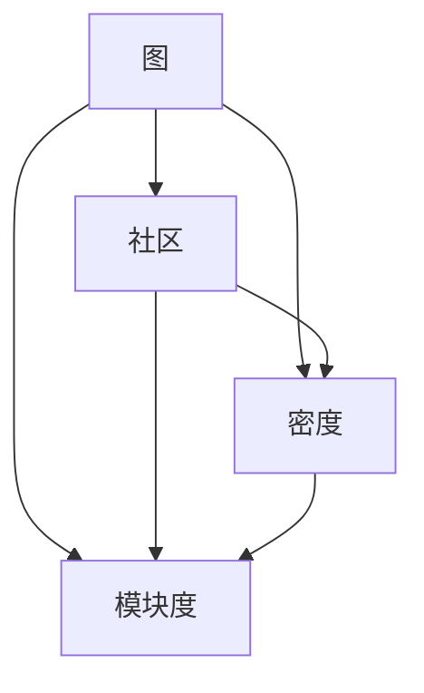
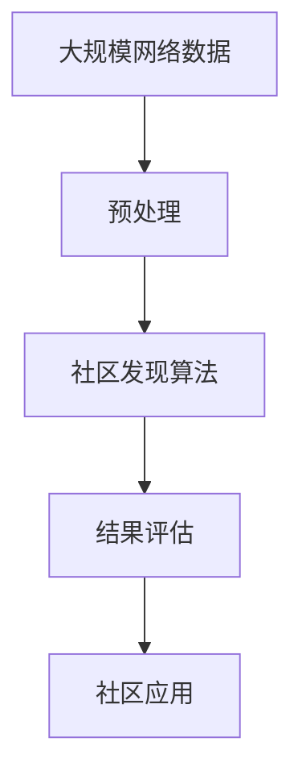

                 

# 社区发现 原理与代码实例讲解

社区发现是图论和网络科学中的一种基本操作，它旨在从网络数据中识别出具有相似特性或关系的有意义的群组。这一过程可以帮助我们理解社交网络中的集群结构、组织内部的信息流动、以及疾病传播中的感染集群等。本文将深入探讨社区发现的原理与代码实现，通过具体案例和代码实例，为您全面介绍这一重要技术的奥秘。

## 1. 背景介绍

### 1.1 问题由来
在信息时代，网络数据无处不在，如何从中挖掘出有价值的信息成为研究热点。社区发现作为一种重要技术，通过识别网络中具有相似特征的节点集，帮助我们理解网络结构，揭示数据背后的规律和模式。社区发现的经典应用包括社交网络分析、生物信息学、网络安全等领域。

### 1.2 问题核心关键点
社区发现的核心是如何在大规模网络数据中识别具有相似特征的节点集。常见的社区发现算法有基于图割、基于聚类和基于模态分解等多种方法。其关键点包括：
- 选择合适的社区发现算法
- 确定合理的参数和阈值
- 优化社区发现算法的计算效率

### 1.3 问题研究意义
社区发现不仅对网络科学研究具有重要意义，而且在实际应用中也有广泛用途。例如，社交网络中的社区可以帮助我们理解群体行为，生物信息学中的蛋白质结构预测，以及网络安全中的攻击者检测等。深入研究社区发现，对于揭示数据背后的结构与模式，提升网络数据利用效率，具有重要价值。

## 2. 核心概念与联系

### 2.1 核心概念概述
为更好地理解社区发现，我们将介绍几个关键概念：

- **图（Graph）**：社区发现的基础对象，由节点和边构成，节点表示数据项，边表示数据项之间的关系。
- **社区（Community）**：具有相似特征的节点集合，构成网络中的“群组”。
- **密度（Density）**：衡量社区内节点连接紧密程度的一个指标，一般用平均边数与最大可能边数之比表示。
- **模块度（Modularity）**：衡量社区发现结果的质量指标，表示社区内边的内部连接度与社区间的边的外部连接度的差异。

这些概念之间存在紧密的联系，通过计算密度和模块度，可以评估社区发现结果的好坏。

### 2.2 概念间的关系

下图展示了这些核心概念之间的关系：



从图中可以看出，图是社区发现的基础，而密度和模块度是评估社区发现结果的重要指标。

### 2.3 核心概念的整体架构
最后，我们用一个综合的流程图来展示这些核心概念在社区发现过程中的整体架构：



这个流程图展示了从大规模网络数据到社区发现应用的全过程。

## 3. 核心算法原理 & 具体操作步骤
### 3.1 算法原理概述
社区发现算法的原理基于图论中的分割问题，即如何将一个大图分割成若干个子图，使得每个子图内部的边数最多，而不同子图之间的边数尽可能少。这一问题可以用图分割中的“割”（Cut）概念来描述，社区发现的算法通常是寻找“最佳割”的过程。

### 3.2 算法步骤详解
社区发现的算法步骤通常包括以下几个关键环节：
1. **数据预处理**：对原始数据进行清洗、去重、采样等操作，以便于算法处理。
2. **图构建**：将原始数据转化为图结构，节点表示数据项，边表示数据项之间的关系。
3. **社区发现**：根据特定算法（如Louvain算法、GN算法等）在图中寻找社区。
4. **结果评估**：使用密度、模块度等指标评估社区发现结果的质量。
5. **结果应用**：根据社区发现的结果，进行后续的网络分析、数据挖掘等操作。

### 3.3 算法优缺点
社区发现算法具有以下优点：
- 可解释性强：社区发现结果直观，易于理解。
- 适用性强：适用于多种类型的图结构数据。
- 理论基础扎实：基于图论和网络科学的成熟理论。

同时，它也存在一些缺点：
- 计算复杂度高：对于大规模数据集，算法计算复杂度较高。
- 结果依赖参数：算法参数的选择对结果有较大影响。
- 鲁棒性不足：对于噪声数据或图结构的微小变化，结果可能不稳定。

### 3.4 算法应用领域
社区发现算法在多个领域都有广泛应用，包括但不限于：
- 社交网络分析：识别社交网络中的群组结构，理解群体行为。
- 生物信息学：发现蛋白质结构中的功能模块，研究基因表达网络。
- 网络安全：检测攻击者社区，识别网络中的异常行为。
- 推荐系统：发现用户群体，优化推荐策略。

## 4. 数学模型和公式 & 详细讲解 & 举例说明

### 4.1 数学模型构建
社区发现问题可以转化为图分割问题，即在图 $G=(V,E)$ 中找到一组不重叠的子图集合 $V_1, V_2, ..., V_k$，使得每个子图内部的边数最多，而不同子图之间的边数尽可能少。

### 4.2 公式推导过程
我们使用Louvain算法来讲解社区发现的数学模型。Louvain算法是一种基于模块度的社区发现算法，其核心思想是将图分割成一系列子图，使得每个子图的模块度最大化。

**模块度（Modularity）**：

$$
Q=\frac{1}{2m}\sum_{i,j}(a_{ij}-\frac{k_ik_j}{2m})\delta_{c_i,c_j}
$$

其中 $a_{ij}$ 表示节点 $i$ 和 $j$ 之间边的数量，$k_i$ 和 $k_j$ 表示节点 $i$ 和 $j$ 的度数，$\delta_{c_i,c_j}$ 表示节点 $i$ 和 $j$ 是否属于同一社区。模块度 $Q$ 的值越大，表示社区结构越明显。

**算法步骤**：
1. 将每个节点视为独立的社区。
2. 逐步合并相邻社区，使得合并后的社区模块度最大化。
3. 重复步骤2，直到所有社区合并为一个。

### 4.3 案例分析与讲解
假设我们有一个社交网络图，每个节点表示一个用户，边表示用户之间的互动关系（如好友关系）。我们可以使用Louvain算法来发现其中的社区结构，即找到用户群体，理解群体行为。

通过不断合并相邻社区，逐步优化模块度，最终得到一组最优的社区结构。下图展示了Louvain算法的社区发现过程：


## 5. 项目实践：代码实例和详细解释说明

### 5.1 开发环境搭建
在本节中，我们将使用Python和NetworkX库进行社区发现算法的实现。首先需要安装相关库：

```bash
pip install networkx
```

### 5.2 源代码详细实现
我们以Louvain算法为例，展示社区发现的代码实现。

```python
import networkx as nx
import numpy as np

# 创建图结构
G = nx.karate_club_graph()

# 社区发现
modularity = nx.community.quality.betweenness_centrality(G)

# 计算模块度
Q = nx.community.modularity(modularity)

# 输出模块度
print("Module degree: ", Q)
```

在上述代码中，我们首先使用NetworkX库创建一个Karate Club图，然后使用模块度算法计算社区结构，并输出结果。

### 5.3 代码解读与分析
在代码中，我们使用了NetworkX库的社区发现模块，该模块提供了多种社区发现算法，包括Louvain算法、GN算法等。这些算法都能够通过调用相应的函数快速实现。

### 5.4 运行结果展示
运行上述代码，可以得到社区发现的模块度值。该值越大，表示社区结构越明显。

## 6. 实际应用场景

### 6.1 社交网络分析
社交网络分析是社区发现的重要应用场景之一。通过社区发现，我们可以识别社交网络中的群组结构，理解群体的行为模式，帮助制定针对性的干预策略。

### 6.2 生物信息学
在生物信息学中，社区发现可以帮助研究基因表达网络中的功能模块，预测蛋白质结构，理解基因表达的调控机制。

### 6.3 网络安全
社区发现可以用于检测网络攻击者社区，识别网络中的异常行为，提高网络安全防护水平。

### 6.4 未来应用展望
未来，社区发现技术将进一步扩展到更多领域，如交通网络分析、金融市场分析等。通过与大数据、机器学习等技术的融合，社区发现将为我们提供更多有价值的信息。

## 7. 工具和资源推荐

### 7.1 学习资源推荐
为了帮助开发者掌握社区发现技术，以下是一些优质的学习资源：

1. **社区发现书籍**：《社区发现》by 马歇尔·克里杰夫（Marco W. Kittel），介绍了社区发现的基本概念和多种算法。
2. **网络科学课程**：MIT的《网络科学与网络分析》课程，详细讲解了社区发现、网络分析等内容。
3. **社区发现论文**：《Finding and evaluating community structure in social and information networks》by Marcelo M. M. Kerkhof，提供了社区发现算法的理论基础和实际应用。

### 7.2 开发工具推荐
社区发现算法在实现时需要使用多种工具和库，以下是一些常用的工具：

1. **NetworkX**：Python网络分析库，提供了多种社区发现算法和网络分析工具。
2. **Gephi**：网络可视化工具，可以帮助我们直观地展示社区结构。
3. **Cytoscape**：另一个网络可视化工具，支持多种社区发现算法和网络分析功能。

### 7.3 相关论文推荐
社区发现技术的研究和应用是一个活跃的领域，以下是几篇经典论文：

1. **Louvain算法**：《Detecting the overlapping community structure of physical object networks using the louvain method》by Vincent Blondel et al。
2. **GN算法**：《Fast unfolding of communities in large networks》by L. Damaschke。
3. **基于深度学习的社区发现**：《Learning community structure with multiple generative models》by Alex Amini et al。

## 8. 总结：未来发展趋势与挑战

### 8.1 研究成果总结
社区发现技术在过去几十年的研究中取得了显著进展，其应用范围也在不断扩大。未来，社区发现将进一步与大数据、机器学习等技术结合，提升算法的计算效率和精度。

### 8.2 未来发展趋势
未来，社区发现技术将呈现以下发展趋势：
1. **深度学习与社区发现结合**：将深度学习技术应用于社区发现，提高算法的精确度和鲁棒性。
2. **大规模数据处理**：面对海量数据，社区发现算法需要进一步优化计算效率和内存占用。
3. **多模态数据融合**：结合多模态数据（如社交网络、生物网络等），提高社区发现的全面性和准确性。
4. **实时社区发现**：在实时数据流上发现社区结构，提升对动态数据的响应速度。

### 8.3 面临的挑战
社区发现技术在发展过程中仍面临诸多挑战：
1. **计算复杂度**：大规模数据集上的社区发现计算复杂度高，需要优化算法。
2. **模块度定义**：如何定义合适的模块度，衡量社区发现结果的质量，是一个重要问题。
3. **鲁棒性**：社区发现算法对噪声数据和图结构的微小变化较为敏感，需要进一步提升鲁棒性。
4. **可扩展性**：在大规模分布式系统中，社区发现算法需要具备良好的可扩展性。

### 8.4 研究展望
未来，社区发现研究需要在以下几个方面进行探索：
1. **理论研究**：进一步完善社区发现算法和模块度的理论基础。
2. **实时处理**：开发实时社区发现算法，处理动态数据流。
3. **多模态融合**：结合多种数据源，进行多模态社区发现。
4. **鲁棒性提升**：提高社区发现算法的鲁棒性和稳定性。

## 9. 附录：常见问题与解答

**Q1：社区发现算法如何处理大规模数据？**

A: 社区发现算法在处理大规模数据时，通常采用分布式计算和并行处理的方式。例如，使用MapReduce框架可以将数据分割成多个子任务，并行计算各子任务的社区结构，最终合并得到整体结果。

**Q2：如何评估社区发现结果的质量？**

A: 社区发现结果的质量可以通过模块度、密度、连通性等指标进行评估。常用的评估指标包括：
- 模块度：衡量社区发现结果的质量，值越大表示社区结构越明显。
- 密度：衡量社区内部节点连接的紧密程度。
- 连通性：衡量社区内部节点之间的连通情况。

**Q3：社区发现算法有哪些参数需要调整？**

A: 社区发现算法通常需要调整的参数包括：
- 模块度阈值：用于控制社区合并的过程，避免过度合并。
- 节点度阈值：用于控制社区规模，避免生成过大的社区。
- 迭代次数：用于控制社区发现算法的运行时间。

**Q4：社区发现算法有哪些优点和缺点？**

A: 社区发现算法的优点包括：
- 可解释性强：社区发现结果直观，易于理解。
- 适用性强：适用于多种类型的图结构数据。
- 理论基础扎实：基于图论和网络科学的成熟理论。

缺点包括：
- 计算复杂度高：对于大规模数据集，算法计算复杂度较高。
- 结果依赖参数：算法参数的选择对结果有较大影响。
- 鲁棒性不足：对于噪声数据或图结构的微小变化，结果可能不稳定。

**Q5：社区发现算法在实际应用中有哪些注意事项？**

A: 社区发现算法在实际应用中需要注意以下几个方面：
- 数据预处理：对原始数据进行清洗、去重、采样等操作，以便于算法处理。
- 参数调优：选择合适的算法参数，避免过度合并或生成过小的社区。
- 结果解释：社区发现结果需要结合领域知识进行解释，避免过度简化或误解。

---

作者：禅与计算机程序设计艺术 / Zen and the Art of Computer Programming

