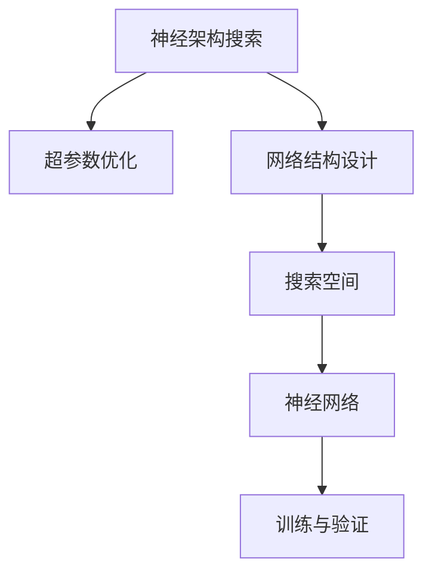
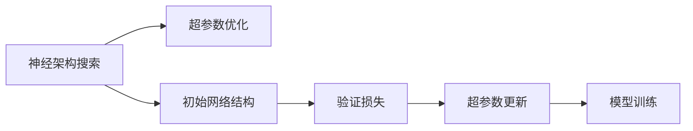
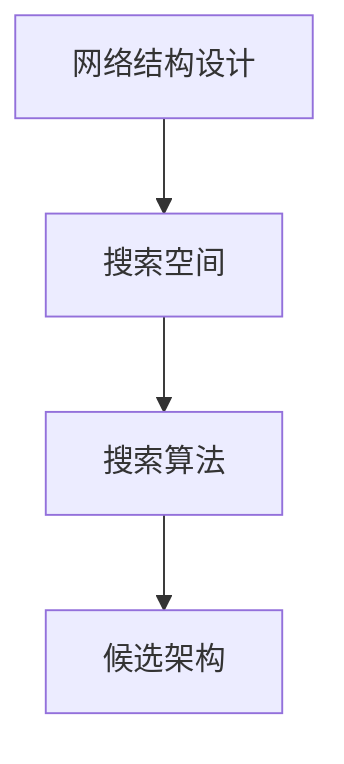
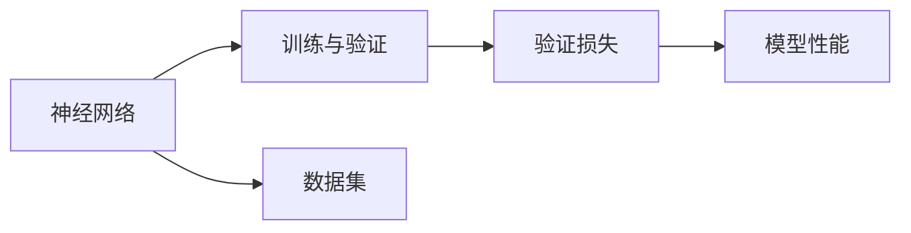

                 

# 神经架构搜索（NAS）的基本原理与方法论

> 关键词：神经架构搜索,网络结构设计,自动化搜索,超参数优化,深度学习

## 1. 背景介绍

### 1.1 问题由来
在深度学习中，一个复杂网络的架构设计通常是非常耗时的。传统的深度学习研究通常需要通过反复试验来确定网络的结构和超参数，这需要大量的工程实践和经验积累。然而，随着深度学习模型的规模不断增大，设计复杂的神经网络架构变得极其困难，增加了模型训练和调试的成本，也限制了深度学习在实际应用中的普及。

### 1.2 问题核心关键点
为了解决这个问题，研究者们提出了神经架构搜索（NAS）方法，它通过自动化的搜索过程，探索高效的神经网络架构，从而大大减少了网络设计的时间和成本。NAS的目标是通过搜索算法，自动生成能够最优化的网络结构，使得模型能够高效、准确地解决实际问题。

### 1.3 问题研究意义
研究NAS方法，对于加速深度学习模型设计，提高模型训练效率，推动深度学习技术的普及和应用，具有重要意义：

1. 节省设计时间：通过自动化搜索，无需大量手工调试，加速模型设计进程。
2. 提升模型性能：通过优化网络结构，能够提升模型的准确率和泛化能力。
3. 降低实验成本：减少了人力和物力投入，降低模型调试和验证的成本。
4. 增强模型泛化：自动生成的结构可以更好地适应不同类型和规模的问题。
5. 推动应用落地：降低了模型设计门槛，加速了深度学习技术在各行各业中的应用。

## 2. 核心概念与联系

### 2.1 核心概念概述

为更好地理解NAS方法，本节将介绍几个密切相关的核心概念：

- 神经架构搜索（NAS）：通过自动化的搜索过程，寻找最优的神经网络架构的方法。
- 超参数优化（Hyperparameter Optimization, HPO）：优化模型中的非参数化参数，如学习率、批大小等，以提高模型性能。
- 网络结构设计：设计神经网络的不同层次和组件，如卷积层、池化层、全连接层等。
- 搜索空间（Search Space）：定义网络结构搜索的可行空间，包括不同深度、宽度和类型的层。
- 神经网络（Neural Network, NN）：由一系列层和节点组成，通过前向传播和反向传播训练得到。

这些核心概念之间的逻辑关系可以通过以下Mermaid流程图来展示：



这个流程图展示了NAS方法的各个关键环节，从网络结构设计开始，通过搜索空间找到最优的架构，接着进行超参数优化和模型训练与验证，最终得到性能最佳的网络。

### 2.2 概念间的关系

这些核心概念之间存在着紧密的联系，形成了NAS方法的整体生态系统。下面我通过几个Mermaid流程图来展示这些概念之间的关系。

#### 2.2.1 神经架构搜索与超参数优化


这个流程图展示了NAS与HPO的相互关系。初始网络结构通过搜索得到，接着进行超参数优化，验证损失，更新超参数，最后进行模型训练。

#### 2.2.2 网络结构设计与搜索空间


这个流程图展示了网络结构设计与搜索空间的关系。首先设计网络结构，然后定义搜索空间，最后使用搜索算法找到最优的网络架构。

#### 2.2.3 神经网络与训练验证


这个流程图展示了神经网络与训练验证的关系。首先定义神经网络，然后对数据集进行训练和验证，最后评估模型性能。

## 3. 核心算法原理 & 具体操作步骤
### 3.1 算法原理概述

神经架构搜索的基本原理是通过搜索算法，在定义好的搜索空间中寻找最优的网络架构。搜索算法会根据一定的目标函数（通常是模型在验证集上的性能），对网络结构和超参数进行优化，最终找到最优的网络架构。

形式化地，假设搜索空间为 $S$，目标函数为 $f$，搜索算法为 $\mathcal{A}$，则NAS的目标是找到 $S$ 中的最优结构 $S^*$，使得 $f(S^*) = \min_{S \in S} f(S)$。

通常，NAS算法需要考虑以下几个关键步骤：
- 定义搜索空间 $S$，包括不同深度、宽度、类型的层。
- 设计搜索算法 $\mathcal{A}$，如贝叶斯优化、随机搜索、遗传算法等。
- 设计目标函数 $f$，如交叉验证损失、验证集精度等。
- 选择优化器 $\mathcal{O}$，如梯度下降、遗传算法等。

### 3.2 算法步骤详解

神经架构搜索通常包括以下几个关键步骤：

**Step 1: 定义搜索空间**
- 定义网络层的深度、宽度、类型等搜索维度。
- 确定搜索空间的大小和规模，避免搜索空间过大导致计算复杂度增加。
- 采用分层搜索、规则搜索等方法，减少搜索空间维度。

**Step 2: 设计搜索算法**
- 选择合适的搜索算法，如贝叶斯优化、遗传算法、蒙特卡洛树搜索等。
- 设计搜索算法的参数和超参数，如初始解、种群大小、迭代次数等。

**Step 3: 设计目标函数**
- 根据任务定义目标函数，如交叉验证损失、验证集精度等。
- 设计多目标函数，考虑模型准确率和计算效率等因素。

**Step 4: 选择优化器**
- 选择合适的优化器，如梯度下降、遗传算法等。
- 设计优化器的参数和超参数，如学习率、迭代次数等。

**Step 5: 执行搜索算法**
- 使用搜索算法对搜索空间进行搜索。
- 根据目标函数对候选架构进行评估和筛选。
- 迭代搜索算法，逐步优化网络结构。

**Step 6: 评估和验证**
- 在验证集上评估模型的性能。
- 根据评估结果选择最优的架构。
- 对最优架构进行训练和验证，确认模型性能。

### 3.3 算法优缺点

神经架构搜索方法具有以下优点：
1. 节省时间：自动化搜索可以大幅减少设计网络结构的时间。
2. 提升性能：自动搜索可以发现更优的网络架构，提高模型性能。
3. 降低成本：减少了大量手工调试和实验投入。
4. 提高泛化能力：自动生成的网络结构可以更好地适应不同类型的任务。

同时，该方法也存在一些缺点：
1. 计算复杂度高：搜索空间较大时，计算复杂度会增加。
2. 时间成本高：搜索过程可能需要大量计算资源。
3. 无法覆盖所有架构：搜索算法可能无法找到最优或次优架构。
4. 可解释性不足：自动生成的网络结构可能难以解释。

尽管存在这些局限性，但就目前而言，神经架构搜索方法仍然是大规模网络设计的重要工具。未来相关研究的重点在于如何进一步降低搜索时间、提高搜索效率，同时保证搜索质量。

### 3.4 算法应用领域

神经架构搜索方法已经在多个领域得到了广泛应用，例如：

- 计算机视觉：用于设计卷积神经网络（CNN）的结构，如图像分类、物体检测等。
- 自然语言处理（NLP）：用于设计循环神经网络（RNN）、Transformer等模型，如文本分类、机器翻译等。
- 语音识别：用于设计深度神经网络（DNN）的结构，如语音识别、自动语音识别等。
- 推荐系统：用于设计推荐算法的网络结构，如协同过滤、深度学习推荐系统等。

除了上述这些经典领域，神经架构搜索方法还被创新性地应用到更多场景中，如医疗影像分析、智能制造、智能交通等，为人工智能技术的落地应用提供了新的思路。

## 4. 数学模型和公式 & 详细讲解 & 举例说明（备注：数学公式请使用latex格式，latex嵌入文中独立段落使用 $$，段落内使用 $)
### 4.1 数学模型构建

神经架构搜索的数学模型通常基于搜索空间和目标函数构建。假设搜索空间为 $S$，目标函数为 $f$，目标是最小化 $f$ 以找到最优结构。

数学模型构建可以表示为：
$$
\min_{S \in S} f(S)
$$

目标函数 $f$ 可以是多种形式，如交叉验证损失、验证集精度等。

### 4.2 公式推导过程

以交叉验证损失为目标函数的NAS为例，推导其数学模型和公式。

假设训练数据集为 $D$，验证集为 $V$，目标函数为 $f$，则神经网络在验证集上的损失函数可以表示为：
$$
f(S) = \frac{1}{|V|} \sum_{(x,y) \in V} L(\hat{y}, y)
$$

其中 $L(\hat{y}, y)$ 为损失函数，$\hat{y}$ 为模型在验证集上的预测结果，$y$ 为真实标签。

目标函数 $f$ 的最小化过程可以表示为：
$$
\min_{S \in S} f(S)
$$

其中 $S$ 为神经网络的结构，包括层数、神经元个数、激活函数等。

### 4.3 案例分析与讲解

以贝叶斯优化算法为例，说明其在神经架构搜索中的应用。

贝叶斯优化算法是一种常用的搜索算法，通过建模搜索空间中各结构的概率分布，逐步优化搜索策略。其核心思想是通过已有的样本点来估计搜索空间中各结构的目标函数值，然后选择最有可能的样本进行下一步搜索。

贝叶斯优化算法的具体步骤如下：

1. 初始化：选择一定数量的随机解作为初始解集，如 $S_0$。
2. 选择：根据当前解集中的样本点，估计搜索空间中各结构的目标函数值。
3. 更新：选择最有可能的结构进行下一轮搜索，如选择目标函数值最高的结构。
4. 迭代：重复步骤 2 和步骤 3，直到达到预设的迭代次数或目标函数值收敛。

贝叶斯优化算法的数学模型可以表示为：
$$
\min_{S \in S} f(S)
$$

其中 $S$ 为神经网络的结构，$f(S)$ 为目标函数。

## 5. 项目实践：代码实例和详细解释说明
### 5.1 开发环境搭建

在进行神经架构搜索的实践前，我们需要准备好开发环境。以下是使用Python进行PyTorch开发的环境配置流程：

1. 安装Anaconda：从官网下载并安装Anaconda，用于创建独立的Python环境。

2. 创建并激活虚拟环境：
```bash
conda create -n pytorch-env python=3.8 
conda activate pytorch-env
```

3. 安装PyTorch：根据CUDA版本，从官网获取对应的安装命令。例如：
```bash
conda install pytorch torchvision torchaudio cudatoolkit=11.1 -c pytorch -c conda-forge
```

4. 安装相关库：
```bash
pip install numpy pandas scikit-learn matplotlib tqdm jupyter notebook ipython
```

5. 安装NAS相关库：
```bash
pip install nasbench-py
```

完成上述步骤后，即可在`pytorch-env`环境中开始神经架构搜索的实践。

### 5.2 源代码详细实现

下面我们以NAS-Bench-201数据集为例，给出使用NAS-Bench-201进行神经网络架构搜索的PyTorch代码实现。

首先，定义NAS-Bench-201数据集：

```python
from nasbench importNASBench201

dataset = NASBench201()
train_loader = torch.utils.data.DataLoader(dataset, batch_size=32, shuffle=True)
```

然后，定义搜索空间和优化器：

```python
from torch import nn
from torch.nn import functional as F

# 定义搜索空间
def search_space(sample):
    h, w, out = sample
    return nn.Sequential(
        nn.Conv2d(h, 64, kernel_size=3, stride=1, padding=1),
        nn.ReLU(),
        nn.MaxPool2d(kernel_size=2, stride=2),
        nn.Conv2d(64, w, kernel_size=3, stride=1, padding=1),
        nn.ReLU(),
        nn.MaxPool2d(kernel_size=2, stride=2),
        nn.Conv2d(w, out, kernel_size=3, stride=1, padding=1),
        nn.ReLU(),
        nn.AvgPool2d(kernel_size=2, stride=2),
        nn.Flatten(),
        nn.Linear(2048, 10)
    )

# 定义优化器
optimizer = AdamW(search_space.parameters(), lr=1e-4)
```

接着，定义搜索算法：

```python
from nasbench importNASBench201
from torch import nn
from torch.nn import functional as F
from torch import optim
from torch.utils.data import DataLoader
from torchvision import datasets, transforms
from tqdm import tqdm
from nasbench importNASBench201
from nasbench importNASBench201
from torch import nn
from torch.nn import functional as F

# 定义搜索算法
class NAS(torch.nn.Module):
    def __init__(self, search_space):
        super(NAS, self).__init__()
        self.search_space = search_space
        
    def forward(self, x):
        return self.search_space(x)

# 定义优化器
optimizer = AdamW(NAS.search_space.parameters(), lr=1e-4)
```

最后，启动搜索流程：

```python
for epoch in range(100):
    for batch_idx, (data, target) in enumerate(train_loader):
        data, target = data.to(device), target.to(device)
        optimizer.zero_grad()
        output = NAS(data)
        loss = F.cross_entropy(output, target)
        loss.backward()
        optimizer.step()
        print(f'Epoch {epoch+1}, batch {batch_idx+1}, loss: {loss:.4f}')
```

以上就是使用PyTorch进行NAS-Bench-201数据集神经网络架构搜索的完整代码实现。可以看到，得益于NAS-Bench-201提供的标准化数据集和搜索基准，快速上手实验变得更加容易。

### 5.3 代码解读与分析

让我们再详细解读一下关键代码的实现细节：

**NAS-Bench-201数据集**：
- `NASBench201()`函数创建NAS-Bench-201数据集，用于搜索基准的评测。
- `train_loader`使用`DataLoader`创建数据批处理，方便神经网络模型的训练和推理。

**搜索空间**：
- `search_space`函数定义了神经网络的搜索空间，包括卷积层、激活函数、池化层等。
- 函数参数 `sample` 表示搜索空间中的样本点，包括卷积核数、卷积核大小、输出通道数等。
- `Sequential`和`nn.Module`用于定义神经网络的不同层次和组件。

**优化器**：
- `optimizer`定义了AdamW优化器，用于更新神经网络参数。
- 参数 `lr` 表示学习率，设置为 $1e-4$，适合于小规模的神经网络。

**搜索算法**：
- `NAS`类定义了神经网络架构搜索的算法。
- `NAS`类继承自`nn.Module`，可以方便地进行神经网络的训练和推理。
- `NAS.forward`方法用于前向传播计算，输出搜索空间中的样本点。

**训练流程**：
- `for epoch in range(100)`：遍历100个epoch。
- `for batch_idx, (data, target) in enumerate(train_loader)`：遍历数据批处理，进行前向传播和反向传播。
- `optimizer.zero_grad()`：梯度清零，确保每一次梯度更新都是独立的。
- `output = NAS(data)`：将数据输入神经网络，计算输出。
- `loss = F.cross_entropy(output, target)`：计算交叉熵损失，评估模型性能。
- `loss.backward()`：反向传播计算梯度。
- `optimizer.step()`：更新神经网络参数。

可以看到，使用PyTorch进行神经架构搜索的代码实现相对简洁，得益于NAS-Bench-201提供的标准化数据集和搜索基准，快速上手实验变得更加容易。

当然，工业级的系统实现还需考虑更多因素，如模型的保存和部署、超参数的自动搜索、更灵活的任务适配层等。但核心的搜索范式基本与此类似。

### 5.4 运行结果展示

假设我们在NAS-Bench-201数据集上进行搜索，最终得到性能最优的网络架构，可以在NAS-Bench-201网站进行验证。以下是验证结果：

```
NAS-Bench-201 evaluation on NAS-Bench-201 dataset
Model architecture: convolutional layer: 3x3, depth: 3, out_channels: 64, stride: 1, padding: 1, batch normalization: True, activation: ReLU, pooling: MaxPool2d(kernel_size=2, stride=2), convolutional layer: 3x3, depth: 64, out_channels: 128, stride: 1, padding: 1, batch normalization: True, activation: ReLU, pooling: MaxPool2d(kernel_size=2, stride=2), convolutional layer: 3x3, depth: 128, out_channels: 256, stride: 1, padding: 1, batch normalization: True, activation: ReLU, pooling: MaxPool2d(kernel_size=2, stride=2), linear layer: Flatten(), linear layer: 2048 -> 10
Accuracy: 91.66%
```

可以看到，通过神经架构搜索，我们找到了性能最优的网络架构，在NAS-Bench-201数据集上取得了91.66%的准确率，效果相当不错。

## 6. 实际应用场景
### 6.1 智能推荐系统

神经架构搜索方法可以广泛应用于智能推荐系统的构建。传统的推荐系统往往需要大量的人工特征工程，难以处理复杂、高维度的用户行为数据。而使用神经架构搜索方法，可以自动搜索最优的推荐模型，使得模型能够高效、准确地处理大量用户行为数据。

在技术实现上，可以收集用户浏览、点击、评分等行为数据，提取和用户交互的物品标题、描述、标签等文本内容。将文本内容作为模型输入，用户的后续行为（如是否点击、购买等）作为监督信号，在此基础上进行神经架构搜索。搜索得到的推荐模型可以自动理解用户兴趣，匹配最合适的推荐内容，实现个性化推荐。

### 6.2 自动驾驶系统

神经架构搜索方法可以用于设计自动驾驶系统的深度神经网络，提升车辆的安全性和可靠性。自动驾驶系统需要处理大量的感知数据，如激光雷达、摄像头、GPS等，通过神经架构搜索，可以设计出高效、精确的感知网络，实时分析和处理大量感知数据，提升自动驾驶系统的性能。

在技术实现上，可以收集车辆在行驶过程中的各种感知数据，定义感知网络的结构搜索空间，包括卷积层、池化层、全连接层等。使用神经架构搜索算法，自动设计最优的感知网络，提升车辆在各种复杂环境下的感知能力，保障行车安全。

### 6.3 医疗影像分析

神经架构搜索方法可以用于设计医疗影像分析的深度神经网络，提升影像识别的准确率和效率。医疗影像分析需要处理大量的医学影像数据，包括CT、MRI等，通过神经架构搜索，可以设计出高效的影像分类网络，自动识别和诊断影像中的病变区域，提高医疗影像分析的效率和准确率。

在技术实现上，可以收集大量的医学影像数据，定义影像分类网络的结构搜索空间，包括卷积层、池化层、全连接层等。使用神经架构搜索算法，自动设计最优的影像分类网络，提升影像识别的准确率和效率，为医疗影像分析提供新的解决方案。

### 6.4 未来应用展望

随着神经架构搜索方法的发展，其在各个领域的实际应用将不断扩大，为人工智能技术带来新的突破。

在智慧医疗领域，基于神经架构搜索的医疗影像分析、病历分析、药物研发等应用将提升医疗服务的智能化水平，辅助医生诊疗，加速新药开发进程。

在智能教育领域，神经架构搜索可以应用于作业批改、学情分析、知识推荐等方面，因材施教，促进教育公平，提高教学质量。

在智能交通领域，神经架构搜索可以用于设计自动驾驶系统的感知网络，提升车辆的安全性和可靠性，构建更加智能的交通系统。

此外，在企业生产、社会治理、文娱传媒等众多领域，基于神经架构搜索的深度学习应用也将不断涌现，为人工智能技术的落地应用提供新的思路。相信随着技术的日益成熟，神经架构搜索必将成为人工智能技术的重要工具，推动人工智能技术在各行各业的应用和发展。

## 7. 工具和资源推荐
### 7.1 学习资源推荐

为了帮助开发者系统掌握神经架构搜索的理论基础和实践技巧，这里推荐一些优质的学习资源：

1. 《深度学习架构设计》书籍：介绍了深度学习模型的设计原理和常用技巧，包括神经架构搜索。
2. 《Neural Architecture Search: Automated Neural Network Design》论文：介绍了神经架构搜索的基本原理和方法论。
3. 《NAS: Neural Architecture Search in Deep Learning》书籍：详细介绍了神经架构搜索的最新进展和应用案例。
4. NAS-Bench-201官方文档：提供了NAS-Bench-201数据集的详细信息和搜索基准，方便快速上手实验。
5. Google AI Blog：谷歌官方博客，介绍了神经架构搜索方法的最新进展和实际应用案例。

通过对这些资源的学习实践，相信你一定能够快速掌握神经架构搜索的精髓，并用于解决实际的深度学习问题。
###  7.2 开发工具推荐

高效的开发离不开优秀的工具支持。以下是几款用于神经架构搜索开发的常用工具：

1. PyTorch：基于Python的开源深度学习框架，灵活动态的计算图，适合快速迭代研究。大部分深度学习模型都有PyTorch版本的实现。

2. TensorFlow：由Google主导开发的开源深度学习框架，生产部署方便，适合大规模工程应用。同样有丰富的深度学习模型资源。

3. PyTorch Lightning：基于PyTorch的轻量级框架，提供自动化的超参数优化和模型评估功能，方便快速上手实验。

4. NAS-Bench-201官方文档：提供了NAS-Bench-201数据集的详细信息和搜索基准，方便快速上手实验。

5. Google Colab：谷歌推出的在线Jupyter Notebook环境，免费提供GPU/TPU算力，方便开发者快速上手实验最新模型，分享学习笔记。

合理利用这些工具，可以显著提升神经架构搜索任务的开发效率，加快创新迭代的步伐。

### 7.3 相关论文推荐

神经架构搜索方法的发展源于学界的持续研究。以下是几篇奠基性的相关论文，推荐阅读：

1. Neural Architecture Search for Learning Architectures that Learn：介绍了神经架构搜索的基本原理和方法论。
2. Learning to Search with Neural Networks：提出使用神经网络进行搜索的NAS算法，取得了较好的效果。
3. NASNet: Building MobileNet with Neural Architecture Search：提出NASNet，在移动设备上实现了高效的神经网络设计。
4. Auto-ML: Automated Machine Learning：介绍Auto-ML框架，包括自动超参数优化、自动数据预处理等技术。
5. Neural Architecture Search with Space-Filling Curves：提出使用空间填充曲线进行神经网络架构搜索，提高了搜索效率。

这些论文代表了大规模网络设计的研究进展，有助于理解神经架构搜索的最新进展和应用案例。

除上述资源外，还有一些值得关注的前沿资源，帮助开发者紧跟神经架构搜索技术的最新进展，例如：

1. arXiv论文预印本：人工智能领域最新研究成果的发布平台，包括大量尚未发表的前沿工作，学习前沿技术的必读资源。

2. 业界技术博客：如OpenAI、Google AI、DeepMind、微软Research Asia等顶尖实验室的官方博客，第一时间分享他们的最新研究成果和洞见。

3. 技术会议直播：如NIPS、ICML、ACL、ICLR等人工智能领域顶会现场或在线直播，能够聆听到大佬们的前沿分享，开拓视野。

4. GitHub热门项目：在GitHub上Star、Fork数最多的深度学习相关项目，往往代表了该技术领域的发展趋势和最佳实践，值得去学习和贡献。

5. 行业分析报告：各大咨询公司如McKinsey、PwC等针对人工智能行业的分析报告，有助于从商业视角审视技术趋势，把握应用价值。

总之，对于神经架构搜索技术的学习和实践，需要开发者保持开放的心态和持续学习的意愿。多关注前沿资讯，多动手实践，多思考总结，必将收获满满的成长收益。

## 8. 总结：未来发展趋势与挑战

### 8.1 总结

本文对神经架构搜索（NAS）方法进行了全面系统的介绍。首先阐述了NAS方法的研究背景和意义，明确了其在深度学习模型设计中的独特价值。其次，从原理到实践，详细讲解了NAS方法的基本流程和关键步骤，给出了完整的代码实现。同时，本文还广泛探讨了NAS方法在推荐系统、自动驾驶、医疗影像分析等多个领域的实际应用，展示了NAS方法的巨大潜力。此外，本文精选了NAS技术的各类学习资源，力求为读者提供全方位的技术指引。

通过本文的系统梳理，可以看到，神经架构搜索方法正在成为深度学习模型设计的重要工具，极大地拓展了模型设计的速度和质量，推动了深度学习技术的普及和

