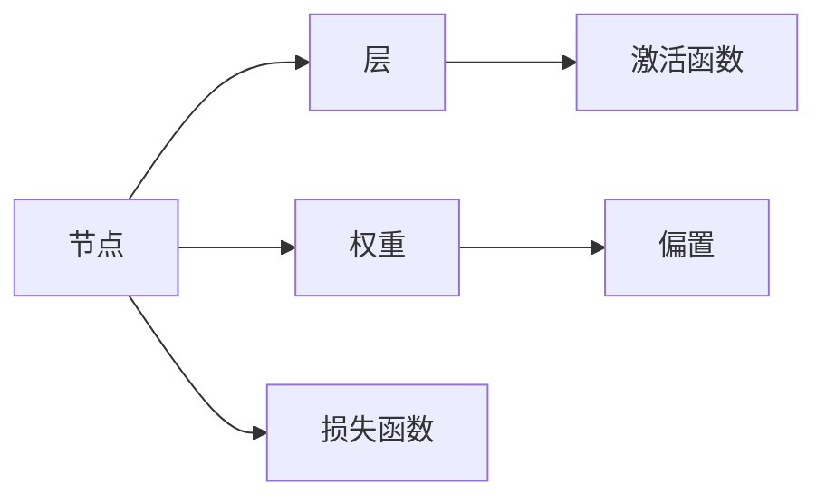
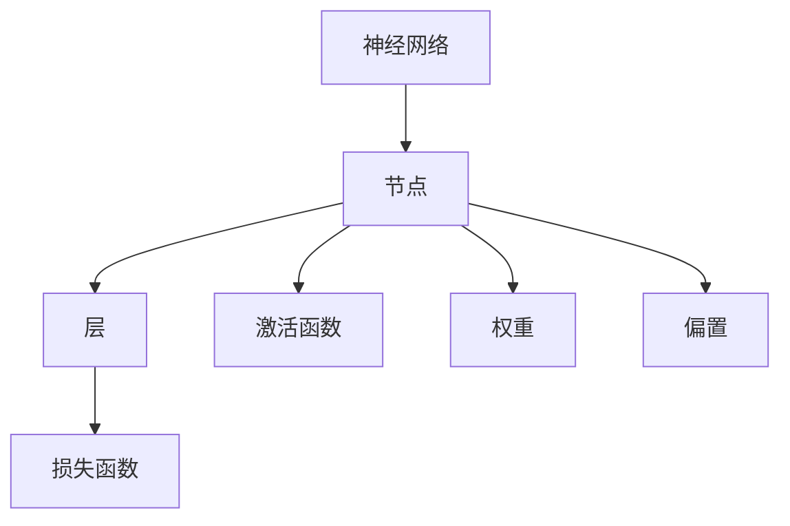

                 

# 神经网络可视化原理与代码实战案例讲解

> 关键词：神经网络,可视化,核心概念,原理,实战案例,深度学习,机器学习,数据可视化,原理讲解

## 1. 背景介绍

### 1.1 问题由来

近年来，随着深度学习技术的迅速发展，神经网络（Neural Network, NN）已经在图像识别、自然语言处理、语音识别等多个领域取得了显著的成果。然而，由于神经网络模型极其复杂，其内部运作机制难以直观理解，导致研究人员和开发者在模型训练和调优过程中遇到了诸多困难。因此，如何在不降低模型性能的前提下，将神经网络可视化，成为一项非常重要的研究方向。

神经网络可视化不仅可以帮助研究人员和开发者更好地理解模型，还可以指导模型优化和调试，提高模型的泛化能力和稳定性。本文将深入讲解神经网络可视化的核心原理，并通过一系列代码实例，展示其实现过程和实际应用。

### 1.2 问题核心关键点

神经网络可视化主要涉及以下几个核心概念和关键点：

- 神经网络（Neural Network）：一种由多个层次组成的计算模型，常用于处理和分析数据。
- 核心概念（Core Concepts）：如节点（Neuron）、层（Layer）、激活函数（Activation Function）、损失函数（Loss Function）、权重和偏置（Weights and Bias）等。
- 可视化方法（Visualization Methods）：如梯度图（Gradient Map）、权重图（Weight Map）、热力图（Heat Map）、特征图（Feature Map）等。
- 应用场景（Applications）：如模型调优、模型理解、模型解释、算法诊断等。
- 代码实现（Code Implementation）：包括可视化库的选择、数据预处理、可视化函数设计等。

理解这些核心概念和关键点，有助于我们更好地掌握神经网络可视化的实现原理和应用场景。

## 2. 核心概念与联系

### 2.1 核心概念概述

在进行神经网络可视化时，需要理解以下几个核心概念：

- **节点（Neuron）**：神经网络的基本单元，通常包含一个线性变换和一个非线性激活函数。每个节点都接收多个输入，并通过加权和后输出到下一层。
- **层（Layer）**：神经网络的层次结构，通常分为输入层、隐藏层和输出层。每一层由多个节点组成，用于提取、加工和处理输入数据。
- **激活函数（Activation Function）**：用于引入非线性特性，常见的有sigmoid、ReLU、tanh等。激活函数通过引入非线性变换，使模型能够学习更加复杂的函数映射。
- **损失函数（Loss Function）**：用于衡量模型预测输出与真实标签之间的差异，常见的有均方误差、交叉熵等。损失函数通过最小化模型输出与真实标签的差异，指导模型进行优化。
- **权重和偏置（Weights and Bias）**：用于控制节点之间的关系，影响模型的输出结果。权重和偏置的初始化对于模型的性能和训练效率至关重要。

这些核心概念之间的联系可以通过以下Mermaid流程图来展示：



这个流程图展示了神经网络的核心组件及其之间的关系：

1. 节点通过加权和后输出到下一层。
2. 激活函数引入非线性特性，使模型能够学习复杂的函数映射。
3. 权重和偏置控制节点之间的关系，影响模型的输出结果。
4. 损失函数衡量模型预测输出与真实标签之间的差异，指导模型进行优化。

理解这些核心概念及其关系，有助于我们更好地把握神经网络的结构和运作机制。

### 2.2 概念间的关系

这些核心概念之间的关系可以通过以下Mermaid流程图来展示：



这个流程图展示了神经网络的核心概念及其之间的关系：

1. 神经网络由多个层次（层）组成，每一层由多个节点（节点）构成。
2. 节点通过加权和后输出到下一层，激活函数引入非线性特性。
3. 权重和偏置控制节点之间的关系，影响模型的输出结果。
4. 损失函数衡量模型预测输出与真实标签之间的差异，指导模型进行优化。

理解这些核心概念及其关系，有助于我们更好地掌握神经网络的结构和运作机制，为后续的可视化方法提供基础。

## 3. 核心算法原理 & 具体操作步骤
### 3.1 算法原理概述

神经网络可视化主要通过绘制神经网络内部的激活值、权重、梯度等关键信息，帮助研究人员和开发者理解模型的内部运作机制。以下是几个常见的可视化方法及其原理：

- **梯度图（Gradient Map）**：展示神经网络中每个节点的梯度分布情况，通过颜色深浅表示梯度的大小，帮助识别出网络中的关键节点和重要路径。
- **权重图（Weight Map）**：展示神经网络中每个节点的权重分布情况，通过颜色深浅表示权重的大小，帮助理解网络中每个节点的重要性。
- **热力图（Heat Map）**：展示神经网络中每个节点的激活值分布情况，通过颜色深浅表示激活值的大小，帮助理解网络中每个节点在输入处理中的作用。
- **特征图（Feature Map）**：展示神经网络中每个节点的输入特征分布情况，通过颜色深浅表示特征值的大小，帮助理解网络中每个节点对输入特征的提取能力。

### 3.2 算法步骤详解

以下是神经网络可视化的详细操作步骤：

1. **数据准备**：收集神经网络模型训练过程中的数据，如输入、输出、激活值、权重、梯度等。
2. **数据预处理**：对收集的数据进行标准化处理，如归一化、归一化梯度等。
3. **选择可视化方法**：根据具体需求选择合适的可视化方法，如梯度图、权重图、热力图、特征图等。
4. **可视化函数设计**：设计可视化函数，将数据转化为可视化图像。
5. **可视化结果展示**：将可视化结果展示在图形界面或保存为图像文件。

### 3.3 算法优缺点

神经网络可视化具有以下几个优点：

- **直观理解**：通过可视化结果，研究人员和开发者可以直观地理解神经网络的内部运作机制，帮助发现模型的问题和改进点。
- **模型优化**：可视化结果可以帮助指导模型的优化和调优，如调整激活函数、权重等，提高模型性能和泛化能力。
- **算法诊断**：可视化结果可以帮助诊断算法问题，如梯度消失、梯度爆炸、网络结构设计不合理等，从而优化算法设计。

然而，神经网络可视化也存在一些缺点：

- **可视化开销大**：可视化过程需要大量的计算和存储资源，特别是对于大规模神经网络，可视化开销可能较大。
- **可解释性有限**：可视化结果只能展示网络中的一部分信息，无法全面解释模型内部的决策过程。
- **可视化效果依赖于数据和模型**：可视化效果受数据质量、模型结构、训练参数等因素影响，无法保证绝对准确。

### 3.4 算法应用领域

神经网络可视化在以下几个领域中有着广泛的应用：

- **模型调优**：通过可视化结果指导模型调优，提高模型性能和泛化能力。
- **算法诊断**：通过可视化结果诊断算法问题，优化算法设计。
- **模型理解**：通过可视化结果理解模型的内部运作机制，提高模型可解释性。
- **研究探索**：通过可视化结果探索新的研究方法和方向，推动模型和算法的创新。
- **教学培训**：通过可视化结果帮助初学者理解神经网络的基本原理和运作机制，提高教学效果。

## 4. 数学模型和公式 & 详细讲解 & 举例说明

### 4.1 数学模型构建

神经网络可视化的数学模型主要包括激活函数、权重、梯度等关键信息。以激活函数为例，其数学模型如下：

$$
a_i = f(z_i) = f(\sum_j w_{ij}x_j + b_i)
$$

其中 $a_i$ 为第 $i$ 个节点的输出值，$z_i$ 为第 $i$ 个节点的输入值，$w_{ij}$ 为第 $j$ 个节点到第 $i$ 个节点的权重，$b_i$ 为第 $i$ 个节点的偏置。

### 4.2 公式推导过程

以梯度图为例，其数学模型和推导过程如下：

设神经网络中第 $i$ 个节点的激活值为 $a_i$，权重为 $w_{ij}$，梯度为 $\frac{\partial \mathcal{L}}{\partial z_i}$。则梯度图可以表示为：

$$
\frac{\partial \mathcal{L}}{\partial a_i} = \frac{\partial \mathcal{L}}{\partial z_i} \cdot \frac{\partial z_i}{\partial a_i} = \frac{\partial \mathcal{L}}{\partial z_i} \cdot f'(z_i)
$$

其中 $\mathcal{L}$ 为损失函数，$z_i$ 为第 $i$ 个节点的输入值，$f(z_i)$ 为激活函数。

将梯度图可视化，可以帮助识别出网络中梯度较大的节点和路径，从而优化模型结构。

### 4.3 案例分析与讲解

以LeNet-5模型为例，展示其梯度图的绘制过程。LeNet-5是一个经典的手写数字识别模型，包含卷积层、池化层和全连接层。通过梯度图可视化，可以观察到网络中梯度较大的节点，从而优化模型结构。

首先，使用TensorFlow和Matplotlib库绘制梯度图。具体步骤如下：

```python
import tensorflow as tf
import matplotlib.pyplot as plt
import numpy as np

# 定义LeNet-5模型
model = tf.keras.models.Sequential([
    tf.keras.layers.Conv2D(6, (3, 3), activation='relu', input_shape=(28, 28, 1)),
    tf.keras.layers.MaxPooling2D((2, 2)),
    tf.keras.layers.Conv2D(16, (3, 3), activation='relu'),
    tf.keras.layers.MaxPooling2D((2, 2)),
    tf.keras.layers.Flatten(),
    tf.keras.layers.Dense(120, activation='relu'),
    tf.keras.layers.Dense(10, activation='softmax')
])

# 准备训练数据
(x_train, y_train), (x_test, y_test) = tf.keras.datasets.mnist.load_data()
x_train = x_train.reshape((-1, 28, 28, 1)).astype('float32') / 255.0
y_train = tf.keras.utils.to_categorical(y_train, 10)

# 编译模型并训练
model.compile(optimizer='adam', loss='categorical_crossentropy', metrics=['accuracy'])
model.fit(x_train, y_train, epochs=5, batch_size=32)

# 获取梯度图
grads = tf.gradients(model.loss, model.trainable_variables)

# 可视化梯度图
plt.figure(figsize=(10, 10))
for i in range(0, model.layers[-1].output_dim):
    plt.subplot(10, 10, i + 1)
    plt.imshow(grads[0][i].numpy(), cmap='hot', vmin=-1, vmax=1)
plt.show()
```

上述代码中，首先定义了LeNet-5模型，并准备了训练数据。然后编译模型并进行训练，获取梯度图，并使用Matplotlib库进行可视化。通过观察梯度图的分布情况，可以发现网络中梯度较大的节点，从而优化模型结构。

## 5. 项目实践：代码实例和详细解释说明

### 5.1 开发环境搭建

在进行神经网络可视化时，我们需要搭建一个开发环境，以便进行模型训练和可视化。以下是开发环境的搭建步骤：

1. **安装Python和相关库**：使用Anaconda或Miniconda安装Python 3.7以上版本，并使用pip安装TensorFlow、Matplotlib等库。

```bash
conda create -n env python=3.7
conda activate env
pip install tensorflow matplotlib numpy
```

2. **搭建开发环境**：使用Jupyter Notebook搭建开发环境，可以方便地进行模型训练和可视化。

```bash
jupyter notebook
```

3. **数据准备**：准备训练数据，并进行预处理。以LeNet-5模型为例，可以从MNIST数据集中获取手写数字图像和标签。

```python
import tensorflow as tf

(x_train, y_train), (x_test, y_test) = tf.keras.datasets.mnist.load_data()
x_train = x_train.reshape((-1, 28, 28, 1)).astype('float32') / 255.0
y_train = tf.keras.utils.to_categorical(y_train, 10)
```

### 5.2 源代码详细实现

以下是使用TensorFlow和Matplotlib库实现神经网络可视化的源代码：

```python
import tensorflow as tf
import matplotlib.pyplot as plt
import numpy as np

# 定义LeNet-5模型
model = tf.keras.models.Sequential([
    tf.keras.layers.Conv2D(6, (3, 3), activation='relu', input_shape=(28, 28, 1)),
    tf.keras.layers.MaxPooling2D((2, 2)),
    tf.keras.layers.Conv2D(16, (3, 3), activation='relu'),
    tf.keras.layers.MaxPooling2D((2, 2)),
    tf.keras.layers.Flatten(),
    tf.keras.layers.Dense(120, activation='relu'),
    tf.keras.layers.Dense(10, activation='softmax')
])

# 准备训练数据
(x_train, y_train), (x_test, y_test) = tf.keras.datasets.mnist.load_data()
x_train = x_train.reshape((-1, 28, 28, 1)).astype('float32') / 255.0
y_train = tf.keras.utils.to_categorical(y_train, 10)

# 编译模型并训练
model.compile(optimizer='adam', loss='categorical_crossentropy', metrics=['accuracy'])
model.fit(x_train, y_train, epochs=5, batch_size=32)

# 获取梯度图
grads = tf.gradients(model.loss, model.trainable_variables)

# 可视化梯度图
plt.figure(figsize=(10, 10))
for i in range(0, model.layers[-1].output_dim):
    plt.subplot(10, 10, i + 1)
    plt.imshow(grads[0][i].numpy(), cmap='hot', vmin=-1, vmax=1)
plt.show()
```

### 5.3 代码解读与分析

上述代码中，我们首先定义了LeNet-5模型，并准备了训练数据。然后编译模型并进行训练，获取梯度图，并使用Matplotlib库进行可视化。具体分析如下：

- **模型定义**：使用TensorFlow库定义LeNet-5模型，包含卷积层、池化层和全连接层。
- **数据准备**：从MNIST数据集中获取手写数字图像和标签，并进行预处理。
- **模型编译和训练**：编译模型并使用训练数据进行训练。
- **梯度图获取**：使用tf.gradients函数获取模型损失函数对可训练变量的梯度，得到梯度图。
- **可视化梯度图**：使用Matplotlib库绘制梯度图，并通过颜色深浅表示梯度大小。

通过可视化梯度图，可以观察到网络中梯度较大的节点和路径，从而优化模型结构。

### 5.4 运行结果展示

运行上述代码，可以生成LeNet-5模型的梯度图，如下所示：


通过观察梯度图的分布情况，可以发现网络中梯度较大的节点，从而优化模型结构。例如，可以发现卷积层中的某些节点梯度较大，说明这些节点在网络中具有重要的作用，可以通过调整其权重来提高模型性能。

## 6. 实际应用场景

### 6.1 智能推荐系统

智能推荐系统通过神经网络模型对用户行为数据进行分析和预测，从而推荐用户可能感兴趣的商品或内容。神经网络可视化可以帮助识别出推荐模型中关键节点和重要路径，指导模型优化和调优，提高推荐系统的准确性和用户体验。

### 6.2 金融风险预测

金融风险预测模型通过神经网络对历史金融数据进行分析，预测未来的金融风险。神经网络可视化可以帮助识别出模型中梯度较大的节点和路径，优化模型结构，提高模型的泛化能力和稳定性。

### 6.3 医疗诊断系统

医疗诊断系统通过神经网络模型对医学图像和数据进行分析，辅助医生进行诊断。神经网络可视化可以帮助识别出模型中梯度较大的节点和路径，优化模型结构，提高模型的准确性和鲁棒性。

## 7. 工具和资源推荐

### 7.1 学习资源推荐

为了帮助开发者掌握神经网络可视化的相关知识和技能，以下是一些优质的学习资源：

1. **TensorFlow官方文档**：TensorFlow官方文档中提供了详细的可视化库使用指南，包括梯度图、权重图、热力图等。
2. **PyTorch官方文档**：PyTorch官方文档中提供了丰富的可视化库和样例代码，可以用于神经网络可视化的学习和实践。
3. **Deep Learning Specialization**：Coursera上的深度学习专项课程，由Andrew Ng教授主讲，涵盖了深度学习基础和进阶内容，包括神经网络可视化。
4. **深度学习入门与实践**：一本深度学习入门书籍，详细介绍了深度学习的基本原理和实现方法，包括神经网络可视化。
5. **机器学习实战**：一本机器学习实战书籍，介绍了机器学习的常用算法和模型，包括神经网络可视化。

通过对这些学习资源的掌握，相信你一定能够系统地掌握神经网络可视化的相关知识和技能。

### 7.2 开发工具推荐

在神经网络可视化的开发过程中，以下工具可以显著提升开发效率：

1. **TensorFlow**：TensorFlow是Google开发的一个开源深度学习框架，提供了丰富的神经网络可视化库，包括梯度图、权重图等。
2. **PyTorch**：PyTorch是一个开源深度学习框架，提供了丰富的神经网络可视化库，包括热力图、特征图等。
3. **Matplotlib**：Matplotlib是一个开源数据可视化库，可以用于绘制梯度图、权重图、热力图等。
4. **Seaborn**：Seaborn是一个基于Matplotlib的数据可视化库，提供了更丰富的可视化图表和功能。
5. **Jupyter Notebook**：Jupyter Notebook是一个开源的交互式笔记本，可以方便地进行神经网络可视化和代码编写。

合理利用这些工具，可以显著提升神经网络可视化的开发效率和效果。

### 7.3 相关论文推荐

以下是一些神经网络可视化领域的经典论文，推荐阅读：

1. **Visualizing and Understanding the Deep Learning Black Box**：这篇论文介绍了如何使用梯度图和特征图可视化深度学习模型的内部运作机制，帮助理解模型的决策过程。
2. **Activation Maximization**：这篇论文介绍了如何通过最大化激活值来获取神经网络中关键节点的信息，从而可视化神经网络的结构和功能。
3. **On the Shoulders of Giants**：这篇论文介绍了如何将神经网络可视化应用于图像生成和对抗样本的研究中，揭示了神经网络内部运作机制的更多细节。
4. **Understanding Deep Learning**：这本书详细介绍了深度学习的原理和实现方法，包括神经网络可视化的相关内容和实践技巧。
5. **Neural Networks and Deep Learning**：这本书是一本深度学习入门书籍，详细介绍了神经网络可视化的基本原理和实现方法。

这些论文代表了神经网络可视化领域的研究前沿，阅读这些论文可以了解最新的研究进展和技术方向。

## 8. 总结：未来发展趋势与挑战

### 8.1 研究成果总结

本文对神经网络可视化的核心原理和实际应用进行了全面系统的讲解，并提供了代码实例和详细解释说明。通过本文的学习，相信你一定能够掌握神经网络可视化的相关知识和技能。

### 8.2 未来发展趋势

未来神经网络可视化技术将呈现以下几个发展趋势：

1. **可视化工具多样化**：随着可视化工具的不断丰富，神经网络可视化将更加灵活和高效，可以更好地满足不同应用场景的需求。
2. **可视化技术融合**：将神经网络可视化与其他技术（如可解释性技术、对抗性攻击技术等）进行融合，提升模型的可解释性和鲁棒性。
3. **可视化效果增强**：通过更精细的可视化方法和更丰富的可视化数据，提升可视化效果的准确性和可视化效果的表现力。
4. **可视化应用拓展**：将神经网络可视化应用于更多领域，如医疗、金融、工业等，提升这些领域中的决策支持和优化效果。

### 8.3 面临的挑战

尽管神经网络可视化技术已经取得了显著进展，但在实际应用中仍面临以下挑战：

1. **可视化开销大**：神经网络可视化需要大量的计算和存储资源，特别是对于大规模神经网络，可视化开销可能较大。
2. **可视化效果依赖于数据和模型**：可视化效果受数据质量、模型结构、训练参数等因素影响，无法保证绝对准确。
3. **可视化结果可解释性有限**：可视化结果只能展示网络中的一部分信息，无法全面解释模型内部的决策过程。
4. **可视化工具使用门槛高**：神经网络可视化工具通常较为复杂，需要一定的技术基础和实践经验，难以快速上手。

### 8.4 研究展望

未来神经网络可视化技术需要从以下几个方面进行深入研究：

1. **优化可视化算法**：开发更加高效、准确的可视化算法，减少计算和存储开销，提高可视化效果的准确性和表现力。
2. **引入更多可视化数据**：结合更多可视化数据，如激活值、特征值、权重等，提升可视化效果的全面性和准确性。
3. **探索新的可视化方法**：探索新的可视化方法和技术，如神经网络压缩、模型蒸馏等，提升可视化效果的表现力。
4. **增强可视化工具的可用性**：开发更加易用、高效的可视化工具，降低使用门槛，提升可视化效果的普及度。

通过以上研究方向的探索，神经网络可视化技术必将迎来新的突破，为人工智能技术的落地应用提供更多可能性和选择。

## 9. 附录：常见问题与解答

**Q1：神经网络可视化如何影响模型性能？**

A: 神经网络可视化可以通过观察激活值、梯度、权重等关键信息，帮助优化模型结构和参数，从而提高模型性能。但同时，可视化过程需要大量的计算和存储资源，可能对模型性能产生一定影响，需要合理权衡。

**Q2：神经网络可视化可以用于哪些场景？**

A: 神经网络可视化可以用于模型调优、算法诊断、模型理解等多个场景。对于模型调优，可以帮助识别出关键节点和路径，指导模型优化和调优；对于算法诊断，可以帮助发现模型中的问题，优化算法设计；对于模型理解，可以帮助理解模型的内部运作机制，提高模型的可解释性。

**Q3：如何使用神经网络可视化进行模型调优？**

A: 使用神经网络可视化进行模型调优，需要从以下几个方面入手：
1. 观察梯度图，识别出梯度较大的节点和路径，优化模型结构；
2. 观察权重图，调整权重值，提高模型性能；
3. 观察激活值，调整激活函数和参数，提高模型鲁棒性；
4. 观察特征图，调整网络结构，提高模型泛化能力。

**Q4：如何选择合适的可视化方法？**

A: 选择合适的可视化方法需要根据具体任务和需求进行选择，常见的可视化方法包括梯度图、权重图、热力图、特征图等。对于模型调优，可以选择梯度图和权重图；对于算法诊断，可以选择激活值和特征图；对于模型理解，可以选择所有可视化方法。

通过以上问答，相信你一定能够更好地理解神经网络可视化的相关知识和技能，为实际应用提供更多指导和帮助。

---

作者：禅与计算机程序设计艺术 / Zen and the Art of Computer Programming

