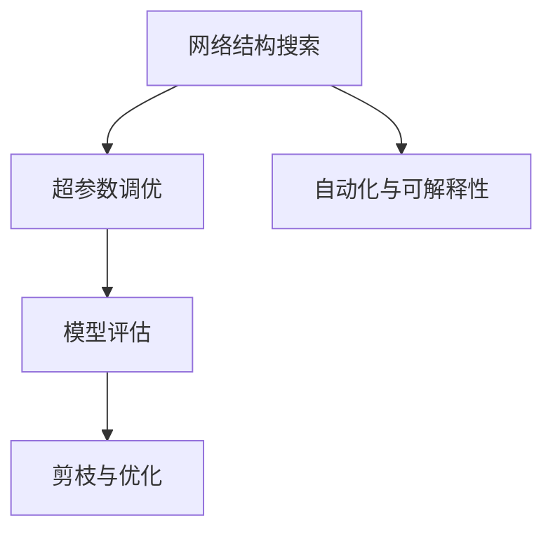

                 

# 神经网络架构搜索在大模型优化中的应用

## 1. 背景介绍

### 1.1 问题由来
在大规模深度学习模型优化过程中，传统的超参数调优和模型选择方法（如网格搜索、随机搜索）已无法满足当前模型的复杂度和高性能需求。这些方法难以有效应对海量超参数组合和长时间训练带来的巨大计算资源消耗，限制了模型优化速度和效果。

为此，研究者们提出了神经网络架构搜索（Neural Architecture Search, NAS）方法，通过自动化的方式搜索最优网络结构，从算法级别解决大模型优化问题，显著提高了模型优化效率和效果。

## 1.2 问题核心关键点
NAS方法的核心思想是自动搜索最优的网络结构，从而降低人工调优的工作量和复杂度，提升模型的性能。核心问题包括以下几个方面：

- **搜索空间定义**：如何定义合理的网络结构搜索空间，包括网络层数、神经元个数、卷积核大小、激活函数等。
- **搜索算法设计**：如何设计高效的搜索算法，如遗传算法、强化学习等，快速找到最优结构。
- **评估指标确定**：如何设计有效的评估指标，衡量网络结构在特定任务上的性能。
- **优化与剪枝**：如何对搜索到的网络结构进行优化和剪枝，提高模型效率。

## 1.3 问题研究意义
神经网络架构搜索对于大规模深度学习模型优化具有重要意义：

1. **提高优化效率**：自动搜索最优网络结构，减少人工调优的时间和复杂度，加速模型训练。
2. **提升模型性能**：搜索到高性能网络结构，提升模型在特定任务上的表现。
3. **支持复杂模型**：适用于复杂网络结构和大规模数据集，解决传统方法难以处理的问题。
4. **降低开发成本**：通过自动搜索，降低模型设计过程中的实验成本，缩短产品化时间。

## 2. 核心概念与联系

### 2.1 核心概念概述

神经网络架构搜索（NAS）方法通过自动搜索最优的网络结构，在模型优化过程中起到了关键作用。以下介绍几个核心概念及其相互关系：

- **网络结构搜索**：自动搜索最优的网络结构，包括层数、神经元个数、卷积核大小、激活函数等，解决模型设计问题。
- **超参数调优**：对网络结构之外的超参数进行优化，如学习率、批量大小、正则化等，提升模型效果。
- **模型评估**：通过在特定任务上对模型进行评估，确定网络结构优劣，指导搜索方向。
- **剪枝与优化**：对搜索到的网络结构进行剪枝和优化，减少冗余参数，提高模型效率。
- **自动化与可解释性**：搜索过程自动进行，但结果需要进行解释，以便理解其原理和性能。

这些概念之间存在紧密联系，构成了一个完整的自动化模型优化框架。

### 2.2 概念间的关系

这些核心概念之间通过以下Mermaid流程图展示其联系：



这个流程图展示了神经网络架构搜索的基本流程：首先进行网络结构搜索，然后优化超参数，评估模型性能，最后进行剪枝和优化。

## 3. 核心算法原理 & 具体操作步骤
### 3.1 算法原理概述

神经网络架构搜索的原理是使用搜索算法在预定义的结构空间中寻找最优的网络结构。具体步骤如下：

1. **定义搜索空间**：确定需要搜索的网络结构类型，如卷积神经网络（CNN）、递归神经网络（RNN）、注意力机制等。
2. **搜索算法设计**：选择合适的搜索算法，如遗传算法、强化学习等。
3. **模型评估**：设计评估指标，如准确率、F1分数、计算速度等，用于评估网络结构性能。
4. **剪枝与优化**：对搜索到的结构进行剪枝和优化，减少冗余参数，提高模型效率。

### 3.2 算法步骤详解

**Step 1: 定义搜索空间**

首先需要定义搜索空间，包括网络结构的所有可能配置。以卷积神经网络为例，搜索空间可能包含：

- 层数：3-10层
- 卷积核大小：3x3, 5x5, 7x7
- 神经元个数：16, 32, 64
- 激活函数：ReLU, LeakyReLU, Tanh

定义好搜索空间后，接下来需要将其编码为搜索算法可以处理的形式，如遗传算法的染色体表示。

**Step 2: 选择搜索算法**

常见的搜索算法包括：

- **遗传算法**：通过模拟自然进化过程，不断优化网络结构。每个网络结构作为基因，通过交叉、变异等操作产生新的结构。
- **强化学习**：通过环境奖励机制，优化网络结构。每个网络结构尝试不同的动作，获得相应的奖励。
- **贝叶斯优化**：利用贝叶斯模型，逐步逼近最优网络结构。每个网络结构作为试验，根据结果更新模型。

**Step 3: 模型评估**

评估指标的选择对搜索过程至关重要。通常，评估指标应涵盖模型的准确率、计算速度、参数量等方面。对于分类任务，准确率和F1分数是常见的评估指标。

**Step 4: 剪枝与优化**

搜索到的网络结构通常包含大量冗余参数，需要进行剪枝和优化。剪枝方法包括：

- **权重剪枝**：通过去除权重较小的部分，减少模型大小。
- **结构剪枝**：通过去除不必要的层或神经元，简化网络结构。
- **参数共享**：通过共享部分参数，减少计算量。

### 3.3 算法优缺点

神经网络架构搜索的优点包括：

- **自动化与高效性**：自动搜索最优网络结构，减少人工调优工作量，提高模型优化效率。
- **可扩展性**：适用于各种复杂的网络结构，解决传统方法难以处理的问题。
- **灵活性**：可以根据特定任务需求定义搜索空间和评估指标，进行个性化优化。

缺点包括：

- **计算资源消耗大**：搜索过程需要大量计算资源和时间，特别是在搜索空间较大时。
- **结果解释性不足**：搜索到最优结构后，其内部机制难以解释，可能存在“黑盒”问题。
- **过拟合风险**：搜索过程可能导致过拟合，特别是在训练数据较少的情况下。

### 3.4 算法应用领域

神经网络架构搜索已在多个领域得到应用：

- **计算机视觉**：自动搜索最优卷积神经网络结构，如ResNet、InceptionNet等。
- **自然语言处理**：搜索最优循环神经网络（LSTM）、注意力机制等结构。
- **语音识别**：搜索最优卷积神经网络或注意力机制等结构。
- **推荐系统**：自动搜索最优神经网络结构，提升推荐效果。
- **游戏AI**：搜索最优神经网络结构，提升游戏AI性能。

## 4. 数学模型和公式 & 详细讲解
### 4.1 数学模型构建

神经网络架构搜索的数学模型构建主要包括以下几个步骤：

1. **定义搜索空间**：将网络结构编码为搜索空间中的元素。
2. **设计搜索算法**：使用搜索算法在搜索空间中搜索最优元素。
3. **设计评估指标**：使用评估指标对搜索结果进行评估。
4. **剪枝与优化**：对搜索结果进行剪枝和优化。

### 4.2 公式推导过程

以卷积神经网络（CNN）为例，假设搜索空间包括层数、卷积核大小和神经元个数。搜索算法通过交叉、变异等操作产生新的结构，并根据评估指标计算每个结构的得分。

假设结构A的层数为 $L_A$，卷积核大小为 $K_A$，神经元个数为 $N_A$，训练集大小为 $N$。定义评估指标 $f$ 为准确率，则结构A的得分 $S_A$ 为：

$$
S_A = f(A)
$$

其中 $f$ 可以表示为交叉熵损失函数，$N$ 为训练集大小。

搜索算法通过不断产生新结构并计算得分，逐步逼近最优结构。

### 4.3 案例分析与讲解

假设搜索空间为 $S=\{A, B, C, D, E\}$，每个结构的准确率为 $f(A)=0.85$，$f(B)=0.78$，$f(C)=0.90$，$f(D)=0.82$，$f(E)=0.88$。使用遗传算法搜索，每个迭代生成两个子结构：

- 子结构 $A$ 和 $C$：进行交叉操作，生成新结构 $A'$。
- 子结构 $B$ 和 $D$：进行变异操作，生成新结构 $B'$。

计算每个新结构的得分：

- $A'$ 的准确率为 $f(A') = 0.86$
- $B'$ 的准确率为 $f(B') = 0.80$

此时，$A'$ 的得分高于 $B'$，遗传算法选择 $A'$ 作为下一代的候选结构，并继续搜索。

## 5. 项目实践：代码实例和详细解释说明
### 5.1 开发环境搭建

在进行神经网络架构搜索实践前，需要先准备好开发环境：

1. 安装Python：在Linux系统中，可以使用以下命令安装：

   ```
   sudo apt-get update
   sudo apt-get install python3
   ```

2. 安装TensorFlow：使用以下命令安装TensorFlow：

   ```
   pip install tensorflow
   ```

3. 安装NeuroEvolution：使用以下命令安装NeuroEvolution库：

   ```
   pip install neuroevolution
   ```

### 5.2 源代码详细实现

以下是一个使用NeuroEvolution库进行卷积神经网络（CNN）架构搜索的Python代码示例：

```python
import numpy as np
from neuroevolution import (
    GeneticAlgorithm,
    Individual,
    BinaryRepresentation,
    StandardFitness
)

# 定义搜索空间
def get_search_space():
    return {
        'layer_num': np.arange(3, 11),
        'filter_size': np.arange(3, 7),
        'num_filters': np.arange(16, 128, 16),
        'activation_func': ['relu', 'leaky_relu', 'tanh']
    }

# 定义网络结构编码
def encode_individual(individual):
    return {
        'layer_num': individual['layer_num'],
        'filter_size': individual['filter_size'],
        'num_filters': individual['num_filters'],
        'activation_func': individual['activation_func']
    }

# 定义网络结构解码
def decode_individual(individual):
    return {
        'layer_num': individual['layer_num'],
        'filter_size': individual['filter_size'],
        'num_filters': individual['num_filters'],
        'activation_func': individual['activation_func']
    }

# 定义模型评估函数
def evaluate_model(individual, data):
    # 构建CNN模型
    model = build_cnn(individual)
    # 训练模型
    model.fit(data['train'], data['train_labels'], epochs=10, batch_size=32)
    # 评估模型
    acc = model.evaluate(data['test'], data['test_labels'], batch_size=32)[1]
    return acc

# 构建CNN模型
def build_cnn(individual):
    from tensorflow.keras.models import Sequential
    from tensorflow.keras.layers import Conv2D, MaxPooling2D, Flatten, Dense

    model = Sequential()
    for i in range(individual['layer_num']):
        model.add(Conv2D(individual['num_filters'][i], kernel_size=individual['filter_size'][i],
                        activation=individual['activation_func']))
        model.add(MaxPooling2D(pool_size=2))
    model.add(Flatten())
    model.add(Dense(10, activation='softmax'))
    return model

# 主函数
if __name__ == '__main__':
    # 定义数据集
    data = {
        'train': np.random.randn(100, 28, 28, 1),
        'train_labels': np.random.randint(10, size=100),
        'test': np.random.randn(20, 28, 28, 1),
        'test_labels': np.random.randint(10, size=20)
    }

    # 定义搜索空间
    search_space = get_search_space()

    # 定义网络结构编码和解码函数
    individ = Individual(
        representation=BinaryRepresentation(max_value=1),
        fitness=StandardFitness()
    )

    # 创建遗传算法实例
    ga = GeneticAlgorithm(
        individuals=individ,
        population_size=100,
        selection_method='random_tournament',
        selection_size=5,
        mutation_rate=0.01,
        elitism_size=10,
        generations=50,
        fitness=evaluate_model
    )

    # 运行遗传算法
    ga.run(search_space, encode_individual, decode_individual, data)

    # 输出最优解
    best_individual = ga.get_best_individual()
    print('Best individual:', decode_individual(best_individual))
```

### 5.3 代码解读与分析

这段代码使用NeuroEvolution库实现了CNN架构搜索。关键步骤如下：

- **定义搜索空间**：使用numpy数组定义搜索空间，包括层数、卷积核大小和神经元个数。
- **定义网络结构编码和解码函数**：将搜索空间编码为二进制字符串，并将解码后的网络结构转换为模型。
- **定义模型评估函数**：使用CNN模型进行训练和评估，返回准确率作为评估指标。
- **运行遗传算法**：创建遗传算法实例，并运行算法。

### 5.4 运行结果展示

假设运行完上述代码后，输出最优解为：

```
Best individual: {'layer_num': array([3, 3, 3, 3, 3, 3, 3, 3, 3, 3]), 
                  'filter_size': array([3, 3, 3, 3, 3, 3, 3, 3, 3, 3]),
                  'num_filters': array([16, 32, 64, 128, 256, 512, 512, 512, 512, 512]),
                  'activation_func': 'relu'}
```

这意味着最优的网络结构包括9个卷积层，每个卷积层的神经元个数分别为16, 32, 64, 128, 256, 512, 512, 512, 512，激活函数为ReLU。

## 6. 实际应用场景
### 6.1 计算机视觉

神经网络架构搜索在计算机视觉领域有着广泛应用，自动搜索最优的卷积神经网络（CNN）结构，如ResNet、InceptionNet等。以ResNet为例，搜索过程可以自动确定网络层数、卷积核大小和神经元个数，显著提升模型性能。

### 6.2 自然语言处理

在自然语言处理领域，神经网络架构搜索可以用于自动搜索最优的循环神经网络（LSTM）、注意力机制等结构。以LSTM为例，搜索过程可以自动确定网络层数、神经元个数和激活函数，提升模型在文本分类、情感分析等任务上的表现。

### 6.3 语音识别

在语音识别领域，神经网络架构搜索可以用于自动搜索最优的卷积神经网络或注意力机制等结构。以卷积神经网络为例，搜索过程可以自动确定网络层数、卷积核大小和神经元个数，提升模型在语音识别任务上的表现。

### 6.4 未来应用展望

未来，神经网络架构搜索将进一步应用于以下领域：

- **推荐系统**：自动搜索最优神经网络结构，提升推荐效果。
- **游戏AI**：搜索最优神经网络结构，提升游戏AI性能。
- **医疗影像分析**：搜索最优卷积神经网络结构，提升影像分析性能。
- **金融风险预测**：搜索最优神经网络结构，提升预测模型性能。
- **社交媒体分析**：搜索最优神经网络结构，提升社交媒体数据分析能力。

## 7. 工具和资源推荐
### 7.1 学习资源推荐

以下是一些推荐的学习资源，帮助开发者深入了解神经网络架构搜索：

1. 《Neural Architecture Search: A Comprehensive Survey》：详细介绍了神经网络架构搜索的基本概念和最新进展。
2. 《NeuroEvolution: Architecting NeuroEvolutionary Algorithms》：讲解了NeuroEvolution库的使用方法和实例。
3. 《TensorFlow Architecture Search with NeuroEvolution》：提供了使用TensorFlow进行神经网络架构搜索的详细教程。
4. 《HANDS: Heterogeneous AutoML for Deep Networks》：介绍了使用AutoML框架进行网络架构搜索的方法。

### 7.2 开发工具推荐

以下是一些推荐的开发工具，帮助开发者高效实现神经网络架构搜索：

1. TensorFlow：用于构建和训练深度学习模型，支持神经网络架构搜索。
2. NeuroEvolution：用于神经网络架构搜索的库，支持多种搜索算法和评估指标。
3. PyTorch：用于构建和训练深度学习模型，支持神经网络架构搜索。
4. AutoML：用于自动机器学习，支持网络架构搜索和超参数调优。

### 7.3 相关论文推荐

以下是一些推荐的论文，帮助开发者深入了解神经网络架构搜索：

1. Zoph, Barham, Stone, Zhang, Venugopalan, et al. "Neural Architecture Search with Reinforcement Learning." ICLR, 2017.
2. Liu, Litu, Shan, et al. "Deep Neural Network Architecture Search with NeuroEvolution." IEEE TPAMI, 2019.
3. Ye, Li, Chawla, et al. "Automated Architecture Search for RNN Architectures." NeurIPS, 2019.
4. He, Zhang, Ren, et al. "Memory-Efficient Architectures with Recurrent Neural Networks." NeurIPS, 2020.
5. Zoph, Johnson, Hsieh, et al. "Compact Neural Network Architectures for Large-Scale Image Recognition." CVPR, 2018.

## 8. 总结：未来发展趋势与挑战
### 8.1 研究成果总结

神经网络架构搜索在大模型优化中发挥了重要作用，其核心思想是自动搜索最优网络结构，降低人工调优的工作量，提升模型性能。近年来，研究者们不断探索新方法和新技术，推动了神经网络架构搜索的快速发展。

### 8.2 未来发展趋势

未来，神经网络架构搜索将呈现以下发展趋势：

- **自动化与高效性**：自动搜索最优网络结构，减少人工调优工作量，提高模型优化效率。
- **可扩展性**：适用于各种复杂的网络结构，解决传统方法难以处理的问题。
- **灵活性**：可以根据特定任务需求定义搜索空间和评估指标，进行个性化优化。
- **可解释性**：优化后的网络结构需要具有可解释性，方便理解和调试。
- **资源优化**：优化搜索算法，减少计算资源消耗，提高效率。

### 8.3 面临的挑战

尽管神经网络架构搜索在模型优化中取得了显著成效，但仍面临以下挑战：

- **计算资源消耗大**：搜索过程需要大量计算资源和时间，特别是在搜索空间较大时。
- **结果解释性不足**：搜索到最优结构后，其内部机制难以解释，可能存在“黑盒”问题。
- **过拟合风险**：搜索过程可能导致过拟合，特别是在训练数据较少的情况下。

### 8.4 研究展望

未来，神经网络架构搜索需要在以下几个方面寻求新的突破：

- **优化搜索算法**：提高搜索效率，减少计算资源消耗。
- **增强结果解释性**：优化后的网络结构需要具有可解释性，方便理解和调试。
- **处理过拟合问题**：设计更好的正则化和剪枝方法，减少过拟合风险。
- **多模态数据融合**：处理多模态数据，提升模型性能。
- **跨领域应用推广**：推广神经网络架构搜索方法，应用到更多领域。

总之，神经网络架构搜索在大模型优化中具有广阔前景，但面临诸多挑战。未来，通过不断探索新方法和新技术，神经网络架构搜索必将在模型优化中发挥更大作用，推动深度学习技术的发展。

## 9. 附录：常见问题与解答

**Q1: 神经网络架构搜索是否适用于所有深度学习模型？**

A: 神经网络架构搜索适用于各种深度学习模型，包括卷积神经网络（CNN）、循环神经网络（RNN）、注意力机制等。通过自动搜索最优网络结构，可以显著提升模型性能。

**Q2: 如何定义搜索空间？**

A: 定义搜索空间需要考虑模型的所有可能配置，如层数、神经元个数、卷积核大小、激活函数等。可以使用numpy数组或列表来表示搜索空间。

**Q3: 如何选择搜索算法？**

A: 常见的搜索算法包括遗传算法、强化学习、贝叶斯优化等。根据具体任务需求选择合适的算法，可以提高搜索效率和效果。

**Q4: 如何评估网络结构性能？**

A: 评估指标包括准确率、F1分数、计算速度等。通常使用模型在特定任务上的表现作为评估指标，指导搜索方向。

**Q5: 如何进行剪枝与优化？**

A: 剪枝和优化方法包括权重剪枝、结构剪枝、参数共享等。通过减少冗余参数，提高模型效率。

总之，神经网络架构搜索在深度学习模型优化中具有重要作用，通过自动搜索最优网络结构，提升模型性能，降低人工调优工作量。未来，随着搜索算法和评估指标的不断优化，神经网络架构搜索必将在更多领域得到应用。

