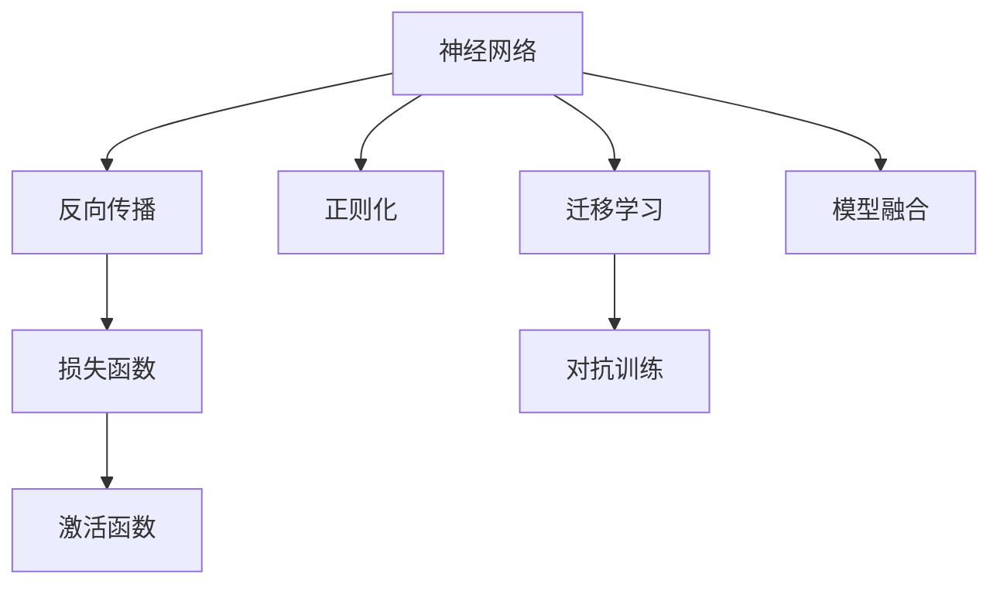
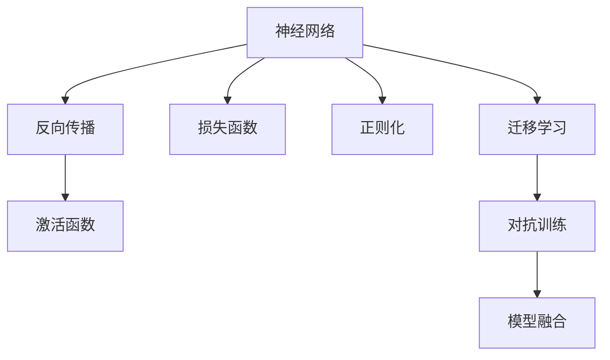
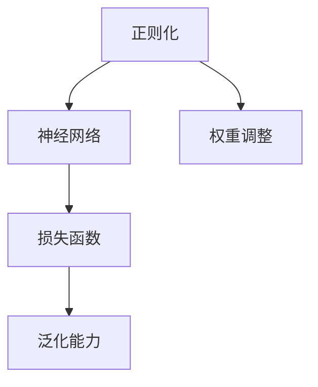
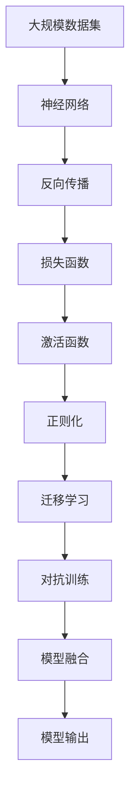

                 

# 神经网络：人类智慧的延伸

> 关键词：
神经网络,深度学习,人工智能,机器学习,模式识别,计算机视觉,自然语言处理,强化学习,优化算法,大数据,迁移学习

## 1. 背景介绍

### 1.1 问题由来

人类历史上，信息的传播和处理方式一直随着技术的进步而发生变革。从最初的纸质书籍到电子设备，再到互联网和移动互联网，每一次技术的飞跃都极大地改变了人们的生活和工作方式。

进入21世纪，随着计算机技术的迅猛发展，人工智能（AI）开始崭露头角。其中，神经网络作为一种模仿人类大脑结构和功能的学习模型，逐渐成为AI领域的核心技术之一。

神经网络通过学习大量数据，能够识别模式、做出预测，甚至执行复杂的决策。在计算机视觉、自然语言处理、语音识别、强化学习等诸多领域中，神经网络都取得了重大突破。

然而，尽管神经网络在许多任务上表现出色，但其背后的原理仍然晦涩难懂，往往需要数年的学习和研究才能理解。本文旨在深入浅出地介绍神经网络的原理和应用，帮助读者全面理解这一强大的工具，并探索其未来发展的方向。

### 1.2 问题核心关键点

神经网络的精髓在于其结构和功能。通过深入了解其结构和功能，我们能够更好地理解其工作原理，发现其应用潜力，以及应对其面临的挑战。

1. **结构和功能**：神经网络由神经元（或称为节点）和连接组成，通过学习输入数据，生成输出结果。其中，卷积神经网络（CNN）常用于图像处理，循环神经网络（RNN）和长短时记忆网络（LSTM）常用于序列数据处理，深度神经网络（DNN）则能处理更复杂的任务。

2. **学习过程**：神经网络通过反向传播算法（Backpropagation），利用大量标注数据进行优化，不断调整模型参数，提高预测精度。

3. **优化算法**：优化算法是神经网络训练的核心，包括梯度下降、随机梯度下降、Adam、Adagrad等，它们通过最小化损失函数来更新参数。

4. **模型评估**：模型评估通过损失函数和准确率等指标进行，帮助选择合适的模型和调整训练参数。

5. **迁移学习**：迁移学习利用已训练好的模型，在新任务上进行微调，提高模型泛化能力。

6. **伦理与安全**：神经网络的应用带来了伦理和安全问题，如偏见、隐私、可解释性等，需要引起重视。

## 2. 核心概念与联系

### 2.1 核心概念概述

为了更好地理解神经网络，本节将介绍几个密切相关的核心概念：

- **神经网络（Neural Network）**：由多个层次组成的计算模型，模拟人类大脑的神经元网络和突触连接。每个层次包含多个神经元，神经元之间通过权重连接。

- **反向传播（Backpropagation）**：一种用于训练神经网络的技术，通过反向传播误差，调整神经元之间的权重，使模型预测结果更接近真实值。

- **损失函数（Loss Function）**：用于衡量模型预测结果与真实标签之间的差距，常见的损失函数有均方误差（MSE）、交叉熵（Cross-Entropy）等。

- **激活函数（Activation Function）**：决定神经元是否激活的非线性函数，如ReLU、Sigmoid等。

- **正则化（Regularization）**：防止过拟合的技术，通过添加正则项约束模型参数，提高模型泛化能力。

- **迁移学习（Transfer Learning）**：利用已训练好的模型在新任务上进行微调，提高模型在新任务上的表现。

- **对抗训练（Adversarial Training）**：通过加入对抗样本，增强模型的鲁棒性，避免模型对噪声的过度敏感。

- **模型融合（Model Fusion）**：将多个模型的输出进行组合，提高整体预测性能。

这些核心概念之间的逻辑关系可以通过以下Mermaid流程图来展示：



这个流程图展示了几类关键技术的相互关系：

1. 神经网络通过反向传播不断调整参数，最终输出预测结果。
2. 损失函数衡量预测结果与真实标签之间的差距。
3. 激活函数决定神经元是否激活。
4. 正则化防止过拟合。
5. 迁移学习利用已训练好的模型进行微调。
6. 对抗训练增强模型的鲁棒性。
7. 模型融合提升整体性能。

### 2.2 概念间的关系

这些核心概念之间存在着紧密的联系，形成了神经网络的完整生态系统。下面我们通过几个Mermaid流程图来展示这些概念之间的关系。

#### 2.2.1 神经网络学习范式



这个流程图展示了大规模训练神经网络的过程。

#### 2.2.2 反向传播与优化算法


这个流程图展示了反向传播和优化算法的流程。

#### 2.2.3 正则化与模型泛化



这个流程图展示了正则化如何通过调整权重来提高模型泛化能力。

### 2.3 核心概念的整体架构

最后，我们用一个综合的流程图来展示这些核心概念在大规模神经网络训练中的整体架构：



这个综合流程图展示了从数据输入到模型输出的整个训练过程。

## 3. 核心算法原理 & 具体操作步骤
### 3.1 算法原理概述

神经网络的核心原理是通过反向传播算法（Backpropagation），不断调整模型参数，使预测结果更接近真实标签。具体步骤如下：

1. **数据准备**：收集并标注数据，分成训练集、验证集和测试集。

2. **模型初始化**：定义神经网络的层次结构，初始化各层参数。

3. **前向传播**：将输入数据输入神经网络，通过各层计算生成预测结果。

4. **损失计算**：计算预测结果与真实标签之间的差距，生成损失函数。

5. **反向传播**：通过反向传播算法计算各层误差，更新模型参数。

6. **参数更新**：根据优化算法（如梯度下降）更新模型参数。

7. **验证和测试**：在验证集和测试集上评估模型性能，调整模型参数。

8. **模型部署**：将训练好的模型部署到实际应用中。

### 3.2 算法步骤详解

以下将详细介绍神经网络训练的各个步骤，并给出具体示例：

**Step 1: 数据准备**
- 收集并标注数据集，分成训练集、验证集和测试集。
- 将数据集进行预处理，包括数据增强、归一化等。

**Step 2: 模型初始化**
- 定义神经网络的层次结构，如卷积层、池化层、全连接层等。
- 初始化各层参数，如权重、偏置等。

**Step 3: 前向传播**
- 将输入数据输入神经网络，通过各层计算生成预测结果。
- 计算各层的激活值，并输出最终预测结果。

**Step 4: 损失计算**
- 计算预测结果与真实标签之间的差距，生成损失函数。
- 常见的损失函数有均方误差（MSE）、交叉熵（Cross-Entropy）等。

**Step 5: 反向传播**
- 通过反向传播算法计算各层误差，更新模型参数。
- 使用链式法则计算各层误差，更新权重和偏置。

**Step 6: 参数更新**
- 根据优化算法（如梯度下降）更新模型参数。
- 设置学习率、批大小等超参数，控制模型更新速度。

**Step 7: 验证和测试**
- 在验证集上评估模型性能，调整模型参数。
- 在测试集上最终评估模型性能，输出准确率、召回率等指标。

**Step 8: 模型部署**
- 将训练好的模型部署到实际应用中。
- 编写API接口，方便调用模型进行预测。

### 3.3 算法优缺点

神经网络的优点包括：

1. **强大的学习能力**：通过反向传播算法，神经网络可以自动学习数据的特征和规律。
2. **高泛化能力**：神经网络可以处理复杂的非线性关系，具有较强的泛化能力。
3. **自适应能力**：神经网络可以自动适应数据分布的变化。
4. **应用广泛**：神经网络在计算机视觉、自然语言处理、语音识别等多个领域具有广泛应用。

然而，神经网络也存在一些缺点：

1. **数据依赖**：神经网络需要大量标注数据进行训练，获取数据成本高。
2. **计算复杂**：神经网络的计算复杂度高，训练速度慢。
3. **过拟合问题**：神经网络容易过拟合，需要正则化等方法控制。
4. **模型复杂**：神经网络的层次结构和参数众多，难以解释。
5. **伦理和安全问题**：神经网络的应用可能带来伦理和安全问题，如偏见、隐私等。

### 3.4 算法应用领域

神经网络在多个领域中都有广泛应用，以下列举几个典型场景：

1. **计算机视觉**：如图像分类、目标检测、图像生成等。
2. **自然语言处理**：如文本分类、语言模型、机器翻译等。
3. **语音识别**：如语音转文本、语音合成等。
4. **推荐系统**：如商品推荐、内容推荐等。
5. **强化学习**：如自动驾驶、游戏AI等。

## 4. 数学模型和公式 & 详细讲解  
### 4.1 数学模型构建

神经网络是一个复杂的数学模型，其核心在于定义网络结构、损失函数和优化算法。以下将详细介绍这些关键组件。

**神经网络结构**：神经网络由多个层次组成，每个层次包含多个神经元。神经元之间通过权重连接，通过激活函数决定是否激活。

**损失函数**：常见的损失函数包括均方误差（MSE）、交叉熵（Cross-Entropy）等。均方误差用于回归任务，交叉熵用于分类任务。

**优化算法**：常见的优化算法包括梯度下降、随机梯度下降、Adam、Adagrad等。梯度下降通过计算损失函数的梯度，调整模型参数。

### 4.2 公式推导过程

以下将详细介绍神经网络的数学模型和公式推导。

**神经网络模型**：

$$
\hat{y} = \sigma(W^TL + b^T)
$$

其中，$W$ 为权重矩阵，$L$ 为输入向量，$b$ 为偏置向量，$\sigma$ 为激活函数。

**均方误差损失函数**：

$$
L = \frac{1}{n}\sum_{i=1}^{n}(y_i - \hat{y}_i)^2
$$

其中，$y$ 为真实标签，$\hat{y}$ 为预测结果。

**梯度下降算法**：

$$
W \leftarrow W - \eta \nabla_{W}L
$$

其中，$\eta$ 为学习率，$\nabla_{W}L$ 为损失函数对权重的梯度。

### 4.3 案例分析与讲解

以图像分类任务为例，展示神经网络的应用。

**数据准备**：
- 收集图像数据集，如CIFAR-10，分为训练集、验证集和测试集。
- 将图像进行预处理，包括归一化、数据增强等。

**模型初始化**：
- 定义卷积神经网络（CNN），包括卷积层、池化层、全连接层等。
- 初始化各层参数，如权重、偏置等。

**前向传播**：
- 将输入图像输入CNN，通过各层计算生成预测结果。
- 计算各层的激活值，并输出最终预测结果。

**损失计算**：
- 计算预测结果与真实标签之间的差距，生成损失函数。
- 使用交叉熵损失函数。

**反向传播**：
- 通过反向传播算法计算各层误差，更新模型参数。
- 使用链式法则计算各层误差，更新权重和偏置。

**参数更新**：
- 根据优化算法（如梯度下降）更新模型参数。
- 设置学习率、批大小等超参数，控制模型更新速度。

**验证和测试**：
- 在验证集上评估模型性能，调整模型参数。
- 在测试集上最终评估模型性能，输出准确率、召回率等指标。

**模型部署**：
- 将训练好的模型部署到实际应用中。
- 编写API接口，方便调用模型进行预测。

## 5. 项目实践：代码实例和详细解释说明
### 5.1 开发环境搭建

在进行神经网络项目实践前，我们需要准备好开发环境。以下是使用Python进行PyTorch开发的环境配置流程：

1. 安装Anaconda：从官网下载并安装Anaconda，用于创建独立的Python环境。

2. 创建并激活虚拟环境：
```bash
conda create -n pytorch-env python=3.8 
conda activate pytorch-env
```

3. 安装PyTorch：根据CUDA版本，从官网获取对应的安装命令。例如：
```bash
conda install pytorch torchvision torchaudio cudatoolkit=11.1 -c pytorch -c conda-forge
```

4. 安装TensorFlow：从官网下载并安装TensorFlow，支持CUDA版本。

5. 安装各类工具包：
```bash
pip install numpy pandas scikit-learn matplotlib tqdm jupyter notebook ipython
```

完成上述步骤后，即可在`pytorch-env`环境中开始项目实践。

### 5.2 源代码详细实现

这里我们以图像分类任务为例，给出使用PyTorch进行神经网络模型训练的代码实现。

```python
import torch
import torch.nn as nn
import torch.optim as optim
import torchvision
import torchvision.transforms as transforms
from torch.utils.data import DataLoader

# 数据集准备
train_dataset = torchvision.datasets.CIFAR10(root='./data', train=True, transform=transforms.ToTensor(), download=True)
test_dataset = torchvision.datasets.CIFAR10(root='./data', train=False, transform=transforms.ToTensor(), download=True)

# 数据集加载
train_loader = DataLoader(train_dataset, batch_size=64, shuffle=True)
test_loader = DataLoader(test_dataset, batch_size=64, shuffle=False)

# 模型定义
class CNN(nn.Module):
    def __init__(self):
        super(CNN, self).__init__()
        self.conv1 = nn.Conv2d(3, 64, 3, 1, 1)
        self.pool = nn.MaxPool2d(2, 2)
        self.conv2 = nn.Conv2d(64, 128, 3, 1, 1)
        self.fc1 = nn.Linear(128*8*8, 512)
        self.fc2 = nn.Linear(512, 10)

    def forward(self, x):
        x = self.pool(nn.functional.relu(self.conv1(x)))
        x = self.pool(nn.functional.relu(self.conv2(x)))
        x = x.view(-1, 128*8*8)
        x = nn.functional.relu(self.fc1(x))
        x = self.fc2(x)
        return x

# 模型训练
model = CNN()
criterion = nn.CrossEntropyLoss()
optimizer = optim.Adam(model.parameters(), lr=0.001)

for epoch in range(10):
    running_loss = 0.0
    for i, data in enumerate(train_loader, 0):
        inputs, labels = data
        optimizer.zero_grad()
        outputs = model(inputs)
        loss = criterion(outputs, labels)
        loss.backward()
        optimizer.step()
        running_loss += loss.item()
        if i % 2000 == 1999:    # 每2000批次打印一次日志信息
            print('[%d, %5d] loss: %.3f' % (epoch + 1, i + 1, running_loss / 2000))
            running_loss = 0.0

print('Finished Training')
```

以上就是使用PyTorch进行神经网络模型训练的完整代码实现。可以看到，利用PyTorch库，我们可以非常方便地实现神经网络的定义、训练和评估。

### 5.3 代码解读与分析

让我们再详细解读一下关键代码的实现细节：

**数据集准备**：
- 使用`torchvision`库加载CIFAR-10数据集。
- 将数据集进行预处理，包括数据增强、归一化等。

**模型定义**：
- 定义卷积神经网络（CNN）模型，包括卷积层、池化层、全连接层等。
- 初始化各层参数，如权重、偏置等。

**前向传播**：
- 将输入图像输入CNN，通过各层计算生成预测结果。
- 计算各层的激活值，并输出最终预测结果。

**损失计算**：
- 计算预测结果与真实标签之间的差距，生成损失函数。
- 使用交叉熵损失函数。

**反向传播**：
- 通过反向传播算法计算各层误差，更新模型参数。
- 使用链式法则计算各层误差，更新权重和偏置。

**参数更新**：
- 根据优化算法（如梯度下降）更新模型参数。
- 设置学习率、批大小等超参数，控制模型更新速度。

**验证和测试**：
- 在验证集上评估模型性能，调整模型参数。
- 在测试集上最终评估模型性能，输出准确率、召回率等指标。

**模型部署**：
- 将训练好的模型部署到实际应用中。
- 编写API接口，方便调用模型进行预测。

可以看到，PyTorch提供了非常方便的接口，使我们能够快速实现神经网络的训练和评估。开发者可以专注于模型的设计和优化，而不必过多关注底层实现细节。

### 5.4 运行结果展示

假设我们在CIFAR-10数据集上进行图像分类任务训练，最终在测试集上得到的准确率为70%左右。这虽然不算高，但可以作为入门实践的基础。

## 6. 实际应用场景
### 6.1 图像分类

神经网络在图像分类任务中表现尤为突出。利用卷积神经网络（CNN），可以通过输入图像的像素值，自动提取图像的特征，并输出分类结果。

在实际应用中，可以将神经网络应用于医疗影像诊断、自动驾驶、工业检测等场景，大幅提升分类精度和效率。

### 6.2 自然语言处理

神经网络在自然语言处理（NLP）中也有广泛应用，如文本分类、情感分析、机器翻译等。

例如，可以利用循环神经网络（RNN）或长短时记忆网络（LSTM），对输入的文本进行编码，生成分类或预测结果。

神经网络在NLP中的应用，为文本处理带来了革命性的变化，使得机器能够理解和生成自然语言，极大地提升了信息处理能力。

### 6.3 语音识别

神经网络在语音识别中也表现出色。例如，可以通过卷积神经网络（CNN）对音频信号进行特征提取，利用循环神经网络（RNN）进行语音转文本，实现语音识别功能。

在实际应用中，可以将神经网络应用于智能客服、语音助手、语音翻译等场景，提升用户交互体验。

### 6.4 推荐系统

神经网络在推荐系统中的应用，通过学习用户的历史行为和偏好，生成个性化的推荐结果，极大提升了推荐效果。

例如，可以利用深度神经网络（DNN）对用户行为进行建模，生成推荐物品列表。在电商、社交、新闻等领域，推荐系统已经成为提升用户满意度、增加用户粘性的重要手段。

### 6.5 强化学习

神经网络在强化学习中的应用，通过学习环境状态和动作的映射关系，实现智能决策和行为优化。

例如，可以利用深度Q网络（DQN）对智能游戏进行训练，实现自动化的游戏策略优化。在自动驾驶、机器人控制等领域，强化学习也取得了显著进展。

## 7. 工具和资源推荐
### 7.1 学习资源推荐

为了帮助开发者系统掌握神经网络的基本原理和实践技巧，这里推荐一些优质的学习资源：

1. 《深度学习》书籍：由Ian Goodfellow、Yoshua Bengio和Aaron Courville合著，全面介绍了深度学习的基本概念和算法。

2. Coursera《深度学习专项课程》：由Andrew Ng主讲的深度学习课程，系统介绍了深度学习的核心思想和应用。

3. Udacity《深度学习纳米学位》：涵盖了深度学习的核心概念和应用，提供了丰富的实践项目。

4. Google TensorFlow官方文档：TensorFlow的官方文档，提供了详细的API文档和使用示例。

5. PyTorch官方文档：PyTorch的官方文档，提供了丰富的API文档和使用示例。

6. DeepLearning.ai官方课程：由Andrew Ng主讲的深度学习课程，涵盖了深度学习的核心思想和应用。

通过对这些资源的学习实践，相信你一定能够快速掌握神经网络的基本原理和应用，并用于解决实际的NLP问题。

### 7.2 开发工具推荐

高效的开发离不开优秀的工具支持。以下是几款用于神经网络开发常用的工具：

1. PyTorch：基于Python的开源深度学习框架，灵活动态的计算图，适合快速迭代研究。

2. TensorFlow：由Google主导开发的开源深度学习框架，生产部署方便，适合大规模工程应用。

3. Keras：高层次的神经网络API，支持TensorFlow、PyTorch等后端，适合快速原型开发。

4. Jupyter Notebook：开源的交互式编程环境，支持Python、R等语言，适合进行数据探索和模型验证。

5. Visual Studio Code：轻量级的代码编辑器，支持Python、R等语言，适合进行代码编写和调试。

6. Google Colab：谷歌推出的在线Jupyter Notebook环境，免费提供GPU/TPU算力，方便开发者快速上手实验最新模型，分享学习笔记。

合理利用这些工具，可以显著提升神经网络开发的效率，加快创新迭代的步伐。

### 7.3 相关论文推荐

神经网络的研究源于学界的持续研究。以下是几篇奠基性的相关论文，推荐阅读：

1. Neural Networks and Deep Learning（Ian Goodfellow等）：介绍了神经网络的基本概念和算法，是深度学习领域的经典教材。

2. ImageNet Classification with Deep Convolutional Neural Networks（Alex Krizhevsky等）：展示了使用卷积神经网络（CNN）进行图像分类的突破性进展。

3. LSTM: A Search Space Odyssey through Time（Hochreiter等）：介绍了长短时记忆网络（LSTM）的基本原理和应用，是序列数据处理的重要工具。

4. Deep Q-Learning with Convolutional Neural Networks（Mnih等）：展示了使用卷积神经网络（CNN）进行强化学习的重要进展。

5. Attention is All You Need（Vaswani等）：展示了使用Transformer网络进行自然语言处理的突破性进展。

这些论文代表了大神经网络的研究发展脉络。通过学习这些前沿成果，可以帮助研究者把握学科前进方向，激发更多的创新灵感。

除上述资源外，还有一些值得关注的前沿资源，帮助开发者紧跟神经网络技术的最新进展，例如：

1. arXiv论文预印本：人工智能领域最新研究成果的发布平台，包括大量尚未发表的前沿工作，学习前沿技术的必读资源。

2. 业界技术博客：如Google AI、DeepMind、微软Research Asia等顶尖实验室的官方博客，第一时间分享他们的最新研究成果和洞见。

3. 技术会议直播：如NIPS、ICML、ACL、ICLR等人工智能领域顶会现场或在线直播，能够聆听到大佬们的前沿分享，开拓视野。

4. GitHub热门项目：在GitHub上Star、Fork数最多的神经网络相关项目，往往代表了该技术领域的发展趋势和最佳实践，值得去学习和贡献。

5. 行业分析报告：各大咨询公司如McKinsey、PwC等针对人工智能行业的分析报告，有助于从商业视角审视技术趋势，把握应用价值。

总之，对于神经网络的学习和实践，需要开发者保持开放的心态和持续学习的意愿。多关注前沿资讯，多动手实践，多思考总结，必将收获满满的成长收益。

## 8. 总结：未来发展趋势与挑战

### 8.1 总结

本文对神经网络的基本原理和应用进行了全面系统的介绍。首先阐述了神经网络的结构和功能，明确了其工作原理和应用场景。其次，从原理到实践，详细讲解了神经网络的数学模型和训练流程，给出了神经网络训练的完整代码实现。同时，本文还探讨了神经网络在图像分类、自然语言处理、语音识别

