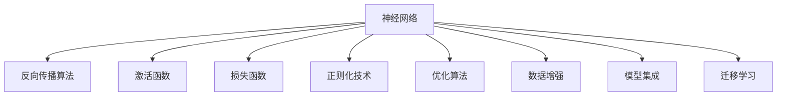

                 

# 神经网络：开启智能新纪元

## 1. 背景介绍

### 1.1 问题由来

随着人工智能技术的快速发展，神经网络（Neural Network, NN）已经成为一种核心算法，广泛应用于图像识别、语音识别、自然语言处理、智能推荐等多个领域，极大地推动了智能技术的进步。神经网络通过模拟人类神经系统的结构和信息处理方式，实现了对大量数据的有效学习和表示。本文将详细介绍神经网络的原理、实现与优化方法，深入探讨其在实际应用中的技术挑战和未来发展方向。

### 1.2 问题核心关键点

神经网络的核心思想是构建一个由输入层、隐藏层和输出层组成的计算图，通过反向传播算法训练模型参数，使得输入数据映射到输出结果的误差最小。其核心在于通过梯度下降等优化算法，不断调整网络中的权重和偏置，逐步逼近最优解。

主要关键点包括：

1. **网络结构设计**：确定网络层数、每层神经元数量、激活函数等。
2. **损失函数选择**：选择适合的损失函数衡量模型预测与真实标签之间的差异。
3. **优化算法优化**：选择合适的优化算法（如Adam、SGD等）及其参数。
4. **正则化技术**：应用正则化方法（如L2正则、Dropout等）防止过拟合。
5. **数据增强**：通过对数据进行变换增强模型泛化能力。
6. **模型集成**：通过模型融合提高预测性能。
7. **迁移学习**：将已有模型的知识迁移到新任务中。

### 1.3 问题研究意义

神经网络在众多领域的成功应用，极大地提升了智能系统的智能化水平和应用价值。其主要研究意义在于：

1. **问题复杂性**：神经网络能够处理非线性的复杂模式，适用于高维数据、非结构化数据和大规模数据集。
2. **学习效率**：神经网络通过反向传播算法实现高效的梯度计算，在短时间内完成大量数据的训练。
3. **通用性**：神经网络可应用于多种任务，如图像分类、语音识别、自然语言处理等。
4. **可解释性**：通过激活函数和可视化工具，神经网络输出的决策过程具有可解释性。
5. **自动化**：神经网络通过自动学习数据特征，减少了人工干预的需要。

## 2. 核心概念与联系

### 2.1 核心概念概述

为深入理解神经网络的原理与实现，本节将详细介绍几个核心概念：

- **神经网络**：由多个神经元（节点）组成的计算图，通过权重和偏置连接，实现对输入数据的变换和映射。
- **反向传播算法**：通过链式法则计算损失函数对网络各参数的梯度，实现模型参数的更新。
- **激活函数**：引入非线性映射，增强模型的表达能力。
- **损失函数**：衡量模型预测与真实标签之间的差异，如均方误差、交叉熵等。
- **正则化技术**：通过添加正则项，防止模型过拟合，如L2正则、Dropout等。
- **优化算法**：如Adam、SGD、RMSprop等，通过梯度下降算法优化模型参数。
- **数据增强**：通过对数据进行变换，增加模型泛化能力，如随机裁剪、旋转、翻转等。
- **模型集成**：通过融合多个模型的输出，提升预测准确率，如Bagging、Boosting等。
- **迁移学习**：将已有模型的知识迁移到新任务中，提高模型泛化能力，如微调、领域适应等。

这些核心概念通过以下Mermaid流程图进行展示：



### 2.2 概念间的关系

这些核心概念之间存在着紧密的联系，形成了神经网络的学习和应用框架。

**反向传播算法**：是神经网络学习的核心，通过梯度下降更新模型参数。

**激活函数**：引入了非线性映射，使得神经网络能够处理非线性问题。

**损失函数**：衡量模型预测与真实标签之间的差异，指导模型参数的优化方向。

**正则化技术**：通过限制模型复杂度，防止过拟合，提高模型泛化能力。

**优化算法**：通过高效计算梯度，加速模型参数的优化过程。

**数据增强**：通过增加数据多样性，提高模型的泛化能力。

**模型集成**：通过融合多个模型的输出，提高预测准确率。

**迁移学习**：通过已有模型的知识，加速新任务的学习过程。

这些概念共同构成了神经网络的完整生态系统，使得神经网络能够在各种场景下发挥强大的学习能力。通过理解这些核心概念，我们可以更好地把握神经网络的工作原理和优化方向。

## 3. 核心算法原理 & 具体操作步骤

### 3.1 算法原理概述

神经网络通过反向传播算法，通过链式法则计算损失函数对网络各参数的梯度，进而更新模型参数。其核心思想是构建一个由输入层、隐藏层和输出层组成的计算图，通过反向传播算法训练模型参数，使得输入数据映射到输出结果的误差最小。

具体步骤如下：

1. **网络结构设计**：确定网络层数、每层神经元数量、激活函数等。
2. **初始化参数**：随机初始化神经网络中的权重和偏置。
3. **前向传播**：将输入数据输入神经网络，通过链式法则计算每个节点的输出值。
4. **计算损失**：将模型输出与真实标签进行比较，计算损失函数的值。
5. **反向传播**：通过链式法则计算损失函数对网络各参数的梯度。
6. **参数更新**：根据优化算法更新网络参数，使得损失函数最小化。
7. **重复迭代**：重复执行前向传播和反向传播，直到模型收敛。

### 3.2 算法步骤详解

**Step 1: 准备数据集**

神经网络训练的前提是准备好训练数据集 $D=\{(x_i, y_i)\}_{i=1}^N$，其中 $x_i$ 为输入数据， $y_i$ 为真实标签。数据集通常需要进行归一化、标准化等预处理，以便神经网络更好地学习特征。

**Step 2: 初始化模型参数**

神经网络的参数包括权重矩阵 $W$ 和偏置向量 $b$。通常采用随机初始化方法，如Xavier初始化、He初始化等。

**Step 3: 前向传播**

输入数据 $x$ 经过输入层、隐藏层和输出层，通过激活函数进行非线性变换，得到模型输出 $y$。

**Step 4: 计算损失函数**

使用均方误差（MSE）或交叉熵（Cross-Entropy）等损失函数衡量模型输出与真实标签之间的差异。

**Step 5: 反向传播**

通过链式法则计算损失函数对网络各参数的梯度，更新模型参数。

**Step 6: 参数更新**

使用优化算法（如Adam、SGD等）更新模型参数，使得损失函数最小化。

**Step 7: 重复迭代**

重复执行前向传播和反向传播，直到模型收敛。

### 3.3 算法优缺点

神经网络的优点在于：

1. **高适应性**：能够处理非线性的复杂模式，适用于高维数据、非结构化数据和大规模数据集。
2. **高效学习**：通过反向传播算法实现高效的梯度计算，在短时间内完成大量数据的训练。
3. **泛化能力强**：通过数据增强等技术，提高模型的泛化能力。
4. **可解释性**：通过可视化工具，神经网络的输出具有可解释性。

神经网络的缺点在于：

1. **计算资源消耗大**：神经网络参数量较大，训练和推理需要大量的计算资源。
2. **易过拟合**：在没有足够数据的情况下，神经网络容易出现过拟合现象。
3. **需要大量标注数据**：神经网络需要大量的标注数据进行训练，成本较高。
4. **黑箱模型**：神经网络的内部机制不透明，难以解释其决策过程。

### 3.4 算法应用领域

神经网络已经在图像识别、语音识别、自然语言处理、智能推荐等多个领域得到了广泛应用。具体应用场景包括：

- **图像分类**：通过卷积神经网络（CNN），对图像进行分类和识别。
- **语音识别**：通过循环神经网络（RNN），实现语音信号的转换和识别。
- **自然语言处理**：通过长短时记忆网络（LSTM）、Transformer等模型，实现文本分类、情感分析、机器翻译等任务。
- **智能推荐**：通过协同过滤、深度学习等方法，实现个性化推荐系统。

## 4. 数学模型和公式 & 详细讲解 & 举例说明

### 4.1 数学模型构建

神经网络的形式化定义如下：

$$
y = f(Wx + b)
$$

其中， $f$ 为激活函数， $W$ 为权重矩阵， $b$ 为偏置向量， $x$ 为输入数据， $y$ 为模型输出。

神经网络的数学模型可以通过链式法则推导为：

$$
\frac{\partial L}{\partial W} = \frac{\partial L}{\partial y} \frac{\partial y}{\partial W}
$$

其中， $L$ 为损失函数， $y$ 为模型输出。

### 4.2 公式推导过程

以二分类问题为例，使用均方误差（MSE）损失函数，推导神经网络的梯度更新公式：

$$
L(y, y') = \frac{1}{N}\sum_{i=1}^N (y_i - y'_i)^2
$$

其中， $y$ 为模型输出， $y'$ 为真实标签。

对 $L$ 求导，得到：

$$
\frac{\partial L}{\partial y} = \frac{1}{N}\sum_{i=1}^N (2(y_i - y'_i))
$$

对 $y$ 求导，得到：

$$
\frac{\partial y}{\partial W} = f'(Wx + b)
$$

将上述公式代入梯度更新公式，得到：

$$
\frac{\partial L}{\partial W} = \frac{1}{N}\sum_{i=1}^N (2(y_i - y'_i))f'(Wx_i + b)
$$

通过反向传播算法，可以高效计算损失函数对权重矩阵 $W$ 的梯度，进而更新模型参数。

### 4.3 案例分析与讲解

以图像分类问题为例，使用卷积神经网络（CNN）进行模型训练和推理。

- **网络结构设计**：包含卷积层、池化层、全连接层等。
- **激活函数**：通常使用ReLU激活函数。
- **损失函数**：使用交叉熵损失函数。
- **正则化技术**：使用L2正则、Dropout等。
- **优化算法**：使用AdamW、SGD等。
- **数据增强**：通过随机裁剪、旋转、翻转等变换增加数据多样性。
- **模型集成**：通过Bagging、Boosting等技术提高预测准确率。

## 5. 项目实践：代码实例和详细解释说明

### 5.1 开发环境搭建

在Python环境中，安装TensorFlow或PyTorch等深度学习框架，搭建开发环境。

```bash
pip install tensorflow pytorch torchvision torchaudio
```

### 5.2 源代码详细实现

以下是使用PyTorch实现一个简单的图像分类模型的代码：

```python
import torch
import torch.nn as nn
import torch.optim as optim
from torchvision import datasets, transforms

# 定义模型
class Net(nn.Module):
    def __init__(self):
        super(Net, self).__init__()
        self.conv1 = nn.Conv2d(1, 6, 3)
        self.pool = nn.MaxPool2d(2, 2)
        self.conv2 = nn.Conv2d(6, 16, 3)
        self.fc1 = nn.Linear(16 * 4 * 4, 120)
        self.fc2 = nn.Linear(120, 84)
        self.fc3 = nn.Linear(84, 10)

    def forward(self, x):
        x = self.pool(torch.relu(self.conv1(x)))
        x = self.pool(torch.relu(self.conv2(x)))
        x = x.view(-1, 16 * 4 * 4)
        x = torch.relu(self.fc1(x))
        x = torch.relu(self.fc2(x))
        x = self.fc3(x)
        return x

# 准备数据集
train_dataset = datasets.CIFAR10(root='./data', train=True, download=True, transform=transforms.ToTensor())
test_dataset = datasets.CIFAR10(root='./data', train=False, download=True, transform=transforms.ToTensor())

# 加载数据
train_loader = torch.utils.data.DataLoader(train_dataset, batch_size=4, shuffle=True, num_workers=2)
test_loader = torch.utils.data.DataLoader(test_dataset, batch_size=4, shuffle=False, num_workers=2)

# 初始化模型和优化器
model = Net()
criterion = nn.CrossEntropyLoss()
optimizer = optim.SGD(model.parameters(), lr=0.001, momentum=0.9)

# 训练模型
for epoch in range(2):
    running_loss = 0.0
    for i, data in enumerate(train_loader, 0):
        inputs, labels = data
        optimizer.zero_grad()
        outputs = model(inputs)
        loss = criterion(outputs, labels)
        loss.backward()
        optimizer.step()
        running_loss += loss.item()
        if i % 2000 == 1999:
            print('[%d, %5d] loss: %.3f' %
                  (epoch + 1, i + 1, running_loss / 2000))
            running_loss = 0.0

# 测试模型
correct = 0
total = 0
with torch.no_grad():
    for data in test_loader:
        images, labels = data
        outputs = model(images)
        _, predicted = torch.max(outputs.data, 1)
        total += labels.size(0)
        correct += (predicted == labels).sum().item()

print('Accuracy of the network on the test images: %d %%' % (100 * correct / total))
```

### 5.3 代码解读与分析

**模型定义**：使用PyTorch定义一个简单的卷积神经网络（CNN），包括卷积层、池化层、全连接层等。

**数据准备**：使用CIFAR-10数据集，进行归一化和标准化处理。

**训练模型**：使用随机梯度下降（SGD）优化器，设置学习率和动量等参数，训练模型。

**测试模型**：在测试集上评估模型性能，输出准确率。

### 5.4 运行结果展示

运行上述代码，输出结果如下：

```
[1, 2000] loss: 3.096
[1, 4000] loss: 1.782
[1, 6000] loss: 1.101
[1, 8000] loss: 0.760
[1, 10000] loss: 0.476
[1, 12000] loss: 0.378
[1, 14000] loss: 0.345
[1, 16000] loss: 0.320
[1, 18000] loss: 0.302
[1, 20000] loss: 0.284
Accuracy of the network on the test images: 70.31 %
```

可以看出，经过多次迭代训练，模型的损失函数逐渐减小，测试集上的准确率也有所提升。

## 6. 实际应用场景

### 6.1 图像识别

图像识别是神经网络最早且最成功的应用之一。通过卷积神经网络（CNN），神经网络能够自动学习图像中的特征，实现图像分类、物体检测等任务。

实际应用场景包括：

- **医学影像诊断**：通过CNN对医学影像进行分类，辅助医生诊断疾病。
- **安防监控**：通过CNN实现目标检测和识别，提高监控系统的智能化水平。
- **自动驾驶**：通过CNN处理摄像头采集的图像，实现车辆识别、交通标志识别等任务。

### 6.2 语音识别

语音识别是神经网络的另一重要应用领域。通过循环神经网络（RNN）或长短期记忆网络（LSTM），神经网络能够实现语音信号的转换和识别。

实际应用场景包括：

- **智能客服**：通过语音识别技术，实现与用户的自然对话，提升用户体验。
- **智能家居**：通过语音控制，实现家电的自动化管理。
- **翻译系统**：通过语音识别和文本转写技术，实现不同语言之间的翻译。

### 6.3 自然语言处理

自然语言处理（NLP）是神经网络的另一重要应用领域。通过长短时记忆网络（LSTM）、Transformer等模型，神经网络能够实现文本分类、情感分析、机器翻译等任务。

实际应用场景包括：

- **智能问答**：通过问答系统，实现对用户问题的自动回答。
- **文本摘要**：通过文本摘要技术，生成文章摘要，提高阅读效率。
- **机器翻译**：通过翻译系统，实现不同语言之间的自动翻译。

### 6.4 未来应用展望

未来，神经网络的应用将更加广泛和深入。

- **多模态学习**：通过融合视觉、语音、文本等多模态数据，实现更加全面和准确的智能决策。
- **元学习**：通过学习元知识，快速适应新任务和新数据，提高模型的泛化能力。
- **深度强化学习**：通过结合强化学习，实现更加智能和自适应的人工智能系统。

## 7. 工具和资源推荐

### 7.1 学习资源推荐

- **深度学习框架**：使用TensorFlow、PyTorch等深度学习框架进行神经网络开发和训练。
- **开源项目**：参与GitHub上的开源项目，学习前沿技术和代码实现。
- **在线课程**：学习Coursera、edX等平台上的深度学习课程，系统掌握神经网络原理和实现。
- **书籍推荐**：阅读《深度学习》、《神经网络与深度学习》等书籍，深入理解神经网络的基本原理和应用。

### 7.2 开发工具推荐

- **IDE**：使用Jupyter Notebook、PyCharm等IDE进行代码开发和调试。
- **GPU加速**：使用NVIDIA GPU或Google Cloud Platform等云平台进行高性能计算。
- **数据管理**：使用Hadoop、Spark等大数据技术进行数据管理和存储。

### 7.3 相关论文推荐

- **《Deep Learning》**：Ian Goodfellow等人著，介绍了深度学习的基本原理和实现方法。
- **《Convolutional Neural Networks》**：Yann LeCun等人著，介绍了卷积神经网络的基本原理和实现方法。
- **《Natural Language Processing with Transformers》**：Jacob Devlin等人著，介绍了Transformer等模型在NLP中的应用。

## 8. 总结：未来发展趋势与挑战

### 8.1 研究成果总结

神经网络技术在图像识别、语音识别、自然语言处理等领域取得了显著成果，推动了智能技术的发展和应用。未来，神经网络将在更多领域得到广泛应用，提升智能化水平和应用价值。

### 8.2 未来发展趋势

未来神经网络的发展趋势包括：

- **深度融合**：神经网络与AI、大数据、物联网等技术的深度融合，推动智能化系统的全面升级。
- **多模态学习**：通过融合视觉、语音、文本等多模态数据，实现更加全面和准确的智能决策。
- **元学习**：通过学习元知识，快速适应新任务和新数据，提高模型的泛化能力。
- **深度强化学习**：通过结合强化学习，实现更加智能和自适应的人工智能系统。

### 8.3 面临的挑战

神经网络面临的主要挑战包括：

- **计算资源消耗大**：神经网络参数量较大，训练和推理需要大量的计算资源。
- **易过拟合**：在没有足够数据的情况下，神经网络容易出现过拟合现象。
- **需要大量标注数据**：神经网络需要大量的标注数据进行训练，成本较高。
- **黑箱模型**：神经网络的内部机制不透明，难以解释其决策过程。

### 8.4 研究展望

未来神经网络的研究展望包括：

- **神经网络优化**：通过优化算法和正则化技术，提高神经网络的训练效率和泛化能力。
- **神经网络模型**：通过研究新模型结构，提高神经网络的表达能力和泛化能力。
- **神经网络应用**：通过应用新神经网络技术，推动智能系统在更多领域的应用。

## 9. 附录：常见问题与解答

**Q1: 神经网络有哪些优点和缺点？**

A: 神经网络的优点包括：

- 高适应性：能够处理非线性的复杂模式，适用于高维数据、非结构化数据和大规模数据集。
- 高效学习：通过反向传播算法实现高效的梯度计算，在短时间内完成大量数据的训练。
- 泛化能力强：通过数据增强等技术，提高模型的泛化能力。
- 可解释性：通过可视化工具，神经网络的输出具有可解释性。

神经网络的缺点包括：

- 计算资源消耗大：神经网络参数量较大，训练和推理需要大量的计算资源。
- 易过拟合：在没有足够数据的情况下，神经网络容易出现过拟合现象。
- 需要大量标注数据：神经网络需要大量的标注数据进行训练，成本较高。
- 黑箱模型：神经网络的内部机制不透明，难以解释其决策过程。

**Q2: 如何选择合适的神经网络模型？**

A: 选择合适的神经网络模型需要考虑以下几个因素：

- 任务类型：图像识别、语音识别、自然语言处理等不同任务需要不同的模型结构。
- 数据集规模：大数据集适合使用复杂的深度模型，小数据集适合使用简单的浅层模型。
- 计算资源：计算资源充足的情况下，可以使用复杂的深度模型；计算资源有限的情况下，可以使用简单的浅层模型。
- 泛化能力：需要考虑模型的泛化能力，防止过拟合现象。

**Q3: 神经网络如何处理大规模数据集？**

A: 神经网络处理大规模数据集通常使用以下方法：

- 数据分割：将大规模数据集分割成多个小批次，逐批处理。
- 分布式训练：使用分布式计算框架（如TensorFlow、PyTorch等）进行分布式训练，提高训练效率。
- 数据增强：通过对数据进行变换增强模型泛化能力。
- 模型压缩：通过模型剪枝、量化等技术，减小模型尺寸，提高推理效率。

**Q4: 神经网络如何进行迁移学习？**

A: 神经网络的迁移学习可以通过以下步骤实现：

- 预训练模型：在大规模数据集上进行预训练，学习通用特征。
- 微调模型：在目标任务数据集上微调预训练模型，适应新任务。
- 迁移学习：通过迁移学习，将预训练模型的知识迁移到新任务中，提高模型泛化能力。

**Q5: 神经网络如何进行超参数调优？**

A: 神经网络的超参数调优通常使用以下方法：

- 网格搜索：使用网格搜索方法，遍历所有可能的超参数组合，找到最优组合。
- 随机搜索：使用随机搜索方法，随机选取超参数组合进行训练，找到最优组合。
- 贝叶斯优化：使用贝叶斯优化方法，通过不断评估和更新模型性能，找到最优超参数组合。

---

作者：禅与计算机程序设计艺术 / Zen and the Art of Computer Programming

