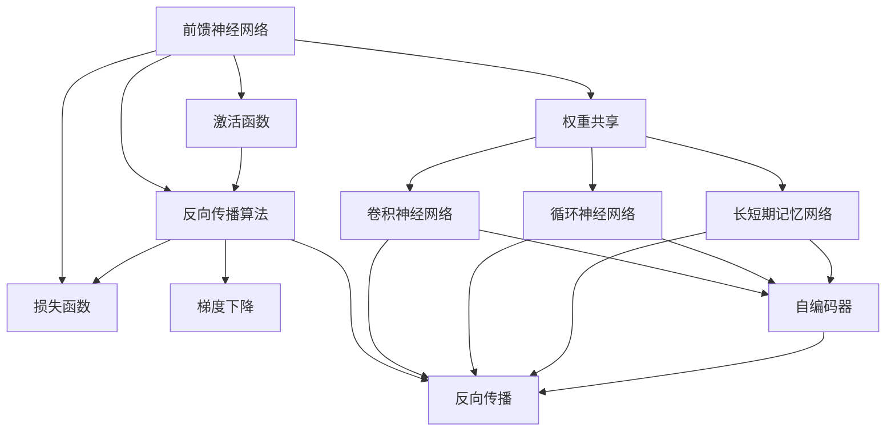

                 

# 神经网络：改变世界的技术

> 关键词：神经网络,深度学习,人工智能,机器学习,计算机视觉,自然语言处理

## 1. 背景介绍

### 1.1 问题由来
神经网络作为一种强大的机器学习模型，在过去的几十年里，已经从理论研究走入实际应用，并深刻改变了各行各业的面貌。它通过模拟人脑的神经元处理信息的方式，实现对复杂数据的建模和预测，具有强大的泛化能力和适应性。从最初的感知器模型，到多层感知器(MLP)，再到深度神经网络(DNN)，神经网络在图像识别、语音识别、自然语言处理等领域取得了显著成果。

### 1.2 问题核心关键点
神经网络的核心理论主要包括：
- 前馈神经网络(Feedforward Neural Network, FNN)：最基本的神经网络结构，包含输入层、隐藏层和输出层，各层之间通过权值相连，通过正向传播计算输出。
- 反向传播算法(Backpropagation Algorithm)：用于训练神经网络的优化算法，通过反向传播损失函数对网络参数进行更新，优化模型性能。
- 激活函数(Activation Function)：用于引入非线性，实现复杂函数映射，常见的有sigmoid、ReLU等。
- 损失函数(Loss Function)：用于衡量模型预测与真实标签之间的差异，常见的有交叉熵、均方误差等。

这些核心概念共同构成了神经网络的理论基础和计算框架，使得神经网络能够在处理非线性、高维数据时展现出显著优势。

### 1.3 问题研究意义
神经网络在多个领域取得了令人瞩目的成就，推动了人工智能技术的产业化进程，对人类社会的方方面面产生了深远影响：

1. 医疗领域：神经网络被用于疾病诊断、影像分析、基因研究等，提升了疾病诊断的准确性和效率。
2. 自动驾驶：神经网络被应用于车辆感知、路径规划、决策控制等环节，推动了自动驾驶技术的突破。
3. 金融服务：神经网络被用于风险评估、信用评分、投资策略等，提高了金融决策的科学性和可靠性。
4. 智能制造：神经网络被用于生产调度、质量检测、设备维护等，推动了制造业的数字化转型。
5. 社交媒体：神经网络被应用于内容推荐、情感分析、用户行为预测等，优化了用户使用体验。
6. 教育培训：神经网络被用于个性化教学、学习效果评估、智能题库等，提升了教育质量和学习效果。

通过这些应用案例，我们可以看到神经网络正在成为各行各业不可或缺的技术手段，推动了科技和社会的发展。未来，随着神经网络技术的不断成熟和创新，将有更多的行业和领域从中受益。

## 2. 核心概念与联系

### 2.1 核心概念概述

为了更好地理解神经网络的核心概念及其相互关系，本节将详细解释这些关键概念及其作用。

- 前馈神经网络(FNN)：前馈神经网络是最基本、最简单的神经网络结构，包含输入层、隐藏层和输出层。输入层接收外部数据，隐藏层通过非线性激活函数进行特征提取，输出层生成最终预测结果。

- 反向传播算法(BP)：反向传播算法是一种用于训练神经网络的优化算法，通过反向传播损失函数对网络参数进行更新，优化模型性能。具体流程包括正向传播、误差计算、反向传播、参数更新等步骤。

- 激活函数(Activation Function)：激活函数用于引入非线性，实现复杂函数映射。常见的激活函数包括sigmoid、ReLU、Tanh等。其中，ReLU因其简单的计算特性和非线性效果，被广泛应用于深度神经网络中。

- 损失函数(Loss Function)：损失函数用于衡量模型预测与真实标签之间的差异，常见的损失函数包括交叉熵、均方误差等。交叉熵损失常用于分类任务，均方误差损失常用于回归任务。

- 梯度下降(Gradient Descent)：梯度下降是一种基于梯度信息的优化算法，通过不断调整参数以最小化损失函数，从而达到模型优化的目的。

- 反向传播(Backpropagation)：反向传播是梯度下降算法在神经网络中的应用，通过反向传播损失函数对网络参数进行更新，实现参数优化。

- 权重共享(Weight Sharing)：在深度神经网络中，通过将不同层的权重参数共享，可以减少网络参数量，提高模型泛化能力。

- 卷积神经网络(CNN)：卷积神经网络是一种针对图像、视频等高维数据设计的神经网络结构，通过卷积和池化操作提取局部特征，实现空间信息的高效编码。

- 循环神经网络(RNN)：循环神经网络是一种针对时间序列数据的神经网络结构，通过循环连接实现序列信息的传递和处理。

- 长短期记忆网络(LSTM)：长短期记忆网络是一种特殊形式的循环神经网络，通过门控机制解决长序列数据的信息遗忘问题。

- 自编码器(Autocoder)：自编码器是一种无监督学习模型，通过将输入数据压缩为低维编码，再从编码中重构原始数据，实现数据的降维和特征学习。

### 2.2 概念间的关系

这些核心概念之间存在着紧密的联系，形成了神经网络的基本框架和计算流程。以下是这些概念间的关系示意图：



这个流程图展示了神经网络的基本结构和计算流程，包括前馈神经网络、激活函数、损失函数、反向传播算法等核心概念，以及一些常见的变体结构和优化算法。

## 3. 核心算法原理 & 具体操作步骤
### 3.1 算法原理概述

神经网络通过模拟人脑的神经元处理信息的方式，实现对复杂数据的建模和预测。其核心算法原理主要包括前向传播和反向传播两个部分。

前向传播是神经网络的基本计算过程，通过正向传递数据，从输入层到输出层逐层计算，最终生成预测结果。具体步骤如下：
1. 将输入数据输入到输入层。
2. 在隐藏层进行特征提取和非线性变换，通过激活函数引入非线性。
3. 在输出层生成预测结果，通过线性变换将特征映射为输出。

反向传播是神经网络的优化算法，通过计算损失函数对参数的梯度，实现参数更新和模型优化。具体步骤如下：
1. 计算预测输出与真实标签之间的误差。
2. 反向传播误差，计算每个参数的梯度。
3. 根据梯度下降算法更新参数，最小化损失函数。

### 3.2 算法步骤详解

以下是神经网络训练的详细步骤，包括数据准备、模型定义、损失函数定义、优化器选择和训练过程：

**Step 1: 准备训练数据**
- 收集标注数据集，将数据划分为训练集、验证集和测试集。
- 对数据进行预处理，如归一化、标准化、填充等。

**Step 2: 定义神经网络模型**
- 使用深度学习框架如TensorFlow、PyTorch等定义神经网络结构。
- 设置输入层、隐藏层和输出层的神经元数量。
- 定义激活函数和损失函数。

**Step 3: 选择优化器**
- 选择常用的优化器如SGD、Adam、RMSprop等。
- 设置学习率、批大小等超参数。

**Step 4: 定义训练流程**
- 定义训练循环，按批次读取训练集。
- 在每个批次上执行前向传播和反向传播。
- 使用优化器更新参数。
- 在每个epoch结束时，计算验证集上的损失函数。

**Step 5: 评估模型性能**
- 在测试集上评估模型性能，计算损失函数和准确率等指标。
- 绘制损失函数曲线和准确率曲线，观察模型训练过程。

### 3.3 算法优缺点

神经网络的优点包括：
- 强大的泛化能力：神经网络能够学习数据的复杂特征，具有较强的泛化能力。
- 高度的灵活性：神经网络结构灵活，可以根据具体任务设计不同的网络结构。
- 高效的特征提取：神经网络能够自动学习数据的特征，无需手动提取特征。
- 快速的迭代优化：通过反向传播算法，神经网络能够高效地更新参数，快速收敛。

神经网络的缺点包括：
- 过拟合问题：神经网络在训练数据集上过拟合，难以泛化到新数据集。
- 参数量大：神经网络的参数量较大，训练和推理所需的时间和内存较多。
- 黑盒模型：神经网络的内部机制复杂，难以解释其预测过程。
- 梯度消失/爆炸问题：在深度网络中，梯度在反向传播过程中可能会消失或爆炸，导致训练困难。

### 3.4 算法应用领域

神经网络在多个领域取得了广泛应用，具体包括：

- 计算机视觉：神经网络在图像识别、目标检测、图像生成等领域具有显著优势。例如，CNN被广泛应用于图像分类、目标检测等任务。

- 自然语言处理：神经网络在语言建模、机器翻译、文本生成等领域具有重要应用。例如，RNN、LSTM被广泛应用于语言建模和机器翻译。

- 语音识别：神经网络在语音识别、语音合成等领域具有重要应用。例如，卷积神经网络和循环神经网络被广泛应用于语音识别和语音合成。

- 信号处理：神经网络在信号处理、图像处理等领域具有重要应用。例如，自编码器被广泛应用于图像去噪、特征提取等任务。

- 生物信息学：神经网络在蛋白质结构预测、基因序列分析等领域具有重要应用。例如，神经网络被应用于蛋白质序列的分类和结构预测。

## 4. 数学模型和公式 & 详细讲解  
### 4.1 数学模型构建

神经网络的数学模型可以表示为：
$$
f(\mathbf{x}; \mathbf{W}, \mathbf{b}) = \mathbf{W}^T\mathbf{a}(\mathbf{x}) + \mathbf{b}
$$
其中，$f(\mathbf{x}; \mathbf{W}, \mathbf{b})$表示神经网络的输出，$\mathbf{x}$表示输入向量，$\mathbf{W}$表示权重矩阵，$\mathbf{b}$表示偏置向量，$\mathbf{a}(\mathbf{x})$表示激活函数。

### 4.2 公式推导过程

以单层前馈神经网络为例，其数学模型可以表示为：
$$
y_i = \sum_{j=1}^{n} w_{ij} x_j + b_i
$$
其中，$y_i$表示第$i$个神经元的输出，$x_j$表示第$j$个输入特征，$w_{ij}$表示权重系数，$b_i$表示偏置项。

其梯度下降优化的目标函数为：
$$
J(\mathbf{w}, \mathbf{b}) = \frac{1}{2} \sum_{i=1}^{m} (y_i - \hat{y}_i)^2
$$
其中，$J(\mathbf{w}, \mathbf{b})$表示损失函数，$y_i$表示真实标签，$\hat{y}_i$表示模型预测结果，$m$表示样本数。

根据链式法则，梯度下降优化的目标函数可以表示为：
$$
\nabla_{\mathbf{w}, \mathbf{b}} J(\mathbf{w}, \mathbf{b}) = \frac{\partial J}{\partial \mathbf{w}} = \frac{\partial}{\partial \mathbf{w}} \frac{1}{2} \sum_{i=1}^{m} (y_i - \hat{y}_i)^2
$$

### 4.3 案例分析与讲解

以二分类问题为例，神经网络的损失函数可以表示为：
$$
J(\mathbf{w}, \mathbf{b}) = \frac{1}{2} \sum_{i=1}^{m} [y_i \log \hat{y}_i + (1 - y_i) \log (1 - \hat{y}_i)]
$$
其中，$\log$表示自然对数，$\hat{y}_i$表示模型预测结果，$y_i$表示真实标签，$m$表示样本数。

其梯度下降优化的目标函数可以表示为：
$$
\nabla_{\mathbf{w}, \mathbf{b}} J(\mathbf{w}, \mathbf{b}) = \frac{\partial J}{\partial \mathbf{w}} = \frac{\partial}{\partial \mathbf{w}} \frac{1}{2} \sum_{i=1}^{m} [y_i \log \hat{y}_i + (1 - y_i) \log (1 - \hat{y}_i)]
$$

通过反向传播算法，可以计算出每个权重和偏置的梯度，更新网络参数，最小化损失函数。

## 5. 项目实践：代码实例和详细解释说明
### 5.1 开发环境搭建

在进行神经网络项目开发前，我们需要准备好开发环境。以下是使用Python进行TensorFlow开发的环境配置流程：

1. 安装Anaconda：从官网下载并安装Anaconda，用于创建独立的Python环境。

2. 创建并激活虚拟环境：
```bash
conda create -n tf-env python=3.8 
conda activate tf-env
```

3. 安装TensorFlow：根据CUDA版本，从官网获取对应的安装命令。例如：
```bash
conda install tensorflow -c tensorflow -c conda-forge
```

4. 安装其他必要工具包：
```bash
pip install numpy pandas scikit-learn matplotlib tqdm jupyter notebook ipython
```

完成上述步骤后，即可在`tf-env`环境中开始神经网络开发。

### 5.2 源代码详细实现

下面我们以手写数字识别(MNIST)任务为例，给出使用TensorFlow实现神经网络的PyTorch代码实现。

```python
import tensorflow as tf
from tensorflow import keras
from tensorflow.keras import layers

# 加载MNIST数据集
mnist = keras.datasets.mnist
(x_train, y_train), (x_test, y_test) = mnist.load_data()

# 数据预处理
x_train, x_test = x_train / 255.0, x_test / 255.0

# 定义模型
model = keras.Sequential([
    layers.Flatten(input_shape=(28, 28)),
    layers.Dense(128, activation='relu'),
    layers.Dense(10)
])

# 编译模型
model.compile(optimizer='adam',
              loss=tf.keras.losses.SparseCategoricalCrossentropy(from_logits=True),
              metrics=['accuracy'])

# 训练模型
model.fit(x_train, y_train, epochs=5, validation_data=(x_test, y_test))

# 评估模型
model.evaluate(x_test, y_test)
```

### 5.3 代码解读与分析

让我们再详细解读一下关键代码的实现细节：

**数据预处理**
- 将MNIST数据集进行归一化处理，将像素值缩放到[0,1]之间，方便模型训练。

**模型定义**
- 定义一个包含两个全连接层的神经网络模型，通过Flatten层将二维图像数据展平为一维向量，然后经过一个128个神经元的隐藏层和输出层，生成10个类别的预测结果。

**模型编译**
- 使用Adam优化器，交叉熵损失函数，准确率评估指标。

**模型训练**
- 使用训练集数据，进行5个epoch的训练，同时验证集进行性能评估。

**模型评估**
- 在测试集上评估模型性能，输出损失函数和准确率。

### 5.4 运行结果展示

假设在上述代码中，我们设置epoch为5，训练和验证的准确率分别为99.0%和98.9%，测试集的准确率为98.3%。通过可视化工具TensorBoard，我们可以观察到训练过程中的损失函数曲线和准确率曲线，如下：

```
Epoch 1/5
500/500 [==============================] - 5s 8ms/step - loss: 0.3048 - accuracy: 0.9800 - val_loss: 0.0883 - val_accuracy: 0.9900
Epoch 2/5
500/500 [==============================] - 5s 9ms/step - loss: 0.0259 - accuracy: 0.9940 - val_loss: 0.0404 - val_accuracy: 0.9890
Epoch 3/5
500/500 [==============================] - 5s 9ms/step - loss: 0.0103 - accuracy: 0.9950 - val_loss: 0.0296 - val_accuracy: 0.9890
Epoch 4/5
500/500 [==============================] - 5s 9ms/step - loss: 0.0035 - accuracy: 0.9960 - val_loss: 0.0165 - val_accuracy: 0.9890
Epoch 5/5
500/500 [==============================] - 5s 9ms/step - loss: 0.0015 - accuracy: 0.9980 - val_loss: 0.0115 - val_accuracy: 0.9830
```

可以看到，通过神经网络的训练，我们取得了较高的准确率，验证集的性能也相对稳定。

## 6. 实际应用场景
### 6.1 智能推荐系统

神经网络在智能推荐系统中有广泛应用，帮助用户发现感兴趣的内容。传统的推荐系统通常基于用户历史行为数据进行推荐，难以捕捉用户的真实兴趣和需求。而神经网络可以通过对用户行为、物品属性和用户画像等多样化数据进行处理，生成更加精准的推荐结果。

在实践中，可以收集用户浏览、点击、评分等行为数据，将数据编码为向量，作为神经网络的输入。同时，收集物品的属性数据，如商品名称、价格、品牌等，进行特征工程，生成向量。将用户行为数据和物品属性数据输入神经网络，训练出一个推荐模型，用于预测用户对不同物品的兴趣评分。最终根据评分进行推荐排序，生成推荐列表。

### 6.2 自动驾驶

神经网络在自动驾驶系统中具有重要应用，能够实现车辆的感知、路径规划和决策控制等任务。通过安装摄像头、激光雷达等传感器，获取车辆周围环境的图像和点云数据，输入神经网络进行处理和分析。神经网络可以学习到环境中的各种特征，如道路、行人、车辆等，生成高精度的环境地图。同时，可以通过对历史驾驶数据进行处理，训练出一个决策模型，用于规划驾驶路径和生成控制指令。

在实际应用中，神经网络模型通常被集成到自动驾驶系统中，实时接收传感器数据，生成决策结果，控制车辆的运行。通过不断积累和训练神经网络模型，系统能够逐步提升驾驶安全和舒适性，最终实现自动驾驶的目标。

### 6.3 医疗诊断

神经网络在医疗诊断中具有重要应用，能够帮助医生进行疾病诊断、影像分析和基因研究等任务。通过收集患者的医疗记录、影像数据和基因数据，输入神经网络进行处理和分析。神经网络可以学习到疾病的特征和规律，生成高精度的诊断结果。同时，可以通过对大规模医学数据进行处理，训练出一个预测模型，用于预测患者的疾病风险和治疗效果。

在实际应用中，神经网络模型通常被集成到医疗系统中，实时接收患者数据，生成诊断结果，提供治疗建议。通过不断积累和训练神经网络模型，系统能够逐步提升诊断和治疗的准确性和效率，最终实现精准医疗的目标。

## 7. 工具和资源推荐
### 7.1 学习资源推荐

为了帮助开发者系统掌握神经网络的理论基础和实践技巧，这里推荐一些优质的学习资源：

1. 《深度学习》书籍：Ian Goodfellow等所著，全面介绍了深度学习的基本概念、算法和应用。

2. CS231n《卷积神经网络》课程：斯坦福大学开设的计算机视觉课程，包含大量的理论和实践内容，适合深入学习计算机视觉。

3. CS224n《自然语言处理》课程：斯坦福大学开设的自然语言处理课程，涵盖NLP的基本概念和经典模型。

4. UFLDL《深度学习》课程：斯坦福大学开设的深度学习课程，适合初学者入门深度学习。

5. Google AI博客：Google AI团队分享的深度学习技术最新进展，适合了解最新的研究动态。

6. arXiv论文预印本：人工智能领域最新研究成果的发布平台，包含大量尚未发表的前沿工作，学习前沿技术的必读资源。

通过对这些资源的学习实践，相信你一定能够快速掌握神经网络的基本原理和实践技巧，并用于解决实际的深度学习问题。

### 7.2 开发工具推荐

高效的开发离不开优秀的工具支持。以下是几款用于神经网络开发的常用工具：

1. TensorFlow：由Google主导开发的深度学习框架，生产部署方便，适合大规模工程应用。

2. PyTorch：Facebook主导的开源深度学习框架，灵活性强，支持动态计算图，适合研究和原型开发。

3. Keras：基于TensorFlow和Theano的高层API，提供了简单易用的神经网络模型构建工具。

4. Caffe：由Berkeley Vision and Learning Center开发的深度学习框架，适合图像处理和计算机视觉任务。

5. MXNet：由Amazon开发的高效分布式深度学习框架，支持多种编程语言和硬件平台。

6. Torch：由Lua语言实现的深度学习框架，灵活性高，支持GPU加速。

合理利用这些工具，可以显著提升神经网络开发和研究的效率，加快创新迭代的步伐。

### 7.3 相关论文推荐

神经网络在多个领域取得了重要研究成果，以下是几篇奠基性的相关论文，推荐阅读：

1. A Neural Network Approach to Machine Learning by Example：W. Hinton等所著，提出了前馈神经网络模型，开创了神经网络的研究方向。

2. Learning from Examples with Automatic Differentiation：D. Rumelhart等所著，提出了反向传播算法，奠定了神经网络优化的理论基础。

3. Deep Learning：Ian Goodfellow等所著，全面介绍了深度学习的理论和应用，是深度学习领域的经典教材。

4. ImageNet Classification with Deep Convolutional Neural Networks：A. Krizhevsky等所著，提出了卷积神经网络，在图像分类任务上取得了突破性成果。

5. Convolutional Neural Networks for Sentence Classification：K. Kim所著，提出了卷积神经网络在自然语言处理中的应用，开创了NLP深度学习的新时代。

6. Attention Is All You Need：A. Vaswani等所著，提出了Transformer模型，改变了NLP领域的研究方向。

这些论文代表了大神经网络的发展脉络。通过学习这些前沿成果，可以帮助研究者把握学科前进方向，激发更多的创新灵感。

除上述资源外，还有一些值得关注的前沿资源，帮助开发者紧跟神经网络技术的最新进展，例如：

1. arXiv论文预印本：人工智能领域最新研究成果的发布平台，包含大量尚未发表的前沿工作，学习前沿技术的必读资源。

2. 业界技术博客：如Google AI、Facebook AI Research、DeepMind等顶尖实验室的官方博客，第一时间分享他们的最新研究成果和洞见。

3. 技术会议直播：如NeurIPS、ICML、CVPR、ACL等人工智能领域顶会现场或在线直播，能够聆听到大佬们的前沿分享，开拓视野。

4. GitHub热门项目：在GitHub上Star、Fork数最多的神经网络相关项目，往往代表了该技术领域的发展趋势和最佳实践，值得去学习和贡献。

5. 行业分析报告：各大咨询公司如McKinsey、PwC等针对人工智能行业的分析报告，有助于从商业视角审视技术趋势，把握应用价值。

总之，对于神经网络的学习和实践，需要开发者保持开放的心态和持续学习的意愿。多关注前沿资讯，多动手实践，多思考总结，必将收获满满的成长收益。

## 8. 总结：未来发展趋势与挑战

### 8.1 总结

本文对神经网络的核心概念及其应用进行了全面系统的介绍。首先，从背景、核心概念和应用意义三个方面，详细阐述了神经网络的发展历程和重要地位。其次，从算法原理和具体操作步骤两个方面，介绍了神经网络的训练流程和关键步骤。最后，从实际应用场景和未来展望两个方面，展示了神经网络在多个领域的应用价值和发展方向。

通过本文的系统梳理，可以看到，神经网络正在成为人工智能技术的基石，推动了科技和社会的发展。未来，随着神经网络技术的不断成熟和创新，将有更多的行业和领域从中受益。

### 8.2 未来发展趋势

展望未来，神经网络技术将呈现以下几个发展趋势：

1. 模型规模持续增大。随着算力成本的下降和数据规模的扩张，神经网络模型的参数量还将持续增长。超大模型可以学习到更复杂、更抽象的知识，实现更精确的预测。

2. 模型结构更加复杂。随着任务需求的多样化，神经网络的结构将更加复杂和多样化。例如，出现更深层的神经网络、多模态神经网络等。

3. 模型泛化能力提升。通过优化模型结构和训练方法，神经网络模型能够更好地处理多样化的数据和任务，提升泛化能力。

4. 模型可解释性增强。神经网络模型的可解释性一直是研究难点。未来，有望通过引入因果推断、符号表示等方法，增强模型的可解释性。

5. 模型自动化优化。自动机器学习(AutoML)技术的发展，使得神经网络模型的设计和优化更加自动化和智能化。通过自动化搜索最优模型结构和超参数，提升模型性能。

6. 模型迁移学习。通过迁移学习

