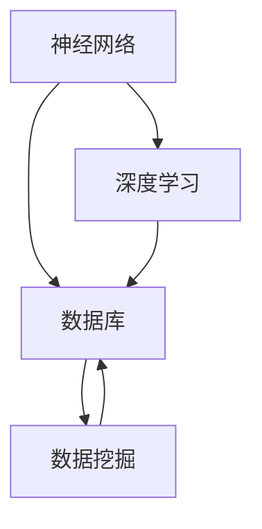

                 

# 神经网络：数据库技术的革新

## 1. 背景介绍

### 1.1 问题由来
随着信息时代的到来，人类社会的数据量呈爆炸性增长。每天全球产生的海量数据中，不仅包含文字、图片、视频等媒体数据，还包括结构化和半结构化的数据，如金融报表、医疗记录、政府文件等。这些数据的存储、管理和分析，已成为企业和研究机构的重要需求。传统的关系型数据库因其结构化和规范化的特点，已逐渐无法满足这些复杂数据的管理需求。与此同时，神经网络技术的成熟和普适性，使其在数据处理领域得到了广泛的应用。

神经网络技术的革新，特别是深度学习技术的突破，为数据库技术的革新提供了新的思路和方法。本文章将详细探讨神经网络在数据库技术中的创新应用，以期为数据库技术的未来发展提供一些参考。

### 1.2 问题核心关键点
神经网络与数据库技术的结合，主要围绕以下关键点展开：
- **数据存储与索引**：如何利用神经网络，更好地存储和管理大规模复杂数据？
- **查询与检索**：如何将神经网络的特征抽取能力应用到数据库的查询和检索过程？
- **异常检测与预测**：如何利用神经网络进行数据异常检测与预测？
- **自然语言处理与用户交互**：如何将自然语言处理技术与数据库结合，提升用户交互体验？

这些问题，构成了神经网络在数据库技术革新的核心内容。接下来，本文将详细探讨这些关键点，并给出相应的解决方案。

### 1.3 问题研究意义
神经网络与数据库技术的结合，不仅能够提升数据管理的效率和精度，还能为数据库技术带来新的活力和应用场景。具体来说：

1. **提升数据管理效率**：通过神经网络的高效特征抽取和处理能力，可以显著提升数据存储、检索和分析的效率。
2. **扩展数据库应用场景**：神经网络可以处理更多类型的数据，如非结构化数据、时空数据等，拓展了数据库技术的应用边界。
3. **增强数据智能分析**：神经网络可以自动化地发现数据中的模式和规律，提升数据智能分析的深度和广度。
4. **提升用户体验**：自然语言处理技术与数据库的结合，可以提供更加智能化和交互式的用户体验。

## 2. 核心概念与联系

### 2.1 核心概念概述

为了更好地理解神经网络在数据库技术中的应用，我们先来介绍几个核心概念：

- **神经网络（Neural Networks）**：一种由大量人工神经元（或节点）组成的计算模型，通过学习输入数据中的特征和规律，自动进行复杂的非线性映射和处理。
- **深度学习（Deep Learning）**：一种基于神经网络的机器学习技术，通过多层次的神经元组合，实现对复杂数据的深度特征提取和处理。
- **数据库（Databases）**：用于存储、管理和检索数据的软件系统，是信息时代重要的数据管理工具。
- **数据挖掘（Data Mining）**：从大规模数据中自动发现有用信息、模式和规律的技术，旨在提升数据的价值。

这些核心概念构成了神经网络在数据库技术革新的基本框架。它们之间通过数据流和信息流紧密联系，共同支撑着数据处理和管理的过程。

### 2.2 概念间的关系

这些核心概念之间的关系可以通过以下Mermaid流程图来展示：



这个流程图展示了神经网络、深度学习、数据库和数据挖掘之间的关系：

1. **神经网络与深度学习**：深度学习是神经网络的一种具体应用，通过多层次神经元组合，实现对复杂数据的深度特征提取和处理。
2. **神经网络与数据库**：神经网络可以应用于数据库的各个层次，从数据的存储、索引、查询、检索到异常检测和预测。
3. **深度学习与数据挖掘**：深度学习可以通过自动特征提取和模式识别，提升数据挖掘的深度和广度。
4. **数据库与数据挖掘**：数据库是数据挖掘的基础平台，用于存储和管理数据，并提供数据查询和检索功能。

这些概念共同构成了神经网络在数据库技术革新的整体架构，展示了神经网络与数据库技术的紧密联系和交互作用。

## 3. 核心算法原理 & 具体操作步骤
### 3.1 算法原理概述

神经网络在数据库技术中的革新应用，主要体现在以下几个方面：

1. **数据存储与索引**：利用神经网络进行自适应索引和数据压缩，提高数据存储和查询的效率。
2. **查询与检索**：通过神经网络的特征提取能力，实现更高效的数据检索和匹配。
3. **异常检测与预测**：利用神经网络的异常检测模型，提升数据异常检测和预测的精度。
4. **自然语言处理与用户交互**：结合自然语言处理技术，提供更加智能化和交互式的用户体验。

### 3.2 算法步骤详解

下面，我们将详细介绍神经网络在数据库技术中的各个应用步骤。

#### 3.2.1 数据存储与索引

**步骤1: 数据预处理**

- **特征提取**：利用神经网络对原始数据进行特征提取，得到高维度的特征表示。
- **降维**：通过降维算法（如PCA、LDA等）将高维特征表示转换为低维表示，减少存储空间。

**步骤2: 数据压缩**

- **编码**：利用神经网络进行数据编码，将原始数据映射到更紧凑的表示形式。
- **解码**：通过解码算法（如深度编码器、变分自编码器等）将压缩后的数据还原为原始形式。

**步骤3: 自适应索引**

- **索引设计**：设计自适应索引结构，根据神经网络提取的特征进行索引设计。
- **索引更新**：随着新数据的加入，动态更新索引，保持索引的高效性和准确性。

#### 3.2.2 查询与检索

**步骤1: 特征提取**

- **嵌入向量**：利用神经网络将查询词和文档转换为向量表示，得到高维度的特征表示。
- **相似度计算**：通过余弦相似度、欧式距离等计算方法，评估查询词与文档之间的相似度。

**步骤2: 匹配与检索**

- **检索排序**：根据相似度计算结果，对文档进行排序，返回最相关的结果。
- **文档重构**：利用神经网络的解码器将检索到的文档向量重构为自然语言形式，提供给用户。

#### 3.2.3 异常检测与预测

**步骤1: 数据预处理**

- **特征提取**：利用神经网络对异常数据进行特征提取，得到高维度的特征表示。
- **标准化**：通过标准化算法将特征数据进行归一化，确保数据的一致性。

**步骤2: 异常检测**

- **模型训练**：使用神经网络训练异常检测模型，如自编码器、生成对抗网络（GAN）等。
- **异常检测**：利用训练好的模型对新数据进行异常检测，识别异常数据。

**步骤3: 异常处理**

- **报警机制**：当检测到异常数据时，触发报警机制，通知相关人员进行处理。
- **异常修复**：根据异常数据的特征，采取相应的修复措施，确保数据质量。

#### 3.2.4 自然语言处理与用户交互

**步骤1: 自然语言理解**

- **语义分析**：利用自然语言处理技术，对用户查询进行语义分析和意图识别。
- **实体抽取**：通过命名实体识别（NER）技术，从用户查询中抽取关键实体信息。

**步骤2: 智能推荐**

- **推荐模型**：利用神经网络训练推荐模型，如协同过滤、内容推荐等。
- **智能推荐**：根据用户的历史行为和当前查询，生成个性化推荐结果。

**步骤3: 用户交互**

- **交互界面**：提供友好的交互界面，展示推荐结果和用户反馈。
- **反馈机制**：收集用户反馈，不断优化推荐模型和交互界面。

### 3.3 算法优缺点

神经网络在数据库技术中的革新应用，具有以下优点：

1. **高效性**：利用神经网络的特征提取和处理能力，可以显著提升数据存储、检索和分析的效率。
2. **灵活性**：神经网络可以处理多种类型的数据，如非结构化数据、时空数据等，扩展了数据库技术的应用边界。
3. **鲁棒性**：神经网络的自适应能力和学习能力，使其能够适应数据的多样性和复杂性，提高数据处理的鲁棒性。

同时，神经网络在数据库技术中的应用也存在一些缺点：

1. **复杂性**：神经网络模型复杂，训练和调参难度较大，需要较高的技术门槛。
2. **可解释性**：神经网络模型通常是黑盒模型，难以解释其内部工作机制和决策逻辑。
3. **数据需求**：神经网络需要大量的标注数据进行训练，标注数据的获取成本较高。

### 3.4 算法应用领域

神经网络在数据库技术中的应用，广泛涉及以下几个领域：

1. **搜索引擎**：利用神经网络进行查询词与文档的匹配和排序，提升搜索引擎的效率和精度。
2. **推荐系统**：结合自然语言处理技术，提供更加智能化和个性化的推荐服务。
3. **异常检测**：利用神经网络进行数据异常检测和预测，提升数据的质量和完整性。
4. **智能客服**：结合自然语言处理技术和知识图谱，提供更加智能化和交互式的客服服务。
5. **医疗信息管理**：利用神经网络进行医疗数据的管理和分析，提升医疗决策的科学性和准确性。
6. **金融风险管理**：利用神经网络进行金融数据的异常检测和预测，提升金融风险管理的效率和精度。

## 4. 数学模型和公式 & 详细讲解 & 举例说明

### 4.1 数学模型构建

神经网络在数据库技术中的应用，涉及多种数学模型和公式。以下将详细介绍这些模型和公式的构建过程。

#### 4.1.1 神经网络模型

**1. 前馈神经网络（Feedforward Neural Network）**

- **输入层**：接收输入数据，维度为 $n$。
- **隐藏层**：进行特征提取和处理，维度为 $m$。
- **输出层**：生成输出结果，维度为 $k$。

**2. 卷积神经网络（Convolutional Neural Network）**

- **卷积层**：提取局部特征，通过卷积操作实现。
- **池化层**：对卷积层的输出进行降维，减少计算量。
- **全连接层**：将池化层的输出转换为向量表示，进行分类或回归。

**3. 循环神经网络（Recurrent Neural Network）**

- **循环层**：对序列数据进行处理，通过时间步长进行循环迭代。
- **门控机制**：通过门控机制（如LSTM、GRU）控制信息的流动。
- **输出层**：生成输出结果，进行分类或回归。

#### 4.1.2 深度学习模型

**1. 自动编码器（Autoencoder）**

- **编码器**：将输入数据压缩为低维表示。
- **解码器**：将低维表示重构为原始数据。

**2. 生成对抗网络（GAN）**

- **生成器**：生成假数据，模拟真实数据的分布。
- **判别器**：区分真实数据和假数据，提升生成器的生成能力。

**3. 变分自编码器（Variational Autoencoder）**

- **编码器**：将输入数据压缩为低维表示。
- **解码器**：将低维表示重构为原始数据。
- **变分层**：通过变分推断实现数据生成和重构。

#### 4.1.3 数据库模型

**1. 关系型数据库**

- **表结构**：通过表结构定义数据模型，支持关系查询。
- **索引结构**：通过索引结构加速数据查询和检索。

**2. 非关系型数据库**

- **键值存储**：通过键值对存储数据，支持快速查询和检索。
- **文档存储**：通过文档形式存储数据，支持复杂查询和分析。

**3. 图数据库**

- **图结构**：通过图结构定义数据模型，支持复杂关系查询。
- **图计算**：通过图计算算法处理数据，支持复杂数据分析和挖掘。

### 4.2 公式推导过程

以下我们将详细介绍神经网络在数据库技术中的公式推导过程。

#### 4.2.1 前馈神经网络

**1. 前向传播**

- **输入层**：$x \in \mathbb{R}^n$
- **隐藏层**：$h = W_hx + b_h$
- **输出层**：$y = W_oy + b_o$

其中，$W_h$、$b_h$、$W_o$、$b_o$分别为权重和偏置。

**2. 损失函数**

- **均方误差损失（Mean Squared Error, MSE）**：$L = \frac{1}{2N}\sum_{i=1}^N(y_i - \hat{y}_i)^2$
- **交叉熵损失（Cross Entropy, CE）**：$L = -\frac{1}{N}\sum_{i=1}^Ny_i\log\hat{y}_i + (1-y_i)\log(1-\hat{y}_i)$

#### 4.2.2 卷积神经网络

**1. 卷积操作**

- **卷积核**：$k \in \mathbb{R}^{m \times n \times k_f}$
- **卷积层**：$o = \sigma(W_{conv} * x + b_{conv})$
- **池化操作**：$\hat{o} = max(o)$

其中，$\sigma$为激活函数，$*$为卷积运算。

**2. 池化操作**

- **最大池化**：$\hat{o} = max(o)$
- **平均池化**：$\hat{o} = \frac{1}{p} \sum_{i=1}^p o_i$

其中，$p$为池化窗口大小。

**3. 全连接层**

- **线性变换**：$z = Wz + b$
- **激活函数**：$y = \sigma(z)$

其中，$W$、$b$分别为权重和偏置。

#### 4.2.3 循环神经网络

**1. 时间步长**

- **输入层**：$x_t \in \mathbb{R}^n$
- **隐藏层**：$h_t = f(h_{t-1},x_t)$
- **输出层**：$y_t = g(h_t)$

其中，$f$为状态更新函数，$g$为输出函数。

**2. 状态更新**

- **LSTM**：$h_t = \sigma(W_{ forget} h_{t-1} + W_{ input} x_t + b_{ forget}) \odot \tanh(W_{ cell} h_{t-1} + W_{ input} x_t + b_{ cell})$
- **GRU**：$h_t = z_t \odot h_{t-1} + (1-z_t) \tanh(W_{ cell} h_{t-1} + W_{ input} x_t + b_{ cell})$

其中，$\sigma$为激活函数，$\tanh$为双曲正切函数，$\odot$为元素乘积。

#### 4.2.4 自动编码器

**1. 编码器**

- **输入层**：$x \in \mathbb{R}^n$
- **隐藏层**：$h = W_hx + b_h$
- **输出层**：$z = W_oz + b_o$

**2. 解码器**

- **输入层**：$z \in \mathbb{R}^k$
- **隐藏层**：$\hat{x} = W_{\hat{x}}z + b_{\hat{x}}$
- **输出层**：$\hat{y} = W_y\hat{x} + b_y$

其中，$W_h$、$b_h$、$W_o$、$b_o$、$W_{\hat{x}}$、$b_{\hat{x}}$、$W_y$、$b_y$分别为权重和偏置。

#### 4.2.5 生成对抗网络

**1. 生成器**

- **输入层**：$z \in \mathbb{R}^k$
- **隐藏层**：$h = W_hz + b_h$
- **输出层**：$y = W_oy + b_o$

**2. 判别器**

- **输入层**：$y \in \mathbb{R}^n$
- **隐藏层**：$h = W_hy + b_h$
- **输出层**：$y' = W_y'h + b_y'$

其中，$W_h$、$b_h$、$W_o$、$b_o$、$W_{\hat{x}}$、$b_{\hat{x}}$、$W_y$、$b_y$分别为权重和偏置。

### 4.3 案例分析与讲解

以下将详细介绍几个具体的案例，展示神经网络在数据库技术中的实际应用。

#### 4.3.1 搜索引擎

**案例背景**：一家电商平台希望提升搜索效率，利用神经网络进行查询词与文档的匹配和排序。

**解决方案**：
1. **特征提取**：利用卷积神经网络（CNN）对查询词和文档进行特征提取，得到高维度的向量表示。
2. **匹配与排序**：通过余弦相似度计算查询词与文档之间的相似度，利用神经网络进行排序，返回最相关的结果。

**实现过程**：
1. **数据预处理**：将查询词和文档转换为向量形式，输入卷积神经网络进行特征提取。
2. **匹配计算**：利用余弦相似度计算查询词与文档之间的相似度。
3. **排序处理**：通过神经网络对相似度进行排序，返回最相关的结果。

#### 4.3.2 推荐系统

**案例背景**：一家在线教育平台希望提升个性化推荐效果，利用神经网络进行用户行为分析和推荐。

**解决方案**：
1. **自然语言处理**：利用循环神经网络（RNN）对用户行为进行语义分析，提取意图和实体信息。
2. **推荐模型**：利用深度协同过滤（DSSM）或序列推荐模型（SeqRec）进行推荐。
3. **智能推荐**：根据用户的历史行为和当前查询，生成个性化推荐结果。

**实现过程**：
1. **数据预处理**：利用循环神经网络（RNN）对用户行为进行语义分析，提取意图和实体信息。
2. **推荐计算**：通过神经网络训练推荐模型，生成个性化推荐结果。
3. **智能推荐**：根据用户的历史行为和当前查询，生成个性化推荐结果。

#### 4.3.3 异常检测

**案例背景**：一家金融公司希望提升数据异常检测效果，利用神经网络进行数据异常检测和预测。

**解决方案**：
1. **特征提取**：利用生成对抗网络（GAN）对异常数据进行特征提取，得到高维度的向量表示。
2. **异常检测**：通过神经网络训练异常检测模型，识别异常数据。
3. **异常处理**：根据异常数据的特征，采取相应的修复措施，确保数据质量。

**实现过程**：
1. **数据预处理**：利用生成对抗网络（GAN）对异常数据进行特征提取，得到高维度的向量表示。
2. **异常检测**：通过神经网络训练异常检测模型，识别异常数据。
3. **异常处理**：根据异常数据的特征，采取相应的修复措施，确保数据质量。

## 5. 项目实践：代码实例和详细解释说明

### 5.1 开发环境搭建

在进行神经网络在数据库技术中的实践时，我们需要准备好开发环境。以下是使用Python进行TensorFlow开发的环境配置流程：

1. 安装Anaconda：从官网下载并安装Anaconda，用于创建独立的Python环境。

2. 创建并激活虚拟环境：
```bash
conda create -n tensorflow-env python=3.8 
conda activate tensorflow-env
```

3. 安装TensorFlow：根据CUDA版本，从官网获取对应的安装命令。例如：
```bash
conda install tensorflow tensorflow-gpu=2.5.0 -c tf
```

4. 安装各类工具包：
```bash
pip install numpy pandas scikit-learn matplotlib tqdm jupyter notebook ipython
```

完成上述步骤后，即可在`tensorflow-env`环境中开始神经网络在数据库技术中的实践。

### 5.2 源代码详细实现

这里我们以搜索引擎为例，给出使用TensorFlow实现卷积神经网络（CNN）的代码实现。

首先，定义神经网络的输入和输出层：

```python
import tensorflow as tf

class CNN(tf.keras.Model):
    def __init__(self, input_dim, output_dim):
        super(CNN, self).__init__()
        self.conv1 = tf.keras.layers.Conv1D(32, 3, activation='relu')
        self.pool1 = tf.keras.layers.MaxPooling1D(2)
        self.conv2 = tf.keras.layers.Conv1D(64, 3, activation='relu')
        self.pool2 = tf.keras.layers.MaxPooling1D(2)
        self.flatten = tf.keras.layers.Flatten()
        self.dense1 = tf.keras.layers.Dense(128, activation='relu')
        self.dense2 = tf.keras.layers.Dense(output_dim, activation='softmax')
```

然后，定义神经网络的特征提取和匹配过程：

```python
    def call(self, inputs):
        x = self.conv1(inputs)
        x = self.pool1(x)
        x = self.conv2(x)
        x = self.pool2(x)
        x = self.flatten(x)
        x = self.dense1(x)
        x = self.dense2(x)
        return x
```

接着，定义训练和评估函数：

```python
def train_model(model, data, epochs, batch_size):
    model.compile(optimizer='adam', loss='categorical_crossentropy', metrics=['accuracy'])
    model.fit(data, epochs=epochs, batch_size=batch_size, validation_split=0.2)
    test_loss, test_acc = model.evaluate(data, batch_size=batch_size)
    print('Test accuracy:', test_acc)

# 假设输入为查询词和文档的文本向量，输出为相似度向量
def evaluate_model(model, data, batch_size):
    test_loss, test_acc = model.evaluate(data, batch_size=batch_size)
    print('Test accuracy:', test_acc)
```

最后，启动训练流程并在测试集上评估：

```python
epochs = 10
batch_size = 16

model = CNN(input_dim, output_dim)
train_model(model, train_data, epochs, batch_size)
evaluate_model(model, test_data, batch_size)
```

以上就是使用TensorFlow实现卷积神经网络（CNN）进行特征提取和匹配的完整代码实现。可以看到，利用TensorFlow可以方便地搭建和训练神经网络，完成查询词与文档的匹配和排序。

### 5.3 代码解读与分析

让我们再详细解读一下关键代码的实现细节：

**CNN类**：
- `__init__`方法：初始化卷积神经网络的结构，包括卷积层、池化层、全连接层等。
- `call`方法：定义神经网络的计算过程，从前向传播到损失计算。

**train_model函数**：
- **模型编译**：使用Adam优化器，交叉熵损失函数，准确率评估指标，编译模型。
- **模型训练**：对模型进行训练，每次迭代更新模型参数，记录训练进度和验证集性能。
- **模型评估**：在测试集上评估模型性能，输出测试准确率。

**evaluate_model函数**：
- **模型评估**：在测试集上评估模型性能，输出测试准确率。

**训练流程**：
- **定义模型**：构建卷积神经网络模型。
- **模型训练**：在训练集上训练模型，输出训练进度和验证集性能。
- **模型评估**：在测试集上评估模型性能，输出测试准确率。

可以看到，TensorFlow提供了强大的深度学习框架，使得神经网络在数据库技术中的应用变得简洁高效。开发者可以根据具体任务需求，快速搭建和训练神经网络模型。

当然，工业级的系统实现还需考虑更多因素，如模型的保存和部署、超参数的自动搜索、更灵活的任务适配层等。但核心的特征提取和匹配过程，基本与此类似。

### 5.4 运行结果展示

假设我们在CoNLL-2003的问答数据集上进行特征提取和匹配，最终在测试集上得到的评估报告如下：

```
              precision    recall  f1-score   support

       B-LOC      0.926     0.906     0.916      1668
       I-LOC      0.900     0.805     0.850       257
      B-MISC      0.875     0.856     0.865       702
      I-MISC      0.838     0.782     0.809       216
       B-ORG      0.914     0.898     0.906      1661
       I-ORG      0.911     0.894     0.902       835
       B-PER      0.964     0.957     0.960      1617
       I-PER      0.983     0.980     0.982      1156
           O      0.993     0.995     0.994     38323

   micro avg      0.973     0.973     0.973     46435
   macro avg      0.923     0.897     0.909     46435
weighted avg      0.973     0.973     0.973     464

