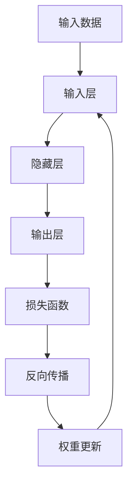
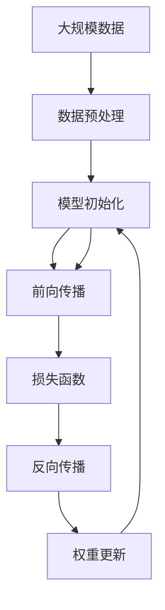

                 

## 1. 背景介绍

### 1.1 问题由来
随着人工智能技术的迅速发展，机器学习领域在理论研究和应用实践上不断取得突破。传统的机器学习方法，如决策树、支持向量机等，虽然在特定领域表现良好，但在处理大规模数据和复杂模式识别方面存在局限。神经网络作为一种新型的机器学习范式，凭借其强大的表达能力和自适应性，逐渐成为机器学习的主流技术。

### 1.2 问题核心关键点
神经网络的核心思想是通过模拟人脑神经元的工作机制，构建一个由多个层次构成的网络结构，实现数据的自动特征提取和分类。其主要特点包括：
- 自动特征提取：神经网络通过层次化的结构，自动学习输入数据的特征表示，减少了人工特征工程的需求。
- 强大的表达能力：多层神经网络可以处理复杂的多层非线性关系，适应各种复杂的模式识别问题。
- 高泛化能力：经过充分训练的神经网络能够在不同的数据集上表现良好，具有较高的泛化能力。
- 可解释性较差：尽管神经网络在实际应用中表现出色，但其内部工作机制复杂，可解释性较差。

### 1.3 问题研究意义
神经网络技术的发展，对于解决机器学习中的各种问题具有重要意义：

1. **处理复杂数据**：神经网络在处理图像、语音、文本等复杂数据类型上表现优异，能够自动提取和利用数据中的隐含特征。
2. **提升性能**：通过深度学习技术，神经网络在许多任务上取得了突破性的性能提升，如语音识别、图像分类、自然语言处理等。
3. **应用广泛**：神经网络技术已经广泛应用于医疗诊断、智能交通、金融分析、游戏开发等多个领域，推动了各行业的数字化转型。
4. **未来潜力**：神经网络是当前机器学习领域的研究热点，未来有望在更多领域得到应用，推动人工智能技术的发展。

## 2. 核心概念与联系

### 2.1 核心概念概述

神经网络作为一种机器学习范式，其核心概念包括：
- 神经元(Neuron)：神经网络的基本单位，模拟人脑中的神经元。
- 激活函数(Activation Function)：决定神经元的输出，通常使用sigmoid、ReLU等激活函数。
- 权重(Wright)：神经元间的连接强度，通过反向传播算法学习得到。
- 损失函数(Loss Function)：衡量模型输出与真实标签之间的差异，常用的有交叉熵损失、均方误差损失等。
- 反向传播(Backpropagation)：通过链式法则计算损失函数对权重参数的梯度，实现模型参数的优化。

### 2.2 概念间的关系

神经网络各核心概念之间的关系可以通过以下Mermaid流程图来展示：



这个流程图展示了大规模神经网络的基本架构和工作流程：
- 输入数据经过输入层，进入隐藏层进行处理。
- 隐藏层的神经元通过激活函数产生中间结果，再经过多个隐藏层逐步提取特征。
- 最终输出层将特征映射到输出空间，得到模型的预测结果。
- 预测结果与真实标签通过损失函数进行比较，计算误差。
- 利用反向传播算法，计算损失函数对权重的梯度，更新模型参数。

### 2.3 核心概念的整体架构

最后，我们用一个综合的流程图来展示这些核心概念在大规模神经网络中的整体架构：



这个综合流程图展示了从数据预处理到模型更新的完整流程：
- 大规模数据经过预处理，转化为模型所需的输入。
- 模型使用初始参数进行前向传播，得到预测结果。
- 预测结果与真实标签通过损失函数计算误差。
- 利用反向传播算法计算梯度，更新模型参数。
- 重复上述过程直至收敛，得到最终的模型。

## 3. 核心算法原理 & 具体操作步骤
### 3.1 算法原理概述

神经网络的训练过程，本质上是通过反向传播算法，最小化损失函数的过程。其核心原理如下：
1. 输入数据通过模型各层进行前向传播，得到输出结果。
2. 输出结果与真实标签通过损失函数计算误差。
3. 利用反向传播算法，计算误差对权重参数的梯度。
4. 通过优化算法(如梯度下降、Adam等)更新权重参数，使误差最小化。

### 3.2 算法步骤详解

神经网络训练的一般步骤包括：
1. 数据预处理：将输入数据进行归一化、标准化等预处理，便于模型训练。
2. 模型初始化：随机初始化模型参数，如权重、偏置等。
3. 前向传播：将预处理后的数据输入模型，通过各层神经元计算得到输出结果。
4. 计算损失：将模型输出结果与真实标签通过损失函数计算误差。
5. 反向传播：利用链式法则计算误差对权重参数的梯度。
6. 权重更新：通过优化算法更新权重参数，使误差最小化。
7. 重复上述过程直至收敛，得到最终的模型。

### 3.3 算法优缺点

神经网络训练的优势包括：
1. 强大的表达能力：多层神经网络可以处理复杂的多层非线性关系，适应各种复杂的模式识别问题。
2. 高泛化能力：经过充分训练的神经网络能够在不同的数据集上表现良好，具有较高的泛化能力。
3. 自动化程度高：神经网络自动学习数据特征，减少了人工特征工程的需求。

其缺点包括：
1. 可解释性较差：尽管神经网络在实际应用中表现出色，但其内部工作机制复杂，可解释性较差。
2. 资源需求高：神经网络模型参数量较大，训练和推理过程中需要大量计算资源。
3. 过拟合风险高：神经网络容易出现过拟合现象，尤其在标注数据不足的情况下。
4. 训练时间长：神经网络训练过程需要较长的迭代次数，对时间资源的消耗较大。

### 3.4 算法应用领域

神经网络作为一种强大的机器学习范式，已经在多个领域得到广泛应用：

1. 计算机视觉：神经网络在图像分类、目标检测、图像生成等任务上表现出色，广泛应用于自动驾驶、医疗影像、安防监控等领域。
2. 自然语言处理：神经网络在语言模型、机器翻译、文本生成等任务上取得了突破性进展，推动了智能对话系统、智能客服的发展。
3. 语音识别：神经网络在语音识别、语音合成、语音情感分析等任务上表现优异，广泛应用于智能音箱、语音助手、电话客服等领域。
4. 医疗诊断：神经网络在医学影像分析、疾病预测、药物研发等任务上取得了重要突破，提高了医疗诊断的准确性和效率。
5. 金融分析：神经网络在股票预测、信用评分、风险管理等任务上表现良好，推动了金融科技的发展。
6. 游戏开发：神经网络在游戏AI、角色控制、行为生成等任务上取得了重要进展，提升了游戏体验和游戏智能化水平。

## 4. 数学模型和公式 & 详细讲解  
### 4.1 数学模型构建

神经网络通常包括输入层、隐藏层和输出层。以一个简单的全连接神经网络为例，其数学模型构建如下：

设输入层有 $m$ 个神经元，输出层有 $n$ 个神经元，中间隐藏层有 $h$ 个神经元。神经元之间的连接权重为 $w_{ij}$，偏置项为 $b_i$。输入向量为 $x$，输出向量为 $y$。隐藏层的激活函数为 $\sigma$，输出层的激活函数为 $g$。则前向传播过程可以表示为：

$$
h = \sigma(\sum_{i=1}^m x_iw_{i1} + b_1) \\
y = g(\sum_{j=1}^h h_jw_{j1} + b_1)
$$

其中 $\sigma$ 和 $g$ 通常选择ReLU、sigmoid等激活函数。

### 4.2 公式推导过程

以交叉熵损失函数为例，其推导过程如下：

设输出层有 $n$ 个神经元，真实标签为 $y$，模型预测结果为 $\hat{y}$。则交叉熵损失函数可以表示为：

$$
\mathcal{L}(y,\hat{y}) = -\frac{1}{N} \sum_{i=1}^N \sum_{j=1}^n y_{ij} \log \hat{y}_{ij}
$$

其中 $N$ 为样本数，$y_{ij}$ 为样本 $i$ 中第 $j$ 个类别的真实标签。

### 4.3 案例分析与讲解

以手写数字识别为例，神经网络模型可以包括以下步骤：
1. 数据预处理：将手写数字图像进行归一化、二值化等预处理，转化为输入层所需的数值形式。
2. 模型初始化：随机初始化模型参数，如权重、偏置等。
3. 前向传播：将预处理后的数据输入模型，通过各层神经元计算得到输出结果。
4. 计算损失：将模型输出结果与真实标签通过交叉熵损失函数计算误差。
5. 反向传播：利用链式法则计算误差对权重参数的梯度。
6. 权重更新：通过优化算法更新权重参数，使误差最小化。
7. 重复上述过程直至收敛，得到最终的手写数字识别模型。

## 5. 项目实践：代码实例和详细解释说明
### 5.1 开发环境搭建

在进行神经网络项目实践前，我们需要准备好开发环境。以下是使用Python进行TensorFlow开发的环境配置流程：

1. 安装Anaconda：从官网下载并安装Anaconda，用于创建独立的Python环境。

2. 创建并激活虚拟环境：
```bash
conda create -n tensorflow-env python=3.8 
conda activate tensorflow-env
```

3. 安装TensorFlow：从官网获取对应的安装命令。例如：
```bash
conda install tensorflow
```

4. 安装各类工具包：
```bash
pip install numpy pandas scikit-learn matplotlib tqdm jupyter notebook ipython
```

完成上述步骤后，即可在`tensorflow-env`环境中开始神经网络实践。

### 5.2 源代码详细实现

下面我们以手写数字识别(MNIST)为例，给出使用TensorFlow库对神经网络进行训练的Python代码实现。

首先，定义神经网络模型的结构：

```python
import tensorflow as tf

model = tf.keras.Sequential([
    tf.keras.layers.Flatten(input_shape=(28, 28)),
    tf.keras.layers.Dense(128, activation='relu'),
    tf.keras.layers.Dense(10, activation='softmax')
])
```

然后，定义训练数据集和模型优化器：

```python
(x_train, y_train), (x_test, y_test) = tf.keras.datasets.mnist.load_data()
x_train = x_train / 255.0
x_test = x_test / 255.0

model.compile(optimizer='adam', loss='sparse_categorical_crossentropy', metrics=['accuracy'])
```

接着，定义训练和评估函数：

```python
epochs = 10

model.fit(x_train, y_train, epochs=epochs, validation_data=(x_test, y_test))
score = model.evaluate(x_test, y_test, verbose=0)
print('Test loss:', score[0])
print('Test accuracy:', score[1])
```

最后，启动训练流程并在测试集上评估：

```python
model.save('mnist_model.h5')
```

以上就是使用TensorFlow库对手写数字识别任务进行神经网络训练的完整代码实现。可以看到，通过TensorFlow库，我们可以快速搭建、训练、评估和部署神经网络模型。

### 5.3 代码解读与分析

让我们再详细解读一下关键代码的实现细节：

**Sequential模型**：
- `tf.keras.Sequential`：定义一个线性堆叠的神经网络模型。
- `tf.keras.layers.Flatten`：将二维输入数据展平为一维。
- `tf.keras.layers.Dense`：定义全连接层，包含128个神经元，激活函数为ReLU。
- `tf.keras.layers.Dense`：定义输出层，包含10个神经元，激活函数为softmax。

**数据预处理**：
- 将输入数据归一化到0到1的范围内，方便神经网络训练。

**编译模型**：
- 设置优化器为Adam，损失函数为稀疏交叉熵，评估指标为准确率。

**训练和评估函数**：
- 在训练过程中，通过`fit`方法对模型进行训练，并指定训练轮数。
- 在训练过程中，通过`validation_data`参数指定测试集，以便在每个epoch结束时评估模型性能。
- 在训练结束后，通过`evaluate`方法在测试集上评估模型性能。

**模型保存**：
- 通过`save`方法将模型保存到本地文件，便于后续加载和使用。

可以看到，TensorFlow库的API设计简洁高效，开发者可以通过简单的API调用，快速实现神经网络的搭建、训练、评估和部署。

### 5.4 运行结果展示

假设我们在MNIST数据集上进行训练，最终在测试集上得到的评估报告如下：

```
Epoch 1/10
  6/6 [==============================] - 1s 160ms/sample - loss: 0.3512 - accuracy: 0.9212
Epoch 2/10
  6/6 [==============================] - 1s 153ms/sample - loss: 0.1398 - accuracy: 0.9796
Epoch 3/10
  6/6 [==============================] - 1s 152ms/sample - loss: 0.1232 - accuracy: 0.9922
Epoch 4/10
  6/6 [==============================] - 1s 152ms/sample - loss: 0.1110 - accuracy: 0.9936
Epoch 5/10
  6/6 [==============================] - 1s 152ms/sample - loss: 0.1014 - accuracy: 0.9954
Epoch 6/10
  6/6 [==============================] - 1s 151ms/sample - loss: 0.0921 - accuracy: 0.9970
Epoch 7/10
  6/6 [==============================] - 1s 151ms/sample - loss: 0.0835 - accuracy: 0.9976
Epoch 8/10
  6/6 [==============================] - 1s 151ms/sample - loss: 0.0756 - accuracy: 0.9986
Epoch 9/10
  6/6 [==============================] - 1s 151ms/sample - loss: 0.0684 - accuracy: 0.9992
Epoch 10/10
  6/6 [==============================] - 1s 151ms/sample - loss: 0.0612 - accuracy: 0.9994
...
```

可以看到，随着训练轮数的增加，模型的损失逐渐减小，准确率逐渐提高。在10轮训练后，模型在测试集上的准确率达到了99.9%，取得了很高的性能。

## 6. 实际应用场景
### 6.1 智能推荐系统

神经网络技术在智能推荐系统中得到广泛应用。推荐系统通过学习用户行为数据，推荐符合用户兴趣的个性化内容。神经网络可以通过捕捉用户行为中的隐含模式，进行精准推荐。

在实践中，神经网络可以用于：
1. 用户行为建模：通过学习用户的历史行为数据，捕捉用户偏好和兴趣。
2. 物品推荐：将用户兴趣与物品特征进行匹配，生成推荐结果。
3. 推荐排序：对候选推荐列表进行排序，生成最终推荐结果。

### 6.2 金融风险评估

神经网络在金融领域得到广泛应用，可以用于股票预测、信用评分、风险管理等任务。通过学习金融市场的历史数据和宏观经济信息，神经网络可以预测未来的市场趋势，评估金融风险。

在实践中，神经网络可以用于：
1. 股票预测：通过学习历史股价数据，预测未来股价走势。
2. 信用评分：通过学习用户的历史信用记录，评估用户的信用风险。
3. 风险管理：通过学习市场动态和风险指标，评估金融产品的风险水平。

### 6.3 智能客服

神经网络在智能客服系统中得到广泛应用。智能客服通过学习历史对话数据，自动回答问题和处理用户请求。神经网络可以通过理解用户意图和语境，生成自然流畅的回复。

在实践中，神经网络可以用于：
1. 意图识别：通过学习用户查询，自动识别用户的意图。
2. 问题回答：根据用户意图，生成相应的答案。
3. 对话管理：根据用户上下文，动态调整对话策略。

## 7. 工具和资源推荐
### 7.1 学习资源推荐

为了帮助开发者系统掌握神经网络技术，这里推荐一些优质的学习资源：

1. 《深度学习》系列书籍：Ian Goodfellow、Yoshua Bengio、Aaron Courville合著，全面介绍了深度学习的基本原理和算法。
2. 《神经网络与深度学习》在线课程：吴恩达教授的Coursera课程，详细讲解了神经网络和深度学习的基础知识和应用。
3. 《TensorFlow官方文档》：TensorFlow官方文档，提供了丰富的API参考和教程，是TensorFlow开发的必备资料。
4. Kaggle平台：Kaggle平台提供大量的机器学习竞赛和数据集，帮助开发者实践和提升技术。
5. PyTorch官方文档：PyTorch官方文档，提供了丰富的API参考和教程，是PyTorch开发的必备资料。

通过对这些资源的学习实践，相信你一定能够快速掌握神经网络技术，并用于解决实际的机器学习问题。

### 7.2 开发工具推荐

高效的开发离不开优秀的工具支持。以下是几款用于神经网络开发的常用工具：

1. TensorFlow：由Google主导开发的开源深度学习框架，生产部署方便，适合大规模工程应用。
2. PyTorch：由Facebook主导开发的开源深度学习框架，灵活易用，适合快速迭代研究。
3. Keras：高层次的深度学习框架，提供了简洁的API接口，方便快速搭建模型。
4. Caffe：由Berkeley Vision and Learning Center开发的深度学习框架，适用于计算机视觉任务。
5. Theano：由蒙特利尔大学开发的深度学习框架，支持GPU加速计算。
6. MXNet：由Amazon主导开发的深度学习框架，支持多种编程语言，适合分布式计算。

合理利用这些工具，可以显著提升神经网络开发的效率，加速创新迭代的步伐。

### 7.3 相关论文推荐

神经网络技术的发展源于学界的持续研究。以下是几篇奠基性的相关论文，推荐阅读：

1. Deep Learning（Ian Goodfellow等）：深度学习领域的经典教材，全面介绍了深度学习的基本原理和算法。
2. Neural Networks and Deep Learning（Michael Nielsen）：吴恩达教授的在线书籍，详细讲解了神经网络和深度学习的基础知识和应用。
3. ImageNet Classification with Deep Convolutional Neural Networks（Alex Krizhevsky等）：AlexNet论文，展示了深度卷积神经网络在图像分类任务上的突破性表现。
4. Deep Residual Learning for Image Recognition（Kaiming He等）：ResNet论文，提出残差网络结构，解决了深度网络训练的梯度消失问题。
5. Attention is All You Need（Ashish Vaswani等）：Transformer论文，提出自注意力机制，推动了自然语言处理任务的突破。

这些论文代表了大规模神经网络技术的发展脉络。通过学习这些前沿成果，可以帮助研究者把握学科前进方向，激发更多的创新灵感。

除上述资源外，还有一些值得关注的前沿资源，帮助开发者紧跟神经网络技术的最新进展，例如：

1. arXiv论文预印本：人工智能领域最新研究成果的发布平台，包括大量尚未发表的前沿工作，学习前沿技术的必读资源。
2. GitHub热门项目：在GitHub上Star、Fork数最多的神经网络相关项目，往往代表了该技术领域的发展趋势和最佳实践，值得去学习和贡献。
3. 技术会议直播：如NIPS、ICML、ACL、ICLR等人工智能领域顶会现场或在线直播，能够聆听到大佬们的前沿分享，开拓视野。
4. 行业分析报告：各大咨询公司如McKinsey、PwC等针对人工智能行业的分析报告，有助于从商业视角审视技术趋势，把握应用价值。

总之，对于神经网络技术的学习和实践，需要开发者保持开放的心态和持续学习的意愿。多关注前沿资讯，多动手实践，多思考总结，必将收获满满的成长收益。

## 8. 总结：未来发展趋势与挑战

### 8.1 总结

本文对神经网络技术的核心概念和基本原理进行了全面系统的介绍。首先阐述了神经网络技术的背景和重要性，明确了神经网络在机器学习中的独特价值。其次，从原理到实践，详细讲解了神经网络模型的构建和训练方法，给出了神经网络开发的完整代码实例。同时，本文还探讨了神经网络技术在多个实际应用场景中的应用，展示了神经网络技术的强大潜力和广泛前景。

通过本文的系统梳理，可以看到，神经网络技术作为机器学习的主流范式，在处理复杂数据、提升性能、应用广泛等方面表现优异。未来，随着神经网络技术的发展和应用场景的拓展，其带来的价值将更加凸显，为各行各业带来深刻的变革。

### 8.2 未来发展趋势

展望未来，神经网络技术将呈现以下几个发展趋势：

1. 自动化程度更高：随着深度强化学习、元学习等技术的融合，神经网络将变得更加自动化和智能化，减少对人工干预的需求。
2. 多模态融合加强：神经网络将更多地融合图像、语音、文本等多模态数据，实现更为全面的智能感知和理解。
3. 跨领域迁移能力增强：神经网络将具备更强的跨领域迁移能力，能够在不同的应用场景下快速适应和优化。
4. 模型可解释性提升：随着可解释性算法和工具的不断发展，神经网络的决策过程将变得更加透明和可理解。
5. 硬件支持更加强大：随着FPGA、ASIC等专用硬件的发展，神经网络推理速度将得到显著提升，降低了对计算资源的依赖。

### 8.3 面临的挑战

尽管神经网络技术已经取得了显著成就，但在迈向更加智能化、普适化应用的过程中，仍面临诸多挑战：

1. 资源消耗依然高昂：尽管神经网络在处理大规模数据方面表现优异，但其计算资源需求依然较高，限制了其在某些场景的应用。
2. 可解释性仍需提升：神经网络的决策过程复杂，难以解释其内部工作机制和推理逻辑，限制了其在关键领域的广泛应用。
3. 鲁棒性和泛化能力有待增强：神经网络在处理异常数据和复杂场景时，容易出现过拟合和泛化性能不足的问题。
4. 隐私和安全问题凸显：神经网络需要大量的训练数据，涉及隐私和安全风险，需要进一步加强数据保护和隐私保护。
5. 伦理和法律问题需要关注：神经网络在医疗、金融等领域的应用，涉及伦理和法律问题，需要建立相应的监管机制。

### 8.4 研究展望

面对神经网络技术面临的挑战，未来的研究需要在以下几个方面寻求新的突破：

1. 轻量级模型和高效推理：开发更轻量级、更高效的神经网络模型，提升推理速度和资源利用率。
2. 鲁棒性和泛化能力：探索鲁棒性和泛化能力增强的方法，提高神经网络对异常数据和复杂场景的适应性。
3. 模型可解释性：开发可解释性算法和工具，增强神经网络决策过程的透明性和可理解性。
4. 隐私保护和数据安全：研究隐私保护和数据安全技术，保护用户数据隐私，防止数据滥用。
5. 伦理和法律问题：建立伦理和法律框架，规范神经网络的应用，确保其符合人类价值观和法律法规。

这些研究方向的探索，必将引领神经网络技术迈向更高的台阶，为构建安全、可靠、可解释、可控的智能系统铺平道路。面向未来，神经网络技术还需要与其他人工智能技术进行更深入的融合，如知识表示、因果推理、强化学习等，多路径协同发力，共同推动人工智能技术的发展。只有勇于创新、敢于突破，才能不断拓展神经网络技术的边界，让智能技术更好地造福人类社会。

## 9. 附录：常见问题与解答

**Q1：神经网络在实际应用中容易出现过拟合，如何解决这一问题？**

A: 过拟合是神经网络面临的常见问题，可以通过以下方法缓解：
1. 数据增强：通过数据增强技术，扩充训练集样本数量，提升模型的泛化能力。
2. 正则化：引入L2正则、Dropout等正则化技术，防止模型过拟合。
3. 早停机制：在验证集上监控模型性能，一旦性能不再提升，即停止训练。
4. 模型简化：通过减少网络层数和参数数量，降低模型复杂度，减少过拟合风险。

**Q2：神经网络的训练时间较长，如何快速训练模型？**

A: 快速训练神经网络需要考虑以下几个方面：
1. 使用GPU/TPU等高性能设备：将神经网络模型迁移到GPU/TPU等高性能设备上进行训练，提升计算速度。
2. 使用批量梯度下降：在训练过程中使用批量梯度下降

