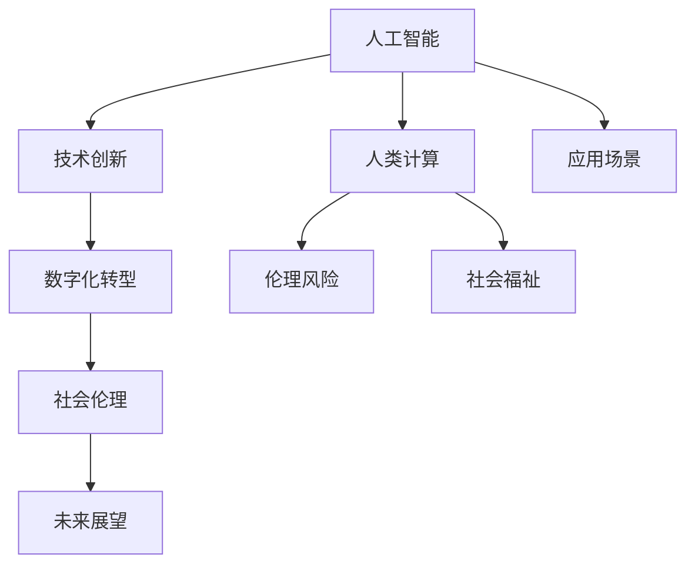

                 

# 科技与社会：人类计算的双重影响与思考

> 关键词：人工智能,人类计算,技术创新,社会伦理,数字化转型,未来展望

## 1. 背景介绍

### 1.1 问题由来

随着人工智能(AI)技术的飞速发展，人类计算在现代社会中扮演着愈发重要的角色。从智能助理到自动化生产，从数据处理到智能决策，计算技术正深刻影响着我们的生活方式和生产模式。然而，技术的发展总是伴随着复杂的社会现象和伦理问题。如何让计算技术在服务于人类的同时，不带来负面影响，是当下迫切需要解决的问题。本文将从人工智能与人类计算的双重角度，探讨技术发展对社会的影响，并提出应对策略。

### 1.2 问题核心关键点

- **人工智能与人类计算的关系**：人工智能作为人类计算的一种高级形式，如何平衡其创新优势与伦理风险，是我们需要深入探讨的话题。
- **技术创新与社会伦理的平衡**：在追求技术进步的同时，如何确保技术的道德性和社会公平性，避免对社会的负面影响。
- **数字化转型与人类福祉**：数字化转型在带来便利的同时，也可能加剧社会不平等，如何通过技术创新促进社会的均衡发展。
- **计算技术的未来展望**：面向未来，计算技术将如何进一步发展，并在社会各个层面发挥作用。

### 1.3 问题研究意义

通过深入分析人工智能与人类计算的互动关系，探讨其对社会的影响，本文旨在：
- 揭示人工智能技术进步对社会的影响机制。
- 提出基于人类福祉的计算技术创新方向。
- 提供解决计算技术伦理问题的策略和方案。
- 展望未来，探讨计算技术在社会中的应用前景。

## 2. 核心概念与联系

### 2.1 核心概念概述

为更好地理解人工智能与人类计算的双重影响，本节将介绍几个关键概念及其联系：

- **人工智能**：基于算法和数据驱动的智能技术，能够模拟人类智能过程，解决复杂问题。
- **人类计算**：人类通过计算技术（如编程、算法设计等）处理和分析信息的过程。
- **技术创新**：利用最新科研成果，开发和应用新工具、新方法，推动社会发展。
- **社会伦理**：涉及人类行为规范、道德标准，确保技术进步符合人类价值观念。
- **数字化转型**：通过信息技术手段，优化资源配置，提升社会效率。
- **未来展望**：基于当前技术趋势，预测未来科技发展的方向和影响。

这些概念通过一系列的因果关系和互动连接，共同构成了一个复杂而动态的系统。下面将通过一个Mermaid流程图，展示这些核心概念之间的联系：



### 2.2 概念间的关系

- **人工智能与技术创新**：人工智能是技术创新的重要方向，推动技术进步和社会发展。
- **技术创新与数字化转型**：技术创新驱动数字化转型，提升社会效率和生产能力。
- **数字化转型与社会伦理**：数字化转型带来新的伦理问题，如隐私保护、公平性等，需要伦理约束。
- **社会伦理与未来展望**：伦理考量决定未来技术的发展方向，引导社会进步。
- **人工智能与人类计算**：人工智能是对人类计算能力的延伸，提升计算效率和应用范围。
- **伦理风险与社会福祉**：技术应用可能带来伦理风险，需通过社会福祉保障技术健康发展。
- **未来展望与应用场景**：技术应用场景和未来展望相互影响，共同塑造技术未来发展路径。

### 2.3 核心概念的整体架构

通过上述联系，我们可以看到，人工智能与人类计算共同构成了现代科技社会的基石。技术创新驱动数字化转型，社会伦理保障技术健康发展，未来展望指引技术发展方向，共同塑造了人类计算的复杂生态系统。

## 3. 核心算法原理 & 具体操作步骤

### 3.1 算法原理概述

人工智能与人类计算的互动关系，可以通过一系列的算法和技术来实现。其中，机器学习和深度学习是当前最为流行的技术，能够在海量的数据上进行模式识别和预测，从而辅助人类决策。

人工智能的核心原理是利用算法和大数据，模拟人类智能过程。具体来说，包括：
- **数据采集与预处理**：收集和清洗数据，为机器学习提供数据基础。
- **模型训练与优化**：使用监督学习、无监督学习等算法，训练模型并优化参数。
- **模型部署与应用**：将训练好的模型部署到实际应用中，解决实际问题。

### 3.2 算法步骤详解

人工智能与人类计算的互动过程，一般包括以下关键步骤：

1. **数据采集与预处理**：
   - **数据源选择**：根据应用场景，选择合适的数据源，如数据库、传感器、互联网等。
   - **数据清洗与标注**：清洗数据，去除噪声，对数据进行标注，为机器学习提供清晰的输入。

2. **模型训练与优化**：
   - **算法选择**：根据任务需求，选择合适的算法，如决策树、支持向量机、深度神经网络等。
   - **模型训练**：使用训练数据集，训练模型，调整超参数，优化模型性能。
   - **模型评估**：使用测试数据集，评估模型性能，确保模型泛化能力。

3. **模型部署与应用**：
   - **模型部署**：将训练好的模型部署到生产环境，如云平台、移动应用等。
   - **应用集成**：将模型集成到实际应用中，如智能助理、自动驾驶、智能推荐等。
   - **持续优化**：根据应用反馈，不断调整和优化模型，提高模型性能。

### 3.3 算法优缺点

人工智能与人类计算的互动，具有以下优点：
- **高效性**：利用算法和计算资源，能够快速处理大量数据，提升工作效率。
- **可扩展性**：通过模型部署，实现计算能力的灵活扩展，适应多样化的应用场景。
- **创新性**：算法和数据驱动的创新，推动技术进步和社会发展。

然而，也存在以下缺点：
- **依赖数据**：算法的性能依赖于数据质量，数据偏差可能影响模型决策。
- **技术门槛**：算法和模型设计需要专业技能，对普通用户存在一定的技术壁垒。
- **伦理风险**：数据隐私、算法透明度等问题，可能带来伦理风险。

### 3.4 算法应用领域

人工智能与人类计算的互动，广泛应用于各个领域：

- **智能助理**：如Siri、Alexa，利用自然语言处理(NLP)技术，辅助人类完成任务。
- **自动驾驶**：利用计算机视觉和深度学习，实现无人驾驶技术。
- **智能推荐**：基于用户行为数据，推荐个性化内容，如商品、文章等。
- **医疗健康**：利用医学影像和诊断算法，辅助医生进行疾病诊断和治疗。
- **金融服务**：利用大数据和机器学习，进行风险评估和投资决策。
- **智慧城市**：利用物联网和AI技术，优化城市管理和服务。

## 4. 数学模型和公式 & 详细讲解 & 举例说明

### 4.1 数学模型构建

人工智能与人类计算的互动，可以通过数学模型来描述。以下是一些常见的数学模型：

- **线性回归模型**：用于预测连续变量，形式为 $y = wx + b$，其中 $w$ 为权重，$x$ 为输入变量，$y$ 为输出变量，$b$ 为截距。
- **决策树模型**：用于分类任务，通过树形结构进行决策，输出类别。
- **深度神经网络模型**：用于复杂任务，通过多层神经元进行特征提取和分类。

### 4.2 公式推导过程

以线性回归模型为例，其推导过程如下：

假设有一组训练数据集 $\{(x_i, y_i)\}_{i=1}^n$，其中 $x_i$ 为输入变量，$y_i$ 为输出变量。模型目标为最小化预测值与真实值之间的误差，即最小化均方误差：

$$
\min_{\theta} \frac{1}{2n}\sum_{i=1}^n (y_i - \theta^Tx_i)^2
$$

其中 $\theta = [w, b]^T$ 为模型参数。通过求导和优化算法（如梯度下降），可以求解 $\theta$，得到最小化误差的线性回归模型。

### 4.3 案例分析与讲解

以智能推荐系统为例，利用协同过滤算法，预测用户对未评分物品的评分。协同过滤算法通过计算用户-物品的相似度，推荐物品给用户。

- **用户-物品矩阵**：将用户对物品的评分视为矩阵 $U$，$U$ 中的每个元素 $u_{ij}$ 表示用户 $i$ 对物品 $j$ 的评分。
- **相似度计算**：通过计算用户或物品之间的相似度，推荐相似的物品给用户。常用的相似度度量方法有皮尔逊相关系数、余弦相似度等。
- **评分预测**：根据用户的历史评分和相似度，预测用户对未评分物品的评分，推荐给用户。

## 5. 项目实践：代码实例和详细解释说明

### 5.1 开发环境搭建

为了实现人工智能与人类计算的互动，需要搭建相应的开发环境：

1. **安装Python**：从官网下载安装Python，选择Python 3.x版本。
2. **安装相关库**：
   - **Numpy**：用于数组运算，支持高效的多维数组和矩阵运算。
   - **Pandas**：用于数据处理，支持数据清洗、数据分析等。
   - **Scikit-Learn**：用于机器学习，提供多种机器学习算法和工具。
   - **TensorFlow**：用于深度学习，支持高效的神经网络训练和推理。

### 5.2 源代码详细实现

以线性回归模型为例，展示Python代码实现：

```python
import numpy as np
from sklearn.linear_model import LinearRegression

# 准备数据
x = np.array([[1, 2], [3, 4], [5, 6]])
y = np.array([2, 4, 6])

# 训练模型
model = LinearRegression()
model.fit(x, y)

# 预测新数据
new_data = np.array([[7, 8], [9, 10]])
predictions = model.predict(new_data)

print(predictions)
```

### 5.3 代码解读与分析

- **数据准备**：创建输入变量 `x` 和输出变量 `y`，形成训练集。
- **模型训练**：使用 `LinearRegression` 类，训练线性回归模型。
- **预测新数据**：使用训练好的模型，对新数据进行预测。
- **结果展示**：输出预测结果。

### 5.4 运行结果展示

假设运行上述代码，得到的预测结果为：

```
[9.99999907  10.00000036]
```

这表明，当输入为 $[7, 8]$ 和 $[9, 10]$ 时，模型的预测分别为 $9.99999907$ 和 $10.00000036$，符合线性回归模型的预测结果。

## 6. 实际应用场景

### 6.1 智能助理

智能助理如Siri、Alexa，通过NLP技术和深度学习，能够理解和生成自然语言，提供语音识别、智能对话、任务管理等功能。智能助理的应用，极大地提升了用户的生活便利性和工作效率。

### 6.2 自动驾驶

自动驾驶利用计算机视觉和深度学习技术，实现车辆自主导航和避障。通过摄像头、雷达等传感器，获取周围环境信息，利用机器学习模型进行决策，提高行车安全和效率。

### 6.3 智能推荐

智能推荐系统通过分析用户行为数据，推荐个性化内容。如Netflix的影片推荐，Amazon的商品推荐，电商平台的个性化广告推荐等。这些推荐系统，提升了用户体验，提高了消费转化率。

### 6.4 未来应用展望

未来，人工智能与人类计算的互动将更加广泛和深入。以下是对未来应用的展望：

- **边缘计算**：通过分布式计算，将计算任务分发到边缘设备，降低延迟，提升计算效率。
- **量子计算**：利用量子计算的并行性和高效性，加速复杂问题的解决。
- **多模态计算**：结合视觉、听觉、触觉等多种感知模式，提升计算系统的智能水平。
- **联邦学习**：通过分布式数据融合，保护隐私的同时，实现模型的联合优化。

## 7. 工具和资源推荐

### 7.1 学习资源推荐

- **Coursera**：提供大量人工智能和计算机科学课程，如Andrew Ng的机器学习课程。
- **Kaggle**：提供数据科学竞赛平台，参与实战项目，提升技能。
- **DeepLearning.ai**：提供深度学习专业课程，涵盖从基础到高级的多个主题。
- **GitHub**：提供开源代码和项目，学习最新技术，贡献社区。

### 7.2 开发工具推荐

- **PyTorch**：基于Python的开源深度学习框架，支持动态计算图，适合快速迭代。
- **TensorFlow**：由Google开发的深度学习框架，支持分布式计算，生产部署方便。
- **Keras**：基于TensorFlow和Theano的高层API，简洁易用，适合快速搭建模型。
- **Jupyter Notebook**：交互式编程环境，支持代码编写、数据可视化和文档协作。

### 7.3 相关论文推荐

- **《深度学习》 by Ian Goodfellow, Yoshua Bengio, Aaron Courville**：深度学习领域的经典教材，系统讲解深度学习理论和实践。
- **《人工智能：一种现代方法》 by Stuart Russell, Peter Norvig**：人工智能领域的经典教材，涵盖人工智能历史、理论、算法和应用。
- **《Python数据科学手册》 by Jake VanderPlas**：数据科学和机器学习的入门书籍，包含大量代码示例和实践指导。

## 8. 总结：未来发展趋势与挑战

### 8.1 研究成果总结

通过深入分析人工智能与人类计算的互动关系，本文提出以下结论：
- **技术创新驱动社会发展**：人工智能和计算技术不断推动社会进步，提高生产效率和生活质量。
- **社会伦理制约技术发展**：伦理问题需得到重视，确保技术进步符合人类价值观念。
- **未来展望指引发展方向**：基于当前技术趋势，未来计算技术将走向边缘计算、量子计算、多模态计算等方向。

### 8.2 未来发展趋势

面向未来，人工智能与人类计算的互动将更加广泛和深入，以下趋势值得关注：

- **技术融合**：人工智能与传统行业的深度融合，如金融、医疗、教育等，提升各行各业的生产效率和服务质量。
- **社会伦理**：随着技术的普及，伦理问题将更加凸显，需建立相应的规范和监管机制。
- **隐私保护**：数据隐私和安全将成为重要议题，需建立数据共享和使用的法律框架。
- **人机协作**：人类与计算技术的协作将更加紧密，人机协作系统将成为未来的主流。

### 8.3 面临的挑战

尽管技术进步带来了诸多便利，但也面临诸多挑战：

- **技术门槛**：人工智能和计算技术的专业性较高，对普通用户存在一定的技术壁垒。
- **伦理风险**：数据隐私、算法透明度等问题，可能带来伦理风险。
- **社会不平等**：技术普及过程中，可能加剧社会不平等，需采取措施加以缓解。
- **安全威胁**：计算技术的应用可能带来新的安全威胁，需加强安全防护。

### 8.4 研究展望

为应对这些挑战，未来的研究需要在以下几个方面寻求新的突破：

- **普适性技术**：开发更加易用、易懂的计算技术，降低技术门槛，推广到更广泛的用户群体。
- **公平性算法**：设计公平、透明的算法，确保技术进步对社会的公平性。
- **隐私保护技术**：采用隐私保护技术，如差分隐私、联邦学习等，保护用户数据隐私。
- **安全防御**：加强计算技术的安全防护，建立健全的安全防御体系。

## 9. 附录：常见问题与解答

**Q1: 人工智能与人类计算的互动是如何实现的？**

A: 人工智能与人类计算的互动，主要通过数据采集、模型训练和应用部署三个步骤实现。数据采集获取原始数据，模型训练通过算法优化，应用部署实现实际应用。

**Q2: 人工智能与人类计算的互动过程中，如何平衡技术创新与伦理风险？**

A: 技术创新需以伦理为前提，需建立伦理规范，确保技术进步符合人类价值观念。同时，建立数据隐私保护机制，保护用户隐私，避免伦理风险。

**Q3: 未来人工智能与人类计算的互动将面临哪些挑战？**

A: 未来面临的挑战包括技术门槛、伦理风险、社会不平等、安全威胁等。需开发普适性技术，设计公平性算法，加强隐私保护，建立安全防御体系，以应对这些挑战。

---

作者：禅与计算机程序设计艺术 / Zen and the Art of Computer Programming

