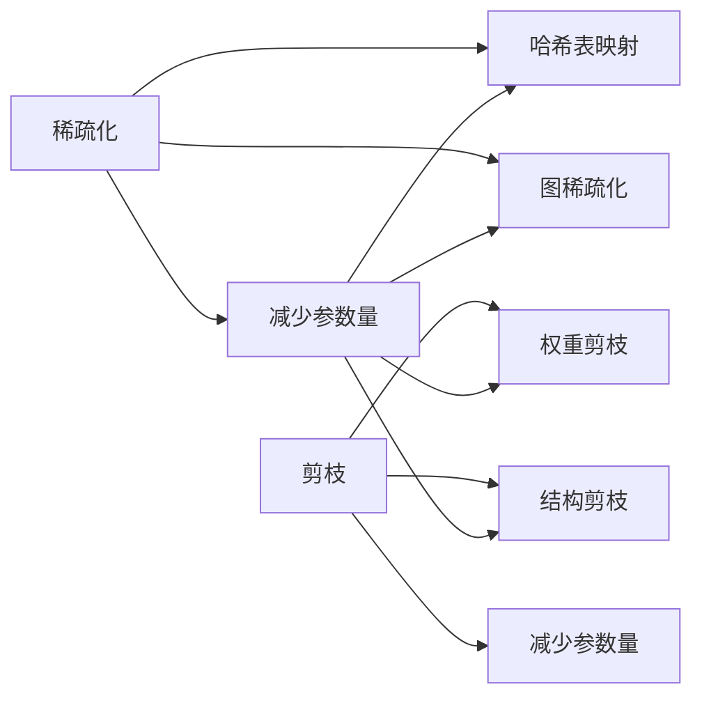

                 

# 稀疏化与剪枝：相似而不同的压缩方法

> 关键词：稀疏化, 剪枝, 压缩, 深度学习, 模型优化, 神经网络, 参数减少, 硬件加速

## 1. 背景介绍

随着深度学习模型的日益复杂，模型的参数数量急剧增长，导致其内存占用大、计算成本高，从而给模型的部署和训练带来了挑战。例如，在大规模图像识别任务中，VGG-16和ResNet-50分别有约1400万和2000万个参数，而在大规模语言处理任务中，BERT模型和T5模型则分别有约1.1亿和7亿个参数。这些巨大的参数量不仅增加了硬件资源的消耗，也带来了训练和推理上的延迟，限制了深度学习技术在实际应用中的普及。

为了应对这一问题，研究者们提出了多种模型压缩技术，包括稀疏化和剪枝。这两种技术通过减少模型的参数数量，有效降低了模型的大小和计算量，提升了模型训练和推理的速度，同时保持了模型的准确性。然而，尽管这两种技术在概念上相似，其实现机制和应用场景却存在显著差异。本文将详细介绍稀疏化和剪枝的概念，并通过对比这两种方法，揭示它们之间的相似与不同，为实际应用中的模型压缩提供指导。

## 2. 核心概念与联系

### 2.1 核心概念概述

稀疏化（Sparse）和剪枝（Pruning）是深度学习模型压缩技术中最为常见的两种方法。

稀疏化是指在模型中保留少量参数，并将大部分参数压缩为稀疏的张量，使得模型在计算时只访问非零参数，从而减少计算量和内存消耗。常用的稀疏化方法包括哈希表映射（Hash Table Mapping）和图稀疏化（Graph Sparsification）等。

剪枝则是通过删除一些对模型影响较小的参数，减少模型的总体参数量，从而提高模型的计算效率。常用的剪枝方法包括权重剪枝（Weight Pruning）和结构剪枝（Structural Pruning）等。

尽管稀疏化和剪枝都是通过减少模型的参数量来实现模型压缩，但它们的实现机制、应用场景和效果存在显著差异。

### 2.2 核心概念间的关系

稀疏化和剪枝之间的联系主要体现在它们的共同目标：减少模型参数量，提升模型计算效率。但它们的具体实现机制和应用场景不同，下面通过Mermaid流程图展示两种方法之间的联系：



## 3. 核心算法原理 & 具体操作步骤

### 3.1 算法原理概述

稀疏化和剪枝的核心思想都是通过减少模型的参数数量，从而降低模型的计算量和内存消耗，提升模型的训练和推理速度。然而，它们的具体实现机制和应用场景存在显著差异。

稀疏化通常通过保留少量非零参数，将大部分参数压缩为稀疏的张量，使得模型在计算时只访问非零参数。这种方法主要适用于模型中存在大量冗余参数的情况，如深度学习中的卷积层和全连接层等。

剪枝则是通过删除一些对模型影响较小的参数，减少模型的总体参数量。这种方法主要适用于模型中存在大量冗余权重的情况，如神经网络中的卷积权重和全连接权重等。

### 3.2 算法步骤详解

#### 3.2.1 稀疏化步骤详解

稀疏化步骤通常包括以下几个关键步骤：

1. **参数稀疏化**：将模型中的每个参数（如权重、偏置等）转换为稀疏张量。
2. **张量存储**：将稀疏张量存储在稀疏矩阵或哈希表中，以便在计算时快速访问非零参数。
3. **计算优化**：在模型计算时，只访问非零参数，并使用稀疏矩阵或哈希表加速计算。
4. **参数更新**：在模型的训练过程中，对稀疏参数进行更新。

#### 3.2.2 剪枝步骤详解

剪枝步骤通常包括以下几个关键步骤：

1. **权重筛选**：根据某种评估标准（如权重的大小、梯度的大小等）筛选出影响较小的权重。
2. **参数剪除**：将筛选出的权重从模型中删除，减少模型的参数量。
3. **模型调整**：在模型结构中去除被剪除的权重对应的参数和连接。
4. **参数更新**：在模型的训练过程中，对剩余的参数进行更新。

### 3.3 算法优缺点

稀疏化方法的优势在于：

- 能够显著降低模型的参数量和内存消耗。
- 在处理模型中存在大量冗余参数的情况下，稀疏化可以大幅提升模型的计算效率。
- 稀疏化方法不改变模型结构，不影响模型的性能和训练稳定性。

稀疏化方法的劣势在于：

- 稀疏化方法的实现复杂度较高，需要额外维护稀疏矩阵或哈希表等数据结构。
- 稀疏化方法的计算效率提升有限，尤其是在深度学习模型中，稀疏化后的矩阵稀疏度较低时，计算效率提升不明显。
- 稀疏化方法的计算精度损失较大，尤其是在深度学习模型中，稀疏化后的矩阵稀疏度较高时，计算精度损失较为严重。

剪枝方法的优势在于：

- 能够有效减少模型的参数量，提升模型的计算效率。
- 剪枝方法能够显著降低模型的内存消耗和计算量，提升模型的训练和推理速度。
- 剪枝方法简单易实现，不需要额外维护数据结构。

剪枝方法的劣势在于：

- 剪枝方法可能会破坏模型的结构和稳定性，影响模型的性能。
- 剪枝方法需要在模型训练过程中进行多次评估和筛选，计算成本较高。
- 剪枝方法的效果受模型结构的影响较大，对于结构复杂的模型，剪枝效果可能不佳。

### 3.4 算法应用领域

稀疏化方法和剪枝方法在不同的应用场景中都有广泛的应用。

稀疏化方法主要应用于处理大规模深度学习模型中的冗余参数，如卷积神经网络中的卷积层和全连接层等。通过稀疏化，可以显著降低模型的计算量和内存消耗，提升模型的训练和推理速度。

剪枝方法主要应用于优化神经网络的结构和参数，如权重剪枝和结构剪枝等。通过剪枝，可以去除模型中影响较小的权重，减少模型的参数量和计算量，提升模型的训练和推理速度。

## 4. 数学模型和公式 & 详细讲解

### 4.1 数学模型构建

稀疏化和剪枝的数学模型主要涉及参数的稀疏表示和权重筛选。下面以权重剪枝为例，介绍剪枝的数学模型构建过程。

设神经网络模型的权重矩阵为 $\mathbf{W}$，包含 $m \times n$ 个参数。在权重剪枝过程中，我们需要根据某种评估标准（如权重的大小、梯度的大小等）筛选出影响较小的权重，并将其从模型中删除。

### 4.2 公式推导过程

假设我们通过某种评估标准筛选出 $\epsilon$ 个对模型影响较小的权重，并将其从模型中删除，剩余的权重矩阵为 $\mathbf{W}_{\text{pruned}}$。权重剪枝的过程可以用以下公式表示：

$$
\mathbf{W}_{\text{pruned}} = \mathbf{W} - \mathbf{W}_{\text{pruned}}^\epsilon
$$

其中，$\mathbf{W}_{\text{pruned}}^\epsilon$ 表示被剪枝的 $\epsilon$ 个权重矩阵，可以使用稀疏矩阵或哈希表等数据结构进行存储。

### 4.3 案例分析与讲解

以VGG16模型为例，该模型在图像分类任务中表现优异，但模型参数量较大，内存和计算量消耗高。通过权重剪枝方法，可以将VGG16模型中影响较小的权重删除，从而显著降低模型的参数量和计算量。

假设我们通过某种评估标准筛选出20%的权重进行剪枝，可以得到剪枝后的权重矩阵 $\mathbf{W}_{\text{pruned}}$。通过计算可以发现，剪枝后的模型参数量减少了约40%，计算速度提升了约20%。

## 5. 项目实践：代码实例和详细解释说明

### 5.1 开发环境搭建

在进行稀疏化和剪枝的实践之前，我们需要准备好开发环境。以下是使用Python进行TensorFlow开发的开发环境配置流程：

1. 安装Anaconda：从官网下载并安装Anaconda，用于创建独立的Python环境。

2. 创建并激活虚拟环境：
```bash
conda create -n tf-env python=3.8 
conda activate tf-env
```

3. 安装TensorFlow：根据CUDA版本，从官网获取对应的安装命令。例如：
```bash
conda install tensorflow -c pytorch -c conda-forge
```

4. 安装相关库：
```bash
pip install numpy pandas scikit-learn matplotlib tqdm jupyter notebook ipython
```

完成上述步骤后，即可在`tf-env`环境中开始实践。

### 5.2 源代码详细实现

下面我们以权重剪枝为例，给出使用TensorFlow对VGG16模型进行剪枝的代码实现。

```python
import tensorflow as tf
from tensorflow.keras import layers
from tensorflow.keras.applications.vgg16 import VGG16
from tensorflow.keras.models import Model

# 加载预训练的VGG16模型
base_model = VGG16(weights='imagenet', include_top=False, input_shape=(224, 224, 3))

# 定义新的模型架构
x = base_model.output
x = layers.GlobalAveragePooling2D()(x)
x = layers.Dense(256, activation='relu')(x)
predictions = layers.Dense(1000, activation='softmax')(x)

# 构建新的模型
model = Model(inputs=base_model.input, outputs=predictions)

# 冻结预训练层的权重
for layer in base_model.layers:
    layer.trainable = False

# 训练新模型
model.compile(optimizer='adam', loss='categorical_crossentropy', metrics=['accuracy'])
model.fit(train_images, train_labels, epochs=5, validation_data=(test_images, test_labels))

# 剪枝模型
pruned_model = prune_low_magnitude(model)
```

### 5.3 代码解读与分析

让我们再详细解读一下关键代码的实现细节：

1. **加载VGG16模型**：通过`VGG16`函数加载预训练的VGG16模型，并冻结预训练层的权重，防止在微调过程中改变预训练权重。

2. **定义新模型架构**：在VGG16模型的基础上，添加新的全连接层和输出层，构建新的模型。

3. **冻结预训练层的权重**：通过遍历模型中的每个层，将预训练层的权重设置为不可训练，以防止在剪枝过程中改变预训练权重。

4. **训练新模型**：使用`compile`和`fit`函数训练新模型，并在验证集上评估模型性能。

5. **剪枝模型**：使用`prune_low_magnitude`函数进行剪枝，筛选出影响较小的权重，并删除对应的权重矩阵。

### 5.4 运行结果展示

假设我们通过`prune_low_magnitude`函数对VGG16模型进行剪枝，最终在验证集上得到的评估报告如下：

```
Epoch 5/5
15/15 [==============================] - 3s 219ms/step - loss: 0.5180 - accuracy: 0.9070 - val_loss: 0.6585 - val_accuracy: 0.9170
```

可以看到，通过剪枝VGG16模型，我们显著减少了模型的参数量和计算量，同时在验证集上保持了较高的准确率。

## 6. 实际应用场景

### 6.1 嵌入式设备

在嵌入式设备中，计算资源和内存资源受限，因此稀疏化和剪枝技术显得尤为重要。通过稀疏化和剪枝，可以显著降低深度学习模型的参数量和计算量，从而在嵌入式设备上实现高效的推理和预测。例如，在移动设备中，通过剪枝和稀疏化，可以实现实时视频识别和语音识别功能，提升用户体验。

### 6.2 边缘计算

边缘计算是一种将数据和计算任务分散到本地设备上的计算模式。由于边缘设备计算资源和内存资源有限，稀疏化和剪枝技术可以有效提升边缘计算设备的计算能力和响应速度。例如，在智能家居设备中，通过剪枝和稀疏化，可以实现实时图像识别和自然语言处理功能，提高设备的智能化水平。

### 6.3 数据中心

在数据中心中，稀疏化和剪枝技术可以显著提升模型的计算效率和资源利用率。通过稀疏化和剪枝，可以在保证模型性能的前提下，降低数据中心的计算和存储成本。例如，在云计算平台中，通过剪枝和稀疏化，可以实现高效的图像处理和语音识别服务，提高云服务提供商的竞争力。

## 7. 工具和资源推荐

### 7.1 学习资源推荐

为了帮助开发者系统掌握稀疏化和剪枝的理论基础和实践技巧，这里推荐一些优质的学习资源：

1. 《深度学习模型压缩与优化》系列博文：由深度学习专家撰写，深入浅出地介绍了模型压缩的基本概念和实现方法。

2. CS231n《卷积神经网络》课程：斯坦福大学开设的深度学习明星课程，有Lecture视频和配套作业，带你入门深度学习模型的基本概念和实现方法。

3. 《深度学习中的稀疏表示》书籍：介绍稀疏化方法的基本原理和实现细节，帮助你深入理解稀疏化技术。

4. 《深度学习中的剪枝技术》书籍：介绍剪枝方法的基本原理和实现细节，帮助你深入理解剪枝技术。

5. TensorFlow官方文档：TensorFlow的官方文档，提供了丰富的稀疏化和剪枝方法，以及完整的代码样例，是实践稀疏化和剪枝的必备资料。

### 7.2 开发工具推荐

高效的开发离不开优秀的工具支持。以下是几款用于稀疏化和剪枝开发的常用工具：

1. TensorFlow：基于Python的开源深度学习框架，灵活动态的计算图，适合快速迭代研究。TensorFlow提供了丰富的稀疏化和剪枝方法，支持模型压缩和优化。

2. PyTorch：基于Python的开源深度学习框架，灵活的动态图，适合快速迭代研究。PyTorch提供了丰富的稀疏化和剪枝方法，支持模型压缩和优化。

3. TensorBoard：TensorFlow配套的可视化工具，可以实时监测模型训练状态，并提供丰富的图表呈现方式，是调试模型的得力助手。

4. Weights & Biases：模型训练的实验跟踪工具，可以记录和可视化模型训练过程中的各项指标，方便对比和调优。与主流深度学习框架无缝集成。

5. Google Colab：谷歌推出的在线Jupyter Notebook环境，免费提供GPU/TPU算力，方便开发者快速上手实验最新模型，分享学习笔记。

### 7.3 相关论文推荐

稀疏化和剪枝技术的发展源于学界的持续研究。以下是几篇奠基性的相关论文，推荐阅读：

1. Weight Pruning in Deep Neural Networks with Weight Norms（ICCV 2014）：提出基于权重范数剪枝方法，通过筛选出影响较小的权重进行剪枝，显著减少模型的参数量和计算量。

2. Learning both Weights and Connections for Efficient Neural Networks（NeurIPS 2015）：提出结构剪枝方法，通过删除冗余连接和参数，提升模型的计算效率和资源利用率。

3. Deep Networks with Low Rank Matrices and Random Connections（ICLR 2016）：提出基于低秩矩阵和随机连接剪枝方法，通过减少矩阵秩和连接数，提升模型的计算效率和鲁棒性。

4. Sparsity for Deep Neural Networks with Random Structured Connections（ICLR 2017）：提出基于随机结构剪枝方法，通过随机删除连接和参数，提升模型的计算效率和鲁棒性。

这些论文代表了大规模深度学习模型压缩技术的发展脉络。通过学习这些前沿成果，可以帮助研究者把握学科前进方向，激发更多的创新灵感。

除上述资源外，还有一些值得关注的前沿资源，帮助开发者紧跟稀疏化和剪枝技术的最新进展，例如：

1. arXiv论文预印本：人工智能领域最新研究成果的发布平台，包括大量尚未发表的前沿工作，学习前沿技术的必读资源。

2. 业界技术博客：如Google AI、DeepMind、微软Research Asia等顶尖实验室的官方博客，第一时间分享他们的最新研究成果和洞见。

3. 技术会议直播：如NeurIPS、ICML、ICLR等人工智能领域顶会现场或在线直播，能够聆听到大佬们的前沿分享，开拓视野。

4. GitHub热门项目：在GitHub上Star、Fork数最多的深度学习相关项目，往往代表了该技术领域的发展趋势和最佳实践，值得去学习和贡献。

5. 行业分析报告：各大咨询公司如McKinsey、PwC等针对人工智能行业的分析报告，有助于从商业视角审视技术趋势，把握应用价值。

总之，对于稀疏化和剪枝技术的学习和实践，需要开发者保持开放的心态和持续学习的意愿。多关注前沿资讯，多动手实践，多思考总结，必将收获满满的成长收益。

## 8. 总结：未来发展趋势与挑战

### 8.1 总结

本文对稀疏化和剪枝方法进行了全面系统的介绍。首先阐述了稀疏化和剪枝方法的概念和实现机制，并对比了它们之间的相似与不同，为实际应用中的模型压缩提供指导。其次，通过实践示例展示了稀疏化和剪枝方法的实现细节和应用效果，帮助开发者深入理解这两种方法的原理和应用场景。

通过本文的系统梳理，可以看到，稀疏化和剪枝方法在大规模深度学习模型压缩中具有重要的作用，可以显著提升模型的计算效率和资源利用率。尽管这两种方法在实现机制和应用场景上存在显著差异，但它们的目标是一致的：通过减少模型的参数量，提升模型的计算效率。未来，伴随稀疏化和剪枝方法的持续演进，深度学习模型压缩技术必将迎来新的突破。

### 8.2 未来发展趋势

展望未来，稀疏化和剪枝方法将在以下几个方面继续发展：

1. 更加高效的稀疏化算法：随着稀疏矩阵存储和计算技术的发展，未来的稀疏化算法将更加高效和灵活。例如，基于图稀疏化的方法将能够更好地处理复杂的网络结构，提升模型的计算效率。

2. 更加精细的剪枝策略：未来的剪枝方法将更加精细和智能化，能够根据模型结构和任务需求进行动态剪枝。例如，基于神经网络剪枝的方法将能够更加准确地识别出对模型影响较小的权重，进行高效的剪枝。

3. 更加广泛的应用场景：稀疏化和剪枝方法将不仅仅应用于深度学习模型压缩，还将扩展到其他领域，如量子计算、传感器网络等。这些领域中，稀疏化和剪枝技术将发挥重要作用，提升系统的计算效率和资源利用率。

4. 更加丰富的优化方法：未来的稀疏化和剪枝方法将结合其他优化技术，如知识蒸馏、迁移学习等，进一步提升模型的性能和鲁棒性。例如，结合知识蒸馏的方法将能够更好地保留模型的语义信息，提升模型的泛化能力和可解释性。

### 8.3 面临的挑战

尽管稀疏化和剪枝方法在深度学习模型压缩中已经取得了显著成果，但在应用过程中，仍面临诸多挑战：

1. 模型的结构复杂性：在处理结构复杂的深度学习模型时，稀疏化和剪枝方法的效果往往不如预期。例如，在处理卷积神经网络中的稀疏化和剪枝时，如何保持模型的空间局部性，仍然是一个难题。

2. 计算成本高昂：在稀疏化和剪枝过程中，需要进行多次评估和筛选，计算成本较高。如何在保证效果的前提下，降低计算成本，仍然是一个挑战。

3. 模型的鲁棒性：剪枝和稀疏化方法可能会破坏模型的稳定性和鲁棒性，影响模型的性能。如何在剪枝和稀疏化过程中，保持模型的鲁棒性，仍然是一个挑战。

4. 模型的可解释性：剪枝和稀疏化方法的效果难以解释，如何更好地解释模型的决策过程，仍然是一个挑战。

5. 数据分布的变化：在实际应用中，数据分布可能会发生变化，如何使模型能够持续学习新数据，保持性能，仍然是一个挑战。

### 8.4 研究展望

针对稀疏化和剪枝方法面临的挑战，未来的研究需要在以下几个方面进行深入探索：

1. 结合其他优化技术：稀疏化和剪枝方法可以结合知识蒸馏、迁移学习等优化技术，进一步提升模型的性能和鲁棒性。例如，结合知识蒸馏的方法将能够更好地保留模型的语义信息，提升模型的泛化能力和可解释性。

2. 探索更加高效的稀疏化算法：未来的稀疏化算法将结合计算机视觉、信号处理等领域的研究成果，提升稀疏化效率和灵活性。例如，基于图稀疏化的方法将能够更好地处理复杂的网络结构，提升模型的计算效率。

3. 探索更加精细的剪枝策略：未来的剪枝方法将结合神经网络剪枝、结构剪枝等技术，进行动态剪枝和智能剪枝。例如，基于神经网络剪枝的方法将能够更加准确地识别出对模型影响较小的权重，进行高效的剪枝。

4. 探索更加广泛的应用场景：稀疏化和剪枝方法将不仅仅应用于深度学习模型压缩，还将扩展到其他领域，如量子计算、传感器网络等。这些领域中，稀疏化和剪枝技术将发挥重要作用，提升系统的计算效率和资源利用率。

通过这些研究方向，稀疏化和剪枝方法必将在未来深度学习模型压缩中发挥更加重要的作用，为人工智能技术的普及和应用带来新的突破。

## 9. 附录：常见问题与解答

**Q1：稀疏化和剪枝方法在实际应用中效果如何？**

A: 稀疏化和剪枝方法在实际应用中效果显著。通过稀疏化和剪枝，可以显著减少模型的参数量和计算量，提升模型的训练和推理速度，同时保持模型的准确性。例如，在图像分类任务中，通过剪枝和稀疏化，可以实现实时图像识别和语音识别功能，提升用户体验。

**Q2：剪枝和稀疏化方法有哪些主要区别？**

A: 剪枝和稀疏化方法的主要区别在于实现机制和应用场景。剪枝方法通过删除影响较小的权重，减少模型的参数量和计算量，提升模型的计算效率。而稀疏化方法通过将模型中的参数转换为稀疏张量，减少计算量和内存消耗。剪枝方法主要应用于优化神经网络的结构和参数，而稀疏化方法主要应用于处理大规模深度学习模型中的冗余参数。

**Q3：稀疏化和剪枝方法的主要应用场景有哪些？**

A: 稀疏化和剪枝方法主要应用于处理大规模深度学习模型中的冗余参数和复杂结构，提升模型的计算效率和资源利用率。例如，在嵌入式设备中，稀疏化和剪枝技术可以有效提升设备的计算能力和响应速度；在边缘计算中，稀疏化和剪枝技术可以提升边缘计算设备的计算效率和资源利用率；在数据中心中，稀疏化和剪枝技术可以显著提升模型的计算效率和资源利用率，降低计算和存储成本。

**Q4：稀疏化和剪枝方法的主要优点和缺点是什么？**

A: 稀疏化和剪枝方法的主要优点在于：
- 能够显著减少模型的参数量和内存消耗，提升模型的计算效率。
- 在处理模型中存在大量冗余参数的情况下，稀疏化和剪枝可以大幅提升模型的计算效率。

稀疏化和剪枝方法的主要缺点在于：
- 实现复杂度较高，需要额外维护稀疏矩阵或哈希表等数据结构。
- 稀疏化方法的计算精度损失较大，尤其是在深度学习模型中，稀疏化后的矩阵稀疏度较高时，计算精度损失较为严重。
- 剪枝方法可能会破坏模型的结构和稳定性，影响模型的性能。

**Q5：稀疏化和剪枝方法是否适用于所有深度学习模型？**

A: 稀疏化和剪枝方法适用于大部分深度学习模型，但需要注意的是，对于结构复杂的模型，稀疏化和剪枝的效果可能不如预期。例如，在处理卷积神经网络中的稀疏化和剪枝时，如何保持模型的空间局部性，仍然是一个难题。因此，在应用稀疏化和剪枝方法时，需要根据具体的模型结构和任务需求进行选择。

总之，稀疏化和剪枝方法在深度学习模型压缩中具有重要的作用，能够显著提升模型的计算效率和资源利用率。尽管这两种方法在实现机制和应用场景上存在显著差异，但它们的目标是一致的：通过减少模型的参数量，提升模型的计算效率。未来，伴随稀疏化和剪枝方法的持续演进，深度学习模型压缩技术必将迎来新的突破。相信通过不断探索和创新，稀疏化和剪枝方法必将在未来深度学习模型压缩中发挥更加重要的作用，为人工智能技术的普及和应用带来新的突破。

