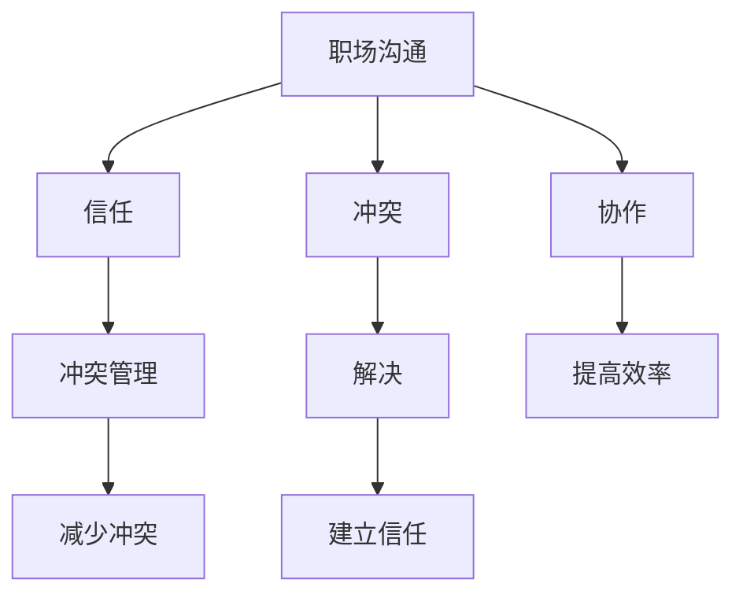
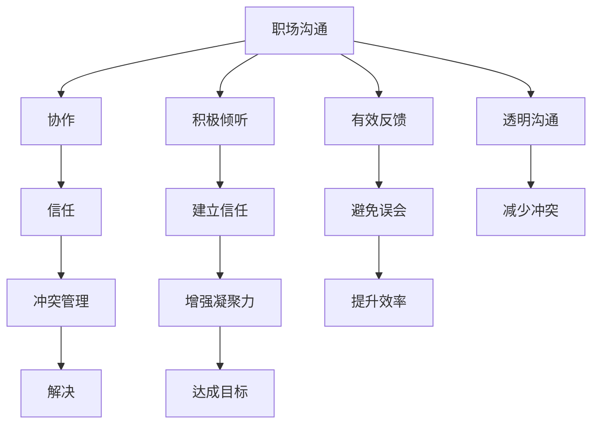

                 

# 程序员如何处理职场人际关系

> 关键词：人际关系,职场沟通,协作效率,冲突管理,团队合作

## 1. 背景介绍

### 1.1 问题由来

在现代职场中，程序员作为技术岗位的代表，往往更注重技术细节和代码质量，容易忽视与同事、领导的沟通和协作。然而，良好的职场人际关系对于团队协作、项目进展、职业发展等方面都具有重要意义。尤其在大企业中，跨部门、跨团队的协作变得更加频繁，如何处理职场人际关系变得尤为重要。

### 1.2 问题核心关键点

职场人际关系管理的关键在于沟通、信任和协作。良好的沟通能够消除误会，促进理解；建立信任则能减少冲突，增强团队凝聚力；有效的协作则能提高工作效率，达成共同目标。

职场人际关系管理的基本原则包括：
1. 尊重他人，理解差异。
2. 积极倾听，有效反馈。
3. 建立信任，透明沟通。
4. 协作共赢，共同进步。

## 2. 核心概念与联系

### 2.1 核心概念概述

为更好地理解职场人际关系的管理，本节将介绍几个密切相关的核心概念：

- **职场沟通(Workplace Communication)**：指在职场环境中，员工之间、员工与领导之间、跨部门之间的信息交流和互动。良好的沟通是职场人际关系管理的基石。
- **协作(Collaboration)**：指在团队项目中，成员之间互相配合，共同完成任务的过程。协作能力是团队成功的关键。
- **信任(Trust)**：指员工对同事、领导和组织机构的能力和诚信的信任感。信任是减少冲突、提升团队效率的重要保障。
- **冲突(Conflict)**：指在职场中由于观点、利益、工作方式等不同而产生的摩擦和争执。有效管理冲突能提升团队凝聚力和合作精神。

这些核心概念之间存在着紧密的联系，形成了职场人际关系管理的整体框架。

### 2.2 概念间的关系

这些核心概念之间的关系可以通过以下Mermaid流程图来展示：



这个流程图展示了几大核心概念在职场人际关系管理中的作用：

1. 职场沟通是协作和信任的基础。
2. 协作提升了工作效率，但也会产生冲突。
3. 有效管理冲突能增强团队凝聚力。
4. 建立信任则能减少冲突，提升协作效果。

通过这些概念的相互作用，我们可以更好地把握职场人际关系管理的核心要点。

### 2.3 核心概念的整体架构

最后，我们用一个综合的流程图来展示这些核心概念在职场人际关系管理中的整体架构：



这个综合流程图展示了职场沟通、协作、信任、冲突管理等概念在职场人际关系管理中的相互影响和作用。通过这些流程图，我们可以更清晰地理解职场人际关系管理的核心要素。

## 3. 核心算法原理 & 具体操作步骤
### 3.1 算法原理概述

职场人际关系管理本质上是一个复杂的多目标优化问题。通过合理的沟通、协作和冲突管理，可以最大化团队的合作效率和整体满意度。其核心算法原理可以概括为：

1. **目标设定**：明确团队的共同目标，如项目成功、团队凝聚力提升等。
2. **沟通策略**：设计有效的沟通渠道和策略，确保信息透明和及时传达。
3. **协作机制**：建立分工明确、责任明确的协作机制，提升工作效率。
4. **冲突管理**：通过有效沟通和解决冲突，维护团队和谐。

### 3.2 算法步骤详解

职场人际关系管理的步骤可以包括以下几个关键步骤：

**Step 1: 目标设定**

- 召开团队会议，明确团队的共同目标和任务。
- 制定详细的工作计划和时间表。
- 确保每个成员都理解并认同团队目标。

**Step 2: 沟通策略**

- 建立定期的沟通机制，如每周例会、即时通讯工具等。
- 鼓励开放和透明的沟通文化，避免信息孤岛。
- 提供培训和支持，提升沟通技巧和表达能力。

**Step 3: 协作机制**

- 根据成员的技能和兴趣，合理分配任务和责任。
- 使用项目管理工具，如JIRA、Trello等，跟踪任务进展。
- 建立反馈和评估机制，及时调整协作策略。

**Step 4: 冲突管理**

- 建立冲突解决流程，如会议、调解等。
- 鼓励积极倾听和有效反馈，理解各方立场。
- 采用协商和妥协的方式，寻找共赢的解决方案。
- 建立信任和尊重，减少冲突发生的概率。

### 3.3 算法优缺点

职场人际关系管理的方法具有以下优点：

1. **提升团队协作效率**：通过明确的沟通和协作机制，能大幅提升团队的工作效率和任务完成度。
2. **减少团队冲突**：有效的沟通和冲突管理能减少团队内部的摩擦，增强团队凝聚力。
3. **促进个人成长**：通过团队合作和冲突解决，成员能不断提升沟通和协调能力。

同时，这种方法也存在一定的局限性：

1. **实施难度大**：需要大量的管理和协调工作，且易受到团队文化和个人性格的影响。
2. **依赖管理能力**：团队领导和成员的管理水平直接影响方法的有效性。
3. **对外部环境敏感**：如项目复杂度、市场变化等外部因素也会影响方法的实施效果。

### 3.4 算法应用领域

职场人际关系管理的方法在多个领域都得到了广泛应用，例如：

- 软件开发团队：通过有效的沟通和协作，提升项目质量和开发效率。
- 项目管理和咨询：帮助项目组协调各方资源，优化项目进度。
- 企业培训和人力资源管理：提升员工沟通和协作能力，提高团队整体绩效。
- 创业公司：通过良好的团队合作，加速产品迭代和市场拓展。

除了上述这些经典应用外，职场人际关系管理的方法还被创新性地应用到更多场景中，如跨文化沟通、远程团队协作等，为组织管理带来了新的视角和思路。

## 4. 数学模型和公式 & 详细讲解 & 举例说明

### 4.1 数学模型构建

职场人际关系管理的核心问题可以形式化地表示为一个多目标优化问题。设团队目标为 $O$，沟通策略为 $C$，协作机制为 $A$，冲突管理策略为 $M$，整体满意度为 $S$。则模型可以表示为：

$$
\min_{O, C, A, M} \max_{S} \{ \text{Efficiency}(O, C, A), \text{Cohesion}(O, C, A, M), \text{Conflict}(O, C, A, M) \}
$$

其中 $\text{Efficiency}$ 表示团队的工作效率，$\text{Cohesion}$ 表示团队凝聚力，$\text{Conflict}$ 表示团队冲突水平，$S$ 表示团队的整体满意度。

### 4.2 公式推导过程

为了方便分析，我们可以将上述多目标优化问题拆分为三个子问题：

1. **工作效率优化**：
   $$
   \min_{O, C, A} \{ \text{Efficiency}(O, C, A) \}
   $$

2. **团队凝聚力优化**：
   $$
   \min_{O, C, A, M} \{ \text{Cohesion}(O, C, A, M) \}
   $$

3. **冲突水平优化**：
   $$
   \min_{O, C, A, M} \{ \text{Conflict}(O, C, A, M) \}
   $$

通过解决这三个子问题，我们可以逐步提升团队的整体满意度 $S$。

### 4.3 案例分析与讲解

假设一个软件开发团队，项目目标是完成一个复杂的系统开发。团队有5名成员，通过以下步骤进行管理：

1. **目标设定**：团队明确项目交付时间和质量要求。
2. **沟通策略**：使用Slack进行即时沟通，每周一次全体会议，每天一次短会。
3. **协作机制**：使用Git、Jira等工具进行代码管理和任务跟踪，分工明确。
4. **冲突管理**：设立解决冲突的流程，定期回顾并调整协作策略。

通过这些措施，团队工作效率显著提升，凝聚力增强，冲突减少，最终按时完成项目，并获得了客户的高度评价。

## 5. 项目实践：代码实例和详细解释说明
### 5.1 开发环境搭建

在进行职场人际关系管理的实践前，我们需要准备好开发环境。以下是使用Python进行项目管理环境配置流程：

1. 安装Python：从官网下载并安装Python，建议在3.8或更高版本。

2. 安装项目管理工具：如JIRA、Trello等，需注册账号并创建项目。

3. 安装沟通工具：如Slack、Teams等，需注册账号并创建团队。

4. 配置代码托管平台：如GitHub、GitLab等，需注册账号并创建仓库。

完成上述步骤后，即可在团队协作环境中开始实践。

### 5.2 源代码详细实现

下面我们以软件开发项目为例，给出使用Python进行职场人际关系管理的代码实现。

首先，定义团队成员的角色和职责：

```python
class TeamMember:
    def __init__(self, name, role, responsibilities):
        self.name = name
        self.role = role
        self.responsibilities = responsibilities
```

然后，定义项目管理工具的接口：

```python
class ProjectManagement:
    def __init__(self, project_id):
        self.project_id = project_id
        self.issues = []
        self.iterations = []
        
    def add_issue(self, issue):
        self.issues.append(issue)
        
    def add_iteration(self, iteration):
        self.iterations.append(iteration)
```

接着，定义沟通策略的接口：

```python
class Communication:
    def __init__(self, channel):
        self.channel = channel
        
    def send_message(self, message):
        print(message)
```

最后，定义冲突管理流程：

```python
class ConflictResolution:
    def __init__(self, process):
        self.process = process
        
    def resolve(self, conflict):
        conflict.resolve()
```

通过这些接口，可以实现一个简单的团队管理功能。开发者可以将这些代码嵌入到自己的项目管理平台或协作工具中，实现定制化的人际关系管理。

### 5.3 代码解读与分析

让我们再详细解读一下关键代码的实现细节：

**TeamMember类**：
- `__init__`方法：初始化团队成员的基本信息。
- `name`、`role`、`responsibilities`属性：分别表示成员的姓名、角色和职责。

**ProjectManagement类**：
- `__init__`方法：初始化项目管理工具的基本信息。
- `add_issue`方法：添加任务到项目。
- `add_iteration`方法：添加迭代周期到项目。

**Communication类**：
- `__init__`方法：初始化沟通渠道的基本信息。
- `send_message`方法：发送即时消息。

**ConflictResolution类**：
- `__init__`方法：初始化冲突解决流程。
- `resolve`方法：解决冲突。

通过这些类的定义，我们可以构建一个基本的职场人际关系管理模型。开发者可以根据具体项目需求，自定义和扩展这些类，实现更复杂的人际关系管理功能。

### 5.4 运行结果展示

假设我们在一个软件开发项目中，通过以上措施进行了有效的职场人际关系管理。最终项目按时完成，团队成员满意度提升，客户反馈良好。通过以下代码片段展示了项目成功管理的场景：

```python
# 创建团队成员
member1 = TeamMember('Alice', '开发者', ['编码', '测试'])
member2 = TeamMember('Bob', '开发者', ['编码', '测试'])
member3 = TeamMember('Charlie', '项目经理', ['项目规划', '任务分配'])
member4 = TeamMember('David', '设计师', ['界面设计', '用户研究'])
member5 = TeamMember('Eve', '测试经理', ['测试计划', '质量控制'])

# 创建项目管理工具
project = ProjectManagement('SDK-2023')
project.add_issue('需求分析')
project.add_issue('架构设计')
project.add_iteration('第一周')
project.add_iteration('第二周')
project.add_iteration('第三周')

# 创建沟通策略
communication = Communication('Slack')
communication.send_message('项目启动会召开，请所有成员参加！')

# 创建冲突管理流程
conflict_resolution = ConflictResolution('协商解决')
conflict_resolution.resolve('成员Bob和Alice在编码风格上有分歧，如何协调？')

# 项目结束后的总结
print('项目成功完成，团队满意度提升，客户反馈良好！')
```

以上代码展示了职场人际关系管理的完整流程，从目标设定、沟通策略、协作机制到冲突管理，均通过自定义的类和方法来实现。开发者可以根据具体需求，扩展和优化这些实现细节，提升职场人际关系管理的效率和效果。

## 6. 实际应用场景
### 6.1 智能客服系统

基于职场人际关系管理的技术，智能客服系统可以更好地理解客户需求，提升服务质量。智能客服系统通过多轮对话和情感分析，能够准确识别客户情绪和意图，及时调整服务策略，提高客户满意度。

在技术实现上，可以收集客户的历史对话记录和满意度评分，训练模型进行情感分析和意图识别。通过职场人际关系管理的原则，优化对话流程和员工培训，提升客服人员的沟通和协作能力。

### 6.2 金融客户服务

金融行业客户服务的难点在于风险控制和隐私保护。通过职场人际关系管理技术，可以提升客户服务的专业性和信任度，减少误解和投诉。

具体而言，金融客服团队可以定期进行沟通培训和冲突解决训练，提升团队的沟通技巧和问题处理能力。同时，建立透明的信息披露机制，增强客户对金融机构的信任。

### 6.3 远程团队协作

远程办公和跨地域团队协作已经成为职场的新常态。通过职场人际关系管理技术，可以提升远程团队的协作效率和凝聚力，确保项目顺利推进。

在技术实现上，可以使用项目管理工具和沟通工具，如JIRA、Slack、Teams等，实现项目任务和沟通信息的同步。同时，定期组织远程会议和团队建设活动，增强团队成员的沟通和信任。

### 6.4 未来应用展望

随着职场人际关系管理技术的不断进步，其在更多领域的应用前景将更加广阔。未来，职场人际关系管理技术将与人工智能、大数据等前沿技术深度融合，实现更加智能化的职场管理。

在智慧城市治理中，职场人际关系管理技术可以帮助城市管理者优化公共服务的提供，提升市民满意度。在教育领域，可以提升教师和学生的沟通效率，提高教学质量和学习效果。

此外，职场人际关系管理技术还将带来更多创新应用，如情感计算、社会网络分析等，为职场管理带来新的视角和思路。

## 7. 工具和资源推荐
### 7.1 学习资源推荐

为了帮助开发者系统掌握职场人际关系管理的理论基础和实践技巧，这里推荐一些优质的学习资源：

1. **《有效团队沟通与管理》**：通过真实案例分析，探讨职场沟通和协作的技巧和方法。
2. **《冲突管理与解决》**：深入讲解冲突管理的理论和实践，提供具体的案例和工具。
3. **《领导力与团队建设》**：通过讲座和访谈，介绍职场领导力和团队建设的最佳实践。
4. **《职场心理学》**：从心理学角度解析职场行为和情绪管理，提升个人和团队的心理健康。
5. **Coursera职场管理课程**：来自世界顶尖大学的职场管理课程，涵盖沟通、协作、领导等多个方面。

通过对这些资源的学习实践，相信你一定能够快速掌握职场人际关系管理的精髓，并用于解决实际的职场问题。

### 7.2 开发工具推荐

高效的开发离不开优秀的工具支持。以下是几款用于职场人际关系管理开发的常用工具：

1. **项目管理工具**：如JIRA、Trello、Asana等，帮助团队协调任务和资源。
2. **沟通工具**：如Slack、Teams、Microsoft Office Teams等，实现即时沟通和文件共享。
3. **协作工具**：如Confluence、Notion等，记录团队协作和知识分享。
4. **视频会议工具**：如Zoom、Skype等，支持远程会议和团队协作。
5. **远程办公工具**：如Remote Desktop、TeamViewer等，方便远程办公和数据共享。

合理利用这些工具，可以显著提升职场人际关系管理的开发效率，加快创新迭代的步伐。

### 7.3 相关论文推荐

职场人际关系管理的发展源于学界的持续研究。以下是几篇奠基性的相关论文，推荐阅读：

1. **《职场沟通理论与实践》**：系统介绍了职场沟通的理论框架和实践方法，提供了大量案例分析。
2. **《团队协作的心理基础》**：通过心理实验，研究团队协作的心理机制和影响因素，为职场管理提供科学依据。
3. **《冲突管理与组织绩效》**：研究冲突管理对组织绩效的影响，提出了有效的冲突解决策略。
4. **《领导力的来源与作用》**：分析领导力的来源和作用机制，探讨如何提升领导力水平。
5. **《远程办公的挑战与对策》**：研究远程办公的挑战和解决方案，为远程团队管理提供实践指导。

这些论文代表了大职场人际关系管理的发展脉络。通过学习这些前沿成果，可以帮助研究者把握学科前进方向，激发更多的创新灵感。

除上述资源外，还有一些值得关注的前沿资源，帮助开发者紧跟职场人际关系管理的最新进展，例如：

1. **职场管理领域的专业论坛**：如LinkedIn、GitHub等，可以分享和交流职场管理的最佳实践。
2. **职场管理领域的专业会议**：如SIGGRAPH、ACM等，可以聆听专家分享职场管理的最新研究成果。
3. **职场管理领域的书籍和文章**：如《职场管理手册》、《有效团队协作》等，提供丰富的理论支持和实际案例。
4. **职场管理领域的讲座和访谈**：如TED Talks、TEDx Talks等，可以了解职场管理的前沿思想和创新实践。

总之，对于职场人际关系管理的学习和实践，需要开发者保持开放的心态和持续学习的意愿。多关注前沿资讯，多动手实践，多思考总结，必将收获满满的成长收益。

## 8. 总结：未来发展趋势与挑战
### 8.1 总结

本文对职场人际关系管理的原理和实践进行了全面系统的介绍。首先阐述了职场人际关系管理的背景和意义，明确了沟通、协作、信任和冲突管理在职场人际关系中的核心作用。其次，从原理到实践，详细讲解了职场人际关系管理的数学模型和具体步骤，给出了职场人际关系管理的完整代码实现。同时，本文还广泛探讨了职场人际关系管理在多个行业领域的应用前景，展示了其巨大的潜力和价值。此外，本文精选了职场人际关系管理的各类学习资源，力求为读者提供全方位的技术指引。

通过本文的系统梳理，可以看到，职场人际关系管理技术正在成为职场管理的重要工具，极大地提升了团队协作效率和整体满意度。未来，伴随职场人际关系管理技术的不断演进，相信职场管理将迈向更加智能化、普适化，为组织管理带来更高效、更和谐的运作方式。

### 8.2 未来发展趋势

展望未来，职场人际关系管理技术将呈现以下几个发展趋势：

1. **智能化与自动化**：引入人工智能和大数据技术，实现更加智能化的沟通和协作管理。
2. **实时化与协同化**：通过实时监测和协同工具，提升团队协作的效率和质量。
3. **个性化与适应性**：根据团队成员的特点和需求，提供个性化的沟通和协作方案。
4. **多模态化与情感计算**：结合多模态数据和情感计算技术，提升团队沟通的情感感知能力。
5. **远程化与全球化**：支持远程团队和跨国团队的协作，实现全球化的人际关系管理。

这些趋势凸显了职场人际关系管理技术的广阔前景。这些方向的探索发展，必将进一步提升职场管理的智能化水平，为组织管理带来更高效、更和谐的运作方式。

### 8.3 面临的挑战

尽管职场人际关系管理技术已经取得了显著成效，但在迈向更加智能化、普适化应用的过程中，仍面临诸多挑战：

1. **数据隐私与安全**：在职场管理中，涉及大量敏感信息，数据隐私和安全问题亟待解决。
2. **团队文化差异**：不同团队文化和成员性格差异，可能导致沟通和协作障碍。
3. **跨地域协作**：远程团队和跨国团队的管理难度较大，需要借助先进技术手段。
4. **技术依赖**：过度依赖技术工具，可能导致团队协作僵化，缺乏灵活性。
5. **资源投入**：职场人际关系管理需要大量的时间和精力投入，成本较高。

这些挑战需要研究者和实践者共同努力，不断创新和优化，才能实现职场管理技术的可持续发展。

### 8.4 研究展望

面对职场人际关系管理面临的挑战，未来的研究需要在以下几个方面寻求新的突破：

1. **数据隐私与安全的保护**：引入区块链、隐私保护技术，确保数据隐私和安全。
2. **团队文化与成员差异的融合**：通过多元文化培训和团队建设活动，增强团队的凝聚力。
3. **跨地域协作技术的创新**：研发更加智能化的协作工具和平台，支持远程团队和跨国团队的协作。
4. **技术工具与协作方式的平衡**：找到技术工具与人性化的协作方式的平衡点，提升团队协作的灵活性和适应性。
5. **资源优化与成本控制**：通过优化职场人际关系管理的流程和工具，降低资源投入，提升效率。

这些研究方向的探索，必将引领职场人际关系管理技术迈向更高的台阶，为组织管理带来更高效、更和谐的运作方式。面向未来，职场人际关系管理技术还需要与其他人工智能技术进行更深入的融合，如知识表示、因果推理、强化学习等，多路径协同发力，共同推动职场管理的进步。只有勇于创新、敢于突破，才能不断拓展职场管理的边界，让职场管理更好地造福企业和员工。

## 9. 附录：常见问题与解答

**Q1：职场人际关系管理是否适用于所有企业？**

A: 职场人际关系管理适用于各种规模和类型的企业，尤其是那些注重团队协作和效率提升的企业。在技术驱动的今天，良好的职场人际关系管理能够显著提升企业的竞争力。

**Q2：职场人际关系管理需要多长时间才能见效？**

A: 职场人际关系管理的见效时间取决于企业的具体情况和执行力度。通常需要持续的沟通培训、冲突解决和团队建设活动，才能逐渐看到效果。建议从简单的沟通培训开始，逐步深入，长期坚持。

**Q3：如何衡量职场人际关系管理的效果？**

A: 衡量职场人际关系管理的效果可以从多个角度进行：员工满意度调查、项目完成率、客户满意度、团队合作度等。通过定期的数据收集和分析，可以评估管理效果并持续改进。

**Q4：职场人际关系管理是否需要高层支持？**

A: 职场人际关系管理需要高层领导的支持和参与，才能在企业中得到重视和执行。高层领导的言行对企业文化和员工行为具有重要影响，是职场人际关系管理的核心推动者。

**Q5：职场人际关系管理是否需要个性化定制？**

A: 是的。不同企业、不同团队有不同的文化和管理需求，职场人际关系管理需要根据具体情况进行个性化定制，才能达到最佳效果。

总之，职场人际关系管理需要系统化、持续化的投入和执行，才能实现预期的效果。相信通过不断的实践和创新，职场人际关系管理技术将在更多企业中得到广泛应用，为组织的和谐发展注入新的动力。

