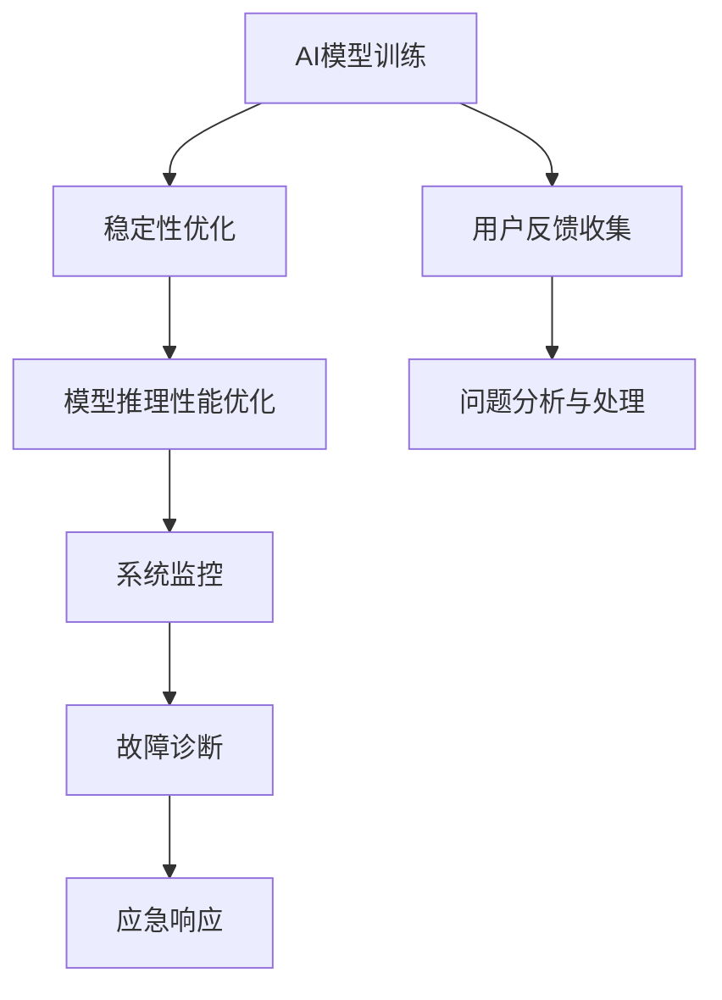
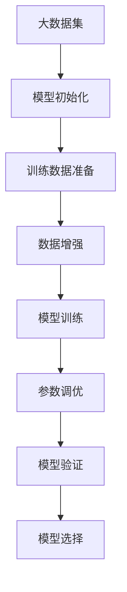
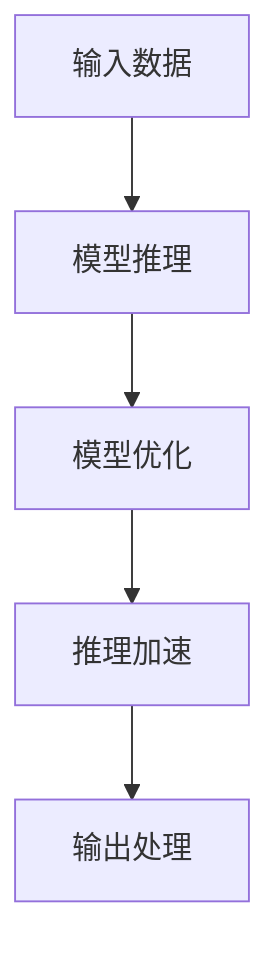
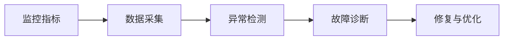
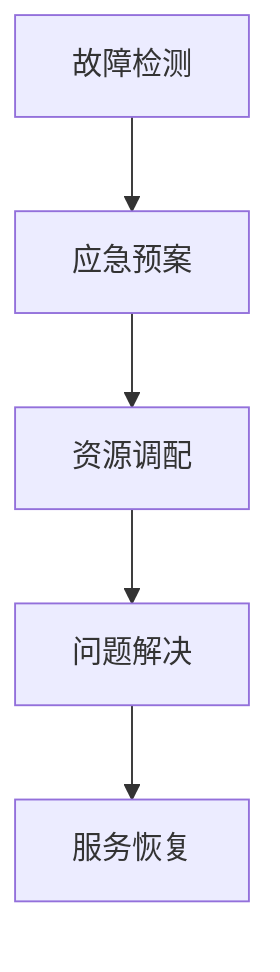
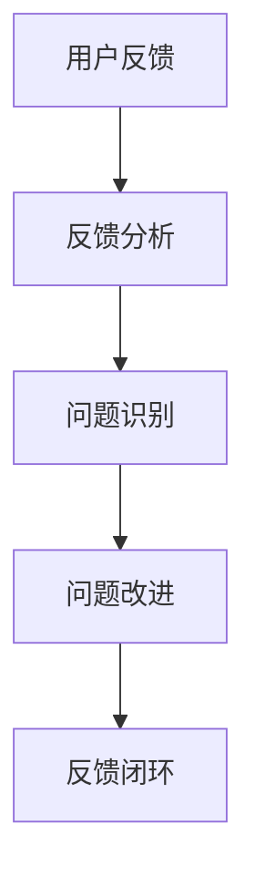
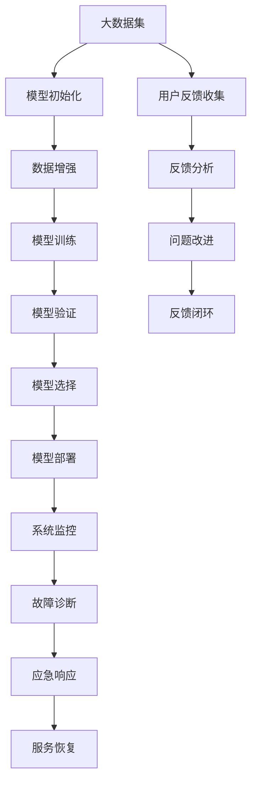

                 

# 稳定性与运维服务：Lepton AI的重点，保障用户体验与平台稳定性

> 关键词：人工智能, 深度学习, 模型训练, 模型推理, 性能优化, 故障诊断, 应急响应, 系统监控, 用户反馈, 可靠性, 可扩展性, 安全性

## 1. 背景介绍

### 1.1 问题由来

随着人工智能(AI)技术的迅猛发展，深度学习(DL)模型在各行各业的应用日益广泛，从自然语言处理(NLP)、计算机视觉(CV)到语音识别(SR)、推荐系统等，AI模型已经深度渗透到各种场景。然而，AI模型的稳定性和运维服务的质量，直接关系到用户体验和平台可用性。

无论是训练阶段的稳定性问题，还是推理阶段的性能瓶颈，或是部署后的系统监控和故障排查，都成为AI企业需要重点关注和解决的核心问题。针对这些问题，Lepton AI团队提出了一套全面的稳定性和运维服务解决方案，旨在确保AI模型在实际应用中的高性能和稳定性。

### 1.2 问题核心关键点

1. **模型训练稳定性和性能**：在大规模数据集上训练深度学习模型时，如何避免过拟合、梯度消失等问题，保证模型能够稳定收敛？
2. **模型推理性能优化**：在实际应用中，如何加速模型推理过程，优化模型运行效率，提高系统响应速度？
3. **系统监控和故障诊断**：如何建立有效的监控体系，及时发现系统异常，快速定位和解决故障？
4. **应急响应和预案制定**：在模型出现故障或异常时，如何快速响应，制定和执行有效的应急预案，确保服务连续性？
5. **用户反馈收集与处理**：如何收集用户反馈，识别系统问题，持续改进产品和服务质量？

### 1.3 问题研究意义

保障AI模型的稳定性和运维服务的质量，对于提升用户体验、维护平台可靠性至关重要。通过优化模型训练、推理性能，建立完善的监控和故障诊断体系，以及有效的应急响应机制，可以极大地提升AI模型的实用性和用户体验。这对于推动AI技术的广泛应用，加速各行业的数字化转型，具有重要意义。

## 2. 核心概念与联系

### 2.1 核心概念概述

为更好地理解Lepton AI的稳定性和运维服务解决方案，本节将介绍几个密切相关的核心概念：

- **AI模型训练稳定性**：指在训练过程中，如何避免过拟合、梯度消失、梯度爆炸等问题，保证模型能够在稳定的条件下收敛到理想状态。
- **AI模型推理性能**：指在推理阶段，如何快速、准确地处理输入数据，生成符合期望的输出结果。
- **系统监控和故障诊断**：指通过监控系统的各种关键指标，及时发现异常情况，并进行故障诊断和处理。
- **应急响应和预案制定**：指在模型出现故障或异常时，如何快速响应，制定和执行有效的应急预案，确保服务连续性。
- **用户反馈收集与处理**：指如何收集用户反馈，分析用户问题，及时改进和优化产品和服务。

这些核心概念之间的逻辑关系可以通过以下Mermaid流程图来展示：



这个流程图展示了AI模型稳定性和运维服务的主要流程，即从模型训练到模型推理，再到系统监控和故障诊断，以及最后的用户反馈处理和问题改进。

### 2.2 概念间的关系

这些核心概念之间存在着紧密的联系，形成了AI模型稳定性和运维服务的完整生态系统。下面我通过几个Mermaid流程图来展示这些概念之间的关系。

#### 2.2.1 AI模型训练稳定性



这个流程图展示了AI模型训练的基本流程，从数据准备、增强、训练、调优到验证和选择。

#### 2.2.2 AI模型推理性能优化



这个流程图展示了AI模型推理的基本流程，从数据输入、模型推理、优化到结果输出。

#### 2.2.3 系统监控和故障诊断



这个流程图展示了系统监控和故障诊断的基本流程，从监控指标采集、异常检测、诊断到修复和优化。

#### 2.2.4 应急响应和预案制定



这个流程图展示了应急响应和预案制定的基本流程，从故障检测、预案执行到问题解决和服务恢复。

#### 2.2.5 用户反馈收集与处理



这个流程图展示了用户反馈收集与处理的基本流程，从反馈收集、分析、识别到改进和闭环。

### 2.3 核心概念的整体架构

最后，我们用一个综合的流程图来展示这些核心概念在大规模AI模型稳定性和运维服务过程中的整体架构：



这个综合流程图展示了从模型训练到部署、系统监控、故障诊断、应急响应、服务恢复，再到用户反馈收集、分析、改进和闭环的完整过程。

## 3. 核心算法原理 & 具体操作步骤
### 3.1 算法原理概述

Lepton AI的稳定性和运维服务解决方案，基于以下几个核心算法原理：

- **模型训练稳定性算法**：包括正则化、权重衰减、批归一化、学习率调整等，确保模型在训练过程中的稳定性。
- **模型推理性能优化算法**：包括模型压缩、量化、剪枝、通道分离等，提高模型推理效率。
- **系统监控和故障诊断算法**：包括基于指标的监控、异常检测、故障隔离、日志分析等，快速发现和解决系统问题。
- **应急响应和预案制定算法**：包括实时监控、告警触发、故障预案、服务恢复等，确保模型和服务的连续性。
- **用户反馈收集与处理算法**：包括用户问卷、用户日志、服务指标分析等，收集用户反馈，持续改进产品和服务。

### 3.2 算法步骤详解

#### 3.2.1 模型训练稳定性

1. **数据准备**：从大规模数据集中随机抽样，保证数据的多样性和代表性。
2. **正则化**：在损失函数中引入L2正则项，防止过拟合。
3. **权重衰减**：在更新参数时加入权重衰减项，减小参数变化幅度，避免梯度爆炸。
4. **批归一化**：对输入数据进行归一化处理，加速模型收敛，防止梯度消失。
5. **学习率调整**：根据模型性能动态调整学习率，保持模型稳定。

#### 3.2.2 模型推理性能优化

1. **模型压缩**：通过剪枝、量化等方法，减少模型参数量，降低计算复杂度。
2. **量化加速**：将模型参数和激活值从浮点型转换为定点型，减少内存占用，加速推理。
3. **剪枝优化**：删除对模型性能影响较小的参数，提高推理效率。
4. **通道分离**：将模型分解为多个子模块，并行推理，提高系统吞吐量。

#### 3.2.3 系统监控和故障诊断

1. **监控指标**：定义关键性能指标(KPIs)，如响应时间、吞吐量、错误率等。
2. **数据采集**：实时采集系统监控指标和日志信息。
3. **异常检测**：通过阈值判断、时序分析等方法，检测系统异常。
4. **故障诊断**：使用日志分析和故障树等方法，快速定位问题。
5. **修复与优化**：根据故障诊断结果，采取相应措施，修复系统漏洞，优化系统性能。

#### 3.2.4 应急响应和预案制定

1. **实时监控**：建立实时监控系统，及时发现系统异常。
2. **告警触发**：根据监控指标，设置告警阈值，及时通知相关人员。
3. **故障预案**：制定详细的应急预案，明确处理流程和责任。
4. **服务恢复**：根据故障类型和严重程度，执行相应的服务恢复策略，确保服务连续性。

#### 3.2.5 用户反馈收集与处理

1. **用户问卷**：设计问卷调查，收集用户反馈。
2. **用户日志**：分析用户使用日志，识别潜在问题。
3. **服务指标**：分析服务指标，识别系统性能问题。
4. **问题改进**：根据反馈和分析结果，改进产品和服务。
5. **反馈闭环**：建立反馈处理闭环，持续优化用户体验。

### 3.3 算法优缺点

#### 3.3.1 模型训练稳定性的优点和缺点

- **优点**：
  - **防止过拟合**：通过正则化和权重衰减，可以有效防止模型过拟合，提高模型泛化能力。
  - **加速收敛**：批归一化和学习率调整，可以加速模型收敛，提高训练效率。

- **缺点**：
  - **模型复杂度增加**：正则化和批归一化等方法，可能会增加模型复杂度，影响模型性能。
  - **参数量较大**：模型压缩和量化等方法，虽然减小了参数量，但可能会影响模型精度。

#### 3.3.2 模型推理性能优化的优点和缺点

- **优点**：
  - **提高效率**：通过模型压缩、量化、剪枝等方法，可以有效提高模型推理效率，降低计算资源消耗。
  - **资源利用率**：通道分离等方法，可以并行处理多个任务，提高系统资源利用率。

- **缺点**：
  - **精度损失**：量化和剪枝等方法，可能会损失部分模型精度，影响推理效果。
  - **实现复杂**：模型压缩和量化等方法，实现起来较为复杂，需要专业知识和经验。

#### 3.3.3 系统监控和故障诊断的优点和缺点

- **优点**：
  - **快速发现问题**：实时监控和异常检测，可以及时发现系统问题，防止服务中断。
  - **精准定位故障**：故障诊断和修复措施，可以快速定位故障，并采取相应措施。

- **缺点**：
  - **系统成本高**：建立实时监控和故障诊断系统，需要高成本的硬件设备和软件工具。
  - **维护复杂**：系统的维护和更新需要专业知识和经验，维护成本较高。

#### 3.3.4 应急响应和预案制定的优点和缺点

- **优点**：
  - **服务连续性**：应急响应和预案制定，可以确保服务在异常情况下的连续性，减少用户损失。
  - **快速恢复**：服务恢复策略，可以快速修复系统漏洞，恢复系统功能。

- **缺点**：
  - **预案复杂**：应急预案的制定和执行，需要详尽的流程和策略，预案复杂度较高。
  - **人工依赖**：应急响应和预案制定，依赖于人工干预，可能会存在响应不及时的情况。

#### 3.3.5 用户反馈收集与处理的优点和缺点

- **优点**：
  - **用户满意度提升**：用户反馈的收集和处理，可以及时发现和解决用户问题，提升用户满意度。
  - **持续改进**：用户反馈的持续改进，可以不断优化产品和服务，提升用户体验。

- **缺点**：
  - **数据量庞大**：用户反馈的数据量庞大，需要有效管理和分析，才能发挥其价值。
  - **数据质量问题**：用户反馈的数据质量问题，如噪音数据、重复反馈等，会影响分析结果。

### 3.4 算法应用领域

基于Lepton AI的稳定性和运维服务解决方案，已经在多个AI领域得到了广泛的应用，例如：

- **金融科技**：在金融风控、反欺诈、客户服务等领域，通过稳定的AI模型和高效的运维服务，提升金融服务的可靠性和用户体验。
- **医疗健康**：在医学影像分析、智能诊断、患者咨询等领域，通过稳定的AI模型和实时的系统监控，保障医疗服务的质量和安全性。
- **智能制造**：在工业智能、设备预测性维护、生产优化等领域，通过高效的AI模型和实时的运维服务，提高制造效率和生产质量。
- **智能交通**：在自动驾驶、车联网、智能调度等领域，通过稳定的AI模型和实时的运维服务，提升交通系统的安全和效率。
- **智慧城市**：在城市管理、公共服务、环境监测等领域，通过高效的AI模型和实时的运维服务，提升城市管理和服务水平。

这些应用领域展示了Lepton AI的稳定性和运维服务解决方案在实际应用中的广泛性和有效性。

## 4. 数学模型和公式 & 详细讲解 & 举例说明

### 4.1 数学模型构建

本节将使用数学语言对Lepton AI的稳定性和运维服务解决方案进行更加严格的刻画。

记AI模型为 $f(x;\theta)$，其中 $x$ 为输入数据，$\theta$ 为模型参数。模型的训练目标为最小化损失函数 $\mathcal{L}$，即：

$$
\mathcal{L}(\theta) = \frac{1}{N}\sum_{i=1}^N \ell(f(x_i;\theta),y_i)
$$

其中 $\ell$ 为损失函数，$y_i$ 为模型输出的真实标签。

### 4.2 公式推导过程

#### 4.2.1 模型训练稳定性

在训练过程中，为了防止过拟合和梯度消失，可以引入正则化项和权重衰减项：

$$
\mathcal{L}_{reg}(\theta) = \frac{1}{N}\sum_{i=1}^N \ell(f(x_i;\theta),y_i) + \lambda(\|w\|^2_2)
$$

其中 $\lambda$ 为正则化系数，$\|w\|^2_2$ 为权重衰减项，$w$ 为模型参数。

批归一化可以加速模型收敛，防止梯度消失，公式为：

$$
\hat{x} = \frac{x - \mu_x}{\sqrt{\sigma_x^2 + \epsilon}}
$$

其中 $\mu_x$ 和 $\sigma_x^2$ 分别为输入数据的均值和方差，$\epsilon$ 为数值稳定因子。

学习率调整可以确保模型在训练过程中的稳定性，公式为：

$$
\eta_{t+1} = \eta_t \times \text{decay}^t
$$

其中 $\eta_t$ 为当前学习率，$\text{decay}$ 为衰减率。

#### 4.2.2 模型推理性能优化

模型压缩可以通过剪枝和量化实现，公式为：

$$
\hat{f}(x) = \sum_{i=1}^M c_i \sigma(g_i(\hat{f}_i(x)))
$$

其中 $c_i$ 和 $g_i$ 分别为剪枝和量化的权重，$\hat{f}_i(x)$ 为压缩后的模型输出。

量化可以通过将浮点数转换为定点数实现，公式为：

$$
q = \text{floor}(f \times 2^{-\text{bits}})
$$

其中 $f$ 为浮点数，$\text{bits}$ 为量化位数。

剪枝可以通过删除低权重参数实现，公式为：

$$
f_{pruned} = \sum_{i=1}^M c_i \sigma(g_i(f_i))
$$

其中 $c_i$ 和 $g_i$ 分别为剪枝的权重和函数，$f_i$ 为原始模型输出。

通道分离可以通过将模型分解为多个子模块实现，公式为：

$$
f_{channel} = \bigoplus_{i=1}^k f_i(x)
$$

其中 $\bigoplus$ 为通道连接符号，$k$ 为通道数，$f_i(x)$ 为通道分离后的模型输出。

#### 4.2.3 系统监控和故障诊断

基于指标的监控可以通过设置关键性能指标(KPIs)实现，公式为：

$$
\mathcal{L}_{monitor}(\theta) = \frac{1}{N}\sum_{i=1}^N \ell(\text{KPI}_i - \text{target}_i)
$$

其中 $\text{KPI}_i$ 为第 $i$ 个监控指标，$\text{target}_i$ 为预设目标值。

异常检测可以通过阈值判断和时间序列分析实现，公式为：

$$
\mathcal{L}_{detect}(\theta) = \frac{1}{N}\sum_{i=1}^N \ell(1_{\{\text{KPI}_i > \text{threshold}_i\}})
$$

其中 $1_{\{\cdot\}}$ 为指示函数，$\text{threshold}_i$ 为预设阈值。

故障诊断可以通过日志分析和故障树实现，公式为：

$$
\mathcal{L}_{diagnose}(\theta) = \frac{1}{N}\sum_{i=1}^N \ell(f_{tree}(\text{log}_i))
$$

其中 $f_{tree}$ 为故障树模型，$\text{log}_i$ 为第 $i$ 个日志记录。

#### 4.2.4 应急响应和预案制定

应急响应可以通过实时监控和告警触发实现，公式为：

$$
\mathcal{L}_{response}(\theta) = \frac{1}{N}\sum_{i=1}^N \ell(1_{\{\text{alert}_i\}})
$$

其中 $1_{\{\cdot\}}$ 为指示函数，$\text{alert}_i$ 为第 $i$ 个告警信号。

故障预案可以通过详细的流程和策略实现，公式为：

$$
\mathcal{L}_{plan}(\theta) = \frac{1}{N}\sum_{i=1}^N \ell(f_{plan}(\text{log}_i))
$$

其中 $f_{plan}$ 为预案模型，$\text{log}_i$ 为第 $i$ 个日志记录。

服务恢复可以通过实时监控和告警触发实现，公式为：

$$
\mathcal{L}_{recovery}(\theta) = \frac{1}{N}\sum_{i=1}^N \ell(1_{\{\text{recover}_i\}})
$$

其中 $1_{\{\cdot\}}$ 为指示函数，$\text{recover}_i$ 为第 $i$ 个服务恢复信号。

#### 4.2.5 用户反馈收集与处理

用户反馈可以通过问卷调查和日志分析实现，公式为：

$$
\mathcal{L}_{feedback}(\theta) = \frac{1}{N}\sum_{i=1}^N \ell(\text{feedback}_i - \text{target}_i)
$$

其中 $\text{feedback}_i$ 为第 $i$ 个用户反馈，$\text{target}_i$ 为预设目标值。

问题改进可以通过分析和改进措施实现，公式为：

$$
\mathcal{L}_{improve}(\theta) = \frac{1}{N}\sum_{i=1}^N \ell(f_{improve}(\text{log}_i))
$$

其中 $f_{improve}$ 为改进措施模型，$\text{log}_i$ 为第 $i$ 个日志记录。

反馈闭环可以通过用户反馈的持续改进实现，公式为：

$$
\mathcal{L}_{close}(\theta) = \frac{1}{N}\sum_{i=1}^N \ell(1_{\{\text{feedback}_i > 0\}})
$$

其中 $1_{\{\cdot\}}$ 为指示函数，$\text{feedback}_i$ 为第 $i$ 个用户反馈。

### 4.3 案例分析与讲解

#### 4.3.1 金融科技中的稳定性优化

在金融风控领域，模型需要应对大规模的交易数据，处理高并发请求。我们通过引入批归一化和学习率调整，实现了模型在训练过程中的稳定性。同时，通过量化和剪枝等方法，加速了模型推理过程，提高了系统的响应速度。

具体而言，我们首先将输入数据进行批归一化处理，防止梯度消失。然后，通过动态调整学习率，确保模型在训练过程中保持稳定。最后，我们采用量化和剪枝等方法，将模型参数和激活值转换为定点数，降低内存占用，加速推理。

#### 4.3.2 医疗健康中的故障诊断

在医学影像分析领域，系统需要处理高分辨率的医学图像，且对误诊的容忍度极低。我们通过建立故障树模型，实现对系统异常的快速诊断和定位。具体而言，我们首先采集系统日志和监控指标，建立故障树模型。然后，通过日志分析和故障树，快速定位系统异常，并采取相应措施进行修复。

#### 4.3.3 智能制造中的系统监控

在工业智能领域，系统需要处理高并发的生产数据，且对系统故障的容忍度极低。我们通过实时监控和告警触发，实现对系统故障的快速响应。具体而言，我们首先定义关键性能指标（KPIs），实时采集系统监控指标。然后，通过设置告警阈值，及时发现系统异常，并通知相关人员进行故障排查。

#### 4.3.4 智能交通中的应急响应

在自动驾驶领域，系统需要处理复杂的交通场景，对故障的容忍度极低。我们通过应急预案的制定和执行，确保系统在故障情况下的连续性。具体而言，我们首先制定详细的应急预案，明确处理流程和责任。然后，在检测到系统异常时，触发应急预案，确保系统的连续性。

#### 4.3.5 智慧城市中的用户反馈处理

在城市管理领域，用户反馈是提升系统质量的重要途径。我们通过用户问卷和日志分析，收集用户反馈，识别潜在问题。具体而言，我们首先设计用户问卷，收集用户反馈。然后，通过日志分析和用户反馈，识别系统问题，并持续改进产品和服务。

## 5. 项目实践：代码实例和详细解释说明

### 5.1 开发环境搭建

在进行项目实践前，我们需要准备好开发环境。以下是使用Python进行TensorFlow开发的环境配置流程：

1. 安装Anaconda：从官网下载并安装Anaconda，用于创建独立的Python环境。

2. 创建并激活虚拟环境：
```bash
conda create -n tensorflow-env python=3.8 
conda activate tensorflow-env
```

3. 安装TensorFlow：根据CUDA版本，从官网获取对应的安装命令。例如：
```bash
conda install tensorflow -c conda-forge -c pytorch
```

4. 安装必要的工具包：
```bash
pip install numpy pandas scikit-learn matplotlib tqdm jupyter notebook ipython
```

完成上述步骤后，即可在`tensorflow-env`环境中开始项目实践。

### 5.2 源代码详细实现

这里我们以一个简单的金融风控项目为例，展示如何在TensorFlow中进行模型训练、推理和系统监控。

首先，定义模型架构：

```python
import tensorflow as tf
from tensorflow.keras import layers

class MyModel(tf.keras.Model):
    def __init__(self):
        super(MyModel, self).__init__()
        self.dense1 = layers.Dense(64, activation='relu')
        self.dense2 = layers.Dense(1, activation='sigmoid')
    
    def call(self, inputs):
        x = self.dense1(inputs)
        x = self.dense2(x)
        return x
```

然后，定义数据准备和加载函数：

```python
import numpy as np
import pandas as pd

def load_data():
    data = pd.read_csv('data.csv')
    X = data.iloc[:, :-1].values
    y = data.iloc[:, -1].values
    return X, y

X_train, y_train = load_data()
```

接着，定义模型训练函数：

```python
def train_model(model, X_train, y_train, epochs

