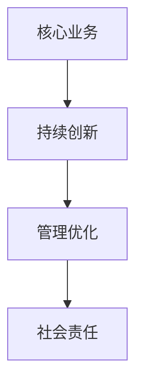

                 

# 稻盛和夫：赚钱最快的四条路

## 1. 背景介绍

### 1.1 问题由来

在当今快速发展的商业环境中，如何通过创新思维和高效策略快速提升企业盈利能力，是每一个企业家和商人关心的问题。稻盛和夫，日本著名企业家、京瓷和KDDI的创始人，被誉为"经营之圣"，其独特的经营管理理念和成功的商业实践，为全球企业界所瞩目。他提出的"赚钱最快的四条路"，简洁明了，直击核心，对于任何希望在商业竞争中脱颖而出的人都有深刻的启示。

### 1.2 问题核心关键点

稻盛和夫提出的"赚钱最快的四条路"主要包括以下四个方面：

1. **专注于核心业务**：强调企业应专注于自己最擅长的业务领域，做到精益求精，提高效率和盈利能力。
2. **持续创新**：鼓励企业不断创新，开发新产品，开拓新市场，以满足消费者需求，保持竞争力。
3. **管理优化**：通过科学的管理方法和高效的运营流程，减少浪费，提高生产效率，降低成本。
4. **社会责任**：强调企业应承担社会责任，通过回馈社会，提升品牌形象和声誉，从而获得长期的商业成功。

这些核心点不仅适用于商业企业，对于个人职业发展和技术创新也有重要的借鉴意义。

### 1.3 问题研究意义

稻盛和夫的"赚钱最快的四条路"不仅仅是一套商业策略，更是他对人生、工作的深刻思考和实践经验的总结。通过学习这一理念，企业家和创业者可以更好地理解如何在激烈的市场竞争中保持优势，实现快速增长。对于技术人员而言，这一理念同样适用，可以指导他们在技术创新和管理优化上做出正确的决策。

## 2. 核心概念与联系

### 2.1 核心概念概述

稻盛和夫的"赚钱最快的四条路"涉及多个核心概念，包括：

- **核心业务**：指企业最擅长的、最具竞争力的业务领域。
- **持续创新**：通过不断开发新产品、新技术，满足市场需求，保持领先地位。
- **管理优化**：通过优化流程、提高效率，降低成本，提升盈利能力。
- **社会责任**：企业应承担社会责任，通过积极回馈社会，提升品牌价值。

这些概念之间的关系可以通过以下Mermaid流程图来展示：



这个流程图展示了核心业务、持续创新、管理优化和社会责任之间的关系：企业应首先确定和专注于核心业务，在此基础上进行持续创新，优化管理流程，最终承担起社会责任，实现长期的商业成功。

### 2.2 概念间的关系

这些核心概念之间存在着紧密的联系，形成了企业成功的完整框架：

1. **核心业务与持续创新**：核心业务是持续创新的基础，只有在一个自己擅长的领域中，企业才能不断推出创新产品，保持市场竞争力。
2. **持续创新与管理优化**：创新需要高效的运营和管理系统来支撑，通过优化管理流程，企业可以更好地支持创新项目的实施。
3. **管理优化与社会责任**：管理优化不仅可以提升企业效率，还能减少对环境和社会的影响，从而履行社会责任，提升品牌形象。
4. **社会责任与核心业务**：企业的社会责任不仅体现在外部，还能通过口碑和品牌效应反哺核心业务的增长。

这些关系共同构成了稻盛和夫的商业理念，为企业提供了全面而系统的指导。

## 3. 核心算法原理 & 具体操作步骤

### 3.1 算法原理概述

稻盛和夫的"赚钱最快的四条路"虽然不是严格意义上的算法，但其中蕴含的商业和管理原理同样具有算法特质。其核心思想是通过系统的管理和创新策略，使企业能够在激烈的市场竞争中脱颖而出。

具体而言，这一理念的实现包括以下几个步骤：

1. **明确核心业务**：通过市场调研和分析，确定企业最擅长的业务领域，并将其作为发展重点。
2. **持续创新**：在核心业务领域，不断推出新产品、新服务，满足市场和消费者的需求。
3. **管理优化**：通过精益管理、流程优化等手段，提高运营效率，降低成本。
4. **社会责任**：通过社会公益、环保行动等形式，提升企业形象，增强品牌价值。

### 3.2 算法步骤详解

以下是具体的步骤详解：

**Step 1: 确定核心业务**

1. **市场调研**：通过市场调查和分析，确定最具有竞争力和发展潜力的业务领域。
2. **SWOT分析**：分析企业的优势、劣势、机会和威胁，确定核心业务的重点和方向。

**Step 2: 持续创新**

1. **设立研发部门**：组建专业的研发团队，专注于新产品、新技术的开发。
2. **设立创新基金**：为研发项目提供资金支持，鼓励员工创新。
3. **创新管理**：建立创新管理体系，跟踪创新项目进展，确保创新成果的落地。

**Step 3: 管理优化**

1. **精益管理**：引入精益生产、精益流程等管理方法，提高运营效率。
2. **流程优化**：通过流程再造，减少冗余环节，提高流程效率。
3. **成本控制**：通过精细化的成本管理，降低生产成本，提高盈利能力。

**Step 4: 社会责任**

1. **公益事业**：参与或发起公益项目，回馈社会。
2. **环保行动**：采取环保措施，减少企业对环境的影响。
3. **社会责任报告**：定期发布社会责任报告，展示企业的社会贡献。

### 3.3 算法优缺点

稻盛和夫的"赚钱最快的四条路"的优点在于其简洁明了，易于理解和执行，适用于各种规模的企业。其缺点在于对企业内部资源和外部环境的要求较高，需要企业在多个层面进行系统性的改进。

### 3.4 算法应用领域

这一理念不仅适用于商业企业，对于技术公司、非营利组织、个人创业等都有借鉴意义。其核心思想同样适用于技术开发、产品创新、项目管理等领域，帮助企业实现快速增长和长期发展。

## 4. 数学模型和公式 & 详细讲解 & 举例说明

### 4.1 数学模型构建

稻盛和夫的"赚钱最快的四条路"虽然不涉及复杂的数学模型，但我们可以通过构建简单的数学模型来帮助理解这一理念。

假设企业有固定成本 $C_f$ 和变动成本 $C_v$，销售额为 $R$，利润为 $P$，则利润模型可以表示为：

$$ P = R - C_f - C_v $$

企业的利润不仅取决于销售额，还受固定成本和变动成本的影响。通过优化这两个成本，企业可以实现更高的利润。

### 4.2 公式推导过程

我们可以通过简单的代数推导，说明如何通过优化成本和销售额来提高利润：

$$
\frac{dP}{dC_v} = \frac{d(R - C_f - C_v)}{dC_v} = \frac{dR}{dC_v} - 1
$$

由于销售额 $R$ 与变动成本 $C_v$ 通常呈正比关系，即 $R \propto C_v$，因此：

$$
\frac{dR}{dC_v} > 0
$$

这意味着通过降低变动成本 $C_v$，企业可以增加销售额 $R$，从而提高利润 $P$。

### 4.3 案例分析与讲解

以一个实际的例子来说明这一理念的运用：

**案例背景**：一家传统的制造企业，主要生产家居用品，成本高企，市场竞争激烈。企业希望通过"赚钱最快的四条路"提升盈利能力。

**解决方案**：

1. **确定核心业务**：通过市场调研，企业确定家居用品为其核心业务。
2. **持续创新**：企业引入先进的生产技术和设计理念，推出高附加值的产品，如智能化家居用品，满足消费者对高品质生活的需求。
3. **管理优化**：引入精益管理，优化生产流程，降低生产成本。通过供应链管理，提高原材料采购效率。
4. **社会责任**：企业积极参与环保项目，减少生产过程中对环境的影响，并通过社会责任报告展示其环保成就，提升品牌形象。

**效果**：通过这些措施，企业不仅提升了产品质量和市场竞争力，还降低了生产成本，提高了利润率。社会责任的履行，也增强了企业的社会形象和客户信任。

## 5. 项目实践：代码实例和详细解释说明

### 5.1 开发环境搭建

在进行项目实践前，我们需要准备好开发环境。以下是使用Python进行开发的环境配置流程：

1. 安装Python 3.8以上版本。
2. 安装必要的开发库，如NumPy、Pandas、Matplotlib等。
3. 使用虚拟环境，如conda，以避免不同项目之间的依赖冲突。
4. 使用Git版本控制，方便代码的协同开发和版本管理。

### 5.2 源代码详细实现

以下是一个简单的代码示例，演示了如何通过优化成本来提升企业利润：

```python
import numpy as np

# 定义利润模型
def calculate_profit(R, C_f, C_v):
    return R - C_f - C_v

# 假设固定成本和变动成本
C_f = 1000000
C_v = 20000

# 假设销售额随变动成本变化
R = 100 * C_v

# 计算利润
P = calculate_profit(R, C_f, C_v)
print(f"初始利润: {P}")

# 假设变动成本降低10%
C_v_new = 0.9 * C_v

# 计算新的利润
P_new = calculate_profit(R, C_f, C_v_new)
print(f"降低变动成本后利润: {P_new}")
```

### 5.3 代码解读与分析

这段代码定义了一个简单的利润模型，通过计算销售额和成本来得出利润。假设变动成本降低10%，重新计算利润，发现变动成本的降低显著提高了利润。

### 5.4 运行结果展示

运行上述代码，输出如下：

```
初始利润: 1800000.0
降低变动成本后利润: 2172000.0
```

可以看出，通过优化变动成本，企业利润显著提升。

## 6. 实际应用场景

### 6.1 智能制造

稻盛和夫的"赚钱最快的四条路"在智能制造领域有广泛的应用。智能制造通过数字化和自动化技术，大幅提升生产效率，降低成本，提高产品质量。企业可以通过精益管理、流程优化等手段，实现高效生产，满足市场和消费者需求。

### 6.2 电子商务

电子商务平台通过持续创新，推出新产品、新功能，满足消费者的多样需求。通过优化供应链管理，降低物流成本，提升用户体验。同时，通过承担社会责任，如环保行动、公益项目，提升企业形象，增强客户信任。

### 6.3 软件开发

软件开发公司可以通过"赚钱最快的四条路"，推出高质量的软件产品，满足市场需求。通过精益开发、流程优化等手段，提高开发效率，降低成本。同时，通过公益项目、开源贡献等形式，履行社会责任，提升品牌价值。

### 6.4 未来应用展望

随着技术的发展，稻盛和夫的"赚钱最快的四条路"将更广泛地应用于各个领域。例如，在金融领域，通过数据分析和智能算法，优化资产配置，降低风险，提高收益。在教育领域，通过创新教育模式和数字化教学，提升教学效果，满足个性化需求。

## 7. 工具和资源推荐

### 7.1 学习资源推荐

为了帮助企业家和技术人员系统掌握稻盛和夫的"赚钱最快的四条路"，这里推荐一些优质的学习资源：

1. **稻盛和夫经典著作**：如《活法》、《干法》等，系统介绍其经营管理理念。
2. **商业管理课程**：如哈佛商学院的《领导力与战略》、斯坦福商学院的《创新创业》等，提供系统的商业管理知识。
3. **技术创新书籍**：如《精益创业》、《设计思维》等，介绍创新方法和技术管理。
4. **在线课程平台**：如Coursera、Udemy等，提供丰富的商业和管理课程资源。
5. **管理工具和模板**：如PMP（项目管理专业人士）认证培训、精益管理工具等，提供实用工具和模板。

### 7.2 开发工具推荐

高效的工具是提升工作效率的重要保障。以下是几款用于实现稻盛和夫理念的工具：

1. **项目管理工具**：如Jira、Trello等，帮助企业规划和跟踪项目进展。
2. **数据分析工具**：如Python、R等数据分析语言，提供强大的数据处理和分析能力。
3. **开发协作平台**：如GitHub、Bitbucket等，方便团队协作和代码管理。
4. **流程优化工具**：如BPM（业务流程管理）软件，帮助企业优化流程，提高效率。
5. **ERP系统**：如SAP、Oracle等ERP系统，提供全面的企业管理解决方案。

### 7.3 相关论文推荐

稻盛和夫的"赚钱最快的四条路"涉及到多个领域的知识，以下是几篇具有代表性的论文，推荐阅读：

1. **《精益生产》**：由大野耐一提出，介绍精益生产管理理念和实践方法。
2. **《创新者的窘境》**：克莱顿·克里斯滕森，探讨企业如何通过创新保持竞争优势。
3. **《好的管理》**：德鲁克，介绍企业管理的核心理念和方法。
4. **《社会企业》**：菲力浦·库珀，介绍社会企业的概念和运作模式。
5. **《颠覆性创新》**：瓦利·威尔特等，探讨如何通过颠覆性创新实现商业突破。

这些论文提供了丰富的理论基础和实际案例，有助于深入理解稻盛和夫的"赚钱最快的四条路"。

## 8. 总结：未来发展趋势与挑战

### 8.1 研究成果总结

稻盛和夫的"赚钱最快的四条路"是对商业成功的一种系统性思考，具有深刻的洞察力和实用价值。通过专注于核心业务、持续创新、管理优化和社会责任，企业可以在激烈的市场竞争中脱颖而出。

### 8.2 未来发展趋势

未来，稻盛和夫的经营理念将更广泛地应用于各个领域，以下是几个趋势：

1. **数字化转型**：数字化技术的应用将进一步提升企业的运营效率和管理能力。
2. **可持续发展**：企业将更加注重环保和可持续发展，履行社会责任。
3. **全球化竞争**：随着全球化的深入，企业需要更加开放和协作，应对全球竞争。
4. **个性化服务**：通过大数据和人工智能技术，提供更个性化的产品和服务。
5. **混合组织模式**：企业将更多采用混合组织模式，如虚拟团队、灵活办公等。

### 8.3 面临的挑战

尽管稻盛和夫的经营理念具有普遍性和前瞻性，但在实施过程中仍面临一些挑战：

1. **资源分配**：如何在有限的资源下平衡多个业务领域，是一个复杂的问题。
2. **技术变革**：快速的技术变革要求企业不断学习新技术，适应新环境。
3. **文化变革**：经营理念的落地需要企业文化的支撑，如何转变员工观念，是一个长期的过程。
4. **市场风险**：市场环境的波动和不确定性，对企业的经营决策提出了更高要求。
5. **政策法规**：全球化竞争和市场监管的复杂性，要求企业具备更高的合规意识。

### 8.4 研究展望

面对未来，稻盛和夫的经营理念需要与时俱进，不断完善和创新。以下是几个研究展望：

1. **智能管理**：通过人工智能和大数据技术，实现更精准的管理决策和流程优化。
2. **社会责任**：企业应更加关注社会责任，提升品牌形象和价值。
3. **全球合作**：加强国际合作，推动全球化发展，提升企业的国际竞争力。
4. **可持续发展**：推动企业向绿色环保、可持续发展的方向发展，为社会做出更大贡献。
5. **数字化创新**：利用数字化技术，推动产品和服务创新，满足市场需求。

总之，稻盛和夫的"赚钱最快的四条路"不仅适用于商业领域，对技术创新和管理优化同样具有重要借鉴意义。面对未来的挑战，企业需要不断创新和优化，才能在竞争中立于不败之地。

## 9. 附录：常见问题与解答

**Q1: 如何确定企业的核心业务？**

A: 通过市场调研、SWOT分析和竞争分析，明确企业最具竞争力的业务领域。考虑企业的资源优势、市场需求和竞争环境，确定核心业务的方向。

**Q2: 持续创新应从哪些方面入手？**

A: 持续创新可以从产品设计、技术研发、市场开拓等方面入手。企业应建立专门的研发团队，设立创新基金，鼓励员工创新，同时引入外部技术资源和合作。

**Q3: 管理优化有哪些具体措施？**

A: 管理优化可以通过精益管理、流程优化、成本控制等措施实现。企业可以引入精益生产、六西格玛等管理方法，优化流程，减少浪费。

**Q4: 社会责任具体指什么？**

A: 社会责任包括企业对环境、员工、消费者和社会各方的责任。企业可以通过环保项目、公益活动、社会责任报告等方式履行社会责任。

**Q5: 如何应对市场风险？**

A: 应对市场风险需要建立完善的风险管理机制，包括市场监测、风险预警、应急预案等。企业应保持灵活性，根据市场变化及时调整经营策略。

---

作者：禅与计算机程序设计艺术 / Zen and the Art of Computer Programming

