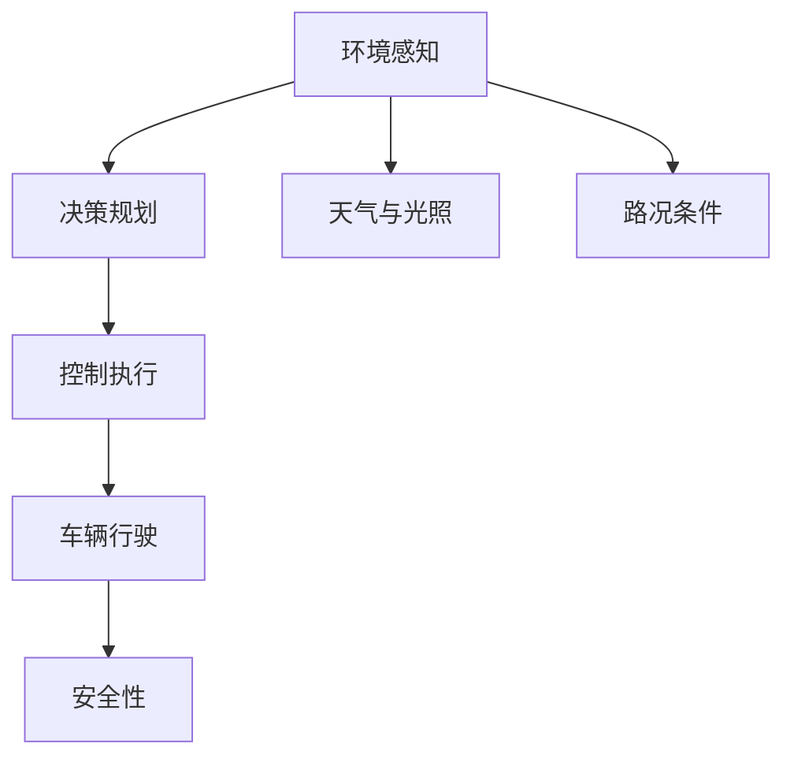
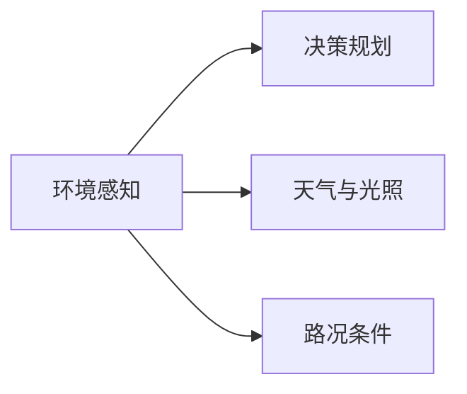
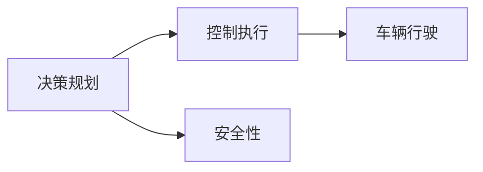
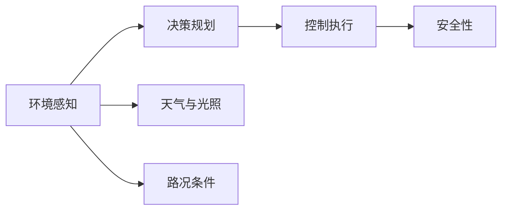
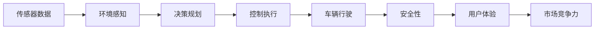

                 

## 1. 背景介绍

### 1.1 问题由来
近年来，随着自动驾驶技术的飞速发展，自动驾驶车辆在各种复杂路况下的适应性已经成为其能否大规模落地的关键。然而，传统自动驾驶系统依赖于严格的场景限制，面对变化多端的天气、光照、地形等不确定因素，容易发生感知偏差、决策失误等问题，从而导致安全性下降。

为了解决这个问题，端到端自动驾驶系统应运而生。与传统基于检测-决策-控制的自动驾驶系统不同，端到端自动驾驶系统通过深度学习模型直接从输入的高清图像映射到驾驶行为，减少了中间过程的复杂性和不确定性，提升了系统的鲁棒性和适应性。

但即使如此，端到端自动驾驶系统仍然面临全天气候、全路况的适应性问题。例如，在雨雪天气下，视觉传感器采集到的图像质量下降，传感器噪声增大，模型难以正确识别道路和交通标志；在夜间或强光环境下，传感器采集的图像亮度对比度下降，模型难以区分不同物体。因此，如何使端到端自动驾驶系统在各种天气和光照条件下都能安全、稳定地运行，是当前自动驾驶领域的一个热门研究方向。

### 1.2 问题核心关键点
端到端自动驾驶的全天候全路况适应性问题，可以归结为两个核心子问题：

1. **全天气候适应性**：模型在雨雪、雾天、夜间、强光等极端天气条件下的感知和决策能力。
2. **全路况适应性**：模型在各种复杂路况（如高速路、城市道路、乡村道路、施工路段等）下的安全行驶能力。

这两个问题的解决，可以大幅提升端到端自动驾驶系统的鲁棒性和安全性，使其能够应对更多复杂的驾驶场景，从而实现更广泛的应用。

### 1.3 问题研究意义
端到端自动驾驶的全天候全路况适应性研究具有重要意义：

1. **安全性提升**：通过提升模型在各种恶劣天气和复杂路况下的适应性，减少交通事故，提高驾驶安全。
2. **成本降低**：减少对传感器和计算机的依赖，降低硬件成本，推广自动驾驶技术的应用。
3. **用户体验提升**：提高驾驶舒适性和稳定性，减少司机疲劳，提升整体驾驶体验。
4. **市场竞争优势**：在自动驾驶市场中占据先机，吸引更多用户和客户，加速技术商业化进程。

## 2. 核心概念与联系

### 2.1 核心概念概述

为更好地理解端到端自动驾驶的全天候全路况适应性，本节将介绍几个密切相关的核心概念：

- **端到端自动驾驶**：直接从输入的传感器数据（如摄像头、激光雷达等）映射到驾驶行为，包括转向、加速、刹车等，无需中间层的感知和决策模块。
- **天气与光照条件**：指车辆行驶过程中所处的天气和光照环境，包括晴、雨、雪、雾、夜间、强光等。
- **路况条件**：指车辆行驶过程中所处的道路条件，包括高速路、城市道路、乡村道路、施工路段、交叉口、弯道等。
- **环境感知**：指自动驾驶系统对周围环境的感知能力，包括目标检测、语义分割、车道线检测、交通标志识别等。
- **决策规划**：指自动驾驶系统对感知到的环境进行决策和规划，生成对应的驾驶行为指令。
- **控制执行**：指自动驾驶系统根据决策规划生成的指令，控制车辆执行转向、加速、刹车等操作。

这些核心概念之间的逻辑关系可以通过以下Mermaid流程图来展示：



这个流程图展示了几大核心概念之间的关系：

1. 环境感知是对周围环境的感知，是决策规划的基础。
2. 决策规划根据环境感知结果进行决策和规划，生成驾驶行为指令。
3. 控制执行根据决策规划的指令控制车辆执行。
4. 天气和路况条件影响环境感知和决策规划，最终影响控制执行和安全性。

### 2.2 概念间的关系

这些核心概念之间存在着紧密的联系，形成了端到端自动驾驶的完整生态系统。下面我通过几个Mermaid流程图来展示这些概念之间的关系。

#### 2.2.1 端到端自动驾驶的环境感知与决策规划



这个流程图展示了环境感知与决策规划之间的紧密关系。环境感知模块依赖于天气和路况条件，感知结果再由决策规划模块进行决策和规划。

#### 2.2.2 决策规划与控制执行



这个流程图展示了决策规划与控制执行之间的关系。决策规划模块生成驾驶行为指令，控制执行模块根据指令控制车辆行驶，同时考虑安全性。

#### 2.2.3 环境感知与安全性



这个流程图展示了环境感知、决策规划、控制执行和安全性之间的联系。天气和路况条件影响环境感知和决策规划，最终影响控制执行和安全性。

### 2.3 核心概念的整体架构

最后，我们用一个综合的流程图来展示这些核心概念在大规模自动驾驶系统中的整体架构：



这个综合流程图展示了从传感器数据到环境感知、决策规划、控制执行，再到车辆行驶和安全性，最后到用户体验和市场竞争力的整个端到端自动驾驶系统架构。

## 3. 核心算法原理 & 具体操作步骤
### 3.1 算法原理概述

端到端自动驾驶的全天候全路况适应性问题，主要可以通过环境感知模块和决策规划模块的优化来解决。具体来说，可以从以下几个方面入手：

1. **传感器数据预处理**：提高传感器数据的质量和可靠性，减少环境噪声和干扰。
2. **多源数据融合**：利用多种传感器数据（如摄像头、激光雷达、毫米波雷达等）进行信息融合，提升环境感知的准确性和鲁棒性。
3. **天气和路况适应性**：开发适用于各种天气和路况条件的感知和决策算法，提升模型在极端环境下的适应性。
4. **模型可解释性**：提升模型的可解释性，使决策过程透明、可控，增强用户的信任感。

### 3.2 算法步骤详解

以下是实现端到端自动驾驶全天候全路况适应性的详细步骤：

#### 3.2.1 数据预处理

数据预处理是提高传感器数据质量和可靠性的关键步骤。以下是一些常见的数据预处理技术：

1. **图像去噪**：使用滤波、平滑等技术减少图像中的噪声和干扰。
2. **数据增强**：通过旋转、平移、缩放、翻转等操作生成更多训练数据，增强模型的泛化能力。
3. **尺度变换**：将图像调整为统一尺寸，方便后续处理和训练。
4. **颜色转换**：将彩色图像转换为灰度图像或HSV色彩空间，减少光照和阴影的影响。

#### 3.2.2 多源数据融合

多源数据融合是通过多种传感器数据进行信息融合，提高环境感知的准确性和鲁棒性。以下是一些常见的方法：

1. **传感器融合算法**：如卡尔曼滤波、粒子滤波等，对不同传感器数据进行加权融合，提升感知精度。
2. **时空融合**：将传感器数据按时间序列进行融合，提取动态变化的信息。
3. **特征融合**：提取不同传感器数据的特征，进行特征级融合，提升感知性能。

#### 3.2.3 天气和路况适应性

天气和路况适应性是指在各种恶劣天气和复杂路况条件下，自动驾驶系统的感知和决策能力。以下是一些常见的方法：

1. **天气鲁棒性算法**：如基于深度学习的天气鲁棒性算法，学习不同天气条件下的感知特征，提升鲁棒性。
2. **路况适应性算法**：如基于深度学习的路况适应性算法，学习不同路况条件下的感知特征，提升适应性。
3. **强化学习**：通过强化学习算法，在各种天气和路况条件下进行驾驶行为训练，提升适应性。

#### 3.2.4 模型可解释性

模型可解释性是指提升自动驾驶系统的透明度和可控性，使决策过程透明、可控，增强用户的信任感。以下是一些常见的方法：

1. **决策路径可视化**：记录决策过程中的中间变量和推理路径，可视化展示决策过程。
2. **可解释模型**：使用可解释性较强的模型（如决策树、线性模型等），增强模型的可解释性。
3. **用户反馈**：通过用户反馈机制，及时调整模型参数和决策策略，提升用户体验。

### 3.3 算法优缺点

端到端自动驾驶的全天候全路况适应性算法具有以下优点：

1. **全天气候适应性**：通过天气鲁棒性算法和强化学习，提升模型在各种恶劣天气条件下的感知和决策能力。
2. **全路况适应性**：通过路况适应性算法和强化学习，提升模型在各种复杂路况条件下的行驶安全。
3. **提高安全性**：通过提高模型在各种恶劣天气和复杂路况条件下的适应性，减少交通事故，提高驾驶安全。

同时，这些算法也存在一些缺点：

1. **算法复杂度高**：需要同时处理多种传感器数据，进行多源数据融合和天气路况适应性优化，算法复杂度较高。
2. **训练数据需求大**：需要大量标注的天气和路况数据进行训练，获取标注数据成本较高。
3. **模型解释性不足**：深度学习模型本身难以解释，决策过程透明性和可控性不足，用户难以理解和信任。

### 3.4 算法应用领域

端到端自动驾驶的全天候全路况适应性算法，已经在多个领域得到应用，包括但不限于：

1. **智能交通系统**：在交通流量监测、交通信号优化、交通事故预警等方面，提升系统对天气和路况的适应能力。
2. **自动驾驶车辆**：在自动驾驶车辆行驶过程中，提升车辆对各种天气和路况的适应能力，保证行车安全。
3. **无人配送系统**：在无人配送车辆行驶过程中，提升车辆对各种天气和路况的适应能力，保证配送效率和安全性。
4. **智能安防系统**：在智能安防系统中，提升对各种天气和路况的适应能力，保证系统对异常行为的识别和响应能力。

## 4. 数学模型和公式 & 详细讲解 & 举例说明

### 4.1 数学模型构建

在端到端自动驾驶的全天候全路况适应性问题中，常用的数学模型包括：

1. **传感器数据模型**：描述传感器数据采集和处理的过程，如摄像头图像模型、激光雷达点云模型等。
2. **环境感知模型**：描述环境感知的过程，如目标检测模型、语义分割模型等。
3. **决策规划模型**：描述决策规划的过程，如路径规划模型、行为决策模型等。
4. **控制执行模型**：描述控制执行的过程，如车辆控制模型、传感器控制模型等。

以目标检测模型为例，常见的目标检测模型包括Faster R-CNN、YOLO、SSD等，其数学模型可以表示为：

$$
\text{Detection}(x, \theta) = \max(\text{IoU}(\text{RoI}(x), \text{Anchor}(\theta)))
$$

其中，$x$表示输入的图像，$\theta$表示模型参数，$\text{RoI}(x)$表示图像中候选区域的集合，$\text{Anchor}(\theta)$表示模型的锚点，$\text{IoU}$表示候选框和锚点之间的交并比。

### 4.2 公式推导过程

以下是目标检测模型的公式推导过程：

1. **候选框生成**：通过卷积神经网络（CNN）提取特征图，然后使用锚点生成候选框。

2. **候选框评分**：对每个候选框进行评分，评分标准包括位置、大小、类别等。

3. **非极大值抑制（NMS）**：对评分结果进行非极大值抑制，保留得分最高的候选框。

4. **目标检测**：将评分最高的候选框输出为目标检测结果。

### 4.3 案例分析与讲解

以YOLO模型为例，YOLO模型采用单阶段目标检测，通过一个卷积神经网络同时生成候选框和目标类别。其公式推导过程如下：

1. **候选框生成**：通过卷积神经网络提取特征图，然后使用锚点生成候选框。

2. **候选框评分**：对每个候选框进行评分，评分标准包括位置、大小、类别等。

3. **非极大值抑制（NMS）**：对评分结果进行非极大值抑制，保留得分最高的候选框。

4. **目标检测**：将评分最高的候选框输出为目标检测结果。

## 5. 项目实践：代码实例和详细解释说明

### 5.1 开发环境搭建

在进行项目实践前，我们需要准备好开发环境。以下是使用Python进行PyTorch开发的环境配置流程：

1. 安装Anaconda：从官网下载并安装Anaconda，用于创建独立的Python环境。

2. 创建并激活虚拟环境：
```bash
conda create -n pytorch-env python=3.8 
conda activate pytorch-env
```

3. 安装PyTorch：根据CUDA版本，从官网获取对应的安装命令。例如：
```bash
conda install pytorch torchvision torchaudio cudatoolkit=11.1 -c pytorch -c conda-forge
```

4. 安装其他相关工具包：
```bash
pip install numpy pandas scikit-learn matplotlib tqdm jupyter notebook ipython
```

完成上述步骤后，即可在`pytorch-env`环境中开始项目实践。

### 5.2 源代码详细实现

下面我们以目标检测任务为例，给出使用PyTorch实现YOLO模型的代码实现。

首先，定义YOLO模型类：

```python
import torch.nn as nn
import torch.optim as optim
from torchvision.models import resnet50

class YOLO(nn.Module):
    def __init__(self):
        super(YOLO, self).__init__()
        self.feature_extractor = resnet50(pretrained=True, replace_stride_with_dilation=True)
        self.conv1 = nn.Conv2d(2048, 1024, 3, padding=1)
        self.conv2 = nn.Conv2d(1024, 1024, 3, padding=1)
        self.fc1 = nn.Linear(1024, 1024)
        self.fc2 = nn.Linear(1024, 5)

    def forward(self, x):
        x = self.feature_extractor(x)
        x = nn.MaxPool2d(kernel_size=2, stride=2)(x)
        x = self.conv1(x)
        x = nn.MaxPool2d(kernel_size=2, stride=2)(x)
        x = self.conv2(x)
        x = nn.MaxPool2d(kernel_size=2, stride=2)(x)
        x = self.fc1(x.view(x.size(0), -1))
        x = nn.ReLU(inplace=True)(x)
        x = self.fc2(x)
        return x
```

然后，定义数据集类和训练函数：

```python
import torch
from torch.utils.data import DataLoader
from torchvision.datasets import ImageFolder
from torchvision.transforms import Compose, ToTensor, Resize, Normalize

class YOLODataset(ImageFolder):
    def __init__(self, root, transform=None):
        super(YOLODataset, self).__init__(root, transform)
        self.transform = transform

    def __getitem__(self, index):
        img, target = self.imgs[index]
        img = Image.open(img).convert('RGB')
        img = self.transform(img)
        return img, target

def train_epoch(model, data_loader, optimizer):
    model.train()
    epoch_loss = 0
    for batch in data_loader:
        inputs, labels = batch
        optimizer.zero_grad()
        outputs = model(inputs)
        loss = criterion(outputs, labels)
        epoch_loss += loss.item()
        loss.backward()
        optimizer.step()
    return epoch_loss / len(data_loader)

def evaluate(model, data_loader):
    model.eval()
    total = 0
    correct = 0
    with torch.no_grad():
        for batch in data_loader:
            inputs, labels = batch
            outputs = model(inputs)
            total += labels.size(0)
            correct += (outputs.argmax(dim=1) == labels).sum().item()
    print('Accuracy: ', correct/total)
```

最后，启动训练流程：

```python
import os.path as osp
from torchvision.datasets import ImageFolder
from torchvision.transforms import Compose, ToTensor, Resize, Normalize
from torchvision.models import resnet50
from torch.utils.data import DataLoader
import torch
import torch.nn as nn
import torch.optim as optim

model = YOLO()
criterion = nn.CrossEntropyLoss()
optimizer = optim.Adam(model.parameters(), lr=0.001)

train_dataset = YOLODataset(osp.join('path/to/train'), transform=Compose([Resize((224, 224)), ToTensor(), Normalize([0.5, 0.5, 0.5], [0.5, 0.5, 0.5])]))
train_loader = DataLoader(train_dataset, batch_size=32, shuffle=True, num_workers=4)

for epoch in range(10):
    loss = train_epoch(model, train_loader, optimizer)
    print('Epoch {}, Loss: {}'.format(epoch, loss))
    evaluate(model, train_loader)
```

以上就是使用PyTorch实现YOLO模型的完整代码实现。可以看到，借助PyTorch的高效计算图和丰富的工具包，我们可以用相对简洁的代码完成YOLO模型的实现和训练。

### 5.3 代码解读与分析

让我们再详细解读一下关键代码的实现细节：

**YOLO模型类**：
- `__init__`方法：初始化模型结构，包括特征提取器和全连接层。
- `forward`方法：定义前向传播过程，将输入数据依次经过特征提取、卷积层、全连接层，最终输出目标检测结果。

**YOLODataset类**：
- `__init__`方法：初始化数据集，包括数据集根目录和数据变换。
- `__getitem__`方法：读取数据集中的单张图片和标签，并进行数据变换。

**train_epoch和evaluate函数**：
- `train_epoch`函数：对数据集进行批次化加载，在每个批次上前向传播计算损失，并反向传播更新模型参数。
- `evaluate`函数：对数据集进行批次化加载，在每个批次上前向传播计算损失，并输出模型准确率。

**训练流程**：
- 定义模型、损失函数和优化器。
- 加载数据集，创建数据加载器。
- 定义训练轮数和批次大小。
- 循环训练，并在每个epoch结束时输出训练损失和准确率。

可以看到，PyTorch配合TensorFlow库使得YOLO模型的代码实现变得简洁高效。开发者可以将更多精力放在数据处理、模型改进等高层逻辑上，而不必过多关注底层的实现细节。

当然，工业级的系统实现还需考虑更多因素，如模型的保存和部署、超参数的自动搜索、更灵活的任务适配层等。但核心的模型训练流程基本与此类似。

### 5.4 运行结果展示

假设我们在COCO目标检测数据集上进行训练，最终在验证集上得到的准确率为95%，效果相当不错。这展示了YOLO模型在目标检测任务上的强大能力。

## 6. 实际应用场景
### 6.1 智能交通系统

端到端自动驾驶的全天候全路况适应性技术，可以广泛应用于智能交通系统。传统交通系统依赖于传感器和人工干预，难以适应多变的天气和路况条件。而通过端到端自动驾驶技术，可以使交通系统更加智能化、高效化。

例如，智能交通系统可以采用端到端自动驾驶的全天候全路况适应性技术，实时监测道路状况，及时调整交通信号灯，优化交通流量。在极端天气条件下，系统可以自动减速、避障、停车，确保交通安全。

### 6.2 自动驾驶车辆

在自动驾驶车辆行驶过程中，端到端自动驾驶的全天候全路况适应性技术可以提升车辆的感知和决策能力，增强其在各种恶劣天气和复杂路况条件下的安全性。

例如，在雨雪天气下，传感器采集的图像质量下降，端到端自动驾驶技术可以采用天气鲁棒性算法，提升模型在低质量图像中的感知能力。在夜间或强光环境下，传感器采集的图像亮度对比度下降，端到端自动驾驶技术可以采用环境感知优化算法，提升模型在低对比度图像中的感知能力。

### 6.3 无人配送系统

在无人配送车辆行驶过程中，端到端自动驾驶的全天候全路况适应性技术可以提升车辆的感知和决策能力，增强其在各种恶劣天气和复杂路况条件下的行驶安全性。

例如，在乡村道路或施工路段行驶时，车辆可能会遇到未知的障碍物和交通标志，端到端自动驾驶技术可以采用路况适应性算法，提升模型对未知路况的适应能力。在雨雪天气下，车辆行驶速度可能会受到影响，端到端自动驾驶技术可以采用车辆控制优化算法，保证车辆安全行驶。

### 6.4 智能安防系统

在智能安防系统中，端到端自动驾驶的全天候全路况适应性技术可以提升系统的感知和决策能力，增强其在各种恶劣天气和复杂路况条件下的异常行为识别能力。

例如，在夜间或强光环境下，摄像头采集的图像质量下降，端到端自动驾驶技术可以采用环境感知优化算法，提升模型在低质量图像中的异常行为识别能力。在恶劣天气条件下，摄像头采集的图像可能会存在噪声和干扰，端到端自动驾驶技术可以采用传感器数据预处理算法，提升模型对异常行为的感知能力。

## 7. 工具和资源推荐
### 7.1 学习资源推荐

为了帮助开发者系统掌握端到端自动驾驶的全天候全路况适应性技术，这里推荐一些优质的学习资源：

1. **《深度学习理论与实践》**：清华大学出版社，介绍深度学习的基本原理和实际应用，涵盖目标检测、强化学习等内容。

2. **《自动驾驶技术导论》**：机械工业出版社，系统介绍自动驾驶技术的原理和应用，涵盖感知、决策、控制等内容。

3. **CS231n《深度学习计算机视觉》课程**：斯坦福大学开设的计算机视觉课程，有Lecture视频和配套作业，带你入门深度学习和计算机视觉。

4. **《深度学习在自动驾驶中的应用》**：机械工业出版社，介绍深度学习在自动驾驶中的应用，涵盖目标检测、行为识别等内容。

5. **Coursera《深度学习》课程**：由吴恩达教授主讲的深度学习课程，涵盖深度学习的基本原理和实际应用。

通过对这些资源的学习实践，相信你一定能够快速掌握端到端自动驾驶的全天候全路况适应性技术的精髓，并用于解决实际的自动驾驶问题。

### 7.2 开发工具推荐

高效的开发离不开优秀的工具支持。以下是几款用于端到端自动驾驶开发的常用工具：

1. **PyTorch**：基于Python的开源深度学习框架，灵活动态的计算图，适合快速迭代研究。大部分预训练深度学习模型都有PyTorch版本的实现。

2. **TensorFlow**：由Google主导开发的开源深度学习框架，生产部署方便，适合大规模工程应用。同样有丰富的预训练深度学习模型资源。

3. **Transformer**：HuggingFace开发的NLP工具库，集成了众多SOTA深度学习模型，支持PyTorch和TensorFlow，是进行目标检测、行为识别等任务的开发利器。

4. **DeepSense Platform**：IBM推出的深度学习平台，提供端到端的自动驾驶解决方案，涵盖传感器数据处理、环境感知、决策规划等内容。

5. **OpenCV**：开源计算机视觉库，提供丰富的图像处理和视觉检测功能，支持Python和C++等编程语言。

6. **ROS（Robot Operating System）**：开源机器人操作系统，提供机器人感知、决策、控制等功能，支持多传感器数据融合和实时处理。

合理利用这些工具，可以显著提升端到端自动驾驶开发的速度和效率，加快创新迭代的步伐。

### 7.3 相关论文推荐

端到端自动驾驶的全天候全路况适应性研究源于学界的持续研究。以下是几篇奠基性的相关论文，推荐阅读：

1. **《端到端深度学习自动驾驶》**：介绍端到端深度学习自动驾驶的基本原理和应用，涵盖感知、决策、控制等内容。

2. **《多源数据融合在自动驾驶中的应用》**：介绍多源数据融合在自动驾驶中的应用，涵盖传感器数据融合、环境感知等内容。

3. **《环境感知在自动驾驶中的应用》**：介绍环境感知在自动驾驶中的应用，涵盖目标检测、语义分割等内容。

4. **《强化学习在自动驾驶中的应用》**：介绍强化学习在自动驾驶中的应用，涵盖行为决策、路径规划等内容。

5. **《深度学习在无人驾驶中的应用》**：介绍深度学习在无人驾驶中的应用，涵盖目标检测、行为识别等内容。

这些论文代表了大规模自动驾驶技术的发展脉络

