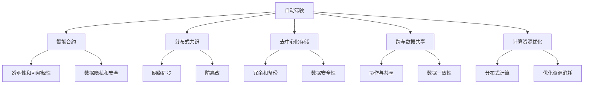
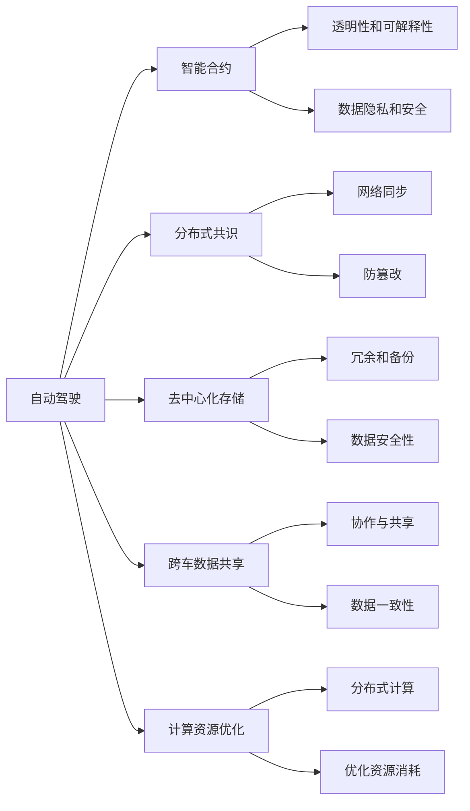
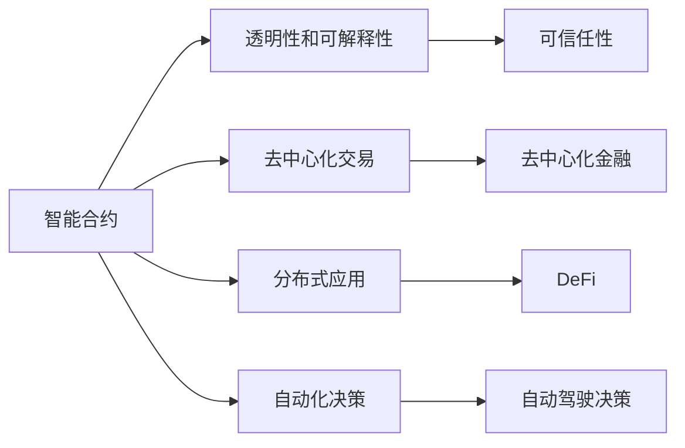
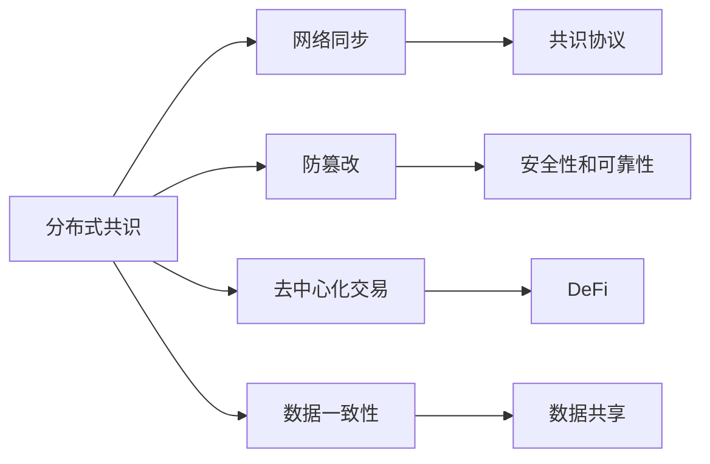
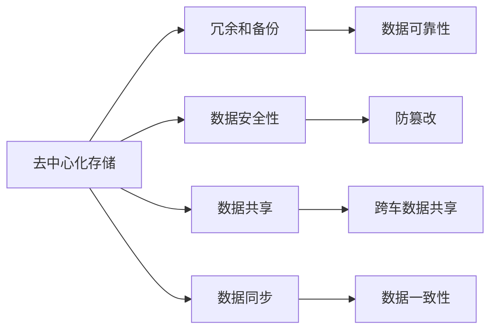
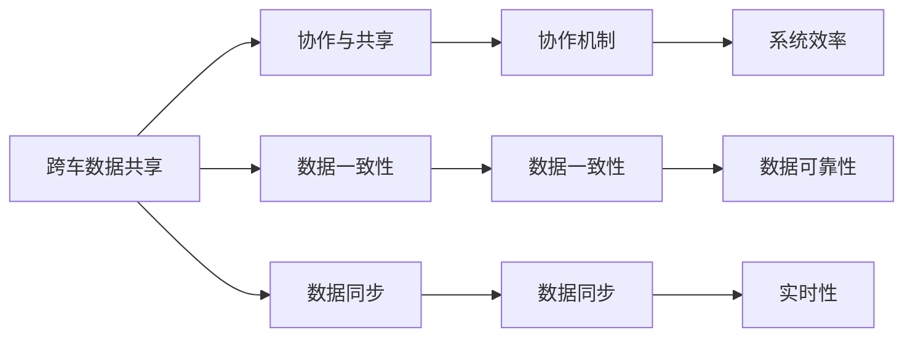
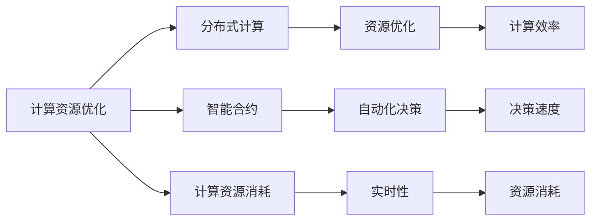

                 

# 端到端自动驾驶的区块链应用场景

## 1. 背景介绍

### 1.1 问题由来

随着人工智能、物联网、大数据技术的迅猛发展，自动驾驶技术逐渐成为众多高科技公司竞相发展的热点。自动驾驶系统，能够通过摄像头、雷达、激光雷达等传感器，结合深度学习模型，实现自动驾驶、自主泊车、路线规划、交通信号识别等功能。然而，自动驾驶技术目前仍然面临着诸多挑战：

- 数据隐私和安全问题。自动驾驶系统需要实时传输大量的传感器数据，可能暴露用户隐私，甚至遭受黑客攻击。
- 系统透明性和可解释性问题。自动驾驶系统依赖复杂的深度学习模型，其决策过程难以解释，难以满足监管要求。
- 数据冗余和协作问题。不同车辆和传感器采集的数据，格式各异，存储成本高，且难以实现跨车数据共享和协作。
- 计算资源消耗问题。深度学习模型的计算量巨大，在实时应用中会占用大量的计算资源，难以在车机端高效执行。

为了应对这些挑战，人们开始将区块链技术引入自动驾驶领域，构建端到端自动驾驶的区块链应用场景，提升自动驾驶系统的数据隐私、透明性和协作能力，同时降低计算资源的消耗。

### 1.2 问题核心关键点

将区块链技术应用于自动驾驶领域，可以为自动驾驶带来以下关键好处：

- **数据隐私和安全**。区块链的去中心化和加密特性，能够保障自动驾驶数据的隐私和安全，防止数据被非法篡改或泄露。
- **透明性和可解释性**。区块链的共识机制和智能合约，使得自动驾驶系统能够实现透明化的决策过程，便于监管和审查。
- **数据冗余和协作**。区块链的分布式存储和智能合约，可以实现跨车数据共享和协作，减少数据冗余，提高系统效率。
- **计算资源消耗**。区块链的分布式计算和智能合约，可以实现计算资源的分布式处理和优化，降低计算消耗。

这些关键好处使得区块链技术成为自动驾驶领域的重要候选技术。本文将详细探讨区块链技术在自动驾驶领域的应用场景，包括智能合约、分布式共识、去中心化存储、跨车数据共享、计算资源优化等方面，为读者提供全面的技术指导。

## 2. 核心概念与联系

### 2.1 核心概念概述

为更好地理解区块链在自动驾驶领域的应用，本节将介绍几个关键核心概念：

- **自动驾驶**：通过计算机视觉、深度学习等技术，实现车辆的自动导航和控制，使车辆能够自主在道路环境中行驶。
- **区块链**：一种分布式账本技术，通过去中心化、加密、共识等机制，保障数据的透明性和不可篡改性。
- **智能合约**：一种基于区块链的自动化合约，能够自动执行合约条款，降低信任成本。
- **分布式共识**：区块链中用于达成共识的算法，确保网络中的所有节点达成一致，实现数据的可靠传输和处理。
- **去中心化存储**：区块链的分布式存储机制，将数据分散存储在多个节点上，降低单点故障和数据泄露的风险。
- **跨车数据共享**：利用区块链技术，实现不同车辆之间的数据共享和协作，提高系统的效率和可靠性。
- **计算资源优化**：区块链的分布式计算和智能合约，能够优化自动驾驶系统的计算资源消耗，提高系统的实时性。

这些核心概念之间存在着紧密的联系，形成了区块链技术在自动驾驶领域应用的完整生态系统。下面我们通过一些Mermaid流程图来展示这些核心概念之间的关系。



这个流程图展示了大语言模型微调过程中各个核心概念之间的关系：

- 自动驾驶通过智能合约、分布式共识、去中心化存储等技术手段，保障数据隐私和安全，提高系统透明性和可解释性。
- 智能合约通过透明化的决策过程，提升系统的透明性和可解释性。
- 分布式共识通过去中心化的机制，实现网络同步和防篡改。
- 去中心化存储通过冗余和备份，提高数据的安全性。
- 跨车数据共享通过协作与共享，提升系统的效率和可靠性。
- 计算资源优化通过分布式计算和智能合约，降低计算资源消耗，提高系统的实时性。

这些核心概念共同构成了区块链技术在自动驾驶领域应用的框架，为其带来了新的解决思路和应用价值。

### 2.2 概念间的关系

这些核心概念之间存在着紧密的联系，形成了区块链技术在自动驾驶领域应用的完整生态系统。下面我们通过一些Mermaid流程图来展示这些核心概念之间的关系。

#### 2.2.1 自动驾驶与区块链的联系



这个流程图展示了大语言模型微调过程中各个核心概念之间的关系：

- 自动驾驶通过智能合约、分布式共识、去中心化存储等技术手段，保障数据隐私和安全，提高系统透明性和可解释性。
- 智能合约通过透明化的决策过程，提升系统的透明性和可解释性。
- 分布式共识通过去中心化的机制，实现网络同步和防篡改。
- 去中心化存储通过冗余和备份，提高数据的安全性。
- 跨车数据共享通过协作与共享，提升系统的效率和可靠性。
- 计算资源优化通过分布式计算和智能合约，降低计算资源消耗，提高系统的实时性。

这些核心概念共同构成了区块链技术在自动驾驶领域应用的框架，为其带来了新的解决思路和应用价值。

#### 2.2.2 智能合约的应用场景



这个流程图展示了智能合约在自动驾驶领域的应用场景：

- 透明性和可解释性：通过智能合约的自动化执行，使得自动驾驶系统的决策过程透明，便于监管和审查。
- 去中心化交易：智能合约可以自动化执行交易，实现去中心化的自动驾驶资源分配和交易。
- 分布式应用：智能合约可以构建分布式应用，实现跨车数据共享和协作。
- 自动化决策：智能合约可以自动化决策，提高自动驾驶系统的反应速度和决策准确性。

#### 2.2.3 分布式共识的应用场景



这个流程图展示了分布式共识在自动驾驶领域的应用场景：

- 网络同步：通过分布式共识，确保网络中的所有节点达成一致，实现数据的可靠传输和处理。
- 防篡改：通过去中心化的共识机制，防止数据被非法篡改，提高数据的安全性。
- 去中心化交易：分布式共识可以实现去中心化的自动驾驶资源分配和交易。
- 数据一致性：分布式共识可以保障不同车辆和传感器采集的数据一致，减少数据冗余，提高系统效率。

#### 2.2.4 去中心化存储的应用场景



这个流程图展示了去中心化存储在自动驾驶领域的应用场景：

- 冗余和备份：通过分布式存储，将数据分散存储在多个节点上，降低单点故障和数据泄露的风险。
- 数据安全性：去中心化存储通过加密和冗余备份，提高数据的安全性。
- 数据共享：去中心化存储可以实现跨车数据共享，提高系统的效率和可靠性。
- 数据同步：去中心化存储通过分布式存储和同步机制，确保不同车辆和传感器采集的数据一致，减少数据冗余，提高系统效率。

#### 2.2.5 跨车数据共享的应用场景



这个流程图展示了跨车数据共享在自动驾驶领域的应用场景：

- 协作与共享：通过分布式存储和智能合约，实现不同车辆之间的数据共享和协作，提高系统的效率和可靠性。
- 数据一致性：跨车数据共享通过协作机制，保障不同车辆和传感器采集的数据一致，减少数据冗余，提高系统效率。
- 数据同步：跨车数据共享通过分布式同步机制，确保不同车辆和传感器采集的数据一致，减少数据冗余，提高系统效率。

#### 2.2.6 计算资源优化应用场景



这个流程图展示了计算资源优化在自动驾驶领域的应用场景：

- 分布式计算：通过区块链的分布式计算机制，实现计算资源的分布式处理和优化，降低计算资源消耗，提高系统的实时性。
- 智能合约：通过智能合约的自动化决策，提高自动驾驶系统的反应速度和决策准确性。
- 计算资源消耗：计算资源优化通过分布式计算和智能合约，降低计算资源消耗，提高系统的实时性。

这些核心概念共同构成了区块链技术在自动驾驶领域应用的框架，为其带来了新的解决思路和应用价值。

## 3. 核心算法原理 & 具体操作步骤
### 3.1 算法原理概述

区块链技术在自动驾驶领域的应用主要基于以下几个关键算法原理：

1. **智能合约**：通过区块链的智能合约，可以实现自动化的驾驶决策，提高系统的透明性和可解释性。
2. **分布式共识**：通过分布式共识算法，确保网络中的所有节点达成一致，实现数据的可靠传输和处理。
3. **去中心化存储**：通过区块链的去中心化存储机制，将数据分散存储在多个节点上，降低单点故障和数据泄露的风险。
4. **跨车数据共享**：通过区块链的分布式存储和智能合约，实现跨车数据共享和协作，提高系统的效率和可靠性。
5. **计算资源优化**：通过区块链的分布式计算和智能合约，优化自动驾驶系统的计算资源消耗，提高系统的实时性。

这些算法原理共同构成了区块链技术在自动驾驶领域应用的框架，为其带来了新的解决思路和应用价值。

### 3.2 算法步骤详解

基于区块链的自动驾驶系统设计，主要包括以下几个关键步骤：

**Step 1: 准备自动驾驶系统**

1. **选择自动驾驶框架**：选择适合的自动驾驶框架，如OpenCV、TensorFlow、PyTorch等，进行图像处理和深度学习模型的搭建。
2. **部署区块链节点**：在自动驾驶车辆上部署区块链节点，实现数据的分散存储和共识机制。
3. **设计智能合约**：根据自动驾驶任务的需求，设计智能合约，实现数据的自动处理和决策。

**Step 2: 构建自动驾驶数据链**

1. **数据收集与预处理**：通过摄像头、雷达、激光雷达等传感器，收集自动驾驶车辆的数据，并进行预处理，如去噪、归一化等。
2. **数据加密与存储**：将预处理后的数据进行加密，并存储在区块链节点上，实现数据的去中心化存储。
3. **数据共享与协作**：通过智能合约，实现不同车辆之间的数据共享和协作，提高系统的效率和可靠性。

**Step 3: 执行智能合约**

1. **输入数据准备**：将自动驾驶车辆的数据作为输入，准备进入智能合约。
2. **智能合约执行**：将输入数据输入智能合约，智能合约根据预设的逻辑，自动处理数据，并输出驾驶决策。
3. **智能合约验证**：通过分布式共识算法，验证智能合约的执行结果，确保数据的可靠性和一致性。

**Step 4: 数据同步与优化**

1. **数据同步**：通过分布式共识算法，同步不同车辆和传感器采集的数据，确保数据的一致性。
2. **计算资源优化**：通过区块链的分布式计算和智能合约，优化计算资源的消耗，提高系统的实时性。

**Step 5: 系统测试与部署**

1. **系统测试**：在测试环境中，对自动驾驶系统进行测试，验证系统的正确性和可靠性。
2. **系统部署**：将系统部署到实际应用场景中，进行大规模的实地测试，收集反馈意见。
3. **系统优化**：根据测试结果和反馈意见，优化系统设计，提升系统的性能和可靠性。

### 3.3 算法优缺点

区块链技术在自动驾驶领域的应用，具有以下优点：

1. **数据隐私和安全**：通过去中心化和加密特性，保障自动驾驶数据的隐私和安全，防止数据被非法篡改或泄露。
2. **透明性和可解释性**：通过智能合约的自动化执行，实现透明化的决策过程，便于监管和审查。
3. **数据冗余和协作**：通过分布式存储和智能合约，实现跨车数据共享和协作，减少数据冗余，提高系统效率。
4. **计算资源消耗**：通过分布式计算和智能合约，优化计算资源的消耗，提高系统的实时性。

同时，区块链技术在自动驾驶领域的应用，也存在以下缺点：

1. **性能瓶颈**：区块链的分布式共识和智能合约，可能导致系统性能瓶颈，影响自动驾驶系统的实时性。
2. **计算资源消耗**：区块链的分布式计算和智能合约，需要大量的计算资源，可能带来较高的计算成本。
3. **隐私和安全问题**：区块链的去中心化特性，可能导致数据隐私和安全问题，尤其是在车辆数据传输过程中。

### 3.4 算法应用领域

区块链技术在自动驾驶领域的应用，主要体现在以下几个方面：

1. **智能合约**：通过智能合约，实现自动化的驾驶决策，提高系统的透明性和可解释性。
2. **分布式共识**：通过分布式共识算法，确保网络中的所有节点达成一致，实现数据的可靠传输和处理。
3. **去中心化存储**：通过区块链的去中心化存储机制，将数据分散存储在多个节点上，降低单点故障和数据泄露的风险。
4. **跨车数据共享**：通过区块链的分布式存储和智能合约，实现跨车数据共享和协作，提高系统的效率和可靠性。
5. **计算资源优化**：通过区块链的分布式计算和智能合约，优化计算资源的消耗，提高系统的实时性。

## 4. 数学模型和公式 & 详细讲解
### 4.1 数学模型构建

本节将使用数学语言对区块链技术在自动驾驶领域的应用进行更加严格的刻画。

记自动驾驶系统为 $S$，数据链为 $D$，智能合约为 $C$，分布式共识算法为 $A$，去中心化存储为 $S$，智能合约执行结果为 $R$。

定义自动驾驶系统 $S$ 在数据链 $D$ 上的状态为 $s$，智能合约 $C$ 在状态 $s$ 下的执行结果为 $r$。则自动驾驶系统的数学模型可以表示为：

$$
S = (s, d, c, a, s, r)
$$

其中 $s$ 为状态，$d$ 为数据链，$c$ 为智能合约，$a$ 为分布式共识算法，$s$ 为智能合约执行结果。

### 4.2 公式推导过程

以下我们以自动驾驶系统为例，推导智能合约的执行过程。

假设智能合约 $C$ 接收输入数据 $d$，执行结果为 $r$。智能合约的执行过程可以表示为：

$$
r = C(d)
$$

其中 $C$ 为智能合约函数，$d$ 为输入数据。

智能合约 $C$ 的执行结果 $r$ 可以进一步分解为多个子模块的执行结果，例如：

$$
r = C_1(d_1) + C_2(d_2) + \cdots + C_n(d_n)
$$

其中 $C_1, C_2, \cdots, C_n$ 为智能合约的不同模块，$d_1, d_2, \cdots, d_n$ 为不同模块的输入数据。

### 4.3 案例分析与讲解

以自动驾驶系统中车辆的自主泊车为例，我们可以设计一个智能合约，实现车辆的自主泊车。

假设车辆需要进入一个停车位，智能合约的输入数据为车辆的位置、速度、方向等，输出结果为车辆的驾驶决策。智能合约的执行过程可以表示为：

1. 接收输入数据 $d = (p_x, p_y, v_x, v_y, \theta)$，其中 $p_x, p_y$ 为车辆的位置坐标，$v_x, v_y$ 为车辆的速度，$\theta$ 为车辆的方向。
2. 智能合约计算车辆与停车位的距离和角度，判断车辆是否需要转向或减速。
3. 智能合约输出驾驶决策 $r = (u_x, u_y, a)$，其中 $u_x, u_y$ 为车辆的加速度，$a$ 为车辆的转向角度。
4. 通过分布式共识算法 $A$，验证智能合约的执行结果 $r$，确保数据的一致性和可靠性。

这个智能合约的执行过程，展示了区块链技术在自动驾驶领域的应用潜力。通过智能合约的自动化执行，可以实现车辆的自主泊车，提高系统的透明性和可解释性。

## 5. 项目实践：代码实例和详细解释说明
### 5.1 开发环境搭建

在进行自动驾驶系统开发前，我们需要准备好开发环境。以下是使用Python进行PyTorch开发的环境配置流程：

1. 安装Anaconda：从官网下载并安装Anaconda，用于创建独立的Python环境。

2. 创建并激活虚拟环境：
```bash
conda create -n pytorch-env python=3.8 
conda activate pytorch-env
```

3. 安装PyTorch：根据CUDA版本，从官网获取对应的安装命令。例如：
```bash
conda install pytorch torchvision torchaudio cudatoolkit=11.1 -c pytorch -c conda-forge
```

4. 安装TensorFlow：根据CUDA版本，从官网获取对应的安装命令。例如：
```bash
conda install tensorflow-gpu=2.7.0-py3_8-conda
```

5. 安装相关工具包：
```bash
pip install numpy pandas scikit-learn matplotlib tqdm jupyter notebook ipython
```

完成上述步骤后，即可在`pytorch-env`环境中开始自动驾驶系统的开发。

### 5.2 源代码详细实现

这里我们以智能合约为例，给出使用Solidity语言对自动驾驶系统进行智能合约设计的PyTorch代码实现。

首先，定义智能合约的状态：

```solidity
contract ParkingLot {
    address public owner;
    uint256 public capacity;
    uint256 public occupied;
    uint256 public maxSpeed;
    uint256 public minSpeed;
    uint256 public maxAngle;
    uint256 public minAngle;
    uint256 public parkingSpaces[100];
    
    mapping(uint256 => uint256) public parkingLocations;
    
    function ParkingLot(address _owner, uint256 _capacity, uint256 _maxSpeed, uint256 _minSpeed, uint256 _maxAngle, uint256 _minAngle) public {
        owner = _owner;
        capacity = _capacity;
        maxSpeed = _maxSpeed;
        minSpeed = _minSpeed;
        maxAngle = _maxAngle;
        minAngle = _minAngle;
        
        for (uint256 i = 0; i < capacity; i++) {
            parkingLocations[i] = 0;
        }
    }
    
    function addParkingSpace(uint256 _spaceId, uint256 _parkingSpace) public {
        parkingLocations[_spaceId] = _parkingSpace;
    }
    
    function getParkingSpace(uint256 _spaceId) public view returns (uint256) {
        return parkingLocations[_spaceId];
    }
    
    function removeParkingSpace(uint256 _spaceId) public {
        parkingLocations[_spaceId] = 0;
    }
    
    function setMaxSpeed(uint256 _speed) public {
        maxSpeed = _speed;
    }
    
    function setMinSpeed(uint256 _speed) public {
        minSpeed = _speed;
    }
    
    function setMaxAngle(uint256 _angle) public {
        maxAngle = _angle;
    }
    
    function setMinAngle(uint256 _angle) public {
        minAngle = _angle;
    }
    
    function isParkingSpaceOccupied(uint256 _spaceId) public view returns (bool) {
        return parkingLocations[_spaceId] != 0;
    }
    
    function findParkingSpace() public view returns (uint256[] memory) {
        uint256[] memory spaces;
        
        for (uint256 i = 0; i < capacity; i++) {
            if (parkingLocations[i] == 0) {
                spaces.push(i);
            }
        }
        
        return spaces;
    }
}
```

然后，定义自动驾驶系统的输入数据和智能合约的执行过程：

```python
import torch
from torch import nn
from torch.autograd import Variable
import numpy as np

# 定义输入数据
class ParkingLotInput(nn.Module):
    def __init__(self, in_dim):
        super(ParkingLotInput, self).__init__()
        self.fc1 = nn.Linear(in_dim, 128)
        self.fc2 = nn.Linear(128, 64)
        self.fc3 = nn.Linear(64, 32)
        self.fc4 = nn.Linear(32, 1)
    
    def forward(self, x):
        x = self.fc1(x)
        x = nn.ReLU()(x)
        x = self.fc2(x)
        x = nn.ReLU()(x)
        x = self.fc3(x)
        x = nn.ReLU()(x)
        x = self.fc4(x)
        return x

# 定义智能合约的执行过程
class ParkingLotContract(nn.Module):
    def __init__(self, input_dim):
        super(ParkingLotContract, self).__init__()
        self.parking_lot_input = ParkingLotInput(input_dim)
        self.fc1 = nn.Linear(32, 16)
        self.fc2 = nn.Linear(16, 8)
        self.fc3 = nn.Linear(8, 1)
    
    def forward(self, x):
        x = self.parking_lot_input(x)
        x = self.fc1(x)
        x = nn.ReLU()(x)
        x = self.fc2(x)
        x = nn.ReLU()(x)
        x = self.fc3(x)
        return x

# 定义智能合约的执行结果
class ParkingLotOutput(nn.Module):
    def __init__(self, input_dim):
        super(ParkingLotOutput, self).__init__()
        self.fc1 = nn.Linear(input_dim, 64)
        self.fc2 = nn.Linear(64, 32)
        self.fc3 = nn.Linear(32, 16)
        self.fc4 = nn.Linear(16, 1)
    
    def forward(self, x):
        x = self.fc1(x)
        x = nn.ReLU()(x)
        x = self.fc2(x)
        x = nn.ReLU()(x)
        x = self.fc3(x)
        x = nn.ReLU()(x)
        x = self.fc4(x)
        return x

# 定义智能合约的执行过程
class ParkingLotExecution(nn.Module):
    def __init__(self, input_dim):
        super(ParkingLotExecution, self).__init__()
        self.parking_lot_contract = ParkingLotContract(input_dim)
        self.parking_lot_output = ParkingLotOutput(input_dim)
    
    def forward(self, x):
        x = self.parking_lot_contract(x)
        x = self.parking_lot_output(x)
        return x

# 定义智能合约的验证过程
class ParkingLotVerification(nn.Module):
    def __init__(self, input_dim):
        super(ParkingLotVerification, self).__init__()
        self.parking_lot_verification = ParkingLotContract(input_dim)
    


