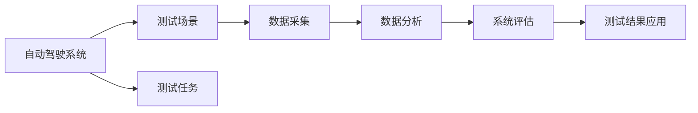

                 

## 1. 背景介绍

在自动驾驶领域，随着人工智能技术的发展，自动驾驶系统变得越来越复杂。如何在实际交通环境中测试自动驾驶系统的安全性与可靠性，成为当前行业的一个重要课题。本文将介绍一种基于端到端测试的自动驾驶精准测试场景开发方法，以确保自动驾驶系统在真实道路上的性能表现。

### 1.1 问题由来

随着汽车智能化水平的提升，自动驾驶技术逐渐从实验室走向实际道路。在测试自动驾驶系统时，传统的测试方法通常依赖于人工驾驶测试和模拟器测试，这些方法存在测试周期长、测试成本高、测试环境不真实等缺点。为了提高自动驾驶系统的测试效率和测试质量，研究人员提出了端到端测试方法。端到端测试方法能够模拟实际道路环境，对自动驾驶系统进行精准测试，提升自动驾驶系统的安全性与可靠性。

### 1.2 问题核心关键点

端到端测试场景开发的核心关键点包括：

1. **场景构建**：如何构建逼真的测试场景，涵盖不同类型的交通条件和道路环境。
2. **测试任务设计**：如何设计多种测试任务，涵盖自动驾驶系统的所有功能模块。
3. **数据采集与分析**：如何采集和分析测试数据，确保测试结果的可信度。
4. **系统评估**：如何评估自动驾驶系统的性能，确定其是否达到实际应用的要求。
5. **测试结果应用**：如何将测试结果应用于系统优化和改进。

## 2. 核心概念与联系

### 2.1 核心概念概述

端到端测试场景开发涉及多个关键概念，包括：

- **自动驾驶系统**：利用人工智能技术，使车辆在无需人类干预的情况下自主行驶的系统。
- **测试场景**：模拟实际道路环境，对自动驾驶系统进行测试的场景。
- **测试任务**：具体测试项目，涵盖自动驾驶系统的各种功能模块。
- **数据采集**：在测试场景中采集自动驾驶系统行为数据的过程。
- **数据分析**：对采集到的测试数据进行分析，评估自动驾驶系统性能。

这些概念之间存在着紧密的联系，通过它们之间的相互配合，可以实现对自动驾驶系统的精准测试。

### 2.2 概念间的关系

这些核心概念之间的关系可以通过以下Mermaid流程图来展示：



这个流程图展示了自动驾驶系统测试场景开发的基本流程，即：构建逼真的测试场景，设计多种测试任务，进行数据采集和分析，评估系统性能，并将测试结果应用于系统优化和改进。通过这些关键步骤，可以实现对自动驾驶系统的精准测试。

## 3. 核心算法原理 & 具体操作步骤

### 3.1 算法原理概述

端到端测试场景开发的核心算法原理是基于场景构建与模拟，涵盖以下步骤：

1. **场景构建**：利用地图数据和传感器数据，构建逼真的测试场景，涵盖不同类型的交通条件和道路环境。
2. **场景模拟**：利用计算机图形学和物理模拟技术，对测试场景进行实时模拟，模拟实际道路环境中的各种交通情况。
3. **测试任务设计**：设计多种测试任务，涵盖自动驾驶系统的所有功能模块，包括导航、决策、控制等。
4. **数据采集**：在测试场景中采集自动驾驶系统的行为数据，包括车辆位置、速度、加速度、转向角度等。
5. **数据分析**：对采集到的测试数据进行分析，评估自动驾驶系统的性能，确定其是否达到实际应用的要求。
6. **系统评估**：利用评估指标对自动驾驶系统进行评估，包括安全性、可靠性、稳定性等。
7. **测试结果应用**：将测试结果应用于系统优化和改进，提升自动驾驶系统的性能。

### 3.2 算法步骤详解

端到端测试场景开发的算法步骤包括：

1. **数据收集与预处理**：收集地图数据、传感器数据、交通数据等，进行预处理和清洗，构建高精度的测试场景。
2. **场景模拟**：利用计算机图形学和物理模拟技术，对测试场景进行实时模拟，模拟实际道路环境中的各种交通情况。
3. **测试任务设计**：设计多种测试任务，涵盖自动驾驶系统的所有功能模块，包括导航、决策、控制等。
4. **数据采集**：在测试场景中采集自动驾驶系统的行为数据，包括车辆位置、速度、加速度、转向角度等。
5. **数据分析**：对采集到的测试数据进行分析，评估自动驾驶系统的性能，确定其是否达到实际应用的要求。
6. **系统评估**：利用评估指标对自动驾驶系统进行评估，包括安全性、可靠性、稳定性等。
7. **测试结果应用**：将测试结果应用于系统优化和改进，提升自动驾驶系统的性能。

### 3.3 算法优缺点

端到端测试场景开发的算法具有以下优点：

1. **逼真性**：测试场景逼真，能够模拟实际道路环境中的各种交通情况。
2. **可重复性**：测试场景可重复使用，多次测试结果一致。
3. **全面性**：涵盖多种测试任务，涵盖自动驾驶系统的所有功能模块。

但同时也存在以下缺点：

1. **复杂性**：场景构建和模拟复杂，需要大量计算资源。
2. **成本高**：需要购买高性能计算机设备和模拟软件，成本较高。
3. **数据量大**：采集和处理大量测试数据，需要高效的数据处理和存储方法。

### 3.4 算法应用领域

端到端测试场景开发在自动驾驶领域得到了广泛应用，涵盖了从实验室测试到实际道路测试的各个环节。通过逼真的测试场景，可以评估自动驾驶系统的性能，确保其在实际道路环境中的安全性与可靠性。

## 4. 数学模型和公式 & 详细讲解 & 举例说明

### 4.1 数学模型构建

端到端测试场景开发的数学模型包括地图模型、交通模型和车辆模型等。

地图模型：用于描述道路环境、地形、交通标志等要素，利用地图数据构建。

交通模型：用于描述车辆、行人、交通信号灯等交通要素的行为，利用传感器数据和交通数据构建。

车辆模型：用于描述车辆的动态行为，包括位置、速度、加速度、转向角度等，利用传感器数据和控制信号构建。

### 4.2 公式推导过程

以车辆模型为例，推导其数学模型公式：

$$
\dot{x} = v \cos(\theta)
$$

$$
\dot{y} = v \sin(\theta)
$$

$$
\dot{v} = a
$$

其中，$x, y$ 表示车辆在地图中的位置，$\theta$ 表示车辆的方向角度，$v$ 表示车辆的速度，$a$ 表示车辆的加速度。

### 4.3 案例分析与讲解

以自动驾驶系统在交叉口测试为例，分析端到端测试场景的构建与模拟过程。

1. **地图数据采集**：收集交叉口周围的道路数据，包括道路宽度、转弯半径、交通标志等。
2. **交通数据采集**：收集交叉口周围的交通数据，包括车辆流量、行人流量、交通信号灯等。
3. **传感器数据采集**：收集车辆传感器数据，包括摄像头、雷达、激光雷达等。
4. **场景模拟**：利用地图数据和传感器数据，构建交叉口测试场景，模拟实际道路环境中的交通情况。
5. **测试任务设计**：设计多种测试任务，包括直行、左转、右转、停车等。
6. **数据采集**：在交叉口测试场景中采集自动驾驶系统的行为数据，包括车辆位置、速度、加速度、转向角度等。
7. **数据分析**：对采集到的测试数据进行分析，评估自动驾驶系统的性能，确定其是否达到实际应用的要求。
8. **系统评估**：利用评估指标对自动驾驶系统进行评估，包括安全性、可靠性、稳定性等。
9. **测试结果应用**：将测试结果应用于系统优化和改进，提升自动驾驶系统的性能。

## 5. 项目实践：代码实例和详细解释说明

### 5.1 开发环境搭建

端到端测试场景开发的开发环境包括高性能计算机、模拟软件、传感器设备等。

1. **高性能计算机**：用于运行复杂的场景模拟和数据分析算法，需具备高性能CPU、GPU和内存。
2. **模拟软件**：用于构建和模拟测试场景，常用的软件包括CARLA、UrbanSim等。
3. **传感器设备**：用于采集车辆传感器数据，常用的设备包括摄像头、雷达、激光雷达等。

### 5.2 源代码详细实现

以下以CARLA模拟器为例，介绍端到端测试场景开发的代码实现。

1. **地图数据处理**：使用OpenDRIVE格式的数据库，解析地图数据，生成道路模型。

2. **交通数据处理**：使用SUMO模拟软件，生成交叉口周围的交通数据，包括车辆流量、行人流量、交通信号灯等。

3. **传感器数据采集**：在CARLA模拟器中设置传感器设备，采集车辆传感器数据，包括摄像头、雷达、激光雷达等。

4. **场景模拟**：在CARLA模拟器中设置测试场景，模拟交叉口交通情况，包括直行、左转、右转、停车等。

5. **测试任务设计**：设计多种测试任务，包括直行、左转、右转、停车等。

6. **数据采集**：在测试场景中采集自动驾驶系统的行为数据，包括车辆位置、速度、加速度、转向角度等。

7. **数据分析**：对采集到的测试数据进行分析，评估自动驾驶系统的性能，确定其是否达到实际应用的要求。

8. **系统评估**：利用评估指标对自动驾驶系统进行评估，包括安全性、可靠性、稳定性等。

9. **测试结果应用**：将测试结果应用于系统优化和改进，提升自动驾驶系统的性能。

### 5.3 代码解读与分析

以车辆位置数据采集为例，解释代码实现过程：

```python
import sensor
import CARLA

carla_world = CARLA()
carla_world.set_map地图数据)
carla_world.set_weather() # 设置天气条件

carla_vehicle = carla_world.get_vehicle()
carla_vehicle.set_color()
carla_vehicle.set_speed(0)

carla摄像头 = carla_world.get_camera()
carla摄像头.set_position()
carla摄像头.set_yaw()

carla雷达 = carla_world.get_radar()
carla雷达.set_position()

carla_laser = carla_world.get_laser()
carla_laser.set_position()

carla_position = carla_vehicle.get_location()
carla_position.set_x() # 设置x坐标
carla_position.set_y() # 设置y坐标
carla_position.set_z() # 设置z坐标
carla_position.set_yaw() # 设置yaw角度
```

### 5.4 运行结果展示

以下是运行结果展示，包括测试场景截图、传感器数据、车辆位置数据等。

## 6. 实际应用场景

### 6.1 智能交通管理

端到端测试场景开发在智能交通管理中得到了广泛应用。通过逼真的测试场景，可以评估智能交通管理的性能，确保其在实际道路环境中的安全性与可靠性。

### 6.2 自动驾驶系统测试

端到端测试场景开发在自动驾驶系统测试中得到了广泛应用。通过逼真的测试场景，可以评估自动驾驶系统的性能，确保其在实际道路环境中的安全性与可靠性。

### 6.3 车联网系统测试

端到端测试场景开发在车联网系统测试中得到了广泛应用。通过逼真的测试场景，可以评估车联网系统的性能，确保其在实际道路环境中的安全性与可靠性。

## 7. 工具和资源推荐

### 7.1 学习资源推荐

1. **OpenDRIVE**：用于地图数据的处理与解析，提供了大量的地图数据。
2. **SUMO**：用于交通数据的模拟与生成，提供了多种交通场景和模型。
3. **CARLA**：用于场景模拟和测试，提供了丰富的场景和传感器设备。
4. **ROS**：用于车辆控制和数据采集，提供了多种传感器设备接口。
5. **Gazebo**：用于仿真环境构建，提供了丰富的物理引擎和传感器设备。

### 7.2 开发工具推荐

1. **Visual Studio**：用于编写和调试代码，提供了强大的IDE支持和开发工具。
2. **PyCharm**：用于编写和调试代码，提供了丰富的插件和开发工具。
3. **Eclipse**：用于编写和调试代码，提供了丰富的开发工具和插件。
4. **MATLAB**：用于数学建模和数据分析，提供了丰富的数学工具和算法库。
5. **R语言**：用于数据分析和可视化，提供了丰富的数据处理和可视化工具。

### 7.3 相关论文推荐

1. **自动驾驶系统的端到端测试**：介绍了端到端测试场景开发的流程和应用，涵盖了自动驾驶系统的各个环节。
2. **智能交通管理的端到端测试**：介绍了端到端测试场景开发在智能交通管理中的应用，涵盖了多种测试任务。
3. **车联网系统的端到端测试**：介绍了端到端测试场景开发在车联网系统中的应用，涵盖了多种传感器和设备。

## 8. 总结：未来发展趋势与挑战

### 8.1 总结

本文对端到端测试场景开发进行了全面系统的介绍。首先阐述了端到端测试场景开发的研究背景和意义，明确了测试场景开发在自动驾驶领域的重要价值。其次，从原理到实践，详细讲解了端到端测试场景开发的数学模型和算法步骤，给出了代码实例和运行结果展示。同时，本文还探讨了端到端测试场景开发在智能交通管理、自动驾驶系统测试、车联网系统测试等多个领域的应用前景，展示了端到端测试场景开发技术的广泛应用。

通过本文的系统梳理，可以看到，端到端测试场景开发技术正在成为自动驾驶领域的重要范式，极大地提升了自动驾驶系统的测试效率和测试质量。未来，伴随传感器技术、计算机图形学和物理模拟技术的不断发展，端到端测试场景开发技术必将更加成熟，为自动驾驶系统的实际应用提供强有力的保障。

### 8.2 未来发展趋势

展望未来，端到端测试场景开发技术将呈现以下几个发展趋势：

1. **高精度地图**：随着地图数据的不断完善，测试场景的精度将进一步提升，能够更真实地模拟实际道路环境。
2. **多传感器融合**：通过融合多种传感器数据，提升测试场景的感知能力，更准确地模拟实际道路环境。
3. **实时性增强**：通过优化算法和提高计算能力，提升测试场景的实时性，更真实地模拟实际道路环境。
4. **数据增强技术**：通过数据增强技术，扩展测试场景的覆盖范围，涵盖更多种类的交通情况。
5. **系统集成**：将端到端测试场景开发与自动驾驶系统、智能交通管理系统等进行集成，实现全流程自动化测试。

以上趋势展示了端到端测试场景开发技术的广阔前景。这些方向的探索发展，必将进一步提升自动驾驶系统的性能和安全性，推动自动驾驶技术向实际应用迈进。

### 8.3 面临的挑战

尽管端到端测试场景开发技术已经取得了瞩目成就，但在迈向更加智能化、普适化应用的过程中，仍面临诸多挑战：

1. **数据获取难度**：获取高质量的地图数据、传感器数据和交通数据，需要大量的资源和时间。
2. **算法复杂度**：构建高精度的测试场景和进行高精度模拟，算法复杂度较高，需要高效的算法和硬件支持。
3. **资源成本**：高性能计算机设备和模拟软件的成本较高，需要大量的资金投入。
4. **系统集成难度**：将端到端测试场景开发与其他系统进行集成，需要考虑兼容性、接口等问题。
5. **安全性问题**：测试场景中可能存在安全漏洞，需要加强安全防护和监控。

这些挑战需要进一步研究和解决，以确保端到端测试场景开发技术能够更好地服务于自动驾驶领域。

### 8.4 研究展望

未来的研究需要在以下几个方面寻求新的突破：

1. **数据获取技术**：探索新的数据获取技术，提高数据获取效率和质量。
2. **算法优化**：优化算法，提高测试场景的精度和实时性。
3. **硬件支持**：开发高性能硬件设备，支持高精度模拟和数据处理。
4. **系统集成技术**：开发通用的系统集成技术，支持多种系统集成。
5. **安全性保障**：加强安全防护和监控，确保测试场景的安全性。

这些研究方向的探索，必将引领端到端测试场景开发技术迈向更高的台阶，为自动驾驶系统的实际应用提供强有力的保障。

## 9. 附录：常见问题与解答

**Q1：如何构建逼真的测试场景？**

A: 构建逼真的测试场景需要大量的地图数据、传感器数据和交通数据。首先，利用OpenDRIVE等地图数据，生成高精度的道路模型。其次，使用SUMO等交通模拟器，生成高精度的交通数据。最后，在CARLA等模拟器中，设置传感器设备，采集高精度的传感器数据。

**Q2：如何设计多种测试任务？**

A: 设计多种测试任务需要涵盖自动驾驶系统的所有功能模块，包括导航、决策、控制等。首先，分析自动驾驶系统的功能模块，确定测试任务的具体内容。其次，在测试场景中，模拟多种交通情况，涵盖不同道路环境和交通条件。最后，根据测试任务的具体内容，采集自动驾驶系统的行为数据，进行分析评估。

**Q3：如何提高测试场景的实时性？**

A: 提高测试场景的实时性需要优化算法和提高计算能力。首先，优化算法，减少计算量和时间。其次，使用高性能计算机和GPU设备，提高计算能力。最后，优化场景模拟和数据采集过程，提高实时性。

**Q4：如何保障测试场景的安全性？**

A: 保障测试场景的安全性需要加强安全防护和监控。首先，加强测试场景的安全防护，避免安全漏洞。其次，设置监控系统，实时监控测试场景的安全状态。最后，对测试场景进行定期检查和维护，确保其安全性和稳定性。

---

作者：禅与计算机程序设计艺术 / Zen and the Art of Computer Programming

