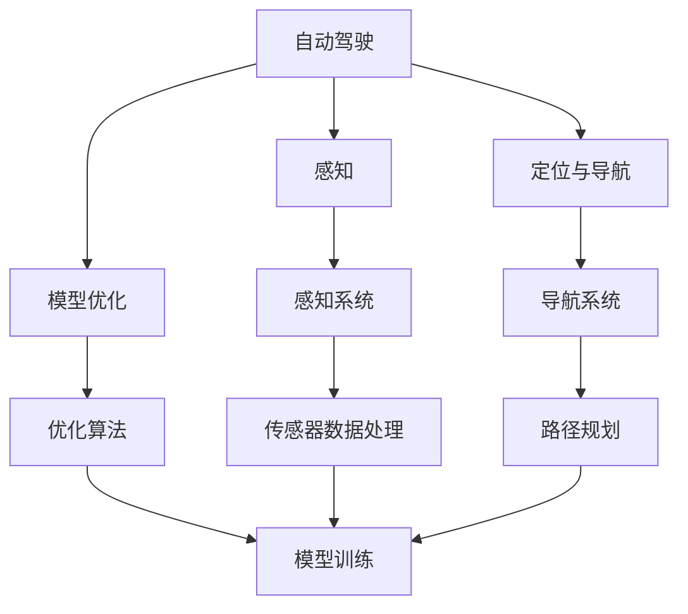
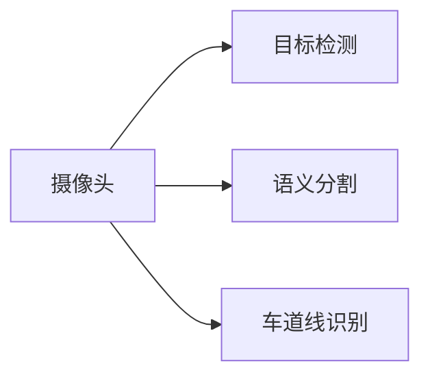
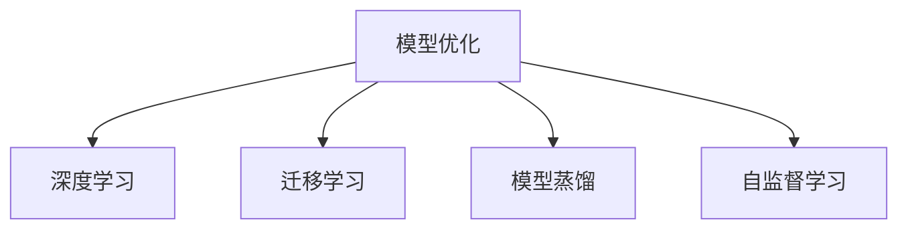
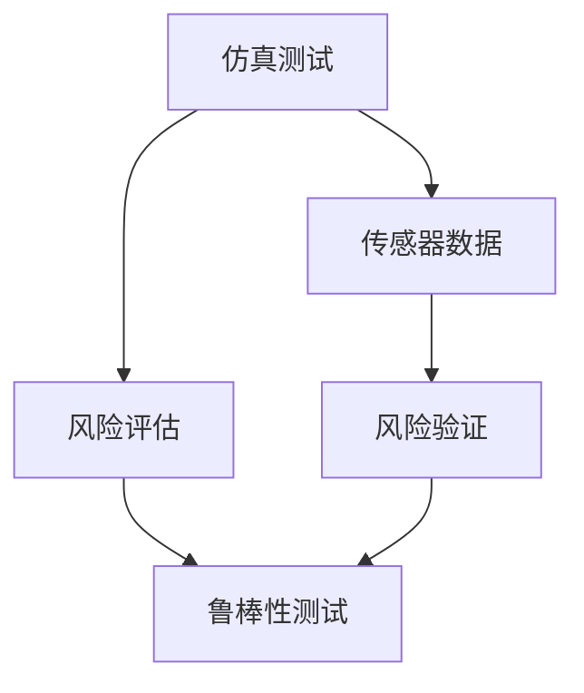
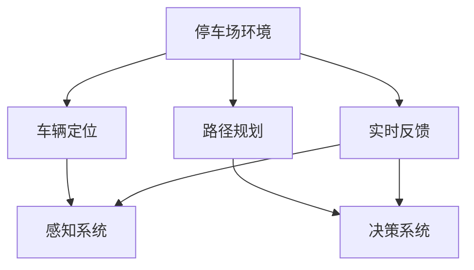
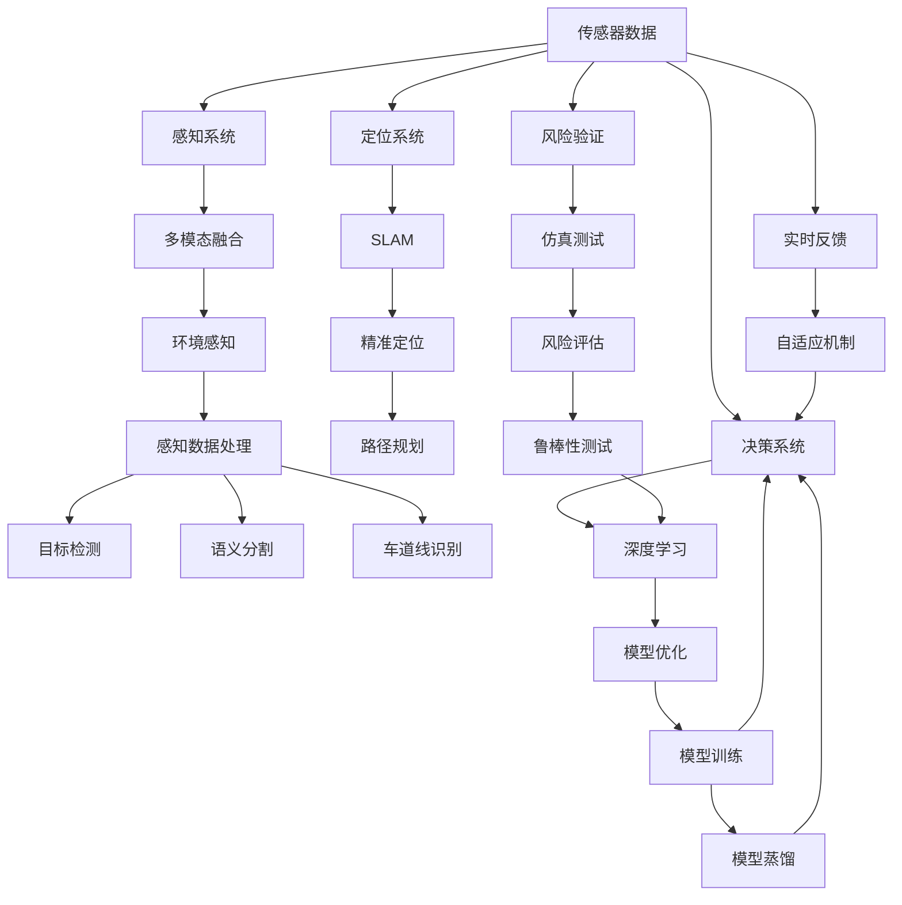

                 

# 端到端自动驾驶的自主代客泊车服务

> 关键词：自动驾驶, 自主代客泊车, 端到端, 深度学习, 传感器融合, 模型优化, 安全验证, 实际应用

## 1. 背景介绍

### 1.1 问题由来
随着社会经济的快速发展，汽车保有量持续增长，城市交通压力日益增大。停车难、寻找停车位耗时过长等问题已经成为制约城市发展的一大瓶颈。为了缓解这一问题，智能停车成为热门研究领域。其中，自主代客泊车服务（Autonomous Valet Parking Service）因其无需人工驾驶、效率高、体验优的特点，逐渐引起广泛关注。

然而，尽管该技术已初步具备落地能力，但其在实际应用中的挑战依然严峻。一方面，大规模部署需要高效的算法，以实现停车场和道路环境中的安全、可靠、高精度定位；另一方面，系统需要满足高性能实时性要求，以便快速响应用户的泊车请求。

### 1.2 问题核心关键点
为了实现高效、安全的自主代客泊车服务，需要综合应用以下几个关键点：

1. **端到端感知与决策**：通过摄像头、雷达、激光雷达等多模态传感器，构建高精度环境感知系统，实时获取车辆周围的环境信息，并进行语义分割、目标检测、车道线识别等处理。

2. **精准定位与导航**：采用SLAM等技术，实现车辆的精准定位与路径规划，确保泊车过程的准确性。

3. **模型优化与训练**：使用深度学习模型进行感知、决策和导航任务的训练与优化，提升算法的鲁棒性和泛化能力。

4. **安全验证与风险控制**：结合传感器数据和仿真测试，验证系统的安全性能，并通过设计鲁棒性和容错性强的算法，避免潜在风险。

5. **实际应用与场景适配**：将系统部署到实际停车场环境中，结合实时反馈与自适应机制，实现对各种复杂场景的应对。

### 1.3 问题研究意义
自主代客泊车服务的研究与应用，不仅能够缓解城市停车难的问题，还能提升城市交通的智能化水平，具有以下重要意义：

1. 提升用户体验：无需人工驾驶，减少等待时间，提供更为便捷、舒适的停车体验。

2. 提升停车效率：通过智能化管理系统，优化泊车流程，提高停车场的空间利用率。

3. 安全保障：在复杂的停车场环境中，自动驾驶系统具备高精度的环境感知和决策能力，减少人为错误和潜在风险。

4. 智能城市建设：作为智能城市的一部分，自主代客泊车服务能够提升城市的智能化水平，促进城市治理能力的现代化。

## 2. 核心概念与联系

### 2.1 核心概念概述

为更好地理解自主代客泊车服务的核心技术，本节将介绍几个密切相关的核心概念：

- **自动驾驶(Autonomous Driving)**：通过传感器、计算和执行系统，实现车辆的无人工干预驾驶。

- **感知(Sensing)**：使用摄像头、雷达、激光雷达等多模态传感器，获取车辆周围环境信息，并进行目标检测、语义分割、车道线识别等处理。

- **定位与导航(Positioning & Navigation)**：通过SLAM等技术，实现车辆的精准定位与路径规划，确保车辆在复杂环境中的准确性。

- **模型优化(Model Optimization)**：使用深度学习模型对感知、决策和导航任务进行训练与优化，提升模型的鲁棒性和泛化能力。

- **安全验证(Safety Validation)**：通过仿真测试与传感器数据结合，验证系统的安全性能，确保系统在复杂环境中的稳定性。

- **实际应用(Real-World Deployment)**：将系统部署到实际场景中，结合实时反馈与自适应机制，实现对各种复杂场景的应对。

这些核心概念之间的逻辑关系可以通过以下Mermaid流程图来展示：



这个流程图展示了自动驾驶的核心组件及其相互关系：

1. 自动驾驶系统依赖感知系统获取环境信息，感知系统通过传感器数据处理、目标检测等任务提供支持。
2. 定位与导航系统实现车辆的精准定位与路径规划，为自动驾驶提供基础。
3. 模型优化算法用于训练和优化深度学习模型，提升系统的鲁棒性和泛化能力。
4. 安全验证系统通过仿真测试和传感器数据结合，确保系统安全性能。
5. 实际应用系统部署到真实环境中，结合实时反馈与自适应机制，实现对各种复杂场景的应对。

### 2.2 概念间的关系

这些核心概念之间存在着紧密的联系，形成了自主代客泊车服务的完整生态系统。下面我们通过几个Mermaid流程图来展示这些概念之间的关系。

#### 2.2.1 自动驾驶系统的学习范式


这个流程图展示了自动驾驶系统的学习范式，其中感知系统通过传感器数据处理、目标检测等任务提供支持，导航系统通过路径规划实现车辆的精准定位。

#### 2.2.2 感知系统的核心任务



这个流程图展示了感知系统的核心任务，通过摄像头、雷达、激光雷达等多模态传感器，获取车辆周围环境信息，并进行目标检测、语义分割、车道线识别等处理。

#### 2.2.3 模型优化的关键算法



这个流程图展示了模型优化的关键算法，包括深度学习、迁移学习、模型蒸馏和自监督学习等方法。这些算法通过训练与优化深度学习模型，提升模型的鲁棒性和泛化能力。

#### 2.2.4 安全验证的检测流程



这个流程图展示了安全验证的检测流程，通过仿真测试与传感器数据结合，验证系统的安全性能，确保系统在复杂环境中的稳定性。

#### 2.2.5 实际应用的部署场景



这个流程图展示了实际应用的部署场景，将系统部署到实际场景中，结合实时反馈与自适应机制，实现对各种复杂场景的应对。

### 2.3 核心概念的整体架构

最后，我们用一个综合的流程图来展示这些核心概念在大规模部署自主代客泊车服务时的整体架构：



这个综合流程图展示了从传感器数据采集到实际应用部署的完整过程。自主代客泊车服务系统的各个组件紧密协作，实现对停车场和道路环境的感知、定位与导航、感知数据处理、目标检测、语义分割、车道线识别等处理，最终结合实时反馈与自适应机制，实现对各种复杂场景的应对。

## 3. 核心算法原理 & 具体操作步骤

### 3.1 算法原理概述

端到端的自主代客泊车服务系统，涉及传感器数据采集、环境感知、路径规划、模型优化、安全验证等多个环节，每个环节都需要高效的算法支撑。

#### 3.1.1 感知系统

感知系统的核心任务是通过摄像头、雷达、激光雷达等多模态传感器，实时获取车辆周围环境信息，并进行目标检测、语义分割、车道线识别等处理。

#### 3.1.2 定位与导航

定位与导航系统通过SLAM等技术，实现车辆的精准定位与路径规划。具体步骤如下：

1. 传感器数据融合：将摄像头、雷达、激光雷达等传感器数据进行融合，获取车辆周围环境的全局信息。

2. 建图与定位：利用SLAM技术，对环境进行全局建图，并通过卡尔曼滤波等算法实现车辆的精准定位。

3. 路径规划：结合建图信息与车辆定位，通过A*、D*等算法，进行路径规划和避障处理，确保车辆在复杂环境中的安全性。

#### 3.1.3 模型优化

模型优化主要涉及深度学习模型的训练与优化，提升模型的鲁棒性和泛化能力。具体步骤如下：

1. 数据预处理：对传感器数据进行预处理，如去噪、归一化等。

2. 模型选择与设计：选择合适的深度学习模型，并进行必要的调整与设计，以适应特定的感知、决策和导航任务。

3. 模型训练与优化：使用大规模训练数据集，对模型进行训练与优化，并通过自监督学习、迁移学习等方法提升模型性能。

4. 模型验证与评估：在验证集上对模型进行评估，调整模型参数，确保模型在新数据上的泛化能力。

#### 3.1.4 安全验证

安全验证系统通过仿真测试与传感器数据结合，验证系统的安全性能，确保系统在复杂环境中的稳定性。具体步骤如下：

1. 仿真测试：构建仿真环境，模拟各种复杂场景，对系统进行全面的测试与验证。

2. 传感器数据结合：在实际环境中，结合传感器数据进行实时监测与风险评估，确保系统安全性能。

3. 鲁棒性测试：设计鲁棒性测试，评估系统在不同干扰下的表现，确保系统的鲁棒性。

#### 3.1.5 实际应用

实际应用系统部署到真实环境中，结合实时反馈与自适应机制，实现对各种复杂场景的应对。具体步骤如下：

1. 实时数据采集：通过传感器实时采集车辆周围环境信息。

2. 实时感知处理：结合实时数据，进行环境感知、目标检测、语义分割等处理。

3. 实时路径规划：根据实时感知结果，进行路径规划与避障处理，确保车辆安全到达目标位置。

4. 实时反馈与自适应：结合实时反馈信息，对系统进行自适应调整，确保系统在复杂环境中的稳定性。

### 3.2 算法步骤详解

基于端到端自主代客泊车服务的算法步骤，下面详细介绍各个关键环节的具体操作。

#### 3.2.1 感知系统

1. **传感器数据采集**：使用摄像头、雷达、激光雷达等传感器，实时采集车辆周围环境信息。

2. **数据预处理**：对传感器数据进行预处理，如去噪、归一化、增强等，提高数据质量。

3. **目标检测**：使用深度学习模型（如YOLO、Faster R-CNN等）进行目标检测，识别车辆、行人、障碍物等。

4. **语义分割**：使用语义分割模型（如U-Net、DeepLab等）进行语义分割，将环境分为道路、建筑、车辆等类别。

5. **车道线识别**：使用车道线识别模型（如Mask R-CNN）进行车道线识别，确定车辆行驶路径。

#### 3.2.2 定位与导航

1. **传感器数据融合**：将摄像头、雷达、激光雷达等传感器数据进行融合，获取车辆周围环境的全局信息。

2. **SLAM建图与定位**：利用SLAM技术，对环境进行全局建图，并通过卡尔曼滤波等算法实现车辆的精准定位。

3. **路径规划**：结合建图信息与车辆定位，通过A*、D*等算法，进行路径规划和避障处理，确保车辆在复杂环境中的安全性。

#### 3.2.3 模型优化

1. **数据预处理**：对传感器数据进行预处理，如去噪、归一化等。

2. **模型选择与设计**：选择合适的深度学习模型，并进行必要的调整与设计，以适应特定的感知、决策和导航任务。

3. **模型训练与优化**：使用大规模训练数据集，对模型进行训练与优化，并通过自监督学习、迁移学习等方法提升模型性能。

4. **模型验证与评估**：在验证集上对模型进行评估，调整模型参数，确保模型在新数据上的泛化能力。

#### 3.2.4 安全验证

1. **仿真测试**：构建仿真环境，模拟各种复杂场景，对系统进行全面的测试与验证。

2. **传感器数据结合**：在实际环境中，结合传感器数据进行实时监测与风险评估，确保系统安全性能。

3. **鲁棒性测试**：设计鲁棒性测试，评估系统在不同干扰下的表现，确保系统的鲁棒性。

#### 3.2.5 实际应用

1. **实时数据采集**：通过传感器实时采集车辆周围环境信息。

2. **实时感知处理**：结合实时数据，进行环境感知、目标检测、语义分割等处理。

3. **实时路径规划**：根据实时感知结果，进行路径规划与避障处理，确保车辆安全到达目标位置。

4. **实时反馈与自适应**：结合实时反馈信息，对系统进行自适应调整，确保系统在复杂环境中的稳定性。

### 3.3 算法优缺点

端到端自主代客泊车服务系统具有以下优点：

1. **高效性**：通过多模态传感器的融合，实现高精度的环境感知，提升系统的实时性。

2. **鲁棒性**：结合自监督学习、迁移学习等技术，提升模型的鲁棒性和泛化能力。

3. **安全性**：通过仿真测试与传感器数据结合，确保系统在复杂环境中的稳定性。

4. **适用性**：将系统部署到实际环境中，结合实时反馈与自适应机制，实现对各种复杂场景的应对。

然而，该系统也存在一些缺点：

1. **高成本**：大规模部署需要高成本的多模态传感器和计算资源。

2. **复杂性**：系统涉及多个环节，设计复杂，维护成本高。

3. **环境依赖**：系统对环境依赖较大，需要高精度的传感器数据支持。

4. **鲁棒性挑战**：在复杂环境下，系统的鲁棒性和安全性仍需进一步提升。

### 3.4 算法应用领域

自主代客泊车服务系统的应用领域非常广泛，包括但不限于以下几个方面：

1. **停车场管理**：实现自动泊车、自动离车，提升停车场管理效率，优化停车资源。

2. **城市交通**：在城市交通中应用，缓解交通拥堵，提升交通效率。

3. **商业综合体**：在商业综合体中应用，提升商业服务效率，提升用户体验。

4. **住宅小区**：在住宅小区中应用，提升居民停车体验，优化小区环境。

5. **机场、酒店等场所**：在机场、酒店等场所应用，提升服务效率，提升客户体验。

## 4. 数学模型和公式 & 详细讲解 & 举例说明

### 4.1 数学模型构建

自主代客泊车服务系统涉及多个数学模型，主要包括以下几个方面：

1. **传感器数据融合模型**：将摄像头、雷达、激光雷达等传感器数据进行融合，获取车辆周围环境的全局信息。

2. **SLAM建图与定位模型**：利用SLAM技术，对环境进行全局建图，并通过卡尔曼滤波等算法实现车辆的精准定位。

3. **目标检测与识别模型**：使用深度学习模型进行目标检测与识别，如YOLO、Faster R-CNN、Mask R-CNN等。

4. **路径规划与导航模型**：结合建图信息与车辆定位，通过A*、D*等算法，进行路径规划和避障处理。

5. **鲁棒性测试与验证模型**：设计鲁棒性测试，评估系统在不同干扰下的表现。

### 4.2 公式推导过程

#### 4.2.1 传感器数据融合模型

传感器数据融合模型主要涉及多模态数据的融合，以下是基本的融合公式：

$$
y = \sum_{i=1}^{n} w_i z_i
$$

其中，$y$为融合后的结果，$z_i$为第$i$个传感器数据，$w_i$为第$i$个传感器的权重。

#### 4.2.2 SLAM建图与定位模型

SLAM建图与定位模型主要涉及卡尔曼滤波，以下是卡尔曼滤波的基本公式：

$$
\hat{x}_{k+1} = F_k \hat{x}_k + B_k u_k
$$

$$
P_{k+1} = F_k P_k F_k^T + G_k Q_k G_k^T
$$

$$
K_k = P_k H_k^T (H_k P_k H_k^T + R_k)^{-1}
$$

$$
\hat{x}_{k+1} = \hat{x}_{k+1} + K_k (z_k - H_k \hat{x}_{k+1})
$$

$$
P_{k+1} = (I - K_k H_k) P_k
$$

其中，$\hat{x}_{k+1}$为预测的车辆状态，$P_{k+1}$为预测的协方差矩阵，$u_k$为车辆控制量，$z_k$为传感器测量值，$F_k$为状态转移矩阵，$B_k$为控制矩阵，$G_k$为观测矩阵，$Q_k$为过程噪声协方差矩阵，$H_k$为观测矩阵，$R_k$为观测噪声协方差矩阵，$K_k$为卡尔曼增益矩阵。

#### 4.2.3 目标检测与识别模型

目标检测与识别模型主要涉及深度学习模型的训练与优化，以下是YOLO模型的基本公式：

$$
L(x_i) = L_{conf}(y_{i},\hat{y}_{i}) + \sum_{j=1}^{n} L_{cls}(y_{j},\hat{y}_{j})
$$

其中，$L(x_i)$为第$i$个目标的损失函数，$L_{conf}$为置信度损失，$L_{cls}$为分类损失，$y_{i}$为目标的预测结果，$\hat{y}_{i}$为目标的标签。

#### 4.2.4 路径规划与导航模型

路径规划与导航模型主要涉及A*、D*等算法，以下是A*算法的基本公式：

$$
F(n) = g(n) + h(n)
$$

$$
n^* = \arg\min_{n \in N} F(n)
$$

其中，$n$为节点，$g(n)$为从起点到节点$n$的成本，$h(n)$为从节点$n$到终点的估计成本，$N$为节点集合，$F(n)$为启发函数，$n^*$为最优节点。

#### 4.2.5 鲁棒性测试与验证模型

鲁棒性测试与验证模型主要涉及系统的鲁棒性测试，以下是基本的鲁棒性测试公式：

$$
L = L_{basic} + \lambda L_{robust}
$$

其中，$L$为系统的鲁棒性测试损失，$L_{basic}$为基本性能损失，$L_{robust}$为鲁棒性损失，$\lambda$为鲁棒性权值。

### 4.3 案例分析与讲解

以下以一个实际案例来分析自主代客泊车服务系统的关键算法。

#### 4.3.1 案例背景

某停车场需要对车辆进行自动代客泊车服务，系统需要实时获取车辆周围环境信息，并进行目标检测、语义分割、车道线识别等处理。同时，系统需要实现车辆的精准定位与路径规划，确保车辆在复杂环境中的安全性。

#### 4.3.2 案例步骤

1. **传感器数据采集**：使用摄像头、雷达、激光雷达等传感器，实时采集车辆周围环境信息。

2. **数据预处理**：对传感器数据进行去噪、归一化、增强等预处理，提高数据质量。

3. **目标检测**：使用YOLO模型进行目标检测，识别车辆、行人、障碍物等。

4. **语义分割**：使用U-Net模型进行语义分割，将环境分为道路、建筑、车辆等类别。

5. **车道线识别**：使用Mask R-CNN模型进行车道线识别，确定车辆行驶路径。

6. **SLAM建图与定位**：利用SLAM技术，对环境进行全局建图，并通过卡尔曼滤波实现车辆的精准定位。

7. **路径规划**：结合建图信息与车辆定位，通过A*算法进行路径规划和避障处理，确保车辆在复杂环境中的安全性。

8. **模型优化**：对深度学习模型进行训练与优化，提升模型的鲁棒性和泛化能力。

9. **安全验证**：通过仿真测试与传感器数据结合，验证系统的安全性能，确保系统在复杂环境中的稳定性。

10. **实际应用**：将系统部署到真实环境中，结合实时反馈与自适应机制，实现对各种复杂场景的应对。

## 5. 项目实践：代码实例和详细解释说明

### 5.1 开发环境搭建

在进行自主代客泊车服务系统的开发前，需要先准备好开发环境。以下是使用Python进行PyTorch和OpenCV开发的环境配置流程：

1. 安装Anaconda：从官网下载并安装Anaconda，用于创建独立的Python环境。

2. 创建并激活虚拟环境：
```bash
conda create -n pytorch-env python=3.8 
conda activate pytorch-env
```

3. 安装PyTorch和OpenCV：
```bash
conda install pytorch torchvision torchaudio cudatoolkit=11.1 -c pytorch -c conda-forge
pip install opencv-python
```

4. 安装各类工具包：
```bash
pip install numpy pandas scikit-learn matplotlib tqdm jupyter notebook ipython
```

完成上述步骤后，即可在`pytorch-env`环境中开始项目实践。

### 5.2 源代码详细实现

这里我们以YOLO目标检测模型为例，给出使用PyTorch进行目标检测的代码实现。

首先，定义YOLO模型的超参数：

```python
import torch
from torch.utils.data import DataLoader
from torchvision import transforms, datasets
from torchvision.models import resnet50

batch_size = 16
num_classes = 5
learning_rate = 0.001
num_epochs = 20

# 数据预处理
transform_train = transforms.Compose([
    transforms.Resize((640, 640)),
    transforms.RandomHorizontalFlip(),
    transforms.ToTensor(),
    transforms.Normalize(mean=[0.485, 0.456, 0.406], std=[0.229, 0.224, 0.225])
])

transform_test = transforms.Compose([
    transforms.Resize((640, 640)),
    transforms.ToTensor(),
    transforms.Normalize(mean=[0.485, 0.456, 0.406], std=[0.229, 0.224, 0.225])
])

# 定义数据集
train_dataset = datasets.ImageFolder(root='train_dir', transform=transform_train)
test_dataset = datasets.ImageFolder(root='test_dir', transform=transform_test)

# 定义模型
model = resnet50(pretrained=True)
num_ftrs = model.fc.in_features
model.fc = torch.nn.Linear(num_ftrs, num_classes)

# 定义优化器与损失函数
optimizer = torch.optim.SGD(model.parameters(), lr=learning_rate, momentum=0.9)
criterion = torch.nn.CrossEntropyLoss()

# 训练过程
device = torch.device('cuda') if torch.cuda.is_available() else torch.device('cpu')
model.to(device)

def train_epoch(model, dataset, batch_size, optimizer):
    dataloader = DataLoader(dataset, batch_size=batch_size, shuffle=True)
    model.train()
    for batch_idx, (inputs, targets) in enumerate(dataloader):
        inputs, targets = inputs.to(device), targets.to(device)
        optimizer.zero_grad()
        outputs = model(inputs)
        loss = criterion(outputs, targets)
        loss.backward()
        optimizer.step()
    return loss.item()

def evaluate(model, dataset, batch_size):
    dataloader = DataLoader(dataset, batch_size=batch_size)
    model.eval()
    preds, labels = [], []
    with torch.no_grad():
        for batch in dataloader:
            inputs

