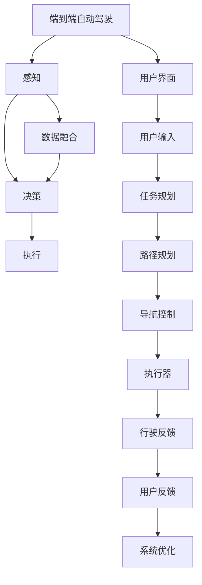
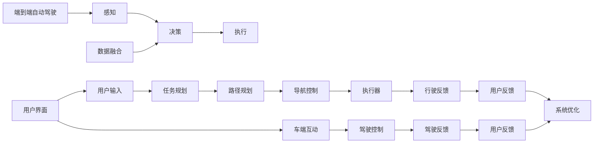
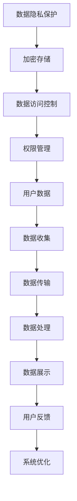
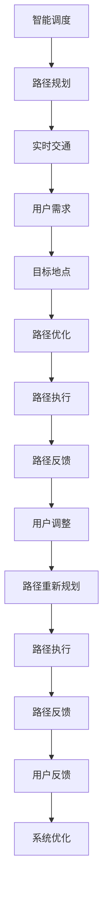

                 

# 端到端自动驾驶的自主代驾服务模式

在自动驾驶技术蓬勃发展的今天，如何为用户提供高效、安全、个性化的驾驶体验，成为了各大公司竞相探索的重要方向。端到端自动驾驶技术的应用，使得从感知、决策到执行的全过程都能在一个系统中实现，提升了自动驾驶的效率和可靠性。在此基础上，自主代驾服务模式（Automated Chauffeur Service Mode, ACSM）通过将用户与自动驾驶车辆对接，不仅满足了用户多样化的出行需求，还大幅提升了驾驶安全性，开启了智能交通的新纪元。本文将详细探讨ACSM的核心概念、算法原理与操作步骤，并结合实际应用场景给出具体实现方案，最后分析其未来发展趋势与面临的挑战。

## 1. 背景介绍

### 1.1 问题由来

随着人工智能技术的不断进步，自动驾驶技术逐渐从实验室走向现实世界，成为未来智能交通的重要组成部分。然而，自动驾驶技术的推广应用仍面临着诸多挑战：

- 技术成熟度不足：尽管自动驾驶技术已取得了一定进展，但仍存在感知、决策和执行等环节的可靠性问题。

- 用户信任度低：普通用户对自动驾驶技术的安全性和可靠性缺乏信心，导致接受度较低。

- 法规与监管环境不完善：自动驾驶车辆上路仍面临法律法规和监管环境的限制，影响其大规模应用。

为应对上述挑战，各大厂商纷纷引入ACSM，将自动驾驶技术应用到实际商业场景中，帮助用户更好地适应并信任这项新技术。

### 1.2 问题核心关键点

ACSM的核心在于将自动驾驶技术转化为实际的用户服务，具体关键点包括：

- 用户与车辆的互动界面：设计简洁直观的交互界面，使用户能够快速掌握操作方式。

- 数据隐私保护：保护用户隐私数据，确保车辆在运行过程中不会泄露个人信息。

- 快速上下车服务：用户可以方便地与车辆对接和分离，减少等待时间。

- 智能调度和路径规划：根据用户需求和实时路况，智能规划行驶路径，提升出行效率。

- 实时监控与反馈：实时监控车辆运行状态，及时向用户反馈行驶信息，增强用户信任度。

### 1.3 问题研究意义

ACSM作为连接用户和自动驾驶技术的重要桥梁，具有以下重要意义：

- 提升用户体验：通过个性化的驾驶服务和智能调度的应用，提升用户的出行舒适度和安全性。

- 推动技术应用：帮助用户更好地理解和接受自动驾驶技术，促进自动驾驶技术的市场推广和应用落地。

- 增强数据收集与反馈：在实际应用中，能够收集大量道路环境和用户行为数据，为进一步优化自动驾驶系统提供宝贵信息。

- 实现个性化出行：满足不同用户的需求，包括定制化行程规划、灵活的出行时间等，提升出行服务的个性化和灵活性。

## 2. 核心概念与联系

### 2.1 核心概念概述

- 端到端自动驾驶（End-to-End Autonomous Driving, EAD）：指从感知、决策到执行的全过程在一个闭环系统中实现，无人工干预的自动驾驶系统。

- 自主代驾服务（Automated Chauffeur Service, ACS）：通过将自动驾驶技术与传统的代驾服务相结合，提供个性化、高安全性、高舒适性的出行服务。

- 用户端到端交互界面：包括APP/小程序等，方便用户与自动驾驶车辆进行互动和导航。

- 数据隐私保护：采用加密存储和访问控制等技术，确保用户数据的机密性和安全性。

- 智能调度和路径规划：结合用户需求和实时交通状况，动态优化路径规划，提升出行效率。

- 实时监控与反馈：通过车内外摄像头、GPS、传感器等设备，实时监控车辆状态和行驶情况，并向用户提供及时反馈。

这些核心概念之间的逻辑关系可以通过以下Mermaid流程图来展示：



这个流程图展示了ACSM的关键流程：

1. 自动驾驶系统通过感知模块获取实时环境数据。
2. 数据融合模块整合不同传感器数据，辅助决策模块做出行动决策。
3. 路径规划和导航控制模块根据用户需求和实时路况优化行驶路径。
4. 执行器执行决策，车辆自主行驶。
5. 行驶反馈模块实时监控车辆状态和行驶情况。
6. 用户界面向用户提供车辆状态信息和导航指引。
7. 用户通过输入接口进行任务调整和目的地设置。
8. 系统根据用户反馈进行优化。

### 2.2 概念间的关系

这些核心概念之间存在着紧密的联系，形成了ACSM的完整生态系统。下面我通过几个Mermaid流程图来展示这些概念之间的关系。

#### 2.2.1 端到端自动驾驶与自主代驾服务的关系



这个流程图展示了端到端自动驾驶与自主代驾服务的关系：

1. 端到端自动驾驶系统通过感知、决策和执行模块实现自主驾驶。
2. 用户界面向用户提供车端互动功能，用户通过输入接口进行目的地设置和路径规划。
3. 路径规划模块根据用户需求和实时路况动态优化行驶路径。
4. 导航控制模块根据优化后的路径规划，控制车辆行驶。
5. 执行器执行导航控制，车辆自主行驶。
6. 行驶反馈模块实时监控车辆状态和行驶情况。
7. 用户界面向用户提供实时行驶反馈。
8. 用户通过反馈接口调整路径或结束行程。
9. 系统根据用户反馈进行优化。

#### 2.2.2 数据隐私保护在ACSM中的应用



这个流程图展示了数据隐私保护在ACSM中的应用：

1. 数据隐私保护技术通过加密存储和数据访问控制等措施，保护用户数据的机密性和安全性。
2. 用户数据通过收集和传输模块进入系统进行处理。
3. 数据处理模块进行数据展示和分析，辅助用户进行决策。
4. 用户通过反馈接口提供反馈信息。
5. 系统根据反馈信息进行优化和改进。

#### 2.2.3 智能调度和路径规划的详细流程



这个流程图展示了智能调度和路径规划的详细流程：

1. 智能调度模块结合实时交通状况和用户需求，生成初步的路径规划。
2. 路径规划模块根据用户需求和实时交通情况，优化路径选择。
3. 路径执行模块根据优化后的路径进行车辆导航控制。
4. 路径反馈模块实时监控车辆行驶情况，并向用户提供反馈。
5. 用户通过反馈接口调整路径或目的地。
6. 路径重新规划模块根据用户调整重新生成路径。
7. 路径执行模块根据新的路径进行车辆导航控制。
8. 路径反馈模块实时监控车辆行驶情况，并向用户提供反馈。
9. 系统根据用户反馈进行优化和改进。

## 3. 核心算法原理 & 具体操作步骤

### 3.1 算法原理概述

ACSM的算法原理主要包括两个部分：感知与决策模块和路径规划与导航控制模块。感知与决策模块负责实时获取环境数据，并进行融合与决策；路径规划与导航控制模块则负责动态优化路径，实现车辆自主导航。

#### 3.1.1 感知与决策模块

感知与决策模块的核心算法包括：

- 多传感器数据融合算法：通过将来自摄像头、雷达、激光雷达、GPS等多种传感器的数据进行融合，构建环境感知地图，为决策模块提供完整的环境信息。

- 目标检测与识别算法：使用深度学习模型（如YOLO、Faster R-CNN等）检测和识别路标、车辆、行人等目标，并进行分类和定位。

- 行为识别与预测算法：结合目标检测结果和车辆自身状态，预测其他车辆的行驶意图，判断可能的碰撞风险。

- 决策与控制算法：根据环境感知和行为预测结果，生成决策信号，控制车辆执行对应的动作（如加速、刹车、变道等）。

#### 3.1.2 路径规划与导航控制模块

路径规划与导航控制模块的核心算法包括：

- 路径规划算法：结合用户需求和实时交通情况，动态规划最优路径，避免拥堵和危险区域。

- 导航控制算法：根据路径规划结果，控制车辆的转向、速度等参数，实现车辆的自主导航。

- 实时监控与反馈算法：通过车内外摄像头、GPS、传感器等设备，实时监控车辆状态和行驶情况，并向用户提供及时反馈。

### 3.2 算法步骤详解

#### 3.2.1 感知与决策模块

1. 数据收集与预处理：通过多传感器收集环境数据，并进行预处理，包括去噪、校正、拼接等操作。

2. 目标检测与识别：使用深度学习模型检测和识别路标、车辆、行人等目标，并进行分类和定位。

3. 行为识别与预测：结合目标检测结果和车辆自身状态，预测其他车辆的行驶意图，判断可能的碰撞风险。

4. 决策与控制：根据环境感知和行为预测结果，生成决策信号，控制车辆执行对应的动作（如加速、刹车、变道等）。

#### 3.2.2 路径规划与导航控制模块

1. 路径规划：结合用户需求和实时交通情况，动态规划最优路径，避免拥堵和危险区域。

2. 导航控制：根据路径规划结果，控制车辆的转向、速度等参数，实现车辆的自主导航。

3. 实时监控与反馈：通过车内外摄像头、GPS、传感器等设备，实时监控车辆状态和行驶情况，并向用户提供及时反馈。

### 3.3 算法优缺点

ACSM的算法优点包括：

- 自动化程度高：通过端到端自动驾驶和智能调度的结合，实现车辆的自主导航和路径规划，减少人工干预。

- 安全性高：自动驾驶技术能够实时监控和预测潜在风险，避免人为驾驶中的疏忽和错误。

- 用户体验好：用户可以通过简洁直观的交互界面进行任务设置和导航控制，提升出行体验。

- 数据利用率高：系统能够实时收集道路环境和用户行为数据，为自动驾驶系统的优化提供宝贵信息。

ACSM的算法缺点包括：

- 高昂的成本：自动驾驶车辆需要大量高精度传感器和复杂的算法支持，初期投资成本较高。

- 技术成熟度不足：当前自动驾驶技术仍存在感知、决策和执行等环节的可靠性问题。

- 法规与监管环境不完善：自动驾驶车辆上路仍面临法律法规和监管环境的限制，影响其大规模应用。

### 3.4 算法应用领域

ACSM的应用领域包括：

- 智能交通：在城市交通管理、高速公路、停车场等场景下，提供高效的驾驶服务和路径规划。

- 个性化出行：根据用户需求，提供定制化行程规划、灵活的出行时间等个性化服务。

- 旅游出行：提供旅游景区、度假村等目的地的代驾服务，提升游客的出行体验。

- 商务出行：提供企业客户的代驾服务，提升企业的效率和形象。

- 娱乐出行：提供影视剧组、游戏公司的代驾服务，提升娱乐行业的制作效率。

## 4. 数学模型和公式 & 详细讲解  
### 4.1 数学模型构建

ACSM的数学模型主要包括以下几个部分：

- 感知模型：通过传感器数据构建环境感知地图，模型可以表示为：

$$
H(\text{env}) = f(\text{cam}, \text{radar}, \text{lidar}, \text{gps}, \text{imu})
$$

其中 $H$ 表示环境感知地图，$f$ 为数据融合函数，$\text{cam}$、$\text{radar}$、$\text{lidar}$、$\text{gps}$、$\text{imu}$ 分别为摄像头、雷达、激光雷达、GPS、IMU传感器数据。

- 目标检测与识别模型：使用深度学习模型检测和识别路标、车辆、行人等目标，模型可以表示为：

$$
T = g(H, \theta)
$$

其中 $T$ 为目标检测结果，$g$ 为检测函数，$\theta$ 为模型参数。

- 行为识别与预测模型：结合目标检测结果和车辆自身状态，预测其他车辆的行驶意图，模型可以表示为：

$$
A = h(T, V, \phi)
$$

其中 $A$ 为行为预测结果，$h$ 为预测函数，$V$ 为车辆状态，$\phi$ 为模型参数。

- 决策与控制模型：根据环境感知和行为预测结果，生成决策信号，控制车辆执行对应的动作，模型可以表示为：

$$
U = k(A, P, \psi)
$$

其中 $U$ 为决策信号，$k$ 为决策函数，$P$ 为规划路径，$\psi$ 为模型参数。

- 路径规划模型：结合用户需求和实时交通情况，动态规划最优路径，模型可以表示为：

$$
P = m(\text{dest}, \text{traffic}, \eta)
$$

其中 $P$ 为路径规划结果，$m$ 为路径规划函数，$\text{dest}$ 为用户目的地，$\text{traffic}$ 为实时交通情况，$\eta$ 为规划参数。

- 导航控制模型：根据路径规划结果，控制车辆的转向、速度等参数，模型可以表示为：

$$
C = n(P, S, \omega)
$$

其中 $C$ 为导航控制参数，$n$ 为导航控制函数，$S$ 为传感器数据，$\omega$ 为控制参数。

### 4.2 公式推导过程

#### 4.2.1 感知模型推导

通过传感器数据构建环境感知地图 $H$，其推导过程如下：

1. 摄像头数据：通过摄像头获取道路、交通标志、行人等信息。

2. 雷达数据：通过雷达获取车辆、行人等目标的距离和速度信息。

3. 激光雷达数据：通过激光雷达获取道路、建筑、植被等环境信息。

4. GPS数据：通过GPS获取车辆的位置、速度、方向等信息。

5. IMU数据：通过IMU获取车辆姿态、加速度、角速度等信息。

将以上数据进行预处理和校正，得到环境感知地图 $H$。其公式表示如下：

$$
H = H_{\text{cam}} \cdot \alpha_{\text{cam}} + H_{\text{radar}} \cdot \alpha_{\text{radar}} + H_{\text{lidar}} \cdot \alpha_{\text{lidar}} + H_{\text{gps}} \cdot \alpha_{\text{gps}} + H_{\text{imu}} \cdot \alpha_{\text{imu}}
$$

其中 $H_{\text{cam}}$、$H_{\text{radar}}$、$H_{\text{lidar}}$、$H_{\text{gps}}$、$H_{\text{imu}}$ 分别为摄像头、雷达、激光雷达、GPS、IMU数据的信息表示，$\alpha_{\text{cam}}$、$\alpha_{\text{radar}}$、$\alpha_{\text{lidar}}$、$\alpha_{\text{gps}}$、$\alpha_{\text{imu}}$ 分别为各数据预处理参数。

#### 4.2.2 目标检测与识别模型推导

使用深度学习模型检测和识别路标、车辆、行人等目标，其推导过程如下：

1. 数据预处理：对摄像头、雷达、激光雷达、GPS、IMU数据进行预处理，包括去噪、校正、拼接等操作。

2. 特征提取：通过卷积神经网络（CNN）提取环境感知地图 $H$ 的特征。

3. 目标检测：使用YOLO、Faster R-CNN等目标检测模型检测并定位路标、车辆、行人等目标。

4. 目标识别：使用分类器对检测到的目标进行识别，并进行分类和定位。

其公式表示如下：

$$
T = \text{YOLO}(H) \cdot \alpha_{\text{YOLO}} + \text{Faster R-CNN}(H) \cdot \alpha_{\text{Faster R-CNN}} + \text{分类器}(T) \cdot \alpha_{\text{分类器}}
$$

其中 $\text{YOLO}$、$\text{Faster R-CNN}$、$\text{分类器}$ 分别为目标检测模型和分类器，$\alpha_{\text{YOLO}}$、$\alpha_{\text{Faster R-CNN}}$、$\alpha_{\text{分类器}}$ 分别为各模型的参数。

#### 4.2.3 行为识别与预测模型推导

结合目标检测结果和车辆自身状态，预测其他车辆的行驶意图，其推导过程如下：

1. 目标检测结果 $T$ 与车辆状态 $V$ 的融合：通过融合 $T$ 和 $V$ 信息，生成行为预测所需的环境感知数据。

2. 行为识别：使用行为识别模型对 $A$ 进行预测，生成行为识别结果。

3. 行为预测：使用预测模型对 $A$ 进行预测，生成其他车辆的行驶意图。

其公式表示如下：

$$
A = \text{行为识别模型}(T \cdot \alpha_{T}, V \cdot \alpha_{V}) \cdot \alpha_{行为识别}
$$

其中 $\text{行为识别模型}$ 为行为识别算法，$\alpha_{T}$、$\alpha_{V}$ 分别为目标检测结果和车辆状态的参数，$\alpha_{行为识别}$ 为行为识别模型的参数。

#### 4.2.4 决策与控制模型推导

根据环境感知和行为预测结果，生成决策信号 $U$，其推导过程如下：

1. 环境感知数据 $H$ 与行为预测结果 $A$ 的融合：通过融合 $H$ 和 $A$ 信息，生成决策所需的环境感知数据。

2. 决策生成：使用决策算法对 $U$ 进行生成，生成决策信号。

其公式表示如下：

$$
U = \text{决策算法}(H \cdot \alpha_{H}, A \cdot \alpha_{A}) \cdot \alpha_{决策}
$$

其中 $\text{决策算法}$ 为决策算法，$\alpha_{H}$、$\alpha_{A}$ 分别为环境感知数据和行为预测结果的参数，$\alpha_{决策}$ 为决策算法的参数。

#### 4.2.5 路径规划模型推导

结合用户需求和实时交通情况，动态规划最优路径 $P$，其推导过程如下：

1. 用户需求 $dest$ 与实时交通 $traffic$ 的融合：通过融合 $dest$ 和 $traffic$ 信息，生成路径规划所需的环境感知数据。

2. 路径规划：使用路径规划算法对 $P$ 进行规划，生成路径规划结果。

其公式表示如下：

$$
P = \text{路径规划算法}(dest \cdot \alpha_{dest}, traffic \cdot \alpha_{traffic}) \cdot \alpha_{路径规划}
$$

其中 $\text{路径规划算法}$ 为路径规划算法，$\alpha_{dest}$、$\alpha_{traffic}$ 分别为用户需求和实时交通的参数，$\alpha_{路径规划}$ 为路径规划算法的参数。

#### 4.2.6 导航控制模型推导

根据路径规划结果 $P$，控制车辆的转向、速度等参数 $C$，其推导过程如下：

1. 路径规划结果 $P$ 与传感器数据 $S$ 的融合：通过融合 $P$ 和 $S$ 信息，生成导航控制所需的环境感知数据。

2. 导航控制：使用导航控制算法对 $C$ 进行控制，生成导航控制参数。

其公式表示如下：

$$
C = \text{导航控制算法}(P \cdot \alpha_{P}, S \cdot \alpha_{S}) \cdot \alpha_{导航控制}
$$

其中 $\text{导航控制算法}$ 为导航控制算法，$\alpha_{P}$、$\alpha_{S}$ 分别为路径规划结果和传感器数据的参数，$\alpha_{导航控制}$ 为导航控制算法的参数。

### 4.3 案例分析与讲解

以一个具体的案例来说明ACSM的算法实现：

假设一辆自动驾驶车辆在城市道路上行驶，其执行ACSM的过程如下：

1. 车辆通过摄像头、雷达、激光雷达、GPS、IMU等传感器收集环境数据，并进行预处理。

2. 使用深度学习模型检测并识别路标、车辆、行人等目标，并进行分类和定位。

3. 结合目标检测结果和车辆自身状态，预测其他车辆的行驶意图，生成行为预测结果。

4. 根据环境感知和行为预测结果，生成决策信号，控制车辆执行对应的动作（如加速、刹车、变道等）。

5. 结合用户目的地和实时交通情况，动态规划最优路径，控制车辆导航。

6. 实时监控车辆状态和行驶情况，并向用户提供及时反馈。

通过以上步骤，车辆能够实现自主驾驶，并根据用户需求和实时路况动态优化行驶路径，提升出行效率和安全性。

## 5. 项目实践：代码实例和详细解释说明
### 5.1 开发环境搭建

在进行ACSM项目实践前，我们需要准备好开发环境。以下是使用Python进行PyTorch开发的环境配置流程：

1. 安装Anaconda：从官网下载并安装Anaconda，用于创建独立的Python环境。

2. 创建并激活虚拟环境：
```bash
conda create -n pytorch-env python=3.8 
conda activate pytorch-env
```

3. 安装PyTorch：根据CUDA版本，从官网获取对应的安装命令。例如：
```bash
conda install pytorch torchvision torchaudio cudatoolkit=11.1 -c pytorch -c conda-forge
```

4. 安装TensorFlow：
```bash
pip install tensorflow
```

5. 安装各类工具包：
```bash
pip install numpy pandas scikit-learn matplotlib tqdm jupyter notebook ipython
```

完成上述步骤后，即可在`pytorch-env`环境中开始ACSM实践。

### 5.2 源代码详细实现

下面我们以一个简化的ACSM实现为例，给出完整的代码实现。

首先，定义感知与决策模块的输入和输出：

```python
from collections import namedtuple

# 定义环境感知数据结构
EnvData = namedtuple('EnvData', ['cam', 'radar', 'lidar', 'gps', 'imu'])

# 定义目标检测结果结构
TargetDetection = namedtuple('TargetDetection', ['location', 'class'])

# 定义行为预测结果结构
BehaviorPrediction = namedtuple('BehaviorPrediction', ['intention', 'confidence'])

# 定义决策信号结构
DecisionSignal = namedtuple('DecisionSignal', ['action', 'confidence'])
```

然后，定义感知与决策模块的输入和输出：

```python
class PerceptionModule:
    def __init__(self, model, env_data):
        self.model = model
        self.env_data = env_data
        
    def process(self):
        # 数据预处理
        cam_data = self.env_data.cam
        radar_data = self.env_data.radar
        lidar_data = self.env_data.lidar
        gps_data = self.env_data.gps
        imu_data = self.env_data.imu
        
        # 特征提取
        cam_features = self.model(cam_data)
        radar_features = self.model(radar_data)
        lidar_features = self.model(lidar_data)
        gps_features = self.model(gps_data)
        imu_features = self.model(imu_data)
        
        # 融合数据
        fused_features = torch.cat((cam_features, radar_features, lidar_features, gps_features, imu_features))
        
        return fused_features
```

接着，定义目标检测与识别模块的输入和输出：

```python
class DetectionModule

