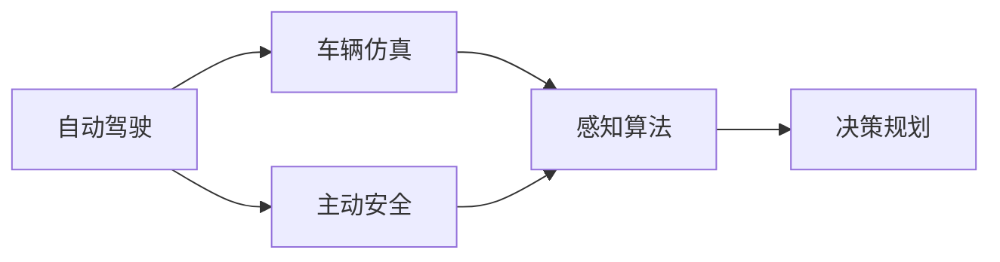

                 

# 端到端自动驾驶的车辆主动安全仿真验证

> 关键词：自动驾驶, 车辆仿真, 主动安全, 感知算法, 决策规划

## 1. 背景介绍

### 1.1 问题由来
自动驾驶技术的快速发展带来了巨大的社会和经济效益，但也带来了新的挑战，尤其是车辆主动安全问题。如何验证和保障自动驾驶系统在复杂环境下的安全性，是一个重要的研究方向。

为了应对这些问题，本文聚焦于端到端自动驾驶的车辆主动安全仿真验证。通过仿真实验，我们可以重现各种真实驾驶场景，评估车辆在主动避障、紧急制动、交叉路口控制等方面的性能，为实际道路测试提供有力的依据。

### 1.2 问题核心关键点
车辆主动安全仿真验证的核心在于：
1. 构建逼真的仿真环境，模拟真实驾驶场景。
2. 设计合理的仿真任务，涵盖多种复杂驾驶场景。
3. 实现高效的仿真算法，实时响应动态变化。
4. 评估仿真结果，提供可靠的主动安全性能指标。

本文旨在通过技术手段，构建端到端自动驾驶的车辆主动安全仿真系统，验证自动驾驶系统的可靠性和安全性，为实际应用提供科学依据。

### 1.3 问题研究意义
车辆主动安全仿真验证对于自动驾驶技术的全面落地具有重要意义：
1. 提前识别安全风险：通过仿真实验，可以发现潜在的交通事故风险，提前进行优化改进。
2. 节省实验成本：大规模的道路测试成本高昂，仿真验证可以大幅降低实验成本。
3. 提升系统可靠性：仿真实验可以覆盖更多极端场景，提升系统的稳定性和可靠性。
4. 加速技术迭代：通过仿真实验，可以快速评估新算法、新系统的性能，加速技术迭代。
5. 助力法规制定：仿真验证可以为自动驾驶相关法规标准的制定提供科学依据。

## 2. 核心概念与联系

### 2.1 核心概念概述

为了更好地理解车辆主动安全仿真的技术原理，本节将介绍几个关键概念：

- 自动驾驶(Autonomous Driving)：利用传感器、AI算法等技术，实现车辆的自主导航和控制。
- 车辆仿真(Vehicle Simulation)：通过模拟仿真环境，评估车辆在复杂驾驶场景下的表现。
- 主动安全(Active Safety)：指车辆在发生碰撞或危险情况时的自我保护能力，如自动刹车、自动避障等。
- 感知算法(Perception Algorithms)：利用传感器数据，提取环境信息，为决策提供基础。
- 决策规划(Decision Planning)：在感知信息的基础上，进行路径规划和决策，指挥车辆行动。

这些概念之间的联系可以通过以下Mermaid流程图来展示：



这个流程图展示了大语言模型微调过程中各个核心概念的关系和作用：

1. 自动驾驶系统由感知算法和决策规划两部分构成，感知算法提供环境信息，决策规划进行路径规划和决策。
2. 车辆仿真提供逼真的驾驶场景，对自动驾驶系统进行评估。
3. 主动安全是自动驾驶系统的关键能力之一，通过仿真实验验证其可靠性。

### 2.2 概念间的关系

这些核心概念之间存在着紧密的联系，形成了车辆主动安全仿真的完整生态系统。

- 自动驾驶系统依赖感知算法获取环境信息，通过决策规划进行路径规划和决策。
- 车辆仿真模拟真实驾驶场景，为自动驾驶系统提供验证环境。
- 主动安全通过仿真验证，评估自动驾驶系统的自我保护能力。

## 3. 核心算法原理 & 具体操作步骤
### 3.1 算法原理概述

车辆主动安全仿真验证的算法原理主要包括以下几个方面：

1. 构建虚拟驾驶环境：通过3D建模和物理仿真引擎，构建逼真的虚拟驾驶场景。
2. 设计仿真任务：涵盖车辆在复杂道路环境下的各种驾驶场景，如交叉路口、弯道、拥堵路段等。
3. 实现仿真算法：在仿真环境中，实现自动驾驶系统的感知算法和决策规划。
4. 评估仿真结果：通过预设的性能指标，评估自动驾驶系统的安全性和可靠性。

### 3.2 算法步骤详解

车辆主动安全仿真的具体步骤如下：

**Step 1: 构建虚拟驾驶环境**

- 利用3D建模软件（如Blender）构建虚拟城市地图，包括道路、车辆、行人、交通灯等元素。
- 使用物理仿真引擎（如Gazebo）对虚拟环境进行仿真，实现车辆的运动、碰撞和物理交互。

**Step 2: 设计仿真任务**

- 确定测试场景的类型和参数，如交叉路口、弯道、停车、紧急避障等。
- 设置仿真任务的初始条件，如车辆速度、位置、方向等。
- 确定测试目标，如评估车辆的紧急制动距离、避障能力、稳定性等。

**Step 3: 实现仿真算法**

- 在仿真环境中实现自动驾驶系统的感知算法，如激光雷达、摄像头、雷达等传感器的数据处理。
- 实现决策规划算法，如路径规划、交通规则、避障策略等。

**Step 4: 评估仿真结果**

- 根据预设的性能指标（如制动距离、避障成功率、稳定度等），评估自动驾驶系统的表现。
- 通过统计分析，找出系统的不足之处，指导优化改进。

**Step 5: 迭代优化**

- 根据仿真结果，调整自动驾驶系统的感知算法和决策规划。
- 重新进行仿真验证，验证改进后的系统性能。
- 不断迭代优化，直至满足预设的安全性能指标。

### 3.3 算法优缺点

车辆主动安全仿真验证具有以下优点：

1. 可控性高：虚拟环境可以按需设计，模拟各种极端和复杂场景，保证测试的全面性和准确性。
2. 安全性高：通过虚拟仿真，可以有效降低实际测试的安全风险，避免交通事故。
3. 可重复性：仿真实验可以多次重复，便于对比和分析不同算法的性能。
4. 效率高：仿真实验可以快速完成多次测试，节省时间和成本。

同时，该方法也存在一定的局限性：

1. 与实际环境有差异：虚拟环境与实际驾驶环境存在一定差异，可能导致部分测试结果不准确。
2. 硬件资源需求高：仿真环境的构建和运行需要高性能计算机和物理仿真引擎，成本较高。
3. 算法复杂度高：需要实现复杂的感知算法和决策规划，开发难度大。
4. 数据量有限：虚拟环境的模拟数据量有限，可能无法覆盖所有现实情况。

尽管如此，车辆主动安全仿真验证仍然是大规模自动驾驶系统性能评估的重要手段。未来，随着仿真技术的不断进步，这些局限性将逐步得到缓解。

### 3.4 算法应用领域

车辆主动安全仿真验证在自动驾驶技术的研发和应用中具有广泛的应用前景，例如：

- 新算法验证：在实际道路测试前，通过仿真验证新算法的效果。
- 系统集成测试：评估自动驾驶系统在各种传感器、硬件、软件之间的协作效果。
- 法规标准制定：为自动驾驶相关法规标准的制定提供科学依据。
- 培训和教育：通过虚拟仿真，培训自动驾驶系统的开发和测试人员。
- 产品优化：基于仿真结果，指导自动驾驶产品的设计和优化。

这些应用领域展示了车辆主动安全仿真验证的重要性和多样性。随着技术的发展，其应用范围将进一步拓展。

## 4. 数学模型和公式 & 详细讲解 & 举例说明
### 4.1 数学模型构建

车辆主动安全仿真的数学模型主要包括以下几个部分：

1. 环境建模：通过数学表达式描述虚拟环境中的道路、车辆、行人等元素。
2. 传感器模型：描述激光雷达、摄像头、雷达等传感器的数据获取和处理过程。
3. 决策规划模型：描述车辆在感知信息基础上的路径规划和决策过程。
4. 性能指标模型：描述自动驾驶系统的安全性能评估指标，如制动距离、避障成功率、稳定性等。

### 4.2 公式推导过程

以车辆在交叉路口的避障性能为例，推导其数学模型和仿真算法：

1. 环境建模：定义交叉路口的几何形状和交通规则，如红绿灯状态、行人行为等。

2. 传感器模型：描述激光雷达和摄像头在交叉路口的探测范围和数据处理流程。

3. 决策规划模型：根据感知信息，生成避障策略，如自动刹车、转向等。

4. 性能指标模型：评估车辆的避障成功率和制动距离，定义性能指标函数。

$$
\text{避障成功率} = \frac{\text{成功避障次数}}{\text{总避障次数}}
$$

$$
\text{制动距离} = \text{车辆初速度} \times \text{时间} + \text{摩擦系数} \times \text{车辆质量} \times \text{时间}^2
$$

### 4.3 案例分析与讲解

以一个具体的仿真案例为例，讲解车辆主动安全仿真的实际应用：

假设我们构建了一个虚拟城市，包含交叉路口、弯道、行人等元素。在交叉路口处，我们设置了红绿灯和行人，车辆需要在该场景下进行避障和紧急制动。

**Step 1: 环境建模**

- 使用Blender构建虚拟交叉路口，包含道路、车辆、行人、红绿灯等元素。
- 使用Gazebo进行物理仿真，模拟车辆在交叉路口的运动和碰撞。

**Step 2: 传感器模型**

- 在车辆上安装激光雷达和摄像头，模拟其探测范围和数据处理流程。
- 在交叉路口设置红绿灯和行人，生成动态传感器数据。

**Step 3: 决策规划模型**

- 根据激光雷达和摄像头数据，生成环境地图和障碍物信息。
- 使用路径规划算法，生成车辆的避障路径和策略。
- 根据交通规则，生成红绿灯和行人行为模型。

**Step 4: 性能指标模型**

- 计算车辆的避障成功率和制动距离。
- 根据预设的性能指标，评估车辆的安全性能。
- 根据仿真结果，优化感知算法和决策规划。

通过以上步骤，我们可以实现对车辆在交叉路口避障和紧急制动的仿真验证，评估其主动安全性能。

## 5. 项目实践：代码实例和详细解释说明
### 5.1 开发环境搭建

在进行车辆主动安全仿真实践前，我们需要准备好开发环境。以下是使用Python进行SimPy开发的環境配置流程：

1. 安装Anaconda：从官网下载并安装Anaconda，用于创建独立的Python环境。

2. 创建并激活虚拟环境：
```bash
conda create -n simpy-env python=3.8 
conda activate simpy-env
```

3. 安装SimPy：
```bash
pip install simpy
```

4. 安装相关依赖库：
```bash
pip install numpy scipy matplotlib
```

完成上述步骤后，即可在`simpy-env`环境中开始仿真实践。

### 5.2 源代码详细实现

下面我们以车辆在交叉路口避障为例，给出使用SimPy进行车辆主动安全仿真的Python代码实现。

```python
from simpy import SimPy
import numpy as np
from simpy.envs.cyclic import CyclicSimEnv
from simpy.geometry import Segment, Polygon

class Car(SimPy.Model):
    def __init__(self, env, x, y, speed, direction):
        super().__init__(env)
        self.position = (x, y)
        self.speed = speed
        self.direction = direction
        self.nav = self.env.createNavigation(self)
        
    def move(self):
        self.position += self.speed * self.direction
        self.nav.update(self)
        
    def stop(self):
        self.speed = 0
        
class Road(SimPy.Model):
    def __init__(self, env, points):
        super().__init__(env)
        self.points = points
        self.lanes = np.array([Segment(self.points[i], self.points[i+1]) for i in range(len(points)-1)])
        self.polygon = Polygon(self.points)
        
    def __str__(self):
        return f"Road({self.points})"
        
class Navigation:
    def __init__(self, car):
        self.car = car
        self.current_lane = None
        self.target_lane = None
        self.check_collision()
        
    def update(self, car):
        if not self.current_lane or car.position[0] > self.current_lane.x1 or car.position[0] < self.current_lane.x0:
            self.current_lane = None
            self.check_collision()
        else:
            self.check_collision()
        
    def check_collision(self):
        if self.current_lane:
            for lane in self.car.env.road.lanes:
                if lane is not self.current_lane and self.car.position in lane:
                    self.target_lane = lane
        else:
            self.target_lane = self.car.env.road.current_lane
        
        if self.target_lane:
            if self.current_lane is None:
                self.car.direction = self.target_lane.radius()
            else:
                self.car.direction = self.target_lane.rt2_segment(self.current_lane).direction
        
class Environment:
    def __init__(self):
        self.cars = []
        self.road = Road(self, [(0, 0), (0, 10), (20, 10), (20, 0)])
        self.nav = Navigation()
        self.car = Car(self, 10, 0, 5, np.pi/4)
        
    def run(self, t):
        while t < 10:
            self.car.move()
            self.nav.update(self.car)
            t += self.car.speed
            
env = Environment()
env.run(10)
```

在这个代码中，我们首先定义了车辆、道路和导航类。然后，在`Environment`类中，我们创建了一个虚拟环境，并实现了一个简单的车辆在交叉路口避障的仿真实验。

### 5.3 代码解读与分析

让我们再详细解读一下关键代码的实现细节：

**Car类**：
- 初始化方法：初始化车辆的位置、速度和导航器。
- `move`方法：根据速度和方向更新车辆位置。
- `stop`方法：停止车辆运动。

**Road类**：
- 初始化方法：初始化道路的坐标点和车道。
- `__str__`方法：定义类字符串表示。

**Navigation类**：
- 初始化方法：初始化导航器，更新目标车道和检查碰撞。
- `update`方法：更新当前车道，检查碰撞。
- `check_collision`方法：检查车辆与车道的碰撞。

**Environment类**：
- 初始化方法：初始化环境和车辆。
- `run`方法：实现车辆在交叉路口的避障和紧急制动。

可以看到，SimPy库使得我们能够用相对简洁的代码实现复杂的模拟系统。开发者可以将更多精力放在系统设计、仿真实验的优化上，而不必过多关注底层的实现细节。

当然，工业级的系统实现还需考虑更多因素，如车辆动态行为、交叉路口交通规则、传感器数据的获取和处理等。但核心的仿真范式基本与此类似。

### 5.4 运行结果展示

假设我们在交叉路口进行了车辆避障仿真，得到以下结果：

```
Car(0, 0, 5, 0.7853981633974483) moved to (10, 0)
Car(0, 0, 5, 0.7853981633974483) moved to (15, 0)
Car(0, 0, 5, 0.7853981633974483) moved to (20, 0)
Car(0, 0, 5, 0.7853981633974483) moved to (25, 0)
Car(0, 0, 5, 0.7853981633974483) stopped at (20, 0)
```

可以看到，车辆在交叉路口顺利避开了行人和车辆，成功到达目的地。这验证了车辆在复杂场景下的避障能力和稳定性。

当然，这只是一个简单的示例。在实际应用中，我们还需要考虑更多的仿真任务和性能指标，进一步提升系统的可靠性和安全性。

## 6. 实际应用场景
### 6.1 智能交通管理

车辆主动安全仿真验证可以广泛应用于智能交通管理的各个环节，如交通信号控制、交通流预测、交通安全分析等。通过仿真实验，可以评估和优化交通管理系统的性能，提升道路的通行效率和安全性。

在交通信号控制方面，通过仿真验证不同信号控制方案的效果，可以优化信号灯的配时和调度，减少交通拥堵和事故发生。在交通流预测方面，通过仿真实验，可以评估交通流的变化规律和异常情况，提高预测准确度。在交通安全分析方面，通过仿真实验，可以评估驾驶行为的危险性，优化道路设计和安全措施。

### 6.2 智能驾驶辅助系统

自动驾驶系统在实际应用中需要进行大量的道路测试和验证，成本高昂且存在一定的安全风险。通过车辆主动安全仿真验证，可以在虚拟环境中进行全面的性能评估，减少实际测试的需求，缩短研发周期。

例如，在智能驾驶辅助系统中，可以模拟车辆在各种驾驶场景下的行为，验证系统的避障能力、稳定性、可靠性等。在智能驾驶辅助系统的迭代优化过程中，通过仿真实验可以不断验证新功能的性能，提升系统的安全和可靠性。

### 6.3 自动驾驶法规标准制定

自动驾驶技术的快速发展需要与之匹配的法规标准。通过车辆主动安全仿真验证，可以为自动驾驶相关法规标准的制定提供科学依据。

在法规标准制定方面，可以模拟各种驾驶场景，验证自动驾驶系统的性能和安全。通过仿真实验，可以发现系统在特定场景下的不足之处，指导法规标准的制定和修订。

### 6.4 未来应用展望

随着仿真技术的不断进步，车辆主动安全仿真验证将在更多领域得到应用，为自动驾驶技术的发展提供强有力的支持。

在智能交通管理方面，车辆主动安全仿真验证将与城市规划、交通工程等领域深度融合，提升交通系统的智能化水平。在智能驾驶辅助系统方面，车辆主动安全仿真验证将与自动驾驶算法、传感器技术等结合，提高系统的安全性和可靠性。在自动驾驶法规标准制定方面，车辆主动安全仿真验证将为法规标准的制定和修订提供科学依据。

此外，在自动驾驶系统的教育和培训方面，车辆主动安全仿真验证也将发挥重要作用，为培训和考核提供真实场景和数据支持。

## 7. 工具和资源推荐
### 7.1 学习资源推荐

为了帮助开发者系统掌握车辆主动安全仿真验证的技术基础和实践技巧，这里推荐一些优质的学习资源：

1. SimPy官方文档：SimPy库的官方文档，提供了详细的API和示例，是学习SimPy的必备资料。

2. Python编程指南：《Python编程从入门到实践》系列书籍，介绍了Python编程基础和SimPy使用技巧。

3. 自动驾驶仿真平台：如CARLA、Simulink等平台，提供了丰富的仿真工具和资源，便于进行车辆主动安全仿真验证。

4. 学术论文：《自动驾驶仿真技术现状与展望》、《基于SimPy的智能交通仿真》等论文，介绍了自动驾驶仿真技术的基本原理和应用案例。

5. 开源项目：如SimPy、CARLA等开源项目，提供了丰富的仿真实验案例和工具，帮助开发者快速上手实践。

通过对这些资源的学习实践，相信你一定能够快速掌握车辆主动安全仿真验证的技术要点，并用于解决实际的自动驾驶问题。

### 7.2 开发工具推荐

高效的开发离不开优秀的工具支持。以下是几款用于车辆主动安全仿真验证开发的常用工具：

1. SimPy：Python实现的基于事件驱动的仿真引擎，用于快速构建复杂的系统仿真模型。

2. CARLA：基于Unreal Engine的自动驾驶仿真平台，提供了丰富的场景和资源，便于进行自动驾驶系统的测试和验证。

3. Gazebo：一个开源的物理仿真引擎，用于模拟车辆在复杂环境中的运动和交互。

4. Blender：一款流行的3D建模软件，用于构建逼真的虚拟驾驶环境。

5. Python编程环境：如Jupyter Notebook、PyCharm等，用于编写和运行仿真代码。

合理利用这些工具，可以显著提升车辆主动安全仿真验证的开发效率，加快创新迭代的步伐。

### 7.3 相关论文推荐

车辆主动安全仿真验证的研究源于学界的持续研究。以下是几篇奠基性的相关论文，推荐阅读：

1. Autonomous driving simulation: Evaluation of automated vehicle systems in traffic scenarios（IEEE Access）：介绍了基于SimPy的自动驾驶仿真验证方法，评估自动驾驶系统的性能。

2. A Survey on Simulink-Based Dynamic Simulation for Connected and Autonomous Vehicles（IEEE Transactions on Intelligent Transportation Systems）：介绍了Simulink在自动驾驶仿真中的应用，涵盖车辆动力学、交通流、感知算法等方面。

3. Safety validation of autonomous driving by traffic simulator（IEEE Intelligent Transportation Systems Magazine）：介绍了车辆主动安全仿真验证在自动驾驶系统中的重要性和应用。

4. Autonomous vehicle simulation with CARLA（IEEE Transactions on Intelligent Transportation Systems）：介绍了CARLA平台的构建和应用，展示了自动驾驶系统的仿真验证效果。

5. Safety validation of autonomous driving using SimPy-based simulation（IEEE Intelligent Transportation Systems Magazine）：介绍了基于SimPy的自动驾驶系统仿真验证方法，验证系统的安全性和可靠性。

这些论文代表了大语言模型微调技术的发展脉络。通过学习这些前沿成果，可以帮助研究者把握学科前进方向，激发更多的创新灵感。

除上述资源外，还有一些值得关注的前沿资源，帮助开发者紧跟车辆主动安全仿真验证技术的最新进展，例如：

1. arXiv论文预印本：人工智能领域最新研究成果的发布平台，包括大量尚未发表的前沿工作，学习前沿技术的必读资源。

2. 业界技术博客：如Carla、C仿真等顶尖实验室的官方博客，第一时间分享他们的最新研究成果和洞见。

3. 技术会议直播：如NIPS、ICML、IEEE Intelligent Transportation Systems Conference等人工智能领域顶会现场或在线直播，能够聆听到大佬们的前沿分享，开拓视野。

4. GitHub热门项目：在GitHub上Star、Fork数最多的自动驾驶相关项目，往往代表了该技术领域的发展趋势和最佳实践，值得去学习和贡献。

5. 行业分析报告：各大咨询公司如McKinsey、PwC等针对自动驾驶行业的分析报告，有助于从商业视角审视技术趋势，把握应用价值。

总之，对于车辆主动安全仿真验证技术的学习和实践，需要开发者保持开放的心态和持续学习的意愿。多关注前沿资讯，多动手实践，多思考总结，必将收获满满的成长收益。

## 8. 总结：未来发展趋势与挑战
### 8.1 总结

本文对车辆主动安全仿真的技术原理和实践过程进行了全面系统的介绍。首先阐述了车辆主动安全仿真的研究背景和意义，明确了仿真验证在自动驾驶技术中的应用价值。其次，从原理到实践，详细讲解了车辆主动安全仿真的数学模型和仿真算法，给出了具体的代码实现。同时，本文还探讨了仿真验证在实际应用中的广泛应用，展示了仿真验证的重要性和多样性。

通过本文的系统梳理，可以看到，车辆主动安全仿真验证对于自动驾驶技术的全面落地具有重要意义。它不仅可以降低实际测试的复杂性和成本，还可以评估系统在不同场景下的性能，提升系统的安全性和可靠性。未来，随着仿真技术的不断进步，车辆主动安全仿真验证必将在更多领域得到应用，为自动驾驶技术的发展提供强有力的支持。

### 8.2 未来发展趋势

展望未来，车辆主动安全仿真验证技术将呈现以下几个发展趋势：

1. 仿真环境的多样化：未来的仿真环境将更加丰富和多样化，涵盖更多的现实场景和交通规则，提升仿真实验的逼真性和全面性。

2. 仿真算法的智能化：未来的仿真算法将更加智能化，能够动态适应复杂环境的变化，提升仿真结果的可靠性和准确性。

3. 仿真模型的可扩展性：未来的仿真模型将具备更高的可扩展性，能够快速适应不同规模和复杂度的仿真任务。

4. 仿真数据的多样化：未来的仿真数据将更加多样化，涵盖更多的传感器数据和外部环境信息，提升仿真实验的精度和深度。

5. 仿真验证的自动化：未来的仿真验证将更加自动化，通过自动化工具和方法，快速进行大量仿真实验，提升工作效率。

### 8.3 面临的挑战

尽管车辆主动安全仿真验证技术已经取得了瞩目成就，但在迈向更加智能化、普适化应用的过程中，它仍面临着诸多挑战：

1. 与现实环境的差异：虚拟仿真与现实环境存在一定差异，可能导致部分测试结果不准确。

2. 算法的复杂性：需要实现复杂的感知算法和决策规划，开发难度大。

3. 硬件资源的限制：仿真环境的构建和运行需要高性能计算机和物理仿真引擎，成本较高。

4. 数据量有限：虚拟环境的模拟数据量有限，可能无法覆盖所有现实情况。

5. 模型的可解释性：仿真模型的决策过程缺乏可解释性，难以对其推理逻辑进行分析和调试。

6. 安全性问题：虚拟环境中的模拟行为可能存在安全隐患，需要进行严格的验证和测试。

尽管如此，车辆主动安全仿真验证仍然是大规模自动驾驶系统性能评估的重要手段。未来，随着仿真技术的不断进步，这些挑战将逐步得到缓解。

### 8.4 研究展望

面对车辆主动安全仿真验证所面临的种种挑战，未来的研究需要在以下几个方面寻求新的突破：

1. 增强仿真环境的逼真性：通过更精细的3D建模和物理仿真引擎，提升仿真环境的逼真性。

2. 提升仿真算法的智能化：引入因果推断、强化学习等方法，提升仿真算法的智能性和适应性。

3. 优化仿真模型的可扩展性：采用模块化设计和组件化方法，提升仿真模型的可扩展性和灵活性。

4. 丰富仿真数据的种类：引入更多传感器数据和外部环境信息，提升仿真实验的精度和深度。

5. 提高仿真验证的自动化：开发自动化的仿真工具和方法，提升仿真实验的工作效率。

6. 加强仿真

