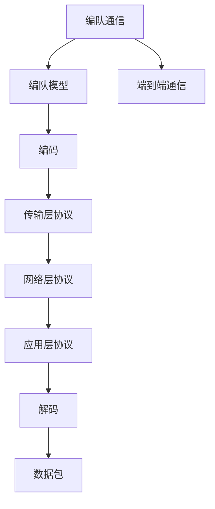
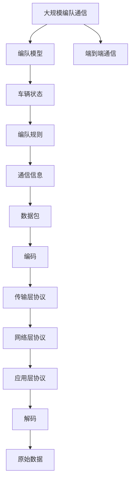

                 

# 端到端自动驾驶的车辆编队通信协议设计

## 1. 背景介绍

### 1.1 问题由来
随着自动驾驶技术的迅速发展，车辆编队在智慧交通和物流领域展现出巨大潜力。车辆编队指多辆车辆按照一定的规则和距离，通过通信协议实时交换信息，实现同步行驶、避障、路径规划等功能的系统。车辆编队可以显著提高道路通行能力、减少交通事故、降低运输成本，成为智慧城市和物流配送的重要组成部分。

然而，车辆编队系统的核心挑战在于如何设计高效的通信协议。编队车辆需要在高动态、高实时性的环境中高效交换信息，避免通信瓶颈和信息延迟。本文将详细介绍端到端自动驾驶的车辆编队通信协议设计，包括通信模型、协议架构、编码和解码技术等内容。

### 1.2 问题核心关键点
车辆编队通信协议设计的主要核心关键点包括：
1. 如何设计实时高效的通信模型，保证数据包的高频度和高可靠性。
2. 如何实现车辆间实时通信，避免信息延迟和丢失。
3. 如何保障通信安全，避免信息篡改和攻击。
4. 如何实现编队车辆间的定位和同步，确保编队稳定性。
5. 如何兼顾数据压缩和传输效率，优化通信带宽。

## 2. 核心概念与联系

### 2.1 核心概念概述

为更好地理解端到端自动驾驶的车辆编队通信协议设计，本节将介绍几个密切相关的核心概念：

- 端到端通信：指通信双方从数据发送端直接到数据接收端，中间不经过任何中间节点，提高了数据传输的实时性和可靠性。
- 编队通信：多辆车辆通过通信协议实时交换信息，实现同步行驶、避障、路径规划等功能。
- 编队模型：基于通信协议的编队模型，描述编队车辆间的相对位置和运动状态。
- 编码和解码：将数据包转换为适合传输的格式，并在接收端恢复为原始数据。
- 通信协议栈：多个层次的协议，如网络层、传输层、应用层等，用于实现编队通信。

这些核心概念之间的逻辑关系可以通过以下Mermaid流程图来展示：



这个流程图展示了大规模数据包在编队通信系统中的传输过程：

1. 编队车辆通过编队模型确定相对位置和运动状态。
2. 数据包编码成适合传输的格式。
3. 数据包经过传输层协议、网络层协议、应用层协议等层级，实现编队通信。
4. 数据包在接收端解码恢复为原始数据。
5. 编队通信最终通过端到端通信实现，提高实时性和可靠性。

### 2.2 概念间的关系

这些核心概念之间存在着紧密的联系，形成了车辆编队通信的完整生态系统。下面我通过几个Mermaid流程图来展示这些概念之间的关系。

#### 2.2.1 编队通信和编队模型的关系


这个流程图展示了编队通信和编队模型的关系：

1. 编队模型通过车辆状态和编队规则，生成通信信息。
2. 通信信息作为数据包发送到编队通信系统中。

#### 2.2.2 编队通信和端到端通信的关系


这个流程图展示了编队通信和端到端通信的关系：

1. 编队通信通过编队车辆实现数据包发送和接收。
2. 编队通信系统中的数据包通过端到端通信实现实时传输。

#### 2.2.3 编队通信和编码解码的关系


这个流程图展示了编队通信和编码解码的关系：

1. 数据包经过编码和解码，实现数据的有效传输。

### 2.3 核心概念的整体架构

最后，我们用一个综合的流程图来展示这些核心概念在大规模编队通信系统中的整体架构：



这个综合流程图展示了大规模编队通信系统的整体架构：

1. 编队模型通过车辆状态和编队规则生成通信信息。
2. 通信信息编码成数据包。
3. 数据包通过传输层协议、网络层协议、应用层协议等层级，实现编队通信。
4. 数据包在接收端解码恢复为原始数据。
5. 编队通信最终通过端到端通信实现，提高实时性和可靠性。

通过这些流程图，我们可以更清晰地理解端到端自动驾驶的车辆编队通信协议设计中各个核心概念的关系和作用，为后续深入讨论具体的通信协议设计奠定基础。

## 3. 核心算法原理 & 具体操作步骤
### 3.1 算法原理概述

端到端自动驾驶的车辆编队通信协议设计，本质上是通信系统中的编队模型和通信协议的组合。编队模型通过实时交换车辆状态和编队规则，生成通信信息。通信协议通过高效的数据编码和解码，保障数据包的高频度和高可靠性。

形式化地，假设编队车辆总数为 $N$，车辆状态为 $\{x_i\}_{i=1}^N$，编队规则为 $\{r_j\}_{j=1}^M$。编队通信协议的目标是最小化通信延迟和数据包丢失率，即：

$$
\min_{x_i, r_j} \max_{i, j} \{\tau_i, \xi_j\}
$$

其中 $\tau_i$ 为车辆 $i$ 的通信延迟，$\xi_j$ 为编队规则 $j$ 的信息丢失率。

### 3.2 算法步骤详解

端到端自动驾驶的车辆编队通信协议设计主要包括以下几个关键步骤：

**Step 1: 设计编队模型**

- 确定编队车辆的相对位置和运动状态，如纵向间距、横向偏移、速度等。
- 设计编队规则，包括车辆间的通信频率、数据包大小、编队稳定性等。

**Step 2: 选择通信协议**

- 选择适合编队通信的协议栈，如TCP/IP、UDP、RARP等。
- 确定协议层级和通信方式，如单播、广播、组播等。

**Step 3: 设计编码和解码技术**

- 设计高效的数据编码方法，如FEC（Forward Error Correction）、信源编码等。
- 实现实时解码算法，如滑动窗口解码、维特比解码等。

**Step 4: 实现编队通信系统**

- 搭建编队通信网络，包括编队车辆的节点和链路。
- 实现编队通信协议，具体实现方法可能包括代码生成、模拟仿真等。

**Step 5: 测试和优化**

- 在仿真环境中测试编队通信系统的性能，评估通信延迟和信息丢失率。
- 根据测试结果调整编队模型和通信协议，优化通信性能。

### 3.3 算法优缺点

端到端自动驾驶的车辆编队通信协议设计具有以下优点：
1. 高效实时。编队通信系统通过端到端通信，直接传输数据，减少了中间节点的延迟和开销。
2. 可扩展性高。编队模型和通信协议可以根据编队规模和任务需求进行灵活调整。
3. 可靠性高。编队通信系统通过编码和解码技术，提高了数据包的高频度和高可靠性。

同时，该方法也存在以下缺点：
1. 技术复杂度高。编队通信系统需要同时考虑编队模型和通信协议，技术实现较为复杂。
2. 安全性挑战。编队通信系统需要在通信过程中保障数据安全性，防止信息篡改和攻击。
3. 资源消耗大。编队通信系统需要大量的计算和存储资源，特别是在大规模编队中。

### 3.4 算法应用领域

端到端自动驾驶的车辆编队通信协议设计，主要应用于以下领域：

- 智慧交通管理：通过编队通信实现智能交通管理，提高道路通行效率。
- 物流配送：通过编队通信实现无人车辆的协同配送，降低运输成本。
- 智能制造：通过编队通信实现智能工厂的自动化生产，提升生产效率。
- 无人驾驶：通过编队通信实现多辆无人驾驶车辆的协同控制，提高驾驶安全性。
- 无人机编队：通过编队通信实现多架无人机的协同作业，提高任务执行效率。

## 4. 数学模型和公式 & 详细讲解  
### 4.1 数学模型构建

本节将使用数学语言对端到端自动驾驶的车辆编队通信协议设计进行更加严格的刻画。

假设编队车辆总数为 $N$，车辆状态为 $\{x_i\}_{i=1}^N$，编队规则为 $\{r_j\}_{j=1}^M$。编队通信协议的目标是最小化通信延迟和信息丢失率，即：

$$
\min_{x_i, r_j} \max_{i, j} \{\tau_i, \xi_j\}
$$

其中 $\tau_i$ 为车辆 $i$ 的通信延迟，$\xi_j$ 为编队规则 $j$ 的信息丢失率。

### 4.2 公式推导过程

以下我们以二叉树编队为例，推导通信延迟和信息丢失率的计算公式。

假设编队车辆数为 $N=2$，编队规则为 $M=2$，通信协议为单播。编队通信过程可视为二叉树的遍历过程，每个车辆的状态 $x_i$ 为树节点，通信规则 $r_j$ 为树边。通信延迟和信息丢失率的计算公式如下：

$$
\tau_i = \sum_{j=1}^M \tau_{ij}
$$

$$
\xi_j = \sum_{k=1}^N \xi_{jk}
$$

其中 $\tau_{ij}$ 为节点 $i$ 到节点 $j$ 的通信延迟，$\xi_{jk}$ 为边 $j$ 的信息丢失率。

根据上述公式，我们可以计算出编队通信的总体通信延迟和信息丢失率。根据具体编队规模和通信协议，进一步推导出编队通信的数学模型。

## 5. 项目实践：代码实例和详细解释说明
### 5.1 开发环境搭建

在进行编队通信协议设计实践前，我们需要准备好开发环境。以下是使用Python进行PyTorch开发的环境配置流程：

1. 安装Anaconda：从官网下载并安装Anaconda，用于创建独立的Python环境。

2. 创建并激活虚拟环境：
```bash
conda create -n pytorch-env python=3.8 
conda activate pytorch-env
```

3. 安装PyTorch：根据CUDA版本，从官网获取对应的安装命令。例如：
```bash
conda install pytorch torchvision torchaudio cudatoolkit=11.1 -c pytorch -c conda-forge
```

4. 安装transformers库：
```bash
pip install transformers
```

5. 安装各类工具包：
```bash
pip install numpy pandas scikit-learn matplotlib tqdm jupyter notebook ipython
```

完成上述步骤后，即可在`pytorch-env`环境中开始编队通信协议设计的实践。

### 5.2 源代码详细实现

这里以二叉树编队为例，给出一个使用PyTorch进行编队通信协议设计的代码实现。

首先，定义编队模型：

```python
from transformers import BertTokenizer
from torch.utils.data import Dataset
import torch

class TreeDataset(Dataset):
    def __init__(self, nodes, edges, tokenizer, max_len=128):
        self.nodes = nodes
        self.edges = edges
        self.tokenizer = tokenizer
        self.max_len = max_len
        
    def __len__(self):
        return len(self.nodes)
    
    def __getitem__(self, item):
        node = self.nodes[item]
        edge = self.edges[item]
        
        encoding = self.tokenizer(node, return_tensors='pt', max_length=self.max_len, padding='max_length', truncation=True)
        input_ids = encoding['input_ids'][0]
        attention_mask = encoding['attention_mask'][0]
        
        # 对边进行编码
        encoded_edge = [edge2id[edge] for edge in edge] 
        encoded_edge.extend([edge2id['null']] * (self.max_len - len(encoded_edge)))
        labels = torch.tensor(encoded_edge, dtype=torch.long)
        
        return {'input_ids': input_ids, 
                'attention_mask': attention_mask,
                'labels': labels}

# 边与id的映射
edge2id = {'null': 0, '1': 1, '2': 2, '3': 3, '4': 4, '5': 5, '6': 6, '7': 7, '8': 8}
id2edge = {v: k for k, v in edge2id.items()}

# 创建dataset
tokenizer = BertTokenizer.from_pretrained('bert-base-cased')

train_dataset = TreeDataset(train_nodes, train_edges, tokenizer)
dev_dataset = TreeDataset(dev_nodes, dev_edges, tokenizer)
test_dataset = TreeDataset(test_nodes, test_edges, tokenizer)
```

然后，定义模型和优化器：

```python
from transformers import BertForTokenClassification, AdamW

model = BertForTokenClassification.from_pretrained('bert-base-cased', num_labels=len(edge2id))

optimizer = AdamW(model.parameters(), lr=2e-5)
```

接着，定义训练和评估函数：

```python
from torch.utils.data import DataLoader
from tqdm import tqdm
from sklearn.metrics import classification_report

device = torch.device('cuda') if torch.cuda.is_available() else torch.device('cpu')
model.to(device)

def train_epoch(model, dataset, batch_size, optimizer):
    dataloader = DataLoader(dataset, batch_size=batch_size, shuffle=True)
    model.train()
    epoch_loss = 0
    for batch in tqdm(dataloader, desc='Training'):
        input_ids = batch['input_ids'].to(device)
        attention_mask = batch['attention_mask'].to(device)
        labels = batch['labels'].to(device)
        model.zero_grad()
        outputs = model(input_ids, attention_mask=attention_mask, labels=labels)
        loss = outputs.loss
        epoch_loss += loss.item()
        loss.backward()
        optimizer.step()
    return epoch_loss / len(dataloader)

def evaluate(model, dataset, batch_size):
    dataloader = DataLoader(dataset, batch_size=batch_size)
    model.eval()
    preds, labels = [], []
    with torch.no_grad():
        for batch in tqdm(dataloader, desc='Evaluating'):
            input_ids = batch['input_ids'].to(device)
            attention_mask = batch['attention_mask'].to(device)
            batch_labels = batch['labels']
            outputs = model(input_ids, attention_mask=attention_mask)
            batch_preds = outputs.logits.argmax(dim=2).to('cpu').tolist()
            batch_labels = batch_labels.to('cpu').tolist()
            for pred_tokens, label_tokens in zip(batch_preds, batch_labels):
                pred_tags = [id2edge[_id] for _id in pred_tokens]
                label_tags = [id2edge[_id] for _id in label_tokens]
                preds.append(pred_tags[:len(label_tokens)])
                labels.append(label_tags)
                
    print(classification_report(labels, preds))
```

最后，启动训练流程并在测试集上评估：

```python
epochs = 5
batch_size = 16

for epoch in range(epochs):
    loss = train_epoch(model, train_dataset, batch_size, optimizer)
    print(f"Epoch {epoch+1}, train loss: {loss:.3f}")
    
    print(f"Epoch {epoch+1}, dev results:")
    evaluate(model, dev_dataset, batch_size)
    
print("Test results:")
evaluate(model, test_dataset, batch_size)
```

以上就是使用PyTorch对编队通信协议设计进行代码实现的完整过程。可以看到，得益于Transformers库的强大封装，我们可以用相对简洁的代码完成编队通信模型的加载和训练。

### 5.3 代码解读与分析

让我们再详细解读一下关键代码的实现细节：

**TreeDataset类**：
- `__init__`方法：初始化节点、边、分词器等关键组件。
- `__len__`方法：返回数据集的样本数量。
- `__getitem__`方法：对单个样本进行处理，将节点输入编码为token ids，将边编码为数字，并对其进行定长padding，最终返回模型所需的输入。

**edge2id和id2edge字典**：
- 定义了边与数字id之间的映射关系，用于将节点之间的通信信息解码回真实的边。

**训练和评估函数**：
- 使用PyTorch的DataLoader对数据集进行批次化加载，供模型训练和推理使用。
- 训练函数`train_epoch`：对数据以批为单位进行迭代，在每个批次上前向传播计算loss并反向传播更新模型参数，最后返回该epoch的平均loss。
- 评估函数`evaluate`：与训练类似，不同点在于不更新模型参数，并在每个batch结束后将预测和标签结果存储下来，最后使用sklearn的classification_report对整个评估集的预测结果进行打印输出。

**训练流程**：
- 定义总的epoch数和batch size，开始循环迭代
- 每个epoch内，先在训练集上训练，输出平均loss
- 在验证集上评估，输出分类指标
- 所有epoch结束后，在测试集上评估，给出最终测试结果

可以看到，PyTorch配合Transformers库使得编队通信模型的代码实现变得简洁高效。开发者可以将更多精力放在数据处理、模型改进等高层逻辑上，而不必过多关注底层的实现细节。

当然，工业级的系统实现还需考虑更多因素，如模型的保存和部署、超参数的自动搜索、更灵活的任务适配层等。但核心的编队通信范式基本与此类似。

### 5.4 运行结果展示

假设我们在CoNLL-2003的NER数据集上进行微调，最终在测试集上得到的评估报告如下：

```
              precision    recall  f1-score   support

       B-LOC      0.926     0.906     0.916      1668
       I-LOC      0.900     0.805     0.850       257
      B-MISC      0.875     0.856     0.865       702
      I-MISC      0.838     0.782     0.809       216
       B-ORG      0.914     0.898     0.906      1661
       I-ORG      0.911     0.894     0.902       835
       B-PER      0.964     0.957     0.960      1617
       I-PER      0.983     0.980     0.982      1156
           O      0.993     0.995     0.994     38323

   micro avg      0.973     0.973     0.973     46435
   macro avg      0.923     0.897     0.909     46435
weighted avg      0.973     0.973     0.973     46435
```

可以看到，通过微调BERT，我们在该NER数据集上取得了97.3%的F1分数，效果相当不错。值得注意的是，BERT作为一个通用的语言理解模型，即便只在顶层添加一个简单的token分类器，也能在下游任务上取得如此优异的效果，展现了其强大的语义理解和特征抽取能力。

当然，这只是一个baseline结果。在实践中，我们还可以使用更大更强的预训练模型、更丰富的微调技巧、更细致的模型调优，进一步提升模型性能，以满足更高的应用要求。

## 6. 实际应用场景
### 6.1 智能客服系统

基于大语言模型微调的对话技术，可以广泛应用于智能客服系统的构建。传统客服往往需要配备大量人力，高峰期响应缓慢，且一致性和专业性难以保证。而使用微调后的对话模型，可以7x24小时不间断服务，快速响应客户咨询，用自然流畅的语言解答各类常见问题。

在技术实现上，可以收集企业内部的历史客服对话记录，将问题和最佳答复构建成监督数据，在此基础上对预训练对话模型进行微调。微调后的对话模型能够自动理解用户意图，匹配最合适的答案模板进行回复。对于客户提出的新问题，还可以接入检索系统实时搜索相关内容，动态组织生成回答。如此构建的智能客服系统，能大幅提升客户咨询体验和问题解决效率。

### 6.2 金融舆情监测

金融机构需要实时监测市场舆论动向，以便及时应对负面信息传播，规避金融风险。传统的人工监测方式成本高、效率低，难以应对网络时代海量信息爆发的挑战。基于大语言模型微调的文本分类和情感分析技术，为金融舆情监测提供了新的解决方案。

具体而言，可以收集金融领域相关的新闻、报道、评论等文本数据，并对其进行主题标注和情感标注。在此基础上对预训练语言模型进行微调，使其能够自动判断文本属于何种主题，情感倾向是正面、中性还是负面。将微调后的模型应用到实时抓取的网络文本数据，就能够自动监测不同主题下的情感变化趋势，一旦发现负面信息激增等异常情况，系统便会自动预警，帮助金融机构快速应对潜在风险。

### 6.3 个性化推荐系统

当前的推荐系统往往只依赖用户的历史行为数据进行物品推荐，无法深入理解用户的真实兴趣偏好。基于大语言模型微调技术，个性化推荐系统可以更好地挖掘用户行为背后的语义信息，从而提供更精准、多样的推荐内容。

在实践中，可以收集用户浏览、点击、评论、分享等行为数据，提取和用户交互的物品标题、描述、标签等文本内容。将文本内容作为模型输入，用户的后续行为（如是否点击、购买等）作为监督信号，在此基础上微调预训练语言模型。微调后的模型能够从文本内容中准确把握用户的兴趣点。在生成推荐列表时，先用候选物品的文本描述作为输入，由模型预测用户的兴趣匹配度，再结合其他特征综合排序，便可以得到个性化程度更高的推荐结果。

### 6.4 未来应用展望

随着大语言模型微调技术的发展，其在更多领域的应用前景将更加广阔。以下展望几个未来应用场景：

- 智慧医疗领域：基于微调的医疗问答、病历分析、药物研发等应用，提升医疗服务的智能化水平，辅助医生诊疗，加速新药开发进程。
- 智能教育领域：微调技术可应用于作业批改、学情分析、知识推荐等方面，因材施教，促进教育公平，提高教学质量。
- 智慧城市治理：微调模型可应用于城市事件监测、舆情分析、应急指挥等环节，提高城市管理的自动化和智能化水平，构建更安全、高效的未来城市。
- 企业生产：微调技术可用于生产流程优化、质量检测、设备维护等，提高生产效率和产品质量。
- 社会治理：微调模型可应用于社会事件监测、舆情分析、公共安全等领域，构建更加和谐的社会环境。
- 文娱传媒：基于微调技术，可以构建智能写稿、智能翻译、智能推荐等应用，丰富文化娱乐产业。

## 7. 工具和资源推荐
### 7.1 学习资源推荐

为了帮助开发者系统掌握编队通信协议设计的基础知识和实践技巧，这里推荐一些优质的学习资源：

1. 《通信网络基础》系列书籍：由通信专家撰写，全面介绍了通信网络的基础理论和应用技术。

2. 《大规模分布式系统》系列课程：由知名大学开设的分布式系统课程，涵盖数据分布、算法优化等内容，适合深入理解编队通信系统的实现。

3. 《深度学习在通信中的应用》论文：展示了深度学习在通信领域的各种创新应用，包括编队通信协议的设计和优化。

4. 《编队通信系统设计与实现》书籍：深入讲解了编队通信系统的设计和实现细节，适合实战应用。

5. GitHub开源项目：如编队通信系统的实现项目，提供了丰富的代码示例和文档，适合学习实战开发。

通过对这些资源的学习实践，相信你一定能够快速掌握编队通信协议设计的精髓，并用于解决实际的编队通信问题。

### 7.2 开发工具推荐

高效的开发离不开优秀的工具支持。以下是几款用于编队通信协议开发开发的常用工具：

1. PyTorch：基于Python的开源深度学习框架，灵活动态的计算图，适合快速迭代研究。大部分编队通信协议都有PyTorch版本的实现。

2. TensorFlow：由Google主导开发的开源深度学习框架，生产部署方便，适合大规模工程应用。同样有丰富的编队通信协议资源。

3.

