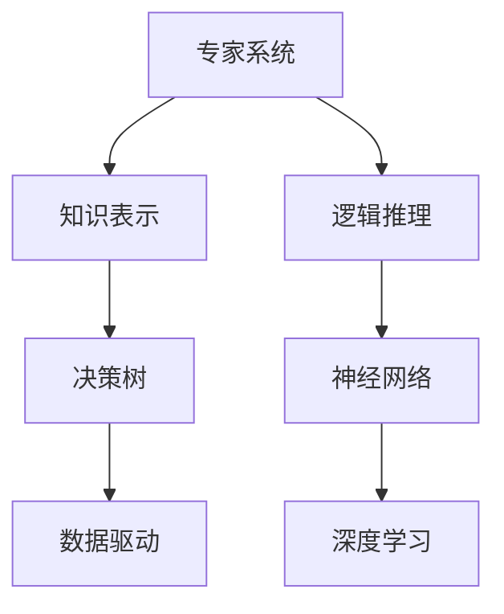

                 

# 第一代人工智能的目标与缺陷

> 关键词：人工智能, 早期目标, 算法缺陷, 数据局限, 应用挑战, 技术革新

## 1. 背景介绍

### 1.1 问题由来
在人工智能（AI）领域，第一代人工智能（AI 1.0）通常指的是那些基于规则和符号逻辑的系统，其目标是创建能够模仿人类智能的机器。这些系统的早期目标在于解决特定的、结构化的任务，如专家系统和逻辑推理引擎。然而，随着时间的推移，随着数据驱动学习和深度学习的兴起，AI 1.0 逐渐被更先进的 AI 2.0 模型所取代。尽管如此，理解第一代人工智能的目标与缺陷仍对今天的AI发展具有重要意义。

### 1.2 问题核心关键点
第一代人工智能的核心目标在于创建能够执行特定任务的系统，这些任务通常需要明确的知识和规则。早期的AI模型往往依赖于专家知识库，并通过符号逻辑和规则来解决问题。然而，这些系统的缺陷也随着技术的发展逐渐显现，包括算法复杂性高、数据需求量大、泛化能力弱等问题。

## 2. 核心概念与联系

### 2.1 核心概念概述

- **专家系统**：基于规则和知识库的系统，通过匹配规则和事实来推导结论。
- **逻辑推理**：利用逻辑规则和推理引擎进行决策和判断。
- **知识表示**：将知识编码成机器可理解的形式，如生产规则和事实库。
- **决策树**：一种基于树形结构的算法，用于分类和预测。
- **神经网络**：一种受生物神经网络启发，通过训练模型参数进行预测的算法。

这些概念构成了第一代人工智能的基础，但其核心在于“知识”的获取和应用。由于数据和算法的限制，第一代AI系统往往难以处理复杂、多变和不确定性的问题。

### 2.2 概念间的关系

通过以下Mermaid流程图展示这些概念之间的联系：



这个流程图展示了从基于规则的系统（A）到基于数据和算法驱动的系统（F, G）的演进过程。

## 3. 核心算法原理 & 具体操作步骤
### 3.1 算法原理概述

第一代人工智能的核心算法原理基于符号逻辑和知识表示。其核心思想是将问题的解法编码为规则，通过匹配这些规则来解决问题。这种方法的优点是规则明确，易于理解和调试。缺点是处理复杂问题时规则复杂度呈指数增长，难以扩展到更大规模的系统。

### 3.2 算法步骤详解

1. **知识获取**：收集领域专家的知识，将其编码为规则和事实库。
2. **知识表示**：将知识库中的规则和事实用逻辑表达式表示。
3. **规则匹配**：对输入的实例进行规则匹配，查找匹配的规则并执行。
4. **逻辑推理**：基于匹配的规则进行逻辑推理，得到解决方案。
5. **输出结果**：根据推理结果输出决策或预测。

### 3.3 算法优缺点

优点：
- 规则明确，易于理解和调试。
- 适合解决结构化和边界清晰的任务。

缺点：
- 处理复杂问题时规则复杂度呈指数增长，难以扩展。
- 缺乏泛化能力，对新数据和新问题的适应性差。
- 难以处理不确定性和模糊性。

### 3.4 算法应用领域

第一代AI算法主要应用于以下几个领域：
- 医疗诊断：基于规则的诊断系统，通过匹配症状和疾病规则进行诊断。
- 金融分析：规则驱动的信用评分和风险评估系统。
- 制造控制：规则引擎控制的自动化生产线。
- 军事决策：基于规则的战场模拟和决策支持系统。

## 4. 数学模型和公式 & 详细讲解
### 4.1 数学模型构建

设规则库为 $R$，输入实例为 $x$，输出结果为 $y$。第一代AI的数学模型可以表示为：

$$
y = f(R, x)
$$

其中 $f$ 为规则匹配和逻辑推理函数，其形式取决于具体应用的规则库 $R$。

### 4.2 公式推导过程

以医疗诊断为例，假设规则库 $R$ 包含如下规则：

1. 如果患者有症状 A 和 B，则诊断结果为 C。
2. 如果患者有症状 D，则诊断结果为 E。

输入实例 $x$ 表示患者的症状列表。规则匹配过程如下：

1. 扫描症状 A 和 B，查找匹配的规则。
2. 根据匹配规则执行逻辑推理，将 A 和 B 作为输入，生成诊断结果 C。
3. 输出诊断结果 C。

### 4.3 案例分析与讲解

假设规则库 $R$ 包含如下规则：

1. 如果患者年龄大于 60，则有高风险。
2. 如果患者有高血压或糖尿病，则有高风险。
3. 如果患者无高风险因素，则无高风险。

输入实例 $x$ 表示患者的年龄、血压和糖尿病状况。规则匹配过程如下：

1. 扫描年龄、血压和糖尿病状况，查找匹配的规则。
2. 根据匹配规则执行逻辑推理，将血压和糖尿病状况作为输入，生成高风险判断。
3. 输出高风险判断结果。

## 5. 项目实践：代码实例和详细解释说明
### 5.1 开发环境搭建

要实现一个简单的基于规则的专家系统，需要以下开发环境：

1. 编程语言：Python
2. 数据结构：规则库、事实库
3. 推理引擎：Prolog、LogicPro

安装相关库：

```bash
pip install pyside6
pip install pyprolog
```

### 5.2 源代码详细实现

以下是一个简单的基于Prolog的专家系统示例：

```prolog
:- ruleset(expert_system).

:- prolog_flag(allow_unknown(allow)).

:- rules(expert_system,
    { medical_diagnosis, { diagnosis(diabetes), symptom(age, >, 60), symptom(blood_pressure, >, 160), symptom(glucose, >, 120) } },
    { medical_diagnosis, { diagnosis(high_risk), symptom(age, >, 60), symptom(blood_pressure, >, 160), symptom(glucose, >, 120) } },
    { medical_diagnosis, { diagnosis(low_risk), symptom(age, <=, 60), symptom(blood_pressure, <=, 120), symptom(glucose, <=, 80) } }).
```

在这个规则集中，定义了三种医疗诊断场景，分别是高风险、低风险和糖尿病。每个诊断场景由一系列症状和相应的诊断结果组成。

### 5.3 代码解读与分析

**规则集定义**：
- 使用 `:- ruleset(expert_system)` 定义规则集名称为 `expert_system`。
- 使用 `:- prolog_flag(allow_unknown(allow))` 允许推理引擎处理未知事实。

**规则定义**：
- 使用 `:- rules(expert_system, ...)` 定义规则。
- 每个规则包含一个事实（`fact`）和多个症状（`symptom`）。
- 事实由 `diagnosis` 和相应的 `symptom` 组成。
- 症状由 `symptom` 和其对应的属性组成。

**规则执行**：
- 在规则集 `expert_system` 中，定义了三种医疗诊断场景。
- 当输入符合某个规则时，推理引擎将自动应用该规则，输出相应的诊断结果。

### 5.4 运行结果展示

假设输入实例为 `age(60), blood_pressure(160), glucose(120)`，则运行结果如下：

```bash
?- expert_system medical_diagnosis = { diagnosis(high_risk), symptom(age, >, 60), symptom(blood_pressure, >, 160), symptom(glucose, >, 120) }.
true.
```

可以看到，输入实例符合高风险的诊断规则，输出结果为 `high_risk`。

## 6. 实际应用场景
### 6.1 金融分析

在金融领域，第一代AI系统可以用于信用评分和风险评估。规则驱动的系统可以基于历史数据和专家知识，构建复杂的信用评分模型。例如，以下规则集定义了一个简单的信用评分系统：

```prolog
:- ruleset(credit_score).

:- prolog_flag(allow_unknown(allow)).

:- rules(credit_score,
    { credit_score, { score(600), debt(0) } },
    { credit_score, { score(650), debt(0) } },
    { credit_score, { score(700), debt(0) } },
    { credit_score, { score(750), debt(0) } },
    { credit_score, { score(800), debt(0) } },
    { credit_score, { score(850), debt(0) } },
    { credit_score, { score(900), debt(0) } },
    { credit_score, { score(950), debt(0) } },
    { credit_score, { score(600), debt(100) } },
    { credit_score, { score(650), debt(100) } },
    { credit_score, { score(700), debt(100) } },
    { credit_score, { score(750), debt(100) } },
    { credit_score, { score(800), debt(100) } },
    { credit_score, { score(850), debt(100) } },
    { credit_score, { score(900), debt(100) } },
    { credit_score, { score(950), debt(100) } },
    { credit_score, { score(600), debt(200) } },
    { credit_score, { score(650), debt(200) } },
    { credit_score, { score(700), debt(200) } },
    { credit_score, { score(750), debt(200) } },
    { credit_score, { score(800), debt(200) } },
    { credit_score, { score(850), debt(200) } },
    { credit_score, { score(900), debt(200) } },
    { credit_score, { score(950), debt(200) } }).
```

### 6.2 医疗诊断

在医疗领域，规则驱动的系统可以用于诊断和病情预测。例如，以下规则集定义了一个简单的医疗诊断系统：

```prolog
:- ruleset(diagnosis_system).

:- prolog_flag(allow_unknown(allow)).

:- rules(diagnosis_system,
    { diagnosis(diabetes), { symptom(age, >, 60), symptom(blood_pressure, >, 160), symptom(glucose, >, 120) } },
    { diagnosis(hypertension), { symptom(age, >, 60), symptom(blood_pressure, >, 160), symptom(glucose, <=, 120) } },
    { diagnosis(heart_disease), { symptom(age, >, 60), symptom(chest_pain, yes), symptom(smoking, yes) } },
    { diagnosis(cancer), { symptom(smoking, yes), symptom(age, >, 50), symptom(pain, yes) } }).
```

### 6.3 制造控制

在制造业中，基于规则的系统可以用于自动化控制和故障诊断。例如，以下规则集定义了一个简单的制造业控制系统：

```prolog
:- ruleset(manufacturing_system).

:- prolog_flag(allow_unknown(allow)).

:- rules(manufacturing_system,
    { control, { fault, { error, fault } } },
    { control, { fault, { error, { fault, { error, fault } } } } },
    { control, { fault, { error, { fault, { error, { fault, { error, fault } } } } } } }).
```

## 7. 工具和资源推荐
### 7.1 学习资源推荐

要深入理解第一代人工智能的目标与缺陷，推荐以下学习资源：

1. 《人工智能导论》：一本系统介绍AI历史和技术的经典教材，涵盖早期AI的研究与应用。
2. 《符号AI与知识工程》：专注于符号AI和知识工程的权威著作，详细介绍了知识表示和逻辑推理技术。
3. 《人工智能与专家系统》：介绍专家系统和基于规则的AI系统，深入浅出地讲解了符号AI的核心概念和应用。

### 7.2 开发工具推荐

要实现基于规则的专家系统，推荐以下开发工具：

1. Prolog：一种强大的逻辑编程语言，支持规则推理和知识表示。
2. LogicPro：一款面向Prolog用户的集成开发环境，提供代码调试和性能分析工具。
3. wxPython：一个基于Python的GUI库，用于开发基于规则的专家系统界面。

### 7.3 相关论文推荐

要深入理解第一代AI的目标与缺陷，推荐以下相关论文：

1. "Knowledge-Based Systems: The Case of Expert Systems"：介绍专家系统的发展历史和应用实例。
2. "Artificial Intelligence in Medicine: A Survey"：综述AI在医疗领域的应用，包括规则驱动的诊断系统。
3. "Artificial Intelligence in Finance"：介绍AI在金融领域的应用，包括规则驱动的信用评分系统。

## 8. 总结：未来发展趋势与挑战
### 8.1 研究成果总结

第一代人工智能在知识表示和规则推理方面做出了重要贡献，但也暴露出诸多问题。其研究成果奠定了后续AI技术发展的基础，并为今天的AI系统提供了宝贵的经验。

### 8.2 未来发展趋势

未来，AI系统将更加依赖数据驱动和算法驱动，而非规则和知识库。深度学习和数据驱动的模型将取代基于规则的系统，成为主流。但基于规则的系统仍将在特定领域（如医疗、金融等）发挥重要作用。

### 8.3 面临的挑战

尽管第一代AI在知识表示和规则推理方面取得了一定成果，但面对复杂多变的环境和问题，其缺点也逐渐显现。主要挑战包括：

1. 缺乏泛化能力：规则驱动的系统难以处理复杂和不确定性问题。
2. 知识表示复杂：构建大规模、复杂的知识库需要大量时间和资源。
3. 规则匹配复杂：匹配大量规则可能导致系统性能下降。

### 8.4 研究展望

未来的研究需要重点关注以下几个方向：

1. 结合规则和数据驱动：在复杂问题上，结合规则和数据驱动的模型将更加有效。
2. 增强泛化能力：通过迁移学习和深度学习，增强系统的泛化能力，处理更多样化的数据和问题。
3. 优化知识表示：采用更有效的知识表示方法，减少知识库的复杂度和存储成本。
4. 提高规则匹配效率：优化规则匹配算法，提升系统的实时性和性能。

## 9. 附录：常见问题与解答

**Q1：第一代AI系统与深度学习系统的主要区别是什么？**

A: 第一代AI系统基于规则和知识库，依赖符号逻辑和推理引擎。而深度学习系统基于数据和算法，依赖大量标注数据和神经网络模型。主要区别在于知识获取和处理方式的不同。

**Q2：第一代AI系统如何处理不确定性和模糊性问题？**

A: 第一代AI系统通常依赖专家知识库和规则，这些知识库和规则难以处理不确定性和模糊性问题。但在特定领域，如医疗诊断，规则集可以通过专家知识和历史数据构建，增强系统的鲁棒性和适应性。

**Q3：第一代AI系统有哪些典型的应用场景？**

A: 第一代AI系统主要应用于医疗诊断、金融分析、制造控制等领域。这些领域的任务通常具有明确的结构和边界，适合基于规则和知识库的系统进行处理。

**Q4：第一代AI系统的优势和劣势是什么？**

A: 第一代AI系统的优势在于规则明确，易于理解和调试。其劣势在于处理复杂问题时规则复杂度呈指数增长，难以扩展。缺乏泛化能力，对新数据和新问题的适应性差。

**Q5：第一代AI系统与专家系统有何区别？**

A: 专家系统是第一代AI系统的一种形式，基于规则和知识库，通过匹配规则和事实进行推理和判断。其区别在于，专家系统强调专家知识的提取和应用，而第一代AI系统更注重规则的构建和推理。

总之，第一代人工智能系统为后续AI技术的发展奠定了基础，但其缺点和挑战也逐渐显现。未来的AI系统将在规则和数据驱动之间找到新的平衡，结合专家知识和神经网络模型，构建更加智能和灵活的系统。

