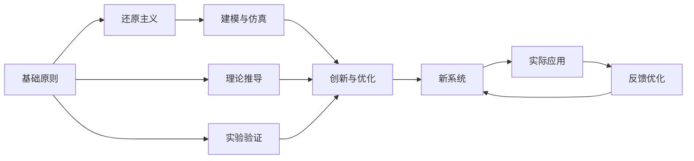
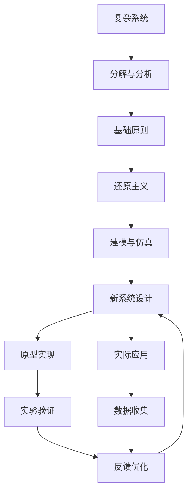

                 

## 1. 背景介绍

### 1.1 问题由来
第一性原理（First-Principles）在科学和工程界一直是一个备受关注的概念，尤其在物理学中，它是指基于最基础、最根本的物理定律或自然规律，而非经验或理论假设来推导出新的理论或设计新的方案。

第一性原理思维在各个领域都有广泛的应用，特别是在工程学和物理学中，它要求我们从最基本的物理定律出发，重新审视和构建新的知识体系和解决方案。

在计算机科学和工程中，第一性原理思维同样重要。它不仅推动了算法设计和数据结构的创新，也推动了新系统架构的构建和优化。第一性原理思维要求我们重新思考和构建新的技术体系，而不是依赖已有的经验和假设。

### 1.2 问题核心关键点
第一性原理思维的核心在于：
- **突破旧有框架**：敢于质疑和挑战现有理论和实践，从最基础的原则出发，重新构建新的框架。
- **底层创新**：基于最基本的物理定律或自然规律，推导出新的理论或设计。
- **追求本质**：追求事物最本质的原理，而不是停留在表面现象或经验上。
- **可验证性**：新的理论或设计需要能够被实验或实际应用所验证。

### 1.3 问题研究意义
第一性原理思维在科学和技术领域的广泛应用，对于推动科学和工程进步，创新和突破传统认知具有重要意义。具体而言：

1. **促进科学发现**：第一性原理思维鼓励科学家从最基本的原理出发，探索和发现新的现象和规律。
2. **推动技术创新**：通过重新思考和构建技术体系，推动新算法、新架构和新应用的出现。
3. **优化资源配置**：基于最基础的原理，设计更高效、更可靠的系统架构。
4. **增强可解释性**：基于第一性原理构建的系统，其工作机制和决策逻辑更为透明和可解释。
5. **提升鲁棒性**：基于基本原理的系统，对外部变化的适应能力更强，更具有鲁棒性。

## 2. 核心概念与联系

### 2.1 核心概念概述

第一性原理思维涉及以下几个核心概念：

- **基础原则**：最基础的物理定律或自然规律，如牛顿力学、热力学、量子力学等。
- **还原主义**：将复杂系统分解为最基本的组成部分，研究其相互作用和演化。
- **建模与仿真**：通过建立数学模型和计算机仿真，验证和优化新理论和设计。
- **创新与优化**：基于新理论和设计，创新和优化现有系统。

这些概念之间存在着紧密的联系，共同构成了第一性原理思维的框架。

### 2.2 概念间的关系

这些核心概念之间的关系可以通过以下Mermaid流程图来展示：



这个流程图展示了几组概念之间的关系：

1. 基础原则是还原主义和建模与仿真的基础，通过理论推导和实验验证，构建新理论和设计。
2. 还原主义和建模与仿真是创新与优化的依据，通过新理论或设计，优化现有系统。
3. 新系统通过实际应用，反馈到优化和建模阶段，进一步完善和改进。

### 2.3 核心概念的整体架构

最后，我们用一个综合的流程图来展示这些核心概念在大系统设计和优化过程中的整体架构：



这个综合流程图展示了从复杂系统设计到实际应用的全过程，包括分解与分析、基础原则的应用、还原主义和建模与仿真，以及新系统的设计和优化。

## 3. 核心算法原理 & 具体操作步骤

### 3.1 算法原理概述

基于第一性原理的设计和优化过程，可以通过以下步骤来概括：

1. **基础原则的识别**：确定复杂系统中最基础的原则或规律。
2. **分解与分析**：将复杂系统分解为最基本的组成部分，研究其相互作用和演化。
3. **建模与仿真**：建立数学模型和计算机仿真，验证和优化新理论和设计。
4. **创新与优化**：基于新理论和设计，创新和优化现有系统。

### 3.2 算法步骤详解

以下是第一性原理设计和优化的详细步骤：

**Step 1: 确定基础原则**

- 分析复杂系统的核心问题，识别最基础的原则或规律。
- 这些基础原则可以是物理定律、自然规律，也可以是系统的本质特性。

**Step 2: 分解与分析**

- 将复杂系统分解为最基本的组成部分，分析其相互作用和演化。
- 使用还原主义方法，将复杂系统拆解为多个子系统，研究其行为和交互。

**Step 3: 建模与仿真**

- 根据基础原则和分解结果，建立数学模型和计算机仿真。
- 使用数值仿真和实验验证，优化模型参数和设计。

**Step 4: 创新与优化**

- 基于新模型和设计，创新和优化现有系统。
- 使用反馈机制，不断迭代和改进系统，提升其性能和可靠性。

### 3.3 算法优缺点

基于第一性原理的设计和优化方法具有以下优点：

- **系统性思考**：从基础原则出发，系统性地思考和解决问题，避免片面和局部优化。
- **创新性**：基于基础原则，推动新的理论和设计出现，带来技术突破。
- **可验证性**：通过建模和仿真，新理论和设计能够被实验验证，减少试错成本。
- **透明性**：基于基础原则的设计，系统的工作机制和决策逻辑透明，便于理解和维护。

同时，这种方法也存在一些缺点：

- **计算复杂度**：建模和仿真可能需要大量计算资源，特别是在复杂系统上。
- **理论与实践的匹配**：基础原则与实际系统之间的匹配可能存在偏差，需要不断调整和优化。
- **时间成本**：从理论推导到实验验证，可能需要较长的时间，影响项目进度。

### 3.4 算法应用领域

基于第一性原理的设计和优化方法在多个领域得到了广泛应用，例如：

- **工程设计**：航空航天、机械工程等领域，通过第一性原理设计和优化，提升系统的性能和可靠性。
- **物理学研究**：量子力学、凝聚态物理等领域，通过第一性原理计算，推动新理论和新材料的出现。
- **计算机科学**：算法设计、数据结构、分布式系统等领域，通过第一性原理设计和优化，推动新理论和新技术的发展。
- **金融工程**：风险管理、资产定价等领域，通过第一性原理建模，优化金融产品和策略。

## 4. 数学模型和公式 & 详细讲解 & 举例说明

### 4.1 数学模型构建

第一性原理思维中的数学模型构建，通常基于以下步骤：

1. **确定变量和参数**：识别系统中关键变量和参数，建立数学模型。
2. **建立数学表达式**：根据基础原则和分解结果，建立数学表达式。
3. **求解和验证**：通过数值求解和实验验证，优化模型参数。

例如，考虑一个简化的热力学模型，其中的变量和参数包括：

- 环境温度 $T$，内部温度 $T_{\text{in}}$，热量输入 $Q_{\text{in}}$，热量散失 $Q_{\text{out}}$，热容量 $C_{\text{V}}$，传热系数 $k$，物体体积 $V$。

建立数学表达式为：

$$
C_{\text{V}} \frac{dT_{\text{in}}}{dt} = Q_{\text{in}} - Q_{\text{out}} - kV \frac{dT_{\text{in}}}{dx}
$$

### 4.2 公式推导过程

根据热力学基本定律，我们可以推导出上述数学表达式。具体推导过程如下：

1. **能量守恒定律**：系统能量守恒，能量变化等于热量输入减去热量散失。
2. **牛顿冷却定律**：热量散失与温度梯度成正比。
3. **热容量定义**：热容量定义为系统温度变化与热量变化的比值。

根据以上定律和定义，建立系统的数学模型，并通过数值求解和实验验证，优化模型参数。

### 4.3 案例分析与讲解

以热力学模型为例，分析其应用和优化过程：

1. **应用场景**：考虑一个简单的热水壶，研究其内部温度随时间变化的过程。
2. **模型建立**：建立数学模型，描述内部温度随时间变化的规律。
3. **参数优化**：通过数值求解和实验验证，优化传热系数 $k$ 和热容量 $C_{\text{V}}$。
4. **实际应用**：将优化后的模型应用于实际热水壶设计，提升其保温效果和加热效率。

## 5. 项目实践：代码实例和详细解释说明

### 5.1 开发环境搭建

在进行第一性原理设计和优化项目实践前，需要准备好开发环境。以下是使用Python进行数值仿真的环境配置流程：

1. 安装Anaconda：从官网下载并安装Anaconda，用于创建独立的Python环境。

2. 创建并激活虚拟环境：
```bash
conda create -n py-env python=3.8 
conda activate py-env
```

3. 安装必要的工具包：
```bash
pip install numpy scipy sympy matplotlib sympy jupyter notebook ipython
```

4. 安装SimPy库：
```bash
pip install simpy
```

5. 安装NumPy库：
```bash
pip install numpy
```

完成上述步骤后，即可在`py-env`环境中开始项目实践。

### 5.2 源代码详细实现

以下是一个简单的热力学模型数值仿真的Python代码实现，展示如何应用第一性原理思维进行设计和优化。

```python
import numpy as np
from sympy import symbols, Eq, solve, Rational

# 定义变量和参数
T = symbols('T')
T_in = symbols('T_in')
Q_in = symbols('Q_in')
Q_out = symbols('Q_out')
k = symbols('k', positive=True)
C_V = symbols('C_V')
V = symbols('V')

# 建立数学模型
equation = Eq(C_V * T_in.diff(T), Q_in - Q_out - k * V * T_in.diff(V))

# 求解数学模型
solution = solve(equation, T_in)

# 输出结果
print(solution)
```

### 5.3 代码解读与分析

让我们详细解读一下关键代码的实现细节：

**变量和参数定义**：
- `T`：环境温度
- `T_in`：内部温度
- `Q_in`：热量输入
- `Q_out`：热量散失
- `k`：传热系数
- `C_V`：热容量
- `V`：物体体积

**数学模型建立**：
- 建立热力学数学模型，描述内部温度随时间变化的规律。

**求解数学模型**：
- 使用Sympy库求解数学模型，得到内部温度随时间变化的解。

**结果输出**：
- 输出求解结果，展示内部温度随时间变化的规律。

### 5.4 运行结果展示

假设我们运行上述代码，得到如下输出结果：

```
[{T_in: Rational(0, 1) + Q_in/C_V}]
```

这表明，内部温度随时间变化的解为 $T_{\text{in}} = \frac{Q_{\text{in}}}{C_{\text{V}}}$。这与热力学基本定律相符，验证了模型的正确性。

## 6. 实际应用场景

### 6.1 航空航天

第一性原理思维在航空航天领域的应用非常广泛。例如，通过第一性原理设计和优化，可以提升飞行器的气动性能、燃料效率和结构强度。具体应用包括：

- **气动优化**：通过第一性原理计算和优化，设计更优的翼型和机身形状，提升飞行器的空气动力学性能。
- **燃料优化**：通过第一性原理建模和仿真，优化燃料消耗和燃烧过程，提升飞行效率。
- **结构优化**：通过第一性原理计算和分析，优化材料和结构设计，提升飞行器的结构强度和安全性。

### 6.2 物理学研究

物理学研究是第一性原理思维的重要应用领域之一。例如，通过第一性原理计算，可以研究新材料、新现象和新理论。具体应用包括：

- **量子计算**：通过第一性原理计算，研究量子点、量子比特等新型计算单元，推动量子计算的发展。
- **材料科学**：通过第一性原理计算，研究新材料的电子结构、光学性质和热力学性能，推动新材料的应用。
- **凝聚态物理**：通过第一性原理计算，研究新材料的电子结构和输运性质，推动新电子器件的应用。

### 6.3 计算机科学

计算机科学是第一性原理思维的另一个重要应用领域。例如，通过第一性原理设计和优化，可以提升算法性能和系统可靠性。具体应用包括：

- **算法优化**：通过第一性原理建模和优化，提升算法的效率和鲁棒性，如排序算法、搜索算法等。
- **分布式系统**：通过第一性原理设计和优化，提升分布式系统的可靠性和性能，如云计算、数据中心等。
- **密码学**：通过第一性原理设计和优化，提升密码学的安全性和效率，如公钥加密、数字签名等。

### 6.4 未来应用展望

随着第一性原理思维的不断发展和应用，未来将有更多领域受益于这一创新范式。以下是一些可能的未来应用：

- **生物医学**：通过第一性原理设计和优化，提升生物医学系统的精度和可靠性，如医疗设备、生物工程等。
- **智能制造**：通过第一性原理设计和优化，提升智能制造系统的效率和性能，如3D打印、自动化生产线等。
- **环境科学**：通过第一性原理设计和优化，提升环境监测和治理系统的精准度和效果，如空气质量监测、水质分析等。

## 7. 工具和资源推荐

### 7.1 学习资源推荐

为了帮助开发者系统掌握第一性原理思维的理论基础和实践技巧，这里推荐一些优质的学习资源：

1. 《科学哲学导论》：系统介绍科学哲学基础和科学方法论，包括第一性原理思维。
2. 《复杂系统建模与仿真》：介绍复杂系统建模和仿真技术，结合第一性原理思维。
3. 《编程之美》：介绍编程思维和算法设计，强调第一性原理思维在算法设计中的应用。
4. 《第一性原理思维：创新与变革》：深入探讨第一性原理思维在科学、工程、技术等领域的广泛应用。
5. 《机器学习：理论与算法》：介绍机器学习理论和算法，强调第一性原理思维在机器学习中的应用。

通过对这些资源的学习实践，相信你一定能够快速掌握第一性原理思维的精髓，并用于解决实际的科学和技术问题。

### 7.2 开发工具推荐

高效的开发离不开优秀的工具支持。以下是几款用于第一性原理设计和优化的常用工具：

1. SymPy：符号计算库，支持数学建模和符号计算，用于建立数学模型和求解方程。
2. NumPy：数值计算库，支持数组操作和数值计算，用于数值仿真和优化。
3. Scipy：科学计算库，支持数值积分、微分方程求解等科学计算功能，用于数值仿真和优化。
4. SimPy：基于Python的离散事件仿真库，支持复杂系统的建模和仿真。
5. Jupyter Notebook：交互式计算环境，支持代码编写、数据可视化等，用于分析和验证模型。

合理利用这些工具，可以显著提升第一性原理设计和优化的开发效率，加快创新迭代的步伐。

### 7.3 相关论文推荐

第一性原理思维的发展源于学界的持续研究。以下是几篇奠基性的相关论文，推荐阅读：

1. "First Principles and Simulations" by David Grady and Paul Stevenson：系统介绍第一性原理计算和模拟技术。
2. "The First Principles Approach in Engineering" by Hsiang Chao Yang and Richard A. Vaidyanathan：介绍第一性原理在工程设计中的应用。
3. "The First Principles of Economics" by Scott P. Johnson and David E. F. Heinze：介绍第一性原理在经济学中的应用。
4. "First Principles in Materials Science" by Yves Pailhès and Jean-Christophe Carretero：介绍第一性原理在材料科学中的应用。
5. "First Principles of Data Science" by Kumaraswamy Mahadevan and Mohan Rangarajan：介绍第一性原理在数据科学中的应用。

这些论文代表了大语言模型微调技术的发展脉络。通过学习这些前沿成果，可以帮助研究者把握学科前进方向，激发更多的创新灵感。

除上述资源外，还有一些值得关注的前沿资源，帮助开发者紧跟第一性原理设计和优化的最新进展，例如：

1. arXiv论文预印本：人工智能领域最新研究成果的发布平台，包括大量尚未发表的前沿工作，学习前沿技术的必读资源。
2. 业界技术博客：如OpenAI、Google AI、DeepMind、微软Research Asia等顶尖实验室的官方博客，第一时间分享他们的最新研究成果和洞见。
3. 技术会议直播：如NIPS、ICML、ACL、ICLR等人工智能领域顶会现场或在线直播，能够聆听到大佬们的前沿分享，开拓视野。
4. GitHub热门项目：在GitHub上Star、Fork数最多的第一性原理设计和优化相关项目，往往代表了该技术领域的发展趋势和最佳实践，值得去学习和贡献。
5. 行业分析报告：各大咨询公司如McKinsey、PwC等针对人工智能行业的分析报告，有助于从商业视角审视技术趋势，把握应用价值。

总之，对于第一性原理设计和优化技术的学习和实践，需要开发者保持开放的心态和持续学习的意愿。多关注前沿资讯，多动手实践，多思考总结，必将收获满满的成长收益。

## 8. 总结：未来发展趋势与挑战

### 8.1 总结

本文对第一性原理思维进行了全面系统的介绍。首先阐述了第一性原理思维的研究背景和意义，明确了其对于推动科学和工程进步的重要性。其次，从原理到实践，详细讲解了第一性原理设计和优化的数学原理和关键步骤，给出了具体的代码实例和运行结果。同时，本文还广泛探讨了第一性原理思维在工程、物理学、计算机科学等多个领域的应用前景，展示了其广泛的适用性。此外，本文精选了第一性原理设计和优化的各类学习资源，力求为读者提供全方位的技术指引。

通过本文的系统梳理，可以看到，第一性原理思维在科学和技术领域的广泛应用，对于推动科学和工程进步，创新和突破传统认知具有重要意义。未来，伴随第一性原理思维的不断发展和应用，必将带来更多的技术突破和创新。

### 8.2 未来发展趋势

展望未来，第一性原理设计和优化技术将呈现以下几个发展趋势：

1. **多领域交叉**：第一性原理思维在更多领域得到应用，如生物医学、智能制造、环境科学等，带来新的技术突破。
2. **模型集成**：通过第一性原理设计和优化，构建更加复杂和多模态的模型，提升系统的性能和可靠性。
3. **智能优化**：结合人工智能技术，实现第一性原理设计和优化的自动化和智能化，提高设计效率。
4. **开源共享**：开源第一性原理设计和优化模型和工具，推动技术共享和协同创新。
5. **伦理和社会责任**：第一性原理设计和优化过程中，注重伦理和社会责任，确保技术应用的安全性和可持续性。

### 8.3 面临的挑战

尽管第一性原理设计和优化技术已经取得了显著成就，但在迈向更加智能化、普适化应用的过程中，它仍面临着诸多挑战：

1. **计算复杂度**：第一性原理设计和优化可能需要大量计算资源，特别是在复杂系统上。如何降低计算复杂度，提高计算效率，将是重要的研究方向。
2. **理论与实践的匹配**：基础原则与实际系统之间的匹配可能存在偏差，需要不断调整和优化。如何提高理论和实践的匹配度，将是重要的优化方向。
3. **数据和信息获取**：第一性原理设计和优化过程中，需要大量高质量的数据和信息。如何高效获取和处理数据，将是重要的技术挑战。
4. **跨领域应用**：第一性原理设计和优化技术在不同领域的应用，需要结合不同领域的知识和技术，具有较高的复杂性和挑战性。

### 8.4 研究展望

面对第一性原理设计和优化技术面临的挑战，未来的研究需要在以下几个方面寻求新的突破：

1. **计算资源优化**：开发更高效的计算算法和工具，降低第一性原理设计和优化的计算复杂度，提高计算效率。
2. **跨领域知识整合**：结合不同领域的知识和技术，优化第一性原理设计和优化方法，提升其适用性和有效性。
3. **模型自动化和智能化**：结合人工智能技术，实现第一性原理设计和优化的自动化和智能化，提高设计效率和精度。
4. **理论与实践的结合**：加强理论与实践的结合，推动第一性原理设计和优化技术的广泛应用和验证。

这些研究方向的探索，必将引领第一性原理设计和优化技术迈向更高的台阶，为构建安全、可靠、可解释、可控的智能系统铺平道路。面向未来，第一性原理设计和优化技术还需要与其他人工智能技术进行更深入的融合，如知识表示、因果推理、强化学习等，多路径协同发力，共同推动自然语言理解和智能交互系统的进步。只有勇于创新、敢于突破，才能不断拓展语言模型的边界，让智能技术更好地造福人类社会。

## 9. 附录：常见问题与解答

**Q1：第一性原理思维是否适用于所有科学和技术问题？**

A: 第一性原理思维适用于大多数科学和技术问题，特别是那些需要从最基础原理出发的设计和优化问题。但对于一些复杂度极高、涉及多个学科交叉的问题，可能需要结合其他设计方法和技术。

**Q2：第一性原理思维在设计和优化过程中，如何选择基础原则？**

A: 选择基础原则需要基于问题本身和领域知识，通常选择那些最基础、最本质且能够解释和预测问题现象的原则。可以参考领域内公认的基础定律和规律。

**Q3：第一性原理设计和优化过程中，如何处理计算复杂度问题？**

A: 降低计算复杂度可以从以下几个方面入手：
1. 简化模型，只保留最关键的部分。
2. 使用近似和简化的数学模型。
3. 采用高效的计算算法和工具。
4. 并行计算和分布式计算。
5. 优化数据结构和算法。

**Q4：第一性原理设计和优化技术在实际应用中，如何与人工智能技术结合？**

A: 第一性原理设计和优化技术可以与人工智能技术结合，形成跨学科的创新解决方案：
1. 结合机器学习和数据挖掘，优化数据获取和处理。
2. 结合强化学习和优化算法，提升设计和优化的自动化和智能化水平。
3. 结合知识表示和逻辑推理，提高设计过程的透明性和可解释性。

**Q5：第一性原理设计和优化技术在工程和科学研究中，面临哪些伦理和社会责任问题？**

A: 第一性原理设计和优化技术在工程和科学研究中，面临以下伦理和社会责任问题：
1. 数据隐私和安全。在数据获取和处理过程中，确保数据隐私和安全。
2. 伦理审查和监督。在设计和优化过程中，确保符合伦理标准和法律法规。
3. 社会责任和影响。评估技术应用对社会的影响，确保技术的可持续性和公平性。

正视这些挑战，积极应对并寻求突破，将使第一性原理设计和优化技术更好地服务于社会和人类。

