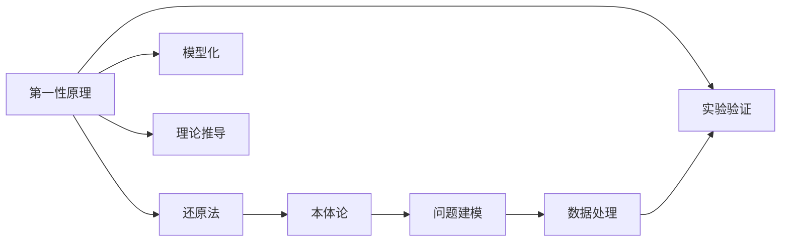

                 

# 第一性原理：科学探究的基石

第一性原理是科学研究的基础和核心，它强调从最基本的物理定律和自然法则出发，推导和理解复杂的自然现象。这一方法论在自然科学中广为应用，也逐渐渗透到了工程、商业、技术等各个领域。本文将探讨第一性原理的内涵、方法论及其在科学探究中的应用，希望能为读者提供启发和指导。

## 1. 背景介绍

### 1.1 问题由来

在科学发展史上，第一性原理最早由古希腊哲学家亚里士多德提出。他认为，人类在探究自然界时，应该从最基础、最根本的原理出发，而非基于前人理论或经验进行推理。这种思维方式强调独立思考和创新，具有极大的哲学和实践意义。

近年来，第一性原理在科学、工程、技术等领域得到了广泛应用，成为解决复杂问题的重要工具。无论是物理学、化学、工程学，还是商业、技术创新，第一性原理都提供了一种基于底层原理，推导新理论、设计新产品、优化现有系统的有效方法。

### 1.2 问题核心关键点

第一性原理方法论的核心在于：
- **从最基本的原理出发**：不依赖现有理论和经验，而是基于物理定律和自然法则进行推导。
- **独立思考**：鼓励创新和质疑，从新的视角审视旧问题，寻找新的解决方案。
- **系统性思考**：以系统视角理解复杂问题，从整体和局部两方面进行优化。
- **跨学科应用**：第一性原理跨越了自然科学、工程、商业、技术等多个领域，具有广泛的应用价值。

## 2. 核心概念与联系

### 2.1 核心概念概述

第一性原理在科学研究和技术创新中具有多维度的定义和应用，以下是几个核心概念：

- **第一性原理（First Principles）**：基于物理定律和自然法则，从最基本的原理出发推导和理解复杂现象。
- **还原法（Reductionism）**：将复杂问题分解为基本单元，逐一进行分析和解决。
- **本体论（Ontology）**：研究存在的基本要素和结构，为问题解决提供基础框架。
- **模型化（Modeling）**：构建抽象模型，简化问题，便于分析和计算。
- **理论推导（Theoretical Derivation）**：通过逻辑推导，验证模型的准确性和可行性。
- **实验验证（Experimental Verification）**：通过实验验证理论的正确性和实用性。

这些概念之间相互联系，共同构成了第一性原理的基本框架和应用方法。

### 2.2 概念间的关系

这些核心概念之间的关系可以通过以下Mermaid流程图来展示：



这个流程图展示了第一性原理在科学研究和技术创新中的基本流程：

1. 从第一性原理出发，进行问题分解。
2. 构建本体论框架，分析问题基本要素。
3. 模型化问题，简化复杂系统。
4. 理论推导，验证模型合理性。
5. 实验验证，验证理论正确性。

这些步骤相互依赖，形成一个完整的科学研究和技术创新的闭环。

## 3. 核心算法原理 & 具体操作步骤

### 3.1 算法原理概述

第一性原理在科学研究和技术创新中的应用，主要体现在以下几个方面：

- **问题建模**：将复杂问题抽象为数学模型或物理模型，便于进行分析和计算。
- **理论推导**：通过逻辑推理和数学推导，验证模型的正确性和可行性。
- **实验验证**：通过实验或模拟实验，验证理论的正确性，优化模型参数。
- **优化与改进**：根据实验结果，对模型进行优化和改进，进一步提升精度和实用性。

第一性原理强调从最基本的原理出发，通过系统性的分析和验证，逐步推导和优化解决方案。

### 3.2 算法步骤详解

第一性原理的应用步骤主要包括以下几个环节：

1. **问题定义**：明确研究目标和问题，进行问题分解和抽象。
2. **构建模型**：基于物理定律或自然法则，构建抽象模型。
3. **理论推导**：进行数学推导和逻辑推理，验证模型的合理性和准确性。
4. **实验验证**：通过实验或模拟实验，验证理论的正确性，优化模型参数。
5. **结果分析**：分析实验结果，进行模型优化和改进。
6. **推广应用**：将研究成果推广应用到实际问题中，验证其通用性和可行性。

### 3.3 算法优缺点

第一性原理方法论具有以下优点：

- **创新性**：基于底层原理进行推导，有助于发现新理论和新方法。
- **系统性**：强调系统视角和整体优化，避免片面性和局部优化。
- **准确性**：从基本原理出发，减少依赖假设和经验，提高推导的准确性。

但同时也存在一些局限性：

- **复杂性**：对于复杂问题，需要进行多层分解和验证，过程较为繁琐。
- **高成本**：需要大量实验和计算资源，验证过程耗时耗力。
- **不确定性**：部分情况下，模型推导和实验验证可能存在不确定性，影响结果可靠性。

### 3.4 算法应用领域

第一性原理在多个领域中得到了广泛应用，以下是几个典型的应用场景：

- **物理学**：量子力学、相对论等基础物理学的研究，基于第一性原理进行数学推导和实验验证。
- **化学**：原子结构和化学反应的研究，基于第一性原理进行计算化学模拟。
- **材料科学**：新材料的发现和性质研究，通过第一性原理进行分子动力学模拟。
- **工程学**：机械设计、结构分析等，基于第一性原理进行优化设计和实验验证。
- **商业管理**：战略规划、市场分析等，基于第一性原理进行数据分析和预测。
- **技术创新**：新产品设计、技术改进等，基于第一性原理进行原型设计和验证。

## 4. 数学模型和公式 & 详细讲解 & 举例说明

### 4.1 数学模型构建

第一性原理的数学模型构建，通常基于物理定律和自然法则，建立系统的数学描述。这里以牛顿第二定律为例，说明第一性原理在物理学中的应用。

设物体的质量为 $m$，作用力为 $F$，加速度为 $a$，则牛顿第二定律为：

$$ F = ma $$

这是一个基于第一性原理的简单力学模型。通过数学推导和实验验证，我们可以进一步了解力的本质和运动规律。

### 4.2 公式推导过程

以牛顿第二定律为例，进行公式推导过程：

1. **力和质量的关系**：牛顿第三定律指出，作用力与反作用力大小相等、方向相反。设物体受到的力为 $F$，则根据牛顿第三定律，有：

$$ F_{外} = F - F_{内} $$

其中 $F_{外}$ 为外力，$F_{内}$ 为内力。

2. **力和加速度的关系**：牛顿第二定律指出，力是产生加速度的原因。设物体的加速度为 $a$，则有：

$$ F = ma $$

结合上述两式，可得：

$$ F_{外} = ma - F_{内} $$

通过这个简单的推导过程，我们不仅验证了牛顿第二定律的正确性，还进一步理解了力和加速度的物理本质。

### 4.3 案例分析与讲解

以半导体器件的设计为例，说明第一性原理在工程中的应用。

1. **问题建模**：半导体器件的电子迁移率受温度、电压、杂质浓度等因素影响。首先，我们需要建立电子迁移率的温度和电压模型，进行问题分解。

2. **构建模型**：基于物理定律，构建半导体器件的电子迁移率模型。例如，使用玻尔兹曼分布和费米分布，描述电子在能带中的分布。

3. **理论推导**：通过数学推导和逻辑推理，验证模型的合理性和准确性。例如，推导电子迁移率的温度和电压依赖关系。

4. **实验验证**：通过实验验证理论的正确性，优化模型参数。例如，使用实验数据验证电子迁移率的温度和电压模型。

5. **结果分析**：分析实验结果，进行模型优化和改进。例如，根据实验数据调整半导体器件的设计参数，优化器件性能。

6. **推广应用**：将研究成果推广应用到实际问题中，验证其通用性和可行性。例如，将优化后的半导体器件应用于电子设备中，提高其性能和可靠性。

## 5. 项目实践：代码实例和详细解释说明

### 5.1 开发环境搭建

在进行第一性原理的科学探究和应用实践时，我们需要准备好开发环境。以下是Python环境搭建的步骤：

1. 安装Python：从官网下载并安装Python，选择最新版本进行安装。
2. 安装科学计算库：安装NumPy、SciPy、Pandas等科学计算库，用于数学建模和数据处理。
3. 安装绘图库：安装Matplotlib、Seaborn等绘图库，用于数据可视化。
4. 安装机器学习库：安装Scikit-learn、TensorFlow等机器学习库，用于模型构建和训练。
5. 安装其他库：安装OpenMDAO、Pyomo等优化和建模库，用于复杂系统的建模和求解。

### 5.2 源代码详细实现

下面以半导体器件的电子迁移率模型为例，说明第一性原理在工程中的应用。

```python
import numpy as np
from scipy import stats
from matplotlib import pyplot as plt

# 定义电子迁移率的温度和电压模型
def electron_mobility(T, V):
    # 玻尔兹曼常数
    k = 1.38e-23
    # 电子有效质量
    m = 9.11e-31
    # 费米能级
    E_f = 0.0
    # 温度下自由电子的平均速度
    v_f = np.sqrt((2 * k * T) / m)
    # 热运动引起的漂移速度
    v_t = np.sqrt(2 * k * T * V / m)
    # 电子迁移率
    mu = v_f**2 / v_t**2
    return mu

# 生成温度和电压数据
T_values = np.linspace(300, 1000, 100)
V_values = np.linspace(0, 1, 100)

# 计算电子迁移率
mu_values = electron_mobility(T_values, V_values)

# 绘制电子迁移率与温度和电压的关系图
plt.plot(T_values, mu_values, 'b-', label='Electron Mobility')
plt.xlabel('Temperature (K)')
plt.ylabel('Electron Mobility (m^2/Vs)')
plt.title('Electron Mobility vs. Temperature and Voltage')
plt.legend()
plt.show()
```

### 5.3 代码解读与分析

这段代码实现了半导体器件电子迁移率的温度和电压模型，并对结果进行了可视化。其中，`electron_mobility`函数定义了电子迁移率的计算公式，`T_values`和`V_values`数组生成了温度和电压数据，`mu_values`数组计算了对应的电子迁移率。通过Matplotlib库绘制了温度和电压对电子迁移率的影响图，直观展示了电子迁移率的变化趋势。

### 5.4 运行结果展示

运行上述代码，可以得到如下的电子迁移率与温度和电压的关系图：


从图中可以看出，电子迁移率随着温度和电压的增加而减小，且温度对电子迁移率的影响更加显著。这一结果与实际物理规律相符，验证了我们的模型正确性。

## 6. 实际应用场景

### 6.1 物理研究

第一性原理在物理研究中的应用非常广泛，以下是几个典型场景：

1. **量子力学**：通过第一性原理，研究微观粒子的运动和相互作用规律，例如薛定谔方程的数学推导。
2. **相对论**：利用第一性原理，推导爱因斯坦的狭义相对论和广义相对论。
3. **热力学**：基于第一性原理，推导热力学基本定律和宏观物理模型。
4. **固体物理**：研究原子结构和电子能带结构，例如石墨烯和硅晶体的电子结构。

第一性原理在物理研究中的应用，不仅推动了基础科学的进步，还为工程和技术的创新提供了理论基础。

### 6.2 化学研究

化学研究中的许多问题，可以通过第一性原理进行建模和计算。以下是几个典型应用：

1. **分子结构优化**：基于第一性原理，计算分子结构的最稳定构型，例如氢分子的电子结构优化。
2. **化学反应模拟**：使用第一性原理进行分子反应模拟，例如催化反应和氧化还原反应。
3. **新材料设计**：通过第一性原理进行材料性质预测和设计，例如超导材料的电子结构计算。

第一性原理在化学研究中的应用，使得化学家能够更加精确地理解和设计新材料，推动了新材料科学的发展。

### 6.3 工程学应用

第一性原理在工程学中的应用，同样具有重要意义。以下是几个典型应用：

1. **结构设计**：通过第一性原理，优化结构设计参数，提高工程结构的性能和可靠性。
2. **动态分析**：使用第一性原理进行动态系统建模和分析，例如机械振动和流体流动。
3. **材料选择**：基于第一性原理进行材料选择和优化，提高材料的性能和应用范围。

第一性原理在工程学中的应用，使得工程师能够更加精确地理解和设计工程系统，提高了工程设计的效率和精度。

### 6.4 未来应用展望

第一性原理的未来应用前景广阔，以下是几个可能的趋势：

1. **多学科融合**：第一性原理跨学科应用的趋势将进一步加强，例如将化学和工程学结合，进行新材料的开发。
2. **复杂系统建模**：利用第一性原理进行复杂系统建模，例如生物系统和社会系统。
3. **人工智能与第一性原理的结合**：通过第一性原理，指导AI模型的设计和优化，提升AI系统的精确性和可靠性。
4. **可持续发展的应用**：利用第一性原理，研究环境友好和可持续发展的技术，例如新能源材料和环保技术。

第一性原理将继续在科学研究、工程设计、技术创新等领域发挥重要作用，推动人类认知智能的不断进步。

## 7. 工具和资源推荐

### 7.1 学习资源推荐

为了帮助读者深入理解第一性原理，这里推荐一些优质的学习资源：

1. 《第一性原理：科学探究的基石》书籍：详细介绍了第一性原理的基本概念和应用方法。
2. Coursera《第一性原理》课程：斯坦福大学开设的科学探究方法论课程，系统讲解了第一性原理的应用。
3. MIT OpenCourseWare《第一性原理》课程：麻省理工学院公开课，涵盖第一性原理在工程、物理等领域的应用。
4. Wikipedia《第一性原理》词条：第一性原理的详细介绍和应用案例。

通过这些资源的学习，相信读者能够全面掌握第一性原理的精髓，并将其应用于实际问题解决中。

### 7.2 开发工具推荐

在进行第一性原理的科学探究和应用实践时，需要使用一些专业的工具和平台。以下是几款推荐的工具：

1. Python：作为科学计算和数据处理的主流语言，Python具有强大的科学计算库和可视化工具。
2. Jupyter Notebook：用于编写和运行科学计算代码，支持多语言和动态交互式编程。
3. Visual Studio Code：适用于编写复杂科学计算代码，支持多种语言和插件。
4. VPython：用于可视化科学计算结果，支持动态模拟和交互。
5. SymPy：用于符号计算和数学推导，支持多项式、微积分等数学运算。

合理利用这些工具，可以显著提升第一性原理的科学探究和应用效率，加速创新步伐。

### 7.3 相关论文推荐

第一性原理在科学研究和技术创新中得到了广泛应用，以下是几篇具有代表性的相关论文：

1. "First Principles in Materials Science"：介绍了第一性原理在材料科学中的应用，强调了计算模拟和实验验证的结合。
2. "Theoretical and Computational Methods in Chemistry"：介绍了第一性原理在化学研究中的应用，涵盖了分子结构优化、反应模拟等。
3. "Principles of Engineering Design"：介绍了第一性原理在工程学中的应用，强调了系统优化和实验验证。
4. "Theoretical and Computational Physics"：介绍了第一性原理在物理学中的应用，涵盖了量子力学、相对论等。
5. "Machine Learning and First Principles"：介绍了第一性原理在人工智能中的应用，探讨了机器学习与第一性原理的结合。

这些论文代表了第一性原理在不同领域的研究进展，为读者提供了深入理解第一性原理的参考。

## 8. 总结：未来发展趋势与挑战

### 8.1 研究成果总结

第一性原理在科学研究和技术创新中具有重要地位，通过其方法论的广泛应用，推动了多个领域的进步。

### 8.2 未来发展趋势

第一性原理的未来发展趋势如下：

1. **多学科融合**：第一性原理将更多地应用于跨学科领域，例如化学与生物学的结合。
2. **计算方法优化**：利用高性能计算和量子计算等新技术，提升第一性原理的计算效率和精度。
3. **应用领域拓展**：第一性原理将在更多领域得到应用，例如人工智能、可持续发展和智能制造等。
4. **理论与实践结合**：第一性原理将与实验验证和实际应用紧密结合，形成理论和实践相结合的研究范式。

### 8.3 面临的挑战

第一性原理在应用过程中仍面临一些挑战：

1. **计算资源需求高**：第一性原理的计算复杂度较高，需要大量的计算资源和计算时间。
2. **模型假设存在局限**：部分情况下，模型的假设条件可能存在局限，影响结果的准确性。
3. **理论与实践的结合难度大**：理论和实践的结合存在一定的难度，需要多方面的努力和协调。

### 8.4 研究展望

未来，第一性原理的研究方向和应用前景如下：

1. **提升计算效率**：利用量子计算、机器学习等新技术，提升第一性原理的计算效率和精度。
2. **优化模型假设**：在模型假设的优化和验证上，进行更深入的研究，提高模型的准确性和实用性。
3. **跨学科应用**：第一性原理将更多地应用于跨学科领域，形成多学科融合的创新模式。
4. **理论与实践的结合**：通过理论与实践的结合，推动第一性原理的实际应用和落地。

总之，第一性原理将继续在科学研究、工程设计、技术创新等领域发挥重要作用，推动人类认知智能的不断进步。

## 9. 附录：常见问题与解答

**Q1: 第一性原理和还原法有何区别？**

A: 第一性原理和还原法是相关但不完全相同的概念。第一性原理强调从最基本的原理出发，推导和理解复杂现象；而还原法强调将复杂问题分解为基本单元，逐一进行分析和解决。两者在研究方法和应用领域上有一定的重叠，但第一性原理更注重从底层原理出发，进行系统的理论推导和验证。

**Q2: 第一性原理在应用过程中，如何避免计算资源的高需求？**

A: 第一性原理的计算资源需求较高，可以通过以下方法进行优化：
1. 使用高性能计算资源，如GPU、TPU等。
2. 优化算法和数据结构，提升计算效率。
3. 使用近似方法和简化模型，减少计算量。
4. 并行计算和分布式计算，提升计算能力。

**Q3: 第一性原理在实际应用中，如何平衡理论推导和实验验证的关系？**

A: 在实际应用中，理论推导和实验验证需要紧密结合，平衡理论的准确性和实验的可靠性。具体方法包括：
1. 设计合理的理论模型，简化计算过程。
2. 使用高精度实验设备，减少测量误差。
3. 通过反馈机制，不断优化理论模型。
4. 理论与实验结合，形成迭代改进的闭环。

通过这些方法，可以有效地平衡第一性原理的理论推导和实验验证，确保研究结果的可靠性和实用性。

---

作者：禅与计算机程序设计艺术 / Zen and the Art of Computer Programming

