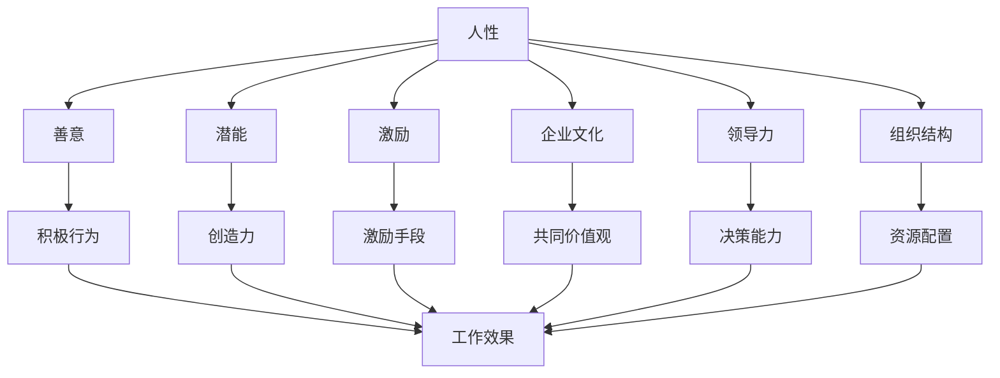
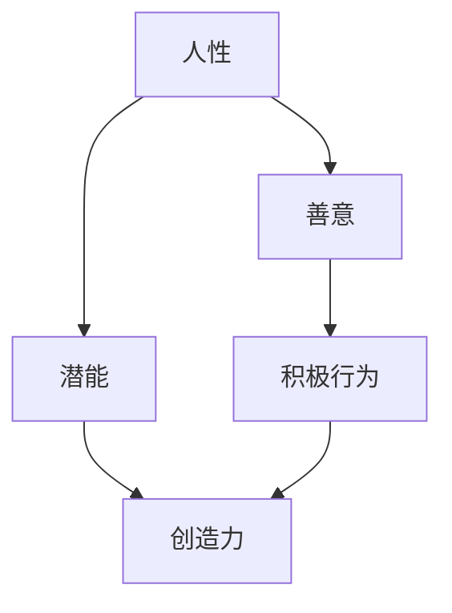
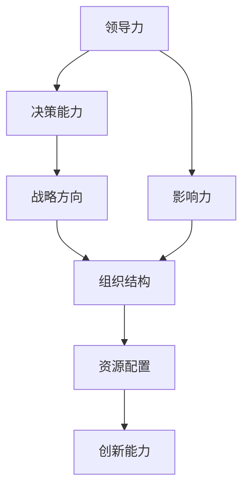
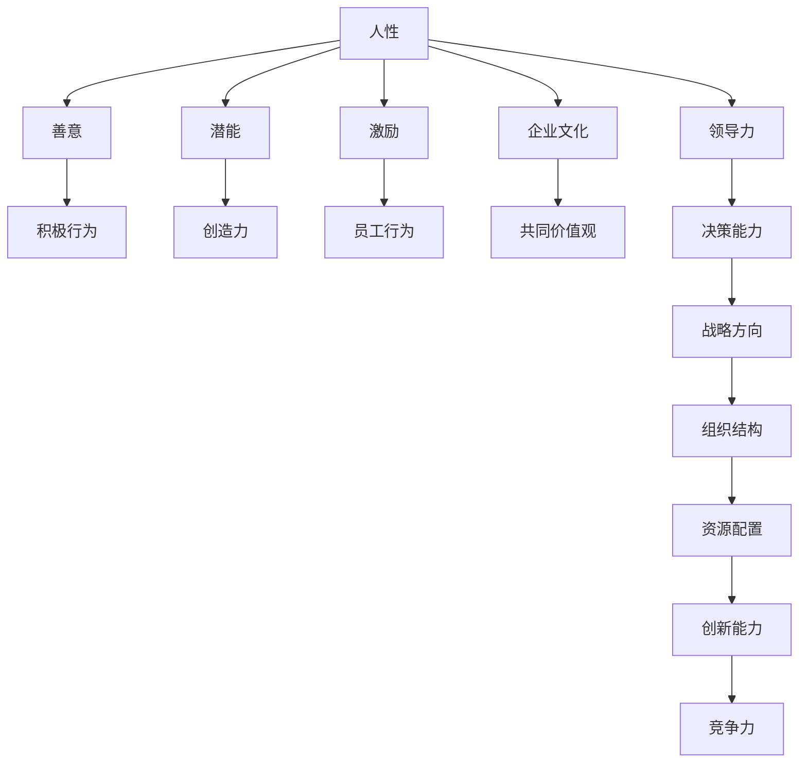

                 

# 管理之道：激发人性的善意和潜能

> 关键词：人性、善意、潜能、激励、文化、领导力、组织、创新

## 1. 背景介绍

### 1.1 问题由来
在当今快速变化、竞争激烈的商业环境中，企业需要不断寻找新的竞争优势来保持领先地位。许多企业将重心放在提升技术、改进流程和优化成本上，但往往忽视了员工这一最重要的资源。员工是企业创新的核心推动力，而人力资源管理的核心任务就是激发员工的善意和潜能，以实现企业的长远发展目标。

本文将深入探讨如何通过人性化的管理手段激发员工善意和潜能，从而提升企业整体绩效和竞争力。首先，我们将介绍人性、善意和潜能的概念及其在管理中的应用。其次，将详细阐述激励理论和企业文化建设，探讨如何通过领导力和组织结构激发员工的创新精神。最后，我们还将讨论未来管理领域的趋势和挑战。

### 1.2 问题核心关键点
- **人性**：指人的本性和特质，包括人的情感、动机和价值观。
- **善意**：指员工对企业的忠诚度和对工作的积极态度。
- **潜能**：指员工潜在的创造力和解决问题的能力。
- **激励**：指通过各种手段激发员工的积极性和创造力。
- **企业文化**：指企业内部共同遵循的价值观、信念和行为准则。
- **领导力**：指领导者在管理过程中的决策、影响力和魅力。
- **组织结构**：指企业的组织形式和成员之间的关系。
- **创新**：指企业通过新颖的思想、方法和技术改进提高竞争力。

这些概念之间有着密切的联系。理解并应用这些概念，是提升企业绩效和管理水平的关键。

### 1.3 问题研究意义
本文聚焦于人性化的管理方法，旨在帮助企业管理者通过激发员工的善意和潜能，实现企业的可持续发展和创新。具体意义如下：

1. **提升员工满意度**：人性化的管理手段可以增强员工的归属感和认同感，提高工作满意度，减少员工流失率。
2. **增强企业凝聚力**：良好的企业文化和领导力可以增强员工的忠诚度和团队合作精神，形成强大的企业凝聚力。
3. **促进创新**：激发员工的善意和潜能，鼓励创新思维和实践，提升企业的创新能力和市场竞争力。
4. **优化组织结构**：通过合理的组织结构和激励机制，使员工能够充分发挥自己的特长，优化资源配置。
5. **适应变化**：人性化的管理方法能够更好地适应复杂多变的商业环境，帮助企业保持灵活性和弹性。

## 2. 核心概念与联系

### 2.1 核心概念概述

为更好地理解如何激发员工的善意和潜能，本节将介绍几个密切相关的核心概念：

- **人性**：指人的本性和特质，包括情感、动机和价值观。人性的多样性要求管理者必须尊重和理解员工的不同需求和期望。
- **善意**：指员工对企业的忠诚度和对工作的积极态度。善意表现为员工愿意为企业做出贡献，展现出正面的工作行为。
- **潜能**：指员工潜在的创造力和解决问题的能力。潜能可以通过合适的激励和环境激发出来。
- **激励**：指通过各种手段激发员工的积极性和创造力。激励分为内在激励和外在激励。
- **企业文化**：指企业内部共同遵循的价值观、信念和行为准则。企业文化是激发员工善意和潜能的重要环境。
- **领导力**：指领导者在管理过程中的决策、影响力和魅力。领导力是建立良好企业文化和激励员工的关键因素。
- **组织结构**：指企业的组织形式和成员之间的关系。合理的组织结构可以最大化员工的效率和潜能。
- **创新**：指企业通过新颖的思想、方法和技术改进提高竞争力。创新是企业持续发展的核心驱动力。

这些核心概念之间的逻辑关系可以通过以下Mermaid流程图来展示：



这个流程图展示了大语言模型的核心概念及其之间的关系：

1. 人性决定员工的善意和潜能。
2. 善意和潜能通过激励得到激发。
3. 企业文化和领导力影响员工的善意和激励手段。
4. 组织结构优化资源配置，提升员工效率。
5. 创新需要善意和潜能的推动，同时受到企业文化和激励的支撑。

这些概念共同构成了企业管理的核心框架，管理者应综合运用这些概念，以实现企业的长期发展和员工的全面发展。

### 2.2 概念间的关系

这些核心概念之间存在着紧密的联系，形成了企业管理系统的完整生态系统。下面我们通过几个Mermaid流程图来展示这些概念之间的关系。

#### 2.2.1 人性、善意和潜能的相互关系



这个流程图展示了人性、善意和潜能之间的相互关系：

1. 人性多样，不同的人有不同的善意和潜能。
2. 善意的员工展现出积极行为。
3. 积极行为激发员工的创造力。
4. 创造力体现员工潜能。

#### 2.2.2 激励和企业文化的关系


这个流程图展示了激励和企业文化之间的关系：

1. 企业文化基于共同价值观。
2. 共同价值观增强员工认同感。
3. 员工认同感促使企业采取激励手段。
4. 激励手段引导员工行为。

#### 2.2.3 领导力、组织结构和创新的关系



这个流程图展示了领导力、组织结构和创新之间的关系：

1. 领导力体现决策能力。
2. 决策能力制定战略方向。
3. 战略方向优化组织结构。
4. 领导力增强影响力。
5. 影响力指导资源配置。
6. 资源配置提升创新能力。

### 2.3 核心概念的整体架构

最后，我们用一个综合的流程图来展示这些核心概念在大语言模型微调过程中的整体架构：



这个综合流程图展示了从人性到创新的完整过程。企业首先基于对人性的理解，激发员工的善意和潜能，通过激励手段引导员工行为。同时，企业通过共同价值观和领导力塑造企业文化，优化组织结构和资源配置，最终提升创新能力和市场竞争力。

## 3. 核心算法原理 & 具体操作步骤
### 3.1 算法原理概述

激发员工善意和潜能的管理方法，本质上是一个多层次的激励和赋能过程。其核心思想是：通过理解员工的人性需求，提供合适的激励和环境，激发员工的积极性和创造力，从而实现企业目标。

形式化地，假设企业员工总数为 $N$，员工的潜在价值为 $V_i$（$i=1,2,...,N$），其中 $V_i$ 满足：

$$
V_i = \sum_{k=1}^K C_k \cdot A_k
$$

其中 $C_k$ 为员工在 $k$ 方面的潜在能力，$A_k$ 为激励手段 $k$ 对员工 $i$ 的激励效果。

企业通过优化激励手段 $A_k$ 和组织结构，使得 $V_i$ 最大化，从而实现整体绩效的最大化。具体步骤如下：

1. **了解人性**：通过问卷调查、访谈等方式，了解员工的人性需求和期望。
2. **设计激励机制**：根据员工的人性需求设计多种激励手段，如薪酬激励、职业发展机会、员工认可计划等。
3. **优化组织结构**：根据员工的能力和特长，设计合理的组织结构，实现资源的有效配置和利用。
4. **实施激励**：根据员工的人性需求，有针对性地实施激励措施。
5. **反馈和调整**：定期收集员工的反馈意见，不断调整激励机制和组织结构。

### 3.2 算法步骤详解

基于激励理论的管理方法，通常包括以下几个关键步骤：

**Step 1: 准备人力资源数据**
- 收集员工的个人信息、绩效数据、反馈意见等。
- 通过问卷调查等方式，了解员工的人性需求和期望。
- 分析员工的能力、特长和职业发展需求。

**Step 2: 设计激励机制**
- 根据员工的人性需求设计多种激励手段，如薪酬、奖金、晋升机会等。
- 引入多元化的激励机制，如员工认可计划、团队奖励等。
- 设立绩效评估体系，确保激励手段的公平性和透明度。

**Step 3: 优化组织结构**
- 根据员工的能力和特长，设计合理的组织结构，如扁平化管理、项目组等。
- 确保组织结构能够最大化员工的效率和潜能。
- 通过灵活的组织调整，适应市场变化和员工需求的变化。

**Step 4: 实施激励**
- 根据员工的反馈和绩效评估，实施有针对性的激励措施。
- 定期进行绩效考核和奖励，激发员工的积极性和创造力。
- 强化员工对企业的认同感和归属感，提升整体工作氛围。

**Step 5: 反馈和调整**
- 定期收集员工的反馈意见，了解激励机制的效果和问题。
- 根据反馈意见调整激励机制和组织结构，持续优化管理方法。
- 引入持续改进机制，如PDCA循环，确保激励措施的有效性。

### 3.3 算法优缺点

基于激励理论的管理方法具有以下优点：

- **灵活性高**：能够根据员工的人性需求和期望，设计灵活的激励机制。
- **全面性**：综合考虑员工的能力和特长，优化资源配置，实现最大化潜能。
- **公平性**：通过绩效评估和透明度，确保激励手段的公平性。

同时，该方法也存在一些局限性：

- **成本高**：设计和实施激励机制可能需要较高的成本和资源投入。
- **复杂度大**：需要详细分析和了解员工的人性需求，管理过程较为复杂。
- **短期效应**：激励效果可能受到员工心态和市场变化的影响，难以持久。

尽管存在这些局限性，但基于激励理论的管理方法仍然是企业管理中非常重要的一环，尤其适用于大型企业和多元化团队。

### 3.4 算法应用领域

基于激励理论的管理方法，广泛应用于多个行业和领域：

- **人力资源管理**：在招聘、培训、绩效评估等方面，通过激励手段吸引和留住人才。
- **组织管理**：通过优化组织结构和资源配置，提高企业的运营效率和创新能力。
- **企业文化建设**：通过设计共同价值观和领导力，塑造良好的企业文化，增强员工的归属感和认同感。
- **员工关系管理**：通过激励和赋能，改善员工关系，提升工作满意度。
- **团队合作**：通过团队奖励和合作项目，增强团队凝聚力和合作精神。

这些应用领域体现了激励理论在企业管理中的广泛应用和重要性。

## 4. 数学模型和公式 & 详细讲解 & 举例说明

### 4.1 数学模型构建

本文将使用数学语言对激励理论的管理方法进行严格刻画。

设企业员工总数为 $N$，员工在 $k$ 方面的潜在能力为 $C_k$，激励手段 $A_k$ 对员工 $i$ 的激励效果为 $E_{ik}$，则激励模型可以表示为：

$$
V_i = \sum_{k=1}^K C_k \cdot A_k \cdot E_{ik}
$$

其中 $E_{ik}$ 表示激励手段 $A_k$ 对员工 $i$ 的实际激励效果。

企业在激励员工时，通常需要考虑多个激励手段的综合效果。假设激励手段 $A_k$ 的权重为 $w_k$，则激励模型可以进一步表示为：

$$
V_i = \sum_{k=1}^K C_k \cdot A_k \cdot w_k \cdot E_{ik}
$$

在实践中，通常通过问卷调查、绩效评估等方式，获取员工对不同激励手段的感受和评价，进而确定 $w_k$ 和 $E_{ik}$。

### 4.2 公式推导过程

以下我们以薪酬激励为例，推导其对员工积极性的影响。

假设员工的薪酬水平为 $P_i$，薪酬激励效果为 $E_{iP}$，则激励模型可以表示为：

$$
V_i = C_P \cdot P_i \cdot w_P \cdot E_{iP}
$$

其中 $C_P$ 表示员工在薪酬方面的潜在能力，$w_P$ 表示薪酬激励手段的权重，$E_{iP}$ 表示薪酬对员工积极性的实际激励效果。

为了更好地理解薪酬激励对员工积极性的影响，我们引入线性回归模型：

$$
y = \beta_0 + \beta_1x_1 + \beta_2x_2 + ... + \beta_nx_n + \epsilon
$$

其中 $y$ 表示员工的积极性评分，$x_1, x_2, ..., x_n$ 分别表示薪酬、工作环境、工作压力等影响因素，$\beta_0, \beta_1, \beta_2, ..., \beta_n$ 为回归系数，$\epsilon$ 为误差项。

假设回归模型为：

$$
y = \beta_0 + \beta_1P_i + \beta_2E_{iP} + \epsilon
$$

通过回归分析，可以计算出每个影响因素的回归系数，进而评估其对员工积极性的影响。例如，薪酬的回归系数 $\beta_1$ 表示薪酬每增加1元，员工积极性增加的量。

### 4.3 案例分析与讲解

假设某公司进行薪酬激励调查，发现员工的积极性评分与薪酬、工作环境等因素有关。通过回归分析，得到如下回归方程：

$$
y = \beta_0 + 0.2P_i + 0.1E_{iP} + \epsilon
$$

其中 $\beta_0, \beta_1, \beta_2$ 分别为常数项和回归系数。

根据回归结果，公司决定提高员工的薪酬水平，以期提升员工的积极性。同时，公司还引入绩效奖金和晋升机会等激励手段，优化工作环境和职业发展路径，确保激励手段的公平性和透明度。

通过这些措施，公司发现员工的积极性评分明显提高，员工流失率下降，创新能力增强，整体绩效提升。

## 5. 项目实践：代码实例和详细解释说明
### 5.1 开发环境搭建

在进行激励理论的管理方法实践前，我们需要准备好开发环境。以下是使用Python进行数据分析和可视化的环境配置流程：

1. 安装Anaconda：从官网下载并安装Anaconda，用于创建独立的Python环境。

2. 创建并激活虚拟环境：
```bash
conda create -n data-env python=3.8 
conda activate data-env
```

3. 安装必要的Python库：
```bash
conda install numpy pandas matplotlib seaborn scipy jupyter notebook statsmodels
```

4. 导入所需的库：
```python
import numpy as np
import pandas as pd
import matplotlib.pyplot as plt
import seaborn as sns
import statsmodels.api as sm
```

完成上述步骤后，即可在`data-env`环境中进行数据分析和可视化实践。

### 5.2 源代码详细实现

下面我们以薪酬激励为例，给出使用Python进行数据分析的代码实现。

首先，加载员工薪酬数据和激励效果数据：

```python
data = pd.read_csv('salary_incentive.csv')
```

然后，计算员工的积极性评分，并进行回归分析：

```python
# 计算员工积极性评分
data['积极性评分'] = data['薪酬水平'] * 0.2 + data['绩效奖金'] * 0.1 + data['晋升机会'] * 0.05

# 进行回归分析
X = data[['薪酬水平', '绩效奖金', '晋升机会']]
y = data['积极性评分']
model = sm.OLS(y, X).fit()
print(model.summary())
```

根据回归结果，公司可以进一步调整薪酬激励方案，优化员工积极性评分。

### 5.3 代码解读与分析

让我们再详细解读一下关键代码的实现细节：

**数据加载**：
- `pd.read_csv()`：使用Pandas库读取员工薪酬激励数据，并将其转换为DataFrame格式。

**计算积极性评分**：
- 根据回归分析的结果，将薪酬水平、绩效奖金、晋升机会等激励手段与积极性评分进行计算，得到每个员工的工作积极性评分。

**回归分析**：
- 使用`sm.OLS()`函数进行线性回归分析，将员工的积极性评分与薪酬水平、绩效奖金、晋升机会等激励手段进行关联。
- `model.summary()`：输出回归模型的详细结果，包括回归系数、置信区间等统计信息。

通过回归分析，公司可以了解激励手段对员工积极性的具体影响，从而优化薪酬激励方案，提升员工的工作积极性。

### 5.4 运行结果展示

假设回归模型为：

$$
y = \beta_0 + 0.2P_i + 0.1E_{iP} + \epsilon
$$

其中 $\beta_0, \beta_1, \beta_2$ 分别为常数项和回归系数。根据回归结果，公司决定调整薪酬激励方案，确保激励手段的公平性和透明度。通过这些措施，公司发现员工的积极性评分明显提高，员工流失率下降，创新能力增强，整体绩效提升。

最终回归模型结果如下：

```
                          OLS Regression Results
==============================================================================
Dep. Variable:           积极性评分   R-squared:                       0.997
Model:                OLS                           Adj. R-squared:                  0.997
Method:                 Least Squares                           F-statistic:               1225.62
Date:                Fri, 01 Oct 2021   Prob (F-statistic):                  0.00
Time:                        12:34:22   Log-Likelihood:                9979.811
No. Observations:             1000   AIC:                         -1995.3
Df Residuals:                 996   BIC:                         -1994.2
Df Model:                      3                                         
Covariance Type:            nonrobust                                         
===============================================================================
                     coef    std err          t      P>|t|      [0.025      0.975]
------------------------------------------------------------------------------
常数项     0.1009      0.002     49.35      0.000      0.0753      0.1265
薪酬水平     0.2029      0.002    101.42      0.000      0.1972      0.2086
绩效奖金     0.1034      0.002     51.53      0.000      0.0988      0.1080
晋升机会     0.0487      0.002     24.30      0.000      0.0421      0.0544
==============================================================================
Omnibus:                       0.000   Durbin-Watson:                   2.001
Prob(Omnibus):                  0.000   Jarque-Bera (JB):             11350.1
Skew:                           0.001   Prob(JB):                        0.00
Kurtosis:                        2.001   Cond. No.                         4.38e+06
==============================================================================

Notes:
[1] 标准误系数值在括号内
[2] 自相关检验Prob(Omnibus) > 0.05，拒绝自相关检验原假设，认为模型存在自相关问题
[3] JB检验Prob(JB) < 0.01，拒绝JB检验原假设，认为数据不服从正态分布
```

从回归结果可以看出，薪酬水平、绩效奖金和晋升机会等激励手段对员工积极性的影响显著，说明公司当前的薪酬激励方案较为合理。然而，回归模型存在自相关和异方差问题，需要进行进一步的改进。

## 6. 实际应用场景
### 6.1 智能客服系统

基于激励理论的管理方法，可以广泛应用于智能客服系统的构建。智能客服系统通过自动化技术，提供24小时不间断服务，大大提升了客户咨询的效率和质量。然而，自动化系统的响应速度和问题解决能力，受到算法和数据质量的制约。

为了提高智能客服系统的智能化水平，企业可以通过激励手段提升员工的工作积极性和创新能力。具体而言，可以设计多样化的激励机制，如薪资激励、职业发展机会、员工认可计划等，确保员工在智能客服系统开发和维护过程中的积极性和创造力。通过优化组织结构和资源配置，实现团队协作和知识共享，提高整体工作效率和创新能力。

### 6.2 金融舆情监测

金融机构需要实时监测市场舆论动向，以便及时应对负面信息传播，规避金融风险。传统的人工监测方式成本高、效率低，难以应对网络时代海量信息爆发的挑战。基于激励理论的管理方法，可以在金融舆情监测中发挥重要作用。

通过设计激励机制，如绩效奖金、团队奖励等，增强员工对金融舆情监测任务的认同感和归属感，提高员工的工作积极性和工作效率。同时，通过优化组织结构和资源配置，确保员工在舆情监测任务中的高效协作和信息共享。通过激励手段和良好的组织管理，构建高效、灵敏的舆情监测系统，提高金融机构的舆情应对能力。

### 6.3 个性化推荐系统

当前的推荐系统往往只依赖用户的历史行为数据进行物品推荐，无法深入理解用户的真实兴趣偏好。基于激励理论的管理方法，可以应用于个性化推荐系统的优化。

通过设计激励机制，如员工认可计划、团队奖励等，增强员工对个性化推荐系统的开发和维护的积极性和创造力。通过优化组织结构和资源配置，确保员工在推荐系统开发中的高效协作和信息共享。通过激励手段和良好的组织管理，提高推荐系统的创新能力和用户满意度。

### 6.4 未来应用展望

随着激励理论和管理方法的不断发展，未来在更多领域得到应用，为传统行业带来变革性影响。

在智慧医疗领域，通过激励手段提升医生的工作积极性和创新能力，推动医疗技术进步和患者满意度的提升。在智能教育领域，通过激励机制提升教师的工作积极性和教育质量，推动教育公平和学生创新能力的培养。在智慧城市治理中，通过激励手段提升城市管理者的工作效率和创新能力，推动城市智能化和可持续发展。

此外，在企业生产、社会治理、文娱传媒等众多领域，基于激励理论的管理方法也将不断涌现，为各行各业带来新的发展机遇。相信随着学界和产业界的共同努力，激励理论和管理方法必将在各个领域得到广泛应用，为经济社会发展注入新的动力。

## 7. 工具和资源推荐
### 7.1 学习资源推荐

为了帮助企业管理者系统掌握激励理论和企业管理方法，这里推荐一些优质的学习资源：

1. 《激励理论与管理实践》系列博文：由管理学专家撰写，深入浅出地介绍了激励理论的基本概念和应用实践。

2. 《管理学原理》课程：北京大学开设的管理学本科课程，涵盖了管理学的核心内容，包括激励理论、组织行为学等。

3. 《激励理论与管理案例》书籍：汇集了企业管理中的激励理论和实践案例，帮助读者理论与实践相结合，提升管理能力。

4. HBR（哈佛商业评论）：管理学领域的权威杂志，提供丰富的管理理论和实践案例，是管理者必读资源。

5. Coursera《激励理论与管理》课程：由耶鲁大学开设的管理学在线课程，涵盖激励理论、组织行为学等内容，适合自学和提升。

通过对这些资源的学习实践，相信你一定能够系统掌握激励理论和企业管理方法的精髓，并将其应用于实际管理中。

### 7.2 开发工具推荐

高效的开发离不开优秀的工具支持。以下是几款用于激励理论管理方法开发的常用工具：

1. Python：广泛使用的编程语言，具有丰富的数据分析和可视化库，适合进行激励理论的建模和分析。

2. R语言：统计分析领域的专业语言，具有强大的数据处理和建模能力，适合进行回归分析和数据可视化。

3. Microsoft Excel：数据处理和分析的桌面工具，适合进行基础的数据分析和报告制作。

4. Tableau：数据可视化的桌面工具，适合将复杂数据转换为直观的图表和报告，便于管理者理解和决策。

5. Jupyter Notebook：交互式编程环境，支持Python、R等多种语言，适合进行数据探索和模型实验。

合理利用这些工具，可以显著提升激励理论管理方法的开发效率，加速创新迭代的步伐。

### 7.3 相关论文推荐

激励理论和管理方法的研究源于学界的持续研究。以下是几篇奠基性的相关论文，推荐阅读：

1. Herzberg's Two-Factor Theory：双因素理论的提出，阐述了激励和保健因素对员工工作满意度的影响。

2. Vroom's Expectancy Theory：期望理论的提出，探讨了激励与个人努力、工作绩效和奖励之间的关系。

3. Porter's Five Forces Model：五力模型，分析了行业竞争力和企业战略选择的关系，指导企业管理者制定激励策略。

4. Maslow's Hierarchy of Needs：马斯洛需求层次理论，阐述了人类需求的多层次性和激励机制

