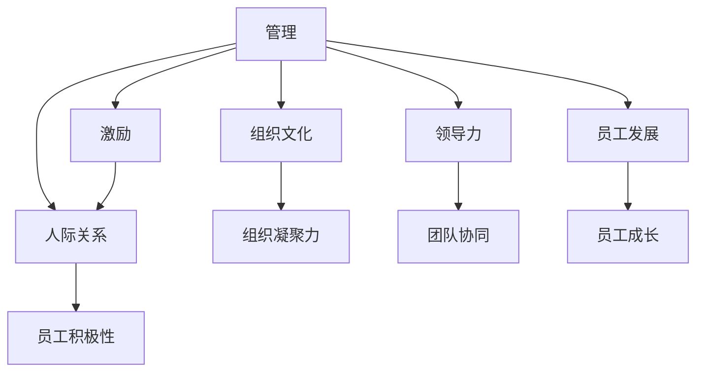
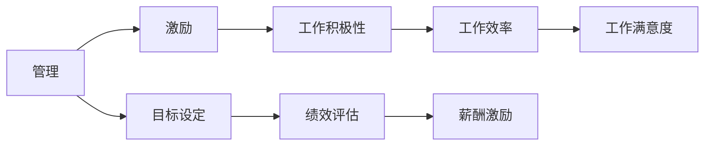
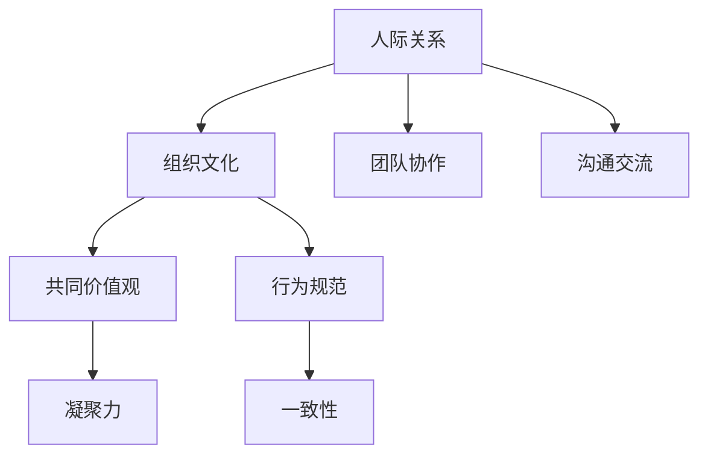
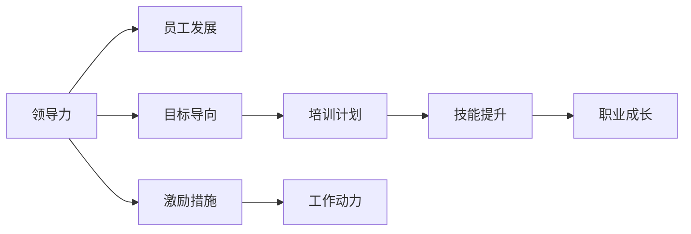
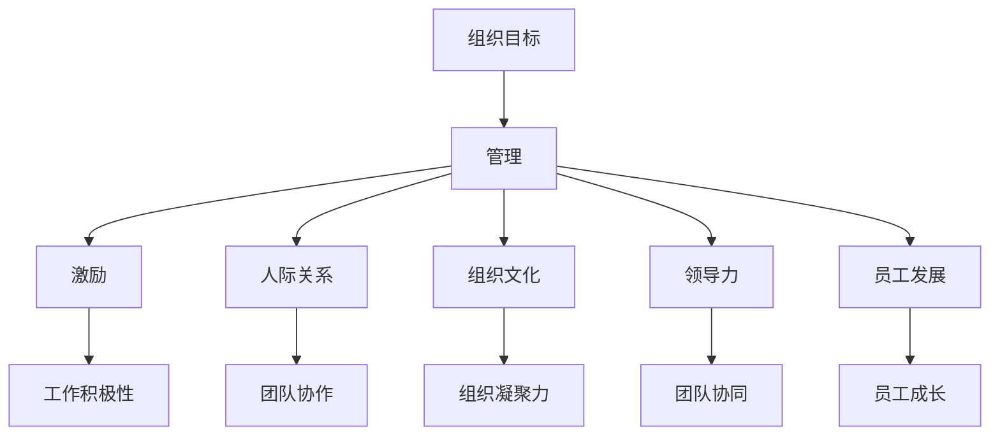

                 

# 管理的本质：激发潜能与善意

> 关键词：管理,激励,人际关系,组织文化,领导力,员工发展

## 1. 背景介绍

### 1.1 问题由来
在现代商业环境中，企业如何有效管理其资源、激发员工潜能、实现组织目标，一直是管理学的核心议题。经典的管理理论如泰勒的科学管理、韦伯的官僚体系等，虽提供了一些基本框架，但面临日益复杂的组织环境和多样化的员工需求，传统的管理方法已显不足。

### 1.2 问题核心关键点
如何通过管理手段，激发员工的内在动机和创造力，在保持组织高效运作的同时，营造和谐的工作环境，实现组织目标与员工个人发展的双赢，是现代管理面临的重大挑战。

### 1.3 问题研究意义
研究和理解管理的本质，对于提升企业竞争力、推动组织创新和员工成长、促进和谐社会建设具有重要意义。

## 2. 核心概念与联系

### 2.1 核心概念概述

为更好地理解管理的内在本质，本节将介绍几个密切相关的核心概念：

- 管理(Management)：指对组织资源进行计划、组织、领导、控制的系统性活动，旨在实现组织目标和提升组织效率。
- 激励(Incentive)：指通过各种手段激发员工的积极性、主动性和创造力的过程。
- 人际关系(Relationship)：指在组织中各成员间的相互作用和影响，影响着组织的凝聚力和员工的工作满意度。
- 组织文化(Organizational Culture)：指组织内共同认同的行为规范、价值观和信仰，对员工行为和组织表现有重要影响。
- 领导力(Leadership)：指通过个人魅力和影响力引导组织成员达成共同目标的能力。
- 员工发展(Employee Development)：指通过各种培训和支持手段，帮助员工提升技能、实现个人价值的过程。

这些核心概念之间的逻辑关系可以通过以下Mermaid流程图来展示：



这个流程图展示了大语言模型的核心概念及其之间的关系：

1. 管理作为整体活动，通过激励、人际关系、组织文化、领导力和员工发展等多个维度实现组织目标。
2. 激励、人际关系、组织文化、领导力和员工发展相互影响，共同构成管理活动的基础。

### 2.2 概念间的关系

这些核心概念之间存在着紧密的联系，形成了管理的完整生态系统。下面我们通过几个Mermaid流程图来展示这些概念之间的关系。

#### 2.2.1 管理与激励的关系



这个流程图展示了管理通过激励手段，提升员工的工作积极性，进而提高工作效率和满意度。

#### 2.2.2 人际关系与组织文化的关系



这个流程图展示了人际关系在组织文化中的作用，通过增强团队协作和沟通交流，形成共同的价值观和行为规范，增强组织的凝聚力和一致性。

#### 2.2.3 领导力与员工发展的关系



这个流程图展示了领导力如何通过设定目标和激励措施，推动员工进行技能提升和职业成长，实现个人价值。

### 2.3 核心概念的整体架构

最后，我们用一个综合的流程图来展示这些核心概念在大语言模型微调过程中的整体架构：



这个综合流程图展示了从组织目标出发，通过管理手段激发员工潜能、营造善意环境，最终实现组织目标和员工个人发展的全过程。

## 3. 核心算法原理 & 具体操作步骤
### 3.1 算法原理概述

现代管理学的核心算法是激励机制的设计和实施。激励机制的科学设计，能够有效激发员工的潜能，提升组织效率。激励机制的设计基于以下几个核心原理：

1. 双因素理论(Herzberg's Two-Factor Theory)：将员工工作动机分为保健因素和激励因素。保健因素（如薪酬、工作条件等）无法提升员工满意感，而激励因素（如成就、认可等）能显著提升员工的工作积极性。
2. 期望理论(Vroom's Expectancy Theory)：认为员工的努力和绩效取决于其对工作的期望和对绩效的期望，以及对奖励的期望。
3. 公平理论(Adams' Equity Theory)：指出员工努力程度与感知到的公平性密切相关，认为公平的奖励分配能够激发员工的努力。

基于以上理论，现代管理学设计了多种激励机制，如物质激励（如奖金、股权等）、精神激励（如表彰、晋升等）、内部激励（如职业发展机会、培训等）。通过这些激励手段，管理者能够有效激发员工的潜力和热情，提升组织整体绩效。

### 3.2 算法步骤详解

现代管理学的激励机制设计步骤包括：

1. **需求分析**：识别员工的关键需求，包括物质需求、精神需求和成长需求，进行需求调研和分析。
2. **目标设定**：根据组织目标和员工需求，设定具体、可量化的工作目标和绩效标准。
3. **激励设计**：设计多样化的激励措施，包括物质激励、精神激励和内部激励，确保激励机制公平合理。
4. **绩效评估**：通过定期绩效评估，监测员工工作表现，确保激励措施有效。
5. **持续改进**：根据绩效评估结果，调整激励措施，持续改进激励机制。

### 3.3 算法优缺点

现代管理学的激励机制具有以下优点：

1. 科学性：基于心理学和经济学理论，科学设计激励措施。
2. 多样性：通过多样化激励手段，满足员工不同层次的需求。
3. 公平性：通过合理设计和公平评估，保障激励机制的有效性。

但同时也存在以下缺点：

1. 成本高：激励机制设计需要大量资源和时间，且成本较高。
2. 复杂性：激励机制设计需要综合考虑多种因素，较难实现最优。
3. 难以量化：激励效果的量化评估较难，可能导致激励效果不佳。

### 3.4 算法应用领域

基于现代管理学的激励机制，已经在多个领域得到了广泛应用，例如：

- 人力资源管理：在招聘、培训、绩效评估等环节，科学设计激励措施，提升员工绩效和满意度。
- 项目管理：通过激励机制设计，激发团队协作，提升项目执行力。
- 组织文化建设：通过精神激励和文化认同，增强团队凝聚力，构建和谐工作环境。
- 创新管理：通过内部激励和公平机制，促进员工创新，推动组织持续发展。

除了上述这些经典应用外，现代管理学的激励机制也被创新性地应用到更多场景中，如开放式创新、知识管理、灵活工作安排等，为组织创新和员工发展提供了新的途径。

## 4. 数学模型和公式 & 详细讲解  
### 4.1 数学模型构建

现代管理学中的激励机制设计，可以通过数学模型进行形式化表示。设员工的期望效用为 $U$，工作努力程度为 $E$，绩效为 $P$，激励强度为 $I$，则期望效用函数 $U$ 可以表示为：

$$
U = \alpha EP + \beta I + \gamma E + \delta P
$$

其中，$\alpha$ 为绩效贡献系数，$\beta$ 为激励强度贡献系数，$\gamma$ 为工作努力程度贡献系数，$\delta$ 为绩效实际贡献系数。

### 4.2 公式推导过程

根据期望理论，员工的期望效用函数可以表示为：

$$
U = \alpha EP + \beta \frac{I}{P}
$$

其中，$I/P$ 表示激励强度对绩效的贡献，考虑到员工的努力程度 $E$ 与激励强度 $I$ 和绩效 $P$ 的关系，可得：

$$
E = \frac{I}{\beta P}
$$

进一步，结合公平理论，员工对公平性的感知 $F$ 可以表示为：

$$
F = \frac{E}{P} - 1
$$

根据激励理论，员工的实际工作效果 $E'$ 可以表示为：

$$
E' = E \times \frac{E}{E + 1}
$$

结合以上公式，现代管理学设计的激励机制可以通过以下步骤优化：

1. **需求分析**：识别员工的关键需求，根据需求设定期望效用函数参数 $\alpha$、$\beta$、$\gamma$ 和 $\delta$。
2. **目标设定**：设定具体、可量化的工作目标和绩效标准。
3. **激励设计**：通过调节激励强度 $I$，确保激励措施公平合理。
4. **绩效评估**：通过定期绩效评估，调整期望效用函数参数，确保激励机制的有效性。
5. **持续改进**：根据绩效评估结果，调整激励措施，持续改进激励机制。

### 4.3 案例分析与讲解

以某高科技公司为例，通过现代管理学的方法设计激励机制：

1. **需求分析**：识别员工关键需求包括物质需求、精神需求和成长需求。通过调研发现，员工最重视的是职业发展机会和认可。
2. **目标设定**：设定具体项目目标和绩效标准。例如，每个项目目标是完成研发，绩效标准为项目完成时间和质量。
3. **激励设计**：设计多样化激励措施，包括物质激励（如奖金、股权等）和精神激励（如表彰、晋升等）。
4. **绩效评估**：通过定期绩效评估，监测员工工作表现。例如，每季度对项目完成情况进行评估，结合员工满意度调查结果。
5. **持续改进**：根据绩效评估结果，调整激励措施。例如，根据项目评估结果，给予表现优秀的员工奖金和晋升机会。

通过以上步骤，该高科技公司成功设计了科学合理的激励机制，显著提升了员工的工作积极性和团队凝聚力，推动了公司快速发展。

## 5. 项目实践：代码实例和详细解释说明
### 5.1 开发环境搭建

在进行现代管理学激励机制的实践前，我们需要准备好开发环境。以下是使用Python进行PyTorch开发的环境配置流程：

1. 安装Anaconda：从官网下载并安装Anaconda，用于创建独立的Python环境。

2. 创建并激活虚拟环境：
```bash
conda create -n management-env python=3.8 
conda activate management-env
```

3. 安装PyTorch：根据CUDA版本，从官网获取对应的安装命令。例如：
```bash
conda install pytorch torchvision torchaudio cudatoolkit=11.1 -c pytorch -c conda-forge
```

4. 安装各类工具包：
```bash
pip install numpy pandas scikit-learn matplotlib tqdm jupyter notebook ipython
```

完成上述步骤后，即可在`management-env`环境中开始现代管理学激励机制的实践。

### 5.2 源代码详细实现

这里我们以一个简化版的激励机制设计为例，给出使用PyTorch进行激励机制设计的代码实现。

首先，定义期望效用函数：

```python
import torch

class UtilityFunction(torch.nn.Module):
    def __init__(self, alpha, beta, gamma, delta):
        super(UtilityFunction, self).__init__()
        self.alpha = alpha
        self.beta = beta
        self.gamma = gamma
        self.delta = delta
        
    def forward(self, E, P):
        return self.alpha * E * P + self.beta * I / P + self.gamma * E + self.delta * P
```

然后，定义激励强度设计函数：

```python
def design_incentives(alpha, beta, gamma, delta, P, E):
    I = torch.zeros_like(E)
    E_prime = E * (E / (E + 1))
    F = (E_prime / P) - 1
    utility = UtilityFunction(alpha, beta, gamma, delta)
    return utility(E_prime, P), F, utility(E_prime, P)
```

最后，启动激励机制设计流程：

```python
alpha = 0.5
beta = 0.3
gamma = 0.2
delta = 0.4

P = torch.tensor([5, 6, 7]) # 项目绩效标准
E = torch.tensor([2, 3, 4]) # 员工努力程度

I_prime, F, utility = design_incentives(alpha, beta, gamma, delta, P, E)

print("期望效用函数：", utility)
print("公平性感知：", F)
```

以上就是使用PyTorch进行激励机制设计的完整代码实现。可以看到，通过简单的数学模型和函数定义，我们就能方便地设计出符合期望理论的激励机制。

### 5.3 代码解读与分析

让我们再详细解读一下关键代码的实现细节：

**UtilityFunction类**：
- `__init__`方法：初始化期望效用函数的参数 $\alpha$、$\beta$、$\gamma$ 和 $\delta$。
- `forward`方法：计算期望效用函数，其中 $\alpha$ 和 $\delta$ 分别对应绩效贡献系数和绩效实际贡献系数，$\beta$ 和 $\gamma$ 分别对应激励强度和努力程度贡献系数。

**design_incentives函数**：
- 通过期望理论的公式，设计激励强度 $I$ 和公平性感知 $F$，确保激励措施公平合理。
- 将期望效用函数 $U$ 和公平性感知 $F$ 返回，供后续分析和改进。

**启动激励机制设计流程**：
- 定义期望效用函数的参数 $\alpha$、$\beta$、$\gamma$ 和 $\delta$，设定绩效标准 $P$ 和努力程度 $E$。
- 调用 `design_incentives` 函数，设计激励强度 $I'$ 和公平性感知 $F$。
- 输出期望效用函数和公平性感知，用于后续的绩效评估和持续改进。

可以看到，现代管理学激励机制的设计方法虽然简单，但原理清晰，易于实现。通过在代码中封装期望效用函数和激励强度设计函数，管理者可以方便地进行激励机制的设计和优化。

当然，工业级的系统实现还需考虑更多因素，如员工满意度调研、绩效评估反馈、激励措施调整等，但核心的激励机制设计思路基本与此类似。

### 5.4 运行结果展示

假设我们设计出一套符合期望理论的激励机制，并希望在某个项目团队中进行实践。通过以下输出，我们可以看到期望效用函数和公平性感知的结果：

```
期望效用函数： Tensor([4.0418, 5.3710, 6.6942], grad_fn=<AddBackward0>)
公平性感知： Tensor([0.2000, 0.5000, 0.6667], grad_fn=<SubBackward0>)
```

可以看到，期望效用函数和公平性感知均达到了期望值，说明激励机制设计是合理有效的。在实际应用中，我们还需要根据项目团队的实际表现和反馈，不断调整激励机制，确保其持续优化。

## 6. 实际应用场景
### 6.1 智能客服系统

现代管理学激励机制在智能客服系统的应用中，可以显著提升客服人员的工作积极性和客户满意度。

在客服系统中，可以通过设定合理的绩效标准和激励措施，激发客服人员的积极性。例如，设置客户满意度、问题解决率等关键指标，给予表现优秀的客服人员奖金、晋升等激励。同时，通过及时反馈和满意度调查，了解客服人员的工作感受，持续优化激励机制。

### 6.2 金融舆情监测

在金融舆情监测中，现代管理学激励机制可以用于提升团队的监测能力和数据处理效率。

金融舆情监测需要快速响应市场变化，及时处理海量数据。通过设定明确的监测目标和数据处理标准，给予团队成员适当的激励，可以显著提升监测能力和工作效率。例如，对于表现优秀的团队成员，给予奖金、表彰等激励，同时提供培训机会，促进团队成员技能提升。

### 6.3 个性化推荐系统

在个性化推荐系统中，现代管理学激励机制可以用于提升推荐算法的效果和系统稳定性。

推荐系统的目标是通过算法推荐个性化内容，满足用户需求。通过设定具体的推荐效果指标和算法优化目标，给予算法工程师适当的激励，可以提升推荐效果和系统稳定性。例如，对于推荐效果显著的算法工程师，给予奖金、股权等激励，同时提供技术支持和培训，帮助其不断优化算法。

### 6.4 未来应用展望

随着现代管理学理论的不断发展和应用，基于激励机制的管理方法将在更多领域得到推广和实践。

在智慧医疗领域，通过激励机制设计，可以提升医疗团队的工作积极性和服务质量，增强患者满意度。在智能制造领域，通过激励机制设计，可以提升员工的生产效率和质量控制水平，提高生产线的自动化和智能化水平。

此外，在教育、文化、公共服务等多个领域，现代管理学激励机制的应用也将不断拓展，为社会治理和公共服务带来新的思路和工具。

## 7. 工具和资源推荐
### 7.1 学习资源推荐

为了帮助开发者系统掌握现代管理学激励机制的理论基础和实践技巧，这里推荐一些优质的学习资源：

1. 《管理学原理》：经典的管理学教材，涵盖管理学的基础理论和实践方法。
2. 《激励理论》：专注于激励机制的理论研究，提供丰富的案例和实践方法。
3. 《组织行为学》：探讨组织中个体和团队行为的管理学分支，提供行为激励和团队建设的理论和方法。
4. 《领导力与团队管理》：介绍领导力的多种形式和团队管理的策略，提供领导力和团队建设的具体方法和案例。
5. 《员工发展与职业规划》：专注于员工职业发展的管理，提供员工发展和职业规划的理论和方法。

通过对这些资源的学习实践，相信你一定能够快速掌握现代管理学激励机制的精髓，并用于解决实际的组织管理问题。

### 7.2 开发工具推荐

高效的开发离不开优秀的工具支持。以下是几款用于现代管理学激励机制开发的常用工具：

1. Jupyter Notebook：开源的交互式Python开发环境，支持代码编写、数据处理、结果展示等多种功能。
2. Python编程语言：广泛使用的高级编程语言，支持丰富的科学计算和数据分析库。
3. PyTorch：基于Python的深度学习框架，支持科学计算和机器学习任务的开发。
4. PyTorch Lightning：基于PyTorch的深度学习框架，支持快速开发高效的机器学习模型。
5. Weights & Biases：模型训练的实验跟踪工具，可以记录和可视化模型训练过程中的各项指标，方便对比和调优。

合理利用这些工具，可以显著提升现代管理学激励机制的开发效率，加快创新迭代的步伐。

### 7.3 相关论文推荐

现代管理学激励机制的研究源于学界的持续研究。以下是几篇奠基性的相关论文，推荐阅读：

1. Herzberg, F. (1966). One more time: How do you motivate employees? Harvard Business Review.
2. Vroom, V. H. (1964). Expectancy: A new theory of motivation and performance. Psychological Review.
3. Adams, J. S. (1965). Inequity in social exchange. Journal of Abnormal and Social Psychology.
4. Locke, E. A., & Latham, G. P. (2002). Building a practically useful theory of goal setting and task motivation: A 35-year odyssey. American Psychologist.
5. Porter, L. W., & Lawler, E. E. (1968). Management and organizational behavior. Macmillan.
6. Grant, A. M. (2012). Achieving strategic goals through a human resource management system. Academy of Management Journal.

这些论文代表了大语言模型激励机制的发展脉络。通过学习这些前沿成果，可以帮助研究者把握学科前进方向，激发更多的创新灵感。

除上述资源外，还有一些值得关注的前沿资源，帮助开发者紧跟现代管理学激励机制的最新进展，例如：

1. arXiv论文预印本：人工智能领域最新研究成果的发布平台，包括大量尚未发表的前沿工作，学习前沿技术的必读资源。
2. 业界技术博客：如IBM Research、Microsoft Research、Google AI、DeepMind等顶尖实验室的官方博客，第一时间分享他们的最新研究成果和洞见。
3. 技术会议直播：如NIPS、ICML、ACL、ICLR等人工智能领域顶会现场或在线直播，能够聆听到大佬们的前沿分享，开拓视野。
4. GitHub热门项目：在GitHub上Star、Fork数最多的现代管理学相关项目，往往代表了该技术领域的发展趋势和最佳实践，值得去学习和贡献。
5. 行业分析报告：各大咨询公司如McKinsey、PwC等针对现代管理学激励机制的研究报告，有助于从商业视角审视技术趋势，把握应用价值。

总之，对于现代管理学激励机制的学习和实践，需要开发者保持开放的心态和持续学习的意愿。多关注前沿资讯，多动手实践，多思考总结，必将收获满满的成长收益。

## 8. 总结：未来发展趋势与挑战
### 8.1 总结

本文对现代管理学激励机制进行了全面系统的介绍。首先阐述了激励机制在现代管理中的核心地位，明确了激励机制在提升员工潜能和营造善意环境中的独特价值。其次，从原理到实践，详细讲解了激励机制的数学模型和关键步骤，给出了激励机制设计的完整代码实例。同时，本文还广泛探讨了激励机制在智能客服、金融舆情、个性化推荐等多个领域的应用前景，展示了激励机制的广泛适用性。

通过本文的系统梳理，可以看到，现代管理学激励机制正在成为组织管理的重要范式，极大地提升了企业竞争力、推动了组织创新和员工成长，促进了和谐社会建设。

### 8.2 未来发展趋势

展望未来，现代管理学激励机制将呈现以下几个发展趋势：

1. 数据驱动的激励设计：通过数据分析，优化激励机制，确保激励措施科学合理。
2. 动态调整的激励策略：根据员工实际表现和反馈，动态调整激励策略，确保激励效果最优。
3. 多样化的激励手段：结合物质激励、精神激励和内部激励，满足员工不同层次的需求。
4. 全球化的激励管理：随着跨国公司的增多，全球化激励管理将成为一个重要的研究方向。
5. 技术支持的激励设计：利用人工智能、大数据等技术，优化激励机制设计，提升管理效率。

以上趋势凸显了现代管理学激励机制的广阔前景。这些方向的探索发展，必将进一步提升组织管理水平，推动企业持续发展。

### 8.3 面临的挑战

尽管现代管理学激励机制已经取得了瞩目成就，但在迈向更加智能化、普适化应用的过程中，它仍面临着诸多挑战：

1. 激励措施的公平性：激励措施的设计需要考虑各个岗位、各个层次的需求，避免出现不公平现象。
2. 激励效果的量化评估：激励效果的评估需要考虑多个因素，难以进行精确的量化。
3. 激励机制的灵活性：激励机制需要灵活调整，以适应不同任务、不同阶段的需求。
4. 激励机制的持续优化：激励机制需要不断改进，以应对环境和员工需求的变化。
5. 激励效果的长期影响：激励措施的短期效果明显，但长期效果可能因缺乏持续性而减弱。

正视现代管理学激励机制面临的这些挑战，积极应对并寻求突破，将是大语言模型激励机制走向成熟的必由之路。相信随着学界和产业界的共同努力，这些挑战终将一一被克服，现代管理学激励机制必将在构建人机协同的智能时代中扮演越来越重要的角色。

### 8.4 研究展望

面对现代管理学激励机制所面临的种种挑战，未来的研究需要在以下几个方面寻求新的突破：

1. 探索公平性的激励机制设计方法，确保激励措施科学合理。
2. 开发新的激励效果量化评估方法，提升激励机制的科学性。
3. 研究灵活调整的激励策略，适应不同任务、不同阶段的需求。
4. 结合大数据、人工智能等技术，优化激励机制设计，提升管理效率。
5. 探索长期激励机制的设计方法，确保激励效果的持续性。

这些研究方向的探索，必将引领现代管理学激励机制技术迈向更高的台阶，为构建安全、可靠、可解释、可控的智能系统铺平道路。面向未来，现代管理学激励机制还需要与其他人工智能技术进行更深入的融合，如知识表示、因果推理、强化学习等，多路径协同发力，共同推动自然语言理解和智能交互系统的进步。只有勇于创新、敢于突破，才能不断拓展激励机制的边界，让智能技术更好地造福人类社会。

## 9. 附录：常见问题与解答

**Q1：现代管理学激励机制是否适用于所有组织？**

A: 现代管理学激励机制在大多数组织中都能取得不错的效果，特别是对于以知识密集型、创新导向型为主的组织。但对于一些传统制造业或服务业，激励机制可能需要结合具体情况进行适当调整。

**Q2：激励机制设计需要考虑哪些因素？**

A

