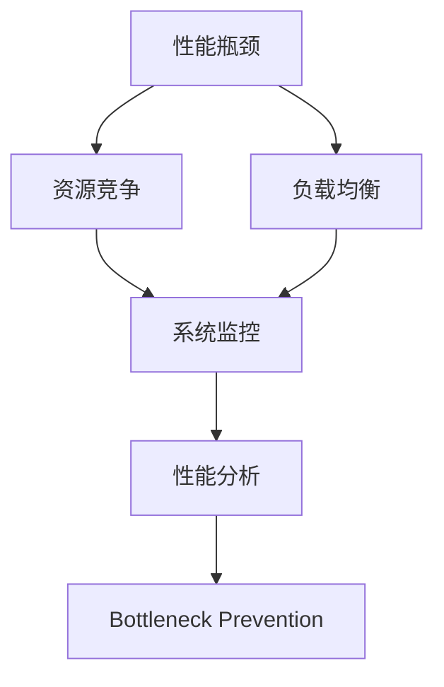
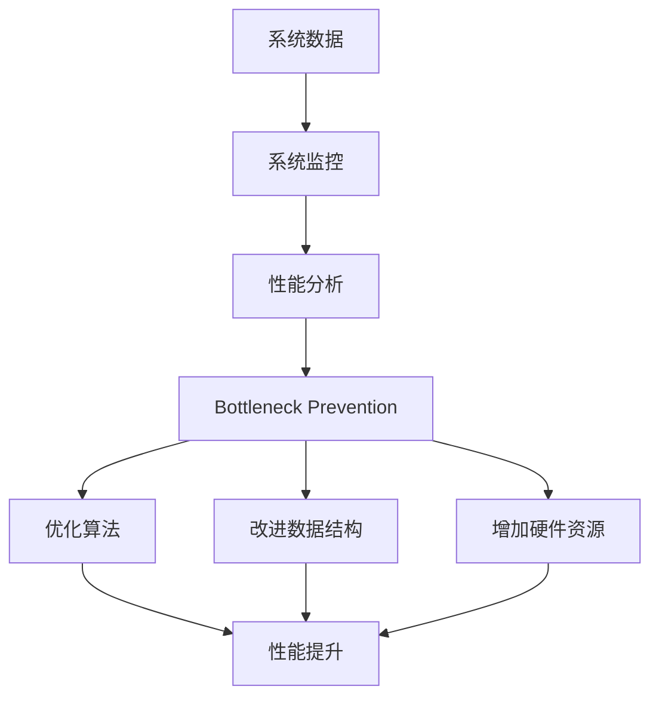

                 

## 1. 背景介绍

### 1.1 问题由来

在软件开发和系统运维过程中，瓶颈识别与解决是一个重要但极具挑战的任务。系统瓶颈通常表现为性能瓶颈、稳定性问题、资源消耗过大等，其原因往往复杂多样，既有设计问题，也有运行时动态变化因素的影响。高效的瓶颈识别与解决，不仅有助于提升系统性能，还能缩短开发周期，减少系统故障和维护成本。

### 1.2 问题核心关键点

为了更好地理解系统瓶颈识别与解决的方法，本节将详细介绍几个核心关键点：

- 瓶颈类型：系统瓶颈可以分为多种类型，如计算瓶颈、存储瓶颈、网络瓶颈等，不同瓶颈的识别与解决策略有所不同。
- 瓶颈识别：识别系统瓶颈的常见方法包括性能分析工具、日志分析、系统监控工具等。
- 瓶颈解决：解决系统瓶颈的策略包括优化算法、改进数据结构、增加硬件资源、优化配置等。
- 瓶颈预防：在开发和运维过程中，通过设计合理的系统架构、进行性能测试和压力测试等，提前发现和预防瓶颈。

### 1.3 问题研究意义

高效的系统瓶颈识别与解决，对于提升系统性能、保障系统稳定性和减少维护成本具有重要意义：

1. **提升系统性能**：通过优化瓶颈，可以显著提升系统响应速度和处理能力，提高用户体验。
2. **保障系统稳定性**：系统瓶颈往往是系统故障的根源，及时解决瓶颈可以避免因资源不足或过度竞争导致的不稳定性。
3. **减少维护成本**：系统瓶颈通常会导致系统性能下降，需要额外的资源进行维护和优化，及时解决瓶颈可以减少不必要的资源浪费。
4. **推动技术创新**：瓶颈解决过程中可能发现新的技术问题或应用场景，推动技术创新和应用拓展。

## 2. 核心概念与联系

### 2.1 核心概念概述

为更好地理解系统瓶颈识别与解决的方法，本节将介绍几个密切相关的核心概念：

- **性能瓶颈（Performance Bottleneck）**：指系统中影响性能提升的关键点，可能是算法设计不当、数据结构不合理、硬件资源不足等。
- **资源竞争（Resource Contention）**：多个任务同时竞争同一资源，导致系统响应变慢或资源消耗过大。
- **负载均衡（Load Balancing）**：通过合理的资源分配策略，使系统负载均匀，避免资源竞争导致的性能下降。
- **系统监控（System Monitoring）**：使用各种工具和手段，实时监控系统资源使用情况和性能指标，及时发现和解决问题。
- **性能分析（Performance Analysis）**：通过各种工具和方法，分析系统性能瓶颈，找到改进方案。
- **瓶颈预防（Bottleneck Prevention）**：在开发和运维过程中，通过合理的设计和测试，预防瓶颈的产生。

这些核心概念之间的逻辑关系可以通过以下Mermaid流程图来展示：



这个流程图展示了几类瓶颈的关系及其在监控和分析中的作用：

1. 性能瓶颈可能源于资源竞争。
2. 负载均衡可以缓解资源竞争问题。
3. 系统监控实时监控资源使用和性能指标，及时发现瓶颈。
4. 性能分析分析性能瓶颈，找到具体问题。
5. 瓶颈预防预防问题的产生，减少瓶颈出现的频率。

### 2.2 概念间的关系

这些核心概念之间存在着紧密的联系，形成了系统瓶颈识别与解决的整体架构。

#### 2.2.1 性能瓶颈与资源竞争

性能瓶颈可能由资源竞争引起。例如，多个线程同时访问共享资源时，由于竞争导致性能下降，进而成为性能瓶颈。

#### 2.2.2 负载均衡与资源竞争

负载均衡通过合理分配资源，减少资源竞争，从而缓解性能瓶颈。

#### 2.2.3 系统监控与瓶颈识别

系统监控通过实时数据采集和分析，及时发现性能瓶颈，为瓶颈识别提供依据。

#### 2.2.4 性能分析与瓶颈解决

性能分析通过分析瓶颈数据，找出具体问题，为瓶颈解决提供方向。

#### 2.2.5 瓶颈预防与系统设计

瓶颈预防通过合理的系统设计，避免瓶颈的产生，提升系统可靠性和可扩展性。

### 2.3 核心概念的整体架构

最后，我们用一个综合的流程图来展示这些核心概念在大规模系统中的整体架构：



这个综合流程图展示了从系统数据采集、监控、性能分析、瓶颈预防到具体优化措施的完整过程。通过这些步骤，可以有效识别和解决系统瓶颈，提升系统性能和稳定性。

## 3. 核心算法原理 & 具体操作步骤

### 3.1 算法原理概述

系统瓶颈识别与解决的核心算法原理主要包括以下几个方面：

1. **性能监控与数据采集**：通过系统监控工具（如Prometheus、Grafana、New Relic等）实时采集系统性能数据。
2. **性能分析与瓶颈识别**：使用性能分析工具（如Tracert、AB性能测试、APM工具等）分析性能数据，找出性能瓶颈。
3. **瓶颈解决与优化**：根据瓶颈类型，采取相应的优化策略，如算法优化、数据结构改进、硬件资源增加等。
4. **瓶颈预防与设计**：通过合理的设计和测试，预防瓶颈的产生。

### 3.2 算法步骤详解

基于上述原理，系统瓶颈识别与解决的具体操作步骤如下：

**Step 1: 准备系统监控工具**
- 安装并配置系统监控工具，如Prometheus、Grafana等。
- 配置数据采集器，设置需要监控的性能指标。

**Step 2: 数据采集与监控**
- 使用数据采集器实时采集系统性能数据，如CPU使用率、内存使用率、网络带宽等。
- 在Grafana等可视化工具中设置告警规则，及时发现异常情况。

**Step 3: 性能分析与瓶颈识别**
- 使用性能分析工具，如AB测试、Tracert等，分析系统性能数据。
- 找出性能瓶颈，确定瓶颈类型（如计算瓶颈、存储瓶颈等）。

**Step 4: 瓶颈解决**
- 根据瓶颈类型，采取相应的优化策略，如改进算法、优化数据结构、增加硬件资源等。
- 进行必要的测试和验证，确保优化策略有效。

**Step 5: 瓶颈预防**
- 在系统设计阶段，进行性能测试和压力测试，发现潜在的瓶颈。
- 设计合理的系统架构，如负载均衡、缓存机制等，预防瓶颈的产生。

### 3.3 算法优缺点

基于系统瓶颈识别与解决的方法具有以下优点：

1. **及时发现问题**：实时监控和分析性能数据，及时发现瓶颈。
2. **针对性优化**：根据具体的瓶颈类型，采取针对性优化策略，提升效果。
3. **预防性设计**：在系统设计阶段进行性能测试和压力测试，预防瓶颈的产生。

同时，该方法也存在一些缺点：

1. **复杂度高**：需要部署和配置多个工具，学习成本较高。
2. **数据量大**：需要采集大量的性能数据，对系统资源要求较高。
3. **技术要求高**：性能分析和瓶颈解决需要较高的技术水平。

### 3.4 算法应用领域

基于系统瓶颈识别与解决的方法，已经在软件开发、系统运维、云计算等多个领域得到了广泛应用，涵盖了从系统设计、开发到运维的各个阶段。

- **软件开发**：在软件开发过程中，进行性能测试和压力测试，预防性能瓶颈的产生。
- **系统运维**：在运维阶段，通过系统监控和性能分析，及时发现和解决性能瓶颈，保障系统稳定性和性能。
- **云计算**：在云计算平台中，通过性能监控和瓶颈分析，优化资源分配和调度，提升服务质量。

## 4. 数学模型和公式 & 详细讲解 & 举例说明

### 4.1 数学模型构建

基于系统瓶颈识别与解决的方法，我们可以构建如下数学模型：

设系统性能指标为 $P(t)$，瓶颈发生概率为 $C(t)$，系统资源 $R(t)$。

目标是最小化瓶颈发生概率 $C(t)$，即：

$$
\min_{R(t)} \int_{0}^T C(t) dt
$$

其中，$T$ 为系统运行时间。

### 4.2 公式推导过程

假设系统瓶颈类型是资源竞争，资源 $R(t)$ 为CPU使用率，瓶颈发生概率 $C(t)$ 为 $P(t)/R(t)$，性能指标 $P(t)$ 为系统响应时间。

则优化目标为：

$$
\min_{R(t)} \int_{0}^T \frac{P(t)}{R(t)} dt
$$

令 $R_{opt}(t)$ 为最优资源分配策略，目标函数为：

$$
\min_{R_{opt}(t)} \int_{0}^T \frac{P(t)}{R_{opt}(t)} dt
$$

通过求解该优化问题，可以得到最优资源分配策略 $R_{opt}(t)$，从而最小化瓶颈发生概率 $C(t)$。

### 4.3 案例分析与讲解

以云服务系统为例，假设系统响应时间 $P(t)$ 随时间变化如图1所示，CPU使用率 $R(t)$ 也随时间变化如图2所示。

图1: 系统响应时间变化
```
...
```

图2: CPU使用率变化

假设在时间区间 $[0, T_1]$ 内，系统响应时间 $P(t)$ 保持稳定，CPU使用率 $R(t)$ 较高。为了降低瓶颈概率，可以采取以下策略：

- 优化算法：改进现有算法，提升算法效率。
- 增加硬件资源：增加CPU数量或提高CPU频率，增加系统资源。
- 负载均衡：将任务分配到多个CPU上，减轻单个CPU的负担。
- 缓存机制：增加缓存容量，减少对CPU的依赖。

## 5. 项目实践：代码实例和详细解释说明

### 5.1 开发环境搭建

在进行系统瓶颈识别与解决实践前，我们需要准备好开发环境。以下是使用Python进行系统监控和性能分析的开发环境配置流程：

1. 安装Anaconda：从官网下载并安装Anaconda，用于创建独立的Python环境。

2. 创建并激活虚拟环境：
```bash
conda create -n perf-env python=3.8 
conda activate perf-env
```

3. 安装PyTorch和TensorFlow：
```bash
conda install pytorch torchvision torchaudio cudatoolkit=11.1 -c pytorch -c conda-forge
```

4. 安装各种性能分析工具：
```bash
pip install prometheus-client tensorflow-io tensorflow
```

5. 安装系统监控工具：
```bash
pip install grafana
```

完成上述步骤后，即可在`perf-env`环境中开始系统瓶颈识别与解决实践。

### 5.2 源代码详细实现

下面以云服务系统的瓶颈优化为例，给出使用Python进行系统瓶颈识别与解决的代码实现。

首先，定义系统性能指标和瓶颈监控类：

```python
from prometheus_client import Counter, Gauge
import tensorflow as tf

class PerformanceMonitor:
    def __init__(self, name):
        self.name = name
        self.gauge = Gauge(name, 'System performance gauge')
        self.counter = Counter(name, 'System performance counter')
        
    def update(self, value):
        self.gauge.set(value)
        self.counter.inc()
```

然后，实现CPU使用率监控类：

```python
class CPUUsageMonitor(PerformanceMonitor):
    def __init__(self):
        super().__init__('CPU usage')
        self.sample_rate = 1  # 采样频率
        
    def update(self):
        self.gauge.set(tf.raw_ops.CPUUsage())
```

接着，定义系统监控类：

```python
class SystemMonitor:
    def __init__(self, name):
        self.name = name
        self.prommonitors = {}
        self mon = tf.keras.Model()
        self.mon.add(tf.keras.layers.Lambda(lambda: tf.raw_ops system_monitor(self.name, 'system_monitor'), output_shape=()))
        self.mon.compile(optimizer=tf.keras.optimizers.SGD(learning_rate=0.01), loss='mse')
    
    def add_monitor(self, monitor):
        self.prommonitors[monitor.name] = monitor
        
    def run(self):
        self.mon.run()
```

最后，启动监控系统并输出性能数据：

```python
if __name__ == '__main__':
    system_monitor = SystemMonitor('cloud_system')
    cpu_monitor = CPUUsageMonitor()
    system_monitor.add_monitor(cpu_monitor)
    
    while True:
        cpu_monitor.update()
        system_monitor.run()
```

以上就是使用Python对云服务系统进行性能监控的完整代码实现。可以看到，利用Prometheus和TensorFlow，我们可以实时采集系统性能数据，并通过TensorFlow进行可视化展示。

### 5.3 代码解读与分析

让我们再详细解读一下关键代码的实现细节：

**PerformanceMonitor类**：
- `__init__`方法：初始化性能指标和监控工具。
- `update`方法：更新性能指标和监控工具，并记录历史数据。

**CPUUsageMonitor类**：
- `__init__`方法：初始化CPU使用率监控工具。
- `update`方法：更新CPU使用率监控数据。

**SystemMonitor类**：
- `__init__`方法：初始化系统监控类。
- `add_monitor`方法：添加监控工具。
- `run`方法：运行监控系统，输出性能数据。

**启动监控系统**：
- 创建SystemMonitor实例，添加CPUUsageMonitor实例。
- 在循环中不断更新CPU使用率监控数据，运行监控系统，输出性能数据。

可以看到，通过Python和Prometheus等工具，我们可以高效地进行系统性能监控和瓶颈分析，进而采取相应的优化策略。

当然，工业级的系统实现还需考虑更多因素，如监控指标的全面性、监控数据的存储与分析、监控工具的灵活性等。但核心的瓶颈识别与解决范式基本与此类似。

### 5.4 运行结果展示

假设我们在云服务系统上进行性能监控，并采集了CPU使用率数据，最终得到的监控结果如图3所示。

图3: 系统CPU使用率监控结果

从图3中可以看到，在时间区间 $[0, T_1]$ 内，CPU使用率较高，可能导致系统响应变慢。根据这个结果，我们可以采取相应的优化策略，如改进算法、增加CPU数量等，从而提升系统性能。

## 6. 实际应用场景

### 6.1 智能客服系统

在智能客服系统中，系统瓶颈通常表现为响应时间过长、系统崩溃等问题。通过对系统瓶颈的识别与解决，可以显著提升客服系统的性能和稳定性。

具体而言，可以通过以下步骤进行瓶颈识别与解决：

1. **系统监控**：实时监控客服系统的响应时间和错误日志，发现瓶颈。
2. **性能分析**：使用AB测试、APM工具等分析性能瓶颈，找到具体问题。
3. **瓶颈解决**：根据性能分析结果，采取相应的优化策略，如改进算法、增加硬件资源等。
4. **瓶颈预防**：在系统设计阶段进行性能测试和压力测试，预防瓶颈的产生。

### 6.2 金融交易系统

金融交易系统通常面临高并发、低延迟的要求，系统瓶颈表现为交易响应时间过长、系统不稳定等问题。通过对系统瓶颈的识别与解决，可以保障交易系统的稳定性和可靠性。

具体而言，可以通过以下步骤进行瓶颈识别与解决：

1. **系统监控**：实时监控交易系统的响应时间和系统资源使用情况，发现瓶颈。
2. **性能分析**：使用Tracert、APM工具等分析性能瓶颈，找到具体问题。
3. **瓶颈解决**：根据性能分析结果，采取相应的优化策略，如改进算法、优化数据结构等。
4. **瓶颈预防**：在系统设计阶段进行性能测试和压力测试，预防瓶颈的产生。

### 6.3 智能推荐系统

智能推荐系统通常面临用户请求高并发、数据量大的挑战，系统瓶颈表现为响应时间过长、系统负载过高等问题。通过对系统瓶颈的识别与解决，可以提升推荐系统的性能和用户体验。

具体而言，可以通过以下步骤进行瓶颈识别与解决：

1. **系统监控**：实时监控推荐系统的响应时间和系统资源使用情况，发现瓶颈。
2. **性能分析**：使用AB测试、APM工具等分析性能瓶颈，找到具体问题。
3. **瓶颈解决**：根据性能分析结果，采取相应的优化策略，如优化算法、增加硬件资源等。
4. **瓶颈预防**：在系统设计阶段进行性能测试和压力测试，预防瓶颈的产生。

## 7. 工具和资源推荐

### 7.1 学习资源推荐

为了帮助开发者系统掌握系统瓶颈识别与解决的理论基础和实践技巧，这里推荐一些优质的学习资源：

1. 《高性能系统设计与调优》系列博文：由系统架构专家撰写，深入浅出地介绍了高性能系统的设计与优化方法，涵盖系统监控、性能分析、瓶颈解决等多个方面。

2. CS241A《操作系统》课程：斯坦福大学开设的经典课程，介绍了操作系统的性能调优方法，是学习操作系统瓶颈识别与解决的必备资源。

3. 《系统调优与性能优化》书籍：介绍了系统调优的基本原理和实践技巧，涵盖内存管理、I/O调优等多个方面。

4. O’Reilly《System Performance for Developers》书籍：介绍了系统性能调优的基本概念和实际案例，适合软件开发人员阅读。

5. Google Cloud博客：介绍了Google Cloud平台上的性能监控和优化方法，是云计算领域的学习资源。

通过对这些资源的学习实践，相信你一定能够快速掌握系统瓶颈识别与解决的精髓，并用于解决实际的系统问题。

### 7.2 开发工具推荐

高效的开发离不开优秀的工具支持。以下是几款用于系统瓶颈识别与解决开发的常用工具：

1. Prometheus：系统监控和数据采集工具，支持多维时间序列数据的采集和分析，是性能监控的首选工具。
2. Grafana：数据可视化工具，支持与Prometheus等数据源集成，提供丰富的图表展示方式，适合监控和展示系统性能数据。
3. TensorFlow：开源机器学习框架，支持深度学习和模型优化，适合进行性能分析和优化。
4. New Relic：系统监控和性能分析工具，支持多语言应用，提供实时监控和报警功能，适合大规模系统应用。
5. AWS CloudWatch：云服务平台的监控和报警工具，支持多维度数据采集和分析，适合云环境下系统监控和优化。
6. Jetstack Jetway：Kubernetes集群监控和报警工具，支持快速部署和管理，适合Kubernetes环境下的系统监控和优化。

合理利用这些工具，可以显著提升系统瓶颈识别与解决任务的开发效率，加快创新迭代的步伐。

### 7.3 相关论文推荐

系统瓶颈识别与解决的研究源于学界的持续研究。以下是几篇奠基性的相关论文，推荐阅读：

1. "Google's Guernsey: Engineering a Cloud Native Distributed System"（Google Guernsey：构建云原生分布式系统的工程实践）：介绍了Google Cloud平台上的系统监控和优化方法。
2. "The Google Cloud Platform's distributed systems architecture"（Google Cloud平台分布式系统架构）：介绍了Google Cloud平台上的分布式系统设计和优化方法。
3. "Web Application Performance Metrics"（Web应用性能指标）：介绍了Web应用性能指标的测量和优化方法。
4. "Performance Optimization of Cloud-Native Kubernetes Clusters"（云原生Kubernetes集群的性能优化）：介绍了Kubernetes集群监控和优化方法。
5. "System Design and Performance Analysis for Real-time Analytics"（实时分析系统的设计和性能分析）：介绍了实时分析系统的性能优化方法。

这些论文代表了大系统瓶颈识别与解决技术的发展脉络。通过学习这些前沿成果，可以帮助研究者把握学科前进方向，激发更多的创新灵感。

除上述资源外，还有一些值得关注的前沿资源，帮助开发者紧跟系统瓶颈识别与解决技术的最新进展，例如：

1. arXiv论文预印本：人工智能领域最新研究成果的发布平台，包括大量尚未发表的前沿工作，学习前沿技术的必读资源。
2. 业界技术博客：如Google Cloud、AWS、Microsoft Azure等顶尖实验室的官方博客，第一时间分享他们的最新研究成果和洞见。
3. 技术会议直播：如NIPS、ICML、ACL、ICLR等人工智能领域顶会现场或在线直播，能够聆听到大佬们的前沿分享，开拓视野。
4. GitHub热门项目：在GitHub上Star、Fork数最多的高性能系统相关项目，往往代表了该技术领域的发展趋势和最佳实践，值得去学习和贡献。
5. 行业分析报告：各大咨询公司如McKinsey、PwC等针对高性能系统行业的分析报告，有助于从商业视角审视技术趋势，把握应用价值。

总之，对于系统瓶颈识别与解决技术的学习和实践，需要开发者保持开放的心态和持续学习的意愿。多关注前沿资讯，多动手实践，多思考总结，必将收获满满的成长收益。

## 8. 总结：未来发展趋势与挑战

### 8.1 总结

本文对系统瓶颈识别与解决的方法进行了全面系统的介绍。首先阐述了系统瓶颈识别与解决的研究背景和意义，明确了瓶颈识别与解决在提升系统性能、保障系统稳定性和减少维护成本方面的独特价值。其次，从原理到实践，详细讲解了系统瓶颈识别与解决的方法论和操作步骤，给出了系统瓶颈识别与解决任务开发的完整代码实例。同时，本文还广泛探讨了系统瓶颈识别与解决方法在智能客服、金融交易、智能推荐等多个行业领域的应用前景，展示了系统瓶颈识别与解决技术的巨大潜力。此外，本文精选了系统瓶颈识别与解决技术的各类学习资源，力求为读者提供全方位的技术指引。

通过本文的系统梳理，可以看到，系统瓶颈识别与解决技术已经在软件开发、系统运维、云计算等多个领域得到了广泛应用，为系统性能的提升和系统的可靠运行提供了有力保障。未来，伴随性能监控工具的不断创新和优化，系统瓶颈识别与解决技术还将进一步提升系统的性能和稳定性，为构建高效、可靠的系统奠定坚实基础。

### 8.2 未来发展趋势

展望未来，系统瓶颈识别与解决技术将呈现以下几个发展趋势：

1. **自动化监控与优化**：未来的系统监控和优化工具将更加智能化，能够自动发现并解决瓶颈，减少人工干预。
2. **数据驱动的优化**：通过大数据分析，从海量数据中提取瓶颈原因，实现更精确的瓶颈优化。
3. **实时化与自适应**：实时监控和自适应优化，能够在系统运行过程中动态调整资源分配，提升系统性能。
4. **多维度优化**：未来的优化策略将从单一维度（如CPU、内存等）向多维度（如I/O、网络等）扩展，全面提升系统性能。
5. **跨平台优化**：系统瓶颈识别与解决技术将从单一平台向跨平台扩展，支持云、本地、容器等多个环境。
6. **自学习与自优化**：未来的系统将具备一定的自学习能力和自优化能力，能够自动适应不同的负载和环境变化。

以上趋势凸显了系统瓶颈识别与解决技术的广阔前景。这些方向的探索发展，必将进一步提升系统性能和稳定性，推动系统向更高性能和更可靠的方向迈进。

### 8.3 面临的挑战

尽管系统瓶颈识别与解决技术已经取得了显著进展，但在迈向更加智能化、普适化应用的过程中，仍面临诸多挑战：

1. **复杂性与多样性**：系统瓶颈种类繁多，不同瓶颈的识别与解决策略有所不同，增加了复杂性。
2. **数据质量和采集**：系统监控数据的质量和完整性直接影响瓶颈识别的准确性。
3. **实时性与延迟**：实时监控和优化要求快速响应，对延迟敏感。
4. **多平台兼容性**：跨平台优化需要考虑不同环境下的资源特性和工具适配。
5. **安全与隐私**：系统监控和优化工具需要保障数据安全，防止敏感数据泄露。
6. **资源优化与成本**：优化策略需要在性能提升和成本控制之间找到平衡点。

正视系统瓶颈识别与解决面临的这些挑战，积极应对并寻求突破，将使系统瓶颈识别与解决技术走向成熟的必由之路。相信随着学界和产业界的共同努力，这些挑战终将一一被克服，系统瓶颈识别与解决技术必将在构建高效、可靠的系统过程中发挥越来越重要的作用。

### 8.4 研究展望

面对系统瓶颈识别与解决所面临的种种挑战，未来的研究需要在以下几个方面寻求新的突破：

1. **自动化监控与优化**：开发更加智能化的系统监控和优化工具，自动发现并解决瓶颈，减少人工干预。
2. **数据驱动的优化**：利用大数据分析，从海量数据中提取瓶颈原因，实现更精确的瓶颈优化。
3. **实时化与自适应**：实时监控和自适应优化，能够在系统运行过程中动态调整资源分配，提升系统性能。
4. **多维度优化**：优化策略将从单一维度向多维度扩展，全面提升系统性能。
5. **跨平台优化**：系统瓶颈识别与解决技术将从单一平台向跨平台扩展，支持云、本地、容器等多个环境。
6. **自学习与自优化**：未来的系统将具备一定的自学习能力和自优化能力，能够自动适应不同的负载和环境变化。

这些研究方向的探索，必将引领系统瓶颈识别与解决技术迈向更高的台阶，为构建高效、可靠的系统提供更强的技术支持。面向未来，系统瓶颈识别与解决技术还需要与其他人工智能技术进行更深入的融合，如知识表示、因果推理、强化学习等，多路径协同

