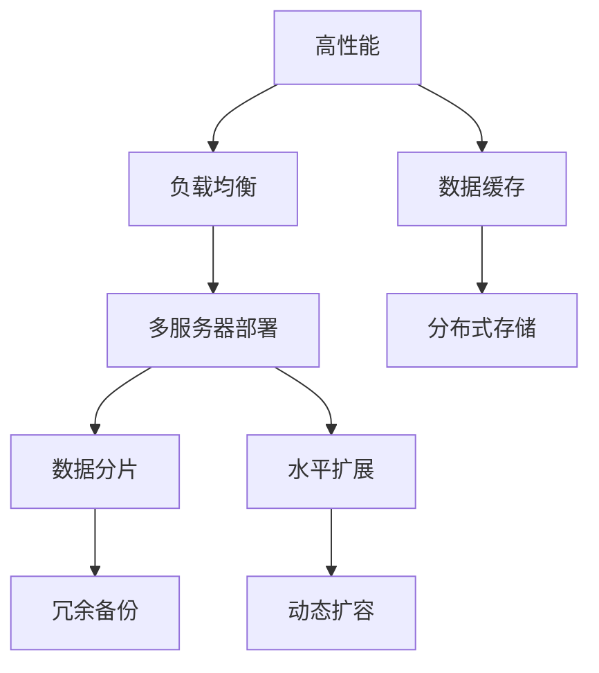

                 

## 1. 背景介绍

在现代系统设计中，高性能、高可用性、高扩展性（High Performance, High Availability, High Scalability），通常被简称为“三高”系统，是应对互联网应用复杂性的关键。三高系统不仅能保障系统的稳定性和可靠性，还能支持业务的快速发展和扩展。然而，实现三高系统是一项极具挑战的任务，需要在架构、算法、运维等多方面进行深入设计。本文将详细解析三高系统的设计思路、核心算法和实际应用，旨在为系统架构师、程序员和技术管理者提供参考和指导。

## 2. 核心概念与联系

### 2.1 核心概念概述

为了理解“三高”系统的设计理念，我们首先介绍几个关键概念：

- **高性能**（High Performance）：系统能够快速响应大量并发请求，同时保持低延迟和高吞吐量。
- **高可用性**（High Availability）：系统在面对硬件故障、网络中断等异常情况时，能够快速恢复服务，保证业务连续性。
- **高扩展性**（High Scalability）：系统能够根据业务需求动态调整资源，支持线性或非线性扩展。

这些概念构成了三高系统设计的基石。通过合理的设计和实现，可以在不同的应用场景下实现高性能、高可用性、高扩展性的平衡。

### 2.2 核心概念的关系

为了更清晰地理解“三高”概念之间的联系，我们通过一个简化的Mermaid流程图来展示：



这个流程图展示了高性能、高可用性、高扩展性之间的联系：

- **负载均衡**：通过均衡分配请求，确保每个服务器负载均衡，提升系统性能。
- **多服务器部署**：增加服务器的数量，提升系统的吞吐量和处理能力。
- **数据缓存**：通过缓存热点数据，减少数据库访问次数，提升响应速度。
- **分布式存储**：通过分布式存储系统，保障数据的高可用性和扩展性。
- **数据分片**：通过分片技术，将数据分散存储，提升并发处理能力和数据可靠性。
- **冗余备份**：通过数据冗余和备份，保障数据不丢失，提高系统可用性。
- **水平扩展**：通过增加节点数量，支持系统动态扩展。
- **动态扩容**：根据业务需求，动态调整资源，提升系统的扩展能力。

这些概念和技术相互配合，共同支撑了“三高”系统的实现。

## 3. 核心算法原理 & 具体操作步骤

### 3.1 算法原理概述

实现三高系统的核心算法和操作步骤主要包括负载均衡、数据缓存、分布式存储、冗余备份、数据分片、动态扩容等。

#### 3.1.1 负载均衡算法

负载均衡是提升系统性能的重要手段。常见的负载均衡算法包括：

- **轮询算法（Round Robin）**：将请求依次分配给不同的服务器，保证每个服务器负载均衡。
- **随机算法（Random）**：随机分配请求到服务器，避免固定轮询带来的资源不均衡。
- **最小连接数算法（Least Connections）**：选择当前连接数最少的服务器处理请求，减少连接建立时间。

#### 3.1.2 数据缓存算法

数据缓存通过减少数据库访问次数，提升系统响应速度。常见的数据缓存算法包括：

- **LRU算法（Least Recently Used）**：淘汰最近最少使用的数据，保证缓存数据的新鲜度。
- **LFU算法（Least Frequently Used）**：淘汰访问频率最低的数据，避免热点数据被频繁替换。
- **LRU-K算法**：同时考虑最近最少使用和访问频率，提升缓存命中率。

#### 3.1.3 分布式存储算法

分布式存储通过分散存储数据，提升数据可用性和扩展性。常见的分布式存储算法包括：

- **一致性哈希算法（Consistent Hashing）**：将数据分布在多个节点上，均衡分配负载，支持动态添加和删除节点。
- **Gossip算法**：通过节点间的信息传播，实现数据的分布式存储和一致性维护。
- **Paxos/Raft算法**：通过共识协议，确保数据的一致性和分布式存储的可靠性。

#### 3.1.4 冗余备份算法

冗余备份通过数据备份和恢复，提升系统的可用性和可靠性。常见的冗余备份算法包括：

- **主从备份（Master-Slave）**：主节点负责写入数据，从节点负责复制数据，提升系统的可用性。
- **多副本备份**：通过多份数据的冗余备份，确保数据不丢失，提升系统的容错能力。
- **分布式备份系统**：如Hadoop的HDFS和Apache的Cassandra，通过分布式存储和备份，保障数据的高可用性和可靠性。

#### 3.1.5 数据分片算法

数据分片通过将数据分散存储，提升系统的扩展性和并发处理能力。常见的数据分片算法包括：

- **哈希分片算法（Hash Partitioning）**：通过哈希函数将数据分散到不同的分片上，实现数据分布和负载均衡。
- **范围分片算法（Range Partitioning）**：将数据按照一定的范围进行分片，适用于有序数据。
- **一致性哈希分片**：结合一致性哈希算法和哈希分片算法，实现数据的高可用性和负载均衡。

#### 3.1.6 动态扩容算法

动态扩容通过动态增加节点，提升系统的扩展性和处理能力。常见的动态扩容算法包括：

- **垂直扩展（Vertical Scaling）**：通过增加单个节点的资源（如CPU、内存）来提升性能。
- **水平扩展（Horizontal Scaling）**：通过增加节点的数量来提升系统的处理能力和扩展性。
- **容器化部署**：通过Docker、Kubernetes等容器化技术，支持动态扩容和资源管理。

### 3.2 算法步骤详解

接下来，我们将以高可用性和高扩展性为例，详细介绍算法步骤：

#### 3.2.1 高可用性算法步骤

高可用性算法步骤主要包括以下几个方面：

1. **故障检测**：通过心跳信号、日志分析等方式，实时检测系统故障。
2. **故障转移**：在检测到故障时，立即切换到备用节点，确保服务连续性。
3. **自动恢复**：在系统故障恢复后，自动重新启用主节点，恢复服务。
4. **数据备份与恢复**：定期备份数据，在系统故障时快速恢复数据。

#### 3.2.2 高扩展性算法步骤

高扩展性算法步骤主要包括以下几个方面：

1. **负载均衡**：通过均衡分配请求，确保每个服务器负载均衡。
2. **数据分片**：通过分片技术，将数据分散存储，提升并发处理能力和数据可靠性。
3. **动态扩容**：根据业务需求，动态调整资源，提升系统的扩展能力。
4. **弹性伸缩**：通过容器化技术，实现动态扩缩容和资源管理。

### 3.3 算法优缺点

实现“三高”系统的算法各有优缺点，具体如下：

#### 3.3.1 负载均衡算法

- **优点**：均衡分配请求，提升系统性能。
- **缺点**：可能导致数据不均衡，影响系统稳定性。

#### 3.3.2 数据缓存算法

- **优点**：减少数据库访问次数，提升响应速度。
- **缺点**：缓存一致性难以保证，可能导致数据不一致。

#### 3.3.3 分布式存储算法

- **优点**：提升数据可用性和扩展性。
- **缺点**：数据一致性维护复杂，可能导致数据丢失。

#### 3.3.4 冗余备份算法

- **优点**：提升系统的可用性和可靠性。
- **缺点**：增加系统复杂性，影响系统性能。

#### 3.3.5 数据分片算法

- **优点**：提升系统的扩展性和并发处理能力。
- **缺点**：分片粒度过细可能导致性能瓶颈。

#### 3.3.6 动态扩容算法

- **优点**：提升系统的扩展性和处理能力。
- **缺点**：扩容和缩容操作复杂，可能导致性能波动。

### 3.4 算法应用领域

实现“三高”系统的算法和技术广泛应用于各种场景，例如：

- **云计算平台**：如AWS、阿里云、腾讯云等，提供高可用性、高扩展性的云服务。
- **分布式数据库**：如MySQL Cluster、Apache Cassandra等，通过分布式存储和备份，保障数据的高可用性和可靠性。
- **互联网应用**：如社交网络、电商平台、在线游戏等，通过负载均衡、数据缓存、分布式存储等技术提升性能和可用性。
- **物联网**：如智能家居、智慧城市等，通过数据分片和动态扩容技术，支持大规模设备的协同工作。

## 4. 数学模型和公式 & 详细讲解 & 举例说明

### 4.1 数学模型构建

为了更好地理解“三高”系统的设计思路，我们通过数学模型来描述系统的运行机制。

假设有一个三高系统，系统由多个服务器组成，每个服务器处理请求的速率和服务器的响应时间为：

- $P_i$：服务器$i$处理请求的速率。
- $R_i$：服务器$i$的响应时间。

系统负载为$L$，负载均衡算法为$A$，数据缓存算法为$C$，数据分片算法为$D$。

### 4.2 公式推导过程

首先，我们通过数学公式来推导系统的响应时间和处理能力。

- **响应时间**：系统处理一个请求的平均时间$T$为：

$$
T = \sum_i P_i \cdot R_i
$$

- **处理能力**：系统处理请求的总速度$V$为：

$$
V = \sum_i \frac{1}{R_i} \cdot P_i
$$

接下来，我们通过数学公式来推导系统的高可用性和高扩展性。

- **高可用性**：假设系统中有$N$个服务器，每个服务器可用性为$u_i$，则系统的可用性$U$为：

$$
U = \prod_i (1 - (1 - u_i) \cdot (1 - u_j))
$$

- **高扩展性**：假设系统通过数据分片将数据分散到$M$个节点上，每个节点处理请求的速率和响应时间分别为$P'_i$和$R'_i$，则系统的扩展性$E$为：

$$
E = \frac{M \cdot P'_i \cdot R'_i}{N \cdot P_i \cdot R_i}
$$

### 4.3 案例分析与讲解

为了更好地理解“三高”系统的设计和实现，我们通过一个实际案例进行分析：

假设一个电商平台，每日平均访问量$L=10000$，每个服务器处理请求的速率为$P_i=5$，响应时间为$R_i=0.1$秒，系统负载均衡算法为轮询算法，数据缓存算法为LRU算法，数据分片算法为哈希分片算法。

首先，计算系统的平均响应时间：

$$
T = 10000 \cdot 5 \cdot 0.1 = 5000 \text{秒}
$$

然后，计算系统的处理能力：

$$
V = \frac{1}{0.1} \cdot 5 = 50 \text{请求/秒}
$$

最后，计算系统的扩展性：

$$
E = \frac{4 \cdot 5 \cdot 0.2}{1 \cdot 5 \cdot 0.1} = 8 \text{倍}
$$

## 5. 项目实践：代码实例和详细解释说明

### 5.1 开发环境搭建

在实现“三高”系统之前，需要准备好开发环境。以下是Python环境下的搭建流程：

1. 安装Anaconda：从官网下载并安装Anaconda，用于创建独立的Python环境。
2. 创建并激活虚拟环境：
```bash
conda create -n high_perf_env python=3.8 
conda activate high_perf_env
```

3. 安装相关库：
```bash
pip install requests flask psutil
```

### 5.2 源代码详细实现

接下来，我们以一个简单的负载均衡系统为例，展示其实现过程。

首先，定义负载均衡算法：

```python
import random

class LoadBalancer:
    def __init__(self, servers):
        self.servers = servers
    
    def get_server(self):
        server = random.choice(self.servers)
        return server
```

然后，定义服务器的负载：

```python
class Server:
    def __init__(self, name, load):
        self.name = name
        self.load = load
    
    def __str__(self):
        return f"Server {self.name} - Load: {self.load}"
```

接着，定义负载均衡器的实现：

```python
def run():
    servers = [Server(f"Server{i}", i) for i in range(5)]
    lb = LoadBalancer(servers)
    
    for _ in range(1000):
        server = lb.get_server()
        print(server)
```

最后，运行负载均衡器：

```python
if __name__ == '__main__':
    run()
```

### 5.3 代码解读与分析

通过上述代码，我们可以看到一个简单的负载均衡系统是如何实现的：

- **LoadBalancer类**：负责从服务器列表中随机选择服务器。
- **Server类**：代表一个服务器，记录其名称和负载。
- **run函数**：创建5个服务器，模拟1000次负载均衡操作，并输出服务器名称和负载。

## 6. 实际应用场景

### 6.1 互联网应用

互联网应用是“三高”系统的典型应用场景。例如，社交网络平台需要处理大量的用户请求，通过负载均衡、数据缓存、分布式存储等技术，可以提升系统的性能和可用性。

### 6.2 电子商务平台

电子商务平台需要处理大量的交易请求和支付请求，通过高可用性和高扩展性的系统设计，可以保证业务的连续性和可靠性。

### 6.3 金融服务

金融服务系统需要处理大量的交易和支付请求，通过高可用性和高扩展性的系统设计，可以保障金融交易的安全性和稳定性。

### 6.4 物联网

物联网系统需要处理大量的设备数据，通过高扩展性的系统设计，可以支持大规模设备的协同工作。

## 7. 工具和资源推荐

### 7.1 学习资源推荐

为了帮助开发者系统掌握“三高”系统的设计和实现，我们推荐以下学习资源：

1. 《系统架构设计》书籍：系统架构设计领域的经典教材，涵盖各类系统架构设计和优化策略。
2. 《云计算基础》课程：讲解云计算平台的高可用性和高扩展性设计。
3. 《大数据技术与应用》课程：讲解大数据系统的分布式存储和处理技术。
4. 《分布式系统设计与实现》课程：讲解分布式系统的负载均衡、数据缓存等技术。

### 7.2 开发工具推荐

高效的工具是实现“三高”系统的重要保障。以下是几个推荐的开发工具：

1. AWS Elastic Beanstalk：提供快速部署和扩展的能力，支持高可用性和高扩展性。
2. Apache Kafka：提供高吞吐量的消息队列服务，支持分布式数据缓存。
3. Redis：提供高可用性和高性能的内存数据库，支持数据缓存和分布式存储。
4. Kubernetes：提供容器化部署和动态扩缩容的能力，支持高扩展性。

### 7.3 相关论文推荐

深入理解“三高”系统的设计和实现，需要阅读以下相关论文：

1. Paxos算法：Lamport等人在1989年提出的共识协议，解决分布式系统的容错问题。
2. Consistent Hashing算法：Chandy和Misra在1997年提出的分布式存储算法，解决数据分片和负载均衡问题。
3. LRU算法：Belady在1966年提出的缓存淘汰算法，解决缓存一致性和性能问题。

## 8. 总结：未来发展趋势与挑战

### 8.1 研究成果总结

本文详细解析了三高系统的设计思路和核心算法，涵盖了负载均衡、数据缓存、分布式存储、冗余备份、数据分片、动态扩容等关键技术。通过实际案例和代码实现，展示了如何设计和实现高性能、高可用性、高扩展性的系统。

### 8.2 未来发展趋势

展望未来，“三高”系统的发展趋势包括：

1. **云计算和大数据技术的成熟**：云计算和大数据技术的不断成熟，将推动“三高”系统的普及和应用。
2. **容器化和微服务架构的兴起**：容器化和微服务架构将成为实现“三高”系统的标准技术。
3. **边缘计算的普及**：边缘计算技术将提供更接近用户的数据处理能力，提升系统的响应速度和扩展性。
4. **自动化运维工具的普及**：自动化运维工具将大大降低系统的运维成本，提升系统的稳定性和可用性。

### 8.3 面临的挑战

虽然“三高”系统已经取得了一定的进展，但面临的挑战仍然很多：

1. **资源管理复杂**：系统需要动态管理资源，增加了系统设计和实现的复杂度。
2. **性能瓶颈**：系统的性能瓶颈需要深入分析和优化。
3. **安全性问题**：系统的安全性需要综合考虑数据安全、访问控制等多个方面。
4. **成本问题**：系统的成本需要综合考虑硬件、软件、运维等多个方面的投入。

### 8.4 研究展望

未来的研究重点包括：

1. **系统性能优化**：通过算法和架构优化，提升系统的性能和扩展性。
2. **自动化运维**：通过自动化工具和流程，提升系统的运维效率和稳定性。
3. **混合云架构**：通过混合云架构，提升系统的灵活性和可靠性。
4. **边缘计算与物联网**：通过边缘计算和物联网技术，提升系统的响应速度和扩展性。

## 9. 附录：常见问题与解答

**Q1：如何设计高可用性的系统？**

A: 设计高可用性系统需要考虑以下方面：

1. 故障检测和转移：通过心跳信号、日志分析等方式，实时检测系统故障，并立即切换到备用节点。
2. 数据备份和恢复：定期备份数据，在系统故障时快速恢复数据。
3. 分布式存储和一致性维护：通过一致性哈希等算法，实现数据的高可用性和分布式存储。

**Q2：如何设计高扩展性的系统？**

A: 设计高扩展性系统需要考虑以下方面：

1. 负载均衡和数据分片：通过负载均衡算法和数据分片算法，提升系统的扩展性和并发处理能力。
2. 动态扩容和弹性伸缩：通过容器化技术和自动化运维工具，实现动态扩缩容和资源管理。
3. 数据缓存和分布式存储：通过数据缓存算法和分布式存储算法，提升系统的响应速度和扩展性。

**Q3：如何优化系统的性能？**

A: 优化系统性能需要考虑以下方面：

1. 数据缓存和分布式存储：通过缓存热点数据和分布式存储系统，减少数据库访问次数，提升响应速度。
2. 负载均衡和数据分片：通过均衡分配请求和分片技术，提升系统的并发处理能力和扩展性。
3. 算法优化和架构设计：通过优化算法和设计高效的架构，提升系统的性能和稳定性。

---

作者：禅与计算机程序设计艺术 / Zen and the Art of Computer Programming

