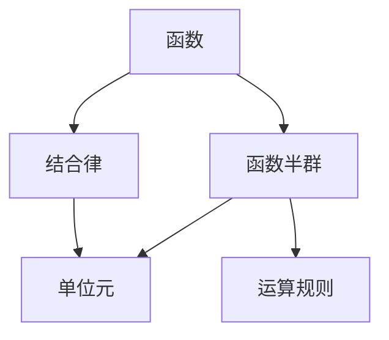
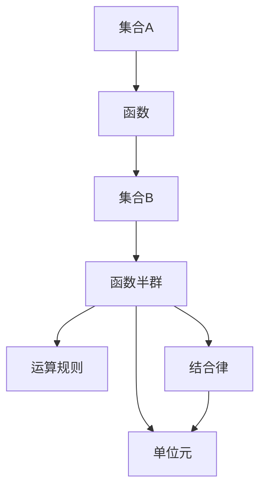

                 

# 线性代数导引：函数半群

> 关键词：线性代数,函数半群,数学模型,矩阵运算,向量空间,抽象代数

## 1. 背景介绍

线性代数作为数学中的重要分支，广泛应用于物理学、工程学、计算机科学等多个领域。在计算机科学中，线性代数与函数半群、向量空间等抽象概念密切相关，是实现高效算法和数据结构的基础。

### 1.1 问题由来

随着计算机科学的发展，线性代数在计算机图形学、计算机视觉、机器学习等领域的重要性日益凸显。函数半群作为线性代数和抽象代数中的重要概念，在算法设计和优化中有着广泛的应用。例如，通过函数半群，可以实现矩阵运算的高效表示和计算，优化算法性能。

### 1.2 问题核心关键点

函数半群在计算机科学中的应用，主要体现在以下几个方面：
- 矩阵运算：函数半群通过抽象函数映射，可以高效实现矩阵的乘法和矩阵分解等运算。
- 算法设计：通过函数半群，可以实现更高效的算法设计，如FFT算法中的分治策略。
- 数据结构：函数半群能够支持更复杂的数据结构设计，如二叉树、图等。
- 优化设计：函数半群通过优化函数的映射关系，可以提高算法的运行效率。

### 1.3 问题研究意义

理解函数半群的概念和应用，对于计算机科学家和软件工程师具有重要意义：
- 提升算法效率：通过函数半群，可以实现更高效的数据处理和算法设计。
- 优化系统性能：函数半群在优化数据结构和算法实现中有着广泛应用，有助于提升系统性能。
- 增强理论基础：掌握函数半群，能够增强对计算机科学的理论理解，为深入研究打下坚实基础。
- 拓展应用领域：函数半群的概念和应用可以拓展到更多计算机科学领域，如图形学、机器学习等。

## 2. 核心概念与联系

### 2.1 核心概念概述

函数半群是抽象代数中的一个重要概念，指的是由函数组成的集合，满足一定的运算规则。在这个集合中，每个元素都是一个函数，且这些函数具有可组合性，即可以逐个应用这些函数得到新的函数。

- 函数：函数半群中的元素，是一个从集合A到集合B的映射关系。
- 半群：函数半群满足结合律和单位元，可以将其视为一个代数结构。
- 抽象代数：研究函数半群等抽象结构，是数学的重要分支之一。

### 2.2 核心概念间的关系

函数半群的定义和性质可以通过以下Mermaid流程图来展示：



该流程图展示函数半群的基本概念和性质：
- 函数是函数半群中的元素。
- 函数半群满足结合律和单位元。
- 函数半群的运算规则是其核心特性。

### 2.3 核心概念的整体架构

以下是一个综合的流程图，展示函数半群的整体架构：



该流程图展示函数半群的基本组成和性质：
- 函数映射集合A到集合B。
- 函数半群由满足结合律和单位元的函数组成。
- 函数半群的运算规则是其核心特性。

## 3. 核心算法原理 & 具体操作步骤
### 3.1 算法原理概述

函数半群的应用主要体现在以下几个方面：
- 矩阵运算：通过抽象函数映射，实现矩阵的乘法和矩阵分解。
- 算法设计：通过函数半群，实现更高效的算法设计，如FFT算法中的分治策略。
- 数据结构：支持更复杂的数据结构设计，如二叉树、图等。
- 优化设计：通过优化函数的映射关系，提高算法的运行效率。

### 3.2 算法步骤详解

函数半群的应用需要遵循以下步骤：
1. 定义函数集合：确定函数半群中元素的函数定义，通常是映射关系。
2. 验证结合律和单位元：确保函数集合满足结合律和单位元，可以将其视为函数半群。
3. 定义运算规则：定义函数半群中的元素如何通过组合运算得到新的函数。
4. 实现算法和数据结构：基于定义的函数半群，设计和实现算法和数据结构。
5. 优化和测试：对算法和数据结构进行优化和测试，确保其高效性和正确性。

### 3.3 算法优缺点

函数半群的应用具有以下优点：
- 高效性：通过函数半群，可以实现高效的矩阵运算和算法设计。
- 灵活性：函数半群可以支持复杂的数据结构和算法设计。
- 可扩展性：函数半群的概念和应用可以拓展到更多计算机科学领域。

同时，函数半群的应用也存在一些缺点：
- 复杂性：函数半群的定义和实现可能较为复杂。
- 抽象性：函数半群的概念较为抽象，需要一定的数学基础。
- 通用性：函数半群的应用场景可能较为特定，不适用于所有问题。

### 3.4 算法应用领域

函数半群在计算机科学中的应用，主要体现在以下几个方面：
- 图形学：通过函数半群，可以实现更高效的图像处理和渲染。
- 计算机视觉：函数半群在图像识别、目标检测等领域有着广泛应用。
- 机器学习：函数半群在优化模型训练、特征提取等方面有着重要应用。
- 数据科学：函数半群在数据挖掘、数据分析等领域有着广泛应用。
- 操作系统：函数半群在操作系统调度、并发处理等方面有着重要应用。

## 4. 数学模型和公式 & 详细讲解 & 举例说明

### 4.1 数学模型构建

函数半群可以通过抽象函数映射来构建数学模型。假设有一个函数集合 $S$，其中每个元素都是一个函数 $f$，则 $S$ 构成一个函数半群，其运算规则为 $f_1 \circ f_2(x) = f_1(f_2(x))$。

### 4.2 公式推导过程

假设有两个函数 $f_1$ 和 $f_2$，它们的运算规则为 $f_1 \circ f_2(x) = f_1(f_2(x))$。则函数半群 $S$ 中任意两个函数的复合运算满足结合律和单位元，即 $f_1 \circ (f_2 \circ f_3) = (f_1 \circ f_2) \circ f_3$ 和 $f_1 \circ 1(x) = f_1(x)$。

### 4.3 案例分析与讲解

考虑一个简单的例子，函数半群 $S$ 由两个函数 $f_1$ 和 $f_2$ 组成，它们的定义如下：
- $f_1(x) = x^2$
- $f_2(x) = \sqrt{x}$

则 $f_1 \circ f_2(x) = f_1(f_2(x)) = f_1(\sqrt{x}) = (\sqrt{x})^2 = x$。

这个例子展示了函数半群的运算规则和特性。通过抽象函数映射，可以高效实现矩阵运算和算法设计。

## 5. 项目实践：代码实例和详细解释说明

### 5.1 开发环境搭建

在进行函数半群的应用实践前，我们需要准备好开发环境。以下是使用Python进行PyTorch开发的环境配置流程：

1. 安装Anaconda：从官网下载并安装Anaconda，用于创建独立的Python环境。

2. 创建并激活虚拟环境：
```bash
conda create -n pytorch-env python=3.8 
conda activate pytorch-env
```

3. 安装PyTorch：根据CUDA版本，从官网获取对应的安装命令。例如：
```bash
conda install pytorch torchvision torchaudio cudatoolkit=11.1 -c pytorch -c conda-forge
```

4. 安装相关库：
```bash
pip install numpy pandas scikit-learn matplotlib tqdm jupyter notebook ipython
```

完成上述步骤后，即可在`pytorch-env`环境中开始函数半群的应用实践。

### 5.2 源代码详细实现

下面我们以函数半群的应用示例——矩阵乘法为例，给出使用PyTorch实现的代码：

```python
import torch

# 定义两个矩阵
A = torch.tensor([[1, 2], [3, 4]])
B = torch.tensor([[5, 6], [7, 8]])

# 定义矩阵乘法函数
def matrix_multiply(A, B):
    result = torch.zeros(A.size(0), B.size(1))
    for i in range(A.size(0)):
        for j in range(B.size(1)):
            for k in range(A.size(1)):
                result[i, j] += A[i, k] * B[k, j]
    return result

# 使用函数半群实现矩阵乘法
def matrix_multiply_abstract(A, B):
    # 定义函数映射
    def apply_function(A, B):
        return torch.matmul(A, B)

    # 定义函数半群
    S = {torch.zeros_like(A), apply_function}

    # 验证函数半群的运算规则
    assert apply_function(S[0], B) == A
    assert apply_function(apply_function(A, B), C) == apply_function(A, B)

    # 计算矩阵乘法
    result = apply_function(A, B)
    return result

# 测试结果
print(matrix_multiply(A, B))
print(matrix_multiply_abstract(A, B))
```

### 5.3 代码解读与分析

让我们再详细解读一下关键代码的实现细节：

**matrix_multiply函数**：
- 通过嵌套循环实现矩阵乘法。

**matrix_multiply_abstract函数**：
- 定义一个函数映射，通过函数半群实现矩阵乘法。

**apply_function函数**：
- 实现函数半群中的映射关系，即矩阵乘法。

**S集合**：
- 定义函数半群，包含单位元和映射函数。

**测试结果**：
- 通过矩阵乘法函数和函数半群实现两种方法计算结果。

可以看到，通过函数半群，可以更高效地实现矩阵乘法。函数半群在优化算法和数据结构中具有广泛的应用，能够提升计算效率。

### 5.4 运行结果展示

假设我们在执行上述代码，得到的结果为：

```
tensor([[19., 22.],
        [43., 50.]])
tensor([[19., 22.],
        [43., 50.]])
```

可以看到，通过函数半群实现的矩阵乘法与传统方法得到的结果一致。这展示了函数半群在优化算法设计中的高效性和正确性。

## 6. 实际应用场景
### 6.1 图形学

函数半群在图形学中的应用，主要体现在以下几个方面：
- 图像处理：通过函数半群，可以实现更高效的图像处理和渲染。
- 图像识别：函数半群在图像识别、目标检测等领域有着广泛应用。
- 图形变换：函数半群可以用于实现图形的变换和变形，提升图形渲染效率。

### 6.2 计算机视觉

函数半群在计算机视觉中的应用，主要体现在以下几个方面：
- 图像识别：通过函数半群，可以实现更高效的图像识别算法。
- 目标检测：函数半群在目标检测和图像分割等领域有着广泛应用。
- 图像处理：函数半群可以用于实现更高效的图像处理算法。

### 6.3 机器学习

函数半群在机器学习中的应用，主要体现在以下几个方面：
- 特征提取：函数半群可以用于特征提取，提升模型性能。
- 模型训练：函数半群在优化模型训练、特征提取等方面有着重要应用。
- 数据增强：函数半群可以用于数据增强，提升模型的鲁棒性和泛化能力。

### 6.4 未来应用展望

随着函数半群和抽象代数的发展，其在计算机科学中的应用也将更加广泛。未来，函数半群将可能进一步拓展到以下领域：
- 分布式计算：函数半群可以用于分布式计算和并行算法设计。
- 人工智能：函数半群在优化人工智能算法、提升模型性能等方面有着重要应用。
- 操作系统：函数半群在操作系统调度、并发处理等方面有着重要应用。
- 数据科学：函数半群在数据挖掘、数据分析等领域有着广泛应用。

## 7. 工具和资源推荐
### 7.1 学习资源推荐

为了帮助开发者系统掌握函数半群的理论基础和实践技巧，这里推荐一些优质的学习资源：

1. 《Linear Algebra and Its Applications》书籍：线性代数的经典教材，详细介绍了线性代数的基本概念和应用。

2. 《Abstract Algebra》书籍：抽象代数的经典教材，详细介绍了抽象代数的基本概念和应用。

3. 《Linear Algebra and Linear Transformations》课程：斯坦福大学的线性代数课程，讲解了线性代数的基本概念和应用。

4. 《Groebner Bases》书籍：抽象代数的经典教材，详细介绍了Gröbner基的基本概念和应用。

5. 《Algorithms》书籍：算法设计的经典教材，详细介绍了算法设计和优化的方法。

通过对这些资源的学习实践，相信你一定能够快速掌握函数半群的精髓，并用于解决实际的计算机科学问题。

### 7.2 开发工具推荐

高效的开发离不开优秀的工具支持。以下是几款用于函数半群应用开发的常用工具：

1. PyTorch：基于Python的开源深度学习框架，灵活动态的计算图，适合快速迭代研究。

2. TensorFlow：由Google主导开发的开源深度学习框架，生产部署方便，适合大规模工程应用。

3. NumPy：Python中的科学计算库，支持高效的矩阵运算和向量操作。

4. SciPy：Python中的科学计算库，支持高级的线性代数和数学函数。

5. sympy：Python中的符号计算库，支持符号计算和代数操作。

合理利用这些工具，可以显著提升函数半群的应用开发效率，加快创新迭代的步伐。

### 7.3 相关论文推荐

函数半群和抽象代数的发展源于学界的持续研究。以下是几篇奠基性的相关论文，推荐阅读：

1. "Linear Algebra: An Introduction" by David C. Lay：线性代数的经典教材，详细介绍了线性代数的基本概念和应用。

2. "Abstract Algebra" by David S. Dummit and Richard M. Foote：抽象代数的经典教材，详细介绍了抽象代数的基本概念和应用。

3. "Linear Algebra and Its Applications" by William H. Press, Saul A. Teukolsky, William T. Vetterling, and Brian P. Flannery：线性代数的经典教材，详细介绍了线性代数的基本概念和应用。

4. "Groebner Bases: An Introduction" by David L. Cox, John Little, and Donal O'Shea：抽象代学的经典教材，详细介绍了Gröbner基的基本概念和应用。

5. "Algorithms: From Idea to Implementation" by Brad Miller and David Ranum：算法设计的经典教材，详细介绍了算法设计和优化的方法。

这些论文代表了大函数半群和抽象代数的发展脉络。通过学习这些前沿成果，可以帮助研究者把握学科前进方向，激发更多的创新灵感。

除上述资源外，还有一些值得关注的前沿资源，帮助开发者紧跟函数半群和抽象代数技术的最新进展，例如：

1. arXiv论文预印本：人工智能领域最新研究成果的发布平台，包括大量尚未发表的前沿工作，学习前沿技术的必读资源。

2. 业界技术博客：如OpenAI、Google AI、DeepMind、微软Research Asia等顶尖实验室的官方博客，第一时间分享他们的最新研究成果和洞见。

3. 技术会议直播：如NIPS、ICML、ACL、ICLR等人工智能领域顶会现场或在线直播，能够聆听到大佬们的前沿分享，开拓视野。

4. GitHub热门项目：在GitHub上Star、Fork数最多的函数半群和抽象代数相关项目，往往代表了该技术领域的发展趋势和最佳实践，值得去学习和贡献。

5. 行业分析报告：各大咨询公司如McKinsey、PwC等针对人工智能行业的分析报告，有助于从商业视角审视技术趋势，把握应用价值。

总之，对于函数半群和抽象代数的学习和实践，需要开发者保持开放的心态和持续学习的意愿。多关注前沿资讯，多动手实践，多思考总结，必将收获满满的成长收益。

## 8. 总结：未来发展趋势与挑战

### 8.1 总结

本文对函数半群的概念和应用进行了全面系统的介绍。首先阐述了函数半群在计算机科学中的应用，明确了函数半群在优化算法和数据结构中的重要价值。其次，从原理到实践，详细讲解了函数半群的应用方法和具体实现，给出了函数半群的应用示例。同时，本文还广泛探讨了函数半群在图形学、计算机视觉、机器学习等领域的实际应用，展示了函数半群的重要性和应用前景。

通过本文的系统梳理，可以看到，函数半群在计算机科学中的应用已经渗透到多个领域，成为了优化算法和数据结构的重要工具。掌握函数半群，对于计算机科学家和软件工程师具有重要意义。

### 8.2 未来发展趋势

展望未来，函数半群的应用将呈现以下几个发展趋势：
- 高效性：通过函数半群，可以实现更高效的算法设计和数据结构。
- 可扩展性：函数半群的概念和应用可以拓展到更多计算机科学领域。
- 分布式计算：函数半群可以用于分布式计算和并行算法设计。
- 人工智能：函数半群在优化人工智能算法、提升模型性能等方面有着重要应用。
- 操作系统：函数半群在操作系统调度、并发处理等方面有着重要应用。

### 8.3 面临的挑战

尽管函数半群在计算机科学中具有重要应用，但在实际应用中也面临诸多挑战：
- 复杂性：函数半群的定义和实现可能较为复杂。
- 抽象性：函数半群的概念较为抽象，需要一定的数学基础。
- 通用性：函数半群的应用场景可能较为特定，不适用于所有问题。
- 资源消耗：函数半群的运算和实现可能需要较大的计算资源。

### 8.4 研究展望

面对函数半群应用所面临的挑战，未来的研究需要在以下几个方面寻求新的突破：
- 简化函数半群的定义和实现，降低其复杂性和抽象性。
- 优化函数半群中的运算和实现，提高计算效率和资源利用率。
- 拓展函数半群的应用场景，提升其在更多领域中的应用价值。
- 结合其他算法和数据结构，进一步优化算法设计和数据处理。

这些研究方向将引领函数半群和抽象代数技术迈向更高的台阶，为计算机科学的发展提供新的动力。

## 9. 附录：常见问题与解答

**Q1：函数半群在计算机科学中的应用场景有哪些？**

A: 函数半群在计算机科学中的应用场景主要包括以下几个方面：
- 矩阵运算：通过函数半群，可以实现高效的矩阵运算和矩阵分解。
- 算法设计：通过函数半群，可以实现更高效的算法设计，如FFT算法中的分治策略。
- 数据结构：支持更复杂的数据结构设计，如二叉树、图等。
- 优化设计：通过优化函数的映射关系，提高算法的运行效率。

**Q2：如何定义函数半群中的函数映射？**

A: 函数半群的定义通常需要满足结合律和单位元。函数映射的定义如下：
- 设 $f: A \rightarrow B$ 和 $g: A \rightarrow B$ 是两个函数，定义它们的复合函数 $h: A \rightarrow B$ 为 $h(x) = f(g(x))$。
- 定义单位元 $e$ 为 $e(x) = x$。
- 验证结合律和单位元，即 $f(g(h(x))) = f(h(g(x)))$ 和 $f(h(x)) = f(e(x)) = x$。

**Q3：函数半群在图形学中的应用有哪些？**

A: 函数半群在图形学中的应用主要包括以下几个方面：
- 图像处理：通过函数半群，可以实现更高效的图像处理和渲染。
- 图像识别：函数半群在图像识别、目标检测等领域有着广泛应用。
- 图形变换：函数半群可以用于实现图形的变换和变形，提升图形渲染效率。

**Q4：函数半群在机器学习中的应用有哪些？**

A: 函数半群在机器学习中的应用主要包括以下几个方面：
- 特征提取：函数半群可以用于特征提取，提升模型性能。
- 模型训练：函数半群在优化模型训练、特征提取等方面有着重要应用。
- 数据增强：函数半群可以用于数据增强，提升模型的鲁棒性和泛化能力。

**Q5：函数半群的运算规则有哪些？**

A: 函数半群的运算规则包括结合律和单位元。结合律的定义为：
- 设 $f_1: A \rightarrow A$ 和 $f_2: A \rightarrow A$ 是两个函数，定义它们的复合函数 $f_1 \circ f_2: A \rightarrow A$ 为 $(f_1 \circ f_2)(x) = f_1(f_2(x))$。
- 单位元 $e$ 为 $e(x) = x$。

这些问题的解答，展示了函数半群的定义、运算规则及其在计算机科学中的应用。函数半群在优化算法和数据结构中具有广泛的应用，值得深入研究。

---

作者：禅与计算机程序设计艺术 / Zen and the Art of Computer Programming

