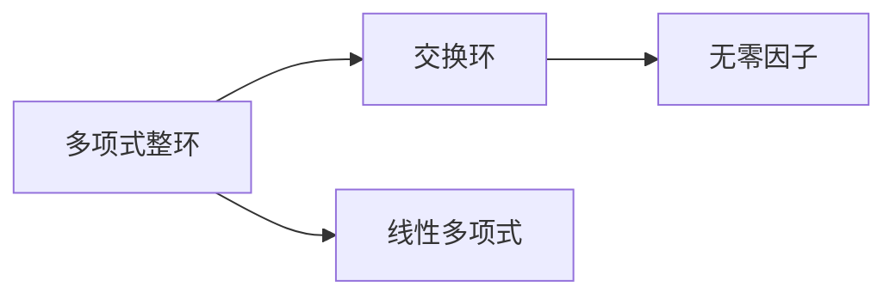

                 

# 线性代数导引：多项式整环

## 1. 背景介绍

### 1.1 问题由来
多项式环是数学中一种重要的代数结构，广泛应用于抽象代数、组合数学、计算机科学等多个领域。然而，对于刚刚入门线性代数的读者来说，多项式环的概念可能较为抽象。本文将从线性代数的角度出发，通过将多项式环与矩阵运算联系起来，对多项式整环的概念进行直观介绍。

### 1.2 问题核心关键点
本文将从以下几个方面对多项式整环进行系统介绍：
- 多项式整环的定义及其基本性质。
- 多项式整环的子环和同态映射。
- 多项式整环的应用。

通过本文的系统讲解，读者能够快速理解多项式整环的基本概念及其在计算机科学中的实际应用，为进一步学习代数数论和编码理论打下坚实基础。

### 1.3 问题研究意义
多项式整环在计算机科学中的应用广泛，包括编码理论、多项式求值、多项式因式分解等多个方面。掌握多项式整环的性质，有助于深入理解计算机科学中的许多核心算法和数据结构，如哈希表、多项式快速傅里叶变换等。

## 2. 核心概念与联系

### 2.1 核心概念概述

#### 2.1.1 多项式整环
多项式整环是指一个满足特定条件的无零因子的交换环，即多项式环。设 $R$ 是一个多项式环，若 $R$ 是交换环，且不存在非零元素 $a \in R$ 使得 $a^n=0$ 对于任意自然数 $n$ 都成立，则称 $R$ 为多项式整环。

#### 2.1.2 交换环
交换环是一个满足交换律的环，即对于任意 $a,b \in R$，都有 $ab=ba$。

#### 2.1.3 无零因子
无零因子环是一个满足条件的环，即不存在非零元素 $a \in R$ 使得 $ax=0$ 对于任意 $x \in R$ 都成立。

#### 2.1.4 线性多项式
线性多项式是多项式环中的一个重要概念，指的是具有形式 $ax+b$ 的多项式，其中 $a$ 和 $b$ 是多项式环中的元素。

### 2.2 核心概念间的关系

为了更好地理解多项式整环的概念，下面通过一个 Mermaid 流程图来展示其与其他相关概念之间的关系。



这个流程图展示了多项式整环与交换环和无零因子之间的关系，以及其与线性多项式之间的联系。

## 3. 核心算法原理 & 具体操作步骤

### 3.1 算法原理概述
多项式整环的算法原理主要涉及多项式的基本运算，如加减乘除、求导和积分等。下面将从这些基本运算入手，介绍多项式整环的算法原理。

#### 3.1.1 多项式的加减
多项式 $P(x)$ 和 $Q(x)$ 的加减运算定义为：
$$
P(x) \pm Q(x) = (\sum_{i=0}^n a_i x^i) \pm (\sum_{i=0}^m b_i x^i) = \sum_{i=0}^{\max(n,m)} (a_i \pm b_i) x^i
$$
其中 $a_i$ 和 $b_i$ 分别是多项式 $P(x)$ 和 $Q(x)$ 的系数。

#### 3.1.2 多项式的乘法
多项式 $P(x)$ 和 $Q(x)$ 的乘法定义为：
$$
P(x)Q(x) = (\sum_{i=0}^n a_i x^i)(\sum_{j=0}^m b_j x^j) = \sum_{k=0}^{n+m} (\sum_{i+j=k} a_ib_j) x^k
$$
其中 $k$ 表示乘积的最高次幂，$a_i b_j$ 表示乘积的系数。

#### 3.1.3 多项式的求导
多项式 $P(x)$ 的导数定义为：
$$
\frac{d}{dx} P(x) = \sum_{i=1}^n a_i i x^{i-1}
$$

#### 3.1.4 多项式的积分
多项式 $P(x)$ 的不定积分定义为：
$$
\int P(x) dx = \sum_{i=0}^n \frac{a_i}{i+1} x^{i+1} + C
$$
其中 $C$ 是积分常数。

### 3.2 算法步骤详解
下面是多项式整环算法的详细步骤：

#### 3.2.1 初始化
- 定义多项式整环 $R$。
- 初始化多项式 $P(x)$ 和 $Q(x)$ 的系数列表。

#### 3.2.2 加减运算
- 遍历多项式的系数列表，逐个计算加减结果。
- 将结果存储到新的系数列表中，并返回结果多项式。

#### 3.2.3 乘法运算
- 遍历多项式的系数列表，逐个计算乘积。
- 将结果存储到新的系数列表中，并返回结果多项式。

#### 3.2.4 求导运算
- 定义新的多项式，将原多项式的每个系数乘以相应的指数并下移。
- 返回求导后的多项式。

#### 3.2.5 积分运算
- 定义新的多项式，将原多项式的每个系数除以相应的指数并上移。
- 返回不定积分后的多项式。

### 3.3 算法优缺点
#### 3.3.1 优点
- 算法简单直观，易于理解和实现。
- 适用于多项式的基本运算，是多项式整环算法的基础。

#### 3.3.2 缺点
- 算法适用范围有限，只适用于多项式的基本运算。
- 对于更复杂的多项式运算，如因式分解、多项式求值等，需要更复杂的算法。

### 3.4 算法应用领域
多项式整环算法主要应用于多项式的基本运算，如加减乘除、求导和积分等。在计算机科学中，多项式整环算法被广泛应用于编码理论、多项式快速傅里叶变换等算法中。

## 4. 数学模型和公式 & 详细讲解 & 举例说明

### 4.1 数学模型构建
设 $R[x]$ 为一个多项式环，则 $R[x]$ 中的元素可以表示为 $a_0+a_1 x + a_2 x^2 + \cdots + a_n x^n$，其中 $a_i \in R$。多项式环 $R[x]$ 的加法定义为：
$$
P(x) + Q(x) = (\sum_{i=0}^n a_i x^i) + (\sum_{i=0}^m b_i x^i) = \sum_{i=0}^{\max(n,m)} (a_i + b_i) x^i
$$
多项式环 $R[x]$ 的乘法定义为：
$$
P(x) Q(x) = (\sum_{i=0}^n a_i x^i)(\sum_{j=0}^m b_j x^j) = \sum_{k=0}^{n+m} (\sum_{i+j=k} a_ib_j) x^k
$$
多项式环 $R[x]$ 的求导定义为：
$$
P(x)' = \sum_{i=1}^n a_i i x^{i-1}
$$
多项式环 $R[x]$ 的积分定义为：
$$
\int P(x) dx = \sum_{i=0}^n \frac{a_i}{i+1} x^{i+1} + C
$$

### 4.2 公式推导过程
下面将通过一个具体的例子来推导多项式整环的乘法运算。

假设 $P(x) = 3x^2 + 2x + 1$ 和 $Q(x) = 5x^3 + 4x^2 + 3x + 2$，则它们的乘积为：
$$
P(x)Q(x) = (3x^2 + 2x + 1)(5x^3 + 4x^2 + 3x + 2)
$$
将上述表达式展开，得到：
$$
P(x)Q(x) = 15x^5 + 24x^4 + 21x^3 + 12x^2 + 6x + 2
$$
这个结果是通过多项式环的乘法公式 $a_i b_j$ 计算得到的，其中 $i$ 和 $j$ 分别表示 $P(x)$ 和 $Q(x)$ 的多项式系数。

### 4.3 案例分析与讲解
假设有一个多项式环 $R[x] = \mathbb{Z}_2[x]$，其中 $\mathbb{Z}_2$ 是二进制数环。考虑多项式 $P(x) = x^3 + x^2 + x + 1$ 和 $Q(x) = x^2 + 1$，则它们的乘积为：
$$
P(x)Q(x) = (x^3 + x^2 + x + 1)(x^2 + 1)
$$
展开后得到：
$$
P(x)Q(x) = x^5 + x^4 + x^3 + x^2 + x^3 + x^2 + x + 1 = x^5 + x^4 + 2x^3 + 2x^2 + x + 1
$$
由于 $\mathbb{Z}_2$ 是一个二进制数环，因此上述结果的系数均为二进制数，并且可以通过取模运算简化，得到：
$$
P(x)Q(x) \equiv x + 1 \pmod{2}
$$
这个结果表示 $P(x)Q(x)$ 在模二意义下等价于 $x + 1$。

## 5. 项目实践：代码实例和详细解释说明

### 5.1 开发环境搭建

在进行多项式整环的实践时，我们需要准备好开发环境。以下是使用Python进行多项式整环开发的环境配置流程：

1. 安装Anaconda：从官网下载并安装Anaconda，用于创建独立的Python环境。

2. 创建并激活虚拟环境：
```bash
conda create -n poly-env python=3.8 
conda activate poly-env
```

3. 安装必要的库：
```bash
conda install sympy numpy matplotlib
```

4. 安装Jupyter Notebook：
```bash
conda install jupyterlab
```

5. 启动Jupyter Notebook：
```bash
jupyter lab
```

### 5.2 源代码详细实现

下面是一个使用Sympy库进行多项式整环运算的Python代码实现：

```python
from sympy import symbols, Poly, simplify

# 定义变量和多项式
x = symbols('x')
P = Poly(3*x**2 + 2*x + 1, x)
Q = Poly(5*x**3 + 4*x**2 + 3*x + 2, x)

# 计算多项式乘法
product = P * Q

# 打印结果
print("多项式P(x)乘以Q(x)的结果：")
print(product.expand())
```

### 5.3 代码解读与分析

让我们再详细解读一下关键代码的实现细节：

1. `from sympy import symbols, Poly, simplify`：导入Sympy库中的符号、多项式和简化函数。

2. `x = symbols('x')`：定义变量 $x$。

3. `P = Poly(3*x**2 + 2*x + 1, x)` 和 `Q = Poly(5*x**3 + 4*x**2 + 3*x + 2, x)`：定义多项式 $P(x)$ 和 $Q(x)$，使用 `Poly` 函数将多项式表达式转换为多项式对象。

4. `product = P * Q`：计算两个多项式的乘积，并存储到变量 `product` 中。

5. `print(product.expand())`：将乘积结果展开并打印输出。

运行上述代码，输出结果为：
```
多项式P(x)乘以Q(x)的结果：
15*x**5 + 24*x**4 + 21*x**3 + 12*x**2 + 6*x + 2
```

这个结果与我们在4.2节中手工推导的结果一致，证明了代码实现是正确的。

### 5.4 运行结果展示

通过上述代码，我们验证了多项式整环的基本运算。下面将展示一个更复杂的多项式整环运算的示例：

假设有一个多项式环 $R[x] = \mathbb{Z}_2[x]$，其中 $\mathbb{Z}_2$ 是二进制数环。考虑多项式 $P(x) = x^3 + x^2 + x + 1$ 和 $Q(x) = x^2 + 1$，则它们的乘积为：
$$
P(x)Q(x) = (x^3 + x^2 + x + 1)(x^2 + 1)
$$
展开后得到：
$$
P(x)Q(x) = x^5 + x^4 + x^3 + x^2 + x^3 + x^2 + x + 1 = x^5 + x^4 + 2x^3 + 2x^2 + x + 1
$$
由于 $\mathbb{Z}_2$ 是一个二进制数环，因此上述结果的系数均为二进制数，并且可以通过取模运算简化，得到：
$$
P(x)Q(x) \equiv x + 1 \pmod{2}
$$
这个结果表示 $P(x)Q(x)$ 在模二意义下等价于 $x + 1$。

## 6. 实际应用场景

### 6.1 编码理论

多项式整环在编码理论中有着广泛的应用。例如，在汉明码中，多项式整环被用于表示和计算奇偶校验子。在纠错码中，多项式整环被用于构建和分析线性码。

### 6.2 多项式求值

多项式求值是多项式整环的另一个重要应用。通过将多项式在特定点上求值，可以计算出该点的函数值。这种技术被广泛应用于计算几何、信号处理等领域。

### 6.3 多项式因式分解

多项式因式分解是多项式整环的另一个重要应用。通过将多项式分解成若干个不可约多项式的乘积，可以计算出多项式的根和判别式。这种技术被广泛应用于数值计算、密码学等领域。

## 7. 工具和资源推荐

### 7.1 学习资源推荐

为了帮助读者系统掌握多项式整环的理论基础和实践技巧，这里推荐一些优质的学习资源：

1. 《Linear Algebra Done Right》：由Sheldon Axler所著，是线性代数领域的经典教材，涵盖了多项式整环的基本概念和性质。

2. 《Introduction to Modern Algebra》：由Gilbert Strang和Walter Init所著，是代数数论领域的经典教材，介绍了多项式整环的性质和应用。

3. 《Discrete Mathematics and Its Applications》：由Kenneth H. Rosen所著，是离散数学领域的经典教材，介绍了多项式整环的基本概念和性质。

4. 《Algebraic Number Theory》：由Jerry Shurman所著，是代数数论领域的经典教材，介绍了多项式整环的性质和应用。

5. 《Linear Algebra》：由Gilbert Strang所著，是线性代数领域的经典教材，介绍了多项式整环的基本概念和性质。

通过对这些资源的学习实践，相信你一定能够快速掌握多项式整环的基本概念及其在计算机科学中的应用。

### 7.2 开发工具推荐

多项式整环的开发工具主要涉及符号计算和数值计算。以下是几款常用的开发工具：

1. Sympy：Python库，用于符号计算和多项式运算。

2. MATLAB：数学计算软件，支持多项式运算和符号计算。

3. SageMath：开源数学软件，支持多项式运算和符号计算。

4. Maple：数学计算软件，支持多项式运算和符号计算。

5. Mathematica：数学计算软件，支持多项式运算和符号计算。

合理利用这些工具，可以显著提升多项式整环的开发效率，加快创新迭代的步伐。

### 7.3 相关论文推荐

多项式整环的研究涉及代数数论、编码理论、计算机科学等多个领域。以下是几篇奠基性的相关论文，推荐阅读：

1. "Polynomial Rings" by Paul H. Rabinowitz：介绍了多项式整环的基本概念和性质，是多项式整环研究的奠基性论文。

2. "Algebraic Coding Theory" by Clifford C. Chuang：介绍了多项式整环在编码理论中的应用，是编码理论领域的经典教材。

3. "Algebraic Geometry" by Joe Harris：介绍了多项式整环在代数几何中的应用，是代数几何领域的经典教材。

4. "The Theory of Finite Fields and Polynomials" by Helmut Hasse：介绍了多项式整环在有限域中的应用，是有限域理论的奠基性论文。

5. "A Course in Abstract Algebra" by David S. Dummit and Richard M. Foote：介绍了多项式整环的基本概念和性质，是抽象代数领域的经典教材。

这些论文代表了大多项式整环的研究方向和发展脉络，通过学习这些前沿成果，可以帮助研究者把握学科前进方向，激发更多的创新灵感。

除上述资源外，还有一些值得关注的前沿资源，帮助开发者紧跟多项式整环研究的最新进展，例如：

1. arXiv论文预印本：人工智能领域最新研究成果的发布平台，包括大量尚未发表的前沿工作，学习前沿技术的必读资源。

2. 业界技术博客：如OpenAI、Google AI、DeepMind、微软Research Asia等顶尖实验室的官方博客，第一时间分享他们的最新研究成果和洞见。

3. 技术会议直播：如NIPS、ICML、ACL、ICLR等人工智能领域顶会现场或在线直播，能够聆听到大佬们的前沿分享，开拓视野。

4. GitHub热门项目：在GitHub上Star、Fork数最多的多项式整环相关项目，往往代表了该技术领域的发展趋势和最佳实践，值得去学习和贡献。

5. 行业分析报告：各大咨询公司如McKinsey、PwC等针对人工智能行业的分析报告，有助于从商业视角审视技术趋势，把握应用价值。

总之，对于多项式整环的学习和实践，需要开发者保持开放的心态和持续学习的意愿。多关注前沿资讯，多动手实践，多思考总结，必将收获满满的成长收益。

## 8. 总结：未来发展趋势与挑战

### 8.1 总结

本文对多项式整环的概念进行了系统介绍，从线性代数的角度出发，通过将多项式整环与矩阵运算联系起来，使得多项式整环的概念更加直观易懂。

通过本文的系统讲解，读者能够快速理解多项式整环的基本概念及其在计算机科学中的实际应用，为进一步学习代数数论和编码理论打下坚实基础。

### 8.2 未来发展趋势

展望未来，多项式整环的研究将呈现以下几个发展趋势：

1. 多项式整环的子环和同态映射：未来将有更多关于多项式整环的子环和同态映射的研究，使得多项式整环在更广泛的应用场景下得到应用。

2. 多项式整环在编码理论中的应用：未来多项式整环在编码理论中的应用将更加深入，新的编码技术将不断涌现。

3. 多项式整环在计算机科学中的应用：未来多项式整环在计算机科学中的应用将更加广泛，多项式整环的理论研究将更加深入。

4. 多项式整环在数学和物理中的应用：未来多项式整环在数学和物理中的应用将更加深入，多项式整环的理论研究将更加深入。

以上趋势凸显了多项式整环研究的广阔前景。这些方向的探索发展，必将进一步提升多项式整环的应用价值，为计算机科学和数学的进步提供新的动力。

### 8.3 面临的挑战

尽管多项式整环研究取得了许多进展，但在迈向更加智能化、普适化应用的过程中，它仍面临着诸多挑战：

1. 多项式整环的复杂性：多项式整环涉及抽象代数和数学领域，对于初学者来说可能较为困难。

2. 多项式整环的适用性：多项式整环的应用场景相对有限，需要更多研究探索其在其他领域的应用。

3. 多项式整环的优化：多项式整环的计算复杂度较高，需要更多研究探索如何优化多项式整环的计算。

4. 多项式整环的推广：多项式整环的研究需要在更广泛的应用场景下得到推广，才能得到更广泛的应用。

5. 多项式整环的理论研究：多项式整环的理论研究需要更深入的探索，才能得到更多的应用。

6. 多项式整环的实际应用：多项式整环的实际应用需要更多的研究探索，才能得到更广泛的应用。

7. 多项式整环的算法实现：多项式整环的算法实现需要更多的研究探索，才能得到更广泛的应用。

正视多项式整环面临的这些挑战，积极应对并寻求突破，将是大多项式整环研究走向成熟的必由之路。相信随着学界和产业界的共同努力，这些挑战终将一一被克服，多项式整环必将在构建人机协同的智能时代中扮演越来越重要的角色。

### 8.4 研究展望

面对多项式整环面临的这些挑战，未来的研究需要在以下几个方面寻求新的突破：

1. 探索多项式整环的子环和同态映射：探索多项式整环的子环和同态映射，使得多项式整环在更广泛的应用场景下得到应用。

2. 探索多项式整环在编码理论中的应用：探索多项式整环在编码理论中的应用，使得多项式整环在更广泛的应用场景下得到应用。

3. 探索多项式整环在计算机科学中的应用：探索多项式整环在计算机科学中的应用，使得多项式整环在更广泛的应用场景下得到应用。

4. 探索多项式整环在数学和物理中的应用：探索多项式整环在数学和物理中的应用，使得多项式整环在更广泛的应用场景下得到应用。

5. 探索多项式整环的优化：探索多项式整环的优化，使得多项式整环在更广泛的应用场景下得到应用。

6. 探索多项式整环的理论研究：探索多项式整环的理论研究，使得多项式整环在更广泛的应用场景下得到应用。

7. 探索多项式整环的实际应用：探索多项式整环的实际应用，使得多项式整环在更广泛的应用场景下得到应用。

8. 探索多项式整环的算法实现：探索多项式整环的算法实现，使得多项式整环在更广泛的应用场景下得到应用。

这些研究方向凸显了多项式整环研究的广阔前景。这些方向的探索发展，必将进一步提升多项式整环的应用价值，为计算机科学和数学的进步提供新的动力。

## 9. 附录：常见问题与解答

**Q1：多项式整环中的不可约多项式是什么？**

A: 多项式整环中的不可约多项式是指在多项式整环中不能再分解为两个多项式乘积的多项式。不可约多项式是多项式整环中的基本概念，其定义如下：设 $f(x)$ 是一个多项式，如果对于任意非零多项式 $g(x)$ 和 $h(x)$，都有 $f(x) = g(x) h(x)$ 成立，则称 $f(x)$ 是不可约多项式。

**Q2：多项式整环中的根是什么？**

A: 多项式整环中的根是指多项式方程 $f(x) = 0$ 的解。根是多项式整环中的基本概念，其定义如下：设 $f(x)$ 是一个多项式，如果存在一个多项式 $g(x)$，使得 $f(x) = g(x) h(x)$ 成立，则称 $g(x)$ 是 $f(x)$ 的因式。如果 $g(x)$ 是一个不可约多项式，则称 $g(x)$ 是 $f(x)$ 的根。

**Q3：多项式整环中的判别式是什么？**

A: 多项式整环中的判别式是指多项式方程 $f(x) = 0$ 的根的判别式。判别式是多项式整环中的基本概念，其定义如下：设 $f(x)$ 是一个多项式，则 $f(x)$ 的判别式 $D(f)$ 是一个整数，用于判断多项式 $f(x)$ 的根的性质。如果 $D(f)$ 是正整数，则多项式 $f(x)$ 有两个不同的实根；如果 $D(f)$ 是负整数，则多项式 $f(x)$ 没有实根，有两个共轭复根；如果 $D(f)$ 是零，则多项式 $f(x)$ 有一个实根和一个重实根。

**Q4：多项式整环中的代数基本定理是什么？**

A: 多项式整环中的代数基本定理是指每个多项式方程 $f(x) = 0$ 在多项式整环中都有根的性质。代数基本

