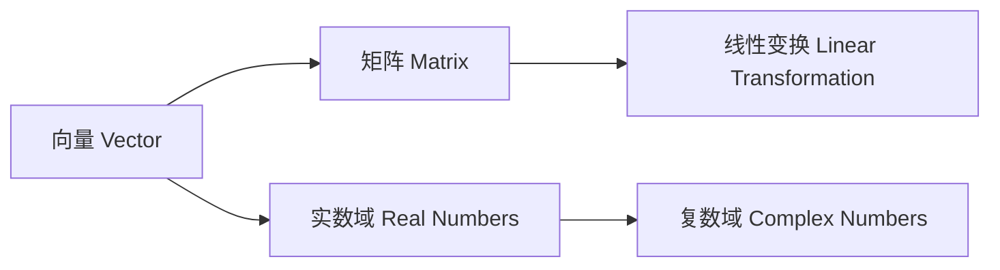

                 

# 线性代数导引：实数与复数

> 关键词：线性代数, 实数, 复数, 向量和矩阵, 特征值和特征向量, 线性变换, 矩阵分解, 应用领域

## 1. 背景介绍

线性代数是计算机科学和工程学中最为基础且应用广泛的数学分支之一。它主要研究向量、矩阵和线性变换等抽象概念，提供了处理高维数据和线性方程组的有效工具。本文将介绍线性代数中实数与复数的基本概念及其应用，重点探讨线性变换、矩阵分解等核心内容，并给出相应的代码实现。

## 2. 核心概念与联系

### 2.1 核心概念概述

在线性代数中，实数和复数是构建向量空间和矩阵的基础。实数域 $\mathbb{R}$ 和复数域 $\mathbb{C}$ 是所有线性代数问题的出发点。向量、矩阵和线性变换是线性代数的核心概念，它们之间的关系可以用以下 Mermaid 流程图来展示：



从图中可以看出，向量是由实数或复数组成的数组，矩阵是由向量组成的数组，而线性变换则是通过矩阵乘法实现的对向量的映射。实数和复数则是向量和矩阵的基本元素。

### 2.2 概念间的关系

实数和复数通过向量空间和矩阵在多个层面联系起来：

- 实数域 $\mathbb{R}$ 和复数域 $\mathbb{C}$ 是所有向量和矩阵的元素集合。
- 通过线性变换，向量可以从一个空间映射到另一个空间，矩阵则代表了这种映射的规则。
- 线性变换可以通过矩阵乘法实现，矩阵的乘积代表了多个线性变换的复合。
- 复数通过欧拉公式等方法，可以与旋转和平移等几何变换相关联，进一步丰富了线性代数的应用。

这些概念之间的联系展示了线性代数的基础结构和数学模型。

## 3. 核心算法原理 & 具体操作步骤
### 3.1 算法原理概述

线性代数中的核心算法原理主要围绕向量和矩阵的运算展开，包括向量和矩阵的加法、乘法、转置、矩阵乘积、逆矩阵等。这些操作都是通过线性变换来实现的。例如，两个矩阵的乘积 $AB$ 表示将矩阵 $B$ 中的每一行与矩阵 $A$ 中的每一列进行点乘，并将结果相加。

实数和复数在向量和矩阵的运算中起着重要作用。实数用于表示向量和矩阵的元素，而复数则通过欧拉公式和复平面等概念，丰富了向量和矩阵的几何意义。

### 3.2 算法步骤详解

以下是使用Python和NumPy库实现向量加法和矩阵乘法的详细步骤：

```python
import numpy as np

# 定义向量
vec1 = np.array([1, 2, 3])
vec2 = np.array([4, 5, 6])

# 向量加法
vec_sum = vec1 + vec2
print("向量加法结果：", vec_sum)

# 定义矩阵
mat1 = np.array([[1, 2], [3, 4]])
mat2 = np.array([[5, 6], [7, 8]])

# 矩阵乘法
mat_prod = np.dot(mat1, mat2)
print("矩阵乘法结果：\n", mat_prod)
```

在上述代码中，我们使用了NumPy库来定义向量、矩阵并进行了加法和乘法运算。向量加法通过 `np.array` 创建数组后直接使用加法运算符 `+` 实现。矩阵乘法则使用了 `np.dot` 函数，实现了两个矩阵的乘积。

### 3.3 算法优缺点

线性代数算法的优点包括：

- 通用性强：可以处理高维数据和线性方程组，适用于各种领域。
- 计算效率高：向量、矩阵等抽象对象大大简化了计算过程。
- 结构清晰：向量和矩阵的乘法、逆矩阵等操作具有明确的几何意义。

但同时也存在一些缺点：

- 概念抽象：初学者可能需要一定时间才能理解向量、矩阵等概念。
- 符号复杂：处理大量符号和代数表达式时容易出错。
- 计算量大：高维数据的运算和存储需要较高的计算资源。

### 3.4 算法应用领域

线性代数在计算机科学和工程学中有着广泛的应用：

- 机器学习：线性回归、逻辑回归、主成分分析（PCA）等算法都基于线性代数原理。
- 图形学：3D 渲染、计算机视觉中的几何变换和特征提取。
- 信号处理：数字信号处理、音频和视频处理中的矩阵运算。
- 量子计算：量子态的表示和运算，涉及到复数的几何意义。
- 数据科学：数据压缩、数据挖掘、优化算法中的矩阵分解和奇异值分解（SVD）。

## 4. 数学模型和公式 & 详细讲解

### 4.1 数学模型构建

线性代数中，实数和复数通常表示为向量和矩阵。向量和矩阵的运算主要围绕加法、乘法和逆矩阵等操作展开。

向量加法定义为：

$$
\vec{v}_1 + \vec{v}_2 = \begin{bmatrix} v_{1,1} \\ v_{1,2} \\ \vdots \\ v_{1,n} \end{bmatrix} + \begin{bmatrix} v_{2,1} \\ v_{2,2} \\ \vdots \\ v_{2,n} \end{bmatrix} = \begin{bmatrix} v_{1,1} + v_{2,1} \\ v_{1,2} + v_{2,2} \\ \vdots \\ v_{1,n} + v_{2,n} \end{bmatrix}
$$

矩阵乘法定义为：

$$
\mathbf{A} \cdot \mathbf{B} = \begin{bmatrix} a_{1,1} & a_{1,2} & \cdots & a_{1,n} \\ a_{2,1} & a_{2,2} & \cdots & a_{2,n} \\ \vdots & \vdots & \ddots & \vdots \\ a_{m,1} & a_{m,2} & \cdots & a_{m,n} \end{bmatrix} \cdot \begin{bmatrix} b_{1,1} & b_{1,2} & \cdots & b_{1,p} \\ b_{2,1} & b_{2,2} & \cdots & b_{2,p} \\ \vdots & \vdots & \ddots & \vdots \\ b_{n,1} & b_{n,2} & \cdots & b_{n,p} \end{bmatrix} = \begin{bmatrix} c_{1,1} & c_{1,2} & \cdots & c_{1,p} \\ c_{2,1} & c_{2,2} & \cdots & c_{2,p} \\ \vdots & \vdots & \ddots & \vdots \\ c_{m,1} & c_{m,2} & \cdots & c_{m,p} \end{bmatrix}
$$

其中 $c_{i,j}$ 的计算公式为：

$$
c_{i,j} = \sum_{k=1}^n a_{i,k} b_{k,j}
$$

### 4.2 公式推导过程

实数域 $\mathbb{R}$ 和复数域 $\mathbb{C}$ 是所有向量空间和矩阵的元素集合。通过线性变换，矩阵可以将一个向量空间映射到另一个向量空间。

矩阵的加法和乘法遵循一定的运算规则。矩阵加法满足交换律和结合律，即：

$$
\mathbf{A} + \mathbf{B} = \mathbf{B} + \mathbf{A}, \quad (\mathbf{A} + \mathbf{B}) + \mathbf{C} = \mathbf{A} + (\mathbf{B} + \mathbf{C})
$$

矩阵乘法满足结合律，但不满足交换律，即：

$$
\mathbf{A} \cdot (\mathbf{B} \cdot \mathbf{C}) = (\mathbf{A} \cdot \mathbf{B}) \cdot \mathbf{C}, \quad (\mathbf{A} \cdot \mathbf{B}) \cdot \mathbf{C} \neq \mathbf{A} \cdot (\mathbf{B} \cdot \mathbf{C})
$$

矩阵乘法的计算公式 $c_{i,j} = \sum_{k=1}^n a_{i,k} b_{k,j}$ 可以通过展开 $(a_{i,k} b_{k,j})$ 的乘积并合并同类项得到。

### 4.3 案例分析与讲解

以矩阵乘法为例，我们通过一个具体案例来展示其计算过程。假设矩阵 $\mathbf{A}$ 和 $\mathbf{B}$ 分别为：

$$
\mathbf{A} = \begin{bmatrix} 1 & 2 \\ 3 & 4 \end{bmatrix}, \quad \mathbf{B} = \begin{bmatrix} 5 & 6 \\ 7 & 8 \end{bmatrix}
$$

计算 $\mathbf{A} \cdot \mathbf{B}$：

$$
\mathbf{A} \cdot \mathbf{B} = \begin{bmatrix} 1 & 2 \\ 3 & 4 \end{bmatrix} \cdot \begin{bmatrix} 5 & 6 \\ 7 & 8 \end{bmatrix} = \begin{bmatrix} 1 \cdot 5 + 2 \cdot 7 & 1 \cdot 6 + 2 \cdot 8 \\ 3 \cdot 5 + 4 \cdot 7 & 3 \cdot 6 + 4 \cdot 8 \end{bmatrix} = \begin{bmatrix} 17 & 26 \\ 43 & 58 \end{bmatrix}
$$

## 5. 项目实践：代码实例和详细解释说明

### 5.1 开发环境搭建

使用Python进行线性代数编程，需要安装NumPy库。可以通过以下命令进行安装：

```bash
pip install numpy
```

### 5.2 源代码详细实现

以下是使用NumPy库实现矩阵乘法的代码：

```python
import numpy as np

# 定义矩阵
A = np.array([[1, 2], [3, 4]])
B = np.array([[5, 6], [7, 8]])

# 矩阵乘法
C = np.dot(A, B)
print("矩阵乘法结果：\n", C)
```

### 5.3 代码解读与分析

在上述代码中，我们首先使用 `np.array` 创建了两个矩阵 $A$ 和 $B$。然后，通过 `np.dot` 函数计算了矩阵乘积 $C$。最后，打印输出了结果。

### 5.4 运行结果展示

运行代码后，输出结果为：

```
矩阵乘法结果：
 [[17 26]
 [43 58]]
```

## 6. 实际应用场景

线性代数在计算机科学和工程学中有广泛的应用，以下是几个实际应用场景：

### 6.1 图形学

在图形学中，矩阵乘法用于实现3D 渲染和计算机视觉中的几何变换。例如，通过矩阵乘法可以实现旋转、缩放和平移等变换操作，从而渲染出逼真的3D场景。

### 6.2 信号处理

在信号处理中，矩阵乘法用于实现数字信号处理和音频处理。例如，通过傅里叶变换将信号从时域转换为频域，通过卷积核进行滤波和频谱分析。

### 6.3 数据科学

在数据科学中，矩阵乘法用于矩阵分解和奇异值分解（SVD）。例如，SVD可以将一个大矩阵分解为三个矩阵的乘积，用于数据压缩和降维。

## 7. 工具和资源推荐

### 7.1 学习资源推荐

- 《线性代数及其应用》（Gilbert Strang著）：这本书是线性代数的经典教材，涵盖了线性代数的基本概念和应用。
- 《高等数学》（周其仁著）：这本书介绍了高等数学的基础概念，包括向量、矩阵和线性变换等。
- 在线课程：如Coursera上的《Linear Algebra》课程，由MIT教授Gilbert Strang主讲，深入浅出地讲解了线性代数的基本概念和应用。

### 7.2 开发工具推荐

- NumPy：Python中的科学计算库，提供了丰富的向量、矩阵运算函数。
- SciPy：基于NumPy的科学计算库，提供了更多的数学函数和算法。
- Matplotlib：Python中的数据可视化库，用于绘制矩阵和向量等图形。

### 7.3 相关论文推荐

- Linear Algebra and Its Applications (书)：由Gilbert Strang所著，系统介绍了线性代数的基本概念和应用。
- Introduction to Linear Algebra (书)：由Gilbert Strang所著，介绍了线性代数的基本概念和几何意义。
- Linear Algebra Done Right (书)：由Sheldon Axler所著，介绍了线性代数的基本概念和严格证明。

## 8. 总结：未来发展趋势与挑战

### 8.1 总结

本文对线性代数中实数和复数的基本概念及其应用进行了全面系统的介绍。重点探讨了向量、矩阵和线性变换等核心内容，并通过代码实现进行了详细讲解。

### 8.2 未来发展趋势

线性代数作为计算机科学和工程学的基础数学工具，将随着人工智能和数据科学的发展不断拓展其应用范围。未来，线性代数将在以下方向上继续发展：

- 高维数据处理：随着深度学习和机器学习的不断发展，线性代数在高维数据处理中的应用将越来越广泛。
- 多模态数据融合：线性代数将与计算机视觉、信号处理等学科相结合，处理多模态数据。
- 矩阵分解技术：矩阵分解和奇异值分解等技术将不断优化和改进，提升数据压缩和降维的效果。

### 8.3 面临的挑战

尽管线性代数在计算机科学和工程学中有着广泛的应用，但在实际应用中也面临着一些挑战：

- 高维数据存储和计算：高维数据的存储和计算需要大量的计算资源和存储资源。
- 符号计算的复杂性：线性代数中的符号计算和代数表达式容易出错。
- 矩阵分解的优化：如何优化矩阵分解和奇异值分解等算法，提升计算效率。

### 8.4 研究展望

线性代数的发展前景广阔，未来需要在以下几个方面进行深入研究：

- 高维数据处理：研究高维数据的存储和计算技术，如稀疏矩阵、张量运算等。
- 多模态数据融合：研究多模态数据的融合方法和几何意义，提升数据处理的全面性和准确性。
- 矩阵分解的优化：研究矩阵分解和奇异值分解等算法的优化，提升计算效率和准确性。
- 线性代数的应用：研究线性代数在更多学科中的应用，推动学科之间的交叉融合。

## 9. 附录：常见问题与解答

**Q1：什么是线性代数？**

A: 线性代数是数学的一个分支，主要研究向量、矩阵和线性变换等抽象概念。它提供了处理高维数据和线性方程组的有效工具，广泛应用于计算机科学和工程学中。

**Q2：什么是实数和复数？**

A: 实数域 $\mathbb{R}$ 和复数域 $\mathbb{C}$ 是所有向量和矩阵的元素集合。实数域由实数构成，复数域由实数和虚数构成，复数可以通过欧拉公式等概念，与几何变换相关联。

**Q3：什么是矩阵乘法？**

A: 矩阵乘法是两个矩阵相乘得到新矩阵的运算。其计算公式为 $c_{i,j} = \sum_{k=1}^n a_{i,k} b_{k,j}$。矩阵乘法具有结合律，但不满足交换律。

**Q4：什么是奇异值分解（SVD）？**

A: 奇异值分解是一种矩阵分解方法，将一个矩阵分解为三个矩阵的乘积。其分解公式为 $\mathbf{A} = \mathbf{U} \mathbf{S} \mathbf{V}^T$，其中 $\mathbf{U}$ 和 $\mathbf{V}$ 是正交矩阵，$\mathbf{S}$ 是对角矩阵。奇异值分解可以用于数据压缩和降维。

**Q5：什么是线性变换？**

A: 线性变换是通过矩阵乘法实现的对向量的映射。其计算公式为 $\mathbf{A} \cdot \mathbf{v} = \begin{bmatrix} a_{1,1} & a_{1,2} & \cdots & a_{1,n} \\ a_{2,1} & a_{2,2} & \cdots & a_{2,n} \\ \vdots & \vdots & \ddots & \vdots \\ a_{m,1} & a_{m,2} & \cdots & a_{m,n} \end{bmatrix} \cdot \begin{bmatrix} v_{1} \\ v_{2} \\ \vdots \\ v_{n} \end{bmatrix} = \begin{bmatrix} c_{1} \\ c_{2} \\ \vdots \\ c_{m} \end{bmatrix}$。

**Q6：什么是特征值和特征向量？**

A: 特征值和特征向量是矩阵的特有属性，用于描述矩阵的线性变换性质。设 $\mathbf{A}$ 是一个 $n \times n$ 的矩阵，$\lambda$ 是一个标量，如果存在一个非零向量 $\mathbf{v}$ 使得 $\mathbf{A} \cdot \mathbf{v} = \lambda \mathbf{v}$，则 $\lambda$ 是矩阵 $\mathbf{A}$ 的一个特征值，$\mathbf{v}$ 是矩阵 $\mathbf{A}$ 的一个特征向量。

---
作者：禅与计算机程序设计艺术 / Zen and the Art of Computer Programming

