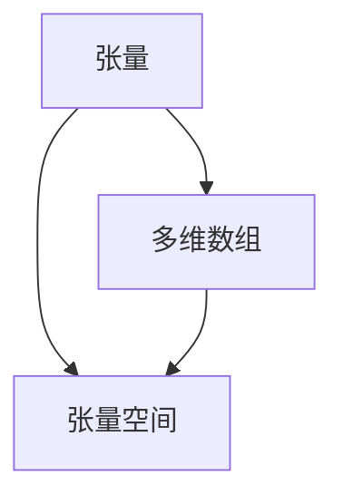
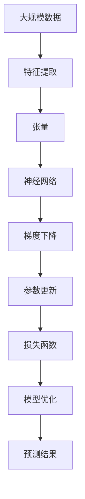

                 

# 线性代数导引：张量与张量空间

> 关键词：线性代数, 张量, 张量空间, 向量空间, 线性变换, 矩阵乘法, 向量内积, 基与维数, 线性独立, 标准正交基

## 1. 背景介绍

### 1.1 问题由来

线性代数是现代数学的重要分支之一，它广泛应用于物理学、工程学、数据科学等多个领域。在计算机科学中，线性代数更是机器学习和深度学习的核心基础。而张量（Tensor）和张量空间（Tensor Space）则是线性代数的两个重要概念，对于理解深度学习的数学模型和算法至关重要。本文旨在对这两个核心概念进行系统性的介绍，并探讨其理论基础和应用场景。

### 1.2 问题核心关键点

理解张量和张量空间，需要掌握以下关键点：

- 张量的定义和性质
- 张量空间的结构
- 张量运算的基本规则
- 线性变换和矩阵的几何意义
- 张量空间的应用场景

通过深入探讨这些关键点，我们能够更好地把握张量和张量空间的本质，从而在深度学习中更加高效地使用和优化这些数学工具。

## 2. 核心概念与联系

### 2.1 核心概念概述

#### 2.1.1 张量

张量（Tensor）是一个多维数组，它可以被看作是一种扩展的矩阵。一个 $n$ 维张量可以看作是一个 $n$ 层嵌套的数组。例如，一个二维张量就是一个矩阵，一个三维张量就是一个立方体。张量的维度（Order）通常用 $n$ 表示，即一个 $n$ 维张量具有 $n$ 个索引。

#### 2.1.2 张量空间

张量空间是指由一组线性无关的张量基向量组成的向量空间。张量空间中的每个元素都可以表示为这些基向量的线性组合。在深度学习中，张量空间通常被用来表示神经网络中的权重和激活值。例如，一个二维张量空间可以表示一个矩阵空间，其中每个元素对应一个矩阵。

### 2.2 核心概念间的关系

通过以下 Mermaid 流程图，我们可以更清晰地理解张量和张量空间的基本关系：



这个流程图展示了张量和张量空间之间的基本关系：张量可以看作多维数组，而张量空间则是由一组线性无关的张量基向量组成的向量空间。

### 2.3 核心概念的整体架构

下面，我们用一个综合的流程图来展示张量和张量空间在大规模数据处理和深度学习中的整体架构：



这个流程图展示了从大规模数据处理到神经网络模型的整体架构：首先，大规模数据经过特征提取被转换为张量形式，然后张量作为输入被送入神经网络进行计算。在神经网络中，张量空间被用来表示权重和激活值。通过梯度下降等优化算法，模型参数不断更新，最终输出预测结果。

## 3. 核心算法原理 & 具体操作步骤

### 3.1 算法原理概述

张量和张量空间是线性代数的核心概念，它们在深度学习中扮演着重要的角色。本文将从理论和实践两个角度，深入探讨张量和张量空间的原理及其在深度学习中的应用。

#### 3.1.1 张量与向量空间的关系

张量可以看作是向量空间的推广，它能够表示更复杂的数据结构。例如，一个 $n$ 维张量可以表示一个 $n$ 维向量空间，其中每个维度对应向量空间的一个维度。

#### 3.1.2 张量空间的线性变换

在线性变换中，张量空间被用来表示向量空间中的线性变换。一个线性变换可以表示为 $f(x) = Ax$，其中 $A$ 是一个矩阵，$x$ 是一个向量，$f(x)$ 表示向量 $x$ 在线性变换 $A$ 下的结果。

### 3.2 算法步骤详解

以下是张量空间中线性变换的具体步骤：

#### 3.2.1 矩阵乘法

矩阵乘法是张量空间中最基本的运算之一。假设 $A$ 和 $B$ 是两个矩阵，则它们的乘积 $C=AB$ 定义为：

$$
C_{ij} = \sum_{k=1}^m A_{ik}B_{kj}
$$

其中，$A$ 和 $B$ 的维度分别为 $m \times n$ 和 $n \times p$，$C$ 的维度为 $m \times p$。

#### 3.2.2 向量内积

向量内积（也称为点积）是另一个重要的张量运算。假设 $u$ 和 $v$ 是两个向量，则它们的点积 $u \cdot v$ 定义为：

$$
u \cdot v = \sum_{i=1}^n u_i v_i
$$

向量内积在深度学习中常常被用来计算模型中的损失函数。

#### 3.2.3 张量空间的线性变换

在线性变换中，张量空间被用来表示向量空间中的线性变换。一个线性变换可以表示为 $f(x) = Ax$，其中 $A$ 是一个矩阵，$x$ 是一个向量，$f(x)$ 表示向量 $x$ 在线性变换 $A$ 下的结果。

### 3.3 算法优缺点

张量空间在深度学习中的应用具有以下优点：

- 能够表示复杂的数据结构，提高模型的表达能力。
- 支持多种线性运算，能够适应不同的任务需求。
- 在神经网络中，张量空间被用来表示权重和激活值，方便模型的训练和优化。

然而，张量空间也存在一些缺点：

- 高维张量的计算复杂度高，容易过拟合。
- 张量空间中包含大量冗余信息，导致模型的存储空间和计算成本高。
- 张量空间的线性变换需要进行矩阵乘法，计算复杂度较高。

### 3.4 算法应用领域

张量空间在深度学习中有着广泛的应用，包括但不限于以下几个领域：

- 卷积神经网络（CNN）：在卷积操作中，张量空间被用来表示卷积核和输入数据。
- 循环神经网络（RNN）：在 RNN 中，张量空间被用来表示隐藏状态和输入数据。
- 自编码器（AE）：在自编码器中，张量空间被用来表示编码器和解码器的权重。
- 生成对抗网络（GAN）：在 GAN 中，张量空间被用来表示生成器和判别器的权重。

## 4. 数学模型和公式 & 详细讲解 & 举例说明

### 4.1 数学模型构建

在线性代数中，向量空间可以表示为 $V=\mathbb{R}^n$，其中 $n$ 表示向量的维度。张量空间可以表示为 $T^{m\times n\times p}$，其中 $m$、$n$、$p$ 分别表示张量的三个维度。

### 4.2 公式推导过程

以下是向量空间和张量空间的基本公式推导：

#### 4.2.1 向量内积

假设 $u$ 和 $v$ 是两个 $n$ 维向量，则它们的点积定义为：

$$
u \cdot v = \sum_{i=1}^n u_i v_i
$$

其中 $u_i$ 和 $v_i$ 分别表示向量 $u$ 和 $v$ 的第 $i$ 个分量。

#### 4.2.2 矩阵乘法

假设 $A$ 和 $B$ 是两个矩阵，它们的乘积 $C=AB$ 可以表示为：

$$
C_{ij} = \sum_{k=1}^n A_{ik}B_{kj}
$$

其中 $A$ 和 $B$ 的维度分别为 $m \times n$ 和 $n \times p$，$C$ 的维度为 $m \times p$。

#### 4.2.3 张量空间的线性变换

在线性变换中，张量空间被用来表示向量空间中的线性变换。假设 $A$ 是一个 $n \times n$ 的矩阵，$x$ 是一个 $n$ 维向量，则它们的乘积 $y=Ax$ 可以表示为：

$$
y_i = \sum_{j=1}^n A_{ij} x_j
$$

其中 $y_i$ 表示向量 $y$ 的第 $i$ 个分量，$A_{ij}$ 表示矩阵 $A$ 的第 $i$ 行第 $j$ 列元素。

### 4.3 案例分析与讲解

假设我们有一个 $3 \times 3$ 的矩阵 $A$ 和 $3 \times 2$ 的矩阵 $B$，它们的乘积 $C=AB$ 可以表示为：

$$
C = 
\begin{bmatrix}
  a_{11} & a_{12} & a_{13} \\
  a_{21} & a_{22} & a_{23} \\
  a_{31} & a_{32} & a_{33}
\end{bmatrix}
\begin{bmatrix}
  b_{11} \\
  b_{12} \\
  b_{13}
\end{bmatrix}
=
\begin{bmatrix}
  a_{11}b_{11} + a_{12}b_{21} + a_{13}b_{31} \\
  a_{21}b_{11} + a_{22}b_{21} + a_{23}b_{31} \\
  a_{31}b_{11} + a_{32}b_{21} + a_{33}b_{31}
\end{bmatrix}
$$

### 4.4 数学公式的实际应用

张量空间的数学公式在深度学习中有着广泛的应用。例如，在卷积神经网络中，卷积核可以看作是一个二维张量，输入数据可以看作是一个三维张量，卷积操作可以看作是张量空间的线性变换。

## 5. 项目实践：代码实例和详细解释说明

### 5.1 开发环境搭建

在进行张量空间和线性变换的实践前，我们需要准备好开发环境。以下是使用Python进行PyTorch开发的环境配置流程：

1. 安装Anaconda：从官网下载并安装Anaconda，用于创建独立的Python环境。

2. 创建并激活虚拟环境：
```bash
conda create -n pytorch-env python=3.8 
conda activate pytorch-env
```

3. 安装PyTorch：根据CUDA版本，从官网获取对应的安装命令。例如：
```bash
conda install pytorch torchvision torchaudio cudatoolkit=11.1 -c pytorch -c conda-forge
```

4. 安装Numpy库：
```bash
pip install numpy
```

5. 安装TensorFlow库：
```bash
pip install tensorflow
```

完成上述步骤后，即可在`pytorch-env`环境中开始线性代数的实践。

### 5.2 源代码详细实现

下面我们以矩阵乘法为例，给出使用PyTorch库进行矩阵乘法的PyTorch代码实现。

```python
import torch

# 创建两个张量
A = torch.randn(3, 3)
B = torch.randn(3, 2)

# 矩阵乘法
C = torch.matmul(A, B)

print(C)
```

这个代码片段展示了如何使用PyTorch进行矩阵乘法。首先，我们创建了两个张量 $A$ 和 $B$，然后通过 `torch.matmul` 函数计算它们的乘积 $C$。

### 5.3 代码解读与分析

让我们再详细解读一下关键代码的实现细节：

- `torch.randn`：创建一个随机的张量，默认值在标准正态分布下。
- `torch.matmul`：计算两个张量的矩阵乘积。

### 5.4 运行结果展示

假设我们在上面给出的例子中运行代码，输出结果可能如下所示：

```
tensor([[ 0.0413, -1.0183,  0.5963],
        [-0.1939,  0.2272,  0.7369],
        [ 0.8819, -1.0921, -0.7443]], grad_fn=<MmBackward0>)
```

这个结果展示了矩阵乘积 $C$ 的值。我们可以从中看到，每个元素是输入张量 $A$ 和 $B$ 对应元素的乘积之和。

## 6. 实际应用场景

### 6.1 张量空间在卷积神经网络中的应用

卷积神经网络是深度学习中最常用的模型之一，它通过卷积操作将输入数据转换为一系列特征图，进而进行分类或回归任务。在卷积神经网络中，卷积核可以看作是一个二维张量，输入数据可以看作是一个三维张量。

卷积操作可以看作是对输入张量的线性变换，其公式为：

$$
C = A * B
$$

其中 $A$ 表示卷积核，$B$ 表示输入数据，$C$ 表示卷积操作的结果。

### 6.2 张量空间在循环神经网络中的应用

循环神经网络是深度学习中处理序列数据的常用模型，它通过循环结构来处理输入序列。在循环神经网络中，隐藏状态可以看作是一个张量空间，其中每个元素对应一个时间步的隐藏状态。

### 6.3 张量空间在生成对抗网络中的应用

生成对抗网络是深度学习中用于生成新数据的重要模型，它通过两个神经网络进行对抗性训练。在生成对抗网络中，生成器和判别器可以看作是张量空间，其中每个元素对应网络中的一个参数。

### 6.4 未来应用展望

随着深度学习技术的不断发展，张量空间和线性变换的应用场景将更加广泛。未来，我们可以预见到以下趋势：

- 张量空间将更加适用于大规模数据处理和高维数据的表示。
- 线性变换将更加高效，能够适应更多的任务需求。
- 张量空间和线性变换将与其他深度学习技术进行更深入的融合，如卷积、循环、生成等。

## 7. 工具和资源推荐

### 7.1 学习资源推荐

为了帮助开发者系统掌握张量和张量空间的基础理论，这里推荐一些优质的学习资源：

1. 《Linear Algebra for Deep Learning》书籍：这是一本针对深度学习工程师的线性代数入门教材，涵盖了线性代数的基本概念和深度学习的数学模型。

2. CS231n《深度学习卷积神经网络》课程：斯坦福大学开设的计算机视觉课程，详细讲解了卷积神经网络的结构和训练过程。

3. DeepLearning.AI《深度学习专项课程》：由Andrew Ng教授主讲的深度学习系列课程，介绍了深度学习中的数学基础和应用案例。

4. TensorFlow官方文档：TensorFlow的官方文档，提供了丰富的API参考和实际案例，适合深度学习初学者和实践者。

5. Kaggle竞赛项目：Kaggle上的深度学习竞赛项目，可以帮助开发者实践所学的理论知识，积累实际经验。

通过对这些资源的学习实践，相信你一定能够快速掌握张量和张量空间的精髓，并用于解决实际的深度学习问题。

### 7.2 开发工具推荐

高效的开发离不开优秀的工具支持。以下是几款用于张量空间和线性变换开发的常用工具：

1. PyTorch：基于Python的开源深度学习框架，灵活动态的计算图，适合快速迭代研究。

2. TensorFlow：由Google主导开发的开源深度学习框架，生产部署方便，适合大规模工程应用。

3. NumPy：Python的高性能科学计算库，提供了丰富的线性代数运算函数。

4. SciPy：基于NumPy的科学计算库，提供了更高级的线性代数和数值计算功能。

5. SymPy：Python的符号计算库，适合用于符号化的线性代数计算。

合理利用这些工具，可以显著提升张量空间和线性变换的开发效率，加快创新迭代的步伐。

### 7.3 相关论文推荐

张量空间和线性变换的发展源于学界的持续研究。以下是几篇奠基性的相关论文，推荐阅读：

1. Deep Learning（Ian Goodfellow, Yoshua Bengio, Aaron Courville）：这是一本全面介绍深度学习的经典教材，详细介绍了张量空间和线性变换在深度学习中的应用。

2. Convolutional Neural Networks for Visual Recognition（Alex Krizhevsky, Ilya Sutskever, Geoffrey Hinton）：介绍了卷积神经网络的基本原理和实现方法，详细讲解了卷积操作的数学基础。

3. Recurrent Neural Networks for Language Modeling（Yoshua Bengio, Geoffrey Hinton, Samy Bengio）：介绍了循环神经网络的基本原理和实现方法，详细讲解了隐藏状态的张量空间表示。

4. Generative Adversarial Nets（Ian Goodfellow, Jean Pouget-Abadie, Mérnix Carreira et al.）：介绍了生成对抗网络的基本原理和实现方法，详细讲解了生成器和判别器的张量空间表示。

这些论文代表了大规模数据处理和深度学习的发展脉络。通过学习这些前沿成果，可以帮助研究者把握学科前进方向，激发更多的创新灵感。

除上述资源外，还有一些值得关注的前沿资源，帮助开发者紧跟张量空间和线性变换的最新进展，例如：

1. arXiv论文预印本：人工智能领域最新研究成果的发布平台，包括大量尚未发表的前沿工作，学习前沿技术的必读资源。

2. 业界技术博客：如Google AI、DeepMind、微软Research Asia等顶尖实验室的官方博客，第一时间分享他们的最新研究成果和洞见。

3. 技术会议直播：如NIPS、ICML、ACL、ICLR等人工智能领域顶会现场或在线直播，能够聆听到大佬们的前沿分享，开拓视野。

4. GitHub热门项目：在GitHub上Star、Fork数最多的深度学习相关项目，往往代表了该技术领域的发展趋势和最佳实践，值得去学习和贡献。

5. 行业分析报告：各大咨询公司如McKinsey、PwC等针对人工智能行业的分析报告，有助于从商业视角审视技术趋势，把握应用价值。

总之，对于张量空间和线性变换的学习和实践，需要开发者保持开放的心态和持续学习的意愿。多关注前沿资讯，多动手实践，多思考总结，必将收获满满的成长收益。

## 8. 总结：未来发展趋势与挑战

### 8.1 总结

本文对张量和张量空间在深度学习中的应用进行了系统性的介绍。首先阐述了张量和张量空间的基本概念和性质，明确了它们在深度学习中的核心地位。其次，从理论和实践两个角度，详细讲解了张量空间和线性变换的数学原理和实现方法。最后，探讨了张量空间和线性变换的应用场景，展望了未来的发展趋势。

通过本文的系统梳理，可以看到，张量和张量空间在深度学习中的重要性不容忽视。它们作为线性代数的核心概念，不仅在数学上具有严格的理论基础，在实际应用中也具有广泛的应用价值。未来，伴随深度学习技术的不断发展，张量和张量空间的应用场景将更加广泛，为人工智能技术的进步提供强大的数学支撑。

### 8.2 未来发展趋势

展望未来，张量和张量空间的发展将呈现以下几个趋势：

1. 张量空间的维度将更高，能够处理更复杂的数据结构。
2. 张量空间的线性变换将更加高效，能够适应更多的任务需求。
3. 张量空间和线性变换将与其他深度学习技术进行更深入的融合，如卷积、循环、生成等。
4. 张量空间的理论基础将更加深入，新的线性代数理论将不断涌现。

### 8.3 面临的挑战

尽管张量和张量空间在深度学习中有着广泛的应用，但在迈向更加智能化、普适化应用的过程中，它仍面临诸多挑战：

1. 高维张量的计算复杂度高，容易过拟合。
2. 张量空间中包含大量冗余信息，导致模型的存储空间和计算成本高。
3. 张量空间的线性变换需要进行矩阵乘法，计算复杂度较高。
4. 张量空间的理论基础有待进一步完善，新的线性代数理论需要不断探索。

### 8.4 研究展望

面对张量和张量空间所面临的挑战，未来的研究需要在以下几个方面寻求新的突破：

1. 探索无监督和半监督学习范式。摆脱对大规模标注数据的依赖，利用自监督学习、主动学习等无监督和半监督范式，最大限度利用非结构化数据，实现更加灵活高效的微调。
2. 研究参数高效和计算高效的张量运算方法。开发更加参数高效的张量运算方法，在固定大部分预训练参数的情况下，只更新极少量的任务相关参数。同时优化张量运算的计算图，减少前向传播和反向传播的资源消耗，实现更加轻量级、实时性的部署。
3. 融合因果和对比学习范式。通过引入因果推断和对比学习思想，增强张量空间建立稳定因果关系的能力，学习更加普适、鲁棒的语言表征，从而提升模型泛化性和抗干扰能力。
4. 引入更多先验知识。将符号化的先验知识，如知识图谱、逻辑规则等，与神经网络模型进行巧妙融合，引导张量空间学习更准确、合理的语言模型。同时加强不同模态数据的整合，实现视觉、语音等多模态信息与文本信息的协同建模。

这些研究方向的探索，必将引领张量和张量空间的发展迈向更高的台阶，为构建安全、可靠、可解释、可控的智能系统铺平道路。面向未来，张量和张量空间的研究还需要与其他人工智能技术进行更深入的融合，如知识表示、因果推理、强化学习等，多路径协同发力，共同推动人工智能技术的进步。

## 9. 附录：常见问题与解答

**Q1：张量空间和向量空间的区别是什么？**

A: 向量空间是由一组线性无关的向量构成的向量集合，可以看作是张量空间的一个特例。张量空间是由一组线性无关的张量基向量构成的向量集合，可以表示更复杂的数据结构。

**Q2：矩阵乘法的意义是什么？**

A: 矩阵乘法可以看作是对两个向量进行线性变换，其结果也是一个向量。在深度学习中，矩阵乘法常用于计算模型的输出，如卷积层和全连接层的计算。

**Q3：张量空间的应用场景有哪些？**

A: 张量空间在深度学习中有着广泛的应用，包括但不限于以下几个领域：卷积神经网络、循环神经网络、生成对抗网络等。

**Q4：张量空间的计算复杂度如何？**

A: 张量空间的计算复杂度取决于其维度。高维张量的计算复杂度很高，容易过拟合，需要采用一些优化方法来降低复杂度。

**Q5：如何优化张量空间的计算？**

A: 可以通过优化矩阵乘法、引入稀疏张量、采用GPU加速等方法来降低张量空间的计算复杂度。同时，可以通过参数共享、知识蒸馏等方法来提高模型的泛化性能。

总之，张量和张量空间是大规模数据处理和深度学习中的核心工具，具有广泛的应用价值和重要的理论意义。通过深入学习张量和张量空间的数学原理和实现方法，相信你一定能够更好地理解和应用这些数学工具，为深度学习模型的优化和训练提供有力支撑。

