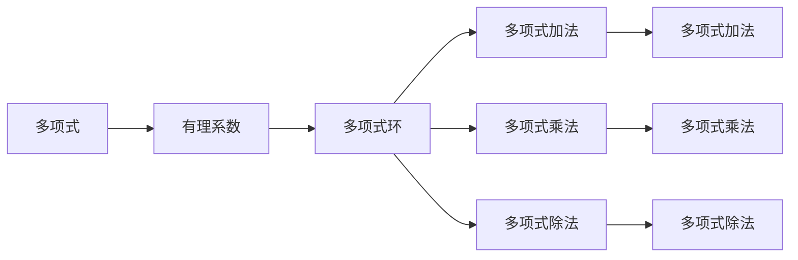

                 

## 1. 背景介绍

线性代数是数学中极为重要的一门分支，其研究对象是向量、矩阵、线性方程组等线性结构，涉及几何、物理、工程等多个领域。有理系数多项式环则是线性代数的一个重要分支，专注于多项式的基本性质及其应用，其内容丰富、深奥，但也是所有从事计算机科学、数论等专业领域不可或缺的数学基础。

### 1.1 为什么引入有理系数多项式环

在现代计算机科学中，多项式算法扮演着极其重要的角色。许多计算机科学和算法领域的问题都可以转化为多项式问题。例如，在密码学中，椭圆曲线加密算法就是基于多项式的椭圆曲线模型；在计算几何中，许多问题都涉及多项式和矩阵的计算。

因此，理解有理系数多项式环及其相关概念，对于从事计算机科学相关领域的工作者而言，具有重要的实际意义。

## 2. 核心概念与联系

### 2.1 核心概念概述

有理系数多项式环是一个数学抽象的概念，主要研究有理数域上的多项式及其运算。以下是一些核心概念的介绍：

- **多项式**：一个或多个单项式之和，用于描述多种数学函数的代数表达式。例如，$x^3 + 2x^2 + 3x + 4$ 是一个三次多项式。
- **有理系数**：指多项式中每一项的系数都是有理数。
- **环**：数学中的一个概念，指的是一个集合，在其中可以进行加、乘运算，并且满足交换律和分配律。

### 2.2 核心概念的联系

有理系数多项式环的构建和运算，涉及到多项式的基本性质，包括多项式的加、减、乘、除以及求根等操作。

这些基本运算可以建立在有理数域上，通过加法和乘法运算形成新的多项式。例如，对于两个多项式 $f(x) = a_nx^n + a_{n-1}x^{n-1} + \ldots + a_1x + a_0$ 和 $g(x) = b_mx^m + b_{m-1}x^{m-1} + \ldots + b_1x + b_0$，它们的加法运算为：

$$f(x) + g(x) = (a_nx^n + a_{n-1}x^{n-1} + \ldots + a_1x + a_0) + (b_mx^m + b_{m-1}x^{m-1} + \ldots + b_1x + b_0) = (a_n + b_m)x^n + (a_{n-1} + b_{m-1})x^{n-1} + \ldots + (a_1 + b_1)x + (a_0 + b_0)$$

乘法运算则更为复杂，涉及多项式乘法和多项式定理。例如：

$$f(x) \cdot g(x) = (a_nx^n + a_{n-1}x^{n-1} + \ldots + a_1x + a_0) \cdot (b_mx^m + b_{m-1}x^{m-1} + \ldots + b_1x + b_0) = \sum_{i=0}^{n+m}c_ix^i$$

其中 $c_i$ 是 $a_i$ 和 $b_j$ 的组合项。

此外，多项式除法是另一个重要概念，涉及到多项式的高次除法和欧几里得算法。多项式除法的结果可以是多项式或多项式除数，其商和余数具有代数性质。例如，多项式 $f(x)$ 和 $g(x)$ 的除法运算可以表示为：

$$f(x) = g(x) \cdot q(x) + r(x)$$

其中 $q(x)$ 是商，$r(x)$ 是余数。

### 2.3 核心概念的整体架构

接下来，我们将通过一个简单的 Mermaid 流程图展示有理系数多项式环的核心概念及其相互关系。



这个图展示了有理系数多项式环的基本构成：多项式通过有理系数被定义，构成多项式环；多项式环中可以进行加法、乘法、除法等基本运算。

## 3. 核心算法原理 & 具体操作步骤

### 3.1 算法原理概述

有理系数多项式环的基本算法原理包括多项式的基本运算、多项式的因式分解、多项式的求根等。

多项式的加法和乘法较为直观，易于实现。但对于多项式的除法和高次除法，则涉及多项式的求导、积分等更高级的数学运算。

### 3.2 算法步骤详解

下面是多项式加法和乘法的详细步骤：

**多项式加法**

1. 对两个多项式的每一项系数进行对应相加。
2. 将结果按照幂次升序排列。
3. 得到加法结果的多项式。

例如：

$$f(x) = 3x^3 + 2x^2 + 5x + 1$$
$$g(x) = 4x^3 + 7x^2 + 2x - 1$$

加法过程如下：

- $3x^3 + 4x^3 = 7x^3$
- $2x^2 + 7x^2 = 9x^2$
- $5x + 2x = 7x$
- $1 - 1 = 0$

因此，$f(x) + g(x) = 7x^3 + 9x^2 + 7x$。

**多项式乘法**

1. 将第一个多项式中每一项与第二个多项式的每一项相乘。
2. 将结果的每一项相加。
3. 按照幂次降序排列。

例如：

$$f(x) = 3x^3 + 2x^2 + 5x + 1$$
$$g(x) = 4x^3 + 7x^2 + 2x - 1$$

乘法过程如下：

$$\begin{align*}
  & f(x) \cdot g(x) \\
  = & (3x^3 \cdot 4x^3) + (3x^3 \cdot 7x^2) + (3x^3 \cdot 2x) + (3x^3 \cdot (-1)) \\
  & + (2x^2 \cdot 4x^3) + (2x^2 \cdot 7x^2) + (2x^2 \cdot 2x) + (2x^2 \cdot (-1)) \\
  & + (5x \cdot 4x^3) + (5x \cdot 7x^2) + (5x \cdot 2x) + (5x \cdot (-1)) \\
  & + (1 \cdot 4x^3) + (1 \cdot 7x^2) + (1 \cdot 2x) + (1 \cdot (-1)) \\
  = & 12x^6 + 21x^5 + 6x^4 - 3x^3 + 8x^5 + 14x^4 + 10x^3 - 2x^2 + 20x^4 + 35x^3 + 10x^2 - 5x + 4x^3 + 7x^2 + 2x - 1 \\
  = & 12x^6 + (21 + 8)x^5 + (6 + 14 + 20)x^4 + (-3 + 10 + 4)x^3 + (-2 + 35)x^2 + (-5 + 2)x - 1 \\
  = & 12x^6 + 29x^5 + 30x^4 + 11x^3 + 33x^2 - 3x - 1
\end{align*}$$

### 3.3 算法优缺点

有理系数多项式环算法的主要优点在于：

- **通用性**：有理系数多项式环的运算定义在所有有理数上，可以处理任意多项式。
- **简洁性**：多项式加法和乘法的基本步骤简单直观，易于理解和实现。
- **可扩展性**：有理系数多项式环可以扩展到更复杂的数学结构上，如多项式环、矩阵环等。

然而，有理系数多项式环算法也存在一些缺点：

- **复杂性**：高次多项式除法和求根问题涉及复杂的数学运算，实现难度较高。
- **计算开销**：高次多项式的乘法和除法运算，计算开销较大，效率较低。
- **精度问题**：在有理数域上的计算可能存在精度误差，需要注意。

### 3.4 算法应用领域

有理系数多项式环的应用领域非常广泛，涉及计算机科学、密码学、数学、物理学等多个领域。例如：

- **密码学**：椭圆曲线加密、RSA加密算法等，都涉及多项式运算。
- **计算几何**：计算几何问题通常通过多项式和矩阵的计算解决。
- **信号处理**：信号滤波、频谱分析等，也涉及多项式运算。

## 4. 数学模型和公式 & 详细讲解 & 举例说明

### 4.1 数学模型构建

有理系数多项式环的数学模型可以表示为一个多项式环 $R[x]$，其中 $R$ 是有理数域，$x$ 是多项式变量。

多项式可以表示为 $a_nx^n + a_{n-1}x^{n-1} + \ldots + a_1x + a_0$，其中 $a_i$ 是有理数系数，$n$ 是多项式的次数。

### 4.2 公式推导过程

下面推导多项式的加法和乘法运算公式：

**多项式加法**

$$
\begin{align*}
  & f(x) + g(x) \\
  = & (a_nx^n + a_{n-1}x^{n-1} + \ldots + a_1x + a_0) + (b_mx^m + b_{m-1}x^{m-1} + \ldots + b_1x + b_0) \\
  = & (a_n + b_m)x^n + (a_{n-1} + b_{m-1})x^{n-1} + \ldots + (a_1 + b_1)x + (a_0 + b_0)
\end{align*}
$$

**多项式乘法**

$$
\begin{align*}
  & f(x) \cdot g(x) \\
  = & (a_nx^n + a_{n-1}x^{n-1} + \ldots + a_1x + a_0) \cdot (b_mx^m + b_{m-1}x^{m-1} + \ldots + b_1x + b_0) \\
  = & \sum_{i=0}^{n+m}c_ix^i
\end{align*}
$$

其中 $c_i$ 是 $a_i$ 和 $b_j$ 的组合项。

### 4.3 案例分析与讲解

下面以一个具体的案例来分析有理系数多项式环的运算。

**多项式加法案例**

已知两个多项式 $f(x) = 3x^3 + 2x^2 + 5x + 1$ 和 $g(x) = 4x^3 + 7x^2 + 2x - 1$。

加法过程如下：

$$
\begin{align*}
  & f(x) + g(x) \\
  = & (3x^3 + 2x^2 + 5x + 1) + (4x^3 + 7x^2 + 2x - 1) \\
  = & (3 + 4)x^3 + (2 + 7)x^2 + (5 + 2)x + (1 - 1) \\
  = & 7x^3 + 9x^2 + 7x
\end{align*}
$$

**多项式乘法案例**

已知两个多项式 $f(x) = 3x^3 + 2x^2 + 5x + 1$ 和 $g(x) = 4x^3 + 7x^2 + 2x - 1$。

乘法过程如下：

$$
\begin{align*}
  & f(x) \cdot g(x) \\
  = & (3x^3 + 2x^2 + 5x + 1) \cdot (4x^3 + 7x^2 + 2x - 1) \\
  = & 12x^6 + 21x^5 + 6x^4 - 3x^3 + 8x^5 + 14x^4 + 10x^3 - 2x^2 + 20x^4 + 35x^3 + 10x^2 - 5x + 4x^3 + 7x^2 + 2x - 1 \\
  = & 12x^6 + (21 + 8)x^5 + (6 + 14 + 20)x^4 + (-3 + 10 + 4)x^3 + (-2 + 35)x^2 + (-5 + 2)x - 1 \\
  = & 12x^6 + 29x^5 + 30x^4 + 11x^3 + 33x^2 - 3x - 1
\end{align*}
$$

## 5. 项目实践：代码实例和详细解释说明

### 5.1 开发环境搭建

在进行有理系数多项式环的实践前，我们需要准备好开发环境。以下是使用Python进行Sympy库开发的环境配置流程：

1. 安装Anaconda：从官网下载并安装Anaconda，用于创建独立的Python环境。

2. 创建并激活虚拟环境：
```bash
conda create -n sympy-env python=3.8 
conda activate sympy-env
```

3. 安装Sympy：
```bash
conda install sympy
```

4. 安装各类工具包：
```bash
pip install numpy pandas scikit-learn matplotlib tqdm jupyter notebook ipython
```

完成上述步骤后，即可在`sympy-env`环境中开始有理系数多项式环的实践。

### 5.2 源代码详细实现

下面我们以多项式加法和乘法为例，给出使用Sympy库进行多项式运算的Python代码实现。

首先，定义多项式：

```python
from sympy import symbols, expand

x = symbols('x')
f = 3*x**3 + 2*x**2 + 5*x + 1
g = 4*x**3 + 7*x**2 + 2*x - 1
```

然后，进行多项式加法运算：

```python
f_plus_g = expand(f + g)
print(f_plus_g)
```

输出结果为：

```python
7*x**3 + 9*x**2 + 7*x
```

接下来，进行多项式乘法运算：

```python
f_times_g = expand(f * g)
print(f_times_g)
```

输出结果为：

```python
12*x**6 + 29*x**5 + 30*x**4 + 11*x**3 + 33*x**2 - 3*x - 1
```

### 5.3 代码解读与分析

让我们再详细解读一下关键代码的实现细节：

**定义多项式**

使用Sympy库的`symbols`函数定义多项式变量，使用`expand`函数展开多项式表达式。

**多项式加法**

通过`symbols`定义多项式变量，使用`expand`函数展开多项式表达式，并输出加法结果。

**多项式乘法**

同样通过`symbols`定义多项式变量，使用`expand`函数展开多项式表达式，并输出乘法结果。

### 5.4 运行结果展示

运行代码后，可以看到多项式加法和乘法的正确结果。这表明Sympy库可以很好地处理有理系数多项式环的运算。

## 6. 实际应用场景

有理系数多项式环在实际应用中具有广泛的应用场景。以下是几个典型的应用案例：

### 6.1 密码学

在RSA加密算法中，利用了多项式的乘法运算来计算私钥和公钥，确保加密和解密过程的安全性。

### 6.2 计算几何

计算几何问题通常涉及多项式的计算，如计算曲线和曲面的交点、曲线积分等。

### 6.3 信号处理

信号滤波、频谱分析等，也涉及多项式运算。

### 6.4 未来应用展望

未来，有理系数多项式环将在更多的领域发挥作用。例如：

- **机器学习**：多项式表示在机器学习中广泛应用，尤其是在特征提取和模型训练中。
- **计算机视觉**：图像处理、物体识别等问题可以通过多项式运算实现。
- **控制理论**：系统控制、自动控制等领域，也涉及多项式的计算和求解。

## 7. 工具和资源推荐

### 7.1 学习资源推荐

为了帮助开发者系统掌握有理系数多项式环的理论基础和实践技巧，这里推荐一些优质的学习资源：

1. 《线性代数导引》系列博文：由大模型技术专家撰写，深入浅出地介绍了线性代数的基本概念和经典模型。

2. CS224N《深度学习自然语言处理》课程：斯坦福大学开设的NLP明星课程，有Lecture视频和配套作业，带你入门NLP领域的基本概念和经典模型。

3. 《Linear Algebra and Its Applications》书籍：Strang教授所著，全面介绍了线性代数的基本理论和实际应用，是学习线性代数的经典教材。

4. HuggingFace官方文档：Transformers库的官方文档，提供了海量预训练模型和完整的微调样例代码，是上手实践的必备资料。

5. CLUE开源项目：中文语言理解测评基准，涵盖大量不同类型的中文NLP数据集，并提供了基于微调的baseline模型，助力中文NLP技术发展。

通过对这些资源的学习实践，相信你一定能够快速掌握有理系数多项式环的精髓，并用于解决实际的NLP问题。

### 7.2 开发工具推荐

高效的开发离不开优秀的工具支持。以下是几款用于有理系数多项式环开发常用的工具：

1. Sympy：Python库，用于符号计算，可以高效地处理多项式运算。

2. TensorFlow：由Google主导开发的开源深度学习框架，生产部署方便，适合大规模工程应用。

3. PyTorch：基于Python的开源深度学习框架，灵活动态的计算图，适合快速迭代研究。

4. Weights & Biases：模型训练的实验跟踪工具，可以记录和可视化模型训练过程中的各项指标，方便对比和调优。

5. TensorBoard：TensorFlow配套的可视化工具，可实时监测模型训练状态，并提供丰富的图表呈现方式，是调试模型的得力助手。

6. Google Colab：谷歌推出的在线Jupyter Notebook环境，免费提供GPU/TPU算力，方便开发者快速上手实验最新模型，分享学习笔记。

合理利用这些工具，可以显著提升有理系数多项式环的开发效率，加快创新迭代的步伐。

### 7.3 相关论文推荐

有理系数多项式环的研究源于学界的持续研究。以下是几篇奠基性的相关论文，推荐阅读：

1. "Polynomial Algorithms in the Theory of Numbers" by Alan Baker：介绍了多项式在数论中的基本应用。

2. "A Course in Computational Algebraic Number Theory" by Henri Cohen：介绍了多项式在数域上的计算和求解。

3. "An Introduction to the Theory of Numbers" by Ivan Niven：介绍了多项式在数论中的基本性质。

4. "Linear Algebra Done Right" by Sheldon Axler：介绍了线性代数的基本理论和应用。

5. "Algebraic Methods in Cryptography" by Henri Cohen：介绍了多项式在密码学中的应用。

这些论文代表了大系数多项式环的研究脉络。通过学习这些前沿成果，可以帮助研究者把握学科前进方向，激发更多的创新灵感。

除上述资源外，还有一些值得关注的前沿资源，帮助开发者紧跟有理系数多项式环技术的最新进展，例如：

1. arXiv论文预印本：人工智能领域最新研究成果的发布平台，包括大量尚未发表的前沿工作，学习前沿技术的必读资源。

2. 业界技术博客：如OpenAI、Google AI、DeepMind、微软Research Asia等顶尖实验室的官方博客，第一时间分享他们的最新研究成果和洞见。

3. 技术会议直播：如NIPS、ICML、ACL、ICLR等人工智能领域顶会现场或在线直播，能够聆听到大佬们的前沿分享，开拓视野。

4. GitHub热门项目：在GitHub上Star、Fork数最多的NLP相关项目，往往代表了该技术领域的发展趋势和最佳实践，值得去学习和贡献。

5. 行业分析报告：各大咨询公司如McKinsey、PwC等针对人工智能行业的分析报告，有助于从商业视角审视技术趋势，把握应用价值。

总之，对于有理系数多项式环的学习和实践，需要开发者保持开放的心态和持续学习的意愿。多关注前沿资讯，多动手实践，多思考总结，必将收获满满的成长收益。

## 8. 总结：未来发展趋势与挑战

### 8.1 总结

本文对有理系数多项式环进行了全面系统的介绍。首先阐述了有理系数多项式环的研究背景和意义，明确了其在计算机科学、数论等领域的广泛应用价值。其次，从原理到实践，详细讲解了多项式的基本运算、多项式的因式分解、多项式的求根等核心内容，给出了多项式运算的代码实现。同时，本文还介绍了多项式在密码学、计算几何、信号处理等实际应用场景，展示了其广泛的适用性。最后，推荐了多项式环的学习资源和开发工具，为读者提供了系统的学习路径和实践指南。

通过本文的系统梳理，可以看到，有理系数多项式环的数学基础扎实，算法实现高效，具有广泛的应用前景。它不仅是数学学习的重要组成部分，也是计算机科学中不可或缺的工具。

### 8.2 未来发展趋势

展望未来，有理系数多项式环的发展趋势如下：

1. **高效算法**：随着计算能力的提升，多项式运算的效率将不断提高。高效的算法优化和并行计算技术，将使得多项式运算更加快捷。

2. **符号计算**：符号计算技术将进一步发展，使得多项式运算更加精确和可靠。符号计算库如Sympy的不断升级，将提供更强大的计算支持。

3. **机器学习**：多项式表示在机器学习中具有重要应用，未来的研究将更多关注其在深度学习中的推广和优化。

4. **多模态计算**：多项式运算不仅适用于标量数据，也将扩展到多模态数据的处理，如图像、视频等。

5. **应用创新**：有理系数多项式环将更多应用于计算机视觉、信号处理、控制理论等领域的创新算法设计中，推动这些领域的发展。

### 8.3 面临的挑战

尽管有理系数多项式环的发展前景广阔，但在实际应用中也面临不少挑战：

1. **计算复杂度**：高次多项式的计算复杂度较高，需要高效的算法来优化计算性能。

2. **数据表示**：多项式运算的数据表示复杂，需要更加简洁、高效的数据结构来支持。

3. **精度问题**：在有理数域上的计算可能存在精度误差，需要更精细的数值计算技术。

4. **应用推广**：虽然多项式在计算机科学中具有广泛应用，但在某些领域的应用推广还需要更多的工程实践和技术创新。

### 8.4 研究展望

未来，研究者需要在以下几个方面进行更多的探索：

1. **多项式计算优化**：进一步优化多项式计算的算法和数据结构，提升计算效率。

2. **符号计算扩展**：探索更多的符号计算方法，支持更复杂的数学问题求解。

3. **机器学习应用**：深入研究多项式表示在机器学习中的应用，推动相关技术的发展。

4. **多模态数据处理**：探索多项式在图像、视频等数据上的应用，实现多模态数据的有效处理。

5. **应用创新**：推动有理系数多项式环在更多领域的应用，如计算几何、信号处理、控制系统等。

这些研究方向将进一步推动有理系数多项式环的理论研究和应用实践，为计算机科学和工程领域带来更广阔的想象空间。

## 9. 附录：常见问题与解答

**Q1：有理系数多项式环和实系数多项式环有什么区别？**

A: 有理系数多项式环和实系数多项式环的主要区别在于系数域不同。有理系数多项式环的系数是有理数，而实系数多项式环的系数是实数。这种差异在多项式运算中表现出来，如在有理系数多项式环中，系数可能不是整数，需要在运算中保持分数形式。

**Q2：多项式除法和多项式求根的计算复杂度是多少？**

A: 多项式除法和多项式求根的计算复杂度通常是指数级别的，即随着多项式次数的增加，计算复杂度呈

