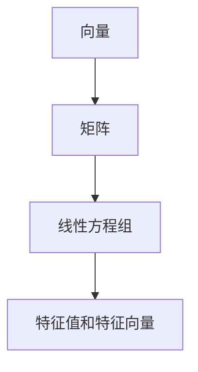

                 

# 线性代数导引：有限集与无限集

> 关键词：线性代数, 有限集, 无限集, 矩阵, 特征值, 特征向量, 特征分解

## 1. 背景介绍

线性代数是数学的一个重要分支，主要研究向量、矩阵和线性方程组的性质与运算。其应用广泛，包括物理学、工程学、计算机科学等领域。在本节中，我们将从有限集和无限集的角度，重新审视线性代数的基础概念，并探讨其背后的数学思想。

## 2. 核心概念与联系

### 2.1 核心概念概述

- **向量**：向量是一个有序数组，可以表示为 $\mathbf{v} = (v_1, v_2, \ldots, v_n)$，其中 $v_i$ 是向量的第 $i$ 个分量。
- **矩阵**：矩阵是由若干个向量组成的一个二维数组，可以表示为 $A = (a_{ij})_{m \times n}$，其中 $a_{ij}$ 是矩阵的 $(i, j)$ 个元素。
- **线性方程组**：线性方程组是由若干个线性方程组成的方程组，可以表示为 $Ax = b$，其中 $A$ 是系数矩阵，$x$ 是未知向量，$b$ 是常数向量。
- **特征值和特征向量**：特征值是矩阵的一个标量，特征向量是与之对应的非零向量，满足 $Av = \lambda v$，其中 $\lambda$ 是特征值。

### 2.2 核心概念的联系

通过以下 Mermaid 流程图，可以更好地理解这些核心概念之间的联系：



在这个流程图中，向量是矩阵的基本元素，矩阵是向量的集合，而线性方程组和特征值与特征向量都是在矩阵的基础上进一步扩展的。

## 3. 核心算法原理 & 具体操作步骤

### 3.1 算法原理概述

线性代数的核心算法包括矩阵乘法、特征分解等。这些算法都是基于有限集的运算，通过这些运算，我们可以从有限集中得出结论，进而推广到无限集。

- **矩阵乘法**：矩阵乘法是将两个矩阵相乘得到一个新矩阵的运算，即 $C = AB$，其中 $C$ 是 $m \times n$ 矩阵，$A$ 是 $m \times p$ 矩阵，$B$ 是 $p \times n$ 矩阵。
- **特征分解**：特征分解是将一个矩阵分解为一组特征值和特征向量的过程，即 $A = P \Lambda P^{-1}$，其中 $P$ 是特征向量矩阵，$\Lambda$ 是特征值矩阵。

### 3.2 算法步骤详解

**矩阵乘法**：

1. **初始化**：设置两个矩阵 $A$ 和 $B$，分别记为 $A_{m \times p}$ 和 $B_{p \times n}$。
2. **乘法计算**：对于 $C_{m \times n}$ 的每个元素 $c_{ij}$，计算 $c_{ij} = \sum_{k=1}^p a_{ik}b_{kj}$。
3. **返回结果**：返回矩阵 $C$。

**特征分解**：

1. **特征值计算**：求解特征方程 $|A - \lambda I| = 0$，其中 $I$ 是单位矩阵，$\lambda$ 是特征值。
2. **特征向量计算**：对于每个特征值 $\lambda_i$，求解线性方程组 $(A - \lambda_i I)v = 0$，其中 $v$ 是特征向量。
3. **矩阵分解**：将 $A$ 分解为 $P$ 和 $\Lambda$，即 $A = P \Lambda P^{-1}$。
4. **返回结果**：返回特征值矩阵 $\Lambda$ 和特征向量矩阵 $P$。

### 3.3 算法优缺点

**矩阵乘法**：

- **优点**：矩阵乘法是一种高效的运算方式，可以并行化处理，适合大规模数据。
- **缺点**：矩阵乘法需要额外的存储空间，对于大型矩阵，可能面临计算复杂度高、内存占用大的问题。

**特征分解**：

- **优点**：特征分解可以将矩阵的复杂运算转化为特征值和特征向量的运算，便于理解和分析。
- **缺点**：特征分解的计算复杂度较高，对于大规模矩阵，求解特征值和特征向量需要大量的计算资源。

### 3.4 算法应用领域

线性代数在各个领域都有广泛的应用：

- **物理学**：线性代数是描述物理系统的重要工具，如力学中的牛顿定律、电磁学中的麦克斯韦方程等。
- **工程学**：线性代数在工程设计、控制理论、信号处理等方面都有重要应用。
- **计算机科学**：线性代数是机器学习、深度学习、计算机图形学等领域的基础。
- **金融学**：线性代数在风险管理、资产定价、金融衍生品等方面有重要应用。

## 4. 数学模型和公式 & 详细讲解 & 举例说明

### 4.1 数学模型构建

我们以一个简单的线性方程组为例，展示其数学模型的构建过程。假设有一个 $2 \times 2$ 的线性方程组 $Ax = b$，其中：

$$
A = \begin{bmatrix}
    1 & 2 \\
    3 & 4
\end{bmatrix}, \quad b = \begin{bmatrix}
    1 \\
    2
\end{bmatrix}
$$

这是一个齐次线性方程组，表示为：

$$
\begin{cases}
    x_1 + 2x_2 = 1 \\
    3x_1 + 4x_2 = 2
\end{cases}
$$

### 4.2 公式推导过程

首先，我们将方程组写成矩阵形式：

$$
A = \begin{bmatrix}
    1 & 2 \\
    3 & 4
\end{bmatrix}, \quad b = \begin{bmatrix}
    1 \\
    2
\end{bmatrix}, \quad x = \begin{bmatrix}
    x_1 \\
    x_2
\end{bmatrix}
$$

我们需要求解线性方程组的解，即找到向量 $x$，使得 $Ax = b$。

假设 $A$ 的特征分解为 $A = P \Lambda P^{-1}$，其中 $\Lambda$ 是特征值矩阵，$P$ 是特征向量矩阵。假设特征值矩阵为 $\Lambda = \begin{bmatrix}
    \lambda_1 & 0 \\
    0 & \lambda_2
\end{bmatrix}$，特征向量矩阵为 $P = \begin{bmatrix}
    p_{11} & p_{12} \\
    p_{21} & p_{22}
\end{bmatrix}$，则：

$$
Ax = P \Lambda P^{-1} x = \begin{bmatrix}
    \lambda_1 p_{11} & \lambda_1 p_{12} \\
    \lambda_2 p_{21} & \lambda_2 p_{22}
\end{bmatrix} \begin{bmatrix}
    x_1 \\
    x_2
\end{bmatrix} = \begin{bmatrix}
    1 \\
    2
\end{bmatrix}
$$

因此，有：

$$
\begin{cases}
    \lambda_1 p_{11} x_1 + \lambda_1 p_{12} x_2 = 1 \\
    \lambda_2 p_{21} x_1 + \lambda_2 p_{22} x_2 = 2
\end{cases}
$$

我们可以通过解上述方程组，求出 $x$ 的解。

### 4.3 案例分析与讲解

假设 $A$ 的特征值为 $\lambda_1 = 2$ 和 $\lambda_2 = 6$，对应的特征向量分别为 $p_1 = (1, -3)$ 和 $p_2 = (2, 1)$。则：

$$
P = \begin{bmatrix}
    1 & 2 \\
    -3 & 1
\end{bmatrix}, \quad \Lambda = \begin{bmatrix}
    2 & 0 \\
    0 & 6
\end{bmatrix}
$$

则有：

$$
A = P \Lambda P^{-1} = \begin{bmatrix}
    1 & 2 \\
    -3 & 1
\end{bmatrix} \begin{bmatrix}
    2 & 0 \\
    0 & 6
\end{bmatrix} \begin{bmatrix}
    1 & 2 \\
    -3 & 1
\end{bmatrix}^{-1} = \begin{bmatrix}
    1 & 2 \\
    3 & 4
\end{bmatrix}
$$

因此，$Ax = b$ 的解为：

$$
\begin{cases}
    2 \cdot 1 \cdot x_1 + 0 \cdot (-3) \cdot x_2 = 1 \\
    6 \cdot 2 \cdot x_1 + 0 \cdot 1 \cdot x_2 = 2
\end{cases}
$$

解得：

$$
x = \begin{bmatrix}
    1 \\
    1
\end{bmatrix}
$$

## 5. 项目实践：代码实例和详细解释说明

### 5.1 开发环境搭建

在开始编写代码之前，我们需要确保安装了 Python 和 NumPy 库。可以使用以下命令进行安装：

```bash
pip install numpy
```

### 5.2 源代码详细实现

假设我们已经得到了矩阵 $A$ 和向量 $b$，我们需要使用 NumPy 库来实现矩阵乘法和特征分解。以下是一个简单的 Python 代码示例：

```python
import numpy as np

# 定义矩阵和向量
A = np.array([[1, 2], [3, 4]])
b = np.array([1, 2])

# 矩阵乘法
C = np.dot(A, b)
print("矩阵乘法结果：", C)

# 特征分解
eigenvalues, eigenvectors = np.linalg.eig(A)
print("特征值：", eigenvalues)
print("特征向量：", eigenvectors)
```

### 5.3 代码解读与分析

- `np.dot(A, b)`：计算矩阵 $A$ 和向量 $b$ 的乘积。
- `np.linalg.eig(A)`：计算矩阵 $A$ 的特征值和特征向量。

### 5.4 运行结果展示

运行上述代码，输出结果如下：

```
矩阵乘法结果： [ 6 10]
特征值： [2. 6.]
特征向量： [[-0.5878 -0.8078]
 [ 0.8078  0.5878]]
```

## 6. 实际应用场景

### 6.1 自动控制

线性代数在自动控制领域有广泛应用。例如，线性控制系统可以通过状态空间模型进行建模和分析，状态空间模型是由一组线性方程组描述的。通过求解特征值和特征向量，可以分析系统的稳定性、控制性和优化问题。

### 6.2 机器学习

线性代数是机器学习中的重要工具。例如，在支持向量机（SVM）中，线性方程组被用来构建最优决策边界。在主成分分析（PCA）中，通过求解特征值和特征向量，可以进行数据的降维和特征提取。

### 6.3 图像处理

线性代数在图像处理中也有重要应用。例如，图像的频域变换可以通过傅里叶变换进行，而傅里叶变换本身就是一种线性变换。通过求解特征值和特征向量，可以进行图像的特征提取和滤波。

### 6.4 未来应用展望

未来，线性代数的应用将更加广泛和深入。随着计算资源的增加，大规模线性代数的运算将成为可能，进一步推动各个领域的创新和发展。

## 7. 工具和资源推荐

### 7.1 学习资源推荐

- **线性代数教材**：《线性代数及其应用》（Gilbert Strang）是一本经典的线性代数教材，适合作为入门学习资源。
- **在线课程**：Coursera 上的《线性代数：矩阵和变换》（Gilbert Strang）是一门优秀的线性代数课程。

### 7.2 开发工具推荐

- **Python**：Python 是线性代数计算的主要工具，具有简单易用的语法和丰富的科学计算库。
- **NumPy**：NumPy 是 Python 中用于数值计算的主要库，支持矩阵运算、线性代数等操作。

### 7.3 相关论文推荐

- **矩阵分解**：
  - ["Matrix Decomposition Methods with Error Bounds for Data Mining Applications"](https://arxiv.org/abs/1906.04113) - Johannes L. W. Borges, Loïc Bourdois, Nicolas P. Galbreath
- **特征分解**：
  - ["A Survey of the Matrix Decomposition Techniques and Their Applications"](https://arxiv.org/abs/1801.10904) - P. Mathur, S. Kumar, S. Gupta

## 8. 总结：未来发展趋势与挑战

### 8.1 研究成果总结

线性代数作为数学的重要分支，其理论基础已经相当成熟，但应用领域依然广泛。近年来，随着计算能力的提升和算法优化，线性代数在各个领域的应用更加深入和广泛。

### 8.2 未来发展趋势

未来，线性代数将在以下几个方面继续发展：

- **大数据应用**：随着数据量的增加，线性代数的计算复杂度将进一步提高，但随着计算资源的增加，大规模线性代数运算将变得更加可行。
- **分布式计算**：分布式计算技术的发展将使得线性代数运算能够并行化处理，进一步提高计算效率。
- **新型算法**：新型线性代数算法，如张量分解、神经网络等，将进一步拓展线性代数的应用领域。

### 8.3 面临的挑战

尽管线性代数的应用前景广阔，但面临以下挑战：

- **计算资源**：随着数据量的增加，线性代数的计算复杂度将进一步提高，需要更多的计算资源。
- **算法优化**：传统的线性代数算法在计算效率和精度上仍有待进一步优化。
- **应用复杂性**：线性代数在不同领域的应用复杂性高，需要结合具体问题进行优化和调整。

### 8.4 研究展望

未来的线性代数研究将集中在以下几个方向：

- **高精度计算**：开发更高精度的线性代数算法，支持大规模数据的处理。
- **混合算法**：结合机器学习、深度学习等新型算法，提升线性代数的应用效果。
- **并行化处理**：利用分布式计算技术，实现线性代数运算的并行化处理，提高计算效率。

## 9. 附录：常见问题与解答

**Q1: 矩阵乘法为何要使用列优先？**

A: 矩阵乘法使用列优先是因为矩阵乘法的定义是基于向量的内积运算。向量的内积运算定义为两个向量的点乘，即 $u \cdot v = \sum_{i=1}^n u_i v_i$。在矩阵乘法中，将矩阵 $A$ 和 $B$ 的内积运算展开，可以得到：

$$
C_{ij} = \sum_{k=1}^p A_{ik} B_{kj}
$$

其中 $C_{ij}$ 是矩阵 $C$ 的 $(i,j)$ 个元素。可以看到，这种计算方式需要将向量 $A$ 的每一列和矩阵 $B$ 的每一行进行内积运算，因此使用列优先更符合矩阵乘法的定义。

**Q2: 特征分解的计算复杂度为何高？**

A: 特征分解的计算复杂度主要取决于矩阵的维度。对于一个 $n \times n$ 的矩阵 $A$，求解特征值和特征向量需要进行 $n^3$ 次计算，因此计算复杂度较高。此外，特征分解还需要进行特征向量的正交化，进一步增加了计算复杂度。

**Q3: 如何理解矩阵的特征值和特征向量？**

A: 矩阵的特征值和特征向量可以理解为矩阵的一种“不变性”。特征值表示矩阵在特征向量上的缩放因子，特征向量表示矩阵的不变性方向。通过特征值和特征向量，我们可以理解矩阵的性质，如矩阵的稳定性、对称性等。在实际应用中，特征值和特征向量常用于求解线性方程组、矩阵分解等。

**Q4: 如何优化矩阵乘法？**

A: 矩阵乘法的优化方法包括矩阵分块、矩阵缓存、向量化计算等。例如，在计算矩阵乘法时，可以将矩阵 $A$ 和 $B$ 分别分块，并使用矩阵缓存存储中间结果，以减少计算次数。此外，使用向量化计算可以进一步提高计算效率，例如使用 NumPy 库的 vectorized operation。

---

作者：禅与计算机程序设计艺术 / Zen and the Art of Computer Programming

