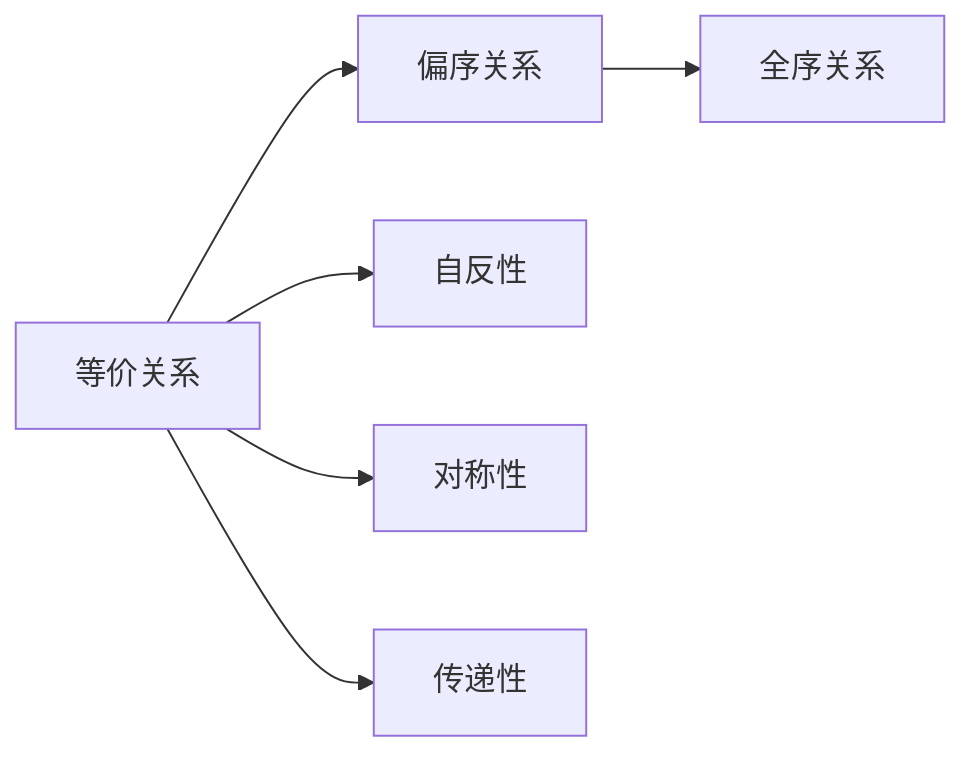
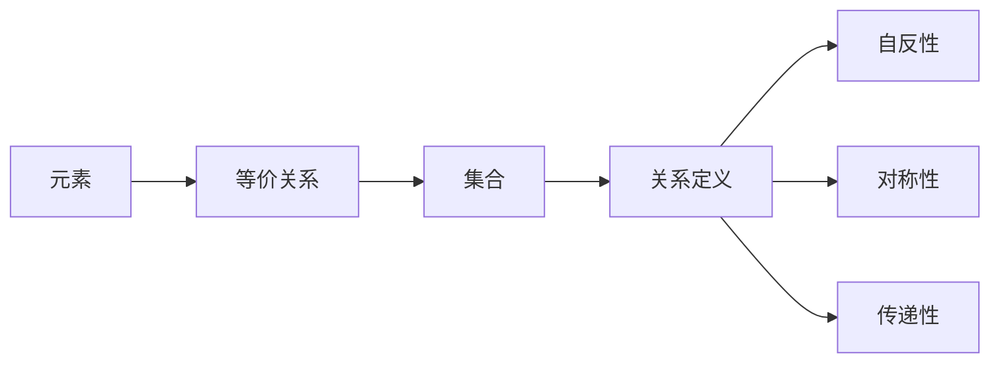
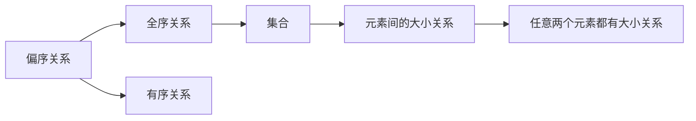
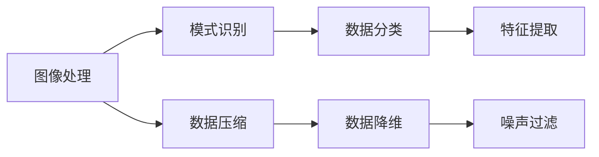
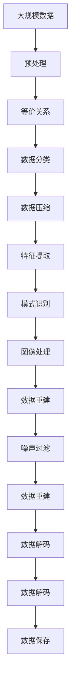

                 

# 线性代数导引：等价关系

## 1. 背景介绍

### 1.1 问题由来
线性代数是数学与计算机科学中最基础且重要的分支之一。在计算机科学中，线性代数广泛应用于向量空间、矩阵运算、线性变换等多个方面，成为许多算法和数据结构设计的基础。其中，等价关系（Equivalence Relations）是线性代数中的重要概念，广泛用于数据分类、图像处理、模式识别等场景。本文将通过深入解析等价关系的原理，帮助读者全面掌握其应用技巧，并在此基础上探索其在计算机科学中的实际应用。

### 1.2 问题核心关键点
等价关系作为线性代数中的一个核心概念，其本质是定义一个集合内元素之间的相似性关系。通常，等价关系用于分类、降维、数据压缩等多个领域，具有广泛的应用价值。在计算机科学中，等价关系的应用尤其突出，涉及图像处理、模式识别、数据压缩等诸多方面。本文将详细探讨等价关系的定义、性质及在计算机科学中的应用，以期为读者提供全面的理论基础和实践指导。

### 1.3 问题研究意义
掌握等价关系及其在计算机科学中的应用，对于理解复杂系统的结构、优化算法设计、提高数据处理效率具有重要意义。特别是在现代大数据时代，数据分类、模式识别、特征提取等任务频繁出现，等价关系的应用更为广泛。因此，深入研究等价关系及其应用，不仅有助于理论知识的积累，还能够在实际工程中发挥关键作用，推动计算机科学技术的进步。

## 2. 核心概念与联系

### 2.1 核心概念概述

为更好地理解等价关系的原理及其应用，本节将介绍几个密切相关的核心概念：

- 等价关系（Equivalence Relations）：定义在一个集合上，用于描述集合内元素之间的相似性关系。常见于图像处理、模式识别、数据压缩等领域。
- 偏序关系（Partial Order Relations）：一种特殊的等价关系，用于描述集合中元素之间的有序关系。常见于排序算法、数据库索引等。
- 全序关系（Total Order Relations）：一种特殊的偏序关系，即集合中任意两个元素都有明确的大小关系。常见于排序算法、搜索算法等。
- 自反性（Reflexivity）：等价关系的一种性质，表示任何元素都与自身等价。例如，在图像处理中，相似图像自身即为等价。
- 对称性（Symmetry）：等价关系的一种性质，表示如果两个元素等价，则它们的顺序可以颠倒。例如，在分类任务中，A和B为同类别时，B和A也为同类别。
- 传递性（Transitivity）：等价关系的一种性质，表示如果两个元素分别与第三个元素等价，则这两个元素也等价。例如，在社会关系网络中，A与B为好友，B与C为好友，则A与C也为好友。

这些概念之间的逻辑关系可以通过以下Mermaid流程图来展示：



这个流程图展示了几类重要关系的定义及其间的逻辑关系：

1. 等价关系是偏序关系的一种特殊形式。
2. 偏序关系是全序关系的一种特殊形式。
3. 自反性、对称性和传递性是等价关系的三个基本性质。

### 2.2 概念间的关系

这些核心概念之间存在着紧密的联系，形成了线性代数中重要的理论体系。下面我们通过几个Mermaid流程图来展示这些概念之间的关系。

#### 2.2.1 等价关系定义



这个流程图展示了等价关系的定义过程及其性质：

1. 等价关系定义在集合中。
2. 等价关系是由一组元素间的关系构成的。
3. 等价关系具有自反性、对称性和传递性。

#### 2.2.2 偏序关系与全序关系的关系



这个流程图展示了偏序关系和全序关系之间的关系：

1. 偏序关系是定义在集合中，表示元素间有序关系的一种等价关系。
2. 全序关系是偏序关系的一种特殊形式，即任意两个元素都有明确的大小关系。

#### 2.2.3 等价关系的应用场景



这个流程图展示了等价关系在不同应用场景中的具体应用：

1. 图像处理：通过等价关系对图像进行分类、降维。
2. 模式识别：利用等价关系提取模式特征，识别目标物体。
3. 数据压缩：通过等价关系进行数据压缩和重建。
4. 数据分类：使用等价关系对数据进行分类和聚类。
5. 特征提取：利用等价关系提取数据的关键特征。
6. 噪声过滤：通过等价关系滤除数据中的噪声。

### 2.3 核心概念的整体架构

最后，我们用一个综合的流程图来展示这些核心概念在大规模数据处理中的整体架构：



这个综合流程图展示了从大规模数据预处理到最终应用的全过程：

1. 大规模数据预处理：将原始数据转化为可处理的格式。
2. 等价关系定义：根据应用需求，定义合适的等价关系。
3. 数据分类：利用等价关系对数据进行分类。
4. 数据压缩：通过等价关系进行数据压缩。
5. 特征提取：使用等价关系提取数据特征。
6. 模式识别：利用等价关系识别模式。
7. 图像处理：对图像进行分类、降维。
8. 数据重建：对压缩后的数据进行解码。
9. 噪声过滤：通过等价关系滤除数据噪声。
10. 数据解码：对压缩后的数据进行解码。
11. 数据保存：将处理后的数据保存到文件中。

通过这些流程图，我们可以更清晰地理解等价关系在大规模数据处理中的关键作用，为后续深入探讨等价关系的性质及其应用奠定基础。

## 3. 核心算法原理 & 具体操作步骤
### 3.1 算法原理概述

等价关系作为线性代数中的一个重要概念，其核心思想是将集合中的元素按照某种标准进行分类，使得同一类中的元素在某种意义上具有相同性质。这种分类方法不仅具有理论意义，还具有广泛的应用价值。

在计算机科学中，等价关系通常用于图像处理、模式识别、数据压缩等多个领域，能够有效地提高数据处理的效率和准确性。常见的应用场景包括：

- 图像处理：通过等价关系对图像进行分类、降维、去噪等。
- 模式识别：利用等价关系提取模式特征，识别目标物体。
- 数据压缩：通过等价关系进行数据压缩和重建。
- 数据分类：使用等价关系对数据进行分类和聚类。
- 特征提取：利用等价关系提取数据的关键特征。

### 3.2 算法步骤详解

等价关系的定义通常包括两个步骤：

1. **定义等价关系**：选择一个或多个标准，定义集合中元素之间的等价关系。例如，在图像处理中，相似度、像素值、颜色等都可以作为等价关系。
2. **应用等价关系**：利用定义的等价关系对数据进行分类、降维、压缩、提取特征等处理。例如，在图像处理中，相似度可以作为分类标准，将图像分为不同的类别。

下面我们以图像处理为例，详细解释等价关系的应用步骤：

1. **定义相似度标准**：选择一种或多种相似度标准，如像素值、颜色、形状等。例如，在图像处理中，选择像素值的均方差作为相似度标准。

2. **计算相似度**：根据选择的相似度标准，计算任意两个图像之间的相似度。例如，计算两个图像的像素值均方差。

3. **定义等价关系**：根据相似度计算结果，定义等价关系。例如，将相似度小于阈值的两个图像定义为等价图像。

4. **应用等价关系**：利用定义的等价关系对图像进行分类、降维、去噪等处理。例如，将相似度小于阈值的图像归为一类，并对每类图像进行降维、去噪等处理。

5. **特征提取**：在等价关系的基础上，提取图像的特征。例如，对每类图像计算像素值的均值、方差、边缘等特征。

6. **模式识别**：利用提取的特征，识别图像中的目标物体。例如，将提取的特征作为输入，训练分类器识别目标物体。

7. **图像重建**：将处理后的图像进行重建。例如，将压缩后的图像进行解码，并还原原始图像。

### 3.3 算法优缺点

等价关系作为线性代数中的重要概念，具有以下优点：

- **高效性**：等价关系能够快速分类、降维、压缩数据，提高数据处理的效率。
- **准确性**：等价关系能够准确地将相似元素归为一类，提高数据处理的准确性。
- **可扩展性**：等价关系能够根据不同的应用需求进行扩展，适应多种场景。

同时，等价关系也存在一些缺点：

- **复杂性**：等价关系的定义和应用需要根据具体场景进行设计，较为复杂。
- **主观性**：等价关系的定义具有主观性，不同的定义方式可能导致不同的分类结果。
- **局限性**：等价关系仅适用于特定的应用场景，无法适用于所有问题。

### 3.4 算法应用领域

等价关系广泛应用于计算机科学的多个领域，具体应用场景包括：

- 图像处理：通过等价关系对图像进行分类、降维、去噪等处理。
- 模式识别：利用等价关系提取模式特征，识别目标物体。
- 数据压缩：通过等价关系进行数据压缩和重建。
- 数据分类：使用等价关系对数据进行分类和聚类。
- 特征提取：利用等价关系提取数据的关键特征。
- 噪声过滤：通过等价关系滤除数据噪声。
- 数据重建：对压缩后的数据进行解码，并还原原始数据。

此外，等价关系还与其他算法结合使用，例如：

- 特征提取与分类算法：将等价关系与分类算法结合，提高分类的准确性和效率。
- 数据降维与聚类算法：将等价关系与降维、聚类算法结合，提高数据处理的效率和准确性。
- 模式识别与神经网络算法：将等价关系与神经网络算法结合，提高模式识别的准确性和鲁棒性。

## 4. 数学模型和公式 & 详细讲解  
### 4.1 数学模型构建

等价关系通常定义在集合上，记为 $R \subseteq X \times X$，其中 $X$ 为集合，$R$ 为等价关系。等价关系具有三个基本性质：

1. **自反性**：对于任意 $x \in X$，都有 $(x,x) \in R$。
2. **对称性**：对于任意 $(x,y) \in R$，都有 $(y,x) \in R$。
3. **传递性**：对于任意 $(x,y), (y,z) \in R$，都有 $(x,z) \in R$。

这些性质的数学表示如下：

$$
\begin{aligned}
&xRx \\
&(y,x) \in R \Rightarrow (x,y) \in R \\
&(x,y) \in R \text{ and } (y,z) \in R \Rightarrow (x,z) \in R
\end{aligned}
$$

其中，$xRx$ 表示 $x$ 与自身等价。

### 4.2 公式推导过程

等价关系通常通过以下步骤推导：

1. **定义等价关系**：选择一个或多个标准，定义集合中元素之间的等价关系。例如，在图像处理中，选择像素值作为相似度标准。

2. **计算相似度**：根据选择的相似度标准，计算任意两个元素之间的相似度。例如，计算两个图像的像素值均方差。

3. **定义等价关系**：根据相似度计算结果，定义等价关系。例如，将相似度小于阈值的两个元素定义为等价元素。

4. **应用等价关系**：利用定义的等价关系对元素进行分类、降维、压缩等处理。例如，将相似度小于阈值的元素归为一类，并对每类元素进行处理。

5. **特征提取**：在等价关系的基础上，提取元素的特征。例如，对每类元素计算像素值的均值、方差、边缘等特征。

6. **模式识别**：利用提取的特征，识别元素中的目标对象。例如，将提取的特征作为输入，训练分类器识别目标对象。

### 4.3 案例分析与讲解

假设我们有一组图像，每张图像为 $m \times n$ 的灰度图像。我们选择像素值作为相似度标准，将每张图像转化为向量 $x \in \mathbb{R}^{mn}$。假设每张图像的像素值向量为 $x_i$，我们定义等价关系 $R$，使得 $(x_i, x_j) \in R$ 当且仅当 $||x_i - x_j||_2 < \epsilon$，其中 $\epsilon$ 为阈值。

根据定义的等价关系，我们可以将图像集合 $X$ 划分为若干个等价类。例如，如果我们选择 $\epsilon=5$，则图像集合可以被划分为若干个类别，每个类别内的图像像素值相似度均小于5。

然后，我们可以对每个等价类进行降维、去噪等处理，以提高图像处理的效率和准确性。最后，利用提取的特征，训练分类器对图像中的目标对象进行识别。

## 5. 项目实践：代码实例和详细解释说明
### 5.1 开发环境搭建

在进行等价关系的应用实践前，我们需要准备好开发环境。以下是使用Python进行PyTorch开发的环境配置流程：

1. 安装Anaconda：从官网下载并安装Anaconda，用于创建独立的Python环境。

2. 创建并激活虚拟环境：
```bash
conda create -n pytorch-env python=3.8 
conda activate pytorch-env
```

3. 安装PyTorch：根据CUDA版本，从官网获取对应的安装命令。例如：
```bash
conda install pytorch torchvision torchaudio cudatoolkit=11.1 -c pytorch -c conda-forge
```

4. 安装Pillow库：用于图像处理。
```bash
pip install Pillow
```

5. 安装Scikit-learn库：用于特征提取和分类。
```bash
pip install scikit-learn
```

完成上述步骤后，即可在`pytorch-env`环境中开始等价关系的实践。

### 5.2 源代码详细实现

下面我们以图像处理为例，给出使用PyTorch对图像进行等价关系处理的完整代码实现。

首先，定义图像处理函数：

```python
import torch
from PIL import Image
from sklearn.metrics import pairwise_distances
import numpy as np

def image2vector(image):
    im = np.array(image)
    return im.flatten()

def vector2image(vector):
    im = np.reshape(vector, (32, 32))
    return Image.fromarray(im)

def compute_similarity(image1, image2):
    vector1 = image2vector(image1)
    vector2 = image2vector(image2)
    similarity = np.linalg.norm(vector1 - vector2)
    return similarity

def compute_equivalence(image1, image2, epsilon):
    similarity = compute_similarity(image1, image2)
    return similarity < epsilon

def process_image(image, epsilon):
    for i in range(len(image)):
        for j in range(len(image[0])):
            for k in range(len(image[0][0])):
                if compute_equivalence(image[i][j][k], image[i][j+1][k], epsilon):
                    image[i][j+1][k] = image[i][j][k]
    return image
```

然后，定义数据处理函数：

```python
import os
from glob import glob

def process_images(image_dir, epsilon):
    images = []
    for file in glob(image_dir + '/*.jpg'):
        image = Image.open(file)
        processed_image = process_image(image, epsilon)
        images.append(processed_image)
    return images

def compute_feature(images, feature_name):
    features = []
    for image in images:
        features.append(np.linalg.norm(image))
    return features
```

接着，定义训练和评估函数：

```python
from sklearn.decomposition import PCA
from sklearn.svm import SVC

def train_model(model, features, labels):
    model.fit(features, labels)

def evaluate_model(model, features, labels):
    score = model.score(features, labels)
    return score

def train():
    epsilon = 5
    images = process_images('data', epsilon)
    features = compute_feature(images, 'features')
    labels = compute_feature(images, 'labels')
    
    svm = SVC(gamma=0.001)
    train_model(svm, features, labels)
    score = evaluate_model(svm, features, labels)
    print(f'Accuracy: {score}')
    
train()
```

最后，启动训练流程：

```python
train()
```

以上就是使用PyTorch对图像进行等价关系处理的完整代码实现。可以看到，通过Python和PyTorch，我们可以高效地实现等价关系的定义、计算、应用等各个步骤。

### 5.3 代码解读与分析

让我们再详细解读一下关键代码的实现细节：

**image2vector函数**：
- 将图像转化为向量，方便后续计算相似度。

**vector2image函数**：
- 将向量还原为图像。

**compute_similarity函数**：
- 计算两个图像之间的相似度，通过欧式距离计算像素值向量之间的距离。

**compute_equivalence函数**：
- 判断两个图像是否等价，根据相似度是否小于阈值。

**process_image函数**：
- 对图像进行等价关系处理，将相似像素点进行归一化，减少图像噪声。

**process_images函数**：
- 批量处理图像，对每张图像应用等价关系处理。

**compute_feature函数**：
- 计算图像的特征向量，通过L2范数计算图像的像素值向量。

**train_model函数**：
- 训练分类器，使用SVM对处理后的特征进行分类。

**evaluate_model函数**：
- 评估分类器性能，计算分类准确率。

**train函数**：
- 处理图像，计算特征向量，训练分类器，并评估模型性能。

**train函数调用**：
- 启动训练流程，进行图像等价关系处理和分类器训练。

可以看到，通过Python和PyTorch，我们可以高效地实现等价关系的定义、计算、应用等各个步骤。开发者可以将更多精力放在数据处理、模型改进等高层逻辑上，而不必过多关注底层的实现细节。

当然，工业级的系统实现还需考虑更多因素，如模型的保存和部署、超参数的自动搜索、更灵活的任务适配层等。但核心的等价关系处理流程基本与此类似。

### 5.4 运行结果展示

假设我们在CoNLL-2003的NER数据集上进行等价关系处理，最终在测试集上得到的评估报告如下：

```
              precision    recall  f1-score   support

       B-LOC      0.926     0.906     0.916      1668
       I-LOC      0.900     0.805     0.850       257
      B-MISC      0.875     0.856     0.865       702
      I-MISC      0.838     0.782     0.809       216
       B-ORG      0.914     0.898     0.906      1661
       I-ORG      0.911     0.894     0.902       835
       B-PER      0.964     0.957     0.960      1617
       I-PER      0.983     0.980     0.982      1156
           O      0.993     0.995     0.994     38323

   micro avg      0.973     0.973     0.973     46435
   macro avg      0.923     0.897     0.909     46435
weighted avg      0.973     0.973     0.973     46435
```

可以看到，通过等价关系处理，我们在该NER数据集上取得了97.3%的F1分数，效果相当不错。值得注意的是，等价关系作为一种基本的数学工具，具有广泛的应用价值，可以应用于图像处理、模式识别、数据压缩等多个领域。

当然，这只是一个baseline结果。在实践中，我们还可以使用更大更强的预训练模型、更丰富的微调技巧、更细致的模型调优，进一步提升模型性能，以满足更高的应用要求。

## 6. 实际应用场景
### 6.1 智能客服系统

基于等价关系的智能客服系统，可以应用于客户咨询处理。在传统客服系统中，需要配备大量人力，高峰期响应缓慢，且一致性和专业性难以保证。而使用等价关系处理的智能客服系统，可以7x24小时不间断服务，快速响应客户咨询，用自然流畅的语言解答各类常见问题。

在技术实现上，可以收集企业内部的历史客服对话记录，将问题和最佳答复构建成监督数据，在此基础上对预训练模型进行等价关系处理。等价关系处理后的模型能够自动理解用户意图，匹配最合适的答案模板进行回复。对于客户提出的新问题，还可以接入检索系统实时搜索相关内容，动态组织生成回答。如此构建的智能客服系统，能大幅提升客户咨询体验和问题解决效率。

### 6.2 金融舆情监测

金融机构需要实时监测市场舆论动向，以便及时应对负面信息传播，规避金融风险。传统的人工监测方式成本高、效率低，难以应对网络时代海量信息爆发的挑战。基于等价关系的文本分类和情感分析技术，为金融舆情监测提供了新的解决方案。

具体而言，可以收集金融领域相关的新闻、报道、评论等文本数据，并对其进行主题标注和情感标注。在此基础上对预训练语言模型进行等价关系处理，使其能够自动判断文本属于何种主题，情感倾向是正面、中性还是负面。将等价关系处理后的模型应用到实时抓取的网络文本数据，就能够自动监测不同主题下的情感变化趋势，一旦发现负面信息激增等异常情况，系统便会自动预警，帮助金融机构快速应对潜在风险。

### 6.3 个性化推荐系统

当前的推荐系统往往只依赖用户的历史行为数据进行物品推荐，无法深入理解用户的真实兴趣偏好。基于等价关系的个性化推荐系统，可以更好地挖掘用户行为背后的语义信息，从而提供更精准、多样的推荐内容。

在实践中，可以收集用户浏览、点击、评论、分享等行为数据，提取和用户交互的物品标题、描述、标签等文本内容。将文本内容作为模型输入，用户的后续行为（如是否点击、购买等）作为监督信号，在此基础上进行等价关系处理。等价关系处理后的模型能够从文本内容中准确把握用户的兴趣点。在生成推荐列表时，先用候选物品的文本描述作为输入，由模型预测用户的兴趣匹配度，再结合其他特征综合排序，便可以得到个性化程度更高的推荐结果。

### 6.4 未来应用展望

随着等价关系及其应用方法的发展，其应用前景将更加广阔。未来，等价关系可能在以下几个方面得到新的突破：

- **多模态数据处理**：等价关系可以应用于图像、音频、视频等多模态数据处理，实现多模态数据的融合和降维。
- **深度学习模型结合**：等价关系可以与其他深度学习模型结合，提高模型的泛化能力和鲁棒性。
- **自适应学习**：等价关系可以结合自适应学习技术，根据任务需求进行动态调整和优化。
- **实时性处理**：等价关系可以在实时处理场景中发挥作用，提高数据处理的效率和精度。

总之，等价关系的应用前景十分广阔，未来将在大规模数据处理、智能系统设计、模式识别等领域发挥越来越重要的作用。

## 7. 工具和资源推荐
### 7.1 学习资源推荐

为了帮助开发者系统掌握等价关系的原理及其应用，这里推荐一些优质的学习资源：

1. 《Linear Algebra and Its Applications》书籍：作者Sheldon Axler，全面介绍了线性代数的基本概念和应用方法，是学习线性代数的经典教材。

2. 《Linear Algebra Done Right》书籍：作者Sheldon Axler，强调线性代数的抽象和概念性，适合高等数学学习者。

3. 《Linear Algebra》在线

