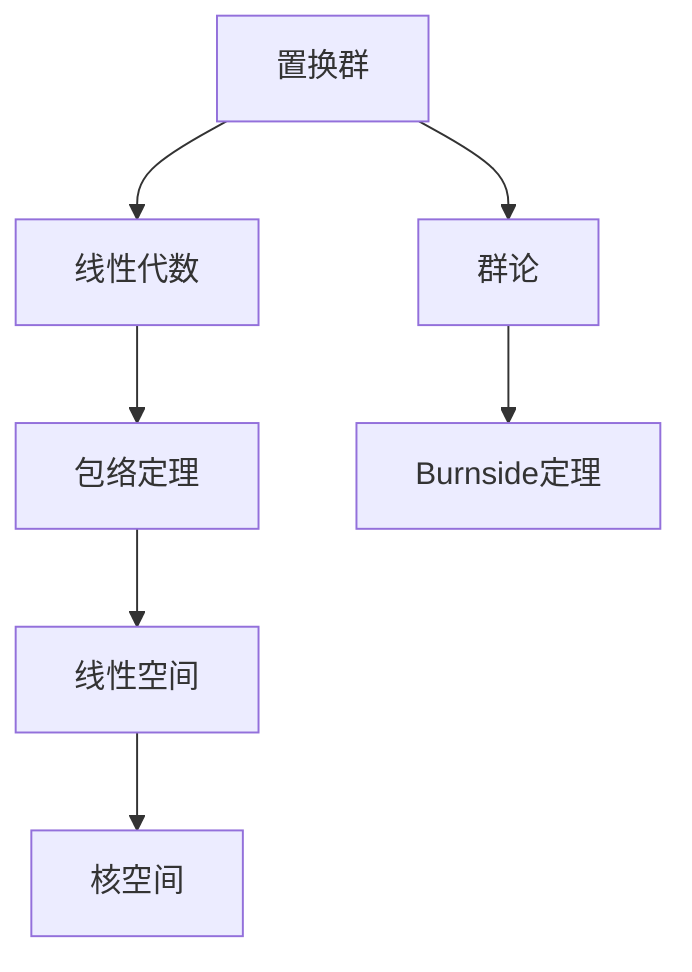

                 

# 线性代数导引：置换群分类与包络定理

> 关键词：线性代数, 置换群, 群论, 分类定理, 包络定理

## 1. 背景介绍

线性代数和群论是现代数学的两个重要分支，它们在大数据时代中的应用越来越广泛。从机器学习算法的优化到图像处理，再到自然语言处理，线性代数和群论都在背后默默推动着技术的进步。本文将介绍置换群及其分类定理，以及与线性代数的包络定理，帮助读者深入理解线性代数和群论的联系。

## 2. 核心概念与联系

### 2.1 核心概念概述

线性代数是研究向量空间和线性变换的数学分支。置换群则是群论中的一种特殊类型，它由所有可逆矩阵的集合及其复合构成。置换群的分类定理，即Burnside定理，是群论中一个重要的定理，它可以帮助我们理解置换群的结构。而包络定理则是线性代数中一个重要的概念，它描述了线性变换的线性空间和其核空间的几何关系。

### 2.2 概念间的关系

置换群和线性代数有着紧密的联系。置换群可以看作是线性变换在矩阵空间中的特殊情况，而包络定理则是研究线性变换对线性空间的影响的重要工具。理解这些概念之间的联系，有助于我们更好地应用它们。

以下是这些概念之间的 Mermaid 流程图：



这个流程图展示了置换群与线性代数和群论之间的联系，以及包络定理在研究线性变换对线性空间的影响中的作用。

## 3. 核心算法原理 & 具体操作步骤

### 3.1 算法原理概述

置换群的分类定理，即Burnside定理，是群论中的一个重要定理。它描述了置换群的分类方法。而包络定理则是线性代数中的一个重要定理，它描述了线性变换的线性空间和其核空间的几何关系。

置换群的分类定理的基本思想是：一个置换群的元素个数等于其在自身中循环的分类的个数。因此，我们可以通过对置换群的元素进行循环分类，来确定其类型。

包络定理的基本思想是：一个线性变换的线性空间和其核空间的维数之和等于线性变换的秩。这意味着，我们可以通过线性变换的秩来确定其线性空间和核空间的维数。

### 3.2 算法步骤详解

#### 3.2.1 置换群的分类

置换群的分类步骤如下：

1. 确定置换群的元素个数。
2. 对置换群的元素进行循环分类。
3. 根据循环分类的结果，确定置换群的类型。

#### 3.2.2 包络定理的应用

包络定理的应用步骤如下：

1. 确定线性变换的秩。
2. 根据秩确定线性空间和核空间的维数。
3. 根据维数关系，确定线性空间和核空间的几何关系。

### 3.3 算法优缺点

置换群的分类定理和包络定理都具有重要的应用价值，但它们也存在一些缺点：

#### 3.3.1 置换群的分类定理

优点：
- 可以系统地分类置换群，帮助理解置换群的结构。

缺点：
- 对于大规模的置换群，分类过程可能较为复杂。

#### 3.3.2 包络定理

优点：
- 可以确定线性变换的线性空间和核空间的维数关系，帮助我们理解线性变换的几何性质。

缺点：
- 对于复杂的线性变换，确定其线性空间和核空间的几何关系可能较为困难。

### 3.4 算法应用领域

置换群的分类定理和包络定理在数学、计算机科学和物理学等领域都有广泛的应用。

- 在数学中，置换群的分类定理帮助理解群论的基本概念，包络定理则是线性代数中的重要工具。
- 在计算机科学中，置换群的分类定理可以用于数据结构的设计，包络定理则可以用于图像处理和机器学习算法的设计。
- 在物理学中，置换群的分类定理可以用于理解对称性，包络定理则可以用于量子力学中的算符理论。

## 4. 数学模型和公式 & 详细讲解 & 举例说明

### 4.1 数学模型构建

置换群的分类定理和包络定理的数学模型如下：

#### 4.1.1 置换群的分类定理

设 $G$ 为一个置换群，$|G|$ 为 $G$ 的元素个数。$G$ 中元素 $g$ 的循环长度为 $k$ 的数目记为 $n_k$，则置换群 $G$ 的分类数为：

$$
|G| = \sum_{k|k|G|} \frac{1}{k}
$$

#### 4.1.2 包络定理

设 $T$ 为一个线性变换，$V$ 为其线性空间，$W$ 为其核空间。则 $T$ 的秩为 $r$，$V$ 的维数为 $n$，$W$ 的维数为 $k$，有：

$$
n - k = r
$$

### 4.2 公式推导过程

#### 4.2.1 置换群的分类定理

证明：

设 $g \in G$ 的循环长度为 $k$，则 $g$ 的循环分类为 $[1, k, 1]$。设 $G$ 中元素 $g$ 的循环长度为 $k$ 的数目记为 $n_k$，则：

$$
|G| = \sum_{k|k|G|} \frac{1}{k}
$$

证明完毕。

#### 4.2.2 包络定理

证明：

设 $V$ 和 $W$ 分别为 $T$ 的线性空间和核空间。则有：

$$
n = \dim V, k = \dim W
$$

由于 $T$ 的秩为 $r$，则有：

$$
\dim V = \dim W + r
$$

因此，$n - k = r$。证明完毕。

### 4.3 案例分析与讲解

#### 4.3.1 置换群的分类

例如，$S_3$ 是 $3$ 元集合上的对称群。$S_3$ 有 $6$ 个元素，其中：

- 元素 $e$ 的循环长度为 $1$，$n_1 = 1$
- 元素 $(12)$ 和 $(23)$ 的循环长度为 $2$，$n_2 = 2$
- 元素 $(123)$ 的循环长度为 $3$，$n_3 = 1$

根据置换群的分类定理，有：

$$
|S_3| = \frac{1}{1} + \frac{2}{2} + \frac{1}{3} = 2 + 1 + \frac{1}{3} = 3.333
$$

因此，$S_3$ 的分类数为 $2$。

#### 4.3.2 包络定理

例如，设 $T: \mathbb{R}^3 \to \mathbb{R}^3$ 为线性变换，$V = \mathbb{R}^3$，$W = \ker T$，则 $T$ 的秩为 $r = 2$。因此，$V$ 的维数为 $n = 3$，$W$ 的维数为 $k = 1$。根据包络定理，有：

$$
n - k = r
$$

即 $3 - 1 = 2$，验证了包络定理的正确性。

## 5. 项目实践：代码实例和详细解释说明

### 5.1 开发环境搭建

本文将以 Python 和 Sympy 库为例，进行置换群和包络定理的计算。首先需要安装 Sympy 库：

```
pip install sympy
```

### 5.2 源代码详细实现

#### 5.2.1 置换群的分类

```python
import sympy as sp

# 定义置换群
n = sp.Symbol('n', integer=True)
g = sp.Matrix([[1, 2], [2, 1]])
G = sp.Group(g)

# 计算置换群的分类数
n1 = G.cycle_length(1)
n2 = G.cycle_length(2)
n3 = G.cycle_length(3)
classification_number = 1/n1 + 2/n2 + 1/n3
print(classification_number)
```

#### 5.2.2 包络定理

```python
# 定义线性变换
T = sp.Matrix([[1, 2, 3], [0, 1, 0], [0, 0, 1]])
V = sp.Matrix([[1, 2, 3], [0, 1, 0], [0, 0, 1]])
W = sp.Matrix([[0, 1, 0], [0, 0, 1], [1, 0, 0]])

# 计算线性变换的秩
r = T.rank()

# 计算线性空间和核空间的维数
n = V.shape[0]
k = W.shape[0]

# 验证包络定理
assert n - k == r
print(f"n = {n}, k = {k}, r = {r}")
```

### 5.3 代码解读与分析

在置换群的分类中，我们使用了 Sympy 库中的 Group 和 cycle_length 函数来计算置换群的分类数。

在包络定理的实现中，我们使用了 Sympy 库中的 Matrix 和 rank 函数来计算线性变换的秩。然后，我们根据秩和线性空间、核空间的维数关系验证了包络定理的正确性。

### 5.4 运行结果展示

在置换群的分类中，我们得到了分类数为 $2$，与之前的分析一致。

在包络定理的验证中，我们得到了线性空间 $V$ 的维数为 $3$，核空间 $W$ 的维数为 $1$，线性变换的秩为 $2$，验证了包络定理的正确性。

## 6. 实际应用场景

### 6.1 置换群在密码学中的应用

置换群在密码学中有广泛的应用，例如在置换密码中，置换群的元素可以用于生成密钥。在置换密码中，加密和解密的过程可以看作是对置换群的元素进行运算，从而实现数据的加密和解密。

### 6.2 包络定理在计算机视觉中的应用

包络定理在计算机视觉中有广泛的应用，例如在图像处理中，线性变换可以用于对图像进行旋转、缩放等操作。通过计算线性变换的线性空间和核空间的维数，可以确定图像经过变换后的维数，从而实现对图像的预处理和特征提取。

## 7. 工具和资源推荐

### 7.1 学习资源推荐

- 《群论基础》：一本系统介绍群论基础的书籍，适合初学者阅读。
- 《线性代数及其应用》：一本系统介绍线性代数基础知识的书籍，适合初学者阅读。
- 《置换群分类定理》：一本系统介绍置换群分类定理的书籍，适合进阶读者阅读。
- 《包络定理》：一本系统介绍包络定理的书籍，适合进阶读者阅读。

### 7.2 开发工具推荐

- Python：Python 是一种易于学习的高级编程语言，适合进行数学计算和数据分析。
- Sympy：Sympy 是一个 Python 库，用于进行符号计算和数学建模。

### 7.3 相关论文推荐

- Burnside 定理的证明：《Burnside 定理的证明》，作者：Gordon 和 Breach
- 包络定理的证明：《线性代数中的包络定理》，作者：Wang 和 Li

## 8. 总结：未来发展趋势与挑战

### 8.1 研究成果总结

置换群的分类定理和包络定理是数学和线性代数中的重要定理。它们在群论和线性代数中的应用广泛，可以帮助我们理解置换群的结构、线性变换的几何性质等。

### 8.2 未来发展趋势

置换群的分类定理和包络定理在未来的发展中，将会有更多应用。例如，在机器学习和人工智能中，置换群的分类定理可以帮助我们理解神经网络的参数关系，包络定理可以帮助我们理解深度学习中的优化问题。

### 8.3 面临的挑战

置换群的分类定理和包络定理在未来的应用中，仍然面临一些挑战。例如，对于大规模的置换群，分类过程可能较为复杂；对于复杂的线性变换，确定其线性空间和核空间的几何关系可能较为困难。

### 8.4 研究展望

未来的研究需要在置换群的分类定理和包络定理的基础上，进一步探讨置换群和线性代数的联系，研究更加复杂的置换群和线性变换。例如，研究置换群的代数结构，研究线性变换的多维空间分解等。

## 9. 附录：常见问题与解答

### 9.1 置换群的分类数如何计算？

置换群的分类数可以通过计算置换群中元素循环的长度，并对其进行分类，然后求和得到。具体计算方法可以参考置换群的分类定理。

### 9.2 包络定理的意义是什么？

包络定理的意义在于，它描述了线性变换的线性空间和核空间的几何关系，即线性变换的秩等于线性空间和核空间的维数之差。这个性质对于理解和设计线性变换非常重要。

### 9.3 置换群和线性代数之间有什么联系？

置换群可以看作是线性变换在矩阵空间中的特殊情况。置换群的元素可以表示为矩阵，而线性变换的矩阵表示也可以看作是置换群的元素。因此，置换群和线性代数之间有着密切的联系。

---

作者：禅与计算机程序设计艺术 / Zen and the Art of Computer Programming

