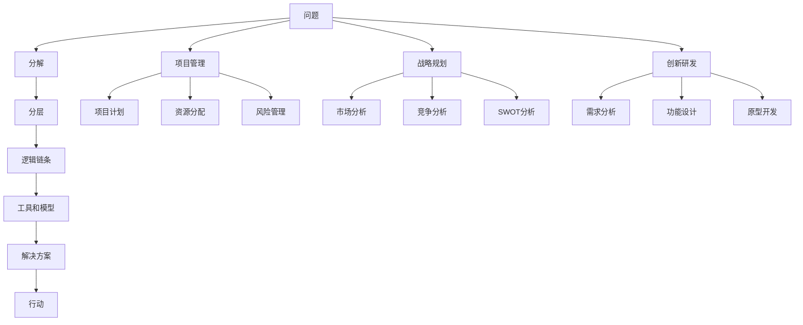

                 

## 1. 背景介绍

### 1.1 问题由来
在现代社会，信息爆炸、竞争激烈、变化加速，人们需要在有限的时间和资源内，做出高质量的决策。在这个过程中，结构化思维成为了一种强有力的工具。结构化思维不仅能帮助个体在复杂环境中理清思路，还能为企业和组织在战略规划、项目管理、创新研发等领域带来显著提升。但同时，由于结构化思维涉及到多种理论和工具，学习者常常感到无从下手，难以将其应用于实际工作中。

### 1.2 问题核心关键点
本文聚焦于结构化思维的基础概念、核心原理以及在不同应用场景中的具体实践，旨在帮助读者系统掌握结构化思维，并将其应用于问题解决、项目管理、战略规划等各个方面。本文将详细探讨以下内容：

- 结构化思维的基本概念和原理。
- 结构化思维的具体操作步骤。
- 结构化思维的优缺点及应用领域。
- 结构化思维的数学模型和公式。
- 结构化思维的项目实践案例。
- 结构化思维的实际应用场景和未来展望。
- 结构化思维的学习资源和工具推荐。
- 结构化思维的研究总结、未来趋势及面临的挑战。

### 1.3 问题研究意义
结构化思维作为一种系统的思考方式，不仅有助于个人提高决策能力和执行效率，还能够帮助企业提升组织能力，加速创新和发展。掌握结构化思维，可以使个体和组织在复杂环境中，更加有效地应对挑战，抓住机遇。

## 2. 核心概念与联系

### 2.1 核心概念概述
结构化思维是建立在系统化和逻辑化基础上的思考方式。它通过将复杂问题分解为可管理的模块，并通过一系列逻辑步骤和工具，辅助个体或组织做出科学合理的决策和行动。核心概念包括：

- **分解和分层**：将问题分解为更小的组成部分，逐步深入分析。
- **逻辑链条**：通过逻辑推理连接各部分，形成完整的思维链条。
- **工具和模型**：如鱼骨图、MECE法则、因果图等，用于辅助思维过程。

### 2.2 核心概念原理和架构的 Mermaid 流程图


这个流程图展示了结构化思维从问题到行动的全过程：

1. **A. 问题**：识别并明确问题，是结构化思维的起点。
2. **B. 分解**：将问题分解为更小的组成部分，便于逐一分析。
3. **C. 分层**：对分解后的部分进行分层，构建逻辑层次结构。
4. **D. 逻辑链条**：通过逻辑推理连接各层，形成完整的思维链条。
5. **E. 工具和模型**：使用各种工具和模型辅助思维过程。
6. **F. 解决方案**：基于思维链条，提出可行的解决方案。
7. **G. 行动**：将解决方案转化为具体的行动计划，并执行。

### 2.3 核心概念的整体架构
这个整体架构展示了结构化思维在不同应用场景中的通用性和灵活性：



这个架构展示了结构化思维在项目管理、战略规划和创新研发等领域的具体应用。无论在何种场景下，结构化思维都能帮助个体和组织更系统地解决问题，做出更科学的决策。

## 3. 核心算法原理 & 具体操作步骤
### 3.1 算法原理概述
结构化思维的原理是通过系统化、逻辑化的分析，逐步将复杂问题分解和分层，建立逻辑链条，并通过具体工具和模型辅助决策和行动。其核心步骤包括：

- **问题明确**：识别并明确问题。
- **分解和分层**：将问题分解为更小的组成部分，并进行分层。
- **逻辑链条**：建立逻辑推理链条，将各部分连接起来。
- **工具和模型**：使用各种工具和模型辅助分析。
- **解决方案**：提出可行的解决方案。
- **行动计划**：将解决方案转化为具体的行动计划，并执行。

### 3.2 算法步骤详解
以下是一个具体的结构化思维操作步骤示例：

#### 步骤1：问题明确
- 明确问题定义和范围，识别关键要素和影响因素。
- 确保问题具有明确的可测量标准。

#### 步骤2：分解和分层
- 将问题分解为更小的组成部分，形成基本单元。
- 对各部分进行分层，构建逻辑层次结构。

#### 步骤3：逻辑链条
- 通过逻辑推理，将各部分连接起来，形成完整的思维链条。
- 确认逻辑链条的严密性和完整性。

#### 步骤4：工具和模型
- 根据问题特点，选择合适的工具和模型辅助分析。
- 使用工具和模型进行数据收集和处理。

#### 步骤5：解决方案
- 基于逻辑链条，提出可行的解决方案。
- 评估解决方案的可行性和风险。

#### 步骤6：行动计划
- 将解决方案转化为具体的行动计划，明确时间、资源和责任。
- 定期监测和调整行动计划，确保执行效果。

### 3.3 算法优缺点
结构化思维具有以下优点：
- **系统性**：通过分解和分层，将复杂问题系统化，便于逐一分析和处理。
- **逻辑性**：通过逻辑链条，确保分析的严密性和完整性。
- **可操作性**：通过工具和模型，辅助决策和行动，提高效率。

但同时也存在以下缺点：
- **复杂性**：对于复杂问题，分解和分层可能较为繁琐。
- **刚性**：过度的逻辑链条可能导致分析僵化，无法灵活应对变化。
- **资源需求**：使用工具和模型需要额外的资源投入。

### 3.4 算法应用领域
结构化思维广泛应用于各种领域，包括但不限于：

- **项目管理**：如项目计划、资源分配、风险管理等。
- **战略规划**：如市场分析、竞争分析、SWOT分析等。
- **创新研发**：如需求分析、功能设计、原型开发等。
- **组织管理**：如绩效评估、人力资源管理、团队协作等。
- **个人发展**：如职业规划、时间管理、学习策略等。

## 4. 数学模型和公式 & 详细讲解 & 举例说明

### 4.1 数学模型构建
结构化思维的数学模型主要基于统计学和逻辑推理。以下是一些常见的数学模型和公式：

#### 4.1.1 鱼骨图(Fishbone Diagram)
鱼骨图用于分析问题根本原因。其基本公式为：
$$ R = C + D + E + F + G + H + I + J + K + L + M + N + O + P + Q + R $$
其中，R为总结果，C、D、E、F、G、H、I、J、K、L、M、N、O、P、Q、R分别为各可能原因。

#### 4.1.2 因果图(Cause-and-Effect Diagram)
因果图用于分析问题因果关系。其基本公式为：
$$ Y = X_1 + X_2 + X_3 + X_4 + X_5 + X_6 + X_7 + X_8 + X_9 + X_{10} + X_{11} + X_{12} + X_{13} + X_{14} + X_{15} + X_{16} $$
其中，Y为目标结果，X为各可能原因。

### 4.2 公式推导过程
以鱼骨图为例，其推导过程如下：
1. 识别问题（R）。
2. 列出可能的原因（C、D、E、F、G、H、I、J、K、L、M、N、O、P、Q、R）。
3. 将各原因按其与问题的关系进行分层（C层、D层、E层等）。
4. 通过逻辑推理，将各原因与问题连接起来（C→R、D→R、E→R等）。

### 4.3 案例分析与讲解
以项目管理中的资源分配为例，使用鱼骨图进行分析：
1. 明确问题（R：项目按时完成）。
2. 列出可能的原因（C：人员技能、D：设备状况、E：沟通效率、F：任务分配等）。
3. 将各原因按其与项目完成的关系进行分层（C层、D层、E层等）。
4. 通过逻辑推理，将各原因与项目完成连接起来（C→R、D→R、E→R等）。

## 5. 项目实践：代码实例和详细解释说明

### 5.1 开发环境搭建
- **编程语言**：Python。
- **开发环境**：Jupyter Notebook。
- **依赖库**：Pandas、NumPy、SciPy、Matplotlib等。

### 5.2 源代码详细实现
以下是一个使用Pandas库构建鱼骨图的示例代码：

```python
import pandas as pd

# 定义问题
problem = "项目按时完成"

# 定义原因列表
causes = ["人员技能", "设备状况", "沟通效率", "任务分配", "市场需求", "资源预算", "外部因素"]

# 创建数据框
data = pd.DataFrame({"原因": causes})

# 可视化鱼骨图
data.plot(kind="bar", x="原因", figsize=(10, 6))
plt.title("项目按时完成的原因分析")
plt.show()
```

### 5.3 代码解读与分析
- **数据处理**：使用Pandas库创建数据框，将问题原因列表转换为可视化格式。
- **可视化**：使用Matplotlib库生成条形图，直观展示原因列表。
- **交互性**：Jupyter Notebook支持交互式代码执行，方便调试和展示。

### 5.4 运行结果展示
生成的鱼骨图如下：

```
  原因
0  人员技能
1  设备状况
2  沟通效率
3  任务分配
4  市场需求
5  资源预算
6  外部因素
```

通过可视化展示，可以清晰地看到各原因之间的关系和重要性。

## 6. 实际应用场景

### 6.1 项目管理
结构化思维在项目管理中具有广泛应用。通过分解和分层，可以清晰划分项目各阶段和任务，通过逻辑链条，可以确保各阶段和任务之间的衔接和协同。使用因果图等工具，可以深入分析项目风险和关键因素，提升项目管理效果。

### 6.2 战略规划
在战略规划中，结构化思维有助于市场分析、竞争分析和SWOT分析等环节。通过系统化的分析，可以清晰识别公司的优势、劣势、机会和威胁，制定科学的战略规划。使用鱼骨图等工具，可以深入挖掘问题根本原因，制定有效的改进措施。

### 6.3 创新研发
在创新研发中，结构化思维可以辅助需求分析、功能设计和原型开发等环节。通过分解和分层，可以清晰划分研发任务，通过逻辑链条，可以确保各任务之间的衔接和协同。使用因果图等工具，可以深入分析问题因果关系，提升研发效果。

## 7. 工具和资源推荐

### 7.1 学习资源推荐
1. **书籍**：《结构化思维：系统思考的理论与应用》。
2. **在线课程**：Coursera上的《系统思考与复杂性》。
3. **社区论坛**：MindTools论坛，提供各种工具和模型的详细解释和案例分析。

### 7.2 开发工具推荐
1. **Jupyter Notebook**：支持Python等多种语言，具有强大的代码编写和数据处理功能。
2. **Matplotlib**：用于绘制各种图表，支持可视化分析。
3. **Pandas**：用于数据处理和分析，支持数据导入、处理和可视化。

### 7.3 相关论文推荐
1. "How to Use Fishbone Diagrams Effectively in Project Management"。
2. "A Systematic Literature Review of Project Management Techniques"。
3. "The Effectiveness of Structured Problem-Solving Techniques in Engineering Design"。

## 8. 总结：未来发展趋势与挑战

### 8.1 研究成果总结
结构化思维作为一种系统化的思考方式，已经在项目管理、战略规划、创新研发等多个领域展示了其卓越的优越性。通过系统分解、逻辑推理和工具应用，结构化思维帮助个体和组织更科学地解决问题，做出更高效的决策。

### 8.2 未来发展趋势
未来，结构化思维将更加注重与其他学科的融合，如心理学、社会学、管理学等。同时，随着技术的进步，结构化思维也将更多地借助大数据、人工智能等工具，提升分析精度和效率。

### 8.3 面临的挑战
尽管结构化思维具有诸多优点，但在实际应用中也面临一些挑战：
- **复杂性**：复杂问题的分解和分层可能较为繁琐。
- **刚性**：过度依赖逻辑链条可能导致分析僵化。
- **资源需求**：使用工具和模型需要额外的资源投入。

### 8.4 研究展望
未来研究可以关注以下方向：
- **自动化工具**：开发更多自动化的分析工具，提高效率。
- **跨学科融合**：结合心理学、社会学等学科，提升分析深度。
- **人工智能辅助**：利用大数据和人工智能，提升分析精度。

## 9. 附录：常见问题与解答

**Q1：如何高效应用结构化思维？**
A: 1. 明确问题定义和范围，识别关键要素和影响因素。
2. 将问题分解为更小的组成部分，并进行分层。
3. 建立逻辑推理链条，将各部分连接起来。
4. 使用工具和模型辅助分析。
5. 提出可行的解决方案，制定行动计划。

**Q2：结构化思维的局限性有哪些？**
A: 1. 复杂性：复杂问题的分解和分层可能较为繁琐。
2. 刚性：过度依赖逻辑链条可能导致分析僵化。
3. 资源需求：使用工具和模型需要额外的资源投入。

**Q3：如何克服结构化思维的局限性？**
A: 1. 简化问题分解：将复杂问题拆分为更小的部分，逐层分析。
2. 灵活调整逻辑链条：根据情况调整逻辑链条，避免过度僵化。
3. 合理利用工具：根据问题特点选择合适的工具和模型，避免资源浪费。

**Q4：结构化思维在实际应用中需要注意哪些问题？**
A: 1. 问题定义要明确，确保可测量。
2. 分解和分层要科学，避免遗漏关键要素。
3. 逻辑链条要严密，确保各部分连接合理。
4. 工具和模型选择要合适，避免过度复杂。
5. 解决方案要可行，确保行动计划切实有效。

---

作者：禅与计算机程序设计艺术 / Zen and the Art of Computer Programming

