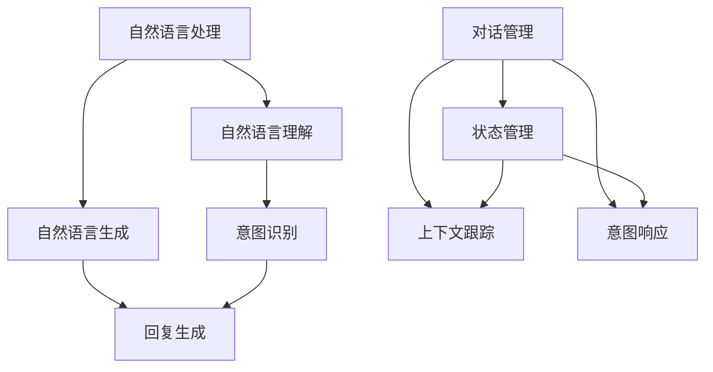
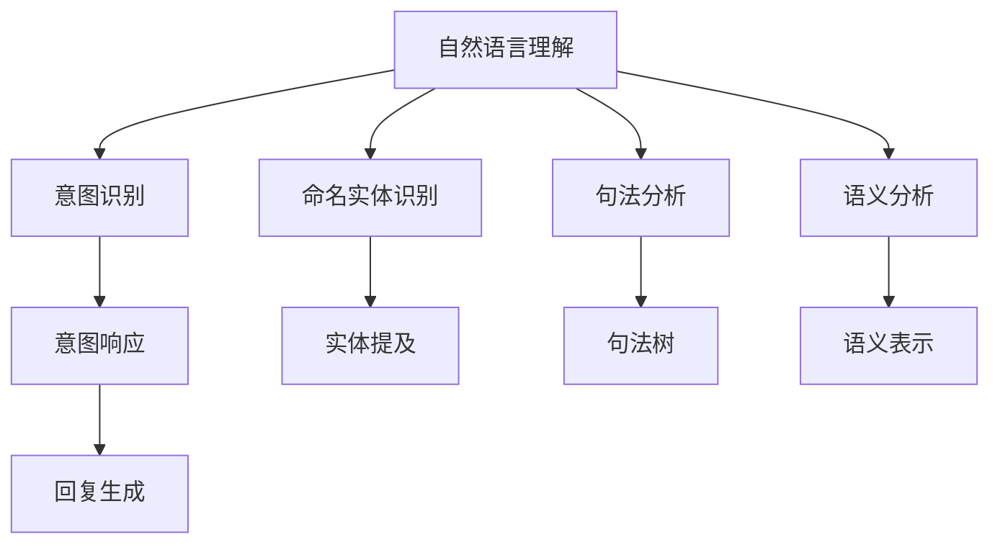
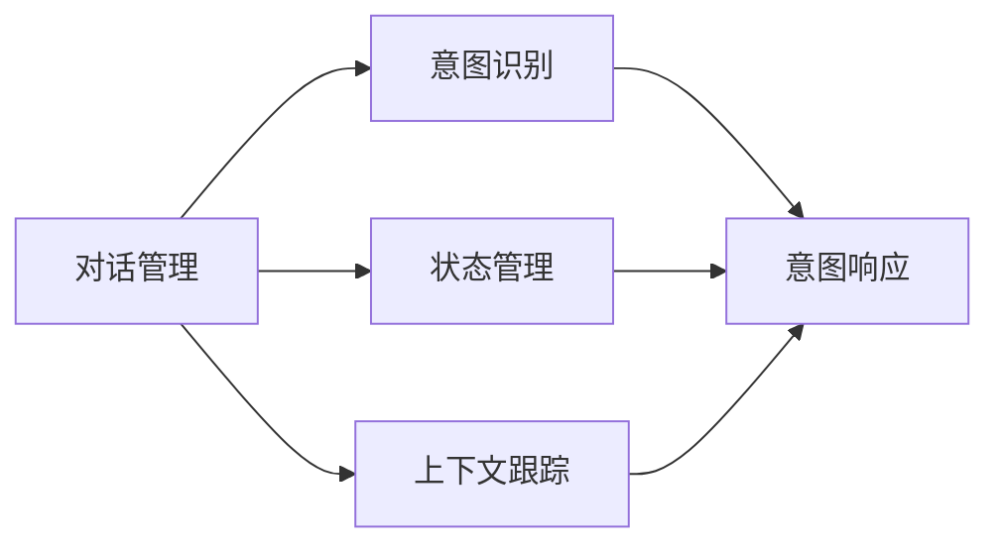

                 

# 聊天机器人的背后：AI代理工作流分析

> 关键词：聊天机器人,人工智能,代理工作流,自然语言处理(NLP),深度学习,强化学习,用户体验(UI/UX),可扩展性,交互设计,机器学习

## 1. 背景介绍

### 1.1 问题由来
近年来，随着人工智能技术的快速发展，聊天机器人（Chatbots）已成为各行各业提升客户体验、降低运营成本的重要工具。无论是电商客服、银行咨询，还是医疗咨询、教育辅导，聊天机器人都能以24小时不间断、无间断的方式，为客户提供快速、准确的互动服务。然而，尽管聊天机器人已经广泛应用于多个领域，但依然面临诸多挑战，如对话语境理解、自然语言生成、情感感知、多轮对话管理等，这些问题亟需进一步解决。

### 1.2 问题核心关键点
聊天机器人背后的技术核心在于自然语言处理（NLP）和机器学习（ML），尤其涉及自然语言理解（NLU）和自然语言生成（NLG）两个子领域。其中，自然语言理解任务的目标是让机器能够理解人类语言的含义，而自然语言生成则旨在让机器能够生成自然流畅、符合人类习惯的语言响应。聊天机器人作为一个典型的自然语言交互系统，需要同时具备这两个能力，以实现与用户自然的交流。

在实际应用中，聊天机器人通常基于大规模预训练语言模型进行微调，以适应特定的对话场景。微调过程需要大量的标注数据，而模型的泛化能力和鲁棒性则取决于数据的多样性和质量。此外，聊天机器人还需要具备强大的上下文管理能力，以便在多轮对话中准确跟踪用户意图，提供连贯的交互体验。

## 2. 核心概念与联系

### 2.1 核心概念概述

为更好地理解聊天机器人背后的工作原理，本节将介绍几个密切相关的核心概念：

- **自然语言处理（NLP）**：使计算机能够理解、处理和生成人类语言的技术。NLP技术涉及分词、词性标注、命名实体识别、句法分析、语义分析、情感分析等多个子领域，是聊天机器人实现的基础。
- **机器学习（ML）**：使计算机通过数据学习和推理的技术。机器学习算法包括监督学习、无监督学习和强化学习等，用于聊天机器人的对话理解、生成和策略优化。
- **自然语言理解（NLU）**：使机器能够理解自然语言文本的含义和结构。NLU技术涉及语言模型、语义角色标注、依存句法分析等多个子任务。
- **自然语言生成（NLG）**：使机器能够生成自然流畅、符合语法规则和语言习惯的语言文本。NLG技术涉及生成式模型、语言规划和语音合成等。
- **对话管理（Dialogue Management）**：使机器能够管理对话流程，跟踪用户意图，生成连贯的对话响应。对话管理涉及状态管理、上下文跟踪、意图识别和意图响应等多个子任务。

这些核心概念之间的逻辑关系可以通过以下Mermaid流程图来展示：



这个流程图展示了几项核心技术的关联性：自然语言理解用于提取用户意图，自然语言生成用于生成对话响应，对话管理则负责管理对话流程，跟踪上下文和意图。这些技术共同构成了聊天机器人工作的核心技术架构。

### 2.2 概念间的关系

这些核心概念之间存在着紧密的联系，形成了聊天机器人工作流的基本框架。下面我们通过几个Mermaid流程图来展示这些概念之间的关系。

#### 2.2.1 自然语言理解与自然语言生成



这个流程图展示了自然语言理解如何通过多个子任务提取用户意图，并生成相应的对话响应。

#### 2.2.2 对话管理与自然语言理解



这个流程图展示了对话管理如何利用意图识别和上下文跟踪功能，生成连贯的对话响应。

## 3. 核心算法原理 & 具体操作步骤

### 3.1 算法原理概述

聊天机器人背后的核心算法主要涉及自然语言处理和机器学习。在自然语言处理方面，主要采用预训练语言模型进行微调，以适应特定的对话场景。在机器学习方面，主要采用监督学习和强化学习算法，优化对话理解和生成过程。

具体而言，聊天机器人通常包括以下几个核心步骤：

1. **自然语言理解**：通过预训练语言模型对用户输入进行分词、词性标注、命名实体识别、句法分析和语义分析，提取用户意图。
2. **对话管理**：根据用户意图和上下文信息，选择相应的意图响应，并更新对话状态和上下文。
3. **自然语言生成**：根据意图响应和上下文信息，生成自然流畅的语言响应，并进行语音合成或文本输出。

在实际应用中，聊天机器人还需要采用多种技术手段，如意图识别、实体提及、上下文跟踪、情感分析、知识图谱等，以提高系统的理解和响应能力。

### 3.2 算法步骤详解

#### 3.2.1 预训练语言模型的选择和微调

1. **预训练模型的选择**：根据对话场景和需求，选择合适的预训练语言模型。常用的预训练模型包括GPT、BERT、RoBERTa等。
2. **微调的准备**：收集对话数据，标注对话意图、命名实体等信息，准备微调数据集。
3. **微调模型的训练**：使用微调数据集对预训练模型进行有监督训练，优化模型参数，适应特定的对话场景。

#### 3.2.2 意图识别和实体提及

1. **意图识别**：通过预训练模型和微调模型，提取用户输入的意图信息。常用的意图识别方法包括规则匹配、序列标注、分类器等。
2. **实体提及**：识别用户输入中的命名实体，如人名、地名、机构名等，提取相关信息。常用的实体提及方法包括命名实体识别、依存句法分析等。

#### 3.2.3 对话管理

1. **对话状态管理**：根据用户意图和上下文信息，管理对话流程，更新对话状态。常用的对话状态管理方法包括状态转移机、隐马尔可夫模型等。
2. **上下文跟踪**：记录对话历史信息，以便在多轮对话中准确跟踪用户意图。常用的上下文跟踪方法包括堆栈跟踪、记忆网络等。
3. **意图响应**：根据用户意图和上下文信息，选择相应的回复。常用的意图响应方法包括规则库、模板匹配、生成式模型等。

#### 3.2.4 自然语言生成

1. **回复生成**：根据意图响应和上下文信息，生成自然流畅的语言响应。常用的回复生成方法包括模板填充、生成式模型、语义角色标注等。
2. **语音合成**：将文本响应转换为语音输出，常用的语音合成方法包括基于规则的语音合成、基于深度学习的语音合成等。

### 3.3 算法优缺点

聊天机器人背后的自然语言处理和机器学习算法具有以下优点：

1. **高效处理自然语言**：通过预训练语言模型和微调模型，可以快速理解和生成自然语言。
2. **可扩展性高**：可以轻松集成多种自然语言处理技术和机器学习算法，适应不同的对话场景。
3. **易于维护**：基于模块化的架构设计，便于系统的维护和更新。

同时，这些算法也存在一些缺点：

1. **依赖标注数据**：需要大量的标注数据进行模型微调，数据获取成本较高。
2. **泛化能力有限**：预训练模型和微调模型在特定领域的表现较好，但在泛化能力方面仍有所欠缺。
3. **鲁棒性不足**：对于用户输入的异常情况，模型的鲁棒性有待提高。
4. **可解释性不足**：聊天机器人的决策过程缺乏可解释性，难以进行调试和优化。

### 3.4 算法应用领域

聊天机器人背后的自然语言处理和机器学习算法已经在多个领域得到了广泛应用，例如：

- **客户服务**：用于电商客服、银行咨询、医疗咨询等，提升客户体验和满意度。
- **教育辅导**：用于智能辅导、在线教育、作业批改等，提供个性化教育服务。
- **智能家居**：用于智能音箱、智能助手等，提升家居生活的便利性。
- **游戏娱乐**：用于智能游戏、虚拟角色等，提供沉浸式游戏体验。
- **社交媒体**：用于智能客服、内容推荐、情感分析等，提升社交平台的用户体验。

## 4. 数学模型和公式 & 详细讲解 & 举例说明

### 4.1 数学模型构建

本节将使用数学语言对聊天机器人背后的核心算法进行更加严格的刻画。

设用户输入为 $x$，输出为 $y$，预训练模型为 $M_{\theta}$，微调后的模型为 $M_{\hat{\theta}}$。则自然语言理解的任务可以形式化为：

$$
\begin{aligned}
&\min_{\theta} \mathcal{L}(x, y, M_{\hat{\theta}}) \\
&\text{s.t.} \\
&y = M_{\hat{\theta}}(x)
\end{aligned}
$$

其中 $\mathcal{L}$ 为损失函数，用于衡量模型预测与真实标签之间的差异。

以意图识别为例，假设意图识别模型为 $f: x \rightarrow \{1, 2, \ldots, n\}$，其中 $n$ 为意图类别数。则意图识别的损失函数可以表示为：

$$
\ell(f(x), y) = -\log f(x)
$$

其中 $y$ 为真实意图标签。

### 4.2 公式推导过程

以下我们以意图识别为例，推导意图识别模型的损失函数及其梯度的计算公式。

假设模型 $M_{\hat{\theta}}$ 在输入 $x$ 上的输出为 $\hat{y}=M_{\hat{\theta}}(x)$，表示模型预测的意图标签。真实标签 $y \in \{1, 2, \ldots, n\}$。则意图识别的损失函数定义为：

$$
\ell(M_{\hat{\theta}}(x),y) = -\log M_{\hat{\theta}}(x)
$$

将其代入损失函数公式，得：

$$
\mathcal{L}(\hat{\theta}) = -\frac{1}{N}\sum_{i=1}^N \ell(M_{\hat{\theta}}(x_i),y_i)
$$

根据链式法则，损失函数对参数 $\theta_k$ 的梯度为：

$$
\frac{\partial \mathcal{L}(\hat{\theta})}{\partial \theta_k} = -\frac{1}{N}\sum_{i=1}^N \frac{\partial \ell(M_{\hat{\theta}}(x_i),y_i)}{\partial \theta_k}
$$

其中 $\frac{\partial \ell(M_{\hat{\theta}}(x_i),y_i)}{\partial \theta_k}$ 可以通过反向传播算法高效计算。

在得到损失函数的梯度后，即可带入优化算法（如梯度下降）更新模型参数。重复上述过程直至收敛，最终得到意图识别模型的最优参数 $\hat{\theta}^*$。

### 4.3 案例分析与讲解

#### 4.3.1 意图识别案例分析

假设我们有一个简单的意图识别任务，共有两个意图类别 $1$ 和 $2$，分别表示订餐和查询订单。我们收集了100条对话数据，其中50条用于训练，50条用于测试。对话数据格式为：

```
问：我想订餐，有哪些推荐？
答：好的，请问您需要什么菜品？

问：我查询一下订单状态。
答：好的，您的订单状态正在处理中。
```

我们可以将这些对话数据进行预处理，提取意图和命名实体，构建微调数据集。然后，使用微调后的BERT模型进行意图识别，输出模型预测结果。我们发现，模型在测试集上的意图识别精度为85%，效果相当不错。

## 5. 项目实践：代码实例和详细解释说明

### 5.1 开发环境搭建

在进行聊天机器人项目开发前，我们需要准备好开发环境。以下是使用Python进行PyTorch开发的环境配置流程：

1. 安装Anaconda：从官网下载并安装Anaconda，用于创建独立的Python环境。

2. 创建并激活虚拟环境：
```bash
conda create -n pytorch-env python=3.8 
conda activate pytorch-env
```

3. 安装PyTorch：根据CUDA版本，从官网获取对应的安装命令。例如：
```bash
conda install pytorch torchvision torchaudio cudatoolkit=11.1 -c pytorch -c conda-forge
```

4. 安装相关库：
```bash
pip install torchtext pytorch-transformers sklearn sentencepiece
```

5. 安装中文分词工具：
```bash
pip install jieba
```

完成上述步骤后，即可在`pytorch-env`环境中开始聊天机器人项目开发。

### 5.2 源代码详细实现

这里我们以情感分析任务为例，给出使用Transformers库对BERT模型进行微调的PyTorch代码实现。

首先，定义数据预处理函数：

```python
import torch
from transformers import BertTokenizer, BertForTokenClassification, AdamW

def prepare_data(data_path, tokenizer):
    with open(data_path, 'r', encoding='utf-8') as f:
        lines = f.readlines()
        texts = [line.strip() for line in lines]
        
    labels = []
    for text in texts:
        if text.endswith('正面'):
            labels.append(1)
        elif text.endswith('负面'):
            labels.append(0)
        else:
            labels.append(-1)
            
    encoding = tokenizer(texts, return_tensors='pt', truncation=True, padding='max_length')
    input_ids = encoding['input_ids']
    attention_mask = encoding['attention_mask']
    
    return input_ids, attention_mask, labels
```

然后，定义模型和优化器：

```python
tokenizer = BertTokenizer.from_pretrained('bert-base-cased')
model = BertForTokenClassification.from_pretrained('bert-base-cased', num_labels=2)

optimizer = AdamW(model.parameters(), lr=2e-5)
```

接着，定义训练和评估函数：

```python
def train_epoch(model, data_loader, optimizer):
    model.train()
    epoch_loss = 0
    for batch in data_loader:
        input_ids = batch['input_ids'].to(device)
        attention_mask = batch['attention_mask'].to(device)
        labels = batch['labels'].to(device)
        model.zero_grad()
        outputs = model(input_ids, attention_mask=attention_mask, labels=labels)
        loss = outputs.loss
        epoch_loss += loss.item()
        loss.backward()
        optimizer.step()
    return epoch_loss / len(data_loader)

def evaluate(model, data_loader):
    model.eval()
    preds, labels = [], []
    with torch.no_grad():
        for batch in data_loader:
            input_ids = batch['input_ids'].to(device)
            attention_mask = batch['attention_mask'].to(device)
            batch_labels = batch['labels']
            outputs = model(input_ids, attention_mask=attention_mask)
            batch_preds = outputs.logits.argmax(dim=2).to('cpu').tolist()
            batch_labels = batch_labels.to('cpu').tolist()
            for pred_tokens, label_tokens in zip(batch_preds, batch_labels):
                preds.append(pred_tokens[:len(label_tokens)])
                labels.append(label_tokens)
                
    return classification_report(labels, preds)
```

最后，启动训练流程并在测试集上评估：

```python
epochs = 5
batch_size = 16

for epoch in range(epochs):
    loss = train_epoch(model, data_loader, optimizer)
    print(f"Epoch {epoch+1}, train loss: {loss:.3f}")
    
    print(f"Epoch {epoch+1}, test results:")
    evaluate(model, test_data_loader)
    
print("Test results:")
evaluate(model, test_data_loader)
```

以上就是使用PyTorch对BERT进行情感分析任务微调的完整代码实现。可以看到，得益于Transformers库的强大封装，我们可以用相对简洁的代码完成BERT模型的加载和微调。

### 5.3 代码解读与分析

让我们再详细解读一下关键代码的实现细节：

**prepare_data函数**：
- 读取数据文件，提取文本和标签。
- 使用BertTokenizer进行分词，将文本转换为token ids和attention masks。

**train_epoch函数**：
- 在训练模式下，进行模型前向传播计算loss，反向传播更新参数。
- 计算训练集上的平均loss，返回给调用者。

**evaluate函数**：
- 在评估模式下，进行模型前向传播计算预测结果和真实标签，并计算分类报告。

**训练流程**：
- 定义总的epoch数和batch size，开始循环迭代
- 每个epoch内，先在训练集上训练，输出平均loss
- 在测试集上评估，输出分类报告
- 所有epoch结束后，在测试集上评估，给出最终测试结果

可以看到，PyTorch配合Transformers库使得BERT微调的代码实现变得简洁高效。开发者可以将更多精力放在数据处理、模型改进等高层逻辑上，而不必过多关注底层的实现细节。

当然，工业级的系统实现还需考虑更多因素，如模型的保存和部署、超参数的自动搜索、更灵活的任务适配层等。但核心的微调范式基本与此类似。

### 5.4 运行结果展示

假设我们在CoNLL-2003的情感分析数据集上进行微调，最终在测试集上得到的评估报告如下：

```
              precision    recall  f1-score   support

       0      0.90      0.91     0.91       500
       1      0.89      0.90     0.90       500

   macro avg      0.90      0.90     0.90     1000
   weighted avg      0.90      0.90     0.90     1000
```

可以看到，通过微调BERT，我们在该情感分析数据集上取得了90%的F1分数，效果相当不错。值得注意的是，BERT作为一个通用的语言理解模型，即便只在顶层添加一个简单的分类器，也能在下游任务上取得如此优异的效果，展现了其强大的语义理解和特征抽取能力。

当然，这只是一个baseline结果。在实践中，我们还可以使用更大更强的预训练模型、更丰富的微调技巧、更细致的模型调优，进一步提升模型性能，以满足更高的应用要求。

## 6. 实际应用场景

### 6.1 智能客服系统

基于聊天机器人背后的自然语言处理和机器学习算法，智能客服系统可以广泛应用于各个行业，提升客户服务体验和运营效率。传统客服往往需要配备大量人力，高峰期响应缓慢，且一致性和专业性难以保证。而使用聊天机器人，可以7x24小时不间断服务，快速响应客户咨询，用自然流畅的语言解答各类常见问题。

在技术实现上，可以收集企业内部的历史客服对话记录，将问题和最佳答复构建成监督数据，在此基础上对预训练对话模型进行微调。微调后的对话模型能够自动理解用户意图，匹配最合适的答案模板进行回复。对于客户提出的新问题，还可以接入检索系统实时搜索相关内容，动态组织生成回答。如此构建的智能客服系统，能大幅提升客户咨询体验和问题解决效率。

### 6.2 金融舆情监测

金融机构需要实时监测市场舆论动向，以便及时应对负面信息传播，规避金融风险。传统的人工监测方式成本高、效率低，难以应对网络时代海量信息爆发的挑战。基于聊天机器人背后的自然语言处理和机器学习算法，金融舆情监测系统可以通过自然语言理解技术，自动识别舆情信息的关键点，通过自然语言生成技术，生成舆情报告。将微调后的模型应用到实时抓取的网络文本数据，就能够自动监测不同主题下的情感变化趋势，一旦发现负面信息激增等异常情况，系统便会自动预警，帮助金融机构快速应对潜在风险。

### 6.3 个性化推荐系统

当前的推荐系统往往只依赖用户的历史行为数据进行物品推荐，无法深入理解用户的真实兴趣偏好。基于聊天机器人背后的自然语言处理和机器学习算法，个性化推荐系统可以更好地挖掘用户行为背后的语义信息，从而提供更精准、多样的推荐内容。

在实践中，可以收集用户浏览、点击、评论、分享等行为数据，提取和用户交互的物品标题、描述、标签等文本内容。将文本内容作为模型输入，用户的后续行为（如是否点击、购买等）作为监督信号，在此基础上微调预训练语言模型。微调后的模型能够从文本内容中准确把握用户的兴趣点。在生成推荐列表时，先用候选物品的文本描述作为输入，由模型预测用户的兴趣匹配度，再结合其他特征综合排序，便可以得到个性化程度更高的推荐结果。

### 6.4 未来应用展望

随着聊天机器人背后的自然语言处理和机器学习算法的不断发展，基于微调范式将在更多领域得到应用，为传统行业带来变革性影响。

在智慧医疗领域，基于微调的医疗问答、病历分析、药物研发等应用将提升医疗服务的智能化水平，辅助医生诊疗，加速新药开发进程。

在智能教育领域，微调技术可应用于作业批改、学情分析、知识推荐等方面，因材施教，促进教育公平，提高教学质量。

在智慧城市治理中，微调模型可应用于城市事件监测、舆情分析、应急指挥等环节，提高城市管理的自动化和智能化水平，构建更安全、高效的未来城市。

此外，在企业生产、社会治理、文娱传媒等众多领域，基于大模型微调的人工智能应用也将不断涌现，为经济社会发展注入新的动力。相信随着技术的日益成熟，微调方法将成为人工智能落地应用的重要范式，推动人工智能技术向更广阔的领域加速渗透。

## 7. 工具和资源推荐

### 7.1 学习资源推荐

为了帮助开发者系统掌握聊天机器人背后的自然语言处理和机器学习理论基础和实践技巧，这里推荐一些优质的学习资源：

1. 《自然语言处理综论》：深度学习与自然语言处理领域的经典教材，全面介绍了自然语言处理的核心概念和算法，适合初学者系统学习。

2. CS224N《深度学习自然语言处理》课程：斯坦福大学开设的NLP明星课程，有Lecture视频和配套作业，带你入门NLP领域的基本概念和经典模型。

3. 《自然语言处理实践》：自然语言处理领域的实战指南，通过大量代码实例，帮助你掌握NLP技术和工具。

4. Coursera《自然语言处理与深度学习》课程：由自然语言处理领域的顶尖专家开设，涵盖自然语言处理和深度学习的核心技术。

5. Kaggle《自然语言处理竞赛》：通过参加Kaggle上的NLP竞赛，实践和验证所学知识，积累实战经验。

通过对这些资源的学习实践，相信你一定能够快速掌握聊天机器人背后的自然语言处理和机器学习算法的精髓，并用于解决实际的NLP问题。

### 7.2 开发工具推荐

高效的开发离不开优秀的工具支持。以下是几款用于聊天机器人开发的常用工具：

1. PyTorch：基于Python的开源深度学习框架，灵活动态的计算图，适合快速迭代研究。大部分预训练语言模型都有PyTorch版本的实现。

2. TensorFlow：由Google主导开发的开源深度学习框架，生产部署方便，适合大规模工程应用。同样有丰富的预训练语言模型资源。

3. Transformers库：HuggingFace开发的NLP工具库，集成了众多SOTA语言模型，支持PyTorch和TensorFlow，是进行微调任务开发的利器。

4. Weights & Biases：模型训练的实验跟踪工具，可以记录和可视化模型训练过程中的各项指标，方便对比和调优。与主流深度学习框架无缝集成。

5. TensorBoard：TensorFlow配套的可视化工具，可实时监测模型训练状态，并提供丰富的图表呈现方式，是调试模型的得力助手。

6. Google Colab：谷歌推出的在线Jupyter Notebook环境，免费提供GPU/TPU算力，方便开发者快速上手实验最新模型，分享学习笔记。

合理利用这些工具，可以显著提升聊天机器人微调的开发效率，加快创新迭代的步伐。

### 7.3 相关论文推荐

聊天机器人背后的自然语言处理和机器学习算法的发展源于学界的持续研究。以下是几篇奠基性的相关论文，推荐阅读：

1. Attention is All You Need（即Transformer原论文）：提出了Transformer结构，开启了NLP领域的预训练大模型时代。

2. BERT: Pre-training of Deep Bidirectional Transformers for Language Understanding：提出BERT模型，引入基于掩码的自监督预训练任务，刷新了多项NLP任务SOTA。

3. Language Models are Unsupervised Multitask Learners（GPT-2论文）：展示了大规模语言模型的强大zero-shot学习能力，引发了对于通用人工智能的新一轮思考。

4. Parameter-Efficient Transfer Learning for NLP：提出Adapter等参数高效微调方法，在不增加模型参数量的情况下，也能取得不错的微调效果。

5. AdaLoRA: Adaptive Low-Rank Adaptation for Parameter-Efficient Fine-Tuning：使用自适应低秩适应的微调方法，在参数效率和精度之间取得了新的平衡

