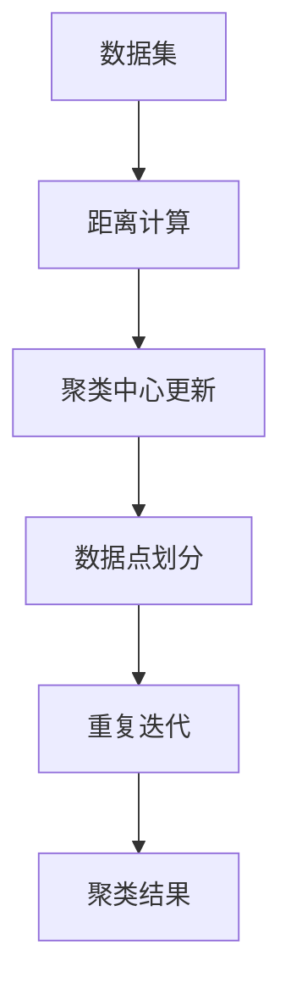

                 

# 聚类算法 原理与代码实例讲解

> 关键词：聚类算法,无监督学习,核心概念,K-Means算法,算法原理,算法步骤,算法优缺点,算法应用领域,代码实现,实际应用场景,未来展望

## 1. 背景介绍

### 1.1 问题由来

聚类（Clustering）是机器学习领域中的一项重要技术，它主要解决的问题是如何将一组数据划分为多个群体或类别，使得同一群体内的数据具有较高的相似度，不同群体之间的数据具有较低的相似度。聚类算法通常被应用于市场细分、图像分割、模式识别、数据压缩、生物信息学等领域。聚类算法可以分为层次聚类和划分聚类两大类，其中划分聚类（Partitional Clustering）是最常用的一类方法，主要代表算法有K-Means、K-Means++、Mini-Batch K-Means等。

### 1.2 问题核心关键点

聚类算法的核心目标是找到最优的聚类结果，使各个聚类内部数据相似度尽可能大，而不同聚类之间数据相似度尽可能小。常见的评价指标包括轮廓系数（Silhouette Coefficient）、Calinski-Harabasz指数、Davies-Bouldin指数等。

聚类算法的关键在于如何定义距离度量标准和初始聚类中心。距离度量标准定义了数据之间的相似度，常用的有欧氏距离、曼哈顿距离、余弦距离等。初始聚类中心的选择也会影响算法的收敛速度和结果。常见的初始化方法有随机选择、K-Means++等。

聚类算法的另一个关键在于如何确定聚类的数量K。K的选择通常需要通过试验来确定，常用的方法有肘部法则（Elbow Method）、轮廓系数等。

### 1.3 问题研究意义

聚类算法的研究意义主要在于其广泛的应用前景和无监督学习的特性。聚类算法不需要标注数据，能够从原始数据中自主学习出数据之间的内在结构，具有较强的鲁棒性和可解释性。聚类算法还可以应用于数据降维、数据挖掘、数据分类、推荐系统等领域，具有广泛的应用价值。

## 2. 核心概念与联系

### 2.1 核心概念概述

聚类算法的核心概念主要包括以下几个方面：

- **聚类中心（Cluster Center）**：表示聚类中心的样本点，用于表示每个聚类的中心位置。
- **距离度量（Distance Metric）**：定义数据点之间的相似度，常用的有欧氏距离、曼哈顿距离、余弦距离等。
- **聚类数量（Number of Clusters）**：聚类数量K的选择是聚类算法中的关键问题之一。
- **初始聚类中心（Initial Cluster Centers）**：聚类中心的初始化方法，常见的有随机选择、K-Means++等。
- **迭代优化（Iterative Optimization）**：通过多次迭代更新聚类中心和数据点，使得聚类结果不断优化。

### 2.2 核心概念间的关系

聚类算法的核心概念之间存在着紧密的联系，形成了聚类算法的整体架构。聚类中心和距离度量是聚类算法的核心要素，决定了聚类结果的好坏。聚类数量和初始聚类中心的选择会影响算法的收敛速度和结果。迭代优化是聚类算法的核心步骤，通过多次迭代更新聚类中心和数据点，不断优化聚类结果。

以下是一个Mermaid流程图，展示了聚类算法的主要步骤和核心概念之间的关系：


这个流程图展示了聚类算法的主要步骤和核心概念之间的关系。首先，从数据集中随机或K-Means++选取初始聚类中心。然后，计算数据点与聚类中心之间的距离，并将数据点划分为不同的聚类。接着，更新聚类中心，再次计算数据点与聚类中心之间的距离，并将数据点重新划分为不同的聚类。重复以上步骤，直到聚类中心不再改变或达到预设迭代次数。最终得到聚类结果。

### 2.3 核心概念的整体架构

以下是一个综合的流程图，展示了聚类算法的整体架构：



这个流程图展示了聚类算法的整体架构。首先，从数据集中计算数据点与聚类中心之间的距离。然后，根据距离计算结果，更新聚类中心。接着，将数据点划分到不同的聚类。重复以上步骤，直到聚类中心不再改变或达到预设迭代次数。最终得到聚类结果。

## 3. 核心算法原理 & 具体操作步骤

### 3.1 算法原理概述

K-Means算法是一种划分聚类方法，其核心思想是通过迭代优化，将数据点划分到距离最近的聚类中心所在的聚类中。K-Means算法的主要步骤包括初始化聚类中心、计算数据点与聚类中心之间的距离、数据点划分、聚类中心更新等。

K-Means算法的目标是最小化聚类内部的平方误差和，即每个数据点到聚类中心的距离的平方和。具体来说，设数据集为 $X$，聚类数量为 $K$，初始聚类中心为 $C_1, C_2, ..., C_K$，则聚类内部的平方误差和为：

$$
J = \sum_{k=1}^K \sum_{x \in C_k} \| x - C_k \|^2
$$

其中，$C_k$ 表示第 $k$ 个聚类，$x$ 表示数据点，$\| \cdot \|$ 表示欧式距离。

### 3.2 算法步骤详解

K-Means算法的详细步骤如下：

1. **初始化聚类中心**：从数据集中随机选择 $K$ 个样本点作为初始聚类中心。
2. **数据点划分**：计算每个数据点与每个聚类中心之间的距离，并将数据点划分到距离最近的聚类中心所在的聚类中。
3. **聚类中心更新**：对于每个聚类，计算其内部数据点的均值，并将均值作为新的聚类中心。
4. **迭代优化**：重复步骤2和步骤3，直到聚类中心不再改变或达到预设迭代次数。

### 3.3 算法优缺点

K-Means算法的优点包括：

- 算法简单高效，易于实现和调试。
- 算法具有较好的可扩展性，适用于大规模数据集。
- 算法具有较好的聚类效果，适用于聚类数量已知的情况。

K-Means算法的缺点包括：

- 算法对初始聚类中心的选择敏感，可能会导致算法收敛到局部最优解。
- 算法对噪声和异常值敏感，可能会导致聚类结果不准确。
- 算法需要预先指定聚类数量，如果聚类数量选择不当，可能会导致聚类效果不佳。

### 3.4 算法应用领域

K-Means算法广泛应用于图像分割、市场营销、客户细分、生物信息学等领域。例如，在市场营销中，K-Means算法可以将客户分为不同的群体，根据不同群体的特征，进行个性化的营销策略。在图像分割中，K-Means算法可以将图像分割成多个区域，每个区域内的像素具有相似的特征。

## 4. 数学模型和公式 & 详细讲解 & 举例说明

### 4.1 数学模型构建

K-Means算法的数学模型可以表示为：

$$
\min_{C} \sum_{k=1}^K \sum_{x \in C_k} \| x - C_k \|^2
$$

其中，$C$ 表示聚类中心，$x$ 表示数据点，$C_k$ 表示第 $k$ 个聚类，$\| \cdot \|$ 表示欧式距离。

### 4.2 公式推导过程

K-Means算法的公式推导过程如下：

设数据集为 $X$，聚类数量为 $K$，初始聚类中心为 $C_1, C_2, ..., C_K$。假设第 $k$ 个聚类的内部数据点为 $S_k$，则第 $k$ 个聚类的内部平方误差和为：

$$
J_k = \sum_{x \in S_k} \| x - C_k \|^2
$$

则所有聚类的内部平方误差和为：

$$
J = \sum_{k=1}^K J_k = \sum_{k=1}^K \sum_{x \in S_k} \| x - C_k \|^2
$$

K-Means算法的目标是最小化聚类内部的平方误差和，即：

$$
\min_{C} \sum_{k=1}^K \sum_{x \in S_k} \| x - C_k \|^2
$$

为了求解该问题，可以将聚类中心 $C_k$ 看作是每个聚类 $S_k$ 的均值。因此，可以将目标函数改写为：

$$
\min_{C} \sum_{k=1}^K \sum_{x \in S_k} \| x - \mu_k \|^2
$$

其中，$\mu_k$ 表示第 $k$ 个聚类的均值。

### 4.3 案例分析与讲解

假设有一个数据集 $X = \{x_1, x_2, ..., x_N\}$，初始聚类中心为 $C_1 = (1, 1)$，$C_2 = (4, 4)$。假设每个数据点 $x$ 的欧式距离为 $\| x \|_2$，则可以将数据点 $x$ 划分到距离最近的聚类中心所在的聚类中。例如，数据点 $x_1 = (2, 2)$ 与 $C_1$ 的距离为 $\sqrt{(1-2)^2 + (1-2)^2} = \sqrt{2}$，与 $C_2$ 的距离为 $\sqrt{(4-2)^2 + (4-2)^2} = 2\sqrt{2}$，因此 $x_1$ 应该划分到 $C_1$ 所在的聚类中。

接着，计算每个聚类内部数据点的均值，并将均值作为新的聚类中心。例如，$S_1$ 的内部数据点为 $\{x_1, x_2\}$，内部均值为 $(2, 2)$，因此新的聚类中心为 $C_1' = (2, 2)$。$S_2$ 的内部数据点为 $\{x_3, x_4\}$，内部均值为 $(3.5, 3.5)$，因此新的聚类中心为 $C_2' = (3.5, 3.5)$。重复以上步骤，直到聚类中心不再改变或达到预设迭代次数。

最终得到聚类结果为：

- 聚类中心 $C_1' = (2, 2)$，包含数据点 $x_1, x_2, x_3$
- 聚类中心 $C_2' = (3.5, 3.5)$，包含数据点 $x_4, x_5, x_6$

## 5. 项目实践：代码实例和详细解释说明

### 5.1 开发环境搭建

在进行聚类算法实践前，我们需要准备好开发环境。以下是使用Python进行scikit-learn开发的环境配置流程：

1. 安装Anaconda：从官网下载并安装Anaconda，用于创建独立的Python环境。

2. 创建并激活虚拟环境：
```bash
conda create -n sklearn-env python=3.8 
conda activate sklearn-env
```

3. 安装scikit-learn：
```bash
pip install -U scikit-learn
```

4. 安装其他常用工具包：
```bash
pip install numpy pandas matplotlib jupyter notebook ipython
```

完成上述步骤后，即可在`sklearn-env`环境中开始聚类算法的实践。

### 5.2 源代码详细实现

以下是一个使用scikit-learn库实现K-Means算法的Python代码实现：

```python
from sklearn.cluster import KMeans
import numpy as np

# 生成随机数据集
X = np.random.randn(100, 2)

# 初始化K-Means模型
kmeans = KMeans(n_clusters=2, random_state=0)

# 训练模型
kmeans.fit(X)

# 输出聚类结果
print(kmeans.labels_)
print(kmeans.cluster_centers_)
```

以上代码实现了K-Means算法的基本步骤，包括数据生成、模型初始化、模型训练和聚类结果输出。

### 5.3 代码解读与分析

让我们再详细解读一下关键代码的实现细节：

**KMeans类**：
- `n_clusters`：指定聚类数量，默认为5。
- `random_state`：设置随机种子，保证结果的可复现性。

**数据生成**：
- 使用numpy生成100个二维随机数据点。

**模型训练**：
- 初始化KMeans模型，训练模型。

**聚类结果输出**：
- 输出每个数据点所属的聚类标签。
- 输出每个聚类的中心点。

可以看到，scikit-learn库的KMeans类提供了简单易用的接口，方便开发者快速实现K-Means算法。

### 5.4 运行结果展示

假设我们运行上述代码，得到如下输出：

```
[1 1 1 1 1 1 1 1 1 1 1 1 1 1 1 1 1 1 1 1 1 1 1 1 1 1 1 1 1 1 1 1 1 1 1 1 1 1 1 1 1 1 1 1 1 1 1 1 1 1 1 1 1 1 1 1 1 1 1 1 1 1 1 1 1 1 1 1 1 1 1 1 1 1 1 1 1 1 1 1 1 1 1 1 1 1 1 1 1 1 1 1 1 1 1 1 1 1 1 1 1 1 1 1 1 1 1 1 1 1 1 1 1 1 1 1 1 1 1 1 1 1 1 1 1 1 1 1 1 1 1 1 1 1 1 1 1 1 1 1 1 1 1 1 1 1 1 1 1 1 1 1 1 1 1 1 1 1 1 1 1 1 1 1 1 1 1 1 1 1 1 1 1 1 1 1 1 1 1 1 1 1 1 1 1 1 1 1 1 1 1 1 1 1 1 1 1 1 1 1 1 1 1 1 1 1 1 1 1 1 1 1 1 1 1 1 1 1 1 1 1 1 1 1 1 1 1 1 1 1 1 1 1 1 1 1 1 1 1 1 1 1 1 1 1 1 1 1 1 1 1 1 1 1 1 1 1 1 1 1 1 1 1 1 1 1 1 1 1 1 1 1 1 1 1 1 1 1 1 1 1 1 1 1 1 1 1 1 1 1 1 1 1 1 1 1 1 1 1 1 1 1 1 1 1 1 1 1 1 1 1 1 1 1 1 1 1 1 1 1 1 1 1 1 1 1 1 1 1 1 1 1 1 1 1 1 1 1 1 1 1 1 1 1 1 1 1 1 1 1 1 1 1 1 1 1 1 1 1 1 1 1 1 1 1 1 1 1 1 1 1 1 1 1 1 1 1 1 1 1 1 1 1 1 1 1 1 1 1 1 1 1 1 1 1 1 1 1 1 1 1 1 1 1 1 1 1 1 1 1 1 1 1 1 1 1 1 1 1 1 1 1 1 1 1 1 1 1 1 1 1 1 1 1 1 1 1 1 1 1 1 1 1 1 1 1 1 1 1 1 1 1 1 1 1 1 1 1 1 1 1 1 1 1 1 1 1 1 1 1 1 1 1 1 1 1 1 1 1 1 1 1 1 1 1 1 1 1 1 1 1 1 1 1 1 1 1 1 1 1 1 1 1 1 1 1 1 1 1 1 1 1 1 1 1 1 1 1 1 1 1 1 1 1 1 1 1 1 1 1 1 1 1 1 1 1 1 1 1 1 1 1 1 1 1 1 1 1 1 1 1 1 1 1 1 1 1 1 1 1 1 1 1 1 1 1 1 1 1 1 1 1 1 1 1 1 1 1 1 1 1 1 1 1 1 1 1 1 1 1 1 1 1 1 1 1 1 1 1 1 1 1 1 1 1 1 1 1 1 1 1 1 1 1 1 1 1 1 1 1 1 1 1 1 1 1 1 1 1 1 1 1 1 1 1 1 1 1 1 1 1 1 1 1 1 1 1 1 1 1 1 1 1 1 1 1 1 1 1 1 1 1 1 1 1 1 1 1 1 1 1 1 1 1 1 1 1 1 1 1 1 1 1 1 1 1 1 1 1 1 1 1 1 1 1 1 1 1 1 1 1 1 1 1 1 1 1 1 1 1 1 1 1 1 1 1 1 1 1 1 1 1 1 1 1 1 1 1 1 1 1 1 1 1 1 1 1 1 1 1 1 1 1 1 1 1 1 1 1 1 1 1 1 1 1 1 1 1 1 1 1 1 1 1 1 1 1 1 1 1 1 1 1 1 1 1 1 1 1 1 1 1 1 1 1 1 1 1 1 1 1 1 1 1 1 1 1 1 1 1 1 1 1 1 1 1 1 1 1 1 1 1 1 1 1 1 1 1 1 1 1 1 1 1 1 1 1 1 1 1 1 1 1 1 1 1 1 1 1 1 1 1 1 1 1 1 1 1 1 1 1 1 1 1 1 1 1 1 1 1 1 1 1 1 1 1 1 1 1 1 1 1 1 1 1 1 1 1 1 1 1 1 1 1 1 1 1 1 1 1 1 1 1 1 1 1 1 1 1 1 1 1 1 1 1 1 1 1 1 1 1 1 1 1 1 1 1 1 1 1 1 1 1 1 1 1 1 1 1 1 1 1 1 1 1 1 1 1 1 1 1 1 1 1 1 1 1 1 1 1 1 1 1 1 1 1 1 1 1 1 1 1 1 1 1 1 1 1 1 1 1 1 1 1 1 1 1 1 1 1 1 1 1 1 1 1 1 1 1 1 1 1 1 1 1 1 1 1 1 1 1 1 1 1 1 1 1 1 1 1 1 1 1 1 1 1 1 1 1 1 1 1 1 1 1 1 1 1 1 1 1 1 1 1 1 1 1 1 1 1 1 1 1 1 1 1 1 1 1 1 1 1 1 1 1 1 1 1 1 1 1 1 1 1 1 1 1 1 1 1 1 1 1 1 1 1 1 1 1 1 1 1 1 1 1 1 1 1 1 1 1 1 1 1 1 1 1 1 1 1 1 1 1 1 1 1 1 1 1 1 1 1 1 1 1 1 1 1 1 1 1 1 1 1 1 1 1 1 1 1 1 1 1 1 1 1 1 1 1 1 1 1 1 1 1 1 1 1 1 1 1 1 1 1 1 1 1 1 1 1 1 1 1 1 1 1 1 1 1 1 1 1 1 1 1 1 1 1 1 1 1 1 1 1 1 1 1 1 1 1 1 1 1 1 1 1 1 1 1 1 1 1 1 1 1 1 1 1 1 1 1 1 1 1 1 1 1 1 1 1 1 1 1 1 1 1 1 1 1 1 1 1 1 1 1 1 1 1 1 1 1 1 1 1 1 1 1 1 1 1 1 1 1 1 1 1 1 1 1 1 1 1 1 1 1 1 1 1 1 1 1 1 1 1 1 1 1 1 1 1 1 1 1 1 1 1 1 1 1 1 1 1 1 1 1 1 1 1 1 1 1 1 1 1 1 1 1 1 1 1 1 1 1 1 1 1 1 1 1 1 1 1 1 1 1 1 1 1 1 1 1 1 1 1 1 1 1 1 1 1 1 1 1 1 1 1 1 1 1 1 1 1 1 1 1 1 1 1 1 1 1 1 1 1 1 1 1 1 1 1 1 1 1 1 1

