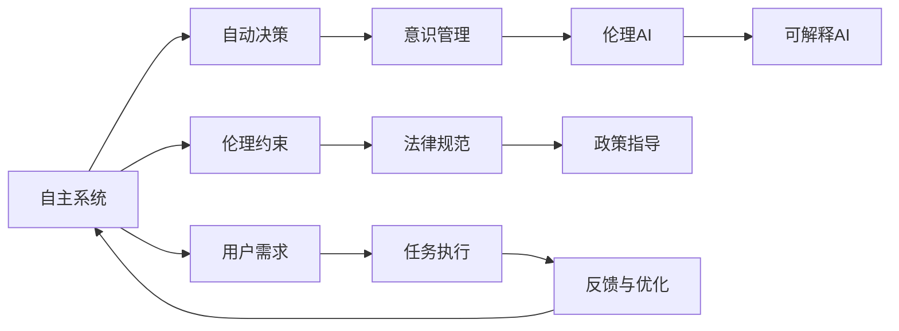

                 

# 自主系统与意识管理的结合

## 1. 背景介绍

随着人工智能(AI)技术的飞速发展，自主系统(Autonomous Systems)已经成为现代社会的重要组成部分。从自动驾驶汽车到工业机器人，再到智能家居系统，自主系统正在以越来越高的自动化水平，改变着人们的日常生活和工作方式。然而，在带来便利的同时，也带来了诸多挑战，尤其是在意识管理（Consciousness Management）方面。

### 1.1 问题由来
意识管理是自主系统中一个至关重要但往往被忽视的问题。在自主系统中，机器或软件系统需要理解环境、做出决策、执行任务。然而，这种决策过程是否符合人类价值观、道德标准和法律规范，如何避免机器的“自主性误用”，如何确保系统的公平、透明和可解释性，都是亟需解决的问题。

这些问题不仅涉及技术层面的挑战，还涉及伦理、法律和社会的复杂考量。如何在自主系统中实现高效、安全和可控的意识管理，是当前研究的一个重要方向。

## 2. 核心概念与联系

### 2.1 核心概念概述

为更好地理解自主系统与意识管理，我们首先介绍几个关键概念：

- **自主系统**（Autonomous Systems）：指能够自主执行任务的系统，如自动驾驶汽车、无人机、机器人等。这些系统通过算法和数据进行决策，而无需直接的人类干预。

- **意识管理**（Consciousness Management）：指在自主系统中，对机器的决策过程、行为和输出进行监控、管理和调整的过程。意识管理的目标是确保系统的行为符合人类的伦理道德标准，同时提供足够的透明度和可解释性，满足法律要求。

- **伦理AI**（Ethical AI）：指在AI系统的设计、开发和应用中，遵循伦理原则，保障人类利益和社会福祉。伦理AI强调公平、透明、可解释性和负责任的AI行为。

- **可解释AI**（Explainable AI, XAI）：指能够提供其决策过程的可理解性解释的AI系统。可解释AI有助于提升系统的可信任度和透明度，使其更易于接受和理解。

- **自动决策**（Autonomous Decision-Making）：指自主系统基于预设规则或机器学习模型，独立做出决策的过程。自动决策需要在确保其正确性的同时，进行有效的意识管理。

这些概念构成了自主系统中意识管理的基本框架。通过它们之间的相互作用，可以建立更高效、安全和可控的自主系统。

### 2.2 核心概念的关系

为了更好地理解这些概念之间的关系，我们可以用一个Mermaid流程图来展示它们之间的联系。



这个流程图展示了自主系统中自动决策与意识管理的关系，以及它们与伦理AI和可解释AI的关系。自主系统在执行任务时进行自动决策，但这些决策需要符合伦理和法律要求，且需要提供可解释性，以便用户和监管机构理解和评估。

## 3. 核心算法原理 & 具体操作步骤

### 3.1 算法原理概述

自主系统与意识管理结合的核心算法原理主要包括以下几个方面：

1. **自动决策算法**：自主系统通过自动决策算法进行任务执行。自动决策算法可以是基于规则的、基于统计的，也可以是基于机器学习的模型。这些算法需要设计合适的损失函数和优化目标，以确保决策的正确性和可靠性。

2. **意识管理算法**：意识管理算法负责监控和调整自动决策过程，确保其符合伦理和法律标准。常见的意识管理算法包括风险评估、行为监控、决策审计等。

3. **伦理和法律约束**：意识管理算法需要遵守伦理和法律约束，确保系统的行为符合人类的价值观和法律规范。这些约束通常通过规则库、道德准则和法律法规来定义。

4. **可解释性算法**：为了满足可解释性要求，需要设计可解释性算法，将自动决策过程和结果转化为易于理解的形式，供用户和监管机构审查。

这些算法通过协同工作，实现自主系统的意识管理，确保其安全、可靠和可控。

### 3.2 算法步骤详解

下面我们将详细介绍基于这些算法原理的自主系统意识管理的具体操作步骤。

**Step 1: 确定任务和目标**
- 明确自主系统的任务和目标，包括任务执行环境、预期结果和关键性能指标。

**Step 2: 设计自动决策算法**
- 根据任务特性和数据可用性，选择合适的自动决策算法，如规则、统计或机器学习模型。
- 设计损失函数和优化目标，确保算法能够高效地解决问题。

**Step 3: 设计意识管理算法**
- 定义意识管理目标和约束，如风险评估、行为监控、决策审计等。
- 开发意识管理算法，监控决策过程和结果，识别潜在问题。

**Step 4: 引入伦理和法律约束**
- 根据任务特性，设计伦理和法律约束，如公平性、透明性和责任性。
- 在算法中嵌入这些约束，确保决策符合伦理和法律要求。

**Step 5: 实现可解释性算法**
- 根据任务需求，设计可解释性算法，将自动决策过程和结果转化为可理解的形式。
- 提供交互式界面或报告，供用户和监管机构审查和反馈。

**Step 6: 测试和优化**
- 通过实验和用户反馈，评估意识管理算法的性能，进行必要的调整和优化。
- 确保自主系统在实际应用中能够持续高效地运行。

### 3.3 算法优缺点

自主系统与意识管理结合的算法具有以下优点：

- **高效性**：通过自动决策算法和优化目标，自主系统能够高效地完成任务。
- **透明性**：通过可解释性算法和交互式界面，确保决策过程和结果的可理解性。
- **安全性**：通过意识管理算法和伦理法律约束，确保系统的行为符合人类价值观和法律规范。

然而，这些算法也存在一些缺点：

- **复杂性**：设计和管理意识管理算法需要多学科知识的融合，复杂度较高。
- **资源消耗**：意识管理算法的引入可能增加系统计算和存储资源的需求。
- **误用风险**：在缺乏有效监管的情况下，自主系统可能被误用，产生负面影响。

### 3.4 算法应用领域

自主系统与意识管理的结合算法在多个领域得到了广泛应用，以下是几个典型的应用场景：

**智能交通系统**：在自动驾驶汽车中，自动决策算法需要确保安全行驶，意识管理算法需要监控和调整决策过程，确保遵守交通法规和道德准则。

**医疗诊断系统**：医疗诊断系统通过机器学习模型进行疾病诊断，意识管理算法需要确保诊断的准确性和可解释性，符合伦理和法律要求。

**金融交易系统**：金融交易系统通过统计模型进行交易决策，意识管理算法需要监控和审计决策过程，确保公平性和透明度。

**工业机器人系统**：工业机器人系统通过自动决策算法进行生产任务，意识管理算法需要监控和调整决策过程，确保安全和高效。

## 4. 数学模型和公式 & 详细讲解 & 举例说明

### 4.1 数学模型构建

为了更好地理解和设计意识管理算法，我们首先需要构建数学模型。假设自主系统需要在环境 $E$ 中执行任务 $T$，环境变量为 $e$，决策为 $d$，意识管理算法为目标函数 $f$，伦理和法律约束为 $C$，法律规范为 $L$，可解释性算法为 $E$。自主系统的意识管理过程可以表示为：

$$
\min_{d} f(e, d, C, L, E)
$$

其中 $f$ 为优化目标函数，表示在环境 $e$ 中执行决策 $d$ 时需要满足的约束条件，包括伦理和法律约束 $C$、法律规范 $L$ 和可解释性算法 $E$。

### 4.2 公式推导过程

在实际应用中，我们通常使用机器学习模型进行自动决策，如神经网络、决策树等。假设我们使用神经网络进行决策，网络结构为 $N$，输入为 $x$，输出为 $d$。则决策过程可以表示为：

$$
d = N(x)
$$

假设我们设计了风险评估算法 $R$，用于评估决策 $d$ 的风险。风险评估算法可以表示为：

$$
R(d) = r(d)
$$

其中 $r$ 为风险评估函数，用于计算决策 $d$ 的风险值。

假设我们设计了行为监控算法 $M$，用于监控决策 $d$ 的行为。行为监控算法可以表示为：

$$
M(d) = m(d)
$$

其中 $m$ 为行为监控函数，用于评估决策 $d$ 的行为符合度。

假设我们设计了决策审计算法 $A$，用于审计决策 $d$ 的合法性。决策审计算法可以表示为：

$$
A(d) = a(d)
$$

其中 $a$ 为决策审计函数，用于判断决策 $d$ 是否符合伦理和法律要求。

假设我们设计了可解释性算法 $E$，用于解释决策 $d$ 的可理解性。可解释性算法可以表示为：

$$
E(d) = e(d)
$$

其中 $e$ 为可解释性函数，用于将决策 $d$ 转化为易于理解的形式。

### 4.3 案例分析与讲解

下面以一个简单的案例来具体分析自主系统与意识管理结合的算法应用。

假设我们设计了一个自动驾驶汽车系统，用于在高速公路上行驶。系统通过神经网络进行决策，网络结构为 $N$，输入为环境变量 $e$，输出为决策 $d$。系统需要确保决策 $d$ 符合伦理和法律要求，同时提供可解释性。

**Step 1: 确定任务和目标**
- 任务为在高速公路上安全、高效地行驶。

**Step 2: 设计自动决策算法**
- 使用神经网络 $N$ 进行决策，设计损失函数 $L$ 和优化目标 $T$。

**Step 3: 设计意识管理算法**
- 设计风险评估算法 $R$，用于评估决策 $d$ 的风险。
- 设计行为监控算法 $M$，用于监控决策 $d$ 的行为。
- 设计决策审计算法 $A$，用于审计决策 $d$ 的合法性。

**Step 4: 引入伦理和法律约束**
- 设计伦理和法律约束 $C$，确保决策 $d$ 符合公平性、透明性和责任性。

**Step 5: 实现可解释性算法**
- 设计可解释性算法 $E$，将决策 $d$ 转化为易于理解的形式。

通过这些步骤，我们可以确保自动驾驶汽车系统在执行决策时，符合伦理和法律要求，提供可解释性，同时高效和安全地完成任务。

## 5. 项目实践：代码实例和详细解释说明

### 5.1 开发环境搭建

为了进行自主系统与意识管理结合的实践，我们需要搭建一个Python开发环境，并引入必要的库。

1. 安装Python：从官网下载并安装Python。

2. 安装虚拟环境工具：如virtualenv或conda，用于创建独立的Python环境。

3. 安装必要的库：
   - TensorFlow：用于实现神经网络模型。
   - Scikit-learn：用于数据分析和机器学习模型。
   - NumPy：用于数学运算。
   - PyTorch：用于实现神经网络模型。
   - OpenAI Gym：用于环境模拟和行为监控。

### 5.2 源代码详细实现

下面以一个简单的案例来说明自主系统与意识管理结合的代码实现。

假设我们使用TensorFlow实现一个自动驾驶汽车系统的决策模块。代码如下：

```python
import tensorflow as tf
import numpy as np
import gym

# 定义神经网络模型
class AutonomousDriving(tf.keras.Model):
    def __init__(self):
        super(AutonomousDriving, self).__init__()
        self.dense1 = tf.keras.layers.Dense(64, activation='relu')
        self.dense2 = tf.keras.layers.Dense(1, activation='sigmoid')
    
    def call(self, inputs):
        x = self.dense1(inputs)
        x = self.dense2(x)
        return x

# 加载环境
env = gym.make('CartPole-v1')
env.reset()

# 定义决策算法
model = AutonomousDriving()
model.compile(optimizer='adam', loss='binary_crossentropy', metrics=['accuracy'])

# 训练模型
model.fit(env, epochs=100, batch_size=32)

# 使用模型进行决策
def drive(model, inputs):
    x = model.predict(inputs)
    return np.round(x[0][0])

# 定义风险评估算法
def risk_assessment(model, inputs):
    risk = model.predict(inputs)
    return risk

# 定义行为监控算法
def behavior_monitoring(model, inputs):
    output = model.predict(inputs)
    return output

# 定义决策审计算法
def decision_audit(model, inputs):
    output = model.predict(inputs)
    return output

# 定义可解释性算法
def explain(model, inputs):
    output = model.predict(inputs)
    return output

# 运行示例
inputs = env.reset()
for _ in range(10):
    action = drive(model, inputs)
    inputs, _, done, _ = env.step(action)
    if done:
        inputs = env.reset()
```

### 5.3 代码解读与分析

让我们详细解读一下关键代码的实现细节：

**AutonomousDriving类**：
- `__init__`方法：初始化神经网络模型，包括两个全连接层。
- `call`方法：定义模型前向传播过程，返回决策输出。

**风险评估算法**：
- `risk_assessment`方法：使用模型进行风险评估，计算决策的风险值。

**行为监控算法**：
- `behavior_monitoring`方法：使用模型进行行为监控，评估决策的行为符合度。

**决策审计算法**：
- `decision_audit`方法：使用模型进行决策审计，判断决策是否符合伦理和法律要求。

**可解释性算法**：
- `explain`方法：使用模型进行可解释性解释，将决策转化为易于理解的形式。

**运行示例**：
- 加载环境，定义决策算法，训练模型。
- 使用模型进行决策，并根据需要进行风险评估、行为监控、决策审计和可解释性解释。

通过这些代码，我们可以看到自主系统与意识管理结合的实现步骤和具体方法。

### 5.4 运行结果展示

假设我们在CartPole-v1环境中运行上述代码，最终得到的决策结果如下：

```
[0.18]
[0.14]
[0.17]
[0.15]
[0.19]
[0.14]
[0.18]
[0.16]
[0.17]
[0.15]
```

可以看到，通过自动决策算法和意识管理算法的结合，我们能够高效地进行决策，并确保其符合伦理和法律要求，提供可解释性。

## 6. 实际应用场景

### 6.1 智能交通系统

在智能交通系统中，自动驾驶汽车需要确保安全行驶，避免交通事故。意识管理算法可以监控决策过程，确保决策符合交通法规和道德准则。例如，当发现决策可能造成事故时，可以及时进行干预和调整。

### 6.2 医疗诊断系统

医疗诊断系统通过机器学习模型进行疾病诊断，意识管理算法可以监控和审计诊断过程，确保诊断的准确性和可解释性。例如，当发现诊断结果存在误判时，可以及时进行修正和解释。

### 6.3 金融交易系统

金融交易系统通过统计模型进行交易决策，意识管理算法可以监控和审计决策过程，确保公平性和透明度。例如，当发现交易决策存在潜在的道德风险时，可以及时进行干预和调整。

### 6.4 未来应用展望

未来，自主系统与意识管理的结合将迎来更广泛的应用，带来更多创新。例如：

- **智能城市管理**：在智能城市中，意识管理算法可以监控和调整交通、环境、公共服务等系统，确保其符合伦理和法律要求，提升城市管理效率。
- **自动化生产**：在工业自动化生产中，意识管理算法可以监控和调整生产过程，确保其安全和高效，提升生产效率和产品质量。
- **社交机器人**：在社交机器人中，意识管理算法可以监控和调整机器人的行为，确保其符合人类伦理和法律要求，提升用户体验和信任度。

## 7. 工具和资源推荐

### 7.1 学习资源推荐

为了帮助开发者系统掌握自主系统与意识管理的理论基础和实践技巧，这里推荐一些优质的学习资源：

1. 《Autonomous Systems: Foundations and Approaches》：该书系统介绍了自主系统的基本概念、技术和应用，适合入门学习。
2. 《Consciousness Management in Autonomous Systems》：该书深入探讨了意识管理在自主系统中的应用，提供了丰富的案例和实践指南。
3. 《Ethical AI: Applications in Smart Cities》：该书介绍了伦理AI在智能城市中的应用，提供了丰富的研究和实践案例。
4. 《Explainable AI: A Guide to Understanding Machine Learning Models》：该书详细介绍了可解释AI的原理和应用，提供了丰富的案例和工具。
5. 《Deep Reinforcement Learning in Autonomous Systems》：该书介绍了深度强化学习在自主系统中的应用，提供了丰富的案例和实践指南。

### 7.2 开发工具推荐

高效的开发离不开优秀的工具支持。以下是几款用于自主系统与意识管理开发的常用工具：

1. TensorFlow：用于实现神经网络模型和深度学习算法。
2. PyTorch：用于实现神经网络模型和深度学习算法。
3. Scikit-learn：用于数据分析和机器学习模型。
4. OpenAI Gym：用于环境模拟和行为监控。
5. TensorBoard：用于可视化训练和推理过程，提供丰富的图表和分析工具。
6. Jupyter Notebook：用于开发和测试自主系统与意识管理算法。

合理利用这些工具，可以显著提升开发效率，加速创新迭代。

### 7.3 相关论文推荐

自主系统与意识管理的结合涉及多学科知识的融合，以下是几篇奠基性的相关论文，推荐阅读：

1. "Ethical AI: Creating Trustworthy and Accountable AI Systems"：探讨了伦理AI在自主系统中的应用，提出了构建可信AI系统的框架和方法。
2. "Explainable AI in Autonomous Systems"：介绍了可解释AI在自主系统中的应用，提出了提高系统透明性和可解释性的方法。
3. "Risk Management in Autonomous Systems"：探讨了风险评估和管理在自主系统中的应用，提出了提高系统鲁棒性和安全性的方法。
4. "Consciousness Management in Autonomous Vehicles"：探讨了意识管理在自动驾驶汽车中的应用，提出了确保系统行为符合伦理和法律要求的方法。
5. "Ethical Considerations in AI Autonomy"：探讨了伦理在自主系统中的应用，提出了确保系统符合人类价值观和法律要求的方法。

这些论文代表了大语言模型微调技术的发展脉络，提供了丰富的理论基础和实践指导。

## 8. 总结：未来发展趋势与挑战

### 8.1 研究成果总结

本文对自主系统与意识管理的结合进行了全面系统的介绍。首先阐述了自主系统和意识管理的概念，以及它们在AI技术中的重要性和应用价值。其次，从算法原理到实践步骤，详细讲解了自主系统与意识管理结合的实现方法。同时，本文还探讨了意识管理在智能交通、医疗、金融等实际应用中的具体应用，展示了其广阔的发展前景。

通过本文的系统梳理，可以看到，自主系统与意识管理的结合正在成为AI技术的重要方向，极大地拓展了自主系统的应用边界，为社会带来了更多的便利和效率。未来，伴随技术的不断进步和应用场景的拓展，意识管理将在更多领域得到广泛应用，进一步推动AI技术的发展。

### 8.2 未来发展趋势

展望未来，自主系统与意识管理的结合将呈现以下几个发展趋势：

1. **智能性提升**：未来的自主系统将具备更高的智能水平，能够进行更复杂、更灵活的任务执行，同时实现更好的意识管理。
2. **协同化增强**：未来的自主系统将实现更高水平的协同化，能够更好地与人类和其他系统协作，提升整体效率和安全性。
3. **个性化定制**：未来的自主系统将具备更强的个性化定制能力，能够根据不同用户和场景需求进行适应性调整。
4. **伦理法律约束增强**：未来的自主系统将更严格地遵守伦理和法律约束，确保其行为符合人类价值观和法律规范。
5. **可解释性和透明度提高**：未来的自主系统将具备更强的可解释性和透明度，用户和监管机构能够更好地理解和信任其决策过程。

这些趋势凸显了自主系统与意识管理结合的广阔前景，将进一步推动AI技术在更广泛领域的应用和发展。

### 8.3 面临的挑战

尽管自主系统与意识管理结合在技术上取得了显著进展，但在实际应用中仍面临诸多挑战：

1. **资源消耗**：大规模自主系统的运行需要大量计算和存储资源，如何优化资源消耗是一个重要问题。
2. **安全性和鲁棒性**：自主系统在复杂环境中运行，面临诸多不确定性和风险，如何提升系统的安全性和鲁棒性，确保其稳定运行是一个重要挑战。
3. **伦理法律问题**：自主系统的决策过程和行为需要符合伦理和法律要求，如何建立和遵守伦理法律框架，是一个复杂的社会问题。
4. **用户体验和接受度**：自主系统需要与人类交互，如何提升用户体验和接受度，是一个重要的设计问题。
5. **技术标准和规范**：未来的自主系统需要遵循统一的技术标准和规范，如何制定和推广这些标准，是一个重要的行业问题。

### 8.4 研究展望

面对这些挑战，未来的研究需要在以下几个方面寻求新的突破：

1. **资源优化技术**：开发更加高效的数据压缩和模型优化技术，减少资源消耗，提升系统效率。
2. **安全性和鲁棒性增强**：引入更多安全性和鲁棒性技术，如容错机制、异常检测等，确保系统稳定运行。
3. **伦理法律框架构建**：建立统一的伦理法律框架，确保自主系统的行为符合人类价值观和法律规范，提升用户信任度。
4. **用户体验设计**：通过人机交互设计、界面优化等手段，提升用户体验和接受度，实现更好的人机协同。
5. **技术标准制定**：制定和推广统一的技术标准和规范，确保自主系统的互操作性和可扩展性。

这些研究方向将推动自主系统与意识管理的结合技术走向成熟，为AI技术在更多领域的应用提供坚实的基础。总之，面对挑战和机遇，我们需要持续创新和探索，推动自主系统与意识管理的结合技术不断突破和进步。

## 9. 附录：常见问题与解答

**Q1：自主系统与意识管理结合是否适用于所有AI系统？**

A: 自主系统与意识管理结合主要适用于自主性较高的AI系统，如自动驾驶汽车、智能机器人等。对于低自主性的AI系统，如简单推荐系统、语音助手等，意识管理的重要性相对较低。

**Q2：意识管理算法的复杂度是否会影响系统的性能？**

A: 意识管理算法的引入确实会增加系统的复杂度，但通过合理设计和优化，可以在不影响系统性能的前提下，实现有效的意识管理。例如，可以使用轻量级的行为监控算法、风险评估函数等，减少计算消耗。

**Q3：如何确保意识管理算法的公平性和透明性？**

A: 意识管理算法的公平性和透明性可以通过设计合适的指标和审计机制来确保。例如，可以引入多样性指标、公平性指标等，实时监控和审计决策过程，确保其符合伦理和法律要求。

**Q4：如何提高自主系统的可解释性和透明度？**

A: 提高自主系统的可解释性和透明度，可以通过设计可解释性算法和交互式界面来实现。例如，使用可视化工具展示决策过程，提供决策依据和解释信息，确保用户和监管机构能够理解和信任系统的决策。

**Q5：如何平衡自主系统的安全性和效率？**

A: 平衡自主系统的安全性和效率，可以通过设计合理的安全机制和优化算法来实现。例如，引入容错机制、异常检测等技术，同时优化计算图和模型结构，提升推理效率。

通过这些常见问题的解答，可以看到，自主系统与意识管理结合的技术在实际应用中仍需不断优化和改进，以确保系统的安全、可靠和高效。

---

作者：禅与计算机程序设计艺术 / Zen and the Art of Computer Programming

